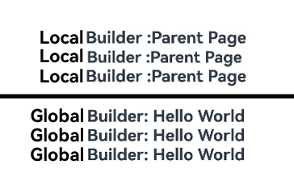

# \@BuilderParam Decorator: Referencing the \@Builder Function


When you create a custom component and want to add a specific function, for example, a click-to-redirect operation, to a specified custom component, if you directly embed an event method into the component, the function will be added to all instances of the custom component. To solve this problem, ArkUI uses the \@BuilderParam decorator to decorate variables pointing to the [\@Builder](./arkts-builder.md) method (that is, @BuilderParam is used to decorate the @Builder function). When initializing a custom component, you can use different methods (such as modifying parameters, trailing closure, or using arrow function) to change values of the custom builder functions decorated by \@BuilderParam and call the \@BuilderParam in a custom component to add specific features. This decorator can be used to declare an element of any UI description, similar to a slot placeholder.


Before reading this topic, you are advised to read [\@Builder](./arkts-builder.md).

> **NOTE**
>
> This decorator can be used in ArkTS widgets since API version 9.
>
> This decorator can be used in atomic services since API version 11.


## Rules of Use


### Initializing \@BuilderParam Decorated Methods

An \@BuilderParam decorated method can be initialized only by an \@Builder function reference.

- Local initialization with the owning component's custom \@Builder function reference or a global \@Builder function reference

  ```ts
  @Builder function overBuilder() {}

  @Component
  struct Child {
    @Builder doNothingBuilder() {};
    // Use the custom builder function of the custom component for @BuilderParam initialization.
    @BuilderParam customBuilderParam: () => void = this.doNothingBuilder;
    // Use the global custom builder function for @BuilderParam initialization.
    @BuilderParam customOverBuilderParam: () => void = overBuilder;
    build(){}
  }
  ```

- Initialization from the parent component

  ```ts
  @Component
  struct Child {
    @Builder customBuilder() {};
    @BuilderParam customBuilderParam: () => void = this.customBuilder;

    build() {
      Column() {
        this.customBuilderParam()
      }
    }
  }

  @Entry
  @Component
  struct Parent {
    @Builder componentBuilder() {
      Text(`Parent builder `)
    }

    build() {
      Column() {
        Child({ customBuilderParam: this.componentBuilder })
      }
    }
  }
  ```
  **Figure 1** Example effect

  


- **this** in the function body must point to the correct object.

  Example:

    ```ts
    @Component
    struct Child {
      label: string = `Child`;
      @Builder customBuilder() {};
      @Builder customChangeThisBuilder() {};
      @BuilderParam customBuilderParam: () => void = this.customBuilder;
      @BuilderParam customChangeThisBuilderParam: () => void = this.customChangeThisBuilder;

      build() {
        Column() {
          this.customBuilderParam()
          this.customChangeThisBuilderParam()
        }
      }
    }

    @Entry
    @Component
    struct Parent {
      label: string = `Parent`;

      @Builder componentBuilder() {
        Text(`${this.label}`)
      }

      build() {
        Column() {
          // When this.componentBuilder() is called, this points to the Parent component decorated by the @Entry. That is, the value of the label variable is Parent.
          this.componentBuilder()
          Child({
            // Pass this.componentBuilder to @BuilderParam customBuilderParam of the Child component. this points to the Child, that is, the value of the label variable is Child.
            customBuilderParam: this.componentBuilder,
            // Pass ():void=>{this.componentBuilder()} to @BuilderParam customChangeThisBuilderParam of the Child component.
            // this of the arrow function points to the host object, so the value of the label variable is Parent.
            customChangeThisBuilderParam: (): void => { this.componentBuilder() }
          })
        }
      }
    }
    ```
  **Figure 2** Example effect

  


## Constraints

- \@BuilderParam decorated variables can be initialized only by using the \@Builder function. For details, see [Initialized Value of @BuilderParam Must Be @Builder](#initialized-value-of-builderparam-must-be-builder).

- When the @Require and \@BuilderParam decorators are used together, the latter must be initialized. For details, see [Using @Require and @BuilderParam Together](#using-require-and-builderparam-together).

- In the scenario where a custom component trailing closure is used, the child component has only one \@BuilderParam to receive this trailing closure, and the \@BuilderParam cannot contain parameters. For details, see [Component Initialization Through Trailing Closure](#component-initialization-through-trailing-closure).

## Use Scenarios

### Component Initialization Through Parameters

An \@BuilderParam decorated method can be a method with or without parameters. Whether it contains parameters should match that of the assigned \@Builder method.

```ts
class Tmp{
  label: string = '';
}

@Builder function overBuilder($$: Tmp) {
  Text($$.label)
    .width(400)
    .height(50)
    .backgroundColor(Color.Green)
}

@Component
struct Child {
  label: string = 'Child';
  @Builder customBuilder() {};
  // Without parameters. The pointed customBuilder does not carry parameters either.
  @BuilderParam customBuilderParam: () => void = this.customBuilder;
  // With parameters. The pointed overBuilder also carries parameters.
  @BuilderParam customOverBuilderParam: ($$: Tmp) => void = overBuilder;

  build() {
    Column() {
      this.customBuilderParam()
      this.customOverBuilderParam({label: 'global Builder label' } )
    }
  }
}

@Entry
@Component
struct Parent {
  label: string = 'Parent';

  @Builder componentBuilder() {
    Text(`${this.label}`)
  }

  build() {
    Column() {
      this.componentBuilder()
      Child({ customBuilderParam: this.componentBuilder, customOverBuilderParam: overBuilder })
    }
  }
}
```
**Figure 3** Example effect


### Component Initialization Through Trailing Closure

In a custom component, the \@BuilderParam decorated attribute can be initialized using a trailing closure. During initialization, the component name is followed by a pair of braces ({}) to form a trailing closure.

> **NOTE**
>
>  - In this scenario, the custom component can have only one \@BuilderParam decorated attribute.
> 
>  - In this scenario, custom components do not support universal attributes.

You can pass the content in the trailing closure to \@BuilderParam as an \@Builder decorated method.

Example 1:

```ts
@Component
struct CustomContainer {
  @Prop header: string = '';
  @Builder closerBuilder(){};
  // Use the trailing closure {} (@Builder decorated method) of the parent component for @BuilderParam initialization.
  @BuilderParam closer: () => void = this.closerBuilder;

  build() {
    Column() {
      Text(this.header)
        .fontSize(30)
      this.closer()
    }
  }
}

@Builder function specificParam(label1: string, label2: string) {
  Column() {
    Text(label1)
      .fontSize(30)
    Text(label2)
      .fontSize(30)
  }
}

@Entry
@Component
struct CustomContainerUser {
  @State text: string = 'header';

  build() {
    Column() {
      // Create the CustomContainer component. During initialization, append a pair of braces ({}) to the component name to form a trailing closure.
      // Used as the parameter passed to CustomContainer @BuilderParam closer: () => void.
      CustomContainer({ header: this.text }) {
        Column() {
          specificParam('testA', 'testB')
        }.backgroundColor(Color.Yellow)
        .onClick(() => {
          this.text = 'changeHeader';
        })
      }
    }
  }
}
```
**Figure 4** Example effect


Use global @Builder and local @Builder to initialize @BuilderParam in the @ComponentV2 decorated custom components through trailing closures.

Example 2:

```ts
@ComponentV2
struct ChildPage {
  @Require @Param message: string = "";
  @Builder customBuilder() {};
  @BuilderParam customBuilderParam: () => void = this.customBuilder;

  build() {
    Column() {
      Text(this.message)
        .fontSize(30)
        .fontWeight(FontWeight.Bold)
      this.customBuilderParam()
    }
  }
}

const builder_value: string = 'Hello World';
@Builder function overBuilder() {
  Row() {
    Text(`Global Builder: ${builder_value}`)
      .fontSize(20)
      .fontWeight(FontWeight.Bold)
  }
}

@Entry
@ComponentV2
struct ParentPage {
  @Local label: string = `Parent Page`;

  @Builder componentBuilder() {
    Row(){
      Text(`Local Builder:${this.label}`)
        .fontSize(20)
        .fontWeight(FontWeight.Bold)
    }
  }

  build() {
    Column() {
      ChildPage({ message: this.label}){
        Column() {  // Use the local @Builder. Column component is followed by braces ({}) to form a trailing closure to initialize the custom component @BuilderParam.
          this.componentBuilder();
        }
      }
      Line()
        .width('100%')
        .height(10)
        .backgroundColor('#000000').margin(10)
      ChildPage({ message: this.label}){  // Use global @Builder. ChildPage component is followed by braces ({}) to form a trailing closure to initialize the custom component @BuilderParam.
        Column() {
          overBuilder();
        }
      }
    }
  }
}
```

### \@BuilderParam Initialization Through Global and Local \@Builder

In a custom component, the \@BuilderParam decorated variable is used to receive the content passed by the parent component through \@Builder for initialization. The \@Builder of the parent component can use the arrow function to change the object that this points to, therefore, when a \@BuilderParam decorated variable is used, different content is displayed.

```ts
@Component
struct ChildPage {
  label: string = `Child Page`;
  @Builder customBuilder() {};
  @BuilderParam customBuilderParam: () => void = this.customBuilder;
  @BuilderParam customChangeThisBuilderParam: () => void = this.customBuilder;

  build() {
    Column() {
      this.customBuilderParam()
      this.customChangeThisBuilderParam()
    }
  }
}

const builder_value: string = 'Hello World';
@Builder function overBuilder() {
  Row() {
    Text(`Global Builder: ${builder_value}`)
      .fontSize(20)
      .fontWeight(FontWeight.Bold)
  }
}

@Entry
@Component
struct ParentPage {
  label: string = `Parent Page`;

  @Builder componentBuilder() {
    Row(){
      Text(`Local Builder:${this.label}`)
        .fontSize(20)
        .fontWeight(FontWeight.Bold)
    }
  }

  build() {
    Column() {
      // When this.componentBuilder() is called, this points to the **ParentPage** component decorated by the @Entry. Therefore, the value of the label variable is Parent Page.
      this.componentBuilder()
      ChildPage({
        // Pass this.componentBuilder to @BuilderParam customBuilderParam of the ChildPage component. this points to ChildPage, that is, the value of the label variable is Child Page.
        customBuilderParam: this.componentBuilder,
        // Pass ():void=>{this.componentBuilder()} to @BuilderParam customChangeThisBuilderParam of the ChildPage component.
        // this of the arrow function points to the host object, so the value of the label variable is Parent Page.
        customChangeThisBuilderParam: (): void => { this.componentBuilder() }
      })
      Line()
        .width('100%')
        .height(10)
        .backgroundColor('#000000').margin(10)
      // When the global overBuilder() is called, this points to the entire current page. Therefore, the displayed content is Hello World.
      overBuilder()
      ChildPage({
        // Pass the global overBuilder to @BuilderParam customBuilderParam of the ChildPage component. this points to the entire current page, that is, the displayed content is Hello World.
        customBuilderParam: overBuilder,
        // Pass the global overBuilder to @BuilderParam customChangeThisBuilderParam of the ChildPage component. this points to the entire current page, that is, the displayed content is Hello World.
        customChangeThisBuilderParam: overBuilder
      })
    }
  }
}
```
**Figure 5** Example effect


### Using @BuilderParam in a @ComponentV2 Decorated Custom Component

Use global @Builder and local @Builder to initialize the @BuilderParam attribute of the @CompoentV2 decorated custom component.

```ts
@ComponentV2
struct ChildPage {
  @Param label: string = `Child Page`;
  @Builder customBuilder() {};
  @BuilderParam customBuilderParam: () => void = this.customBuilder;
  @BuilderParam customChangeThisBuilderParam: () => void = this.customBuilder;

  build() {
    Column() {
      this.customBuilderParam()
      this.customChangeThisBuilderParam()
    }
  }
}

const builder_value: string = 'Hello World';
@Builder function overBuilder() {
  Row() {
    Text(`Global Builder: ${builder_value}`)
      .fontSize(20)
      .fontWeight(FontWeight.Bold)
  }
}

@Entry
@ComponentV2
struct ParentPage {
  @Local label: string = `Parent Page`;

  @Builder componentBuilder() {
    Row(){
      Text(`Local Builder:${this.label}`)
        .fontSize(20)
        .fontWeight(FontWeight.Bold)
    }
  }

  build() {
    Column() {
      // When this.componentBuilder() is called, this points to the **ParentPage** component decorated by the @Entry. Therefore, the value of the label variable is Parent Page.
      this.componentBuilder()
      ChildPage({
        // Pass this.componentBuilder to @BuilderParam customBuilderParam of the ChildPage component. this points to ChildPage, that is, the value of the label variable is Child Page.
        customBuilderParam: this.componentBuilder,
        // Pass ():void=>{this.componentBuilder()} to @BuilderParam customChangeThisBuilderPara of the ChildPage component.
        // this of the arrow function points to the host object, so the value of the label variable is Parent Page.
        customChangeThisBuilderParam: (): void => { this.componentBuilder() }
      })
      Line()
        .width('100%')
        .height(5)
        .backgroundColor('#000000').margin(10)
      // When the global overBuilder() is called, this points to the entire current page. Therefore, the displayed content is Hello World.
      overBuilder()
      ChildPage({
        // Pass the global overBuilder to @BuilderParam customBuilderParam of the ChildPage component. this points to the entire current page, that is, the displayed content is Hello World.
        customBuilderParam: overBuilder,
        // Pass the global overBuilder to @BuilderParam customChangeThisBuilderParam of the ChildPage component. this points to the entire current page, that is, the displayed content is Hello World.
        customChangeThisBuilderParam: overBuilder
      })
    }
  }
}
```
**Figure 6** Example effect




## FAQs

### UI Re-rendering Fails When Content Is Changed

When the custom component **ChildPage** is called, \@Builder is passed as a parameter through **this.componentBuilder**. Currently, this points to the custom component. Therefore, if the **label** value is changed inside the parent component, the custom component **ChildPage** cannot detect the change.

[Incorrect Example]

```ts
@Component
struct ChildPage {
  @State label: string = `Child Page`;
  @Builder customBuilder() {};
  @BuilderParam customChangeThisBuilderParam: () => void = this.customBuilder;

  build() {
    Column() {
      this.customChangeThisBuilderParam()
    }
  }
}

@Entry
@Component
struct ParentPage {
  @State label: string = `Parent Page`;

  @Builder componentBuilder() {
    Row(){
      Text(`Builder :${this.label}`)
        .fontSize(20)
        .fontWeight(FontWeight.Bold)
    }
  }

  build() {
    Column() {
      ChildPage({
        // this points to the ChildPage component.
        customChangeThisBuilderParam: this.componentBuilder
      })
      Button('Click to change label')
        .onClick(() => {
          this.label = 'Hello World';
        })
    }
  }
}
```

Use the arrow function to pass the \@Builder to the custom component **ChildPage** and this points to the parent component **ParentPage**. Therefore, if the value of label is changed in the parent component, the **ChildPage** detects the change and renders the UI again.
The dynamic UI rendering can also be implemented by changing @Builder to @LocalBuilder.

[Correct Example]

```ts
@Component
struct ChildPage {
  @State label: string = `Child Page`;
  @Builder customBuilder() {};
  @BuilderParam customChangeThisBuilderParam: () => void = this.customBuilder;

  build() {
    Column() {
      this.customChangeThisBuilderParam()
    }
  }
}

@Entry
@Component
struct ParentPage {
  @State label: string = `Parent Page`;

  @Builder componentBuilder() {
    Row(){
      Text(`Builder :${this.label}`)
        .fontSize(20)
        .fontWeight(FontWeight.Bold)
    }
  }

  build() {
    Column() {
      ChildPage({
        customChangeThisBuilderParam: () => { this.componentBuilder() }
      })
      Button('Click to change label')
        .onClick(() => {
          this.label = 'Hello World';
        })
    }
  }
}
```

### Using @Require and @BuilderParam Together

The variables decorated by @Require need to be initialized; otherwise, an error is reported during compilation.

[Incorrect Example]

```ts
@Builder function globalBuilder() {
  Text('Hello World')
}

@Entry
@Component
struct customBuilderDemo {
  build() {
    Column() {
      // No value is assigned to ChildBuilder. An error is reported during compilation or editing.
      ChildPage()
    }
  }
}

@Component
struct ChildPage {
  @Require @BuilderParam ChildBuilder: () => void = globalBuilder;
  build() {
    Column() {
      this.ChildBuilder()
    }
  }
}
```

Initialize the variables decorated by @Require. In this case, no error is reported during compilation.

[Correct Example]

```ts
@Builder function globalBuilder() {
  Text('Hello World')
}

@Entry
@Component
struct customBuilderDemo {
  build() {
    Column() {
      ChildPage({ChildBuilder: globalBuilder})
    }
  }
}

@Component
struct ChildPage {
  @Require @BuilderParam ChildBuilder: () => void = globalBuilder;
  build() {
    Column() {
      this.ChildBuilder()
    }
  }
}
```

### Initialized Value of @BuilderParam Must Be @Builder

Use the @State decorated variables to initialize the variables of @BuilderParam decorated child component **ChildBuilder**. An error is reported during compilation.

[Incorrect Example]

```ts
@Builder function globalBuilder() {
  Text('Hello World')
}
@Entry
@Component
struct customBuilderDemo {
  @State message: string = "";
  build() {
    Column() {
      // ChildBuilder receives the variable decorated by @State. An error is reported during compilation or editing.
      ChildPage({ChildBuilder: this.message})
    }
  }
}

@Component
struct ChildPage {
  @BuilderParam ChildBuilder: () => void = globalBuilder;
  build() {
    Column() {
      this.ChildBuilder()
    }
  }
}
```

Use @Builder decorated **globalBuilder()** to initialize the variables of @BuilderParam decorated **ChildBuilder**. No error is reported during compilation.

[Correct Example]

```ts
@Builder function globalBuilder() {
  Text('Hello World')
}
@Entry
@Component
struct customBuilderDemo {
  build() {
    Column() {
      ChildPage({ChildBuilder: globalBuilder})
    }
  }
}

@Component
struct ChildPage {
  @BuilderParam ChildBuilder: () => void = globalBuilder;
  build() {
    Column() {
      this.ChildBuilder()
    }
  }
}
```
