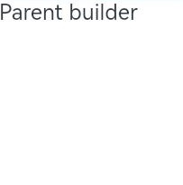
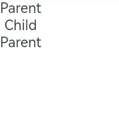
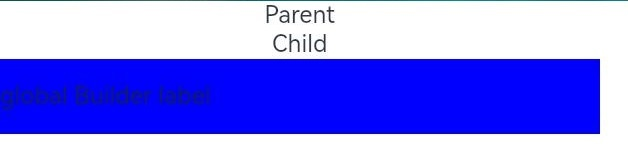
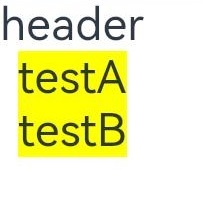

# \@BuilderParam Decorator: @Builder Function Reference


In certain circumstances, you may need to add a specific function, such as a click-to-jump action, to a custom component. However, embedding an event method directly inside of the component will add the function to all places where the component is imported. This is where the \@BuilderParam decorator comes into the picture. \@BuilderParam is used to decorate a custom component member variable of type reference to an \@Builder method. When initializing a custom component, you can assign a value to the variable, thereby adding the specific function to the custom component. This decorator can be used to declare an element of any UI description, similar to a slot placeholder.


> **NOTE**
>
> Since API version 9, this decorator is supported in ArkTS widgets.


## Rules of Use


### Initializing \@BuilderParam Decorated Method

An \@BuilderParam decorated method can be initialized only by an \@Builder function reference.

- Local initialization with the owning component's custom \@Builder function or a global \@Builder function reference

  ```ts
  @Builder function GlobalBuilder0() {}

  @Component
  struct Child {
    @Builder doNothingBuilder() {};

    @BuilderParam aBuilder0: () => void = this.doNothingBuilder;
    @BuilderParam aBuilder1: () => void = GlobalBuilder0;
    build(){}
  }
  ```

- Initialization from the parent component

  ```ts
  @Component
  struct Child {
    @Builder FunABuilder0() {}
    @BuilderParam aBuilder0: () => void = this.FunABuilder0;

    build() {
      Column() {
        this.aBuilder0()
      }
    }
  }

  @Entry
  @Component
  struct Parent {
    @Builder componentBuilder() {
      Text(`Parent builder `)
    }

    build() {
      Column() {
        Child({ aBuilder0: this.componentBuilder })
      }
    }
  }
  ```

  


- **this** in the function body points to the correct object.

  In the following example, when the **Parent** component calls **this.componentBuilder()**, **this** points to the owning component, that is, **Parent**. With **\@BuilderParam aBuilder0** passed to the **Child** component from **\@Builder componentBuilder()**, when the **Child** component calls **this.aBuilder0()**, **this** points to the label of the child component, that is, **Child**. For **\@BuilderParam aBuilder1**, when **this.componentBuilder** is passed to **aBuilder1**, **bind** is called to bind **this**. Therefore, **this.label** points to the label of the parent component.

   >  **NOTE**
   >
   >  Exercise caution when using **bind** to change the context of function invoking, which may cause **this** to point to an incorrect object.

  ```ts
  @Component
  struct Child {
    label: string = `Child`
    @Builder FunABuilder0() {}
    @Builder FunABuilder1() {}
    @BuilderParam aBuilder0: () => void = this.FunABuilder0;
    @BuilderParam aBuilder1: () => void = this.FunABuilder1;

    build() {
      Column() {
        this.aBuilder0()
        this.aBuilder1()
      }
    }
  }

  @Entry
  @Component
  struct Parent {
    label: string = `Parent`

    @Builder componentBuilder() {
      Text(`${this.label}`)
    }

    build() {
      Column() {
        this.componentBuilder()
        Child({ aBuilder0: this.componentBuilder, aBuilder1: ():void=>{this.componentBuilder()} })
      }
    }
  }
  ```

  


## Application Scenarios


### Component Initialization Through Parameters

An \@BuilderParam decorated method can be a method with or without parameters. Whether it contains parameters should match that of the assigned \@Builder method. The type of the \@BuilderParam decorated method must also match that of the assigned \@Builder method.


```ts
class Tmp{
  label:string = ''
}
@Builder function GlobalBuilder1($$ : Tmp) {
  Text($$.label)
    .width(400)
    .height(50)
    .backgroundColor(Color.Blue)
}

@Component
struct Child {
  label: string = 'Child'
  @Builder FunABuilder0() {}
  // Without parameters. The pointed componentBuilder is also without parameters.
  @BuilderParam aBuilder0: () => void = this.FunABuilder0;
  // With parameters. The pointed GlobalBuilder1 is also with parameters.
  @BuilderParam aBuilder1: ($$ : Tmp) => void = GlobalBuilder1;

  build() {
    Column() {
      this.aBuilder0()
      this.aBuilder1({label: 'global Builder label' } )
    }
  }
}

@Entry
@Component
struct Parent {
  label: string = 'Parent'

  @Builder componentBuilder() {
    Text(`${this.label}`)
  }

  build() {
    Column() {
      this.componentBuilder()
      Child({ aBuilder0: this.componentBuilder, aBuilder1: GlobalBuilder1 })
    }
  }
}
```




### Component Initialization Through Trailing Closure

In a custom component, the \@BuilderParam decorated attribute can be initialized using a trailing closure. During initialization, the component name is followed by a pair of braces ({}) to form a trailing closure.

> **NOTE**
>
> In this scenario, the custom component has one and only one \@BuilderParam decorated attribute.

You can pass the content in the trailing closure to \@BuilderParam as an \@Builder decorated method. Example:


```ts
// xxx.ets
@Component
struct CustomContainer {
  @Prop header: string = '';
  @Builder CloserFun(){}
  @BuilderParam closer: () => void = this.CloserFun

  build() {
    Column() {
      Text(this.header)
        .fontSize(30)
      this.closer()
    }
  }
}

@Builder function specificParam(label1: string, label2: string) {
  Column() {
    Text(label1)
      .fontSize(30)
    Text(label2)
      .fontSize(30)
  }
}

@Entry
@Component
struct CustomContainerUser {
  @State text: string = 'header';

  build() {
    Column() {
      // Create the CustomContainer component. During initialization, append a pair of braces ({}) to the component name to form a trailing closure.
      // Used as the parameter passed to CustomContainer @BuilderParam closer: () => void.
      CustomContainer({ header: this.text }) {
        Column() {
          specificParam('testA', 'testB')
        }.backgroundColor(Color.Yellow)
        .onClick(() => {
          this.text = 'changeHeader';
        })
      }
    }
  }
}
```


