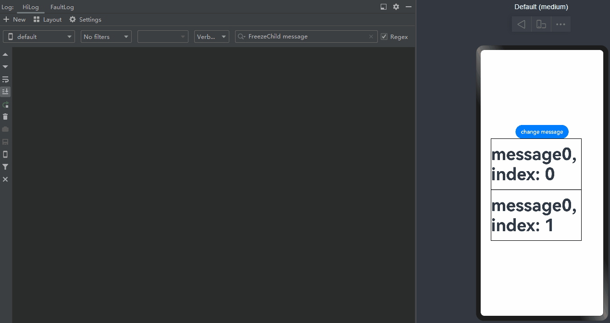
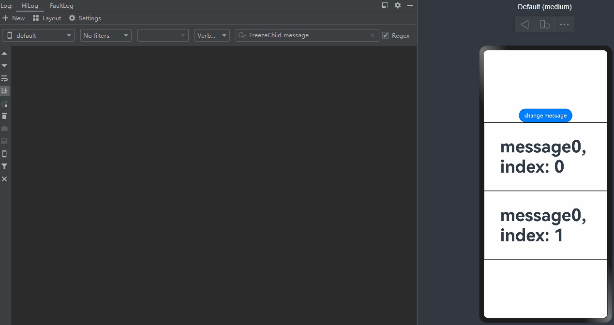
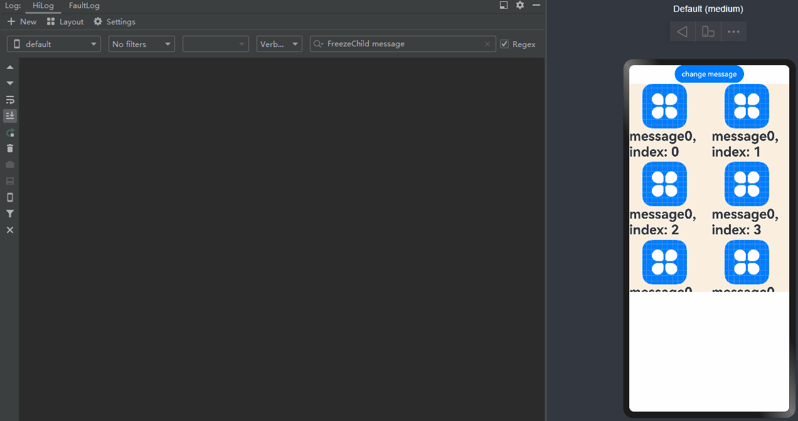

# Freezing a Custom Component

When a custom component is inactive, it can be frozen so that its state variable does not respond to updates. That is, the @Watch decorated method is not called, and the node associated with the state variable is not re-rendered. You can use the **freezeWhenInactive** attribute to specify whether to freeze a custom component. If no parameter is passed in, the feature is disabled. This feature works in following scenarios: page routing, **\<ListItem>**, **\<GridItem>**, **\<TabContent>**, **\<FlowItem>**, and **LazyforEach**.

For scrollable components, such as **\<List>** and **\<Grid>**, whether the components can be frozen during the initial rendering depends on backend implementation. For details, see [Use Scenarios](#use-scenarios).

> **NOTE**
>
> Custom component freezing is supported since API version 11.

## Use Scenarios

### Page Routing

- When page A calls the **router.pushUrl** API to jump to page B, page A is hidden and invisible. In this case, if the state variable on page A is updated, page A is not re-rendered.

- The freezing feature does not work when the application is running in the background.

Page A:

```ts
import router from '@ohos.router';

@Entry
@Component({ freezeWhenInactive: true })
struct FirstTest {
  @StorageLink('PropA')@Watch("first") storLink: number = 47;
  first(){
    console.info("first page "+ `${this.storLink}`)
  }

  build() {
    Column() {
      Text(`From fist Page ${this.storLink}`).fontSize(50)
      Button('first page storLink + 1').fontSize(30)
        .onClick(() => {
          this.storLink += 1
        })
      Button('go to next page').fontSize(30)
        .onClick(() => {
          router.pushUrl({url: 'pages/second'})
        })
    }
  }
}
```

Page B:

```ts
import router from '@ohos.router';
@Entry
@Component({ freezeWhenInactive: true })
struct SeconedTest {
  @StorageLink('PropA') @Watch("seconed") storLink2: number = 1;

  seconed() {
    console.info("seconed page: " + `${this.storLink2}`)
  }

  build() {
    Column() {

      Text(`seconed Page ${this.storLink2}`).fontSize(50)
      Button('Change Divider.strokeWidth')
        .onClick(() => {
          router.back()
        })

      Button('second page storLink2 + 2').fontSize(30)
        .onClick(() => {
          this.storLink2 += 2
        })

    }
  }
}
```

In the preceding example:

1. When **Button first page storLink + 1** on page A is clicked, the **storLink** state variable is updated, and the @Watch decorated **first()** method is called. 
2. Through **router.pushUrl({url:'pages/second'})**, page B is displayed, and page A is hidden with its state changing from active to inactive. 
3. When **Button this.storLink2 += 2** on page B is clicked, only the @Watch decorated **seconed()** method of page B is called, because page A has been frozen when inactive. 
4. When the back button is clicked, page B is destroyed, and page A changes from inactive to active. At this time, if the state variable of page A is updated, the @Watch decorated **first()** method of page A is called again.

### \<ListItem>

- You can freeze list items when they are beyond the list content area so that they do not trigger UI re-rendering. After a list item is moved beyond the list item area, it switches from active to inactive.

- In the following example, **@Component({freezeWhenInactive: true})** is set for the **FreezeChild** component, which means that it is frozen when inactive. In this case, the component delays the update notification of all state variables.

- When the component becomes active again, the state variables that change when the component is frozen are updated.

- Note that during initial rendering, the child components of **\<ListItem>** are loaded only when needed. That is, only ones that are being displayed and cached are created. If **cachedCount** is not set, the default value **1** is used.  
  - During list scrolling, when a cached list item enters the content area, its child switches from inactive to active, and the @Watch decorated method is called. When a list item that is not cached enters the list content area for the first time, its child is created, with no state switching involved.
  - When a list item is moved out of the list content area, its child switches from active to inactive.

```ts
@Entry
@Component
struct Page {
  @State @Watch("onMessageUpdated") message: number = 0
  onMessageUpdated() {
    console.info(`Page message callback func ${this.message}`)
  }

  build() {
    Row() {
      Column() {
        Button('change message').onClick(() => {
          this.message++
        })
        List() {
          ListItem() {
            FreezeChild({message: this.message, index: 0})
          }.height('50%').border({width: 1})

          ListItem() {
            FreezeChild({message: this.message,  index: 1})
          }.height('50%').border({width: 1})

          ListItem() {
            FreezeChild({message: this.message,  index: 2})
          }.height('50%').border({width: 1})

          ListItem() {
            FreezeChild({message: this.message, index: 3})
          }.height('50%').border({width: 1})

          ListItem() {
            FreezeChild({message: this.message, index: 4})
          }.height('50%').border({width: 1})

          ListItem() {
            FreezeChild({message: this.message, index: 5})
          }.height('50%').border({width: 1})
        }.height('300').width('300')

      }
      .width('100%')
    }
    .height('100%')
  }
}
@Component({ freezeWhenInactive: true })
struct FreezeChild {
  @Link @Watch("onMessageUpdated") message: number
  private index: number = 0
  onMessageUpdated() {
    console.info(`FreezeChild message callback func ${this.message}, index: ${this.index}`)
  }
  build() {
    Text("message" + `${this.message}, index: ${this.index}`)
      .fontSize(50)
      .fontWeight(FontWeight.Bold)
  }
}
```

In the preceding example:

1. When **change message** is clicked, the value of **message** changes, and the @Watch decorated **onMessageUpdated()** method of the list items being displayed is called. 
2. When a list item moves from outside the list content area into the list content area, it switches from inactive to active, and the corresponding @Watch decorated **onMessageUpdated()** method is called. 
3. When **change message** is clicked again, the value of **message** changes, and only the @Watch decorated **onMessageUpdated()** method of the list items being displayed is called.



### \<GridItem>

- You can freeze grid items when they are beyond the grid content area so that they do not trigger UI re-rendering.

- During initial rendering, unlike list items, which are loaded only when needed, grid items and their children are created at once.
  - When a grid item moves into the grid content area, it child switches from inactive to active.
  - When a grid item leaves the grid content area, it child switches from active to inactive.

```ts
@Entry
@Component
struct Page {
  @State @Watch("onMessageUpdated") message: number = 0
  onMessageUpdated() {
    console.info(`Page message callback func ${this.message}`)
  }

  build() {
    Row() {
      Column() {
        Button('change message').onClick(() => {
          this.message++;
        })

        Grid() {
          GridItem() {
            FreezeChild({message: this.message, index: 0})
          }.border({width: 1}).height('50%')

          GridItem() {
            FreezeChild({message: this.message,  index: 1})
          }.border({width: 1}).height('50%')

          GridItem() {
            FreezeChild({message: this.message,  index: 2})
          }.border({width: 1}).height('50%')

          GridItem() {
            FreezeChild({message: this.message, index: 3})
          }.border({width: 1}).height('50%')

          GridItem() {
            FreezeChild({message: this.message, index: 4})
          }.border({width: 1}).height('50%')

          GridItem() {
            FreezeChild({message: this.message, index: 5})
          }.height('50%').border({width: 1})

        }
        .height(400)
        .columnsTemplate('1fr')
      }
      .width('100%')
    }
    .height('100%')
  }
}
@Component({ freezeWhenInactive: true })
struct FreezeChild {
  @Link @Watch("onMessageUpdated") message: number
  private index: number = 0
  onMessageUpdated() {
    console.info(`FreezeChild message callback func ${this.message}, index: ${this.index}`)
  }
  build() {
    Text("message" + `${this.message}, index: ${this.index}`)
      .fontSize(50)
      .fontWeight(FontWeight.Bold)
  }
}
```

In the preceding example:

1. When **change message** is clicked, the value of **message** changes, and the @Watch decorated **onMessageUpdated()** method of the grid items being displayed is called. 
2. When a grid item moves from outside the grid content area into the grid content area, it switches from inactive to active, and the corresponding @Watch decorated **onMessageUpdated()** method is called. 
3. When **change message** is clicked again, the value of **message** changes, and only the @Watch decorated **onMessageUpdated()** method of the grid items being displayed is called.



### \<TabContent>

- You can freeze invisible **\<TabContent>** components in the **\<Tabs>** container so that they do not trigger UI re-rendering.

- During initial rendering, only the **\<TabContent>** component that is being displayed is created. All **\<TabContent>** components are created only after all of them have been switched to.

```ts
@Entry
@Component
struct TabContentTest {
  @State @Watch("onMessageUpdated") message: number = 0
  onMessageUpdated() {
    console.info(`TabContent message callback func ${this.message}`)
  }

  build() {
    Row() {
      Column() {
        Button('change message').onClick(() => {
          this.message++
        })

        Tabs() {
          TabContent() {
            FreezeChild({message: this.message})
          }
          TabContent() {
            FreezeChild({message: this.message})
          }
        }
      }
      .width('100%')
    }
    .height('100%')
  }
}
@Component({ freezeWhenInactive: true })
struct FreezeChild {
  @Link @Watch("onMessageUpdated") message: number
  private index: number = 0
  onMessageUpdated() {
    console.info(`FreezeChild message callback func ${this.message}, index: ${this.index}`)
  }
  build() {
    Text("message" + `${this.message}, index: ${this.index}`)
      .fontSize(50)
      .fontWeight(FontWeight.Bold)
  }
}
```

In the preceding example:

1. When **change message** is clicked, the value of **message** changes, and the @Watch decorated **onMessageUpdated()** method of the **\<TabContent>** component being displayed is called. 
2. After you switch to another **\<TabContent>** component, the current **\<TabContent>** switches from inactive to active, and the corresponding @Watch decorated **onMessageUpdated()** method is called. 
3. When **change message** is clicked again, the value of **message** changes, and only the @Watch decorated **onMessageUpdated()** method of the **\<TabContent>** component being displayed is called.


### \<FlowItem>

- You can freeze invisible **\<FlowItem>** components in the **\<WaterFlow>** container so that they do not trigger UI re-rendering.

- During initial rendering, unlike list items, which are loaded only when needed, the **\<FlowItem>** components and their children are created at once.
  - When a **\<FlowItem>** component moves into the **\<WaterFlow>** content area, it child switches from inactive to active.
  - When a **\<FlowItem>** component leaves the **\<WaterFlow>** content area, it child switches from active to inactive.

```ts
@Entry
@Component
struct WaterflowTest {
  @State @Watch("onMessageUpdated") message: number = 0
  onMessageUpdated() {
    console.info(`Waterflow message callback func ${this.message}`)
  }
  build() {
    Column({ space: 2 }) {
      Button('change message').onClick(() => {
        this.message++
      })
      WaterFlow() {
        FlowItem() {
          FreezeChild({message: this.message, index: 0})
        }
        FlowItem() {
          FreezeChild({message: this.message, index: 1})
        }
        FlowItem() {
          FreezeChild({message: this.message, index: 2})
        }
        FlowItem() {
          FreezeChild({message: this.message, index: 3})
        }
        FlowItem() {
          FreezeChild({message: this.message, index: 4})
        }
        FlowItem() {
          FreezeChild({message: this.message, index: 5})
        }
        FlowItem() {
          FreezeChild({message: this.message, index: 6})
        }
        FlowItem() {
          FreezeChild({message: this.message, index: 7})
        }
        FlowItem() {
          FreezeChild({message: this.message, index: 8})
        }
        FlowItem() {
          FreezeChild({message: this.message, index: 9})
        }
        FlowItem() {
          FreezeChild({message: this.message, index: 10})
        }
        FlowItem() {
          FreezeChild({message: this.message, index: 11})
        }
        FlowItem() {
          FreezeChild({message: this.message, index: 12})
        }
      }
      .columnsTemplate("1fr 1fr")
      .columnsGap(10)
      .rowsGap(5)
      .backgroundColor(0xFAEEE0)
      .width('100%')
      .height('60%')
    }
  }
}

@Component({ freezeWhenInactive: true })
struct FreezeChild {
  @Link @Watch("onMessageUpdated") message: number
  private index: number = 0
  onMessageUpdated() {
    console.info(`FreezeChild message callback func ${this.message}, index: ${this.index}`)
  }
  build() {
    Column(){
      Image($r('app.media.icon')).height(100)
      Text("message" + `${this.message}, index: ${this.index}`)
        .fontSize(30)
        .fontWeight(FontWeight.Bold)
    }
  }
}
```

In the preceding example:

1. When **change message** is clicked, the value of **message** changes, and the @Watch decorated **onMessageUpdated()** method of the **\<FlowItem>** components being displayed is called. 
2. When a **\<FlowItem>** component moves from outside the **\<WaterFlow>** content area into the **\<WaterFlow>** content area, it switches from inactive to active, and the corresponding @Watch decorated **onMessageUpdated()** method is called. 
3. When **change message** is clicked again, the value of **message** changes, and only the @Watch decorated **onMessageUpdated()** method of the **\<FlowItem>** components being displayed is called.



### LazyforEach

- You can freeze custom components cached in **LazyforEach** so that they do not trigger UI re-rendering.

```ts
// Basic implementation of IDataSource to handle data listener
class BasicDataSource implements IDataSource {
  private listeners: DataChangeListener[] = [];
  private originDataArray: string[] = [];

  public totalCount(): number {
    return 0;
  }

  public getData(index: number): string {
    return this.originDataArray[index];
  }

  // This method is called by the framework to add a listener to the LazyForEach data source.
  registerDataChangeListener(listener: DataChangeListener): void {
    if (this.listeners.indexOf(listener) < 0) {
      console.info('add listener');
      this.listeners.push(listener);
    }
  }

  // This method is called by the framework to remove the listener from the LazyForEach data source.
  unregisterDataChangeListener(listener: DataChangeListener): void {
    const pos = this.listeners.indexOf(listener);
    if (pos >= 0) {
      console.info('remove listener');
      this.listeners.splice(pos, 1);
    }
  }

  // Notify LazyForEach that all child components need to be reloaded.
  notifyDataReload(): void {
    this.listeners.forEach(listener => {
      listener.onDataReloaded();
    })
  }

  // Notify LazyForEach that a child component needs to be added for the data item with the specified index.
  notifyDataAdd(index: number): void {
    this.listeners.forEach(listener => {
      listener.onDataAdd(index);
    })
  }

  // Notify LazyForEach that the data item with the specified index has changed and the child component needs to be rebuilt.
  notifyDataChange(index: number): void {
    this.listeners.forEach(listener => {
      listener.onDataChange(index);
    })
  }

  // Notify LazyForEach that the child component that matches the specified index needs to be deleted.
  notifyDataDelete(index: number): void {
    this.listeners.forEach(listener => {
      listener.onDataDelete(index);
    })
  }
}

class MyDataSource extends BasicDataSource {
  private dataArray: string[] = [];

  public totalCount(): number {
    return this.dataArray.length;
  }

  public getData(index: number): string {
    return this.dataArray[index];
  }

  public addData(index: number, data: string): void {
    this.dataArray.splice(index, 0, data);
    this.notifyDataAdd(index);
  }

  public pushData(data: string): void {
    this.dataArray.push(data);
    this.notifyDataAdd(this.dataArray.length - 1);
  }
}

@Entry
@Component
struct LforEachTest {
  private data: MyDataSource = new MyDataSource();
  @State @Watch("onMessageUpdated") message: number = 0

  onMessageUpdated() {
    console.info(`LazyforEach message callback func ${this.message}`)
  }
  aboutToAppear() {
    for (let i = 0; i <= 20; i++) {
      this.data.pushData(`Hello ${i}`)
    }
  }

  build() {
    Column() {
      Button('change message').onClick(() => {
        this.message++
      })
      List({ space: 3 }) {
        LazyForEach(this.data, (item: string) => {
          ListItem() {
            FreezeChild({message: this.message})
          }
        }, (item: string) => item)
      }.cachedCount(5).height(500)
    }

  }
}

@Component({ freezeWhenInactive: true })
struct FreezeChild {
  @Link @Watch("onMessageUpdated") message: number
  private index: number = 0

  aboutToAppear() {
    console.info(`FreezeChild aboutToAppear index: ${this.index}`)
  }

  onMessageUpdated() {
    console.info(`FreezeChild message callback func ${this.message}, index: ${this.index}`)
  }
  build() {
    Text("message" + `${this.message}, index: ${this.index}`)
      .width('90%')
      .height(160)
      .backgroundColor(0xAFEEEE)
      .textAlign(TextAlign.Center)
      .fontSize(30)
      .fontWeight(FontWeight.Bold)
  }
}
```

In the preceding example:

1. When **change message** is clicked, the value of **message** changes, and the @Watch decorated **onMessageUpdated()** method of the list items being displayed is called. The @Watch decorated **onMessageUpdated()** method of the cached list items is not called. (If the component is not frozen, the @Watch decorated **onMessageUpdated()** method of both list items that are being displayed and cached list items is called.)   
2. When a list item moves from outside the list content area into the list content area, it switches from inactive to active, and the corresponding @Watch decorated **onMessageUpdated()** method is called. 
3. When **change message** is clicked again, the value of **message** changes, and only the @Watch decorated **onMessageUpdated()** method of the list items being displayed is called.


