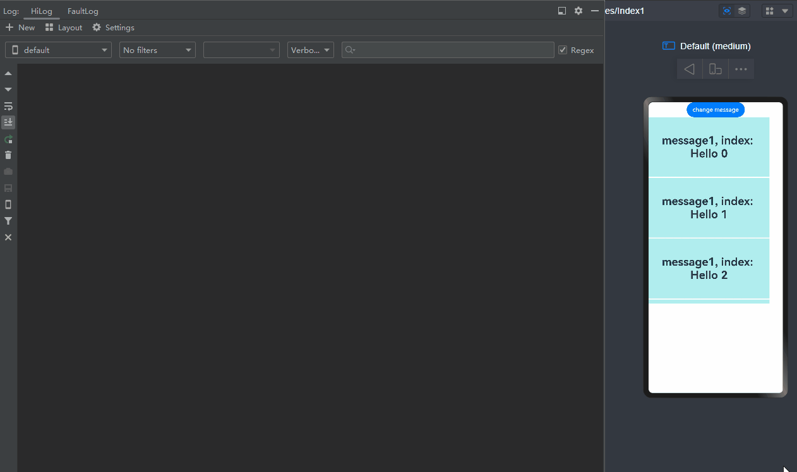

# Freezing a Custom Component

When a custom component is inactive, it can be frozen so that its state variable does not respond to updates. That is, the @Watch decorated method is not called, and the node associated with the state variable is not re-rendered. You can use the **freezeWhenInactive** attribute to specify whether to freeze a custom component. If no parameter is passed in, the feature is disabled. This feature works in following scenarios: page routing, **\<TabContent>**, **LazyForEach**, and **\<Navigation>**.


> **NOTE**
>
> Custom component freezing is supported since API version 11.

## Use Scenarios

### Page Routing

- When page A calls the **router.pushUrl** API to jump to page B, page A is hidden and invisible. In this case, if the state variable on page A is updated, page A is not re-rendered.

- The freezing feature does not work when the application is running in the background.

Page A:

```ts
import { router } from '@kit.ArkUI';

@Entry
@Component({ freezeWhenInactive: true })
struct FirstTest {
  @StorageLink('PropA') @Watch("first") storageLink: number = 47;

  first() {
    console.info("first page " + `${this.storageLink}`)
  }

  build() {
    Column() {
      Text(`From fist Page ${this.storageLink}`).fontSize(50)
      Button('first page storageLink + 1').fontSize(30)
        .onClick(() => {
          this.storageLink += 1
        })
      Button('go to next page').fontSize(30)
        .onClick(() => {
          router.pushUrl({ url: 'pages/second' })
        })
    }
  }
}
```

Page B:

```ts
import { router } from '@kit.ArkUI';

@Entry
@Component({ freezeWhenInactive: true })
struct SecondTest {
  @StorageLink('PropA') @Watch("second") storageLink2: number = 1;

  second() {
    console.info("second page: " + `${this.storageLink2}`)
  }

  build() {
    Column() {

      Text(`second Page ${this.storageLink2}`).fontSize(50)
      Button('Change Divider.strokeWidth')
        .onClick(() => {
          router.back()
        })

      Button('second page storageLink2 + 2').fontSize(30)
        .onClick(() => {
          this.storageLink2 += 2
        })

    }
  }
}
```

In the preceding example:

1. When the button **first page storageLink + 1** on page A is clicked, the **storageLink** state variable is updated, and the @Watch decorated **first** method is called.

2. Through **router.pushUrl({url:'pages/second'})**, page B is displayed, and page A is hidden with its state changing from active to inactive.

3. When the button **this.storageLink2 += 2** on page B is clicked, only the @Watch decorated **second** method of page B is called, because page A has been frozen when inactive.

4. When the **back** button is clicked, page B is destroyed, and page A changes from inactive to active. At this time, if the state variable of page A is updated, the @Watch decorated **first** method of page A is called again.


### TabContent

- You can freeze invisible **TabContent** components in the **Tabs** container so that they do not trigger UI re-rendering.

- During initial rendering, only the **TabContent** component that is being displayed is created. All **TabContent** components are created only after all of them have been switched to.

```ts
@Entry
@Component
struct TabContentTest {
  @State @Watch("onMessageUpdated") message: number = 0;
  private data: number[] = [0, 1]

  onMessageUpdated() {
    console.info(`TabContent message callback func ${this.message}`)
  }

  build() {
    Row() {
      Column() {
        Button('change message').onClick(() => {
          this.message++
        })

        Tabs() {
          ForEach(this.data, (item: number) => {
            TabContent() {
              FreezeChild({ message: this.message, index: item })
            }.tabBar(`tab${item}`)
          }, (item: number) => item.toString())
        }
      }
      .width('100%')
    }
    .height('100%')
  }
}

@Component({ freezeWhenInactive: true })
struct FreezeChild {
  @Link @Watch("onMessageUpdated") message: number
  private index: number = 0

  onMessageUpdated() {
    console.info(`FreezeChild message callback func ${this.message}, index: ${this.index}`)
  }

  build() {
    Text("message" + `${this.message}, index: ${this.index}`)
      .fontSize(50)
      .fontWeight(FontWeight.Bold)
  }
}
```

In the preceding example:

1. When **change message** is clicked, the value of **message** changes, and the @Watch decorated **onMessageUpdated** method of the **TabContent** component being displayed is called.

2. When you click **two** to switch to another **TabContent** component, it switches from inactive to active, and the corresponding @Watch decorated **onMessageUpdated** method is called.

3. When **change message** is clicked again, the value of **message** changes, and only the @Watch decorated **onMessageUpdated** method of the **TabContent** component being displayed is called.


### LazyForEach

- You can freeze custom components cached in **LazyForEach** so that they do not trigger UI re-rendering.

```ts
// Basic implementation of IDataSource to handle data listener
class BasicDataSource implements IDataSource {
  private listeners: DataChangeListener[] = [];
  private originDataArray: string[] = [];

  public totalCount(): number {
    return 0;
  }

  public getData(index: number): string {
    return this.originDataArray[index];
  }

  // This method is called by the framework to add a listener to the LazyForEach data source.
  registerDataChangeListener(listener: DataChangeListener): void {
    if (this.listeners.indexOf(listener) < 0) {
      console.info('add listener');
      this.listeners.push(listener);
    }
  }

  // This method is called by the framework to remove the listener from the LazyForEach data source.
  unregisterDataChangeListener(listener: DataChangeListener): void {
    const pos = this.listeners.indexOf(listener);
    if (pos >= 0) {
      console.info('remove listener');
      this.listeners.splice(pos, 1);
    }
  }

  // Notify LazyForEach that all child components need to be reloaded.
  notifyDataReload(): void {
    this.listeners.forEach(listener => {
      listener.onDataReloaded();
    })
  }

  // Notify LazyForEach that a child component needs to be added for the data item with the specified index.
  notifyDataAdd(index: number): void {
    this.listeners.forEach(listener => {
      listener.onDataAdd(index);
    })
  }

  // Notify LazyForEach that the data item with the specified index has changed and the child component needs to be rebuilt.
  notifyDataChange(index: number): void {
    this.listeners.forEach(listener => {
      listener.onDataChange(index);
    })
  }

  // Notify LazyForEach that the child component that matches the specified index needs to be deleted.
  notifyDataDelete(index: number): void {
    this.listeners.forEach(listener => {
      listener.onDataDelete(index);
    })
  }
}

class MyDataSource extends BasicDataSource {
  private dataArray: string[] = [];

  public totalCount(): number {
    return this.dataArray.length;
  }

  public getData(index: number): string {
    return this.dataArray[index];
  }

  public addData(index: number, data: string): void {
    this.dataArray.splice(index, 0, data);
    this.notifyDataAdd(index);
  }

  public pushData(data: string): void {
    this.dataArray.push(data);
    this.notifyDataAdd(this.dataArray.length - 1);
  }
}

@Entry
@Component
struct LforEachTest {
  private data: MyDataSource = new MyDataSource();
  @State @Watch("onMessageUpdated") message: number = 0;

  onMessageUpdated() {
    console.info(`LazyforEach message callback func ${this.message}`)
  }

  aboutToAppear() {
    for (let i = 0; i <= 20; i++) {
      this.data.pushData(`Hello ${i}`)
    }
  }

  build() {
    Column() {
      Button('change message').onClick(() => {
        this.message++
      })
      List({ space: 3 }) {
        LazyForEach(this.data, (item: string) => {
          ListItem() {
            FreezeChild({ message: this.message, index: item })
          }
        }, (item: string) => item)
      }.cachedCount(5).height(500)
    }

  }
}

@Component({ freezeWhenInactive: true })
struct FreezeChild {
  @Link @Watch("onMessageUpdated") message: number;
  private index: string = "";

  aboutToAppear() {
    console.info(`FreezeChild aboutToAppear index: ${this.index}`)
  }

  onMessageUpdated() {
    console.info(`FreezeChild message callback func ${this.message}, index: ${this.index}`)
  }

  build() {
    Text("message" + `${this.message}, index: ${this.index}`)
      .width('90%')
      .height(160)
      .backgroundColor(0xAFEEEE)
      .textAlign(TextAlign.Center)
      .fontSize(30)
      .fontWeight(FontWeight.Bold)
  }
}
```

In the preceding example:

1. When **change message** is clicked, the value of **message** changes, the @Watch decorated **onMessageUpdated** method of the list items being displayed is called, and that of the cached list items is not called. (If the component is not frozen, the @Watch decorated **onMessageUpdated** method of both list items that are being displayed and cached list items is called.)

2. When a list item moves from outside the list content area into the list content area, it switches from inactive to active, and the corresponding @Watch decorated **onMessageUpdated** method is called.

3. When **change message** is clicked again, the value of **message** changes, and only the @Watch decorated **onMessageUpdated** method of the list items being displayed is called.



### Navigation

- When the navigation destination page is invisible, its child custom components are set to the inactive state and will not be re-rendered. When return to this page, its child custom components are restored to the active state and the @Watch callback is triggered to re-render the page.

- In the following example, **NavigationContentMsgStack** is set to the inactive state, which does not respond to the change of the state variables, and does not trigger component re-rendering.

```ts
@Entry
@Component
struct MyNavigationTestStack {
  @Provide('pageInfo') pageInfo: NavPathStack = new NavPathStack();
  @State @Watch("info") message: number = 0;
  @State logNumber: number = 0;

  info() {
    console.info(`freeze-test MyNavigation message callback ${this.message}`);
  }

  @Builder
  PageMap(name: string) {
    if (name === 'pageOne') {
      pageOneStack({ message: this.message, logNumber: this.logNumber })
    } else if (name === 'pageTwo') {
      pageTwoStack({ message: this.message, logNumber: this.logNumber })
    } else if (name === 'pageThree') {
      pageThreeStack({ message: this.message, logNumber: this.logNumber })
    }
  }

  build() {
    Column() {
      Button('change message')
        .onClick(() => {
          this.message++;
        })
      Navigation(this.pageInfo) {
        Column() {
          Button('Next Page', { stateEffect: true, type: ButtonType.Capsule })
            .width('80%')
            .height(40)
            .margin(20)
            .onClick(() => {
              this.pageInfo.pushPath({ name: 'pageOne' }); // Push the navigation destination page specified by name to the navigation stack.
            })
        }
      }.title('NavIndex')
      .navDestination(this.PageMap)
      .mode(NavigationMode.Stack)
    }
  }
}

@Component
struct pageOneStack {
  @Consume('pageInfo') pageInfo: NavPathStack;
  @State index: number = 1;
  @Link message: number;
  @Link logNumber: number;

  build() {
    NavDestination() {
      Column() {
        NavigationContentMsgStack({ message: this.message, index: this.index, logNumber: this.logNumber })
        Text("cur stack size:" + `${this.pageInfo.size()}`)
          .fontSize(30)
          .fontWeight(FontWeight.Bold)
        Button('Next Page', { stateEffect: true, type: ButtonType.Capsule })
          .width('80%')
          .height(40)
          .margin(20)
          .onClick(() => {
            this.pageInfo.pushPathByName('pageTwo', null);
          })
        Button('Back Page', { stateEffect: true, type: ButtonType.Capsule })
          .width('80%')
          .height(40)
          .margin(20)
          .onClick(() => {
            this.pageInfo.pop();
          })
      }.width('100%').height('100%')
    }.title('pageOne')
    .onBackPressed(() => {
      this.pageInfo.pop();
      return true;
    })
  }
}

@Component
struct pageTwoStack {
  @Consume('pageInfo') pageInfo: NavPathStack;
  @State index: number = 2;
  @Link message: number;
  @Link logNumber: number;

  build() {
    NavDestination() {
      Column() {
        NavigationContentMsgStack({ message: this.message, index: this.index, logNumber: this.logNumber })
        Text("cur stack size:" + `${this.pageInfo.size()}`)
          .fontSize(30)
          .fontWeight(FontWeight.Bold)
        Button('Next Page', { stateEffect: true, type: ButtonType.Capsule })
          .width('80%')
          .height(40)
          .margin(20)
          .onClick(() => {
            this.pageInfo.pushPathByName('pageThree', null);
          })
        Button('Back Page', { stateEffect: true, type: ButtonType.Capsule })
          .width('80%')
          .height(40)
          .margin(20)
          .onClick(() => {
            this.pageInfo.pop();
          })
      }.width('100%').height('100%')
    }.title('pageTwo')
    .onBackPressed(() => {
      this.pageInfo.pop();
      return true;
    })
  }
}

@Component
struct pageThreeStack {
  @Consume('pageInfo') pageInfo: NavPathStack;
  @State index: number = 3;
  @Link message: number;
  @Link logNumber: number;

  build() {
    NavDestination() {
      Column() {
        NavigationContentMsgStack({ message: this.message, index: this.index, logNumber: this.logNumber })
        Text("cur stack size:" + `${this.pageInfo.size()}`)
          .fontSize(30)
          .fontWeight(FontWeight.Bold)
        Button('Next Page', { stateEffect: true, type: ButtonType.Capsule })
          .width('80%')
          .height(40)
          .margin(20)
          .onClick(() => {
            this.pageInfo.pushPathByName('pageOne', null);
          })
        Button('Back Page', { stateEffect: true, type: ButtonType.Capsule })
          .width('80%')
          .height(40)
          .margin(20)
          .onClick(() => {
            this.pageInfo.pop();
          })
      }.width('100%').height('100%')
    }.title('pageThree')
    .onBackPressed(() => {
      this.pageInfo.pop();
      return true;
    })
  }
}

@Component({ freezeWhenInactive: true })
struct NavigationContentMsgStack {
  @Link @Watch("info") message: number;
  @Link index: number;
  @Link logNumber: number;

  info() {
    console.info(`freeze-test NavigationContent message callback ${this.message}`);
    console.info(`freeze-test ---- called by content ${this.index}`);
    this.logNumber++;
  }

  build() {
    Column() {
      Text("msg:" + `${this.message}`)
        .fontSize(30)
        .fontWeight(FontWeight.Bold)
      Text("log number:" + `${this.logNumber}`)
        .fontSize(30)
        .fontWeight(FontWeight.Bold)
    }
  }
}
```

In the preceding example:

1. When **change message** is clicked, the value of **message** changes, and the @Watch decorated **info** method of the **MyNavigationTestStack** component being displayed is called.

2. When **Next Page** is clicked, **PageOne** is displayed, and the **PageOneStack** node is created.

3. When **change message** is clicked again, the value of **message** changes, and only the @Watch decorated **info** method of the **NavigationContentMsgStack** child component in **pageOneStack** is called.

4. When **Next Page** is clicked again, **PageTwo** is displayed, and the **pageTwoStack** node is created.

5. When **change message** is clicked again, the value of **message** changes, and only the @Watch decorated **info** method of the **NavigationContentMsgStack** child component in **pageTwoStack** is called.

6. When **Next Page** is clicked again, **PageThree** is displayed, and the **pageThreeStack** node is created.

7. When **change message** is clicked again, the value of **message** changes, and only the @Watch decorated **info** method of the **NavigationContentMsgStack** child component in **pageThreeStack** is called.

8. When **Back Page** is clicked, **PageTwo** is displayed, and only the @Watch decorated **info** method of the **NavigationContentMsgStack** child component in **pageTwoStack** is called.

9. When **Back Page** is clicked again, **PageOne** is displayed, and only the @Watch decorated **info** method of the **NavigationContentMsgStack** child component in **PageOne** is called.

10. When **Back Page** is clicked again, the initial page is displayed, and no method is called.


