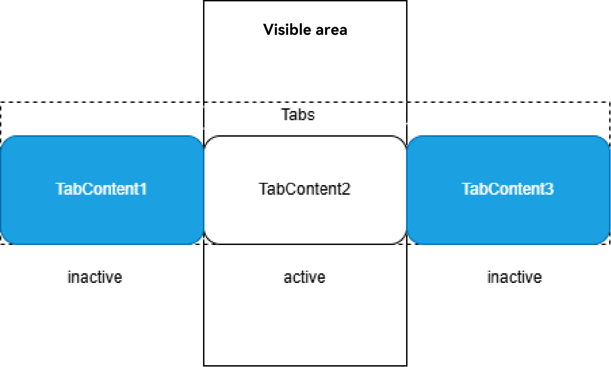
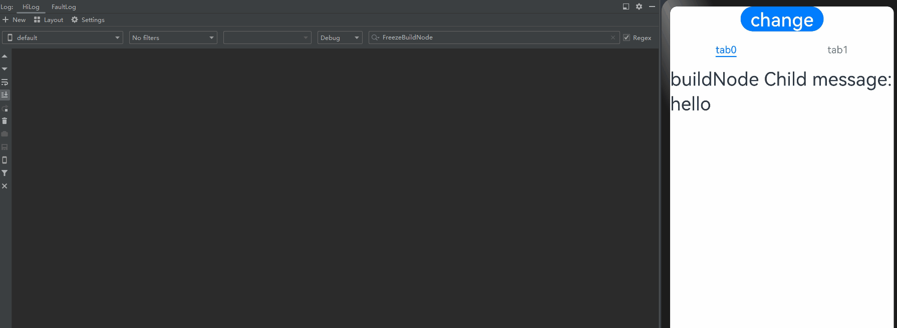

# Freezing a Custom Component

When a custom component decorated by @ComponentV2 is inactive, it can be frozen so that its state variable does not respond to updates. That is, the @Monitor decorated method is not called, and the node associated with the state variable is not re-rendered. You can use the **freezeWhenInactive** attribute to specify whether to freeze a custom component. If no parameter is passed in, the feature is disabled. This feature works in following scenarios: page routing, **TabContent**, and **Navigation**.

Before reading this topic, you are advised to read [\@ComponentV2](./arkts-new-componentV2.md).

> **NOTE**
>
> @ComponentV2 decorated custom component freezing is supported since API version 12.
>
> Mixed use of custom component freezing is supported since API version 16.
>
> Different from freezing the @Component decorated components, custom components decorated by @ComponentV2 do not support freezing the cached list items in the **LazyForEach** scenario.


## Use Scenarios

### Page Routing

> **NOTE**
>
> This example uses router for page redirection but you are advised to use the **Navigation** component instead, because **Navigation** provides more functions and more flexible customization capabilities. For details, see the use cases of [Navigation](#navigation).

- When page 1 calls the **router.pushUrl** API to jump to page 2, page 1 is hidden and invisible. In this case, if the state variable on page 1 is updated, page 1 is not re-rendered.
For details, see the following.


Page 1

```ts
import { router } from '@kit.ArkUI';

@ObservedV2
export class Book {
  @Trace name: string = "100";

  constructor(page: string) {
    this.name = page;
  }
}

@Entry
@ComponentV2({ freezeWhenInactive: true })
export struct Page1 {
  @Local bookTest: Book = new Book("A Midsummer Night's Dream");

  @Monitor("bookTest.name")
  onMessageChange(monitor: IMonitor) {
    console.log(`The book name change from ${monitor.value()?.before} to ${monitor.value()?.now}`);
  }

  build() {
    Column() {
      Text(`Book name is ${this.bookTest.name}`).fontSize(25)
      Button('changeBookName').fontSize(25)
        .onClick(() => {
          this.bookTest.name = "The Old Man and the Sea";
        })
      Button('go to next page').fontSize(25)
        .onClick(() => {
          router.pushUrl({ url: 'pages/Page2' });
          setTimeout(() => {
            this.bookTest = new Book("Jane Austen oPride and Prejudice");
          }, 1000)
        })
    }
  }
}
```

Page 2

```ts
import { router } from '@kit.ArkUI';

@Entry
@ComponentV2
struct Page2 {
  build() {
    Column() {
      Text(`This is the page2`).fontSize(25)
      Button('Back')
        .onClick(() => {
          router.back();
        })
    }
  }
}
```

In the preceding example:

1. Click the **changeBookName** button on page 1. The **name** attribute of the **bookTest** variable is changed, and the **onMessageChange** method registered in @Monitor is called.

2. Click the **go to next page** button on page 1 to redirect to page 2, and then update the state variable **bookTest** 1s later. When **bookTest** is updated, page 2 is displayed and Page 1 is in the inactive state. The state variable @Local bookTest does not respond to the update. Therefore, the @Monitor is not called, and the node associated with the state variable is not updated.
The trace diagram is as follows.


3. Click **Back**. Page 2 is destroyed, and the state of page 1 changes from inactive to active. The update of the state variable **bookTest** is observed, the **onMessageChange** method registered in @Monitor is called, and the corresponding text content is changed.


### TabContent

- You can freeze invisible **TabContent** components in the **Tabs** container so that they do not trigger UI re-rendering.

- During initial rendering, only the **TabContent** component that is being displayed is created. All **TabContent** components are created only after all of them have been switched to.

For details, see the following.



```ts
@Entry
@ComponentV2
struct TabContentTest {
  @Local message: number = 0;
  @Local data: number[] = [0, 1];

  build() {
    Row() {
      Column() {
        Button('change message').onClick(() => {
          this.message++;
        })

        Tabs() {
          ForEach(this.data, (item: number) => {
            TabContent() {
              FreezeChild({ message: this.message, index: item })
            }.tabBar(`tab${item}`)
          }, (item: number) => item.toString())
        }
      }
      .width('100%')
    }
    .height('100%')
  }
}

@ComponentV2({ freezeWhenInactive: true })
struct FreezeChild {
  @Param message: number = 0;
  @Param index: number = 0;

  @Monitor('message') onMessageUpdated(mon: IMonitor) {
    console.info(`FreezeChild message callback func ${this.message}, index: ${this.index}`);
  }

  build() {
    Text("message" + `${this.message}, index: ${this.index}`)
      .fontSize(50)
      .fontWeight(FontWeight.Bold)
  }
}
```

In the preceding example:

1. When **change message** is clicked, the value of **message** changes, and the @Monitor decorated **onMessageUpdated** method of the **TabContent** component being displayed is called.

2. When **tab1** in **TabBar** is clicked to switch to another **TabContent** component, the component switches from inactive to active, and the corresponding @Monitor decorated **onMessageUpdated** method is called.

3. When **change message** is clicked again, the value of **message** changes, and only the @Monitor decorated **onMessageUpdated** method of the **TabContent** component being displayed is called. Other inactive **TabContent** components do not trigger @Monitor.


### Navigation

- You can freeze an invisible page so that it does not trigger UI re-rendering. When the user returns to this page, a re-render is triggered through an @Monitor decorated callback.

```ts
@Entry
@ComponentV2
struct MyNavigationTestStack {
  @Provider('pageInfo') pageInfo: NavPathStack = new NavPathStack();
  @Local message: number = 0;

  @Monitor('message') info() {
    console.info(`freeze-test MyNavigation message callback ${this.message}`);
  }

  @Builder
  PageMap(name: string) {
    if (name === 'pageOne') {
      pageOneStack({ message: this.message })
    } else if (name === 'pageTwo') {
      pageTwoStack({ message: this.message })
    } else if (name === 'pageThree') {
      pageThreeStack({ message: this.message })
    }
  }

  build() {
    Column() {
      Button('change message')
        .onClick(() => {
          this.message++;
        })
      Navigation(this.pageInfo) {
        Column() {
          Button('Next Page', { stateEffect: true, type: ButtonType.Capsule })
            .onClick(() => {
              this.pageInfo.pushPath({ name: 'pageOne' }); // Push the navigation destination page specified by name to the navigation stack.
            })
        }
      }.title('NavIndex')
      .navDestination(this.PageMap)
      .mode(NavigationMode.Stack)
    }
  }
}

@ComponentV2
struct pageOneStack {
  @Consumer('pageInfo') pageInfo: NavPathStack = new NavPathStack();
  @Local index: number = 1;
  @Param message: number = 0;

  build() {
    NavDestination() {
      Column() {
        NavigationContentMsgStack({ message: this.message, index: this.index })
        Text("cur stack size:" + `${this.pageInfo.size()}`)
          .fontSize(30)
        Button('Next Page', { stateEffect: true, type: ButtonType.Capsule })
          .onClick(() => {
            this.pageInfo.pushPathByName('pageTwo', null);
          })
        Button('Back Page', { stateEffect: true, type: ButtonType.Capsule })
          .onClick(() => {
            this.pageInfo.pop();
          })
      }.width('100%').height('100%')
    }.title('pageOne')
    .onBackPressed(() => {
      this.pageInfo.pop();
      return true;
    })
  }
}

@ComponentV2
struct pageTwoStack {
  @Consumer('pageInfo') pageInfo: NavPathStack = new NavPathStack();
  @Local index: number = 2;
  @Param message: number = 0;

  build() {
    NavDestination() {
      Column() {
        NavigationContentMsgStack({ message: this.message, index: this.index })
        Text("cur stack size:" + `${this.pageInfo.size()}`)
          .fontSize(30)
        Button('Next Page', { stateEffect: true, type: ButtonType.Capsule })
          .onClick(() => {
            this.pageInfo.pushPathByName('pageThree', null);
          })
        Button('Back Page', { stateEffect: true, type: ButtonType.Capsule })
          .onClick(() => {
            this.pageInfo.pop();
          })
      }
    }.title('pageTwo')
    .onBackPressed(() => {
      this.pageInfo.pop();
      return true;
    })
  }
}

@ComponentV2
struct pageThreeStack {
  @Consumer('pageInfo') pageInfo: NavPathStack = new NavPathStack();
  @Local index: number = 3;
  @Param message: number = 0;

  build() {
    NavDestination() {
      Column() {
        NavigationContentMsgStack({ message: this.message, index: this.index })
        Text("cur stack size:" + `${this.pageInfo.size()}`)
          .fontSize(30)
        Button('Next Page', { stateEffect: true, type: ButtonType.Capsule })
          .height(40)
          .onClick(() => {
            this.pageInfo.pushPathByName('pageOne', null);
          })
        Button('Back Page', { stateEffect: true, type: ButtonType.Capsule })
          .height(40)
          .onClick(() => {
            this.pageInfo.pop();
          })
      }
    }.title('pageThree')
    .onBackPressed(() => {
      this.pageInfo.pop();
      return true;
    })
  }
}

@ComponentV2({ freezeWhenInactive: true })
struct NavigationContentMsgStack {
  @Param message: number = 0;
  @Param index: number = 0;

  @Monitor('message') info() {
    console.info(`freeze-test NavigationContent message callback ${this.message}`);
    console.info(`freeze-test ---- called by content ${this.index}`);
  }

  build() {
    Column() {
      Text("msg:" + `${this.message}`)
        .fontSize(30)
    }
  }
}
```

In the preceding example:

1. When **change message** is clicked, the value of **message** changes, and the @Monitor decorated **info** method of the **MyNavigationTestStack** component being displayed is called.

2. When **Next Page** is clicked, the page is switched to **PageOne** and the **pageOneStack** node is created.

3. When **change message** is clicked again, the value of **message** changes, and only the @Monitor decorated **info** method of the **NavigationContentMsgStack** child component in **pageOneStack** is called.

4. When **Next Page** is clicked, the page is switched to **PageTwo** and the **pageTwoStack** node is created. The state of the **pageOneStack** node changes from active to inactive.

5. When **change message** is clicked again, the value of **message** changes, and only the @Monitor decorated **info** method of the **NavigationContentMsgStack** child component in **pageTwoStack** is called. The child custom component in **NavDestination** that is not at the top of the navigation routing stack is in the inactive state. The @Monitor method is not triggered.

6. When **Next Page** is clicked, the page is switched to **PageThree** and the **pageThreeStack** node is created. The state of the **pageTwoStack** node changes from active to inactive.

7. When **change message** is clicked again, the value of **message** changes, and only the @Monitor decorated **info** method of the **NavigationContentMsgStack** child component in **pageThreeStack** is called. The child custom component in **NavDestination** that is not at the top of the navigation routing stack is in the inactive state. The @Monitor method is not triggered.

8. Click **Back Page** to return to **PageTwo**. The state of the **pageTwoStack** node changes from inactive to active, and the **info** method registered in @Monitor of the **NavigationContentMsgStack** child component is triggered.

9. Click **Back Page** again to return to **PageOne**. The state of the **pageOneStack** node changes from inactive to active, and the **info** method registered in @Monitor of the **NavigationContentMsgStack** child component is triggered.

10. When **Back Page** is clicked, the page is switched to the initial page.


### Repeat virtualScroll

Freeze the custom components in the Repeat virtualScroll cache pool to avoid unnecessary component re-renders. You are advised to read [Component Generation and Reuse Rules](./arkts-new-rendering-control-repeat.md#virtualscroll-1) of **Repeat** in advance.

```ts
@Entry
@ComponentV2
struct RepeatVirtualScrollFreeze {
  @Local simpleList: Array<string> = [];
  @Local bgColor: Color = Color.Pink;

  aboutToAppear(): void {
    for (let i = 0; i < 7; i++) {
      this.simpleList.push(`item${i}`);
    }
  }

  build() {
    Column() {
      Row() {
        Button(`Reduce length to 5`)
          .onClick(() => {
            this.simpleList = this.simpleList.slice(0, 5);
          })
        Button(`Change bgColor`)
          .onClick(() => {
            this.bgColor = this.bgColor == Color.Pink ? Color.Blue : Color.Pink;
          })
      }

      List() {
        Repeat(this.simpleList)
          .each((obj: RepeatItem<string>) => {
          })
          .key((item: string, index: number) => item)
          .virtualScroll({ totalCount: this.simpleList.length })
          .templateId(() => `a`)
          .template(`a`, (ri) => {
            ChildComponent({
              message: ri.item,
              bgColor: this.bgColor
            })
          }, { cachedCount: 2 })
      }
      .cachedCount(0)
      .height(500)
    }
    .height(`100%`)
  }
}

// Enable component freezing.
@ComponentV2({ freezeWhenInactive: true })
struct ChildComponent {
  @Param @Require message: string = ``;
  @Param @Require bgColor: Color = Color.Pink;
  @Monitor(`bgColor`)
  onBgColorChange(monitor: IMonitor) {
    // When the bgColor changes, the components in the cache pool are not re-rendered and no log is printed.
    console.log(`repeat---bgColor change from ${monitor.value()?.before} to ${monitor.value()?.now}`);
  }

  build() {
    Text(`[a]: ${this.message}`)
      .fontSize(50)
      .backgroundColor(this.bgColor)
  }
}
```

In the preceding example:

After you click **Reduce length to 5**, the two removed components enter the **Repeat** cache pool. Then, click **Change bgColor** to change the value of **bgColor** to trigger node re-rendering.

If **freezeWhenInactive** is set to **true**, only the **onBgColorChange** method decorated by @Monitor in the remaining nodes is triggered. In the example, the five nodes are re-rendered and five logs are printed. The nodes in the cache pool are not re-rendered.


```ts
// Disable component freezing.
@ComponentV2({ freezeWhenInactive: false })
struct ChildComponent {
  @Param @Require message: string = ``;
  @Param @Require bgColor: Color = Color.Pink;
  @Monitor(`bgColor`)
  onBgColorChange(monitor: IMonitor) {
    // When the bgColor changes, components in the cache pool are re-rendered and logs are printed.
    console.log(`repeat---bgColor change from ${monitor.value()?.before} to ${monitor.value()?.now}`);
  }

  build() {
    Text(`[a]: ${this.message}`)
      .fontSize(50)
      .backgroundColor(this.bgColor)
  }
}
```

**freezeWhenInactive** is set to **false** to disable component freezing. If **freezeWhenInactive** is not specified, component freezing is disabled by default. The **onBgColorChange** method decorated by @Monitor in the remaining nodes and cache pool nodes is triggered, that is, seven nodes are re-rendered and seven logs are printed.


### Mixed Use of Component Freezing

In the scenario where mixed use of component freezing is supported, the freezing behavior varies according to the API version. Set the component freezing flag for the parent component. In API version 15 or earlier, when the parent component is unfrozen, all nodes of its child components are unfrozen. Since API version 16, when the parent component is unfrozen, only the on-screen nodes of the child component are unfrozen. For details, see [Mixing the Use of Components](./arkts-custom-components-freeze.md#mixing-the-use-of-components).

#### Mixing Use of Navigation and TabContent

```ts
@ComponentV2
struct ChildOfParamComponent {
  @Require @Param child_val: number;

  @Monitor('child_val') onChange(m: IMonitor) {
    console.log(`Appmonitor ChildOfParamComponent: changed ${m.dirty[0]}: ${m.value()?.before} -> ${m.value()?.now}`);
  }

  build() {
    Column() {
      Text(`Child Param: ${this.child_val}`);
    }
  }
}

@ComponentV2
struct ParamComponent {
  @Require @Param val: number;

  @Monitor('val') onChange(m: IMonitor) {
    console.log(`Appmonitor ParamComponent: changed ${m.dirty[0]}: ${m.value()?.before} -> ${m.value()?.now}`);
  }

  build() {
    Column() {
      Text(`val: ${this.val}`);
      ChildOfParamComponent({child_val: this.val});
    }
  }
}

@ComponentV2
struct DelayComponent {
  @Require @Param delayVal1: number;

  @Monitor('delayVal1') onChange(m: IMonitor) {
    console.log(`Appmonitor DelayComponent: changed ${m.dirty[0]}: ${m.value()?.before} -> ${m.value()?.now}`);
  }

  build() {
    Column() {
      Text(`Delay Param: ${this.delayVal1}`);
    }
  }
}
 
@ComponentV2 ({freezeWhenInactive: true})
struct TabsComponent {
  private controller: TabsController = new TabsController();
  @Local tabState: number = 47;

  @Monitor('tabState') onChange(m: IMonitor) {
    console.log(`Appmonitor TabsComponent: changed ${m.dirty[0]}: ${m.value()?.before} -> ${m.value()?.now}`);
  }

  build() {
    Column({space: 10}) {
      Button(`Incr state ${this.tabState}`)
        .fontSize(25)
        .onClick(() => {
          console.log('Button increment state value');
          this.tabState = this.tabState + 1;
        })

      Tabs({ barPosition: BarPosition.Start, index: 0, controller: this.controller}) {
        TabContent() {
          ParamComponent({val: this.tabState});
        }.tabBar('Update')
        TabContent() {
          DelayComponent({delayVal1: this.tabState});
        }.tabBar('DelayUpdate')
      }
      .vertical(false)
      .scrollable(true)
      .barMode(BarMode.Fixed)
      .barWidth(400).barHeight(150).animationDuration(400)
      .width('100%')
      .height(200)
      .backgroundColor(0xF5F5F5)
    }
  }
}

@Entry
@Component
struct MyNavigationTestStack {
  @Provide('pageInfo') pageInfo: NavPathStack = new NavPathStack();

  @Builder
  PageMap(name: string) {
    if (name === 'pageOne') {
      pageOneStack()
    } else if (name === 'pageTwo') {
      pageTwoStack()
    }
  }

  build() {
    Column() {
      Navigation(this.pageInfo) {
        Column() {
          Button('Next Page', { stateEffect: true, type: ButtonType.Capsule })
            .width('80%')
            .height(40)
            .margin(20)
            .onClick(() => {
              this.pageInfo.pushPath({ name: 'pageOne' }); // Push the navigation destination page specified by name to the navigation stack.
            })
        }
      }.title('NavIndex')
      .navDestination(this.PageMap)
      .mode(NavigationMode.Stack)
    }
  }
}

@Component
struct pageOneStack {
  @Consume('pageInfo') pageInfo: NavPathStack;

  build() {
    NavDestination() {
      Column() {
        TabsComponent();

        Button('Next Page', { stateEffect: true, type: ButtonType.Capsule })
          .width('80%')
          .height(40)
          .margin(20)
          .onClick(() => {
            this.pageInfo.pushPathByName('pageTwo', null);
          })
      }.width('100%').height('100%')
    }.title('pageOne')
    .onBackPressed(() => {
      this.pageInfo.pop();
      return true;
    })
  }
}

@Component
struct pageTwoStack {
  @Consume('pageInfo') pageInfo: NavPathStack;

  build() {
    NavDestination() {
      Column() {
        Button('Back Page', { stateEffect: true, type: ButtonType.Capsule })
          .width('80%')
          .height(40)
          .margin(20)
          .onClick(() => {
            this.pageInfo.pop();
          })
      }.width('100%').height('100%')
    }.title('pageTwo')
    .onBackPressed(() => {
      this.pageInfo.pop();
      return true;
    })
  }
}
```

For API version 15 or earlier:

Click **Next page** to enter the next page and then return to the previous page. All labels of **Tabcontent** are unfrozen.

For API version 16 or later:

Click **Next page** to enter the next page and then return to the previous page. Only the nodes with the corresponding labels are unfrozen.

## Constraints

As shown in the following example, the custom node [BuilderNode](../reference/apis-arkui/js-apis-arkui-builderNode.md) is used in **FreezeBuildNode**. **BuilderNode **can dynamically mount components using commands and component freezing strongly depends on the parent-child relationship to determine whether it is enabled. In this case, if the parent component is frozen and **BuilderNode** is enabled at the middle level of the component tree, the child component of the **BuilderNode** cannot be frozen.

```
import { BuilderNode, FrameNode, NodeController, UIContext } from '@kit.ArkUI';

// Define a Params class to pass parameters.
@ObservedV2
class Params {
  // Singleton mode. Ensure that there is only one Params instance.
  static singleton_: Params;

  // Method for obtaining the Params instance.
  static instance() {
    if (!Params.singleton_) {
      Params.singleton_ = new Params(0);
    }
    return Params.singleton_;
  }

  // Use the @Trace decorator to decorate the message attribute so that its changes are observable.
  @Trace message: string = "Hello";
  index: number = 0;

  constructor(index: number) {
    this.index = index;
  }
}

// Define a buildNodeChild component that contains a message attribute and an index attribute.
@ComponentV2
struct buildNodeChild {
  // Use the Params instance as the storage attribute.
  storage: Params = Params.instance();
  @Param index: number = 0;

  // Use the @Monitor decorator to listen for the changes of storage.message.
  @Monitor("storage.message")
  onMessageChange(monitor: IMonitor) {
    console.log(`FreezeBuildNode buildNodeChild message callback func ${this.storage.message}, index:${this.index}`);
  }

  build() {
    Text(`buildNode Child message: ${this.storage.message}`).fontSize(30)
  }
}

// Define a buildText function that receives a Params parameter and constructs a Column component.
@Builder
function buildText(params: Params) {
  Column() {
    buildNodeChild({ index: params.index })
  }
}

class TextNodeController extends NodeController {
  private textNode: BuilderNode<[Params]> | null = null;
  private index: number = 0;
  
  // The constructor receives an index parameter.
  constructor(index: number) {
    super();
    this.index = index;
  }

  // Create and return a FrameNode.
  makeNode(context: UIContext): FrameNode | null {
    this.textNode = new BuilderNode(context);
    this.textNode.build(wrapBuilder<[Params]>(buildText), new Params(this.index));
    return this.textNode.getFrameNode();
  }
}

// Define an index component that contains a message attribute and a data array.
@Entry
@ComponentV2
struct Index {
  // Use the Params instance as the storage attribute.
  storage: Params = Params.instance();
  private data: number[] = [0, 1];

  build() {
    Row() {
      Column() {
        Button("change").fontSize(30)
          .onClick(() => {
            this.storage.message += 'a';
          })

        Tabs() {
          // Use Repeat to repeatedly render the TabContent component.
          Repeat<number>(this.data)
            .each((obj: RepeatItem<number>) => {
              TabContent() {
                FreezeBuildNode({ index: obj.item })
                  .margin({ top: 20 })
              }.tabBar(`tab${obj.item}`)
            })
            .key((item: number) => item.toString())
        }
      }
    }
    .width('100%')
    .height('100%')
  }
}

// Define a FreezeBuildNode component that contains a message attribute and an index attribute.
@ComponentV2({ freezeWhenInactive: true })
struct FreezeBuildNode {
  // Use the Params instance as the storage attribute.
  storage: Params = Params.instance();
  @Param index: number = 0;

  // Use the @Monitor decorator to listen for the changes of storage.message.
  @Monitor("storage.message")
  onMessageChange(monitor: IMonitor) {
    console.log(`FreezeBuildNode message callback func ${this.storage.message}, index: ${this.index}`);
  }

  build() {
    NodeContainer(new TextNodeController(this.index))
      .width('100%')
      .height('100%')
      .backgroundColor('#FFF0F0F0')
  }
}
```

Click **Button("change")** to change the value of **message**. The **onMessageUpdated** method registered in @Watch of the **TabContent** component that is being displayed is triggered, and that under the **BuilderNode** node of **TabContent** that is not displayed is also triggered.


