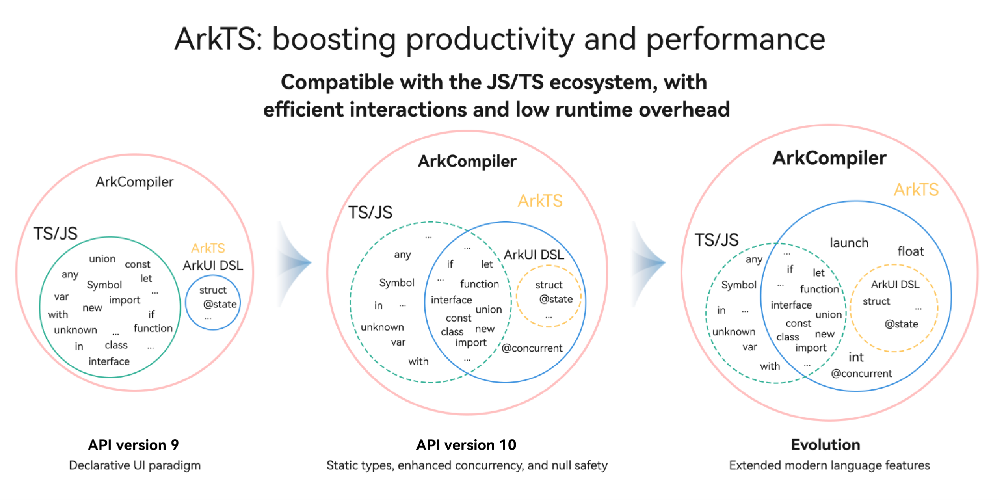

# Getting Started with ArkTS

<!--Kit: ArkTS-->
<!--Subsystem: ArkCompiler-->
<!--Owner: @liwentao_uiw-->
<!--Designer: @qyhuo32-->
<!--Tester: @kirl75; @zsw_zhushiwei-->
<!--Adviser: @zhang_yixin13-->

ArkTS is the preferred programming language for OpenHarmony application development. Built on the [TypeScript](https://www.typescriptlang.org/) (TS) ecosystem, ArkTS extends its functionality while maintaining the basic style of TS. It enhances static check and analysis during development through standardized definitions, improving program execution stability and performance.

For further learning, see [ArkTS learning pathways](https://developer.huawei.com/consumer/en/arkts/) and [ArkTS online courses](https://developer.huawei.com/consumer/en/training/course/video/C101740620697641580).

Since API version 10, ArkTS further strengthens its static check and analysis in terms of the following aspects. For more details about the differences between standard TS and ArkTS, see [TypeScript to ArkTS Cookbook](typescript-to-arkts-migration-guide.md).

- Forced use of static types: Static typing is one of the most important features of ArkTS. With static typing, the types of variables in the program are definite. In addition, because all types are known at compile time, the compiler can verify the code correctness, thereby reducing the type check at run time and helping improve performance.

- Forbidden object layout at runtime: To achieve maximum performance, ArkTS requires that the object layout remain unchanged during program execution.

- Restricted operator semantics: For performance and code readability purposes, ArkTS restricts the semantics of some operators. For example, it confines the use of unary plus operators to numbers.

- Structural typing not supported: The support for structural typing requires a lot of considerations and careful implementation in the language, compiler, and runtime. Currently, ArkTS does not support this feature. Whether to support structural typing will be reconsidered based on the actual requirements and feedback.

ArkTS is compatible with the TS and JavaScript (JS) ecosystem, so that you can write new code or reuse existing code in TS or JS for development. For details about how the OpenHarmony system supports TS or JS language, see [ArkCompiler Runtime Compatibility with TS/JS](arkts-migration-background.md#arkcompiler-runtime-compatibility-with-tsjs).

ArkTS will continue to accommodate ever-changing application development and running requirements, and gradually provides more features, such as enhanced parallelization and concurrency, improved system, and distributed development paradigm.

For details about ArkTS, see [Introduction to ArkTS](../arkts-utils/arkts-overview.md).
