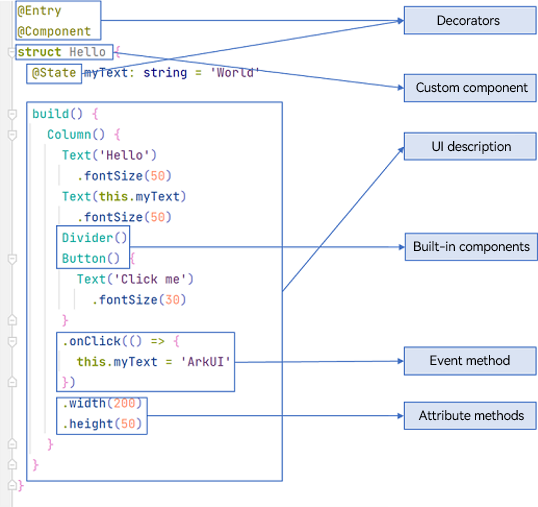

# Getting Started with ArkTS

As its name implies, ArkTS is a superset of TypeScript. It is the preferred, primary programming language for application development in OpenHarmony.

- ArkTS offers all the features of TS.

- ArkTS extends TS mainly by adding [declarative UI](arkts-basic-ui-description.md) capabilities, which allow you to develop high-performance applications in a more natural and intuitive manner.

  The declarative UI capabilities offered by ArkTS include the following:

  - [Basic UI description](arkts-basic-ui-description.md): A wide variety of decorators, custom components, and UI description mechanisms work with the built-in components, event methods, and attribute methods in ArkUI, jointly underpinning UI development.
  - [State management](arkts-state-mgmt-page-level.md): In the multi-dimensional state management mechanism for ArkUI, UI-related data can be used not only within a component, but also be transferred between different component levels (for example, between parent and child components, between grandparent and grandchild components, or globally) in a device or even across devices. In addition, data transfer can be classified as one-way (read-only) or two-way (mutable). You can use these capabilities at your disposal to implement linkage between data and the UI.
  - [Dynamic UI element building](arkts-dynamic-ui-elememt-building.md): In ArkTS, you can dynamically build UI elements, customizing the internal UI structure of components or extending the native components with custom component styles.
  - [Rendering control](arkts-rendering-control.md): ArkTS provides conditional rendering and loop rendering. Conditional rendering can render state-specific content based on the application status. Loop rendering iteratively obtains data from the data source and creates the corresponding component during each iteration.
  - [Restrictions and extensions](arkts-restrictions-and-extensions.md): ArkTS provides extensions, such as two-way binding. However, it is not without its restrictions. 

- ArkTS will continue to evolve to accommodate changing application development and running requirements, and gradually adds more features, such as parallelism and concurrency enhancement, typed system enhancement, and distributed development paradigm.

Below is sample code to illustrate the building blocks of ArkTS. It implements a simple UI with two text segments, one divider, and one button. When the user clicks the button, the text content changes from "Hello World" to "Hello ArkUI".

As shown above, ArkTS has the following building blocks:

- Decorators: used to decorate classes, structures, methods, and variables for custom definitions. In the preceding sample code, **@Entry**, **@Component**, and **@State** are decorators. Specifically, **@Component** indicates a custom component, **@Entry** indicates an entry component, and **@State** indicates a state variable in the component, whose change will trigger re-rendering of the UI.
- Custom components: reusable UI units that can be used in flexible combinations. In the preceding sample code, the structure **Hello** decorated by **@Component** is a custom component.
- UI description: declarative description of the UI structure, such as the code block of the **build()** method.
- Built-in components: basic, container, media, drawing, and canvas components preset in ArkTS. You can directly invoke such components as **\<Column>**, **\<Text>**, **\<Divider>**, and **\<Button>** components in the sample code.
- Attribute methods: methods used to configure component attributes, such as **fontSize()**, **width()**, **height()**, and **color()**. You can configure multiple attributes of a component in method chaining mode.
- Event methods: methods used to add the logic for a component to respond to an event. In the sample code, **onClick()** following **Button** is an event method. You can configure response logic for multiple events in method chaining mode.
