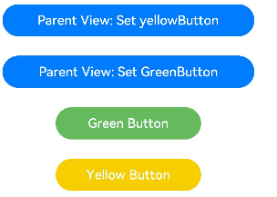

# \@Link Decorator: Two-Way Synchronization Between Parent and Child Components


An \@Link decorated variable creates two-way synchronization with a variable of its parent component.


> **NOTE**
>
> This decorator can be used in ArkTS widgets since API version 9.
>
> This decorator can be used in atomic services since API version 11.

## Overview

An \@Link decorated variable in a child component shares the same value with a variable in its parent component.


## Rules of Use

| \@Link Decorator                         | Description                                                  |
| ---------------------------------------- | ------------------------------------------------------------ |
| Decorator parameters                     | None.                                                        |
| Synchronization type                     | Two-way:<br>from an \@State, \@StorageLink, or \@Link decorated variable in the parent component to this variable; and the other way around. |
| Allowed variable types                   | Object, class, string, number, Boolean, enum, and array of these types.<br>Date type.<br>(Applicable to API version 11 or later) Map and Set types.<br>The union types defined by the ArkUI framework, including Length, ResourceStr, and ResourceColor, are supported.<br>The type must be specified and must be the same as that of the counterpart variable of the parent component.<br>For details about the scenarios of supported types, see [Observed Changes](#observed-changes).<br>**any** is not supported.<br>(Applicable to API version 11 and later versions) Union type of the preceding types, for example, **string \| number**, **string \| undefined** or **ClassA \| null**. For details, see [Union Type @Link](#union-type-link).<br>**NOTE**<br>When **undefined** or **null** is used, you are advised to explicitly specify the type to pass the TypeScript type check. For example, **@Link a: string \| undefined = undefined**. |
| Initial value for the decorated variable | Forbidden.                                                   |


## Variable Transfer/Access Rules

| Transfer/Access     | Description                                      |
| ---------- | ---------------------------------------- |
| Initialization and update from the parent component| Mandatory. A two-way synchronization relationship can be established with the @State, @StorageLink, or \@Link decorated variable in the parent component. An @Link decorated variable can be initialized from an [\@State](./arkts-state.md), @Link, [\@Prop](./arkts-prop.md), [\@Provide](./arkts-provide-and-consume.md), [\@Consume](./arkts-provide-and-consume.md), [\@ObjectLink](./arkts-observed-and-objectlink.md), [\@StorageLink](./arkts-appstorage.md#storagelink), [\@StorageProp](./arkts-appstorage.md#storageprop), [\@LocalStorageLink](./arkts-localstorage.md#localstoragelink), or [\@LocalStorageProp](./arkts-localstorage.md#localstorageprop) decorated variable in the parent component.<br>Since API version 9, the syntax is **Comp({ aLink: this.aState })** for initializing an \@Link decorated variable in the child component from an @State decorated variable in its parent component. The **Comp({aLink: $aState})** syntax is also supported.|
| Child component initialization  | Supported; can be used to initialize a regular variable or \@State, \@Link, \@Prop, or \@Provide decorated variable in the child component.|
| Access | Private, accessible only within the component.                          |

  **Figure 1** Initialization rule 


## Observed Changes and Behavior


### Observed Changes

- When the decorated variable is of the Boolean, string, or number type, its value change can be observed. For details, see [Example for @Link with Simple and Class Types](#example-for-link-with-simple-and-class-types).

- When the decorated variable is of the class or Object type, its value change and value changes of all its attributes, that is, the attributes that **Object.keys(observedObject)** returns, can be observed. For details, see [Example for @Link with Simple and Class Types](#example-for-link-with-simple-and-class-types).

- When the decorated variable is of the array type, the addition, deletion, and updates of array items can be observed. For details, see [Array Type \@Link](#array-type-link).

- When the decorated variable is of the Date type, the overall value assignment of the Date object can be observed, and the following APIs can be called to update Date attributes: **setFullYear**, **setMonth**, **setDate**, **setHours**, **setMinutes**, **setSeconds**, **setMilliseconds**, **setTime**, **setUTCFullYear**, **setUTCMonth**, **setUTCDate**, **setUTCHours**, **setUTCMinutes**, **setUTCSeconds**, and **setUTCMilliseconds**.

```ts
@Component
struct DateComponent {
  @Link selectedDate: Date;

  build() {
    Column() {
      Button(`child increase the year by 1`).onClick(() => {
        this.selectedDate.setFullYear(this.selectedDate.getFullYear() + 1)
      })
      Button('child update the new date')
        .margin(10)
        .onClick(() => {
          this.selectedDate = new Date('2023-09-09')
        })
      DatePicker({
        start: new Date('1970-1-1'),
        end: new Date('2100-1-1'),
        selected: this.selectedDate
      })
    }

  }
}

@Entry
@Component
struct ParentComponent {
  @State parentSelectedDate: Date = new Date('2021-08-08');

  build() {
    Column() {
      Button('parent increase the month by 1')
        .margin(10)
        .onClick(() => {
          this.parentSelectedDate.setMonth(this.parentSelectedDate.getMonth() + 1)
        })
      Button('parent update the new date')
        .margin(10)
        .onClick(() => {
          this.parentSelectedDate = new Date('2023-07-07')
        })
      DatePicker({
        start: new Date('1970-1-1'),
        end: new Date('2100-1-1'),
        selected: this.parentSelectedDate
      })

      DateComponent({ selectedDate:this.parentSelectedDate })
    }
  }
}
```

- When the decorated variable is **Map**, value changes of **Map** can be observed. In addition, you can call the **set**, **clear**, and **delete** APIs of **Map** to update its value. For details, see [Decorating Variables of the Map Type](#decorating-variables-of-the-map-type).

- When the decorated variable is **Set**, value changes of **Set** can be observed. In addition, you can call the **add**, **clear**, and **delete** APIs of **Set** to update its value. For details, see [Decorating Variables of the Set Type](#decorating-variables-of-the-set-type).

### Framework Behavior

An \@Link decorated variable shares the lifecycle of its owning component.

To understand the value initialization and update mechanism of the \@Link decorated variable, it is necessary to consider the parent component and the initial render and update process of the child component that owns the \@Link decorated variable (in this example, the \@State decorated variable in the parent component is used).

1. Initial render: The execution of the parent component's **build()** function creates a instance of the child component. The initialization process is as follows:
   1. An \@State decorated variable of the parent component must be specified to initialize the child component's \@Link decorated variable. The child component's \@Link decorated variable value and its source variable are kept in sync (two-way data synchronization).
   2. The \@State state variable wrapper class of the parent component is passed to the child component through the build function. After obtaining the \@State state variable of the parent component, the \@Link wrapper class of the child component registers the **this** pointer to the current \@Link wrapper class with the \@State variable of the parent component.

2. Update of the \@Link source: When the state variable in the parent component is updated, the \@Link decorated variable in the related child component is updated. Processing steps:
   1. As indicated in the initial rendering step, the child component's \@Link wrapper class registers the current **this** pointer with the parent component. When the \@State decorated variable in the parent component is changed, all system components (**elementid**) and state variables (such as the \@Link wrapper class) that depend on the parent component are traversed and updated.
   2. After the \@Link wrapper class is updated, all system components (**elementId**) that depend on the \@Link decorated variable in the child component are notified of the update. In this way, the parent component has the state data of the child components synchronized.

3. Update of \@Link: After the \@Link decorated variable in the child component is updated, the following steps are performed (the \@State decorated variable in the parent component is used):
   1. After the \@Link decorated variable is updated, the **set** method of the \@State wrapper class in the parent component is called to synchronize the updated value back to the parent component.
   2. The \@Link in the child component and \@State in the parent component traverse the dependent system components and update the corresponding UI. In this way, the \@Link decorated variable in the child component is synchronized back to the \@State decorated variable in the parent component.


## Restrictions

1. The @Link decorator cannot be used in custom components decorated by [\@Entry](https://gitee.com/openharmony/docs/blob/master/en/application-dev/quick-start/arkts-create-custom-components.md#basic-structure-of-a-custom-component).

2. Do not initialize variables decorated by \@Link locally. Otherwise, an error will be reported during compilation.

```ts
// Incorrect format. An error is reported during compilation.
@Link count: number = 10;

// Correct format.
@Link count: number;
```

3. The type of the variable decorated by \@Link must be the same as the data source type. Otherwise, the framework throws a runtime error.

[Incorrect Example]

```ts
class Info {
  info: string = 'Hello';
}

class Cousin {
  name: string = 'Hello';
}

@Component
struct Child {
  // Incorrect format. The data source types of @Link and @State are different.
  @Link test: Cousin;

  build() {
    Text(this.test.name)
  }
}

@Entry
@Component
struct LinkExample {
  @State info: Info = new Info();

  build() {
    Column() {
      // Incorrect format. The data source types of @Link and @State are different.
      Child({test: new Cousin()})
    }
  }
}
```

[Correct Example]

```ts
class Info {
  info: string = 'Hello';
}

@Component
struct Child {
  // Correct format.
  @Link test: Info;

  build() {
    Text(this.test.info)
  }
}

@Entry
@Component
struct LinkExample {
  @State info: Info = new Info();

  build() {
    Column() {
      // Correct format.
      Child({test: this.info})
    }
  }
}
```

4. \@Link decorated variables can be initialized only by state variables. Initializing the variables using constants will cause a warn alarm during compilation, and an error "is not callable" is reported during runtime.

[Incorrect Example]

```ts
class Info {
  info: string = 'Hello';
}

@Component
struct Child {
  @Link msg: string;
  @Link info: string;

  build() {
    Text(this.msg + this.info)
  }
}

@Entry
@Component
struct LinkExample {
  @State message: string = 'Hello';
  @State info: Info = new Info();

  build() {
    Column() {
      // Incorrect format. Common variables cannot initialize the @Link decorated variables.
      Child({msg: 'World', info: this.info.info})
    }
  }
}
```

[Correct Example]

```ts
class Info {
  info: string = 'Hello';
}

@Component
struct Child {
  @Link msg: string;
  @Link info: Info;

  build() {
    Text(this.msg + this.info.info)
  }
}

@Entry
@Component
struct LinkExample {
  @State message: string = 'Hello';
  @State info: Info = new Info();

  build() {
    Column() {
      // Correct format.
      Child({msg: this.message, info: this.info})
    }
  }
}
```

5. \@Link cannot decorate variables of the function type. Otherwise, the framework throws a runtime error.


## Usage Scenarios


### Example for @Link with Simple and Class Types

In the following example, after **Parent View: Set yellowButton** and **Parent View: Set GreenButton** of the parent component **ShufflingContainer** are clicked, the change in the parent component is synchronized to the child components.

  1. After buttons of the child components **GreenButton** and **YellowButton** are clicked, the child components (@Link decorated variables) change accordingly. Due to the two-way synchronization relationship between @Link and @State, the changes are synchronized to the parent component.
  
  2. When a button in the parent component **ShufflingContainer** is clicked, the parent component (@State decorated variable) changes, and the changes are synchronized to the child components, which are then updated accordingly.

```ts
class GreenButtonState {
  width: number = 0;

  constructor(width: number) {
    this.width = width;
  }
}

@Component
struct GreenButton {
  @Link greenButtonState: GreenButtonState;

  build() {
    Button('Green Button')
      .width(this.greenButtonState.width)
      .height(40)
      .backgroundColor('#64bb5c')
      .fontColor('#FFFFFF, 90%')
      .onClick(() => {
        if (this.greenButtonState.width < 700) {
          // Update the attribute of the class. The change can be observed and synchronized back to the parent component.
          this.greenButtonState.width += 60;
        } else {
          // Update the class. The change can be observed and synchronized back to the parent component.
          this.greenButtonState = new GreenButtonState(180);
        }
      })
  }
}

@Component
struct YellowButton {
  @Link yellowButtonState: number;

  build() {
    Button('Yellow Button')
      .width(this.yellowButtonState)
      .height(40)
      .backgroundColor('#f7ce00')
      .fontColor('#FFFFFF, 90%')
      .onClick(() => {
        // The change of the decorated variable of a simple type in the child component can be synchronized back to the parent component.
        this.yellowButtonState += 40.0;
      })
  }
}

@Entry
@Component
struct ShufflingContainer {
  @State greenButtonState: GreenButtonState = new GreenButtonState(180);
  @State yellowButtonProp: number = 180;

  build() {
    Column() {
      Flex({ direction: FlexDirection.Column, alignItems: ItemAlign.Center }) {
        // Simple type @Link in the child component synchronized from @State in the parent component.
        Button('Parent View: Set yellowButton')
          .width(312)
          .height(40)
          .margin(12)
          .fontColor('#FFFFFF, 90%')
          .onClick(() => {
            this.yellowButtonProp = (this.yellowButtonProp < 700) ? this.yellowButtonProp + 40 : 100;
          })
        // Class type @Link in the child component synchronized from @State in the parent component.
        Button('Parent View: Set GreenButton')
          .width(312)
          .height(40)
          .margin(12)
          .fontColor('#FFFFFF, 90%')
          .onClick(() => {
            this.greenButtonState.width = (this.greenButtonState.width < 700) ? this.greenButtonState.width + 100 : 100;
          })
        // Initialize the class type @Link.
        GreenButton({ greenButtonState: $greenButtonState }).margin(12)
        // Initialize the simple type @Link.
        YellowButton({ yellowButtonState: $yellowButtonProp }).margin(12)
      }
    }
  }
}
```



### Array Type \@Link


```ts
@Component
struct Child {
  @Link items: number[];

  build() {
    Column() {
      Button(`Button1: push`)
        .margin(12)
        .width(312)
        .height(40)
        .fontColor('#FFFFFF, 90%')
        .onClick(() => {
          this.items.push(this.items.length + 1);
        })
      Button(`Button2: replace whole item`)
        .margin(12)
        .width(312)
        .height(40)
        .fontColor('#FFFFFF, 90%')
        .onClick(() => {
          this.items = [100, 200, 300];
        })
    }
  }
}

@Entry
@Component
struct Parent {
  @State arr: number[] = [1, 2, 3];

  build() {
    Column() {
      Child({ items: $arr })
        .margin(12)
      ForEach(this.arr,
        (item: number) => {
          Button(`${item}`)
            .margin(12)
            .width(312)
            .height(40)
            .backgroundColor('#11a2a2a2')
            .fontColor('#e6000000')
        },
        (item: ForEachInterface) => item.toString()
      )
    }
  }
}
```


As described above, the ArkUI framework can observe the addition, deletion, and replacement of array items. It should be noted that, in the preceding example, the type of the \@Link and \@State decorated variables is the same: number[]. It is not allowed to define the \@Link decorated variable in the child component as type number (**\@Link item: number**), and create child components for each array item in the \@State decorated array in the parent component. [\@Prop](arkts-prop.md) or [\@Observed](./arkts-observed-and-objectlink.md) should be used depending on application semantics.

### Decorating Variables of the Map Type

> **NOTE**
>
> Since API version 11, \@Link supports the Map type.

In this example, the **value** variable is of the Map<number, string> type. When the button is clicked, the value of **message** changes, and the UI is re-rendered.

```ts
@Component
struct Child {
  @Link value: Map<number, string>

  build() {
    Column() {
      ForEach(Array.from(this.value.entries()), (item: [number, string]) => {
        Text(`${item[0]}`).fontSize(30)
        Text(`${item[1]}`).fontSize(30)
        Divider()
      })
      Button('child init map').onClick(() => {
        this.value = new Map([[0, "a"], [1, "b"], [3, "c"]])
      })
      Button('child set new one').onClick(() => {
        this.value.set(4, "d")
      })
      Button('child clear').onClick(() => {
        this.value.clear()
      })
      Button('child replace the first one').onClick(() => {
        this.value.set(0, "aa")
      })
      Button('child delete the first one').onClick(() => {
        this.value.delete(0)
      })
    }
  }
}


@Entry
@Component
struct MapSample2 {
  @State message: Map<number, string> = new Map([[0, "a"], [1, "b"], [3, "c"]])

  build() {
    Row() {
      Column() {
        Child({ value: this.message })
      }
      .width('100%')
    }
    .height('100%')
  }
}
```

### Decorating Variables of the Set Type

> **NOTE**
>
> Since API version 11, \@Link supports the Set type.

In this example, the **message** variable is of the Set\<number\> type. When the button is clicked, the value of **message** changes, and the UI is re-rendered.

```ts
@Component
struct Child {
  @Link message: Set<number>

  build() {
    Column() {
      ForEach(Array.from(this.message.entries()), (item: [number, string]) => {
        Text(`${item[0]}`).fontSize(30)
        Divider()
      })
      Button('init set').onClick(() => {
        this.message = new Set([0, 1, 2, 3, 4])
      })
      Button('set new one').onClick(() => {
        this.message.add(5)
      })
      Button('clear').onClick(() => {
        this.message.clear()
      })
      Button('delete the first one').onClick(() => {
        this.message.delete(0)
      })
    }
    .width('100%')
  }
}


@Entry
@Component
struct SetSample1 {
  @State message: Set<number> = new Set([0, 1, 2, 3, 4])

  build() {
    Row() {
      Column() {
        Child({ message: this.message })
      }
      .width('100%')
    }
    .height('100%')
  }
}
```

### Using Two-Way Synchronization Mechanism to Change Local Variables

Use [\@Watch](./arkts-watch.md) to change local variables during two-way synchronization.

In the following example, the \@State decorated variable **sourceNumber** is modified in \@Watch of \@Link to implement variable synchronization between parent and child components. However, the local modification of the \@State decorated variable **memberMessage** does not affect the variable change in the parent component.

```ts
@Entry
@Component
struct Parent {
  @State sourceNumber: number = 0;

  build() {
    Column() {
      Text(`sourceNumber of the parent component: ` + this.sourceNumber)
      Child({ sourceNumber: this.sourceNumber })
      Button('sourceNumber is changed in the parent component')
        .onClick(() => {
          this.sourceNumber++;
        })
    }
    .width('100%')
    .height('100%')
  }
}

@Component
struct Child {
  @State memberMessage: string = 'Hello World';
  @Link @Watch('onSourceChange') sourceNumber: number;

  onSourceChange() {
    this.memberMessage = this.sourceNumber.toString();
  }

  build() {
    Column() {
      Text(this.memberMessage)
      Text(`sourceNumber of the child component: ` + this.sourceNumber.toString())
      Button('memberMessage is changed in the child component')
        .onClick(() => {
          this.memberMessage = 'Hello memberMessage';
        })
    }
  }
}
```

## Union Type @Link

@Link supports **undefined**, **null**, and union types. In the following example, the type of **name** is string | undefined. If the attribute or type of **name** is changed when the button in the parent component **Index** is clicked, the change will be synced to the child component.

```ts
@Component
struct Child {
  @Link name: string | undefined

  build() {
    Column() {

      Button('Child change name to Bob')
        .onClick(() => {
          this.name = "Bob"
        })

      Button('Child change animal to undefined')
        .onClick(() => {
          this.name = undefined
        })

    }.width('100%')
  }
}

@Entry
@Component
struct Index {
  @State name: string | undefined = "mary"

  build() {
    Column() {
      Text(`The name is  ${this.name}`).fontSize(30)

      Child({ name: this.name })

      Button('Parents change name to Peter')
        .onClick(() => {
          this.name = "Peter"
        })

      Button('Parents change name to undefined')
        .onClick(() => {
          this.name = undefined
        })
    }
  }
}
```

## FAQs

### Incorrect Type of \@Link Decorated State Variable

When using \@Link to decorate a state variable in a child component, ensure that the variable type is the same as the source type, and the source is a state variable decorated by a decorator such as \@State.

[Incorrect Example]

```ts
@Observed
class ClassA {
  public c: number = 0;

  constructor(c: number) {
    this.c = c;
  }
}

@Component
struct LinkChild {
  @Link testNum: number;

  build() {
    Text(`LinkChild testNum ${this.testNum}`)
  }
}

@Entry
@Component
struct Parent {
  @State testNum: ClassA = new ClassA(1);

  build() {
    Column() {
      Text(`Parent testNum ${this.testNum.c}`)
        .onClick(() => {
          this.testNum.c += 1;
        })
      // The type of the @Link decorated variable must be the same as that of the @State decorated data source.
      LinkChild({ testNum: this.testNum.c })
    }
  }
}
```

In the example, the type of **\@Link testNum: number** and the initialization from the parent component **LinkChild ({testNum:this.testNum.c})** are incorrect. The data source of \@Link must be a decorated state variable. The \@Link decorated variables must be of the same type as the data source, for example, \@Link: T and \@State: T. Therefore, the value should be changed to **\@Link testNum: ClassA**, and the initialization from the parent component should be **LinkChild({testNum: this.testNum})**.

[Correct Example]

```ts
@Observed
class ClassA {
  public c: number = 0;

  constructor(c: number) {
    this.c = c;
  }
}

@Component
struct LinkChild {
  @Link testNum: ClassA;

  build() {
    Text(`LinkChild testNum ${this.testNum?.c}`)
      .onClick(() => {
        this.testNum.c += 1;
      })
  }
}

@Entry
@Component
struct Parent {
  @State testNum: ClassA = new ClassA(1);

  build() {
    Column() {
      Text(`Parent testNum ${this.testNum.c}`)
        .onClick(() => {
          this.testNum.c += 1;
        })
      // The type of the @Link decorated variable must be the same as that of the @State decorated data source.
      LinkChild({ testNum: this.testNum })
    }
  }
}
```

### Using the a.b(this.object) Format Fails to Trigger UI Re-render

In the **build** method, when the variable decorated by @Link is of the object type and is called using the **a.b(this.object)** format, the native object of **this.object** is passed in the b method. If the property of **this.object** is changed, the UI cannot be re-rendered. In the following example, when the static method **Score.changeScore1** or **this.changeScore2** is used to change **this.score.value** in the **Child** component, the UI is not re-rendered.

[Incorrect Example]

```ts
class Score {
  value: number;
  constructor(value: number) {
    this.value = value;
  }

  static changeScore1(score:Score) {
    score.value += 1;
  }
}

@Entry
@Component
struct Parent {
  @State score: Score = new Score(1);

  build() {
    Column({space:8}) {
      Text(`The value in Parent is ${this.score.value}.`)
        .fontSize(30)
        .fontColor(Color.Red)
      Child({ score: this.score })
    }
    .width('100%')
    .height('100%')
  }
}

@Component
struct Child {
  @Link score: Score;

  changeScore2(score:Score) {
    score.value += 2;
  }

  build() {
    Column({space:8}) {
      Text(`The value in Child is ${this.score.value}.`)
        .fontSize(30)
      Button(`changeScore1`)
        .onClick(()=>{
          // The UI cannot be re-rendered using a static method.
          Score.changeScore1(this.score);
        })
      Button(`changeScore2`)
        .onClick(()=>{
          // The UI cannot be re-rendered using this.
          this.changeScore2(this.score);
        })
    }
  }
}
```

You can add a proxy for **this.score** to re-render the UI by assigning a value to the variable and then calling the variable.

[Correct Example]

```ts
class Score {
  value: number;
  constructor(value: number) {
    this.value = value;
  }

  static changeScore1(score:Score) {
    score.value += 1;
  }
}

@Entry
@Component
struct Parent {
  @State score: Score = new Score(1);

  build() {
    Column({space:8}) {
      Text(`The value in Parent is ${this.score.value}.`)
        .fontSize(30)
        .fontColor(Color.Red)
      Child({ score: this.score })
    }
    .width('100%')
    .height('100%')
  }
}

@Component
struct Child {
  @Link score: Score;

  changeScore2(score:Score) {
    score.value += 2;
  }

  build() {
    Column({space:8}) {
      Text(`The value in Child is ${this.score.value}.`)
        .fontSize(30)
      Button(`changeScore1`)
        .onClick(()=>{
          // Add a proxy by assigning a value.
          let score1 = this.score;
          Score.changeScore1(score1);
        })
      Button(`changeScore2`)
        .onClick(()=>{
          // Add a proxy by assigning a value.
          let score2 = this.score;
          this.changeScore2(score2);
        })
    }
  }
}
```

### An Error Is Reported During \@Link Initialization When \@State Is Defined after build()

When the \@State decorated variable is defined after the **build** function to initialize the \@Link decorated variable, the \@State decorated variable is identified as a constant. However, the \@Link decorated variable cannot be initialized by a constant. As a result, an error is reported during compilation.

[Incorrect Example]

```ts
@Entry
@Component
struct Index {
  build() {
    Column() {
      child({ count: this.count })
      Button(`click times: ${this.count}`)
        .onClick(() => {
          this.count += 1;
        })
    }
  }
  // Define the @State variable after the build function.
  @State count: number = 0;
}

@Component
struct child {
  @Link count: number;

  build() {
    Text(`cout: ${this.count}`).fontSize(30)
  }
}
```


The correct format is to define the \@State variable before the build function.

[Correct Example]

```ts
@Entry
@Component
struct Index {
  @State count: number = 0;

  build() {
    Column() {
      child({ count: this.count })
      Button(`click times: ${this.count}`)
        .onClick(() => {
          this.count += 1;
        })
    }
  }
}

@Component
struct child {
  @Link count: number;

  build() {
    Text(`cout: ${this.count}`).fontSize(30)
  }
}
```

