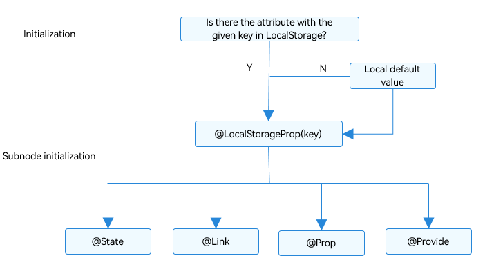
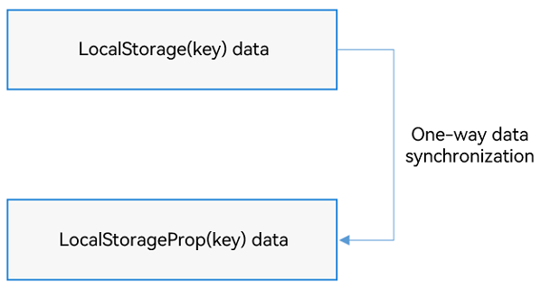
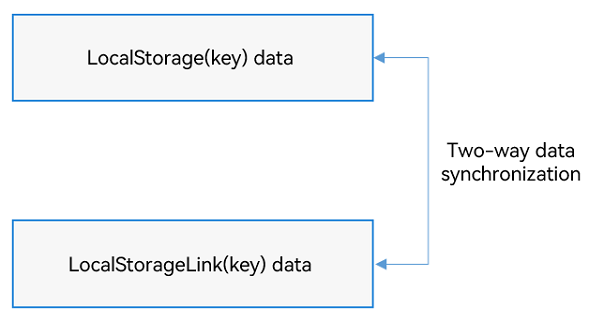

# LocalStorage: Storing UI State


LocalStorage provides storage for the page-level UI state. The parameters of the LocalStorage type accepted through the \@Entry decorator share the same LocalStorage instance on the page. LocalStorage also allows for state sharing between pages with UIAbility instances.


This topic describes only the LocalStorage application scenarios and related decorators: \@LocalStorageProp and \@LocalStorageLink.


Before reading this topic, you are advised to read [State Management Overview](./arkts-state-management-overview.md) to have a basic understanding of the positioning of AppStorage in the state management framework.

LocalStorage also provides APIs for you to manually add, delete, change, and query keys of Storage outside the custom component. You are advised to read this topic together with [LocalStorage API reference](../reference/apis-arkui/arkui-ts/ts-state-management.md#localstorage9).

> **NOTE**
>
> LocalStorage is supported since API version 9.


## Overview

LocalStorage is an in-memory "database" that ArkTS provides for storing state variables required to build pages of the application UI.

- An application can create multiple LocalStorage instances. These instances can be shared on a page or, by using the **getShared** API, across pages in a UIAbility instance.

- The root node of a component tree, that is, the \@Component decorated by \@Entry, can be assigned to a LocalStorage instance. All child instances of this custom component automatically gain access to the same LocalStorage instance.

- The \@Component decorated components can automatically inherit the LocalStorage instance from the parent component or receive the specified LocalStorage instance. For details, see [Example of Providing a Custom Component with Access to a LocalStorage Instance](#example-of-providing-a-custom-component-with-access-to-a-localstorage-instance).

- All attributes in LocalStorage are mutable.

The application determines the lifecycle of a LocalStorage object. The JS Engine will garbage collect a LocalStorage object when the application releases the last reference to it, which includes deleting the last custom component.

LocalStorage provides two decorators based on the synchronization type of the component decorated with \@Component:

- [@LocalStorageProp](#localstorageprop): creates a one-way data synchronization with the named attribute in LocalStorage.

- [@LocalStorageLink](#localstoragelink): creates a two-way data synchronization with the named attribute in LocalStorage.


## \@LocalStorageProp

As mentioned above, if you want to establish a binding between LocalStorage and a custom component, you need to use the \@LocalStorageProp and \@LocalStorageLink decorators. Specially, use \@LocalStorageProp(key) or \@LocalStorageLink(key) to decorate variables in the component, where **key** identifies the attribute in LocalStorage.


When a custom component is initialized, the \@LocalStorageProp(key)/\@LocalStorageLink(key) decorated variable is initialized with the value of the attribute with the given key in LocalStorage. Local initialization is mandatory. If an attribute with the given key is missing from LocalStorage, it will be added with the stated initializing value. (Whether the attribute with the given key exists in LocalStorage depends on the application logic.)


> **NOTE**
>
> This decorator can be used in ArkTS widgets since API version 9.
>
> This decorator can be used in atomic services since API version 11.

By decorating a variable with \@LocalStorageProp(key), a one-way data synchronization is established from the attribute with the given key in LocalStorage to the variable. This means that, local changes (if any) will not be synchronized to LocalStorage, and an update to the attribute with the given key in LocalStorage – for example, a change made with the **set** API – will overwrite local changes.


### Rules of Use

| \@LocalStorageProp Decorator| Description                                      |
| ----------------------- | ---------------------------------------- |
| Decorator parameters                  | **key**: constant string, mandatory (the string must be quoted)                 |
| Allowed variable types              | Object, class, string, number, Boolean, enum, and array of these types.<br>(Applicable to API version 12 or later) Map, Set, and Date types. For details about the scenarios of nested objects, see [Observed Changes and Behavior](#observed-changes-and-behavior).<br>The type must be specified. Whenever possible, use the same type as that of the corresponding attribute in LocalStorage. Otherwise, implicit type conversion occurs, causing application behavior exceptions.<br>**any** is not supported. **undefined** and **null** are supported since API version 12.<br>(Applicable to API version 12 or later) Union type of the preceding types, for example, **string \| number**, **string \| undefined** or **ClassA \| null**. For details, see [Union Type @LocalStorage](#union-type).<br>**NOTE**<br>When **undefined** or **null** is used, you are advised to explicitly specify the type to pass the TypeScript type check. For example, **@LocalStorageProp("AA") a: number \| null = null** is recommended; **@LocalStorageProp("AA") a: number = null** is not recommended.|
| Synchronization type                   | One-way: from the attribute in LocalStorage to the component variable. The component variable can be changed locally, but an update from LocalStorage will overwrite local changes.|
| Initial value for the decorated variable              | Mandatory. If the attribute does not exist in LocalStorage, it will be created and initialized with this value.|


### Variable Transfer/Access Rules

| Transfer/Access     | Description                                      |
| ---------- | ---------------------------------------- |
| Initialization and update from the parent component| Forbidden.|
| Child component initialization    | Supported. The \@LocalStorageProp decorated variable can be used to initialize an \@State, \@Link, \@Prop, or \@Provide decorated variable in the child component.|
| Access from outside the component | Not supported.                                      |

  **Figure 1** \@LocalStorageProp initialization rule 




### Observed Changes and Behavior

**Observed Changes**


- When the decorated variable is of the Boolean, string, or number type, its value change can be observed.

- When the decorated variable is of the class or object type, its value change as well as value changes of all its attributes can be observed. For details, see [Example for Using LocalStorage from Inside the UI](#example-for-using-localstorage-from-inside-the-ui).

- When the decorated variable is of the array type, the addition, deletion, and updates of array items can be observed.

- When the decorated object is of the **Date** type, the overall value changes of **Date** can be observed. In addition, you can call the following APIs to update **Date** properties: **setFullYear**, **setMonth**, **setDate**, **setHours**, **setMinutes**, **setSeconds**, **setMilliseconds**, **setTime**, **setUTCFullYear**, **setUTCMonth**, **setUTCDate**, **setUTCHours**, **setUTCMinutes**, **setUTCSeconds**, and **setUTCMilliseconds**. For details, see [Decorating Variables of the Date Type](#decorating-variables-of-the-date-type).

- When the decorated variable is **Map**, value changes of **Map** can be observed. In addition, you can call the **set**, **clear**, and **delete** APIs of **Map** to update its value. For details, see [Decorating Variables of the Map Type](#decorating-variables-of-the-map-type).

- When the decorated variable is **Set**, value changes of **Set** can be observed. In addition, you can call the **add**, **clear**, and **delete** APIs of **Set** to update its value. For details, see [Decorating Variables of the Set Type](#decorating-variables-of-the-set-type).


**Framework Behavior**


- Value changes of the variables decorated by \@LocalStorageProp are not synchronized to LocalStorage.

- Value changes of the variables decorated by \@LocalStorageProp will cause a re-render of components associated with the current custom component.

- When an attribute with the given key in LocalStorage is updated, the change is synchronized to all the \@LocalStorageProp(key) decorated variables and overwrite all local changes of these variables.




## \@LocalStorageLink

> **NOTE**
>
> This decorator can be used in atomic services since API version 11.

\@LocalStorageLink is required if you need to synchronize the changes of the state variables in a custom component back to LocalStorage.

\@LocalStorageLink(key) creates a two-way data synchronization with the attribute with the given key in LocalStorage.

1. If a local change occurs, it is synchronized to LocalStorage.

2. Changes in LocalStorage are synchronized to all attributes with the given key, including one-way bound variables (\@LocalStorageProp decorated variables and one-way bound variables created through \@Prop) and two-way bound variables (\@LocalStorageLink decorated variables and two-way bound variables created through \@Link).

### Rules of Use

| \@LocalStorageLink Decorator| Description                                      |
| ----------------------- | ---------------------------------------- |
| Decorator parameters                  | **key**: constant string, mandatory (the string must be quoted)                 |
| Allowed variable types              | Object, class, string, number, Boolean, enum, and array of these types.<br>(Applicable to API version 12 or later) Map, Set, and Date types. For details about the scenarios of nested objects, see [Observed Changes and Behavior](#observed-changes-and-behavior).<br>The type must be specified. Whenever possible, use the same type as that of the corresponding attribute in LocalStorage. Otherwise, implicit type conversion occurs, causing application behavior exceptions.<br>**any** is not supported. **undefined** and **null** are supported since API version 12.<br>(Applicable to API version 12 or later) Union type of the preceding types, for example, **string \| number**, **string \| undefined** or **ClassA \| null**. For details, see [Union Type @LocalStorage](#union-type).<br>**NOTE**<br>When **undefined** or **null** is used, you are advised to explicitly specify the type to pass the TypeScript type check. For example, **@LocalStorageLink("AA") a: number \| null = null** is recommended. **@LocalStorageLink("AA") a: number = null** is not recommended.|
| Synchronization type                   | Two-way: from the attribute in LocalStorage to the custom component variable and back|
| Initial value for the decorated variable              | Mandatory. If the attribute does not exist in LocalStorage, it will be created and initialized with this value.|


### Variable Transfer/Access Rules

| Transfer/Access     | Description                                      |
| ---------- | ---------------------------------------- |
| Initialization and update from the parent component| Forbidden.|
| Child component initialization    | Supported. The \@LocalStorageProp decorated variable can be used to initialize an \@State, \@Link, \@Prop, or \@Provide decorated variable in the child component.|
| Access from outside the component | Not supported.                                      |


  **Figure 2** \@LocalStorageLink initialization rule 


### Observed Changes and Behavior

**Observed Changes**


- When the decorated variable is of the Boolean, string, or number type, its value change can be observed.

- When the decorated variable is of the class or object type, its value change as well as value changes of all its attributes can be observed. For details, see [Example for Using LocalStorage from Inside the UI](#example-for-using-localstorage-from-inside-the-ui).

- When the decorated variable is of the array type, the addition, deletion, and updates of array items can be observed.

- When the decorated object is of the **Date** type, the overall value changes of **Date** can be observed. In addition, you can call the following APIs to update **Date** properties: **setFullYear**, **setMonth**, **setDate**, **setHours**, **setMinutes**, **setSeconds**, **setMilliseconds**, **setTime**, **setUTCFullYear**, **setUTCMonth**, **setUTCDate**, **setUTCHours**, **setUTCMinutes**, **setUTCSeconds**, and **setUTCMilliseconds**. For details, see [Decorating Variables of the Date Type](#decorating-variables-of-the-date-type).

- When the decorated variable is **Map**, value changes of **Map** can be observed. In addition, you can call the **set**, **clear**, and **delete** APIs of **Map** to update its value. For details, see [Decorating Variables of the Map Type](#decorating-variables-of-the-map-type).

- When the decorated variable is **Set**, value changes of **Set** can be observed. In addition, you can call the **add**, **clear**, and **delete** APIs of **Set** to update its value. For details, see [Decorating Variables of the Set Type](#decorating-variables-of-the-set-type).


**Framework Behavior**


1. When the value change of the \@LocalStorageLink(key) decorated variable is observed, the change is synchronized to the attribute with the give key value in LocalStorage.

2. Once the attribute with the given key in LocalStorage is updated, all the data (including \@LocalStorageLink and \@LocalStorageProp decorated variables) bound to the attribute key is changed synchronously.

3. When the data decorated by \@LocalStorageLink(key) is a state variable, the change of the data is synchronized to LocalStorage, and the owning custom component is re-rendered.




## Constraints

1. The parameter of \@LocalStorageProp and \@LocalStorageLink must be of the string type. Otherwise, an error is reported during compilation.

    ```ts
    let storage = new LocalStorage();
    storage.setOrCreate('PropA', 48);

    // Incorrect format. An error is reported during compilation.
    @LocalStorageProp() localStorageProp: number = 1;
    @LocalStorageLink() localStorageLink: number = 2;

    // Correct format.
    @LocalStorageProp('PropA') localStorageProp: number = 1;
    @LocalStorageLink('PropA') localStorageLink: number = 2;
    ```

2. \@LocalStorageProp and \@LocalStorageLink cannot decorate variables of the function type. Otherwise, the framework throws a runtime error.

3. Once created, a named attribute cannot have its type changed. Subsequent calls to **Set** must set a value of same type.

4. LocalStorage provides page-level storage. The [getShared](../reference/apis-arkui/arkui-ts/ts-state-management.md#getshared10) API can only obtain the LocalStorage instance passed through [windowStage.loadContent](../reference/apis-arkui/js-apis-window.md#loadcontent9) in the current stage. If the instance is not available, **undefined** is returned. For the example, see [Example of Sharing a LocalStorage Instance from UIAbility to One or More Pages](#example-of-sharing-a-localstorage-instance-from-uiability-to-one-or-more-pages).


## Use Scenarios


### Example of Using LocalStorage in Application Logic


```ts
let para: Record<string,number> = { 'PropA': 47 };
let storage: LocalStorage = new LocalStorage(para); // Create an instance and initialize it with the given object.
let propA: number | undefined = storage.get('PropA'); // propA == 47
let link1: SubscribedAbstractProperty<number> = storage.link('PropA'); // link1.get() == 47
let link2: SubscribedAbstractProperty<number> = storage.link('PropA'); // link2.get() == 47
let prop: SubscribedAbstractProperty<number> = storage.prop('PropA'); // prop.get() == 47
link1.set(48); // Two-way synchronization: link1.get() == link2.get() == prop.get() == 48
prop.set(1); // One-way synchronization: prop.get() == 1; but link1.get() == link2.get() == 48
link1.set(49); // Two-way synchronization: link1.get() == link2.get() == prop.get() == 49
```


### Example for Using LocalStorage from Inside the UI

The two decorators \@LocalStorageProp and \@LocalStorageLink can work together to obtain the state variable stored in a LocalStorage instance in the UI component.

This example uses \@LocalStorageLink to implement the following:

- Use the **build** function to create a LocalStorage instance named **storage**.

- Use the \@Entry decorator to add **storage** to the top-level component **Parent**.

- Use \@LocalStorageLink to create a two-way data synchronization with the given attribute in LocalStorage.

 ```ts
class Data {
  code: number;

  constructor(code: number) {
    this.code = code;
  }
}
// Create a new instance and initialize it with the given object.
let para: Record<string, number> = { 'PropA': 47 };
let storage: LocalStorage = new LocalStorage(para);
storage.setOrCreate('PropB', new Data(50));

@Component
struct Child {
  // @LocalStorageLink creates a two-way data synchronization with the PropA attribute in LocalStorage.
  @LocalStorageLink('PropA') childLinkNumber: number = 1;
  // @LocalStorageLink creates a two-way data synchronization with the PropB attribute in LocalStorage.
  @LocalStorageLink('PropB') childLinkObject: Data = new Data(0);

  build() {
    Column({ space: 15 }) {
      Button(`Child from LocalStorage ${this.childLinkNumber}`) // The changes will be synchronized to PropA in LocalStorage and with Parent.parentLinkNumber.
        .onClick(() => {
          this.childLinkNumber += 1;
        })

      Button(`Child from LocalStorage ${this.childLinkObject.code}`) // The changes will be synchronized to PropB in LocalStorage and with Parent.parentLinkObject.code.
        .onClick(() => {
          this.childLinkObject.code += 1;
        })
    }
  }
}
// Make LocalStorage accessible from the @Component decorated component.
@Entry(storage)
@Component
struct Parent {
  // @LocalStorageLink creates a two-way data synchronization with the PropA attribute in LocalStorage.
  @LocalStorageLink('PropA') parentLinkNumber: number = 1;
  // @LocalStorageLink creates a two-way data synchronization with the PropB attribute in LocalStorage.
  @LocalStorageLink('PropB') parentLinkObject: Data = new Data(0);

  build() {
    Column({ space: 15 }) {
      Button(`Parent from LocalStorage ${this.parentLinkNumber}`) // The value of this.parentLinkNumber is 47 because PropA in LocalStorage has been initialized.
        .onClick(() => {
          this.parentLinkNumber += 1;
        })

      Button(`Parent from LocalStorage ${this.parentLinkObject.code}`) // The value of this.parentLinkObject.code is 50 because PropB in LocalStorage has been initialized.
        .onClick(() => {
          this.parentLinkObject.code += 1;
        })
      // The @Component decorated child component automatically obtains access to the Parent LocalStorage instance.
      Child()
    }
  }
}
 ```


### Simple Example of Using \@LocalStorageProp with LocalStorage

In this example, the **Parent** and **Child** components create local data that is one-way synchronized with the PropA attribute in the LocalStorage instance **storage**.

- The change of **this.storageProp1** in **Parent** takes effect only in **Parent** and is not synchronized to **storage**.

- In the **Child** component, the value of **storageProp2** bound to **Text** is still 47.

```ts
// Create a new instance and initialize it with the given object.
let para: Record<string, number> = { 'PropA': 47 };
let storage: LocalStorage = new LocalStorage(para);
// Make LocalStorage accessible from the @Component decorated component.
@Entry(storage)
@Component
struct Parent {
  // @LocalStorageProp creates a one-way data synchronization with the PropA attribute in LocalStorage.
  @LocalStorageProp('PropA') storageProp1: number = 1;

  build() {
    Column({ space: 15 }) {
      // The initial value is 47. After the button is clicked, the value is incremented by 1. The change takes effect only in storageProp1 in the current component and is not synchronized to LocalStorage.
      Button(`Parent from LocalStorage ${this.storageProp1}`)
        .onClick(() => {
          this.storageProp1 += 1;
        })
      Child()
    }
  }
}

@Component
struct Child {
  // @LocalStorageProp creates a one-way data synchronization with the PropA attribute in LocalStorage.
  @LocalStorageProp('PropA') storageProp2: number = 2;

  build() {
    Column({ space: 15 }) {
      // When Parent changes, the current storageProp2 does not change, and 47 is displayed.
      Text(`Parent from LocalStorage ${this.storageProp2}`)
    }
  }
}
```


### Simple Example of Using \@LocalStorageLink with LocalStorage

This example shows how to create a two-way data synchronization between an \@LocalStorageLink decorated variable and LocalStorage.


```ts
// Create a LocalStorage instance.
let para: Record<string, number> = { 'PropA': 47 };
let storage: LocalStorage = new LocalStorage(para);
// Call the link API (available since API version 9) to create a two-way data synchronization with PropA. linkToPropA is a global variable.
let linkToPropA: SubscribedAbstractProperty<object> = storage.link('PropA');

@Entry(storage)
@Component
struct Parent {

  // @LocalStorageLink('PropA') creates a two-way synchronization with PropA in the Parent custom component. The initial value is 47, because PropA has been set to 47 during LocalStorage construction.
  @LocalStorageLink('PropA') storageLink: number = 1;

  build() {
    Column() {
      Text(`incr @LocalStorageLink variable`)
        // Clicking incr @LocalStorageLink variable increases the value of this.storageLink by 1. The change is synchronized back to the storage. The global variable linkToPropA also changes.

        .onClick(() => {
          this.storageLink += 1;
        })

      // Avoid using the global variable linkToPropA.get() in the component. Doing so may cause errors due to different lifecycles.
      Text(`@LocalStorageLink: ${this.storageLink} - linkToPropA: ${linkToPropA.get()}`)
    }
  }
}
```


### Example of Syncing State Variables Between Sibling Components

This example shows how to use \@LocalStorageLink to create a two-way synchronization for the state between sibling components.

Check the changes in the **Parent** custom component.

1. Clicking **playCount ${this.playCount} dec by 1** decreases the value of **this.playCount** by 1. This change is synchronized to LocalStorage and to the components bound to **playCountLink** in the **Child** component.

2. Click **countStorage ${this.playCount} incr by 1** to call the **set** API in LocalStorage to update the attributes corresponding to **countStorage** in LocalStorage. The components bound to** playCountLink** in the **Child** component are updated synchronously.

3. The **playCount in LocalStorage for debug ${storage.get&lt;number&gt;('countStorage')}** **Text** component is not updated synchronously, because **storage.get&lt;number&gt;('countStorage')** returns a regular variable. The update of a regular variable does not cause the **Text** component to be re-rendered.

Changes in the **Child** custom component:

1. The update of **playCountLink** is synchronized to LocalStorage, and the parent and sibling child custom components are re-rendered accordingly.

```ts
let count: Record<string, number> = { 'countStorage': 1 };
let storage: LocalStorage = new LocalStorage(count);

@Component
struct Child {
  // Name the child component instance.
  label: string = 'no name';
  // Two-way synchronization with countStorage in LocalStorage.
  @LocalStorageLink('countStorage') playCountLink: number = 0;

  build() {
    Row() {
      Text(this.label)
        .width(50).height(60).fontSize(12)
      Text(`playCountLink ${this.playCountLink}: inc by 1`)
        .onClick(() => {
          this.playCountLink += 1;
        })
        .width(200).height(60).fontSize(12)
    }.width(300).height(60)
  }
}

@Entry(storage)
@Component
struct Parent {
  @LocalStorageLink('countStorage') playCount: number = 0;

  build() {
    Column() {
      Row() {
        Text('Parent')
          .width(50).height(60).fontSize(12)
        Text(`playCount ${this.playCount} dec by 1`)
          .onClick(() => {
            this.playCount -= 1;
          })
          .width(250).height(60).fontSize(12)
      }.width(300).height(60)

      Row() {
        Text('LocalStorage')
          .width(50).height(60).fontSize(12)
        Text(`countStorage ${this.playCount} incr by 1`)
          .onClick(() => {
            storage.set<number | undefined>('countStorage', Number(storage.get<number>('countStorage')) + 1);
          })
          .width(250).height(60).fontSize(12)
      }.width(300).height(60)

      Child({ label: 'ChildA' })
      Child({ label: 'ChildB' })

      Text(`playCount in LocalStorage for debug ${storage.get<number>('countStorage')}`)
        .width(300).height(60).fontSize(12)
    }
  }
}
```


### Example of Sharing a LocalStorage Instance from UIAbility to One or More Pages

In the preceding examples, the LocalStorage instance is shared only in an \@Entry decorated component and its child component (a page). To enable a LocalStorage instance to be shared across pages, you can create a LocalStorage instance in its owning UIAbility and call windowStage.[loadContent](../reference/apis-arkui/js-apis-window.md#loadcontent9).


```ts
// EntryAbility.ets
import { UIAbility } from '@kit.AbilityKit';
import { window } from '@kit.ArkUI';

export default class EntryAbility extends UIAbility {
  para: Record<string, number> = {
    'PropA': 47
  };
  storage: LocalStorage = new LocalStorage(this.para);

  onWindowStageCreate(windowStage: window.WindowStage) {
    windowStage.loadContent('pages/Index', this.storage);
  }
}
```
> **NOTE**
>
> On the page, call the **getShared** API to obtain the LocalStorage instance shared through **loadContent**.
>
> **LocalStorage.getShared()** works only on emulators and real devices, not in DevEco Studio Previewer.


In the following example, **propA** on the **Index** page uses the **getShared()** API to obtain the shared LocalStorage instance. Click the button to go to the **Page** page. Click **Change propA** and then return to the **Index** page. It can be observed that the value of **propA** on the page is changed.
```ts
// index.ets

// Use the getShared API to obtain the LocalStorage instance shared by stage.
@Entry({ storage: LocalStorage.getShared() })
@Component
struct Index {
  // You can use @LocalStorageLink/Prop to establish a relationship with the variables in the LocalStorage instance.
  @LocalStorageLink('PropA') propA: number = 1;
  pageStack: NavPathStack = new NavPathStack();

  build() {
    Navigation(this.pageStack) {
      Row(){
        Column() {
          Text(`${this.propA}`)
            .fontSize(50)
            .fontWeight(FontWeight.Bold)
          Button("To Page")
            .onClick(() => {
              this.pageStack.pushPathByName('Page', null);
            })
        }
        .width('100%')
      }
      .height('100%')
    }
  }
}
```

```ts
// Page.ets

@Builder
export function PageBuilder() {
  Page()
}

// The Page component obtains the LocalStorage instance of the parent component Index.
@Component
struct Page {
  @LocalStorageLink('PropA') propA: number = 2;
  pathStack: NavPathStack = new NavPathStack();

  build() {
    NavDestination() {
      Row(){
        Column() {
          Text(`${this.propA}`)
            .fontSize(50)
            .fontWeight(FontWeight.Bold)

          Button("Change propA")
            .onClick(() => {
              this.propA = 100;
            })

          Button("Back Index")
            .onClick(() => {
              this.pathStack.pop();
            })
        }
        .width('100%')
      }
    }
    .onReady((context: NavDestinationContext) => {
      this.pathStack = context.pathStack;
    })
  }
}
```
When using **Navigation**, you need to add the **route_map.json** file to the **src/main/resources/base/profile** directory, replace the value of **pageSourceFile** with the path of **Page**, and add **"routerMap": "$profile: route_map"** to the **module.json5** file.
```json
{
  "routerMap": [
    {
      "name": "Page",
      "pageSourceFile": "src/main/ets/pages/Page.ets",
      "buildFunction": "PageBuilder",
      "data": {
        "description" : "LocalStorage example"
      }
    }
  ]
}
```

> **NOTE**
>
> It is good practice to always create a LocalStorage instance with meaningful default values, which serve as a backup when execution exceptions occur and are also useful for unit testing of pages.


### Example of Providing a Custom Component with Access to a LocalStorage Instance

LocalStorage instances are accessible to both root nodes through @Entry and custom components (child nodes) through constructors.

This example uses \@LocalStorageLink to implement the following:

- The text in the parent component reads **PropA**, value of **PropA** in the LocalStorage instance **localStorage1**.

- The text in the **Child** component reads **PropB**, value of **PropB** in the LocalStorage instance **localStorage2**.

> **NOTE**
>
> LocalStorage instances are accessible to custom components since API version 12.
> If a custom component functions as a subnode and has member attributes defined, a LocalStorage instance must be passed in as the second parameter. Otherwise, a type mismatch error is reported at compile time.
> If a custom component has any attribute defined, it does not accept a LocalStorage instance as the only input parameter. If a custom component does not have any attribute defined, it can accept a LocalStorage instance as the only input parameter.
> If the defined attribute does not need to be initialized from the parent component, {} must be passed in as the first parameter.
> The LocalStorage instance that is passed to a child component as a constructor parameter is determined at initialization. You can use @LocalStorageLink or the API of LocalStorage to modify the attribute values stored in the LocalStorage instance, but the LocalStorage instance itself cannot be dynamically modified.

```ts
let localStorage1: LocalStorage = new LocalStorage();
localStorage1.setOrCreate('PropA', 'PropA');

let localStorage2: LocalStorage = new LocalStorage();
localStorage2.setOrCreate('PropB', 'PropB');

@Entry(localStorage1)
@Component
struct Index {
  // PropA is in two-way synchronization with PropA in localStorage1.
  @LocalStorageLink('PropA') PropA: string = 'Hello World';
  @State count: number = 0;

  build() {
    Row() {
      Column() {
        Text(this.PropA)
          .fontSize(50)
          .fontWeight(FontWeight.Bold)
        // Use the LocalStorage instance localStorage2.
        Child({ count: this.count }, localStorage2)
      }
      .width('100%')
    }
    .height('100%')
  }
}


@Component
struct Child {
  @Link count: number;
  // Hello World is in two-way synchronization with PropB in localStorage2. If there is no PropB in localStorage2, the default value Hello World is used.
  @LocalStorageLink('PropB') PropB: string = 'Hello World';

  build() {
    Text(this.PropB)
      .fontSize(50)
      .fontWeight(FontWeight.Bold)
  }
}
```

1. If a custom component does not have any attribute defined, it can accept a LocalStorage instance as the only input parameter.

    ```ts
    let localStorage1: LocalStorage = new LocalStorage();
    localStorage1.setOrCreate('PropA', 'PropA');

    let localStorage2: LocalStorage = new LocalStorage();
    localStorage2.setOrCreate('PropB', 'PropB');

    @Entry(localStorage1)
    @Component
    struct Index {
      // PropA is in two-way synchronization with PropA in localStorage1.
      @LocalStorageLink('PropA') PropA: string = 'Hello World';
      @State count: number = 0;

      build() {
        Row() {
          Column() {
            Text(this.PropA)
              .fontSize(50)
              .fontWeight(FontWeight.Bold)
            // Use the LocalStorage instance localStorage2.
            Child(localStorage2)
          }
          .width('100%')
        }
        .height('100%')
      }
    }
    ```


    @Component
    struct Child {
      build() {
        Text("hello")
          .fontSize(50)
          .fontWeight(FontWeight.Bold)
      }
    }
    ```

2. If the defined attribute does not need to be initialized from the parent component, {} must be passed in as the first parameter.

    ```ts
    let localStorage1: LocalStorage = new LocalStorage();
    localStorage1.setOrCreate('PropA', 'PropA');

    let localStorage2: LocalStorage = new LocalStorage();
    localStorage2.setOrCreate('PropB', 'PropB');

    @Entry(localStorage1)
    @Component
    struct Index {
      // PropA is in two-way synchronization with PropA in localStorage1.
      @LocalStorageLink('PropA') PropA: string = 'Hello World';
      @State count: number = 0;

      build() {
        Row() {
          Column() {
            Text(this.PropA)
              .fontSize(50)
              .fontWeight(FontWeight.Bold)
            // Use the LocalStorage instance localStorage2.
            Child({}, localStorage2)
          }
          .width('100%')
        }
        .height('100%')
      }
    }
    ```


    @Component
    struct Child {
      @State count: number = 5;
      // Hello World is in two-way synchronization with PropB in localStorage2. If there is no PropB in localStorage2, the default value Hello World is used.
      @LocalStorageLink('PropB') PropB: string = 'Hello World';
    
      build() {
        Text(this.PropB)
          .fontSize(50)
          .fontWeight(FontWeight.Bold)
      }
    }
    ```


### Using LocalStorage with a Navigation Component

You can pass multiple LocalStorage instances to a custom component and bind them to different target navigation pages, which can then display the attribute values of the bound instances.

This example uses \@LocalStorageLink to implement the following:

- Clicking **Next Page** in the parent component creates and redirects to the page named **pageOne**. The text displayed on the page is the value of **PropA** bound to the LocalStorage instance **localStorageA**, that is, **PropA**.

- Clicking **Next Page** on the page creates and redirects to the page named **pageTwo**. The text displayed on the page is the value of **PropB** bound to the LocalStorage instance **localStorageB**, that is, **PropB**.

- Clicking **Next Page** on the page again creates and redirects to the page named **pageTree**. The text displayed on the page is the value of **PropC** bound to the LocalStorage instance **localStorageC**, that is, **PropC**.

- Clicking **Next Page** on the page again creates and redirects to the page named **pageOne**. The text displayed on the page is the value of **PropA** bound to the LocalStorage instance **localStorageA**, that is, **PropA**.

- The **Text** component in the **NavigationContentMsgStack** custom component shares the value of **PropA** bound to the LocalStorage instance in the custom component tree.


```ts
let localStorageA: LocalStorage = new LocalStorage();
localStorageA.setOrCreate('PropA', 'PropA');

let localStorageB: LocalStorage = new LocalStorage();
localStorageB.setOrCreate('PropB', 'PropB');

let localStorageC: LocalStorage = new LocalStorage();
localStorageC.setOrCreate('PropC', 'PropC');

@Entry
@Component
struct MyNavigationTestStack {
  @Provide('pageInfo') pageInfo: NavPathStack = new NavPathStack();

  @Builder
  PageMap(name: string) {
    if (name === 'pageOne') {
      // Pass multiple LocalStorage instances.
      pageOneStack({}, localStorageA)
    } else if (name === 'pageTwo') {
      pageTwoStack({}, localStorageB)
    } else if (name === 'pageThree') {
      pageThreeStack({}, localStorageC)
    }
  }

  build() {
    Column({ space: 5 }) {
      Navigation(this.pageInfo) {
        Column() {
          Button('Next Page', { stateEffect: true, type: ButtonType.Capsule })
            .width('80%')
            .height(40)
            .margin(20)
            .onClick(() => {
              this.pageInfo.pushPath({ name: 'pageOne' }); // Push the navigation destination page specified by name to the navigation stack.
            })
        }
      }.title('NavIndex')
      .navDestination(this.PageMap)
      .mode(NavigationMode.Stack)
      .borderWidth(1)
    }
  }
}

@Component
struct pageOneStack {
  @Consume('pageInfo') pageInfo: NavPathStack;
  @LocalStorageLink('PropA') PropA: string = 'Hello World';

  build() {
    NavDestination() {
      Column() {
        NavigationContentMsgStack()
        // Display the value of PropA in the bound LocalStorage instance.
        Text(`${this.PropA}`)
        Button('Next Page', { stateEffect: true, type: ButtonType.Capsule })
          .width('80%')
          .height(40)
          .margin(20)
          .onClick(() => {
            this.pageInfo.pushPathByName('pageTwo', null);
          })
      }.width('100%').height('100%')
    }.title('pageOne')
    .onBackPressed(() => {
      this.pageInfo.pop();
      return true;
    })
  }
}

@Component
struct pageTwoStack {
  @Consume('pageInfo') pageInfo: NavPathStack;
  @LocalStorageLink('PropB') PropB: string = 'Hello World';

  build() {
    NavDestination() {
      Column() {
        NavigationContentMsgStack()
        // If there is no PropB in the bound LocalStorage instance, the locally initialized value Hello World is displayed.
        Text(`${this.PropB}`)
        Button('Next Page', { stateEffect: true, type: ButtonType.Capsule })
          .width('80%')
          .height(40)
          .margin(20)
          .onClick(() => {
            this.pageInfo.pushPathByName('pageThree', null);
          })

      }.width('100%').height('100%')
    }.title('pageTwo')
    .onBackPressed(() => {
      this.pageInfo.pop();
      return true;
    })
  }
}

@Component
struct pageThreeStack {
  @Consume('pageInfo') pageInfo: NavPathStack;
  @LocalStorageLink('PropC') PropC: string = 'pageThreeStack';

  build() {
    NavDestination() {
      Column() {
        NavigationContentMsgStack()

        // If there is no PropC in the bound LocalStorage instance, the locally initialized value pageThreeStack is displayed.
        Text(`${this.PropC}`)
        Button('Next Page', { stateEffect: true, type: ButtonType.Capsule })
          .width('80%')
          .height(40)
          .margin(20)
          .onClick(() => {
            this.pageInfo.pushPathByName('pageOne', null);
          })

      }.width('100%').height('100%')
    }.title('pageThree')
    .onBackPressed(() => {
      this.pageInfo.pop();
      return true;
    })
  }
}

@Component
struct NavigationContentMsgStack {
  @LocalStorageLink('PropA') PropA: string = 'Hello';

  build() {
    Column() {
      Text(`${this.PropA}`)
        .fontSize(30)
        .fontWeight(FontWeight.Bold)
    }
  }
}
```


### Union Type

In the following example, the type of variable **A** is **number | null**, and the type of variable **B** is **number | undefined**. The **Text** components display **null** and **undefined** upon initialization, numbers when clicked, and **null** and **undefined** when clicked again.

```ts
@Component
struct LocalStorLink {
  @LocalStorageLink("LinkA") LinkA: number | null = null;
  @LocalStorageLink("LinkB") LinkB: number | undefined = undefined;

  build() {
    Column() {
      Text("@LocalStorageLink initialization, @LocalStorageLink value")
      Text(this.LinkA + "").fontSize(20).onClick(() => {
        this.LinkA ? this.LinkA = null : this.LinkA = 1;
      })
      Text(this.LinkB + "").fontSize(20).onClick(() => {
        this.LinkB ? this.LinkB = undefined : this.LinkB = 1;
      })
    }
    .borderWidth(3).borderColor(Color.Green)

  }
}

@Component
struct LocalStorProp {
  @LocalStorageProp("PropA") PropA: number | null = null;
  @LocalStorageProp("PropB") PropB: number | undefined = undefined;

  build() {
    Column() {
      Text("@LocalStorageProp initialization, @LocalStorageProp value")
      Text(this.PropA + "").fontSize(20).onClick(() => {
        this.PropA ? this.PropA = null : this.PropA = 1;
      })
      Text(this.PropB + "").fontSize(20).onClick(() => {
        this.PropB ? this.PropB = undefined : this.PropB = 1;
      })
    }
    .borderWidth(3).borderColor(Color.Yellow)

  }
}

let storage: LocalStorage = new LocalStorage();

@Entry(storage)
@Component
struct Index {
  build() {
    Row() {
      Column() {
        LocalStorLink()
        LocalStorProp()
      }
      .width('100%')
    }
    .height('100%')
  }
}
```


### Decorating Variables of the Date Type

> **NOTE**
>
> LocalStorage supports the Date type since API version 12.

In this example, the **selectedDate** variable decorated by @LocalStorageLink is of the Date type. After the button is clicked, the value of **selectedDate** changes, and the UI is re-rendered.

```ts
@Entry
@Component
struct LocalDateSample {
  @LocalStorageLink("date") selectedDate: Date = new Date('2021-08-08');

  build() {
    Column() {
      Button('set selectedDate to 2023-07-08')
        .margin(10)
        .onClick(() => {
          this.selectedDate = new Date('2023-07-08');
        })
      Button('increase the year by 1')
        .margin(10)
        .onClick(() => {
          this.selectedDate.setFullYear(this.selectedDate.getFullYear() + 1);
        })
      Button('increase the month by 1')
        .margin(10)
        .onClick(() => {
          this.selectedDate.setMonth(this.selectedDate.getMonth() + 1);
        })
      Button('increase the day by 1')
        .margin(10)
        .onClick(() => {
          this.selectedDate.setDate(this.selectedDate.getDate() + 1);
        })
      DatePicker({
        start: new Date('1970-1-1'),
        end: new Date('2100-1-1'),
        selected: $$this.selectedDate
      })
    }.width('100%')
  }
}
```


### Decorating Variables of the Map Type

> **NOTE**
>
> LocalStorage supports the Map type since API version 12.

In this example, the **message** variable decorated by @LocalStorageLink is of the **Map\<number, string\>** type. After the button is clicked, the value of **message** changes, and the UI is re-rendered.

```ts
@Entry
@Component
struct LocalMapSample {
  @LocalStorageLink("map") message: Map<number, string> = new Map([[0, "a"], [1, "b"], [3, "c"]]);

  build() {
    Row() {
      Column() {
        ForEach(Array.from(this.message.entries()), (item: [number, string]) => {
          Text(`${item[0]}`).fontSize(30)
          Text(`${item[1]}`).fontSize(30)
          Divider()
        })
        Button('init map').onClick(() => {
          this.message = new Map([[0, "a"], [1, "b"], [3, "c"]]);
        })
        Button('set new one').onClick(() => {
          this.message.set(4, "d");
        })
        Button('clear').onClick(() => {
          this.message.clear();
        })
        Button('replace the existing one').onClick(() => {
          this.message.set(0, "aa");
        })
        Button('delete the existing one').onClick(() => {
          this.message.delete(0);
        })
      }
      .width('100%')
    }
    .height('100%')
  }
}
```


### Decorating Variables of the Set Type

> **NOTE**
>
> LocalStorage supports the Set type since API version 12.

In this example, the **memberSet** variable decorated by @LocalStorageLink is of the **Set\<number\>** type. After the button is clicked, the value of **memberSet** changes, and the UI is re-rendered.

```ts
@Entry
@Component
struct LocalSetSample {
  @LocalStorageLink("set") memberSet: Set<number> = new Set([0, 1, 2, 3, 4]);

  build() {
    Row() {
      Column() {
        ForEach(Array.from(this.memberSet.entries()), (item: [number, string]) => {
          Text(`${item[0]}`)
            .fontSize(30)
          Divider()
        })
        Button('init set')
          .onClick(() => {
            this.memberSet = new Set([0, 1, 2, 3, 4]);
          })
        Button('set new one')
          .onClick(() => {
            this.memberSet.add(5);
          })
        Button('clear')
          .onClick(() => {
            this.memberSet.clear();
          })
        Button('delete the first one')
          .onClick(() => {
            this.memberSet.delete(0);
          })
      }
      .width('100%')
    }
    .height('100%')
  }
}
```

### Changing State Variables Outside a Custom Component

```ts
let storage = new LocalStorage();
storage.setOrCreate('count', 47);

class Model {
  storage: LocalStorage = storage;

  call(propName: string, value: number) {
    this.storage.setOrCreate<number>(propName, value);
  }
}

let model: Model = new Model();

@Entry({ storage: storage })
@Component
struct Test {
  @LocalStorageLink('count') count: number = 0;

  build() {
    Column() {
      Text(`Value of count: ${this.count}`)
      Button('change')
        .onClick(() => {
          model.call('count', this.count + 1);
        })
    }
  }
}
```


