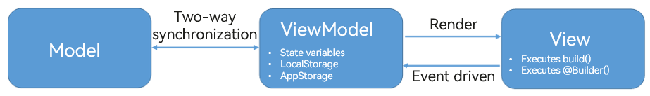
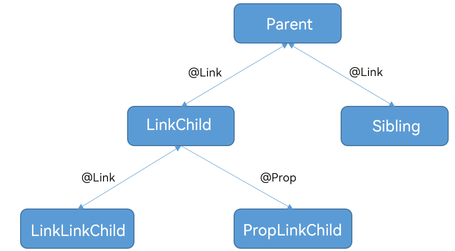
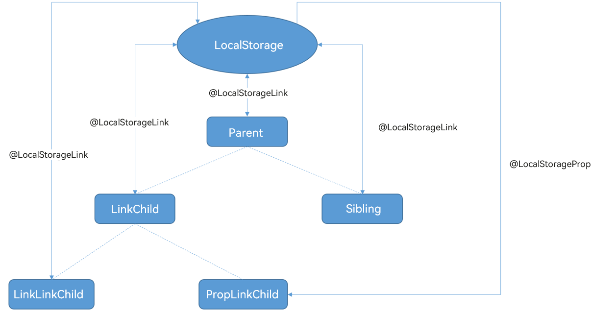

# MVVM


Rendering or re-rendering the UI based on state is complex, but critical to application performance. State data covers a collection of arrays, objects, or nested objects. In ArkUI, the Model-View-View Model (MVVM) pattern is leveraged for state management, where the state management module functions as the view model to bind data (part of model) to views. When data is changed, the views are updated.


- Model: stores data and related logic. It represents data transferred between components or other related business logic. It is responsible for processing raw data.

- View: typically represents the UI rendered by components decorated by \@Component.

- View model: holds data stored in custom component state variables, LocalStorage, and AppStorage.
  - A custom component renders the UI by executing its **build()** method or an \@Builder decorated method. In other words, the view model can render views.
  - The view changes the view model through an event handler, that is, the change of the view model is driven by events. The view model provides the \@Watch callback method to listen for the change of state data.
  - Any change of the view model must be synchronized back to the model to ensure the consistency between the view model and model, that is, the consistency of the application data.
  - The view model structure should always be designed to adapt to the build and re-render of custom components. It is for this purpose that the model and view model are separated.


A number of issues with UI construction and update arise from a poor view model design, which does not well support the rendering of custom components, or does not have a view model as a mediator, resulting in the custom component being forcibly adapted to the model. For example, a data model where an application directly reads data from the SQL database into the memory cannot well adapt to the rendering of custom components. In this scenario, the view model adaptation must be considered during application development.





In the preceding example involving the SQL database, the application should be designed as follows:


- Model: responsible for efficient database operations.

- View model: responsible for efficient UI updates based on the ArkUI state management feature.

- Converters/Adapters: responsible for conversion between the model and view model.
  - Converters/Adapters can convert the model initially read from the database into a view model, and then initialize it.
  - When the UI changes the view model through the event handler, the converters/adapters synchronize the updated data of the view model back to the model.


Compared with the Model-View (MV) pattern, which forcibly fits the UI to the SQL database in this example, the MVVM pattern is more complex. The payback is a better UI performance with simplified UI design and implementation, thanks to its isolation of the view model layer.


## View Model Data Sources


The view model composes data from multiple top-level sources, such as variables decorated by \@State and \@Provide, LocalStorage, and AppStorage. Other decorators synchronize data with these data sources. The top-level data source to use depends on the extent to which the state needs to be shared between custom components as described below in ascending order by sharing scope:


- \@State: component-level sharing, implemented through the named parameter mechanism. It is sharing between the parent component and child component by specifying parameters, for example, **CompA: ({ aProp: this.aProp })**.

- \@Provide: component-level sharing, which is multi-level data sharing implemented by binding with \@Consume through a key. No parameter passing is involved during the sharing.

- LocalStorage: page-level sharing, implemented by sharing LocalStorage instances in the current component tree through \@Entry.

- AppStorage: application-level sharing, which is sharing of application-wide UI state bound with the application process.


### State Data Sharing Through \@State


A one- or two-way data synchronization relationship can be set up from an \@State decorated variable to an \@Prop, \@Link, or \@ObjectLink decorated variable. For details, see [\@State Decorator](arkts-state.md).


1. Use the \@State decorated variable **testNum** in the **Parent** root node as the view model data item. Pass **testNum** to the child components **LinkChild** and **Sibling**.

   ```ts
   // xxx.ets
   @Entry
   @Component
   struct Parent {
     @State @Watch("testNumChange1") testNum: number = 1;
   
     testNumChange1(propName: string): void {
       console.log(`Parent: testNumChange value ${this.testNum}`)
     }
   
     build() {
       Column() {
         LinkChild({ testNum: $testNum })
         Sibling({ testNum: $testNum })
       }
     }
   }
   ```

2. In **LinkChild** and **Sibling**, use \@Link to set up a two-way data synchronization with the data source of the **Parent** component. In this example, **LinkLinkChild** and **PropLinkChild** are created in **LinkChild**.

   ```ts
   @Component
   struct Sibling {
     @Link @Watch("testNumChange") testNum: number;
   
     testNumChange(propName: string): void {
       console.log(`Sibling: testNumChange value ${this.testNum}`);
     }
   
     build() {
       Text(`Sibling: ${this.testNum}`)
     }
   }
   
   @Component
   struct LinkChild {
     @Link @Watch("testNumChange") testNum: number;
   
     testNumChange(propName: string): void {
       console.log(`LinkChild: testNumChange value ${this.testNum}`);
     }
   
     build() {
       Column() {
         Button('incr testNum')
           .onClick(() => {
             console.log(`LinkChild: before value change value ${this.testNum}`);
             this.testNum = this.testNum + 1
             console.log(`LinkChild: after value change value ${this.testNum}`);
           })
         Text(`LinkChild: ${this.testNum}`)
         LinkLinkChild({ testNumGrand: $testNum })
         PropLinkChild({ testNumGrand: this.testNum })
       }
       .height(200).width(200)
     }
   }
   ```

3. Declare **LinkLinkChild** and **PropLinkChild** as follows. Use \@Prop in **PropLinkChild** to set up a one-way data synchronization with the data source of the **LinkChild** component.

   ```ts
   @Component
   struct LinkLinkChild {
     @Link @Watch("testNumChange") testNumGrand: number;
   
     testNumChange(propName: string): void {
       console.log(`LinkLinkChild: testNumGrand value ${this.testNumGrand}`);
     }
   
     build() {
       Text(`LinkLinkChild: ${this.testNumGrand}`)
     }
   }
   
   
   @Component
   struct PropLinkChild {
     @Prop @Watch("testNumChange") testNumGrand: number = 0;
   
     testNumChange(propName: string): void {
       console.log(`PropLinkChild: testNumGrand value ${this.testNumGrand}`);
     }
   
     build() {
       Text(`PropLinkChild: ${this.testNumGrand}`)
         .height(70)
         .backgroundColor(Color.Red)
         .onClick(() => {
           this.testNumGrand += 1;
         })
     }
   }
   ```

   

   When \@Link **testNum** in **LinkChild** changes:

   1. The changes are first synchronized to its parent component **Parent**, and then from **Parent** to **Sibling**.

   2. The changes are also synchronized to the child components **LinkLinkChild** and **PropLinkChild**.

   Different from \@Provide, LocalStorage, and AppStorage, \@State is used with the following constraints:

   - If you want to pass changes to a grandchild component, you must first pass the changes to the child component and then from the child component to the grandchild component.
   - The changes can only be passed by specifying parameters of constructors, that is, through the named parameter mechanism CompA: ({ aProp: this.aProp }).

   A complete code example is as follows:


   ```ts
   @Component
   struct LinkLinkChild {
     @Link @Watch("testNumChange") testNumGrand: number;
   
     testNumChange(propName: string): void {
       console.log(`LinkLinkChild: testNumGrand value ${this.testNumGrand}`);
     }
   
     build() {
       Text(`LinkLinkChild: ${this.testNumGrand}`)
     }
   }
   
   
   @Component
   struct PropLinkChild {
     @Prop @Watch("testNumChange") testNumGrand: number = 0;
   
     testNumChange(propName: string): void {
       console.log(`PropLinkChild: testNumGrand value ${this.testNumGrand}`);
     }
   
     build() {
       Text(`PropLinkChild: ${this.testNumGrand}`)
         .height(70)
         .backgroundColor(Color.Red)
         .onClick(() => {
           this.testNumGrand += 1;
         })
     }
   }
   
   
   @Component
   struct Sibling {
     @Link @Watch("testNumChange") testNum: number;
   
     testNumChange(propName: string): void {
       console.log(`Sibling: testNumChange value ${this.testNum}`);
     }
   
     build() {
       Text(`Sibling: ${this.testNum}`)
     }
   }
   
   @Component
   struct LinkChild {
     @Link @Watch("testNumChange") testNum: number;
   
     testNumChange(propName: string): void {
       console.log(`LinkChild: testNumChange value ${this.testNum}`);
     }
   
     build() {
       Column() {
         Button('incr testNum')
           .onClick(() => {
             console.log(`LinkChild: before value change value ${this.testNum}`);
             this.testNum = this.testNum + 1
             console.log(`LinkChild: after value change value ${this.testNum}`);
           })
         Text(`LinkChild: ${this.testNum}`)
         LinkLinkChild({ testNumGrand: $testNum })
         PropLinkChild({ testNumGrand: this.testNum })
       }
       .height(200).width(200)
     }
   }
   
   
   @Entry
   @Component
   struct Parent {
     @State @Watch("testNumChange1") testNum: number = 1;
   
     testNumChange1(propName: string): void {
       console.log(`Parent: testNumChange value ${this.testNum}`)
     }
   
     build() {
       Column() {
         LinkChild({ testNum: $testNum })
         Sibling({ testNum: $testNum })
       }
     }
   }
   ```


### State Data Sharing Through \@Provide

\@Provide decorated variables can share state data with any descendant component that uses \@Consume to create a two-way synchronization. For details, see [\@Provide and \@Consume Decorators](arkts-provide-and-consume.md).

This \@Provide-\@Consume pattern is more convenient than the \@State-\@Link-\@Link pattern in terms of passing changes from a parent component to a grandchild component. It is suitable for sharing state data in a single page UI component tree.

In the \@Provide-\@Consume pattern, changes are passed by binding \@Consume to \@Provide in the ancestor component through a key, instead of by specifying parameters in the constructor.

The following example uses the \@Provide-\@Consume pattern to pass changes from a parent component to a grandchild component:


```ts
@Component
struct LinkLinkChild {
  @Consume @Watch("testNumChange") testNum: number;

  testNumChange(propName: string): void {
    console.log(`LinkLinkChild: testNum value ${this.testNum}`);
  }

  build() {
    Text(`LinkLinkChild: ${this.testNum}`)
  }
}

@Component
struct PropLinkChild {
  @Prop @Watch("testNumChange") testNumGrand: number = 0;

  testNumChange(propName: string): void {
    console.log(`PropLinkChild: testNumGrand value ${this.testNumGrand}`);
  }

  build() {
    Text(`PropLinkChild: ${this.testNumGrand}`)
      .height(70)
      .backgroundColor(Color.Red)
      .onClick(() => {
        this.testNumGrand += 1;
      })
  }
}

@Component
struct Sibling {
  @Consume @Watch("testNumChange") testNum: number;

  testNumChange(propName: string): void {
    console.log(`Sibling: testNumChange value ${this.testNum}`);
  }

  build() {
    Text(`Sibling: ${this.testNum}`)
  }
}

@Component
struct LinkChild {
  @Consume @Watch("testNumChange") testNum: number;

  testNumChange(propName: string): void {
    console.log(`LinkChild: testNumChange value ${this.testNum}`);
  }

  build() {
    Column() {
      Button('incr testNum')
        .onClick(() => {
          console.log(`LinkChild: before value change value ${this.testNum}`);
          this.testNum = this.testNum + 1
          console.log(`LinkChild: after value change value ${this.testNum}`);
        })
      Text(`LinkChild: ${this.testNum}`)
      LinkLinkChild({ /* empty */ })
      PropLinkChild({ testNumGrand: this.testNum })
    }
    .height(200).width(200)
  }
}

@Entry
@Component
struct Parent {
  @Provide @Watch("testNumChange1") testNum: number = 1;

  testNumChange1(propName: string): void {
    console.log(`Parent: testNumChange value ${this.testNum}`)
  }

  build() {
    Column() {
      LinkChild({ /* empty */ })
      Sibling({ /* empty */ })
    }
  }
}
```


### One- or Two-Way Synchronization for Properties in LocalStorage Instances

You can use \@LocalStorageLink to set up a one-way synchronization for a property in a LocalStorage instance, or use \@LocalStorageProp to set up a two-way synchronization. A LocalStorage instance can be regarded as a map of the \@State decorated variables. For details, see [LocalStorage](arkts-localstorage.md).

A LocalStorage instance can be shared on several pages of an ArkUI application. In this way, state can be shared across pages of an application using \@LocalStorageLink, \@LocalStorageProp, and LocalStorage.

Below is an example.

1. Create a LocalStorage instance and inject it into the root node through \@Entry(storage).

2. When the \@LocalStorageLink("testNum") variable is initialized in the **Parent** component, the **testNum** property, with the initial value set to **1**, is created in the LocalStorage instance, that is, \@LocalStorageLink("testNum") testNum: number = 1.

3. In the child components, use \@LocalStorageLink or \@LocalStorageProp to bind the same property name key to pass data.

The LocalStorage instance can be considered as a map of the \@State decorated variables, and the property name is the key in the map.

The synchronization between \@LocalStorageLink and the corresponding property in LocalStorage is two-way, the same as that between \@State and \@Link.

The following figure shows the flow of component state update.




```ts
@Component
struct LinkLinkChild {
  @LocalStorageLink("testNum") @Watch("testNumChange") testNum: number = 1;

  testNumChange(propName: string): void {
    console.log(`LinkLinkChild: testNum value ${this.testNum}`);
  }

  build() {
    Text(`LinkLinkChild: ${this.testNum}`)
  }
}

@Component
struct PropLinkChild {
  @LocalStorageProp("testNum") @Watch("testNumChange") testNumGrand: number = 1;

  testNumChange(propName: string): void {
    console.log(`PropLinkChild: testNumGrand value ${this.testNumGrand}`);
  }

  build() {
    Text(`PropLinkChild: ${this.testNumGrand}`)
      .height(70)
      .backgroundColor(Color.Red)
      .onClick(() => {
        this.testNumGrand += 1;
      })
  }
}

@Component
struct Sibling {
  @LocalStorageLink("testNum") @Watch("testNumChange") testNum: number = 1;

  testNumChange(propName: string): void {
    console.log(`Sibling: testNumChange value ${this.testNum}`);
  }

  build() {
    Text(`Sibling: ${this.testNum}`)
  }
}

@Component
struct LinkChild {
  @LocalStorageLink("testNum") @Watch("testNumChange") testNum: number = 1;

  testNumChange(propName: string): void {
    console.log(`LinkChild: testNumChange value ${this.testNum}`);
  }

  build() {
    Column() {
      Button('incr testNum')
        .onClick(() => {
          console.log(`LinkChild: before value change value ${this.testNum}`);
          this.testNum = this.testNum + 1
          console.log(`LinkChild: after value change value ${this.testNum}`);
        })
      Text(`LinkChild: ${this.testNum}`)
      LinkLinkChild({ /* empty */ })
      PropLinkChild({ /* empty */ })
    }
    .height(200).width(200)
  }
}

// Create a LocalStorage instance to hold data.
const storage = new LocalStorage();
@Entry(storage)
@Component
struct Parent {
  @LocalStorageLink("testNum") @Watch("testNumChange1") testNum: number = 1;

  testNumChange1(propName: string): void {
    console.log(`Parent: testNumChange value ${this.testNum}`)
  }

  build() {
    Column() {
      LinkChild({ /* empty */ })
      Sibling({ /* empty */ })
    }
  }
}
```


### One- or Two-Way Synchronization for Properties in AppStorage

AppStorage is a singleton of LocalStorage. ArkUI creates this instance when an application is started and uses \@StorageLink and \@StorageProp to implement data sharing across pages. The usage of AppStorage is similar to that of LocalStorage.

You can also use PersistentStorage to persist specific properties in AppStorage to files on the local disk. In this way, \@StorageLink and \@StorageProp decorated properties can restore upon application re-start to the values as they were when the application was closed. For details, see [PersistentStorage](arkts-persiststorage.md).

An example is as follows:


```ts
@Component
struct LinkLinkChild {
  @StorageLink("testNum") @Watch("testNumChange") testNum: number = 1;

  testNumChange(propName: string): void {
    console.log(`LinkLinkChild: testNum value ${this.testNum}`);
  }

  build() {
    Text(`LinkLinkChild: ${this.testNum}`)
  }
}

@Component
struct PropLinkChild {
  @StorageProp("testNum") @Watch("testNumChange") testNumGrand: number = 1;

  testNumChange(propName: string): void {
    console.log(`PropLinkChild: testNumGrand value ${this.testNumGrand}`);
  }

  build() {
    Text(`PropLinkChild: ${this.testNumGrand}`)
      .height(70)
      .backgroundColor(Color.Red)
      .onClick(() => {
        this.testNumGrand += 1;
      })
  }
}

@Component
struct Sibling {
  @StorageLink("testNum") @Watch("testNumChange") testNum: number = 1;

  testNumChange(propName: string): void {
    console.log(`Sibling: testNumChange value ${this.testNum}`);
  }

  build() {
    Text(`Sibling: ${this.testNum}`)
  }
}

@Component
struct LinkChild {
  @StorageLink("testNum") @Watch("testNumChange") testNum: number = 1;

  testNumChange(propName: string): void {
    console.log(`LinkChild: testNumChange value ${this.testNum}`);
  }

  build() {
    Column() {
      Button('incr testNum')
        .onClick(() => {
          console.log(`LinkChild: before value change value ${this.testNum}`);
          this.testNum = this.testNum + 1
          console.log(`LinkChild: after value change value ${this.testNum}`);
        })
      Text(`LinkChild: ${this.testNum}`)
      LinkLinkChild({ /* empty */
      })
      PropLinkChild({ /* empty */
      })
    }
    .height(200).width(200)
  }
}


@Entry
@Component
struct Parent {
  @StorageLink("testNum") @Watch("testNumChange1") testNum: number = 1;

  testNumChange1(propName: string): void {
    console.log(`Parent: testNumChange value ${this.testNum}`)
  }

  build() {
    Column() {
      LinkChild({ /* empty */
      })
      Sibling({ /* empty */
      })
    }
  }
}
```


## Nested View Model


In most cases, view model data items are of complex types, such as arrays of objects, nested objects, or their combinations. In nested scenarios, you can use \@Observed and \@Prop or \@ObjectLink to observe changes.


### \@Prop and \@ObjectLink Nested Data Structures

When possible, design a separate custom component to render each array or object. In this case, an object array or nested object (which is an object whose property is an object) requires two custom components: one for rendering an external array/object, and the other for rendering a class object nested within the array/object. For variables decorated by \@State, \@Prop, \@Link, and \@ObjectLink, only changes at the first layer can be observed.

- For a class:
  - Value assignment changes can be observed: this.obj=new ClassObj(...)
  - Object property changes can be observed: this.obj.a=new ClassA(...)
  - Property changes at a deeper layer cannot be observed: this.obj.a.b = 47

- For an array:
  - The overall value assignment of the array can be observed: this.arr=[...]
  - The deletion, insertion, and replacement of data items can be observed: this.arr[1] = new ClassA(), this.arr.pop(), this.arr.push(new ClassA(...)), this.arr.sort(...)
  - Array changes at a deeper layer cannot be observed: this.arr[1].b = 47

To observe changes of nested objects inside a class, use \@ObjectLink or \@Prop. \@ObjectLink is preferred, which initializes itself through a reference to an internal property of a nested object. \@Prop initializes itself through a deep copy of the nested object to implement one-way synchronization. The reference copy of \@ObjectLink significantly outperforms the deep copy of \@Prop.

\@ObjectLink or \@Prop can be used to store nested objects of a class. This class must be decorated with \@Observed. Otherwise, its property changes will not trigger UI re-rendering. \@Observed implements a custom constructor for its decorated class. This constructor creates an instance of a class and uses the ES6 proxy wrapper (implemented by the ArkUI framework) to intercept all get and set operations on the decorated class property. "Set" observes the property value. When value assignment occurs, the ArkUI framework is notified of the update. "Get" collects UI components that depend on this state variable to minimize UI re-rendering.

In the nested scenario, use the \@Observed decorator as follows:

- If the nested data is a class, directly decorate it with \@Observed.

- If the nested data is an array, you can observe the array change in the following way:

  ```ts
  @Observed class ObservedArray<T> extends Array<T> {
      constructor(args: T[]) {
          if (args instanceof Array) {
            super(...args);
          } else {
            super(args)
          }
      }
      /* otherwise empty */
  }
  ```

  The view model is the outer class.


  ```ts
  class Outer {
    innerArrayProp : ObservedArray<string> = [];
    ...
  }
  ```


### Differences Between \@Prop and \@ObjectLink in Nested Data Structures

In the following example:

- The parent component **ViewB** renders \@State arrA: Array\<ClassA>. \@State can observe the allocation of new arrays, and insertion, deletion, and replacement of array items.

- The child component **ViewA** renders each object of **ClassA**.

- With \@ObjectLink a: ClassA:

  - When \@Observed ClassA is used, the changes of **ClassA** objects nested in the array can be observed.

  - When \@Observed ClassA is not used,
    this.arrA[Math.floor(this.arrA.length/2)].c=10 in **ViewB** cannot be observed, and therefore the **ViewA** component will not be updated.

    For the first and second array items in the array, both of them initialize two **ViewA** objects and render the same **ViewA** instance. When this.a.c += 1; is assigned to a property in **ViewA**, another **ViewA** initialized from the same **ClassA** is not re-rendered.


```ts
let NextID: number = 1;

// Use the class decorator @Observed to decorate ClassA.
@Observed
class ClassA {
  public id: number;
  public c: number;

  constructor(c: number) {
    this.id = NextID++;
    this.c = c;
  }
}

@Component
struct ViewA {
  @ObjectLink a: ClassA;
  label: string = "ViewA1";

  build() {
    Row() {
      Button(`ViewA [${this.label}] this.a.c= ${this.a.c} +1`)
        .onClick(() => {
          // Change the object property.
          this.a.c += 1;
        })
    }
  }
}

@Entry
@Component
struct ViewB {
  @State arrA: ClassA[] = [new ClassA(0), new ClassA(0)];

  build() {
    Column() {
      ForEach(this.arrA,
        (item: ClassA) => {
          ViewA({ label: `#${item.id}`, a: item })
        },
        (item: ClassA): string => { return item.id.toString(); }
      )

      Divider().height(10)

      if (this.arrA.length) {
        ViewA({ label: `ViewA this.arrA[first]`, a: this.arrA[0] })
        ViewA({ label: `ViewA this.arrA[last]`, a: this.arrA[this.arrA.length-1] })
      }

      Divider().height(10)

      Button(`ViewB: reset array`)
        .onClick(() => {
          // Replace the entire array, which will be observed by @State this.arrA.
          this.arrA = [new ClassA(0), new ClassA(0)];
        })
      Button(`array push`)
        .onClick(() => {
          // Insert data into the array, which will be observed by @State this.arrA.
          this.arrA.push(new ClassA(0))
        })
      Button(`array shift`)
        .onClick(() => {
          // Remove data from the array, which will be observed by @State this.arrA.
          this.arrA.shift()
        })
      Button(`ViewB: chg item property in middle`)
        .onClick(() => {
          // Replace an item in the array, which will be observed by @State this.arrA.
          this.arrA[Math.floor(this.arrA.length / 2)] = new ClassA(11);
        })
      Button(`ViewB: chg item property in middle`)
        .onClick(() => {
          // Change property c of an item in the array, which will be observed by @ObjectLink in ViewA.
          this.arrA[Math.floor(this.arrA.length / 2)].c = 10;
        })
    }
  }
}
```

In **ViewA**, replace \@ObjectLink with \@Prop.


```ts
@Component
struct ViewA {

  @Prop a: ClassA = new ClassA(0);
  label : string = "ViewA1";

  build() {
     Row() {
        Button(`ViewA [${this.label}] this.a.c= ${this.a.c} +1`)
        .onClick(() => {
            // Change the object property.
            this.a.c += 1;
        })
     }
  }
}
```

When \@ObjectLink is used, if you click the first or second item of the array, the following two **ViewA** instances change synchronously.

Unlike \@ObjectLink, \@Prop sets up a one-way data synchronization. Clicking the button in **ViewA** triggers only the re-rendering of the button itself and is not propagated to other **ViewA** instances. **ClassA** in **ViewA** is only a copy, not an object of its parent component \@State arrA : Array\<ClassA>, nor a **ClassA** instance of any other **ViewA**. As a result, though on the surface, the array and **ViewA** have the same object passed in, two irrelevant objects are used for rendering on the UI.

Note the differences between \@Prop and \@ObjectLink: \@ObjectLink decorated variables are readable only and cannot be assigned values, whereas \@Prop decorated variables can be assigned values.

- \@ObjectLink implements two-way data synchronization because it is initialized through a reference to the data source.

- \@Prop implements one-way data synchronization and requires a deep copy of the data source.

- To assign a new object to \@Prop is to overwrite the local value. However, for \@ObjectLink, to assign a new object is to update the array item or class property in the data source, which is not possible in TypeScript/JavaScript.


## Example


The following example discusses the design of nested view models, especially how a custom component renders a nested object. This scenario is common in real-world application development.


Let's develop a phonebook application to implement the following features:


- Display the phone numbers of contacts and the local device ("Me").

- You can select a contact and edit its information, including the phone number and address.

- When you update contact information, the changes are saved only after you click **Save Changes**.

- You can click **Delete Contact** to delete a contact from the contacts list.


In this example, the view model needs to include the following:


- **AddressBook** (class)
  - **me**: stores a **Person** class.
  - **contacts**: stores a **Person** class array.


The **AddressBook** class is declared as follows:

```ts
export class AddressBook {
  me: Person;
  contacts: ObservedArray<Person>;
  
  constructor(me: Person, contacts: Person[]) {
    this.me = me;
    this.contacts = new ObservedArray<Person>(contacts);
  }
}
```


- Person (class)
  - name : string
  - address : Address
  - phones: ObservedArray\<string>;
  - Address (class)
    - street : string
    - zip : number
    - city : string


The **Address** class is declared as follows:

```ts
@Observed
export class Address {
  street: string;
  zip: number;
  city: string;

  constructor(street: string,
              zip: number,
              city: string) {
    this.street = street;
    this.zip = zip;
    this.city = city;
  }
}
```


The **Person** class is declared as follows:

```ts
let nextId = 0;

@Observed
export class Person {
  id_: string;
  name: string;
  address: Address;
  phones: ObservedArray<string>;

  constructor(name: string,
              street: string,
              zip: number,
              city: string,
              phones: string[]) {
    this.id_ = `${nextId}`;
    nextId++;
    this.name = name;
    this.address = new Address(street, zip, city);
    this.phones = new ObservedArray<string>(phones);
  }
}
```


Note that **phones** is a nested property. To observe its change, you need to extend the array to an **ObservedArray** class and decorate it with \@Observed. The **ObservedArray** class is declared as follows:

```ts
@Observed
export class ObservedArray<T> extends Array<T> {
  constructor(args: T[]) {
    console.log(`ObservedArray: ${JSON.stringify(args)} `)
    if (args instanceof Array) {
      super(...args);
    } else {
      super(args)
    }
  }
}
```


- **selected**: reference to **Person**.


The update process is as follows:


1. Initialize all data in the root node **PageEntry**, and establish two-way data synchronization between **me** and **contacts** and its child component **AddressBookView**. The default value of **selectedPerson** is **me**. Note that **selectedPerson** is not data in the **PageEntry** data source, but a reference to a **Person** object in the data source.
   **PageEntry** and **AddressBookView** are declared as follows:


   ```ts
   @Component
   struct AddressBookView {
   
       @ObjectLink me : Person;
       @ObjectLink contacts : ObservedArray<Person>;
       @State selectedPerson: Person = new Person("", "", 0, "", []);
   
       aboutToAppear() {
           this.selectedPerson = this.me;
       }
   
       build() {
           Flex({ direction: FlexDirection.Column, justifyContent: FlexAlign.Start}) {
               Text("Me:")
               PersonView({
                person: this.me,
                phones: this.me.phones,
                selectedPerson: this.selectedPerson
              })
   
               Divider().height(8)
   
              ForEach(this.contacts, (contact: Person) => {
                PersonView({
                  person: contact,
                  phones: contact.phones as ObservedArray<string>,
                  selectedPerson: this.selectedPerson
                })
              },
                (contact: Person): string => { return contact.id_; }
              )

               Divider().height(8)
   
               Text("Edit:")
               PersonEditView({ 
                selectedPerson: this.selectedPerson, 
                name: this.selectedPerson.name, 
                address: this.selectedPerson.address, 
                phones: this.selectedPerson.phones 
              })
           }
               .borderStyle(BorderStyle.Solid).borderWidth(5).borderColor(0xAFEEEE).borderRadius(5)
       }
   }
   
   @Entry
   @Component
   struct PageEntry {
     @Provide addrBook: AddressBook = new AddressBook(
       new Person("Gigi", "Itamerenkatu 9", 180, "Helsinki", ["18*********", "18*********", "18*********"]),
       [
         new Person("Oly", "Itamerenkatu 9", 180, "Helsinki", ["18*********", "18*********"]),
         new Person("Sam", "Itamerenkatu 9", 180, "Helsinki", ["18*********", "18*********"]),
         new Person("Vivi", "Itamerenkatu 9", 180, "Helsinki", ["18*********", "18*********"]),
       ]);
   
     build() {
       Column() {
         AddressBookView({ 
          me: this.addrBook.me, 
          contacts: this.addrBook.contacts, 
          selectedPerson: this.addrBook.me 
        })
       }
     }
   }
   ```

2. **PersonView** is the view that shows a contact name and preferred phone number in the phonebook. When you select a contact (person), that contact is highlighted and needs to be synchronized back to the **selectedPerson** of the parent component **AddressBookView**. In this case, two-way data synchronization needs to be established through \@Link.
   **PersonView** is declared as follows:


   ```ts
   // Display the contact name and preferred phone number.
   // To update the phone number, @ObjectLink person and @ObjectLink phones are required.
   // this.person.phones[0] cannot be used to display the preferred phone number because @ObjectLink person only proxies the Person property and cannot observe the changes inside the array.
   // Trigger the onClick event to update selectedPerson.
   @Component
   struct PersonView {
   
       @ObjectLink person : Person;
       @ObjectLink phones :  ObservedArray<string>;
   
       @Link selectedPerson : Person;
   
       build() {
           Flex({ direction: FlexDirection.Row, justifyContent: FlexAlign.SpaceBetween }) {
             Text(this.person.name)
             if (this.phones.length > 0) {
               Text(this.phones[0])
             }
           }
           .height(55)
           .backgroundColor(this.selectedPerson.name == this.person.name ? "#ffa0a0" : "#ffffff")
           .onClick(() => {
               this.selectedPerson = this.person;
           })
       }
   }
   ```

3. The information about the selected contact (person) is displayed in the **PersonEditView** object. The data synchronization for the **PersonEditView** can be implemented as follows:

   - When the user's keyboard input is received in the Edit state through the **Input.onChange** callback event, the change should be reflected in the current **PersonEditView**, but does not need to be synchronized back to the data source before **Save Changes** is clicked. In this case, \@Prop is used to make a deep copy of the information about the current contact (person).

   - Through \@Link **seletedPerson: Person**, **PersonEditView** establishes two-way data synchronization with **selectedPerson** of **AddressBookView**. When you click **Save Changes**, the change to \@Prop is assigned to \@Link **seletedPerson: Person**. In this way, the data is synchronized back to the data source.

   - In **PersonEditView**, \@Consume **addrBook: AddressBook** is used to set up two-way synchronization with the root node **PageEntry**. When you delete a contact on the **PersonEditView** page, the deletion is directly synchronized to **PageEntry**, which then instructs **AddressBookView** to update the contracts list page. **PersonEditView** is declared as follows:

     ```ts
     // Render the information about the contact (person).
     // The @Prop decorated variable makes a deep copy from the parent component AddressBookView and retains the changes locally. The changes of TextInput apply only to the local copy.
     // Click Save Changes to copy all data to @Link through @Prop and synchronize the data to other components.
     @Component
     struct PersonEditView {
     
         @Consume addrBook : AddressBook;
     
         /* Reference pointing to selectedPerson in the parent component. */
         @Link selectedPerson: Person;
     
         /* Make changes on the local copy until you click Save Changes. */
         @Prop name: string = "";
         @Prop address : Address = new Address("", 0, "");
         @Prop phones : ObservedArray<string> = [];
     
         selectedPersonIndex() : number {
             return this.addrBook.contacts.findIndex((person: Person) => person.id_ == this.selectedPerson.id_);
         }
     
         build() {
             Column() {
                 TextInput({ text: this.name})
                     .onChange((value) => {
                         this.name = value;
                       })
                 TextInput({text: this.address.street})
                     .onChange((value) => {
                         this.address.street = value;
                     })
     
                 TextInput({text: this.address.city})
                     .onChange((value) => {
                         this.address.city = value;
                     })
     
                 TextInput({text: this.address.zip.toString()})
                     .onChange((value) => {
                         const result = Number.parseInt(value);
                         this.address.zip= Number.isNaN(result) ? 0 : result;
                     })
     
                 if (this.phones.length > 0) {
                   ForEach(this.phones,
                     (phone: ResourceStr, index?:number) => {
                       TextInput({ text: phone })
                         .width(150)
                         .onChange((value) => {
                           console.log(`${index}. ${value} value has changed`)
                           this.phones[index!] = value;
                         })
                     },
                     (phone: ResourceStr, index?:number) => `${index}`
                   )
                 }

                 Flex({ direction: FlexDirection.Row, justifyContent: FlexAlign.SpaceBetween }) {
                     Text("Save Changes")
                         .onClick(() => {
                             // Assign the updated value of the local copy to the reference pointing to selectedPerson in the parent component.
                             // Do not create new objects. Modify the properties of the existing objects instead.
                             this.selectedPerson.name = this.name;
                             this.selectedPerson.address = new Address(this.address.street, this.address.zip, this.address.city)
                             this.phones.forEach((phone : string, index : number) => { this.selectedPerson.phones[index] = phone } );
                         })
                     if (this.selectedPersonIndex()!=-1) {
                         Text("Delete Contact")
                             .onClick(() => {
                                 let index = this.selectedPersonIndex();
                                 console.log(`delete contact at index ${index}`);
     
                                 // Delete the current contact.
                                 this.addrBook.contacts.splice(index, 1);
     
                                 // Delete the current selectedPerson. The selected contact is then changed to the contact immediately before the deleted contact.
                                 index = (index < this.addrBook.contacts.length) ? index : index-1;
     
                                 // If all contracts are deleted, the me object is selected.
                                 this.selectedPerson = (index>=0) ? this.addrBook.contacts[index] : this.addrBook.me;
                             })
                     }
                 }
     
             }
         }
     }
     ```

     Pay attention to the following differences between \@ObjectLink and \@Link:

     1. To implement two-way data synchronization with the parent component, you need to use \@ObjectLink, instead of \@Link, to decorate **me: Person** and **contacts: ObservedArray\<Person>** in **AddressBookView**. The reasons are as follows:
        - The type of the \@Link decorated variable must be the same as that of the data source, and \@Link can only observe the changes at the first layer.
        - \@ObjectLink allows for initialization from the property of the data source. It functions as a proxy for the properties of the \@Observed decorated class and can observe the changes of the properties of that class.
     2. When the contact name (**Person.name**) or preferred phone number (**Person.phones[0]**) is updated, **PersonView** needs to be updated. As the update to **Person.phones[0]** occurs at the second layer, it cannot be observed if \@Link is used. In addition, \@Link requires its decorated variable be of the same type as the data source. Therefore, \@ObjectLink is required in **PersonView**, that is, \@ObjectLink **person: Person** and \@ObjectLink **phones: ObservedArray\<string>**.

     

     Now you have a basic idea of how to build a view model. In the root node of an application, the view model may comprise a huge amount of nested data, which is more often the case. Yet, you can make reasonable separation of the data in the UI tree structure. You can adapt the view model data items to views so that the view at each layer contains relatively flat data, and you only need to observe changes at the current layer.

     In this way, the UI re-render workload is minimized, leading to higher application performance.

     The complete sample code is as follows:


```ts
// ViewModel classes
let nextId = 0;

@Observed
export class ObservedArray<T> extends Array<T> {
  constructor(args: T[]) {
    console.log(`ObservedArray: ${JSON.stringify(args)} `)
    if (args instanceof Array) {
      super(...args);
    } else {
      super(args)
    }
  }
}

@Observed
export class Address {
  street: string;
  zip: number;
  city: string;

  constructor(street: string,
              zip: number,
              city: string) {
    this.street = street;
    this.zip = zip;
    this.city = city;
  }
}

@Observed
export class Person {
  id_: string;
  name: string;
  address: Address;
  phones: ObservedArray<string>;

  constructor(name: string,
              street: string,
              zip: number,
              city: string,
              phones: string[]) {
    this.id_ = `${nextId}`;
    nextId++;
    this.name = name;
    this.address = new Address(street, zip, city);
    this.phones = new ObservedArray<string>(phones);
  }
}

export class AddressBook {
  me: Person;
  contacts: ObservedArray<Person>;

  constructor(me: Person, contacts: Person[]) {
    this.me = me;
    this.contacts = new ObservedArray<Person>(contacts);
  }
}

// Render the name of the Person object and the first phone number in the @Observed array <string>.
// To update the phone number, @ObjectLink person and @ObjectLink phones are required.
// this.person.phones cannot be used. Otherwise, changes to items inside the array will not be observed.
// Update selectedPerson in onClick in AddressBookView and PersonEditView.
@Component
struct PersonView {
  @ObjectLink person: Person;
  @ObjectLink phones: ObservedArray<string>;
  @Link selectedPerson: Person;

  build() { 
    Flex({ direction: FlexDirection.Row, justifyContent: FlexAlign.SpaceBetween }) {
      Text(this.person.name)
      if (this.phones.length) {
        Text(this.phones[0])
      }
    }
    .height(55)
    .backgroundColor(this.selectedPerson.name == this.person.name ? "#ffa0a0" : "#ffffff")
    .onClick(() => {
      this.selectedPerson = this.person;
    })
  }
}

@Component
struct phonesNumber {
  @ObjectLink phoneNumber: ObservedArray<string>

  build() {
    Column() {

      ForEach(this.phoneNumber,
        (phone: ResourceStr, index?: number) => {
          TextInput({ text: phone })
            .width(150)
            .onChange((value) => {
              console.log(`${index}. ${value} value has changed`)
              this.phoneNumber[index!] = value;
            })
        },
        (phone: ResourceStr, index: number) => `${this.phoneNumber[index] + index}`
      )
    }
  }
}


// Render the information about the contact (person).
// The @Prop decorated variable makes a deep copy from the parent component AddressBookView and retains the changes locally. The changes of TextInput apply only to the local copy.
// Click Save Changes to copy all data to @Link through @Prop and synchronize the data to other components.
@Component
struct PersonEditView {
  @Consume addrBook: AddressBook;
  /* Reference pointing to selectedPerson in the parent component. */
  @Link selectedPerson: Person;
  /* Make changes on the local copy until you click Save Changes. */
  @Prop name: string = "";
  @Prop address: Address = new Address("", 0, "");
  @Prop phones: ObservedArray<string> = [];

  selectedPersonIndex(): number {
    return this.addrBook.contacts.findIndex((person: Person) => person.id_ == this.selectedPerson.id_);
  }

  build() {
    Column() {
      TextInput({ text: this.name })
        .onChange((value) => {
          this.name = value;
        })
      TextInput({ text: this.address.street })
        .onChange((value) => {
          this.address.street = value;
        })

      TextInput({ text: this.address.city })
        .onChange((value) => {
          this.address.city = value;
        })

      TextInput({ text: this.address.zip.toString() })
        .onChange((value) => {
          const result = Number.parseInt(value);
          this.address.zip = Number.isNaN(result) ? 0 : result;
        })

      if (this.phones.length > 0) {
        phonesNumber({ phoneNumber: this.phones })
      }

      Flex({ direction: FlexDirection.Row, justifyContent: FlexAlign.SpaceBetween }) {
        Text("Save Changes")
          .onClick(() => {
            // Assign the updated value of the local copy to the reference pointing to selectedPerson in the parent component.
            // Do not create new objects. Modify the properties of the existing objects instead.
            this.selectedPerson.name = this.name;
            this.selectedPerson.address = new Address(this.address.street, this.address.zip, this.address.city)
            this.phones.forEach((phone: string, index: number) => {
              this.selectedPerson.phones[index] = phone
            });
          })
        if (this.selectedPersonIndex() != -1) {
          Text("Delete Contact")
            .onClick(() => {
              let index = this.selectedPersonIndex();
              console.log(`delete contact at index ${index}`);

              // Delete the current contact.
              this.addrBook.contacts.splice(index, 1);

              // Delete the current selectedPerson. The selected contact is then changed to the contact immediately before the deleted contact.
              index = (index < this.addrBook.contacts.length) ? index : index - 1;

              // If all contracts are deleted, the me object is selected.
              this.selectedPerson = (index >= 0) ? this.addrBook.contacts[index] : this.addrBook.me;
            })
        }
      }

    }
  }
}

@Component
struct AddressBookView {
  @ObjectLink me: Person;
  @ObjectLink contacts: ObservedArray<Person>;
  @State selectedPerson: Person = new Person("", "", 0, "", []);

  aboutToAppear() {
    this.selectedPerson = this.me;
  }

  build() {
    Flex({ direction: FlexDirection.Column, justifyContent: FlexAlign.Start }) {
      Text("Me:")
      PersonView({
        person: this.me,
        phones: this.me.phones,
        selectedPerson: this.selectedPerson
      })

      Divider().height(8)

      ForEach(this.contacts, (contact: Person) => {
        PersonView({
          person: contact,
          phones: contact.phones as ObservedArray<string>,
          selectedPerson: this.selectedPerson
        })
      },
        (contact: Person): string => {
          return contact.id_;
        }
      )

      Divider().height(8)

      Text("Edit:")
      PersonEditView({
        selectedPerson: this.selectedPerson,
        name: this.selectedPerson.name,
        address: this.selectedPerson.address,
        phones: this.selectedPerson.phones
      })
    }
    .borderStyle(BorderStyle.Solid).borderWidth(5).borderColor(0xAFEEEE).borderRadius(5)
  }
}

@Entry
@Component
struct PageEntry {
  @Provide addrBook: AddressBook = new AddressBook(
    new Person("Gigi", "Itamerenkatu 9", 180, "Helsinki", ["18*********", "18*********", "18*********"]),
    [
      new Person("Oly", "Itamerenkatu 9", 180, "Helsinki", ["11*********", "12*********"]),
      new Person("Sam", "Itamerenkatu 9", 180, "Helsinki", ["13*********", "14*********"]),
      new Person("Vivi", "Itamerenkatu 9", 180, "Helsinki", ["15*********", "168*********"]),
    ]);

  build() {
    Column() {
      AddressBookView({
        me: this.addrBook.me,
        contacts: this.addrBook.contacts,
        selectedPerson: this.addrBook.me
      })
    }
  }
}
```

