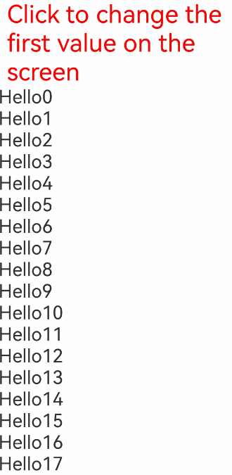
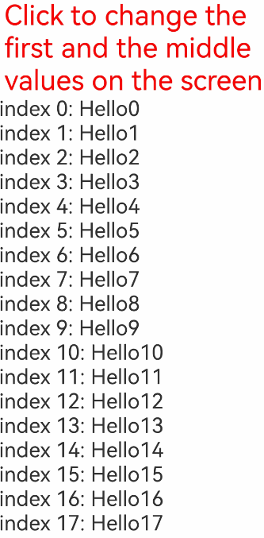

# Repeat: Reusing Child Components

>**Note:**
>
>Repeat is supported since API version 12.
>
>State management V2 is still under development, and some features may be incomplete or not always work as expected.

When **virtualScroll** is disabled, the **Repeat** component, which is used together with the container component, performs loop rendering based on array data. In addition, the component returned by the API should be a child component that can be contained in the **Repeat** parent container. Compared with ForEach, **Repeat** optimizes the rendering performance in some update scenarios and generates function with the index maintained by the framework.

When **virtualScroll** is enabled, **Repeat** iterates data from the provided data source as required and creates the corresponding component during each iteration. When **Repeat** is used in the scrolling container, the framework creates components as required based on the visible area of the scrolling container. When a component slides out of the visible area, the framework caches the component and uses it in the next iteration.

## API Description

### Repeat Construction

```ts
declare const Repeat: <T>(arr: Array<T>) => RepeatAttribute<T>
```

Parameters

| Name | Type  | Mandatory | Description                                              |
| ------ | ---------- | -------- | ------------------------------------------------------ |
| arr    | Array\<T\> | Yes      | Data source, which is an array of the **Array<T>** type. You can determine the data types. |

### Repeat Attributes

```ts
declare class RepeatAttribute<T> {
  each(itemGenerator: (repeatItem: RepeatItem<T>) => void): RepeatAttribute<T>;
  key(keyGenerator: (item: T, index: number) => string): RepeatAttribute<T>;
  virtualScroll(virtualScrollOptions?: VirtualScrollOptions): RepeatAttribute<T>;
  template(type: string, itemBuilder: RepeatItemBuilder<T>, templateOptions?: TemplateOptions): RepeatAttribute<T>;
  templateId(typedFunc: TemplateTypedFunc<T>): RepeatAttribute<T>;
}
```

Parameters

| Name       | Type                                                    | Description                                                    |
| ------------- | ------------------------------------------------------------ | ------------------------------------------------------------ |
| each          | itemGenerator: (repeatItem: RepeatItem\<T\>) => void         | Component generator.<br>**Note:**<br>- The **each** attribute is mandatory. Otherwise, an error occurs during running.<br>- The parameter of **itemGenerator** is **RepeatItem**, which combines **item** and **index**. Do not split the **RepeatItem** and use it separately. |
| key           | keyGenerator: (item: T, index: number) => string             | Key generator.<br>- It generates a key for each data item in an array.<br>- **item**: data item in the **arr** array.<br>- **index**: index of a data item in the **arr** array. |
| virtualScroll | virtualScrollOptions?: VirtualScrollOptions                  | Virtual scrolling is enabled for the **Repeat**.<br>- **virtualScrollOptions**: virtual scrolling configuration. |
| template      | type: string, itemBuilder: RepeatItemBuilder\<T\>, templateOptions?: TemplateOptions | Template for reusing.<br>This function is not supported when **virtualScroll** is disabled.<br>- **type**: current template type.<br>- **itemBuilder**: component generator.<br>- **templateOptions**: current template configuration. |
| templateId    | typedFunc: TemplateTypedFunc\<T\>                              | Assigns a template type to the current data item.<br>- **typedFunc**: generates the template type corresponding to the current data item.<br>Data items that do not match **template** and **templateId** are generated using the **each** function by default. |

### RepeatItem

```ts
interface RepeatItem<T> {
  item: T,
  index: number
}
```

Attributes

| Name | Type  | Mandatory | Description                                        |
| ------ | ------ | -------- | -------------------------------------------- |
| item   | T      | Yes      | Each data item in **arr**. **T** indicates the data type passed in. |
| index  | number | Yes      | Index corresponding to the current data item.                      |

### VirtualScrollOptions

```
interface VirtualScrollOptions {
  totalCount?: number;
}
```

Attributes

| Name    | Type  | Mandatory | Description                                                        |
| ---------- | ------ | -------- | ------------------------------------------------------------ |
| totalCount | number | No      | Total number of current data records. The rule for determining the data length is as follows: totalCount ? max (totalCount, data source length): data source length.<br>In this way, you can use the correct scrollbar style without requesting all the data at the same time. |

### RepeatItemBuilder

```
declare type RepeatItemBuilder<T> = (repeatItem: RepeatItem<T>) => void;
```

Parameters

| Name    | Type         | Mandatory     | Description                                   |
| ---------- | ------------- | --------------------------------------- | --------------------------------------- |
| repeatItem | RepeatItem\<T\> | Yes | A state variable that combines **item** and **index**. |

### TemplateOptions

```
interface TemplateOptions {
  cachedCount?: number
}
```

Attributes

| Name     | Type  | Mandatory | Description                                                        |
| ----------- | ------ | -------- | ------------------------------------------------------------ |
| cachedCount | number | No      | Maximum number of subnodes that can be cached in the **Repeat** cache pool of the current template. The default value is 1 and this attribute takes effect only after the **virtualScroll** is enabled.<br>When **cachedCount** is set to the maximum number of nodes that may appear on the screen of the current template, **Repeat** can be reused as much as possible. However, when there is no node of the current template on the screen, the cache pool is not released and the application memory increases. You need to set the configuration based on the actual situation.<br>The default value of **cachedCount** of the **each** method is 1 and it cannot be changed. |

### TemplateTypedFunc

```
declare type TemplateTypedFunc<T> = (item : T, index : number) => string;
```

Parameters

| Name | Type  | Mandatory | Description                                        |
| ------ | ------ | -------- | -------------------------------------------- |
| item   | T      | Yes      | Each data item in **arr**. **T** indicates the data type passed in. |
| index  | number | Yes      | Index corresponding to the current data item.                      |

## Constraints

- **Repeat** must be used in container components. Only the following components support virtual scrolling: [List](../reference/apis-arkui/arkui-ts/ts-container-list.md), [ListItemGroup](../reference/apis-arkui/arkui-ts/ts-container-listitemgroup.md), [Grid](../reference/apis-arkui/arkui-ts/ts-container-grid.md), [Swiper](../reference/apis-arkui/arkui-ts/ts-container-swiper.md) and [WaterFlow](../reference/apis-arkui/arkui-ts/ts-container-waterflow.md). In this case, **cachedCount** takes effect. Do not enable the **virtualScroll** function when other container components are using the **Repeat** component.
- After **virtualScroll** is enabled for **Repeat**, only one child component can be created in each iteration. Otherwise, there is no constraint.
- The generated child components must be allowed in the parent container component of **Repeat**.
- **Repeat** can be included in an **if/else** statement, and can also contain such a statement.
- **Repeat** uses key as identifiers internally. Therefore, the key generator must generate a unique value for each piece of data. If the key generated for multiple pieces of data at the same time are the same, UI component rendering will be faulty.
- If **virtualScroll** is disabled, the **template** is not supported currently and problems may occur when reusing.

## Key Generation Rules

### non-virtualScroll


### virtualScroll

**virtualScroll** has a key generation rules similar to that of **non-virtualScroll.** However, it does not automatically handle the duplicate keys, so you need to ensure that the keys are unique.


## Component Generation and Reuse Rules

### non-virtualScroll

All child components are created when **Repeat** is rendered for the first time. The original components are reused when data is updated.

When the **Repeat** component updates data, it compares all keys in the last update with those in the latest update. If the current key is the same as the last one, **Repeat** reuses the child component and updates the **RepeatItem.index** index.

After **Repeat** compares all duplicate keys and reuses them, if the last key is unique and a new key is generated after this update, a child component needs to be created. In this case, **Repeat** will reuse redundant child components, update the **RepeatItem.item** data source and **RepeatItem.index** index, and re-render the UI.

If the number of remaining child components is greater than or equal to the number of newly updated components, the components are fully reused and redundant components are released. If the number of remaining child components is less than the number of newly updated components, **Repeat** will create components corresponding to the extra data items after the remaining data items are all reused.

### virtualScroll

At the first time when **Repeat** renders child components, only the required component is generated. During sliding and data update, nodes on the lower screen are cached. When a new component needs to be generated, the cached component is reused.

#### Slide shortcut

The following figure describes the node state before sliding.


Currently, the **Repeat** component has two types of templateId. **templateId a** sets three as its maximum cache value for the corresponding cache pool. **templateId b** sets four as its maximum cache value and preloads one note for its parent components by default. In this case, we swipe right on the screen, and **Repeat** will reuse the nodes in the cache pool.


The data of **index=18** enters the screen and the preloading range of the parent component, coming up with a result of **templateId b**. In this case, **Repeat** obtains a node from the **type=b** cache pool for reuse and updates its key, index, and data. Other grandchildren notes that use the data and index in the child node are updated based on the state management V2 rules.

The **index=10** note slides out of the screen and the preloading range of the parent component. When the UI main thread is idle, it checks whether the **type=a** cache pool has sufficient space. In this case, there are four nodes in the cache pool, which exceeds the rated three, so **Repeat** will release the last node.


#### Data Update Scenarios


In this case, you will delete the **index=12** node, update the data of the **index=13** node, change the **templateId b** to **templateId a** of the **index=14** node, and update the key of the **index=15** node.


Now, **Repeat** notifies the parent component to re-lay out the node and compares the keys one by one. If the **key** and **templateId** of the node are the same as those of the original node, you can reuse the note and update the **index** and **data**. If the keys are different, you can reuse the node in the cache pool with the same **templateId** and update the **key**, **index**, and **data**.


As shown in the preceding figure, you have updated the **data** and **index** of **node 13** and the **templateId** of **node14**. Because of the changed key, **node15** obtains a reuse from the cache pool and updates the **key**, **index**, and **data**. Only the **index** of **node16** and **node17** is updated . The **index=17** node is new and reused from the cache pool.


## Use Scenarios

### non-virtualScroll

#### Changing the Data Source

When **Repeat** component implements the non-initial rendering, it compares all keys in the last update with those in the latest update. If the current key is the same as the last one, **Repeat** reuses the child component and updates the **RepeatItem.index** index.

After **Repeat** compares all duplicate keys and reuses them, if the last key is unique and a new key is generated after this update, a child component needs to be created. In this case, **Repeat** will reuse redundant child components and update the **RepeatItem.item** data source and **RepeatItem.index** index.

If the number of remaining child components is greater than or equal to the number of newly updated components, the components are fully reused. If the number of remaining child components is less than the number of newly updated components, **Repeat** will create components corresponding to the extra data items after the remaining components are all reused.

```ts
@Entry
@ComponentV2
struct Parent {
  @Local simpleList: Array<string> = ['one', 'two', 'three'];

  build() {
    Row() {
      Column() {
        Text('Click to change the value of the third array item')
          .fontSize(24)
          .fontColor(Color.Red)
          .onClick(() => {
            this.simpleList[2] = 'new three';
          })

        Repeat<string>(this.simpleList)
            .each((obj: RepeatItem<string>)=>{
              ChildItem({ item: obj.item })
                .margin({top: 20})
            })
            .key((item: string) => item)
      }
      .justifyContent(FlexAlign.Center)
      .width('100%')
      .height('100%')
    }
    .height('100%')
    .backgroundColor(0xF1F3F5)
  }
}

@ComponentV2
struct ChildItem {
  @Param @Require item: string;

  build() {
    Text(this.item)
      .fontSize(30)
  }
}
```


The component of the third array item is reused when the array item is re-rendered, and only the data is refreshed.

#### Changing the Index Value

In the following example, when array items 1 and 2 are exchanged, if the key is as the same as the last one, **Repeat** reuses the previous component and updates only the data of the component that uses the **index** value.

```ts
@Entry
@ComponentV2
struct Parent {
  @Local simpleList: Array<string> = ['one', 'two', 'three'];

  build() {
    Row() {
      Column() {
        Text ('Exchange array items 1 and 2')
          .fontSize(24)
          .fontColor(Color.Red)
          .onClick(() => {
            let temp: string = this.simpleList[2]
            this.simpleList[2] = this.simpleList[1]
            this.simpleList[1] = temp
          })
          .margin({bottom: 20})

        Repeat<string>(this.simpleList)
          .each((obj: RepeatItem<string>)=>{
            Text("index: " + obj.index)
              .fontSize(30)
            ChildItem({ item: obj.item })
              .margin({bottom: 20})
          })
          .key((item: string) => item)
      }
      .justifyContent(FlexAlign.Center)
      .width('100%')
      .height('100%')
    }
    .height('100%')
    .backgroundColor(0xF1F3F5)
  }
}

@ComponentV2
struct ChildItem {
  @Param @Require item: string;

  build() {
    Text(this.item)
      .fontSize(30)
  }
}
```


### virtualScroll

#### Changing the Data Source

```ts
@ObservedV2
class Wrap1 {
    @Trace message: string = '';
    
    constructor(message: string) {
        this.message = message;
    }
}

@Entry
@ComponentV2
struct Parent {
    @Local simpleList: Array<Wrap1> = [];
    @Local start: number = 0;
    
    aboutToAppear(): void {
        for (let i=0; i<100; i++) {
            this.simpleList.push(new Wrap1('Hello' + i));
        }
    }
    
    build() {
        Column() {
            Text('Click to change the first value on the screen')
            	.fontSize(40)
            	.fontColor(Color.Red)
            	.onClick(()=>{
                	this.simpleList[this.start] = new Wrap1(this.simpleList[this.start].message + ' new');
            	})
            
            List() {
                Repeat<Wrap1>(this.simpleList)
                	.each((obj: RepeatItem<Wrap1>)=>{
                    	ListItem() {
                            Text(obj.item.message)
                            	.fontSize(30)
                        }
                	})
            }
            .onScrollIndex((start: number)=>{
                this.start = start;
            })
            .cachedCount(5)
            .width('100%')
            .height('100%')
        }
        .height(700)
    }
}
```



#### Changing the Index Value

```ts
@ObservedV2
class Wrap1 {
    @Trace message: string = '';
    
    constructor(message: string) {
        this.message = message;
    }
}

@Entry
@ComponentV2
struct Parent {
    @Local simpleList: Array<Wrap1> = [];
    @Local start: number = 0;
    @Local center: number = 0;
    
    aboutToAppear(): void {
        for (let i=0; i<100; i++) {
            this.simpleList.push(new Wrap1('Hello' + i));
        }
    }
    
    build() {
        Column() {
            Text('Click to change the first and the middle values on the screen')
            	.fontSize(40)
            	.fontColor(Color.Red)
            	.onClick(()=>{
                	let temp: number = this.simpleList[this.start];
                	this.simpleList[this.start] = this.simpleList[this.center];
                	this.simpleList[this.center] = temp;
            	})
            
            List() {
                Repeat<Wrap1>(this.simpleList)
                	.each((obj: RepeatItem<Wrap1>)=>{
                    	ListItem() {
                            Text('index ' + obj.index + ': ')
                            	.fontSize(30)
                            Text(obj.item.message)
                            	.fontSize(30)
                        }
                	})
            }
            .onScrollIndex((start: number, end: number, center: number)=>{
                this.start = start;
                this.center = center;
            })
            .cachedCount(5)
            .width('100%')
            .height('100%')
        }
        .height(700)
    }
}
```



When the **key** remains unchanged, the component reuses and updates the **index** value.

#### Using a Template

```
@ObservedV2
class Wrap1 {
    @Trace message: string = '';
    
    constructor(message: string) {
        this.message = message;
    }
}

@Entry
@ComponentV2
struct Parent {
    @Local simpleList: Array<Wrap1> = [];
    
    aboutToAppear(): void {
        for (let i=0; i<100; i++) {
            this.simpleList.push(new Wrap1('Hello' + i));
        }
    }
    
    build() {
        Column() {
            List() {
                Repeat<Wrap1>(this.simpleList)
                	.each((obj: RepeatItem<Wrap1>)=>{
                    	ListItem() {
                    		Row() {
                    			Text('default index ' + obj.index + ': ')
                            		.fontSize(30)
                            	Text(obj.item.message)
                            		.fontSize(30)
                    		}
                        }
                        .margin(20)
                	})
                	.template('odd', (obj: RepeatItem<Wrap1>)=>{
                    	ListItem() {
                    		Row() {
                    			Text('odd index ' + obj.index + ': ')
                            		.fontSize(30)
                            		.fontColor(Color.Blue)
                            	Text(obj.item.message)
                            		.fontSize(30)
                            		.fontColor(Color.Blue)
                    		}
                        }
                        .margin(20)
                	})
                	.template('even', (obj: RepeatItem<Wrap1>)=>{
                    	ListItem() {
                    		Row() {
                    			Text('even index ' + obj.index + ': ')
                            		.fontSize(30)
                            		.fontColor(Color.Green)
                            	Text(obj.item.message)
                            		.fontSize(30)
                            		.fontColor(Color.Green)
                    		}
                        }
                        .margin(20)
                	})
                	.templateId((item: Wrap1, index: number) => {
                		return index%2 ? 'odd' : 'even';
                	})
                	.key((item: Wrap1, index: number) => {
                		return item.message;
                	})
            }
            .cachedCount(5)
            .width('100%')
            .height('100%')
        }
        .height('100%')
    }
}
```


## FAQs

### Ensure that the Position of the Scrollbar Remains Unchanged When the List Data Outside the Screen Changes

Declare the **Repeat** component in the **List** component to implement the **key** generation logic and **each** logic (as shown in the following sample code). Click **insert** to insert an element before the first element displayed on the screen, enabling the screen to scroll down.

```ts
// Define a class and mark it as observable.
// Customize an array in the class and mark it as traceable.
@ObservedV2
class ArrayHolder {
  @Trace arr: Array<number> = [];

  // constructor, used to initialize arrays.
  constructor(count: number) {
    for (let i = 0; i < count; i++) {
      this.arr.push(i);
    }
  }
}

@Entry
@ComponentV2
export struct RepeatTemplateSingle {
  @Local arrayHolder: ArrayHolder = new ArrayHolder(100);
  @Local totalCount: number = this.arrayHolder.arr.length;
  scroller: Scroller = new Scroller();

  build() {
    Column({ space: 5 }) {
      List({ space: 20, initialIndex: 19, scroller: this.scroller }) {
        Repeat(this.arrayHolder.arr)
          .virtualScroll({ totalCount: this.totalCount })
          .templateId((item, index) => {
            return 'number';
          })
          .template('number', (r) => {
            ListItem() {
              Text(r.index! + ":" + r.item + "Reuse");
            }
          })
          .each((r) => {
            ListItem() {
              Text(r.index! + ":" + r.item + "eachMessage");
            }
          })
      }
      .height('30%')

      Button(`insert totalCount ${this.totalCount}`)
        .height(60)
        .onClick(() => {
          // Insert an element whose position locates in the previous element displayed on the screen.
          this.arrayHolder.arr.splice(18, 0, this.totalCount);
          this.totalCount = this.arrayHolder.arr.length;
        })
    }
    .width('100%')
    .margin({ top: 5 })
  }
}
```

The figure below shows the effect.


In some scenarios, if you do not want the data source change outside the screen to affect the position where the **Scroller** of the **List** stays on the screen, you can use the [onScrollIndex](../ui/arkts-layout-development-create-list.md#responding-to-the-scrolling-position) of the **List** component to listen for the scrolling action. When the list scrolls, you can obtain the scrolling position of a list. Use the [scrollToIndex](../reference/apis-arkui/arkui-ts/ts-container-scroll.md#scrolltoindex) feature of the **Scroller** component to slide to the specified **index** position. In this way, when data is added to or deleted from the data source outside the screen, the position where the **Scroller** stays remains unchanged.

The following code shows the case of adding data to the data source.

```ts
// Define a class and mark it as observable.
// Customize an array in the class and mark it as traceable.
@ObservedV2
class ArrayHolder {
  @Trace arr: Array<number> = [];

  // constructor, used to initialize arrays.
  constructor(count: number) {
    for (let i = 0; i < count; i++) {
      this.arr.push(i);
    }
  }
}

@Entry
@ComponentV2
export struct RepeatTemplateSingle {
  @Local arrayHolder: ArrayHolder = new ArrayHolder(100);
  @Local totalCount: number = this.arrayHolder.arr.length;
  scroller: Scroller = new Scroller();

  private start: number = 1;
  private end: number = 1;

  build() {
    Column({ space: 5 }) {
      List({ space: 20, initialIndex: 19, scroller: this.scroller }) {
        Repeat(this.arrayHolder.arr)
          .virtualScroll({ totalCount: this.totalCount })
          .templateId((item, index) => {
            return 'number';
          })
          .template('number', (r) => {
            ListItem() {
              Text(r.index! + ":" + r.item + "Reuse");
            }
          })
          .each((r) => {
            ListItem() {
              Text(r.index! + ":" + r.item + "eachMessage");
            }
          })
      }
      .onScrollIndex((start, end) => {
        this.start = start;
        this.end = end;
      })
      .height('30%')

      Button(`insert totalCount ${this.totalCount}`)
        .height(60)
        .onClick(() => {
          // Insert an element which locates in the previous position displayed on the screen.
          this.arrayHolder.arr.splice(18, 0, this.totalCount);
          let rect = this.scroller.getItemRect(this.start); // Obtain the size and position of the child component.
          this.scroller.scrollToIndex(this.start + 1); // Slide to the specified index.
          this.scroller.scrollBy(0, -rect.y); // Slide by a specified distance.
          this.totalCount = this.arrayHolder.arr.length;
        })
    }
    .width('100%')
    .margin({ top: 5 })
  }
}
```

The figure below shows the effect.


### The **totalCount** value is greater than the length of the page data source.

When the total length of the data source is large, the lazy data source loading is used to improve the loading speed. As a result, the data length loaded on the page may be less than the total length. To ensure that **Repeat** displays the correct scrollbar style, you need to assign the total data length to **totalCount**. When **totalCount** is greater than the data length loaded on the current page, loop scrolling occurs. This exception is shown as below.


To avoid this problem, you need to add the request logic of lazy data loading to the data scrolling event to ensure that no blank area is displayed during list sliding until all data sources are loaded. The sample code is as follows:

```ts
@ObservedV2
class VehicleData {
  @Trace name: string;
  @Trace price: number;

  constructor(name: string, price: number) {
    this.name = name;
    this.price = price;
  }
}

@ObservedV2
class VehicleDB {
  public vehicleItems: VehicleData[] = [];

  constructor() {
    // init data size 20
    for (let i = 1; i <= 20; i++) {
      this.vehicleItems.push(new VehicleData(`Vehicle${i}`, i));
    }
  }
}

@Entry
@ComponentV2
struct entryCompSucc {
  @Local vehicleItems: VehicleData[] = new VehicleDB().vehicleItems;
  @Local listChildrenSize: ChildrenMainSize = new ChildrenMainSize(60);
  @Local totalCount: number = this.vehicleItems.length;
  scroller: Scroller = new Scroller();

  build() {
    Column({ space: 3 }) {
      List({ scroller: this.scroller }) {
        Repeat(this.vehicleItems)
          .virtualScroll({ totalCount: 50 }) // total data size 50
          .templateId(() => 'default')
          .template('default', (ri) => {
            ListItem() {
              Column() {
                Text(`${ri.item.name} + ${ri.index}`)
                  .width('90%')
                  .height(this.listChildrenSize.childDefaultSize)
                  .backgroundColor(0xFFA07A)
                  .textAlign(TextAlign.Center)
                  .fontSize(20)
                  .fontWeight(FontWeight.Bold)
              }
            }.border({ width: 1 })
          }, { cachedCount: 5 })
          .each((ri) => {
            ListItem() {
              Text("Wrong: " + `${ri.item.name} + ${ri.index}`)
                .width('90%')
                .height(this.listChildrenSize.childDefaultSize)
                .backgroundColor(0xFFA07A)
                .textAlign(TextAlign.Center)
                .fontSize(20)
                .fontWeight(FontWeight.Bold)
            }.border({ width: 1 })
          })
          .key((item, index) => `${index}:${item}`)
      }
      .height('50%')
      .margin({ top: 20 })
      .childrenMainSize(this.listChildrenSize)
      .alignListItem(ListItemAlign.Center)
      .onScrollIndex((start, end) => {
        console.log('onScrollIndex', start, end);
        // lazy data loading
        if (this.vehicleItems.length < 50) {
          for (let i = 0; i < 10; i++) {
            if (this.vehicleItems.length < 50) {
              this.vehicleItems.push(new VehicleData("Vehicle_loaded", i));
            }
          }
        }
      })
    }
  }
}
```

Checking the Running Result


