# Repeat: Reusable Repeated Rendering

> **NOTE**
> 
> **Repeat** is supported since API version 12.
> 
> This topic is a developer guide. For details about API parameters, see [Repeat](https://gitee.com/openharmony/docs/blob/master/en/application-dev/reference/apis-arkui/arkui-ts/ts-rendering-control-repeat.md).

## Overview

**Repeat** is used to perform repeated rendering based on array data. Generally, it is used together with container components. The **Repeat** component supports two modes:

- Non-virtualScroll: All child components in the list are loaded during page initialization. This mode applies to scenarios where all short data lists or components are loaded. For details, see [Non-virtualscroll](#non-virtualscroll).
- virtualScroll: (For details about how to enable virtualScroll, see [virtualScroll](../reference/apis-arkui/arkui-ts/ts-rendering-control-repeat.md#virtualscroll)) The child components are loaded based on the valid loading area (including visible area and preload area) of the container components. When the container slides or the array changes, **Repeat** recalculates the valid loading range based on the parameters passed by the parent container component and manages the creation and destruction of list nodes in real time.
This mode applies to scenarios where long data lists need to be lazy loaded or performance needs to be optimized through component reuse. For details, see [virtualScroll](#virtualscroll).

> **NOTE**
> 
> The differences between **Repeat**, **ForEach**, and **LazyForEach** are as follows:
> 
> - Compared with [ForEach](arkts-rendering-control-foreach.md), the non-virtualScroll mode optimizes the rendering performance in specific array updates and manages the content and index of child components at the framework layer.
> - Compared with [LazyForEach](arkts-rendering-control-lazyforeach.md), the virtualScroll mode directly listens to the changes of state variables. However, **LazyForEach** requires you to implement the [IDataSource](../reference/apis-arkui/arkui-ts/ts-rendering-control-lazyforeach.md#idatasource10) API to manually manage the modification of the content and index of the child component. In addition, Repeat enhances the node reuse capability and improves the rendering performance for long list sliding and data update. The template function is added to **Repeat**. In the same array, different child components are rendered based on the custom template type.

The following sample code uses the virtualScroll mode for repeated rendering.

```ts
// Use the virtualScroll mode in the List container component.
@Entry
@ComponentV2 // The decorator of V2 is recommended.
struct RepeatExample {
  @Local dataArr: Array<string> = []; // Data source

  aboutToAppear(): void {
    for (let i = 0; i < 50; i++) {
      this.dataArr.push(`data_${i}`); // Add data to the array.
    }
  }

  build() {
    Column() {
      List() {
        Repeat<string>(this.dataArr)
          .each((ri: RepeatItem<string>) => { // Default template
            ListItem() {
              Text('each_A_' + ri.item).fontSize(30).fontColor(Color.Red) // The text color is red.
            }
          })
          .key((item: string, index: number): string => item) // Key generator.
          .virtualScroll({ totalCount: this.dataArr.length }) // Enable the virtualScroll mode. totalCount indicates the data length to be loaded.
          .templateId((item: string, index: number): string => { // Search for the corresponding template child component for rendering based on the return value.
            return index <= 4 ? 'A' : (index <= 10 ? 'B' : ''); // The first five node templates are A, the next five node templates are B, and the rest are default templates.
          })
          .template('A', (ri: RepeatItem<string>) => { // Template A
            ListItem() {
              Text('ttype_A_' + ri.item).fontSize(30).fontColor(Color.Green) // The text color is green.
            }
          }, { cachedCount: 3 }) // The cache list capacity of template A is 3.
          .template('B', (ri: RepeatItem<string>) => { // Template B
            ListItem() {
              Text('ttype_B_' + ri.item).fontSize(30).fontColor(Color.Blue) // The text color is blue.
            }
          }, { cachedCount: 4 }) // The cache list capacity of template B is 4.
      }
      .cachedCount(2) // Size of the preload area of the container component
      .height('70%')
      .border({ width: 1 }) // Border
    }
  }
}
```

Execute the sample code, and you will see the following screen:


## Constraints

- Generally, **Repeat** is used together with the container component and the child component is allowed to be contained in the container component. For example, when **Repeat** is used together with the [List](../reference/apis-arkui/arkui-ts/ts-container-list.md) component, the child component must be the [ListItem](../reference/apis-arkui/arkui-ts/ts-container-listitem.md) component.
- When **Repeat** is used together with a custom component or the [@Builder function](./arkts-builder.md), the **RepeatItem** type must be passed as a whole so that the component can listen for data changes. If only **RepeatItem.item** or **RepeatItem.index** is passed, the UI rendering is abnormal. For details, see [Constraints on the Mixed Use of Repeat and @Builder](#constraints-on-the-mixed-use-of-repeat-and-builder).

Constraints on using the virtualScroll mode:

- This mode must be used in the scrolling container component. Only the [List](../reference/apis-arkui/arkui-ts/ts-container-list.md), [Grid](../reference/apis-arkui/arkui-ts/ts-container-grid.md), [Swiper](../reference/apis-arkui/arkui-ts/ts-container-swiper.md), and [WaterFlow](../reference/apis-arkui/arkui-ts/ts-container-waterflow.md) components support the virtualScroll mode.
- Decorators of V1 are not supported. If this mode is used together with the decorators of V1, the rendering is abnormal.
- Only one child component can be created. The generated child component must be allowed to be contained in the **Repeat** parent container component.
- The scrolling container component can contain only one **Repeat**. Take **List** as an example. Containing **ListItem**, **ForEach**, and **LazyForEach** together in this component, or containing multiple **Repeat** components at the same time is not recommended.
- If the value of **totalCount** is greater than the array length, when the parent component container is scrolling, the application should ensure that subsequent data is requested when the list is about to slide to the end of the data source until all data sources are loaded. Otherwise, the scrolling effect is abnormal. For details about the solution, see [The totalCount Value Is Greater Than the Length of Data Source](#the-totalcount-value-is-greater-than-the-length-of-data-source).

**Repeat** uses keys to identify which data is added or deleted, and which data changes its position (index). You are advised to use **.key()** as follows:

- Even if the array changes, you must ensure that the key is unique.
- Each time **.key()** is executed, the same data item is used as the input, and the output must be consistent.
- (Not recommended) Use index in **.key()**. When the data item is moved, the index changes, and the key changes accordingly. As a result, **Repeat** considers that the data changes and triggers the child component to be rendered again, which deteriorates the performance.
- (Recommended) Convert a simple array to a class object array, add the **readonly id** property, and assign a unique value to it in the constructor.

Since API version 18, you are not advised to use **.key()**. However, if you use **.key()** according to the preceding suggestions, **Repeat** can still maintain its compatibility and performance.

> **NOTE**
> 
> The **Repeat** child component node can be created, updated, reused, and destroyed. A difference between node update and node reuse is as follows:
> 
> - Node update: Nodes are not detached from the component tree. Only state variables are updated.
> - Node reuse: Old nodes are detached from the component tree and stored in the idle node cache pool. New nodes obtain reusable nodes from the cache pool and are attached to the tree again.

## Non-virtual scroll

### Key Generation Rules

The following figure shows the logic of **.key()**.

If **.key()** is not specified, **Repeat** generates a new random key. If a duplicate key is found, **Repeat** recursively generates a key based on the existing key until no duplicate key exists.


### Child Component Rendering Logic

When **Repeat** is rendered for the first time, all child components are created. After the array is changed, Repeat performs the following operations:

First, traverse the old array keys. If the key does not exist in the new array, add it to the key set **deletedKeys**.

Second, traverse the new array keys and perform the corresponding operation when any of the following conditions is met:

1. If the same key can be found in the old array, the corresponding child component node is directly used and the index is updated.
2. If **deletedKeys** is not empty, update nodes corresponding to the keys in the set according to the last in first out (LIFO) policy.
3. If **deletedKeys** is empty, that is, no node can be updated. In this case, create a node.

Third, if **deletedKeys** is not empty after the new array keys are traversed, the nodes corresponding to the keys in the set are destroyed.

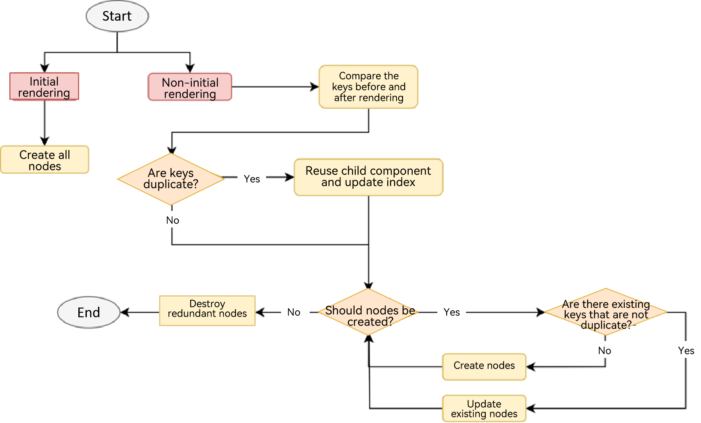

The following figure shows an example of array changes.

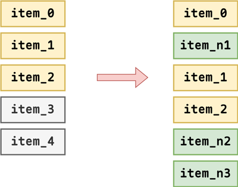

According to the preceding logic, **item_0** does not change, **item_1** and **item_2** only update indexes, **item_n1** and **item_n2** are obtained by updating **item_4** and **item_3**, respectively, and **item_n3** is the created node.

## virtualScroll

### Key Generation Rules

Versions earlier than API version 18:

If **.key()** is not defined, **Repeat** generates a new random key for each child node. If duplicate keys exist, **Repeat** generates a random key as the key of the current child node. Note that each time the page is refreshed, **.key()** is recalculated (that is, duplicate keys are generated again) to further generate a new random key. The format of a random key is **___${index}_+_${key}_+_${Math.random()}**, in which the variables are index, old key, and random number.

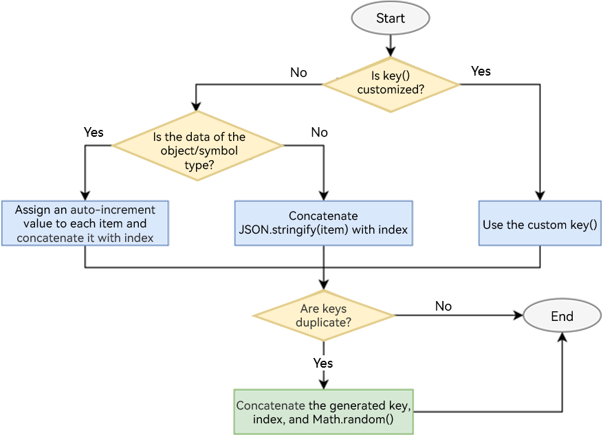

Since API version 18:

If you do not define **.key()**, **Repeat** directly compares the array data changes to determine whether the child nodes are changed. (If yes, the page refresh logic is triggered.) If duplicate keys exist, **Repeat** generates a random key as the key of the current data item. Note that each time the page is refreshed, **.key()** is recalculated (that is, duplicate keys are generated again) to further generate a new random key. The format of a random key is **___${index}_+_${key}_+_${Math.random()}**, in which the variables are index, old key, and random number.

### Child Component Rendering Logic

When **Repeat** is rendered for the first time, the required child components are created based on the valid loading area (including visible area and preload area) of the container component.

When the container slides or the array changes, the invalid child component nodes (which are out of the valid loading area) are added to the idle node cache list (that is, detached from the component tree without destruction). When a new component needs to be generated, reuse the components in the cache (the variable values of the reused child components are updated and attached to the tree again). Since API version 18, **Repeat** supports [custom component freezing in virtualScroll mode](./arkts-custom-components-freezeV2.md#repeat-virtualscroll).

By default, the reuse function is enabled for **Repeat** in virtualScroll mode. You can configure the **reusable** field to determine whether to enable the reuse function since API version 18. To improve rendering performance, you are advised to enable the reuse function. For details about the sample code, see [VirtualScrollOptions](../reference/apis-arkui/arkui-ts/ts-rendering-control-repeat.md#virtualscrolloptions).

The following uses [sliding scenario](#sliding-scenario) and [data update scenario](#data-update-scenario) to show the rendering logic of the child component in virtualScroll mode. Define an array with a length of 20. The template type for the first five items in the array is **aa** and for the others are **bb**. The capacity of the buffer pool **aa** is 3 and that of **bb** is 4. The size of the preload area of the container component is 2. For easy understanding, one and two idle nodes are added to the cache pools **aa** and **bb** respectively.

The following figure shows the node status in the list during initial rendering.

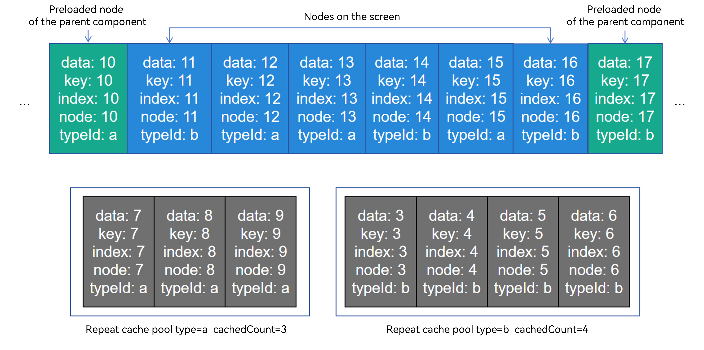

#### Sliding Scenario

Swipe the screen to the right for a distance of one node and **Repeat** starts to reuse the nodes in the cache pool. The node whose index is 10 enters the valid loading area. Its template type is **bb**. Because the cache pool **bb** is not empty, **Repeat** obtains an idle node from this pool for reuse and updates the node attributes. Other grandchild components related to the data item and index in the child component are updated synchronously based on the rules of state management of V2. The rest nodes are still in the valid loading area and only their indexes are updated.

The node whose index is 0 is out of the valid loading area. When the UI main thread is idle, the system checks whether the cache pool **aa** is full. If it is not full, the system adds the node to the corresponding cache pool;

otherwise, **Repeat** destroys redundant nodes.

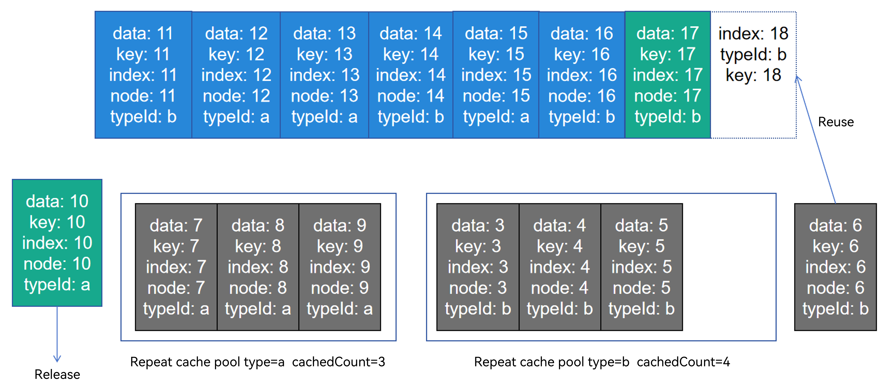

#### Data Update Scenario

Perform the following array update operations based on the previous section. Delete the node whose index is 4 and change **item_7** to **new_7**.

After the node whose index is 4 is deleted, this invalid node is added to the cache pool **aa**. The subsequent nodes move leftwards. The **item_11** node that enters the valid loading area reuses the idle node in the cache pool **bb**. For other nodes, only the index is updated, as shown in the following figure.

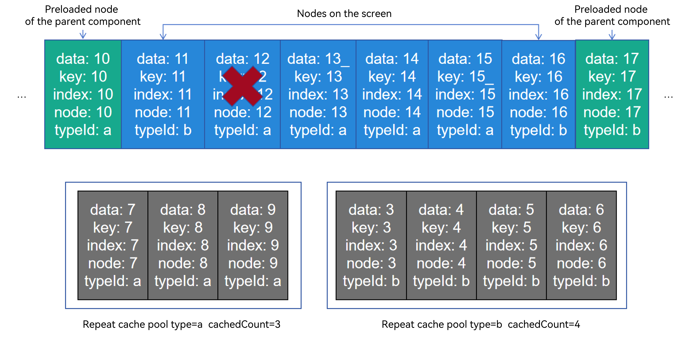

Then, the **item_5** node move leftwards and its index is updated to 4. According to the calculation rule, the **item_5** node changes its template type to **aa**, reuses an idle node from the cache pool **aa**, and adds the old node to the cache pool **bb**, as shown in the following figure.

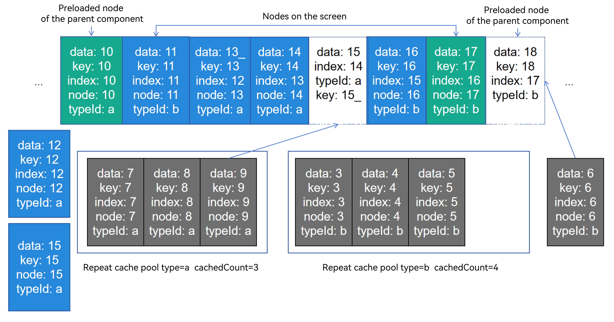

### template: Child Component Rendering Template

Currently, the template can be used only in virtualScroll mode.

- Each node obtains the template type based on **.templateId()** and renders the child component in the corresponding **.template()**.
- If multiple template types are the same, **Repeat** overwrites the previously defined **.template()** and only the last defined **.template()** takes effect.
- If the corresponding template type cannot be found, the child component in **.template()** whose type is empty is rendered first. If the child component does not exist, the child component in **.each()** is rendered.

### cachedCount: Size of the Idle Node Cache List

**cachedCount** indicates the maximum number of child components that can be cached in the cache pool of the corresponding template type. This parameter is valid only in virtualScroll mode.

> **NOTE**
> 
> The **.cachedCount()** attribute of the scrolling container component and the **cachedCount** parameter of the **.template()** attribute of **Repeat** are used to balance performance and memory, but their meanings are different.
> - **.cachedCount()** indicates the nodes that are attached to the component tree and treated as invisible. Container components such as **List** or **Grid** render these nodes to achieve better performance. However, **Repeat** treats these nodes as visible.
> - **cachedCount** in **.template()** indicates the nodes that are treated as invisible by **Repeat**. These nodes are idle and are temporarily stored in the framework. You can update these nodes as required to implement reuse.

When **cachedCount** is set to the maximum number of nodes that may appear on the screen of the current template, **Repeat** can be reused as much as possible. However, when there is no node of the current template on the screen, the cache pool is not released and the application memory increases. You need to set the configuration based on the actual situation.

- If the default value is used, the framework calculates the value of **cachedCount** for each template based on the number of nodes displayed on the screen and the number of preloaded nodes. If the number increases, the value of **cachedCount** increases accordingly. Note that the value of cachedCount does not decrease.
- Explicitly specify **cachedCount**. It is recommended that the value be the same as the number of nodes on the screen. Yet, setting **cachedCount** to less than 2 is not advised. Doing so may lead to the creation of new nodes during rapid scrolling, which could result in performance degradation.

### totalCount: Length of the Data to Be Loaded

**totalCount** indicates the length of the data to be loaded. The default value is the length of the original array. The value can be greater than the number of loaded data items. Define the data source length as **arr.length**. The processing rules of **totalCount** are as follows:

- When **totalCount** is set to the default value or a non-natural number, the value of **totalCount** is **arr.length**, and the list scrolls normally.
- When **totalCount** is greater that or equal to **0** and smaller than **arr.length**, only data within the range of [0, *totalCount* - 1] is rendered.
- When **totalCount** is greater than **arr.length**, data in the range of [0, *totalCount* - 1] will be rendered. The scrollbar style changes based on the value of **totalCount**.

> **NOTE**
>
> If **totalCount** is greater than **arr.length**, the application should request subsequent data when the list scrolls to the end of the data source. You need to fix the data request error (caused by, for example, network delay) until all data sources are loaded. Otherwise, the scrolling effect is abnormal.

### onTotalCount: Calculating the Expected Data Length

onTotalCount?(): number;

It is supported since API version 18 and must be used in virtualScroll mode. You can customize a method to calculate the expected array length. The return value must be a natural number and may not be equal to the actual data source length **arr.length**. The processing rules of **onTotalCount** are as follows:

- When the return value is a non-natural number, **arr.length** is used as the return value and the list scrolls normally.
- When the return value of **onTotalCount** is greater that or equal to **0** and smaller than **arr.length**, only data within the range of [0, *return value* - 1] is rendered.
- When the return value of **onTotalCount** is greater than **arr.length**, the data within the range of [0, *return value* - 1] is rendered. The scrollbar style changes based on the return value of **onTotalCount**.

> **NOTE**
>
> - Compared with using **totalCount**, **Repeat** can proactively call the **onTotalCount** method to update the expected data length when necessary.
> - Either **totalCount** or **onTotalCount** can be set. If neither of them is set, the default **arr.length** is used. If both of them are set, **totalCount** is ignored.
> - When the return value of **onTotalCount** is greater than **arr.length**, you are advised to use **onLazyLoading** to implement lazy loading.

### onLazyLoading: Precise Lazy Loading

onLazyLoading?(index: number): void;

It is supported since API version 18 and must be used in virtualScroll mode. You can customize a method to write data to a specified index in the data source. The processing rules of **onLazyLoading** are as follows:

- Before reading the data corresponding to an index in the data source, **Repeat** checks whether the index contains data.
- If no data exists and a custom method is defined, **Repeat** calls this method.
- In the **onLazyLoading** method, data should be written to the index specified by **Repeat** in the format of **arr[index] = ...**. In addition, array operations except **[]** are not allowed, and elements except the specified index cannot be written. Otherwise, the system throws an exception.
- After the **onLazyLoading** method is executed, if no data exists in the specified index, the rendering is abnormal.

> **NOTE**
>
> - When using **onLazyLoading**, you are advised to use **onTotalCount** together instead of **totalCount**.
> - If the expected data source length is greater than the actual one, **onLazyLoading** is recommended.
> - Avoid using the **onLazyLoading** method to execute time-consuming operations. If data loading takes a long time, you can create a placeholder for the data in the **onLazyLoading** method and then create an asynchronous task to load the data.
> - When **onLazyLoading** is used and **onTotalCount** is set to **arr.length + 1**, data can be loaded infinitely. In this scenario, you need to provide the initial data required for the first screen display and set **cachedCount** that is greater than 0 for the parent container component. Otherwise, the rendering is abnormal. If the **onLazyLoading** method is used together with the loop mode of **Swipe**, the **onLazyLoading** method will be triggered continuously when screen stays at the node whose index is 0 Therefore, you are advised not to use them together. In addition, you need to pay attention to the memory usage to avoid excessive memory consumption caused by continuous data loading.

## Use Scenarios

### Non-virtualScroll

#### Changing the Data Source

```ts
@Entry
@ComponentV2
struct Parent {
  @Local simpleList: Array<string> = ['one', 'two', 'three'];

  build() {
    Row() {
      Column() {
        Text('Click to change the value of the third array item')
          .fontSize(24)
          .fontColor(Color.Red)
          .onClick(() => {
            this.simpleList[2] = 'new three';
          })

        Repeat<string>(this.simpleList)
            .each((obj: RepeatItem<string>)=>{
              ChildItem({ item: obj.item })
                .margin({top: 20})
            })
            .key((item: string) => item)
      }
      .justifyContent(FlexAlign.Center)
      .width('100%')
      .height('100%')
    }
    .height('100%')
    .backgroundColor(0xF1F3F5)
  }
}

@ComponentV2
struct ChildItem {
  @Param @Require item: string;

  build() {
    Text(this.item)
      .fontSize(30)
  }
}
```


The component of the third array item is reused when the array item is re-rendered, and only the data is refreshed.

#### Changing the Index Value

In the following example, when array items 1 and 2 are exchanged, if the key is as the same as the last one, **Repeat** reuses the previous component and updates only the data of the component that uses the **index** value.

```ts
@Entry
@ComponentV2
struct Parent {
  @Local simpleList: Array<string> = ['one', 'two', 'three'];

  build() {
    Row() {
      Column() {
        Text('Exchange array items 1 and 2')
          .fontSize(24)
          .fontColor(Color.Red)
          .onClick(() => {
            let temp: string = this.simpleList[2]
            this.simpleList[2] = this.simpleList[1]
            this.simpleList[1] = temp
          })
          .margin({bottom: 20})

        Repeat<string>(this.simpleList)
          .each((obj: RepeatItem<string>)=>{
            Text("index: " + obj.index)
              .fontSize(30)
            ChildItem({ item: obj.item })
              .margin({bottom: 20})
          })
          .key((item: string) => item)
      }
      .justifyContent(FlexAlign.Center)
      .width('100%')
      .height('100%')
    }
    .height('100%')
    .backgroundColor(0xF1F3F5)
  }
}

@ComponentV2
struct ChildItem {
  @Param @Require item: string;

  build() {
    Text(this.item)
      .fontSize(30)
  }
}
```

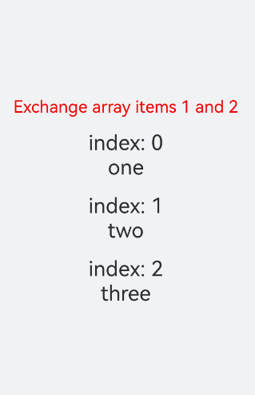

### VirtualScroll

This section describes the actual use scenarios of **Repeat** and the reuse of component nodes in virtualScroll mode. A large number of test scenarios can be derived based on reuse rules. This section only describes typical data changes.

#### One Template

The following sample code shows how to insert, modify, delete, and exchange data in an array in virtualScroll mode. Select an index value from the drop-down list and click the corresponding button to change the data. You can click two data items in sequence to exchange them.

```ts
@ObservedV2
class Repeat005Clazz {
  @Trace message: string = '';

  constructor(message: string) {
    this.message = message;
  }
}

@Entry
@ComponentV2
struct RepeatVirtualScroll {
  @Local simpleList: Array<Repeat005Clazz> = [];
  private exchange: number[] = [];
  private counter: number = 0;
  @Local selectOptions: SelectOption[] = [];
  @Local selectIdx: number = 0;

  @Monitor("simpleList")
  reloadSelectOptions(): void {
    this.selectOptions = [];
    for (let i = 0; i < this.simpleList.length; ++i) {
      this.selectOptions.push({ value: i.toString() });
    }
    if (this.selectIdx >= this.simpleList.length) {
      this.selectIdx = this.simpleList.length - 1;
    }
  }

  aboutToAppear(): void {
    for (let i = 0; i < 100; i++) {
      this.simpleList.push(new Repeat005Clazz(`item_${i}`));
    }
    this.reloadSelectOptions();
  }

  handleExchange(idx: number): void { // Click to exchange child components.
    this.exchange.push(idx);
    if (this.exchange.length === 2) {
      let _a = this.exchange[0];
      let _b = this.exchange[1];
      let temp: Repeat005Clazz = this.simpleList[_a];
      this.simpleList[_a] = this.simpleList[_b];
      this.simpleList[_b] = temp;
      this.exchange = [];
    }
  }

  build() {
    Column({ space: 10 }) {
      Text('virtualScroll each()&template() 1t')
        .fontSize(15)
        .fontColor(Color.Gray)
      Text('Select an index and press the button to update data.')
        .fontSize(15)
        .fontColor(Color.Gray)

      Select(this.selectOptions)
        .selected(this.selectIdx)
        .value(this.selectIdx.toString())
        .key('selectIdx')
        .onSelect((index: number) => {
          this.selectIdx = index;
        })
      Row({ space: 5 }) {
        Button('Add No.' + this.selectIdx)
          .onClick(() => {
            this.simpleList.splice(this.selectIdx, 0, new Repeat005Clazz(`${this.counter++}_add_item`));
            this.reloadSelectOptions();
          })
        Button('Modify No.' + this.selectIdx)
          .onClick(() => {
            this.simpleList.splice(this.selectIdx, 1, new Repeat005Clazz(`${this.counter++}_modify_item`));
          })
        Button('Del No.' + this.selectIdx)
          .onClick(() => {
            this.simpleList.splice(this.selectIdx, 1);
            this.reloadSelectOptions();
          })
      }
      Button('Update array length to 5.')
        .onClick(() => {
          this.simpleList = this.simpleList.slice(0, 5);
          this.reloadSelectOptions();
        })

      Text('Click on two items to exchange.')
        .fontSize(15)
        .fontColor(Color.Gray)

      List({ space: 10 }) {
        Repeat<Repeat005Clazz>(this.simpleList)
          .each((obj: RepeatItem<Repeat005Clazz>) => {
            ListItem() {
              Text(`[each] index${obj.index}: ${obj.item.message}`)
                .fontSize(25)
                .onClick(() => {
                  this.handleExchange(obj.index);
                })
            }
          })
          .key((item: Repeat005Clazz, index: number) => {
            return item.message;
          })
          .virtualScroll({ totalCount: this.simpleList.length })
          .templateId(() => "a")
          .template('a', (ri) => {
            Text(`[a] index${ri.index}: ${ri.item.message}`)
              .fontSize(25)
              .onClick(() => {
                this.handleExchange(ri.index);
              })
          }, { cachedCount: 3 })
      }
      .cachedCount(2)
      .border({ width: 1 })
      .width('95%')
      .height('40%')
    }
    .justifyContent(FlexAlign.Center)
    .width('100%')
    .height('100%')
  }
}
```
The application list contains 100 **message** properties of the custom class **RepeatClazz**. The value of **cachedCount** of the **List** component is set to **2**, and the cache pool size of the template A is set to **3**. The application screen is shown as bellow.


#### Multiple Templates

```ts
@ObservedV2
class Repeat006Clazz {
  @Trace message: string = '';

  constructor(message: string) {
    this.message = message;
  }
}

@Entry
@ComponentV2
struct RepeatVirtualScroll2T {
  @Local simpleList: Array<Repeat006Clazz> = [];
  private exchange: number[] = [];
  private counter: number = 0;
  @Local selectOptions: SelectOption[] = [];
  @Local selectIdx: number = 0;

  @Monitor("simpleList")
  reloadSelectOptions(): void {
    this.selectOptions = [];
    for (let i = 0; i < this.simpleList.length; ++i) {
      this.selectOptions.push({ value: i.toString() });
    }
    if (this.selectIdx >= this.simpleList.length) {
      this.selectIdx = this.simpleList.length - 1;
    }
  }

  aboutToAppear(): void {
    for (let i = 0; i < 100; i++) {
      this.simpleList.push(new Repeat006Clazz(`item_${i}`));
    }
    this.reloadSelectOptions();
  }

  handleExchange(idx: number): void { // Click to exchange child components.
    this.exchange.push(idx);
    if (this.exchange.length === 2) {
      let _a = this.exchange[0];
      let _b = this.exchange[1];
      let temp: Repeat006Clazz = this.simpleList[_a];
      this.simpleList[_a] = this.simpleList[_b];
      this.simpleList[_b] = temp;
      this.exchange = [];
    }
  }

  build() {
    Column({ space: 10 }) {
      Text('virtualScroll each()&template() 2t')
        .fontSize(15)
        .fontColor(Color.Gray)
      Text('Select an index and press the button to update data.')
        .fontSize(15)
        .fontColor(Color.Gray)

      Select(this.selectOptions)
        .selected(this.selectIdx)
        .value(this.selectIdx.toString())
        .key('selectIdx')
        .onSelect((index: number) => {
          this.selectIdx = index;
        })
      Row({ space: 5 }) {
        Button('Add No.' + this.selectIdx)
          .onClick(() => {
            this.simpleList.splice(this.selectIdx, 0, new Repeat006Clazz(`${this.counter++}_add_item`));
            this.reloadSelectOptions();
          })
        Button('Modify No.' + this.selectIdx)
          .onClick(() => {
            this.simpleList.splice(this.selectIdx, 1, new Repeat006Clazz(`${this.counter++}_modify_item`));
          })
        Button('Del No.' + this.selectIdx)
          .onClick(() => {
            this.simpleList.splice(this.selectIdx, 1);
            this.reloadSelectOptions();
          })
      }
      Button('Update array length to 5.')
        .onClick(() => {
          this.simpleList = this.simpleList.slice(0, 5);
          this.reloadSelectOptions();
        })

      Text('Click on two items to exchange.')
        .fontSize(15)
        .fontColor(Color.Gray)

      List({ space: 10 }) {
        Repeat<Repeat006Clazz>(this.simpleList)
          .each((obj: RepeatItem<Repeat006Clazz>) => {
            ListItem() {
              Text(`[each] index${obj.index}: ${obj.item.message}`)
                .fontSize(25)
                .onClick(() => {
                  this.handleExchange(obj.index);
                })
            }
          })
          .key((item: Repeat006Clazz, index: number) => {
            return item.message;
          })
          .virtualScroll({ totalCount: this.simpleList.length })
          .templateId((item: Repeat006Clazz, index: number) => {
            return (index % 2 === 0) ? 'odd' : 'even';
          })
          .template('odd', (ri) => {
            Text(`[odd] index${ri.index}: ${ri.item.message}`)
              .fontSize(25)
              .fontColor(Color.Blue)
              .onClick(() => {
                this.handleExchange(ri.index);
              })
          }, { cachedCount: 3 })
          .template('even', (ri) => {
            Text(`[even] index${ri.index}: ${ri.item.message}`)
              .fontSize(25)
              .fontColor(Color.Green)
              .onClick(() => {
                this.handleExchange(ri.index);
              })
          }, { cachedCount: 1 })
      }
      .cachedCount(2)
      .border({ width: 1 })
      .width('95%')
      .height('40%')
    }
    .justifyContent(FlexAlign.Center)
    .width('100%')
    .height('100%')
  }
}
```


#### Precise Lazy Loading

If the total length of a data source or data item loading duration is long, you can use lazy loading to prevent all data from being loaded during initialization.

**Example 1**

The total length of the data source is long. When the data is rendered for the first time, the screen is scrolled, or the display area is switched, the data in the corresponding area is dynamically loaded.

```ts
@Entry
@ComponentV2
struct RepeatLazyLoading {
  // Assume that the total length of the data source is 1000. The initial array does not provide data.
  @Local arr: Array<string> = [];
  scroller: Scroller = new Scroller();
  build() {
    Column({ space: 5 }) {
      // The initial index displayed on the screen is 100. The data can be automatically obtained through lazy loading.
      List({ scroller: this.scroller, space: 5, initialIndex: 100 }) {
        Repeat(this.arr)
          .virtualScroll({
            // The expected total length of the data source is 1000.
            onTotalCount: () => { return 1000; },
            // Implement lazy loading.
            onLazyLoading: (index: number) => { this.arr[index] = index.toString(); }
          })
          .each((obj: RepeatItem<string>) => {
            ListItem() {
              Row({ space: 5 }) {
                Text(`${obj.index}: Item_${obj.item}`)
              }
            }
            .height(50)
          })
      }
      .height('80%')
      .border({ width: 1})
      // Redirect to the index whose value is 500. The data can be automatically obtained through lazy loading.
      Button('ScrollToIndex 500')
        .onClick(() => { this.scroller.scrollToIndex(500); })
    }
  }
}
```

The figure below shows the effect.


**Example 2**

Data loading takes a long time. In the **onLazyLoading** method, placeholders are created for data items, and then data is loaded through asynchronous tasks.

```ts
@Entry
@ComponentV2
struct RepeatLazyLoading {
  @Local arr: Array<string> = [];
  build() {
    Column({ space: 5 }) {
      List({ space: 5 }) {
        Repeat(this.arr)
          .virtualScroll({
            onTotalCount: () => { return 100; },
            // Implement lazy loading.
            onLazyLoading: (index: number) => {
              // Create a placeholder.
              this.arr[index] = '';
              // Simulate a time-consuming loading process and load data through an asynchronous task.
              setTimeout(() => { this.arr[index] = index.toString(); }, 1000);
            }
          })
          .each((obj: RepeatItem<string>) => {
            ListItem() {
              Row({ space: 5 }) {
                Text(`${obj.index}: Item_${obj.item}`)
              }
            }
            .height(50)
          })
      }
      .height('100%')
      .border({ width: 1})
    }
  }
}
```

The figure below shows the effect.


**Example 3**

Lazy loading is used together with **onTotalCount: () => { return this.arr.length + 1; }** to implement unlimited lazy loading.

> **NOTE**
>
> - In this scenario, you need to provide the initial data required for the first screen display and set **cachedCount** that is greater than 0 for the parent container component. Otherwise, the rendering is abnormal.
> - If the **onLazyLoading** method is used together with the loop mode of **Swipe**, the **onLazyLoading** method will be triggered continuously when screen stays at the node whose index is 0 Therefore, you are advised not to use them together.
> - You need to pay attention to the memory usage to avoid excessive memory consumption caused by continuous data loading.

```ts
@Entry
@ComponentV2
struct RepeatLazyLoading {
  @Local arr: Array<string> = [];
  // Provide the initial data required for the first screen display.
  aboutToAppear(): void {
    for (let i = 0; i < 15; i++) {
      this.arr.push(i.toString());
    }
  }
  build() {
    Column({ space: 5 }) {
      List({ space: 5 }) {
        Repeat(this.arr)
          .virtualScroll({
            // Unlimited lazy loading.
            onTotalCount: () => { return this.arr.length + 1; },
            onLazyLoading: (index: number) => { this.arr[index] = index.toString(); }
          })
          .each((obj: RepeatItem<string>) => {
            ListItem() {
              Row({ space: 5 }) {
                Text(`${obj.index}: Item_${obj.item}`)
              }
            }
            .height(50)
          })
      }
      .height('100%')
      .border({ width: 1})
      // You are advised to set cachedCount to a value greater than 0.
      .cachedCount(1)
    }
  }
}
```

The figure below shows the effect.


### Using Repeat in a Nesting Manner

**Repeat** can be nested in other components. The following showcases the sample code for nesting **Repeat** in virtualScroll mode:

```ts
// Repeat can be nested in other components.
@Entry
@ComponentV2
struct RepeatNest {
  @Local outerList: string[] = [];
  @Local innerList: number[] = [];

  aboutToAppear(): void {
    for (let i = 0; i < 20; i++) {
      this.outerList.push(i.toString());
      this.innerList.push(i);
    }
  }

  build() {
    Column({ space: 20 }) {
      Text('Using Repeat virtualScroll in a Nesting Manner')
        .fontSize(15)
        .fontColor(Color.Gray)
      List() {
        Repeat<string>(this.outerList)
          .each((obj) => {
            ListItem() {
              Column() {
                Text('outerList item: ' + obj.item)
                  .fontSize(30)
                List() {
                  Repeat<number>(this.innerList)
                    .each((subObj) => {
                      ListItem() {
                        Text('innerList item: ' + subObj.item)
                          .fontSize(20)
                      }
                    })
                    .key((item) => "innerList_" + item)
                    .virtualScroll()
                }
                .width('80%')
                .border({ width: 1 })
                .backgroundColor(Color.Orange)
              }
              .height('30%')
              .backgroundColor(Color.Pink)
            }
            .border({ width: 1 })
          })
          .key((item) => "outerList_" + item)
          .virtualScroll()
      }
      .width('80%')
      .border({ width: 1 })
    }
    .justifyContent(FlexAlign.Center)
    .width('90%')
    .height('80%')
  }
}
```

The figure below shows the effect.


### Use Scenarios of the Parent Container Component

This section describes the common use scenarios of virtualScroll mode and container components.

#### Using Together with List

Use virtualScroll mode of **Repeat** in the **List** container component. The following is an example:

```ts
class DemoListItemInfo {
  name: string;
  icon: Resource;

  constructor(name: string, icon: Resource) {
    this.name = name;
    this.icon = icon;
  }
}

@Entry
@ComponentV2
struct DemoList {
  @Local videoList: Array<DemoListItemInfo> = [];

  aboutToAppear(): void {
    for (let i = 0; i < 10; i++) {
      // app.media.listItem0, app.media.listItem1, and app.media.listItem2 are only examples. Replace them with the actual ones in use.
      this.videoList.push(new DemoListItemInfo('Video' + i,
        i % 3 == 0 ? $r("app.media.listItem0") :
        i % 3 == 1 ? $r("app.media.listItem1") : $r("app.media.listItem2")));
    }
  }

  @Builder
  itemEnd(index: number) {
    Button('Delete')
      .backgroundColor(Color.Red)
      .onClick(() => {
        this.videoList.splice(index, 1);
      })
  }

  build() {
    Column({ space: 10 }) {
      Text('List Contains the Repeat Component')
        .fontSize(15)
        .fontColor(Color.Gray)

      List({ space: 5 }) {
        Repeat<DemoListItemInfo>(this.videoList)
          .each((obj: RepeatItem<DemoListItemInfo>) => {
            ListItem() {
              Column() {
                Image(obj.item.icon)
                  .width('80%')
                  .margin(10)
                Text(obj.item.name)
                  .fontSize(20)
              }
            }
            .swipeAction({
              end: {
                builder: () => {
                  this.itemEnd(obj.index);
                }
              }
            })
            .onAppear(() => {
              console.info('AceTag', obj.item.name);
            })
          })
          .key((item: DemoListItemInfo) => item.name)
          .virtualScroll()
      }
      .cachedCount(2)
      .height('90%')
      .border({ width: 1 })
      .listDirection(Axis.Vertical)
      .alignListItem(ListItemAlign.Center)
      .divider({
        strokeWidth: 1,
        startMargin: 60,
        endMargin: 60,
        color: '#ffe9f0f0'
      })

      Row({ space: 10 }) {
        Button('Delete No.1')
          .onClick(() => {
            this.videoList.splice(0, 1);
          })
        Button('Delete No.5')
          .onClick(() => {
            this.videoList.splice(4, 1);
          })
      }
    }
    .width('100%')
    .height('100%')
    .justifyContent(FlexAlign.Center)
  }
}
```

Swipe left and touch the **Delete** button, or touch the button at the bottom to delete the video widget.

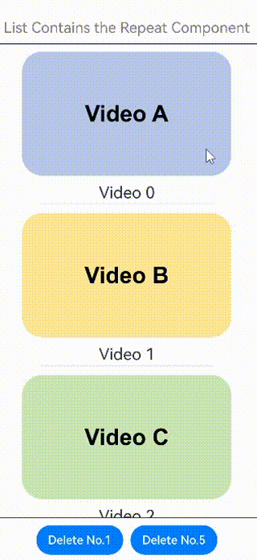

#### Using Together with Grid

Use **virtualScroll** of **Repeat** in the **Grid** container component. The following is an example:

```ts
class DemoGridItemInfo {
  name: string;
  icon: Resource;

  constructor(name: string, icon: Resource) {
    this.name = name;
    this.icon = icon;
  }
}

@Entry
@ComponentV2
struct DemoGrid {
  @Local itemList: Array<DemoGridItemInfo> = [];
  @Local isRefreshing: boolean = false;
  private layoutOptions: GridLayoutOptions = {
    regularSize: [1, 1],
    irregularIndexes: [10]
  }
  private GridScroller: Scroller = new Scroller();
  private num: number = 0;

  aboutToAppear(): void {
    for (let i = 0; i < 10; i++) {
      // app.media.gridItem0, app.media.gridItem1, and app.media.gridItem2 are only examples. Replace them with the actual ones in use.
      this.itemList.push(new DemoGridItemInfo('Video' + i,
        i % 3 == 0 ? $r("app.media.gridItem0") :
        i % 3 == 1 ? $r("app.media.gridItem1") : $r("app.media.gridItem2")));
    }
  }

  build() {
    Column({ space: 10 }) {
      Text('Grid Contains the Repeat Component')
        .fontSize(15)
        .fontColor(Color.Gray)

      Refresh({ refreshing: $$this.isRefreshing }) {
        Grid(this.GridScroller, this.layoutOptions) {
          Repeat<DemoGridItemInfo>(this.itemList)
            .each((obj: RepeatItem<DemoGridItemInfo>) => {
              if (obj.index === 10 ) {
                GridItem() {
                  Text('Last viewed here. Touch to refresh.')
                    .fontSize(20)
                }
                .height(30)
                .border({ width: 1 })
                .onClick(() => {
                  this.GridScroller.scrollToIndex(0);
                  this.isRefreshing = true;
                })
                .onAppear(() => {
                  console.info('AceTag', obj.item.name);
                })
              } else {
                GridItem() {
                  Column() {
                    Image(obj.item.icon)
                      .width('100%')
                      .height(80)
                      .objectFit(ImageFit.Cover)
                      .borderRadius({ topLeft: 16, topRight: 16 })
                    Text(obj.item.name)
                      .fontSize(15)
                      .height(20)
                  }
                }
                .height(100)
                .borderRadius(16)
                .backgroundColor(Color.White)
                .onAppear(() => {
                  console.info('AceTag', obj.item.name);
                })
              }
            })
            .key((item: DemoGridItemInfo) => item.name)
            .virtualScroll()
        }
        .columnsTemplate('repeat(auto-fit, 150)')
        .cachedCount(4)
        .rowsGap(15)
        .columnsGap(10)
        .height('100%')
        .padding(10)
        .backgroundColor('#F1F3F5')
      }
      .onRefreshing(() => {
        setTimeout(() => {
          this.itemList.splice(10, 1);
          this.itemList.unshift(new DemoGridItemInfo('refresh', $r('app.media.gridItem0'))); // app.media.gridItem0 is only an example. Replace it with the actual one.
          for (let i = 0; i < 10; i++) {
            // app.media.gridItem0, app.media.gridItem1, and app.media.gridItem2 are only examples. Replace them with the actual ones.
            this.itemList.unshift(new DemoGridItemInfo('New video' + this.num,
              i % 3 == 0 ? $r("app.media.gridItem0") :
              i % 3 == 1 ? $r("app.media.gridItem1") : $r("app.media.gridItem2")));
            this.num++;
          }
          this.isRefreshing = false;
        }, 1000);
        console.info('AceTag', 'onRefreshing');
      })
      .refreshOffset(64)
      .pullToRefresh(true)
      .width('100%')
      .height('85%')

      Button('Refresh')
        .onClick(() => {
          this.GridScroller.scrollToIndex(0);
          this.isRefreshing = true;
        })
    }
    .width('100%')
    .height('100%')
    .justifyContent(FlexAlign.Center)
  }
}
```

Swipe down on the screen, touch the **Refresh** button, or touch **Last viewed here. Touch to refresh.** to load new videos.

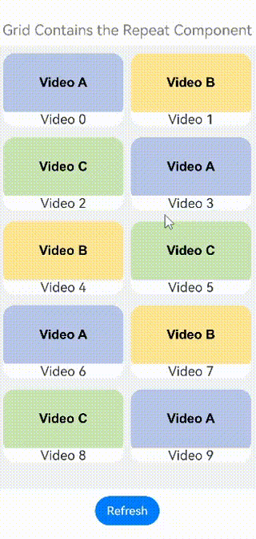

#### Using Together with Swiper

Use **virtualScroll** of **Repeat** in the **Swiper** container component. The following is an example:

```ts
const remotePictures: Array<string> = [
  'https://www.example.com/xxx/0001.jpg', // Set the specific network image address.
  'https://www.example.com/xxx/0002.jpg',
  'https://www.example.com/xxx/0003.jpg',
  'https://www.example.com/xxx/0004.jpg',
  'https://www.example.com/xxx/0005.jpg',
  'https://www.example.com/xxx/0006.jpg',
  'https://www.example.com/xxx/0007.jpg',
  'https://www.example.com/xxx/0008.jpg',
  'https://www.example.com/xxx/0009.jpg'
];

@ObservedV2
class DemoSwiperItemInfo {
  id: string;
  @Trace url: string = 'default';

  constructor(id: string) {
    this.id = id;
  }
}

@Entry
@ComponentV2
struct DemoSwiper {
  @Local pics: Array<DemoSwiperItemInfo> = [];

  aboutToAppear(): void {
    for (let i = 0; i < 9; i++) {
      this.pics.push(new DemoSwiperItemInfo('pic' + i));
    }
    setTimeout(() => {
      this.pics[0].url = remotePictures[0];
    }, 1000);
  }

  build() {
    Column() {
      Text('Swiper Contains the Repeat Component')
        .fontSize(15)
        .fontColor(Color.Gray)

      Stack() {
        Text('Loading...')
          .fontSize(15)
          .fontColor(Color.Gray)
        Swiper() {
          Repeat(this.pics)
            .each((obj: RepeatItem<DemoSwiperItemInfo>) => {
              Image(obj.item.url)
                .onAppear(() => {
                  console.info('AceTag', obj.item.id);
                })
            })
            .key((item: DemoSwiperItemInfo) => item.id)
            .virtualScroll()
        }
        .cachedCount(9)
        .height('50%')
        .loop(false)
        .indicator(true)
        .onChange((index) => {
          setTimeout(() => {
            this.pics[index].url = remotePictures[index];
          }, 1000);
        })
      }
      .width('100%')
      .height('100%')
      .backgroundColor(Color.Black)
    }
  }
}
```

Load the image 1s later to simulate the network latency.

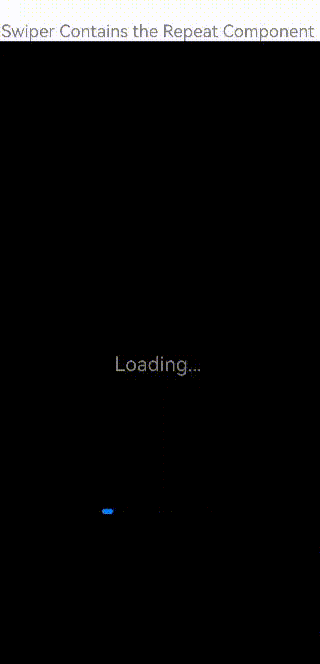

### Enabling Drag and Sort

If **Repeat** is used in a list, and the **onMove** event is set, you can enable drag and sort for the list items. Both the non-virtualScroll and virtualScroll modes support drag and sort.

#### Constraints
- If an item changes the position after you drag and sort the data, the **onMove** event is triggered to report the original index and target index of the item. The data source needs to be modified in the **onMove** event based on the reported start index and target index. Before and after the data source is modified, the value of each item must remain unchanged to ensure that the drop animation can be executed properly.
- During the drag and sort, the data source cannot be modified.

#### Sample Code
```ts
@Entry
@ComponentV2
struct RepeatVirtualScrollOnMove {
  @Local simpleList: Array<string> = [];

  aboutToAppear(): void {
    for (let i = 0; i < 100; i++) {
      this.simpleList.push(`${i}`);
    }
  }

  build() {
    Column() {
      List() {
        Repeat<string>(this.simpleList)
          // Set onMove to enable the drag and sort.
          .onMove((from: number, to: number) => {
            let temp = this.simpleList.splice(from, 1);
            this.simpleList.splice(to, 0, temp[0]);
          })
          .each((obj: RepeatItem<string>) => {
            ListItem() {
              Text(obj.item)
                .fontSize(16)
                .textAlign(TextAlign.Center)
                .size({height: 100, width: "100%"})
            }.margin(10)
            .borderRadius(10)
            .backgroundColor("#FFFFFFFF")
          })
          .key((item: string, index: number) => {
            return item;
          })
          .virtualScroll({ totalCount: this.simpleList.length })
      }
      .border({ width: 1 })
      .backgroundColor("#FFDCDCDC")
      .width('100%')
      .height('100%')
    }
  }
}
```

The figure below shows the effect.


### Using .key() to Control the Node Refresh Range

Since API version 18, when you customize **.key()**, the child nodes of **Repeat** determine whether to update themselves based on the key. After the array is modified: (1) If the key is changed, the page is refreshed immediately and the data is updated to the new value. (2) If the key is not changed, the page is not refreshed.

Prerequisites: The array is rendered in virtualScroll mode. The data item **RepeatData** is a class decorated by @ObservedV2. Two properties of this class, **id** and **msg**, are decorated by @Trace. The value of **msg** is used as the content of the node rendered in the list. Click the **click** button to modify the content of the first node in the list.

Scenario 1: When the property value of the list node data changes, the page is refreshed, and the data of the first list node is updated to the modified value.

This scenario can be implemented in either of the following ways: (1) Define **.key()** and change the key value of the corresponding node. (2) If **.key()** is not defined, **Repeat** directly checks whether the data object is changed. The sample code is as follows:

```ts
@ObservedV2
class RepeatData {
  @Trace id: string;
  @Trace msg: string;

  constructor(id: string, msg: string) {
    this.id = id;
    this.msg = msg;
  }
}

@Entry
@ComponentV2
struct RepeatRerender {
  @Local dataArr: Array<RepeatData> = [];

  aboutToAppear(): void {
    for (let i = 0; i < 10; i++) {
      this.dataArr.push(new RepeatData(`key${i}`, `data${i}`));
    }
  }

  build() {
    Column({ space: 20 }) {
      List() {
        Repeat<RepeatData>(this.dataArr)
          .each((ri: RepeatItem<RepeatData>) => {
            ListItem() {
              Text(ri.item.msg).fontSize(30)
            }
          })
          .key((item: RepeatData, index: number) => item.msg) // Method 1: Set the return value of .key() to be consistent with the value of changed node data, for example, the value of msg.
          // Method 2: Delete .key().
          .virtualScroll()
      }
      .cachedCount(2)
      .width('100%')
      .height('40%')
      .border({ width: 1 })
      .backgroundColor(0xFAEEE0)

      Button('click').onClick(() => {
        this.dataArr.splice(0, 1, new RepeatData('key0', 'new msg')); // Change the value of msg of the first node.
      })
    }
  }
}
```

After you click the button, the data changes as follows.

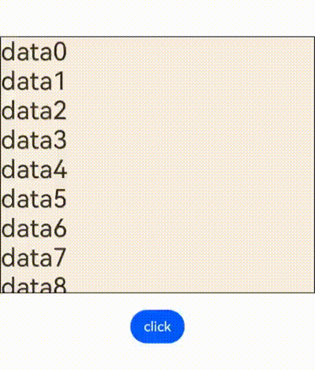

Scenario 2: When the property value of the list node data changes but the key remains unchanged, page refresh is not triggered immediately, so that a node refresh frequency is controlled and overall rendering performance of the page is improved.

Implementation: Define **.key()**. The return value is the **id** property of the node data object. After you click the button, the value of **id** (key) remains unchanged. After you change the value of **msg**, the page is not refreshed. The sample code is as follows:

Note that if you directly modify the **msg** property (**this.dataArr[0].msg ='new msg'**), the page is still refreshed. This is because the value of **msg** is decorated by @Trace. If the value is directly modified, the change logic of state variable is triggered and the page is refreshed immediately.

```ts
@ObservedV2
class RepeatData {
  @Trace id: string;
  @Trace msg: string;

  constructor(id: string, msg: string) {
    this.id = id;
    this.msg = msg;
  }
}

@Entry
@ComponentV2
struct RepeatRerender {
  @Local dataArr: Array<RepeatData> = [];

  aboutToAppear(): void {
    for (let i = 0; i < 10; i++) {
      this.dataArr.push(new RepeatData(`key${i}`, `data${i}`));
    }
  }

  build() {
    Column({ space: 20 }) {
      List() {
        Repeat<RepeatData>(this.dataArr)
          .each((ri: RepeatItem<RepeatData>) => {
            ListItem() {
              Text(ri.item.msg).fontSize(30)
            }
          })
          .key((item: RepeatData, index: number) => item.id) // Set the return value of .key() to a value that is not affected by the change of child node, for example, the value of id.
          .virtualScroll()
      }
      .cachedCount(2)
      .width('100%')
      .height('40%')
      .border({ width: 1 })
      .backgroundColor(0xFAEEE0)

      Button('click').onClick(() => {
        this.dataArr.splice(0, 1, new RepeatData('key0', 'new msg')); // Change the value of msg of the first node data and retain the value of id.
      })
    }
  }
}
```

After you click the button, the data does not change.


## FAQs

### Ensure that the Position of the Scrollbar Remains Unchanged When the List Data Outside the Screen Changes

Declare the **Repeat** component in the **List** component to implement the **key** generation logic and **each** logic (as shown in the following sample code). Click **insert** to insert an element before the first element displayed on the screen, enabling the screen to scroll down.

```ts
// Define a class and mark it as observable.
// Customize an array in the class and mark it as traceable.
@ObservedV2
class ArrayHolder {
  @Trace arr: Array<number> = [];

  // constructor, used to initialize arrays.
  constructor(count: number) {
    for (let i = 0; i < count; i++) {
      this.arr.push(i);
    }
  }
}

@Entry
@ComponentV2
struct RepeatTemplateSingle {
  @Local arrayHolder: ArrayHolder = new ArrayHolder(100);
  @Local totalCount: number = this.arrayHolder.arr.length;
  scroller: Scroller = new Scroller();

  build() {
    Column({ space: 5 }) {
      List({ space: 20, initialIndex: 19, scroller: this.scroller }) {
        Repeat(this.arrayHolder.arr)
          .virtualScroll({ totalCount: this.totalCount })
          .templateId((item, index) => {
            return 'number';
          })
          .template('number', (r) => {
            ListItem() {
              Text(r.index! + ":" + r.item + "Reuse");
            }
          })
          .each((r) => {
            ListItem() {
              Text(r.index! + ":" + r.item + "eachMessage");
            }
          })
      }
      .height('30%')

      Button(`insert totalCount ${this.totalCount}`)
        .height(60)
        .onClick(() => {
          // Insert an element which locates in the previous position displayed on the screen.
          this.arrayHolder.arr.splice(18, 0, this.totalCount);
          this.totalCount = this.arrayHolder.arr.length;
        })
    }
    .width('100%')
    .margin({ top: 5 })
  }
}
```

The figure below shows the effect.

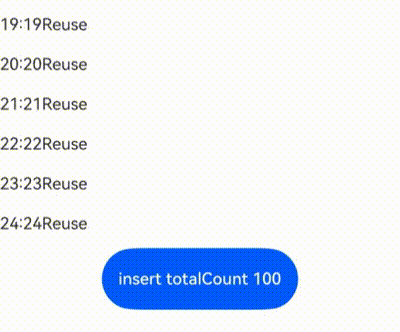

In some scenarios, if you do not want the data source change outside the screen to affect the position where the **Scroller** of the **List** stays on the screen, you can use the [onScrollIndex](https://gitee.com/openharmony/docs/blob/master/en/application-dev/ui/arkts-layout-development-create-list.md#responding-to-the-scrolling-position) of the **List** component to listen for the scrolling action. When the list scrolls, you can obtain the scrolling position of a list. Use the [scrollToIndex](https://gitee.com/openharmony/docs/blob/master/en/application-dev/reference/apis-arkui/arkui-ts/ts-container-scroll.md#scrolltoindex) feature of the **Scroller** component to slide to the specified **index** position. In this way, when data is added to or deleted from the data source outside the screen, the position where the **Scroller** stays remains unchanged.

The following code shows the case of adding data to the data source.

```ts
// The definition of ArrayHolder is the same as that in the demo code.

@Entry
@ComponentV2
struct RepeatTemplateSingle {
  @Local arrayHolder: ArrayHolder = new ArrayHolder(100);
  @Local totalCount: number = this.arrayHolder.arr.length;
  scroller: Scroller = new Scroller();

  private start: number = 1;
  private end: number = 1;

  build() {
    Column({ space: 5 }) {
      List({ space: 20, initialIndex: 19, scroller: this.scroller }) {
        Repeat(this.arrayHolder.arr)
          .virtualScroll({ totalCount: this.totalCount })
          .templateId((item, index) => {
            return 'number';
          })
          .template('number', (r) => {
            ListItem() {
              Text(r.index! + ":" + r.item + "Reuse");
            }
          })
          .each((r) => {
            ListItem() {
              Text(r.index! + ":" + r.item + "eachMessage");
            }
          })
      }
      .onScrollIndex((start, end) => {
        this.start = start;
        this.end = end;
      })
      .height('30%')

      Button(`insert totalCount ${this.totalCount}`)
        .height(60)
        .onClick(() => {
          // Insert an element which locates in the previous position displayed on the screen.
          this.arrayHolder.arr.splice(18, 0, this.totalCount);
          let rect = this.scroller.getItemRect(this.start); // Obtain the size and position of the child component.
          this.scroller.scrollToIndex(this.start + 1); // Slide to the specified index.
          this.scroller.scrollBy(0, -rect.y); // Slide by a specified distance.
          this.totalCount = this.arrayHolder.arr.length;
        })
    }
    .width('100%')
    .margin({ top: 5 })
  }
}
```

The figure below shows the effect.


### The totalCount Value Is Greater Than the Length of Data Source

When the total length of the data source is large, the lazy loading is used to load some data first. To enable **Repeat** to display the correct scrollbar style, you need to change the value of **totalCount** to the total length of data. That is, before all data sources are loaded, the value of **totalCount** is greater than that of **array.length**.

If **totalCount** is greater than **array.length**, the application should request subsequent data when the list scrolls to the end of the data source. You need to fix the data request error (caused by, for example, network delay) until all data sources are loaded. Otherwise, the scrolling effect is abnormal.

You can use the callback of [onScrollIndex](https://gitee.com/openharmony/docs/blob/master/en/application-dev/ui/arkts-layout-development-create-list.md#controlling-the-scrolling-position) attribute of the **List** or **Grid** parent component to implement the preceding specification. The sample code is as follows:

```ts
@ObservedV2
class VehicleData {
  @Trace name: string;
  @Trace price: number;

  constructor(name: string, price: number) {
    this.name = name;
    this.price = price;
  }
}

@ObservedV2
class VehicleDB {
  public vehicleItems: VehicleData[] = [];

  constructor() {
    // The initial size of the array is 20.
    for (let i = 1; i <= 20; i++) {
      this.vehicleItems.push(new VehicleData(`Vehicle${i}`, i));
    }
  }
}

@Entry
@ComponentV2
struct entryCompSucc {
  @Local vehicleItems: VehicleData[] = new VehicleDB().vehicleItems;
  @Local listChildrenSize: ChildrenMainSize = new ChildrenMainSize(60);
  @Local totalCount: number = this.vehicleItems.length;
  scroller: Scroller = new Scroller();

  build() {
    Column({ space: 3 }) {
      List({ scroller: this.scroller }) {
        Repeat(this.vehicleItems)
          .virtualScroll({ totalCount: 50 }) // The expected array length is 50.
          .templateId(() => 'default')
          .template('default', (ri) => {
            ListItem() {
              Column() {
                Text(`${ri.item.name} + ${ri.index}`)
                  .width('90%')
                  .height(this.listChildrenSize.childDefaultSize)
                  .backgroundColor(0xFFA07A)
                  .textAlign(TextAlign.Center)
                  .fontSize(20)
                  .fontWeight(FontWeight.Bold)
              }
            }.border({ width: 1 })
          }, { cachedCount: 5 })
          .each((ri) => {
            ListItem() {
              Text("Wrong: " + `${ri.item.name} + ${ri.index}`)
                .width('90%')
                .height(this.listChildrenSize.childDefaultSize)
                .backgroundColor(0xFFA07A)
                .textAlign(TextAlign.Center)
                .fontSize(20)
                .fontWeight(FontWeight.Bold)
            }.border({ width: 1 })
          })
          .key((item, index) => `${index}:${item}`)
      }
      .height('50%')
      .margin({ top: 20 })
      .childrenMainSize(this.listChildrenSize)
      .alignListItem(ListItemAlign.Center)
      .onScrollIndex((start, end) => {
        console.log('onScrollIndex', start, end);
        // Lazy loading
        if (this.vehicleItems.length < 50) {
          for (let i = 0; i < 10; i++) {
            if (this.vehicleItems.length < 50) {
              this.vehicleItems.push(new VehicleData("Vehicle_loaded", i));
            }
          }
        }
      })
    }
  }
}
```

The figure below shows the effect.


### Constraints on the Mixed Use of Repeat and @Builder

When **Repeat** and @Builder are used together, the **RepeatItem** type must be passed so that the component can listen for data changes. If only **RepeatItem.item** or **RepeatItem.index** is passed, UI rendering exceptions occur.

The sample code is as follows:

```ts
@Entry
@ComponentV2
struct RepeatBuilderPage {
  @Local simpleList1: Array<number> = [];
  @Local simpleList2: Array<number> = [];

  aboutToAppear(): void {
    for (let i = 0; i < 100; i++) {
      this.simpleList1.push(i)
      this.simpleList2.push(i)
    }
  }

  build() {
    Column({ space: 20 }) {
      Text('Use Repeat and @Builder together: The abnormal display is on the left, and the normal display is on the right.')
        .fontSize(15)
        .fontColor(Color.Gray)

      Row({ space: 20 }) {
        List({ initialIndex: 5, space: 20 }) {
          Repeat<number>(this.simpleList1)
            .each((ri) => {})
            .virtualScroll({ totalCount: this.simpleList1.length })
            .templateId((item: number, index: number) => "default")
            .template('default', (ri) => {
              ListItem() {
                Column() {
                  Text('Text id = ' + ri.item)
                    .fontSize(20)
                  this.buildItem1 (ri.item) // Change to this.buildItem1(ri).
                }
              }
              .border({ width: 1 })
            }, { cachedCount: 3 })
        }
        .cachedCount(1)
        .border({ width: 1 })
        .width('45%')
        .height('60%')

        List({ initialIndex: 5, space: 20 }) {
          Repeat<number>(this.simpleList2)
            .each((ri) => {})
            .virtualScroll({ totalCount: this.simpleList2.length })
            .templateId((item: number, index: number) => "default")
            .template('default', (ri) => {
              ListItem() {
                Column() {
                  Text('Text id = ' + ri.item)
                    .fontSize(20)
                  this.buildItem2(ri)
                }
              }
              .border({ width: 1 })
            }, { cachedCount: 3 })
        }
        .cachedCount(1)
        .border({ width: 1 })
        .width('45%')
        .height('60%')
      }
    }
    .height('100%')
    .justifyContent(FlexAlign.Center)
  }

  @Builder
  // The @Builder parameter must be of the RepeatItem type for normal rendering.
  buildItem1(item: number) {
    Text('Builder1 id = ' + item)
      .fontSize(20)
      .fontColor(Color.Red)
      .margin({ top: 2 })
  }

  @Builder
  buildItem2(ri: RepeatItem<number>) {
    Text('Builder2 id = ' + ri.item)
      .fontSize(20)
      .fontColor(Color.Red)
      .margin({ top: 2 })
  }
}
```

The following figure shows the display effect. Swipe down the list and you can see the difference. The incorrect usage is on the left, and the correct usage is on the right. (The **Text** component is in black and the **Builder** component is in red). The preceding code shows the error-prone scenario during development. That is, only the value, instead the entire **RepeatItem** class, is passed in the @Builder function.


