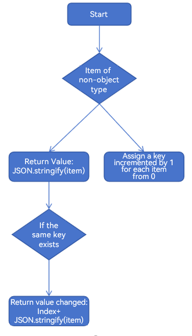

# Repeat: Reusing Child Components

Repeat is supported since API version 12. State management V2 is still under development, and some features may be incomplete or not always work as expected.

**Repeat** enables rendering of repeated content based on array type data. It must be used in a container component, and the component it returns must be one allowed inside the container component. For example, for rendering of list items, **Repeat** must be used in the [ListItem](../reference/apis-arkui/arkui-ts/ts-container-list.md) component.

Compared with ForEach, **Repeat** optimizes the rendering performance in some update scenarios and generates function with the index maintained by the framework.

## API Description

### Repeat Construction

```ts
declare const Repeat: <T>(arr: Array<T>) => RepeatAttribute<T>
```
Parameters

| Name       | Type                               | Mandatory | Description                                                    |
| ------------- | --------------------------------------- | -------- | ------------------------------------------------------------ |
| arr           | Array\<T\>                                 | Yes      | Data source, which is an array of the **Array\<T>** type. You can determine the data types. |
### Repeat Attributes

```ts
declare class RepeatAttribute<T> {
  each(itemGenerator: (repeatItem: RepeatItem<T>) => void): RepeatAttribute<T>;
  key(keyGenerator: (item: T, index: number) => string): RepeatAttribute<T>;
}
```
Parameters

| Name       | Type                               | Mandatory | Description                                                    |
| ------------- | --------------------------------------- | -------- | ------------------------------------------------------------ |
| each       | itemGenerator: (repeatItem: RepeatItem\<T\>) => void | Yes      | Component generator.<br>**Note:**<br>- The **each** attribute is mandatory. Otherwise, an error occurs during running.<br>- The parameter of **itemGenerator** is **RepeatItem**, which combines **item** and **index**. |
| key | keyGenerator: (item: T, index: number) => string | Yes      | Key generator.<br>- It generates a key for each data item in an array.<br>- **item**: data item in the **arr** array.<br>- **index**: index of a data item in the **arr** array. |
### RepeatItem

```ts
interface RepeatItem<T> {
  item: T,
  index?: number
}
```

Parameters

| Name       | Type                               | Mandatory | Description                                                    |
| ------------- | --------------------------------------- | -------- | ------------------------------------------------------------ |
| item          | T                                  | Yes      | Each data item in **arr**. **T** indicates the data type passed in. |
| index | number | No     | Index corresponding to the current data item. |

## Key Generation Rules

During **Repeat** rendering, the system generates a unique and persistent key for each array item to identify the corresponding component. When the key changes, the **ArkUI** framework considers that the array element has been replaced or changed and updates the array element based on the key. If the key of a data item in the current array is the same as that of another data item, the **Repeat** adds **index** to each data item as a new key.

The **Repeat** provides the **key** attribute. The parameter is a function, through which you can customize the rules for generating keys. If you do not call the **key** attribute, the **ArkUI** framework uses the default key to generate functions.

The **ArkUI** framework has a set of specific judgment rules for generating keys of the **Repeat**. The following figure shows the judgment logic of the key generation rules.

**Figure 1** Default key generation rule of Repeat 


## Component Creation Rules

After the key generation rule is determined, **Repeat** creates a component for each data item of the data source based on the rule. There are two cases for creating a component: [Initial Rendering](#initial-rendering) and [Non-initial Rendering](#non-initial-rendering).

### Initial Rendering

When used for initial rendering, **Repeat** generates a unique key for each array item of the data source based on the key generation rules, and creates a component.

```ts
@Entry
@Component
struct Parent {
  @State simpleList: Array<string> = ['one', 'two', 'three'];

  build() {
    Row() {
      Column() {
        Repeat<string>(this.simpleList)
          .each((obj: RepeatItem<string>)=>{
            ChildItem({ item: obj.item })
          })
          .key((item: string) => item)
      }
      .width('100%')
      .height('100%')
    }
    .height('100%')
    .backgroundColor(0xF1F3F5)
  }
}

@Component
struct ChildItem {
  @Prop item: string;

  build() {
    Text(this.item)
      .fontSize(50)
  }
}
```

The figure below shows the effect.

**Figure 2** First rendering with Repeat 


### Non-Initial Rendering

#### Changing the Data Source

When **Repeat** component implements the non-initial rendering, it compares all keys in the last update with those in the latest update. If the current key is the same as the last one, **Repeat** reuses the child component and updates the **RepeatItem.index** index.

After **Repeat** compares all duplicate keys and reuses them, if the last key is unique and a new key is generated after this update, a child component needs to be created. In this case, **Repeat** will reuse redundant child components and update the **RepeatItem.item** data source and **RepeatItem.index** index.

If the number of remaining child components is greater than or equal to the number of newly updated components, the components are fully reused. If the number of remaining child components is less than the number of newly updated components, **Repeat** will create components corresponding to the extra data items after the remaining components are all reused.

```ts
@Entry
@Component
struct Parent {
  @State simpleList: Array<string> = ['one', 'two', 'three'];

  build() {
    Row() {
      Column() {
        Text('Click to change the value of the third array item')
          .fontSize(24)
          .fontColor(Color.Red)
          .onClick(() => {
            this.simpleList[2] = 'new three';
          })

        Repeat<string>(this.simpleList)
            .each((obj: RepeatItem<string>)=>{
              ChildItem({ item: obj.item })
                .margin({top: 20})
            })
            .key((item: string) => item)
      }
      .justifyContent(FlexAlign.Center)
      .width('100%')
      .height('100%')
    }
    .height('100%')
    .backgroundColor(0xF1F3F5)
  }
}

@Component
struct ChildItem {
  @Prop item: string;

  build() {
    Text(this.item)
      .fontSize(30)
  }
}
```

The figure below shows the effect.

**Figure 3** Re-rendering with Repeat 


The component of the third array item is reused when the array item is re-rendered, and only the data is refreshed.

#### Changing the Index Value

In the following example, when array items 1 and 2 are exchanged, if the key is as the same as the last one, **Repeat** reuses the previous component and updates only the data of the component that uses the **index** value.

```ts
@Entry
@Component
struct Parent {
  @State simpleList: Array<string> = ['one', 'two', 'three'];

  build() {
    Row() {
      Column() {
        Text ('Exchange array items 1 and 2')
          .fontSize(24)
          .fontColor(Color.Red)
          .onClick(() => {
            let temp: string = this.simpleList[2]
            this.simpleList[2] = this.simpleList[1]
            this.simpleList[1] = temp
          })
          .margin({bottom: 20})

        Repeat<string>(this.simpleList)
          .each((obj: RepeatItem<string>)=>{
            Text("index: " + obj.index)
              .fontSize(30)
            ChildItem({ item: obj.item })
              .margin({bottom: 20})
          })
          .key((item: string) => item)
      }
      .justifyContent(FlexAlign.Center)
      .width('100%')
      .height('100%')
    }
    .height('100%')
    .backgroundColor(0xF1F3F5)
  }
}

@Component
struct ChildItem {
  @Prop item: string;

  build() {
    Text(this.item)
      .fontSize(30)
  }
}
```

**Figure 4** Exchanging data for index update with Repeat 


#### Changes of the Data Source Array Items

If the data source array items are of the Object type, property changes of these array items cannot be detected by the ArkUI framework, because the framework cannot detect property changes of data source array items. As a result, re-rendering by **Repeat** is not performed. To implement **Repeat** re-rendering, you need to use the **@ObservedV2** and **@Trace** decorators for lower-level observation.

```ts
@ObservedV2
class Wrap2 {
  @Trace message: string = '';

  constructor(message: string) {
    this.message = message;
  }
}
@ObservedV2
class Wrap1 {
  @Trace message: Wrap2 = new Wrap2('');

  constructor(message: string) {
    this.message = new Wrap2(message);
  }
}

@Entry
@ComponentV2
struct Parent {
  @Local simpleList: Array<Wrap1> = [new Wrap1('one'), new Wrap1('two'), new Wrap1('three')];

  build() {
    Row() {
      Column() {
        Text('Click to change the value of the third array item')
          .fontSize(24)
          .fontColor(Color.Red)
          .onClick(() => {
            this.simpleList[2].message.message = 'new three';
          })

        Repeat<Wrap1>(this.simpleList)
            .each((obj: RepeatItem<Wrap1>)=>{
              ChildItem({ item: obj.item.message.message })
                .margin({top: 20})
            })
            .key((item: Wrap1, index: number) => index.toString())
      }
      .justifyContent(FlexAlign.Center)
      .width('100%')
      .height('100%')
    }
    .height('100%')
    .backgroundColor(0xF1F3F5)
  }
}

@ComponentV2
struct ChildItem {
  @Require @Param item: string;
  
  build() {
    Text(this.item)
      .fontSize(30)
  }
}
```

The following figure shows the running effect of the preceding code.

**Figure 5** Property changes of data source array item of the Repeat 


By using @ObservedV2 and @Trace, the framework can listen for **obj.item.message.message** changes and notify the corresponding UI to re-render.
