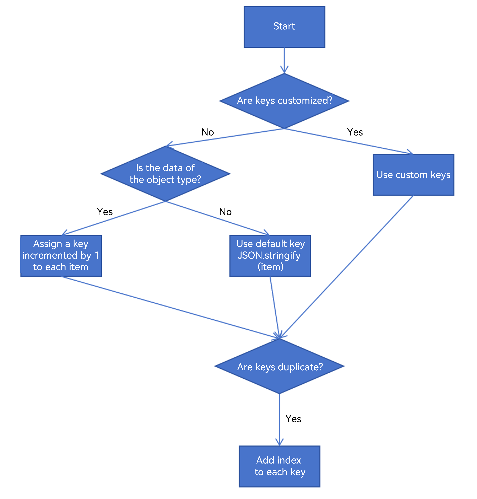
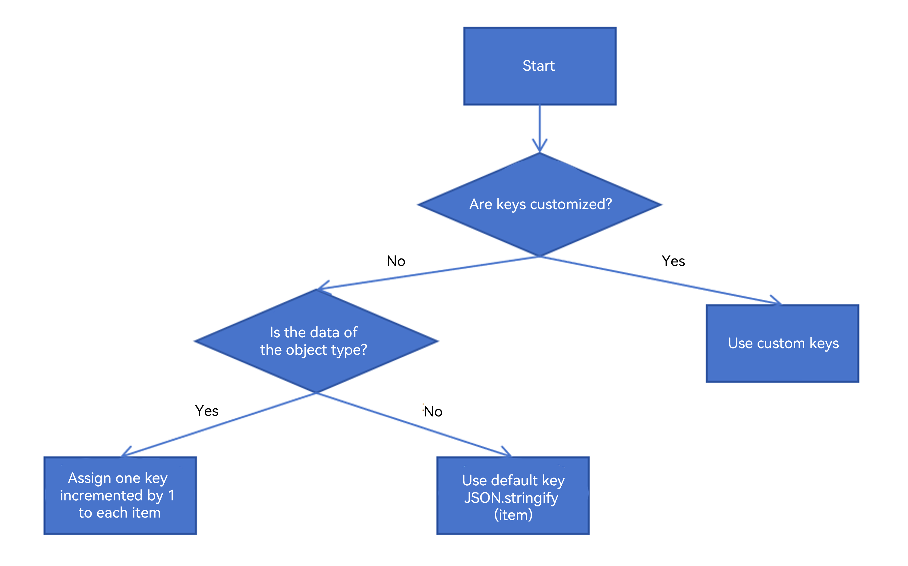
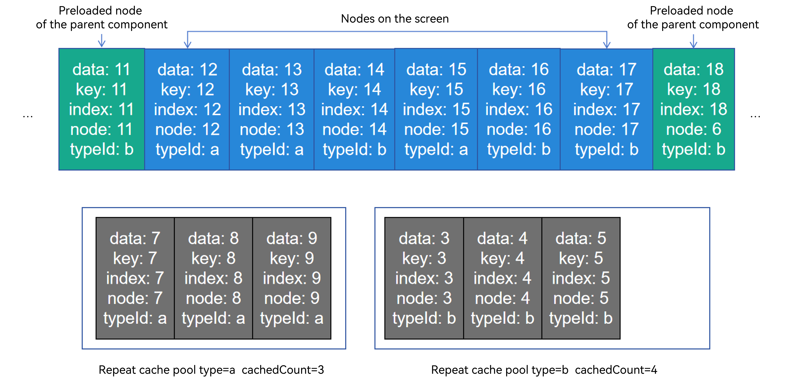
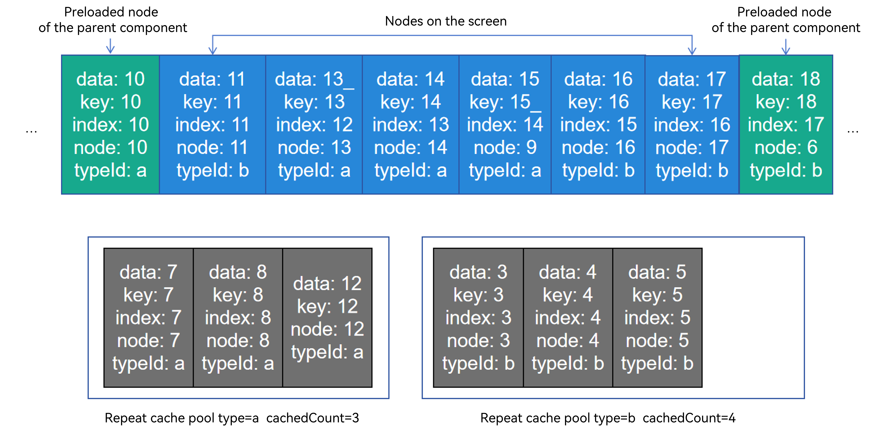
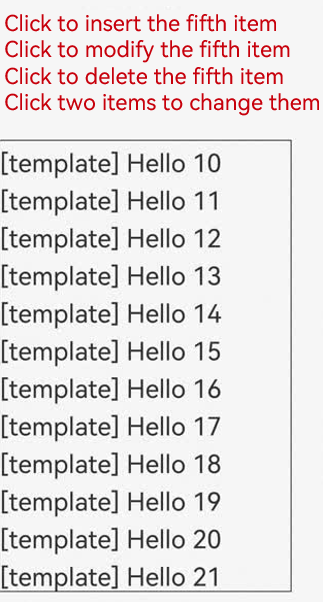
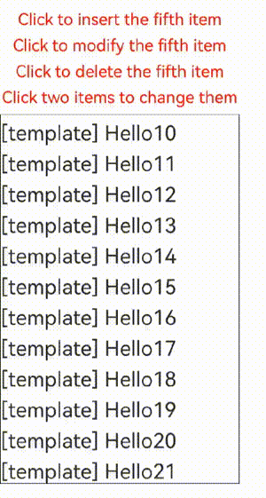
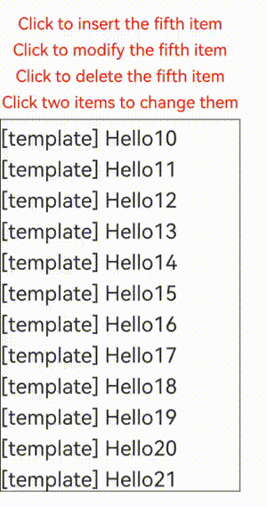
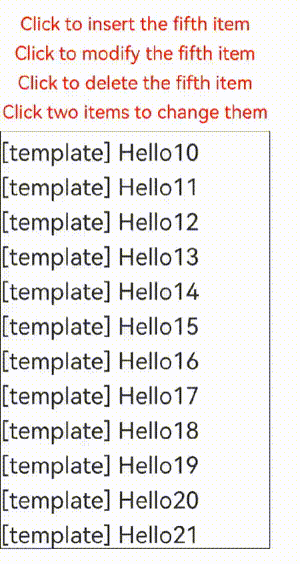
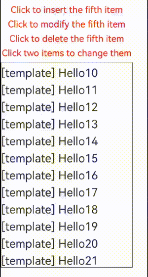
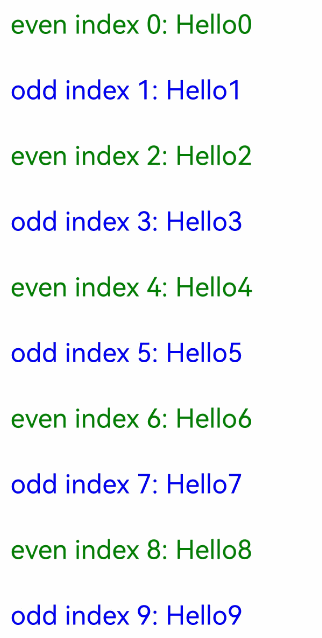

# Repeat: Reusing Child Components

>**NOTE**
>
>Repeat is supported since API version 12.
>
>State management V2 is still under development, and some features may be incomplete or not always work as expected.

For details about API parameters, see [Repeat APIs](https://gitee.com/openharmony/docs/blob/master/en/application-dev/reference/apis-arkui/arkui-ts/ts-rendering-control-repeat.md).

When **virtualScroll** is disabled, the **Repeat** component, which is used together with the container component, performs loop rendering based on array data. In addition, the component returned by the API should be a child component that can be contained in the **Repeat** parent container. Compared with ForEach, **Repeat** optimizes the rendering performance in some update scenarios and generates function with the index maintained by the framework.

When **virtualScroll** is enabled, **Repeat** iterates data from the provided data source as required and creates the corresponding component during each iteration. When **Repeat** is used in the scrolling container, the framework creates components as required based on the visible area of the scrolling container. When a component slides out of the visible area, the framework caches the component and uses it in the next iteration.

> **Note:**
>
> The **virtualScroll** scenario of the **Repeat** component is not fully compatible with the decorators in V1. Using decorators in V1 together with **virtualScroll** scenario may cause rendering exceptions.

## Constraints

- **Repeat** must be used in container components. Only the following components support virtual scrolling: [List](../reference/apis-arkui/arkui-ts/ts-container-list.md), [ListItemGroup](../reference/apis-arkui/arkui-ts/ts-container-listitemgroup.md), [Grid](../reference/apis-arkui/arkui-ts/ts-container-grid.md), [Swiper](../reference/apis-arkui/arkui-ts/ts-container-swiper.md) and [WaterFlow](../reference/apis-arkui/arkui-ts/ts-container-waterflow.md). In this case, **cachedCount** takes effect. Do not enable the **virtualScroll** function when other container components are using the **Repeat** component.
- After **virtualScroll** is enabled for **Repeat**, only one child component can be created in each iteration. Otherwise, there is no constraint.
- The generated child components must be allowed in the parent container component of **Repeat**.
- **Repeat** can be included in an **if/else** statement, and can also contain such a statement.
- **Repeat** uses key as identifiers internally. Therefore, the key generator must generate a unique value for each piece of data. If the key generated for multiple pieces of data at the same time are the same, UI component rendering will be faulty.
- If **virtualScroll** is disabled, the **template** is not supported currently and problems may occur when reusing.
- When **Repeat** and **\@Builder** are used together, parameters of the **RepeatItem** type must be passed so that the component can listen for data changes. If only **RepeatItem.item** or **RepeatItem.index** is passed, UI rendering exceptions occur.
- In the virtualScroll scenario, the value of totalCount is customized. When the length of data source changes, the value of totalCount should be manually updated. Otherwise, the rendering exception occurs on the list display area.

## Key Generation Rules

### non-virtualScroll



### virtualScroll

**virtualScroll** has a key generation rule similar to that of **non-virtualScroll.** However, it does not automatically handle the duplicate keys, so you need to ensure that the keys are unique.



## Component Generation and Reuse Rules

### non-virtualScroll

All child components are created when **Repeat** is rendered for the first time. The original components are reused when data is updated.

When the **Repeat** component updates data, it compares all keys in the last update with those in the latest update. If the current key is the same as the last one, **Repeat** reuses the child component and updates the **RepeatItem.index** index.

After **Repeat** compares all duplicate keys and reuses them, if the last key is unique and a new key is generated after this update, a child component needs to be created. In this case, **Repeat** will reuse redundant child components, update the **RepeatItem.item** data source and **RepeatItem.index** index, and re-render the UI.

If the number of remaining child components is greater than or equal to the number of newly updated components, the components are fully reused and redundant components are released. If the number of remaining child components is less than the number of newly updated components, **Repeat** will create components corresponding to the extra data items after the remaining data items are all reused.

### virtualScroll

At the first time when **Repeat** renders child components, only the required component is generated. During sliding and data update, nodes on the lower screen are cached. When a new component needs to be generated, the cached component is reused.

#### Slide shortcut

The following figure describes the node state before sliding.


Currently, the **Repeat** component has two types of templateId. **templateId a** sets three as its maximum cache value for the corresponding cache pool. **templateId b** sets four as its maximum cache value and preloads one note for its parent components by default. Now swipe right on the screen, and **Repeat** will reuse the nodes in the cache pool.


The data of **index=18** enters the screen and the preloading range of the parent component, coming up with a result of **templateId b**. In this case, **Repeat** obtains a node from the **type=b** cache pool for reuse and updates its key, index, and data. Other grandchildren notes that use the data and index in the child node are updated based on the state management V2 rules.

The **index=10** note slides out of the screen and the preloading range of the parent component. When the UI main thread is idle, it checks whether the **type=a** cache pool has sufficient space. In this case, there are four nodes in the cache pool, which exceeds the rated three, so **Repeat** will release the last node.



#### Data Update Scenarios


In this case, delete the **index=12** node, update the data of the **index=13** node, change the **templateId b** to **templateId a** of the **index=14** node, and update the key of the **index=15** node.


Now, **Repeat** notifies the parent component to re-lay out the nodes and compares the keys one by one. If the template ID of the node is the same as that of the original one, the note is reused to update the **key**, **index** and **data**. Otherwise, the node in the cache pool with the same template ID is reused to update the **key**, **index**, and **data**.


As shown in the preceding figure, node13 updates **data** and **index**; node14 updates the template ID and **index** and reuses a node from the cache pool; node15 reuses its own node and updates the **key**, **index**, and **data** synchronously because of the changed **key** and the unchanged template ID; node 16 and node 17 only update the **index**. The **index=17** node is new and reused from the cache pool.



## cachedCount Rules

The differences between the **.cachedCount** attribute of the the **List** or **Grid** component and the **cachedCount** attribute of the **Repeat** must be clarified. Both are used to balance performance and memory, but their definitions are different.
- **.cachedCount** of **List** or **Grid**: indicates the nodes that are located in the component tree and treated as invisible. Container components such as **List** or **Grid** render these nodes to achieve better performance. But **Repeat** treats these nodes as visible.
- template `cachedCount`: indicates the nodes that are treated as invisible by **Repeat**. These nodes are idle and are temporarily stored in the framework. You can update these nodes as required to implement reuse.

## Use Scenarios

### non-virtualScroll

#### Changing the Data Source

When **Repeat** component implements the non-initial rendering, it compares all keys in the last update with those in the latest update. If the current key is the same as the last one, **Repeat** reuses the child component and updates the **RepeatItem.index** index.

After **Repeat** compares all duplicate keys and reuses them, if the last key is unique and a new key is generated after this update, a child component needs to be created. In this case, **Repeat** will reuse redundant child components and update the **RepeatItem.item** data source and **RepeatItem.index** index.

If the number of remaining child components is greater than or equal to the number of newly updated components, the components are fully reused. If the number of remaining child components is less than the number of newly updated components, **Repeat** will create components corresponding to the extra data items after the remaining components are all reused.

```ts
@Entry
@ComponentV2
struct Parent {
  @Local simpleList: Array<string> = ['one', 'two', 'three'];

  build() {
    Row() {
      Column() {
        Text('Click to change the value of the third array item')
          .fontSize(24)
          .fontColor(Color.Red)
          .onClick(() => {
            this.simpleList[2] = 'new three';
          })

        Repeat<string>(this.simpleList)
            .each((obj: RepeatItem<string>)=>{
              ChildItem({ item: obj.item })
                .margin({top: 20})
            })
            .key((item: string) => item)
      }
      .justifyContent(FlexAlign.Center)
      .width('100%')
      .height('100%')
    }
    .height('100%')
    .backgroundColor(0xF1F3F5)
  }
}

@ComponentV2
struct ChildItem {
  @Param @Require item: string;

  build() {
    Text(this.item)
      .fontSize(30)
  }
}
```


The component of the third array item is reused when the array item is re-rendered, and only the data is refreshed.

#### Changing the Index Value

In the following example, when array items 1 and 2 are exchanged, if the key is as the same as the last one, **Repeat** reuses the previous component and updates only the data of the component that uses the **index** value.

```ts
@Entry
@ComponentV2
struct Parent {
  @Local simpleList: Array<string> = ['one', 'two', 'three'];

  build() {
    Row() {
      Column() {
        Text ('Exchange array items 1 and 2')
          .fontSize(24)
          .fontColor(Color.Red)
          .onClick(() => {
            let temp: string = this.simpleList[2]
            this.simpleList[2] = this.simpleList[1]
            this.simpleList[1] = temp
          })
          .margin({bottom: 20})

        Repeat<string>(this.simpleList)
          .each((obj: RepeatItem<string>)=>{
            Text("index: " + obj.index)
              .fontSize(30)
            ChildItem({ item: obj.item })
              .margin({bottom: 20})
          })
          .key((item: string) => item)
      }
      .justifyContent(FlexAlign.Center)
      .width('100%')
      .height('100%')
    }
    .height('100%')
    .backgroundColor(0xF1F3F5)
  }
}

@ComponentV2
struct ChildItem {
  @Param @Require item: string;

  build() {
    Text(this.item)
      .fontSize(30)
  }
}
```


### virtualScroll

This section describes the actual application scenarios of **Repeat** and the reuse of component nodes in the **virtualScroll** scenario. A large number of test scenarios can be derived based on reuse rules. This section only describes typical data changes.

#### Examples

The following code designs typical data source operations in the **virtualScroll** scenario of the **Repeat** component, including **inserting, modifying, deleting, and exchanging data**. Click the corresponding text to trigger the data change. Click two data items in sequence to exchange them.

```ts
@ObservedV2
class Clazz {
  @Trace message: string = '';

  constructor(message: string) {
    this.message = message;
  }
}

@Entry
@ComponentV2
struct TestPage {
  @Local simpleList: Array<Clazz> = [];
  private exchange: number[] = [];
  private counter: number = 0;

  aboutToAppear(): void {
    for (let i = 0; i < 100; i++) {
      this.simpleList.push(new Clazz('Hello ' + i));
    }
  }

  build() {
    Column({ space: 10 }) {
      Text('Click to insert the fifth item.')
        .fontSize(24)
        .fontColor(Color.Red)
        .onClick(() => {
          this.simpleList.splice(4, 0, new Clazz(`${this.counter++}_new item`));
        })
      Text('Click to modify the fifth item.')
        .fontSize(24)
        .fontColor(Color.Red)
        .onClick(() => {
          this.simpleList[4].message = `${this.counter++}_new item`;
        })
      Text ('Click to delete the fifth item.')
        .fontSize(24)
        .fontColor(Color.Red)
        .onClick(() => {
          this.simpleList.splice(4, 1);
        })
      Text('Click two items to change them.')
        .fontSize(24)
        .fontColor(Color.Red)

      List({ initialIndex: 10 }) {
        Repeat<Clazz>(this.simpleList)
          .each((obj: RepeatItem<Clazz>) => {
            ListItem() {
              Text('[each] ' + obj.item.message)
                .fontSize(30)
                .margin({ top: 10 })
            }
          })
          .key((item: Clazz, index: number) => {
            return item.message;
          })
          .virtualScroll({ totalCount: this.simpleList.length })
          .templateId((item: Clazz, index: number) => "default")
          .template('default', (ri) => {
            Text('[template] ' + ri.item.message)
              .fontSize(30)
              .margin({ top: 10 })
              .onClick(() => {
                this.exchange.push(ri.index);
                if (this.exchange.length === 2) {
                  let _a = this.exchange[0];
                  let _b = this.exchange[1];
                  // click to exchange
                  let temp: string = this.simpleList[_a].message;
                  this.simpleList[_a].message = this.simpleList[_b].message;
                  this.simpleList[_b].message = temp;
                  this.exchange = [];
                }
              })
          }, { cachedCount: 3 })
      }
      .cachedCount(1)
      .border({ width: 1 })
      .width('90%')
      .height('70%')
    }
    .height('100%')
    .justifyContent(FlexAlign.Center)
  }
}
```
The following figure lists 100 **message** string properties of the custom class **Clazz**. The **cachedCount** of the **List** component is set to 1, and the size of the **template "default"** cache pool is set to 3. The application screen is shown as bellow.



#### Node Operation Instance

When the data source is changed, the node whose key is changed will be re-created. If a cache node exists in the cache pool of the corresponding template, the node is reused. When the **key** remains unchanged, the component reuses and updates the **index** value.

**Inserting Data**

Operations



This example shows four data insertions. Two data items are inserted on the upper part of the screen for the first two times, and another two are inserted on the current screen for the last two times. Print the execution state of the **onUpdateNode** function. "[Old key]->[New key]" indicates that the old node reuses the new node. The node reuse is as follows:

```
// Insert data twice on the upper part of the screen.
onUpdateNode [Hello 22] -> [Hello 8]
onUpdateNode [Hello 21] -> [Hello 7]
// Insert data twice on the current screen.
onUpdateNode [Hello 11] -> [2_new item]
onUpdateNode [Hello 10] -> [3_new item]
```

When data is inserted on the upper part of the screen, the nodes move. As a result, the pre-loading node of the current screen changes and is reused. That is, the node 22 that exits the cache in the lower part is reused by the node 8 that enters the cache in the upper part. When data is inserted into the current screen, a new data item is generated. The new node will reuse the cached pre-loading node on the lower part of the screen. Data will not be reused when you add data to the lower part of the screen.

**Modifying Data**

Operations



This example shows four data modifications. Two data items are modified on the upper part of the screen for the first two times, and another two are modified on the current screen for the last two times. Print the execution state of the **onUpdateNode** function. "[Old key]->[New key]" indicates that the old node reuses the new node. The node reuse is as follows:

```
// Modify data twice on the current screen.
onUpdateNode [1_new item] -> [2_new item]
onUpdateNode [2_new item] -> [3_new item]
```

Because the rendering nodes does not exist in the upper or lower part of the screen, node reuse does not occur. When a node on the current screen is modified, the template ID of the node does not change. Therefore, the node is reused.

**Exchanging Data**

Operations



This example shows two data exchanges. Exchanging two nodes does not change the keys, so no node will be reused.

**Deleting Data**

Operations



This example shows five data deletions. Two data items are deleted on the upper part of the screen for the first two times, and another three are deleted on the current screen for the last three times. Print the execution state of the **onUpdateNode** function. "[Old key]->[New key]" indicates that the old node reuses the new node. The node reuse is as follows:

```
// Delete data twice on the upper part of the screen.
onUpdateNode [Hello 9] -> [Hello 23]
onUpdateNode [Hello 10] -> [Hello 24]
// The onUpdateNode function is not called when the data is deleted twice on the current screen.
// The data on the current screen is deleted for the third time.
onUpdateNode [Hello 6] -> [Hello 17]
```

When data is deleted from the upper part of the screen, the nodes move. As a result, the pre-loading node of the current screen changes and is reused. That is, the node 9 that exits the cache in the upper part is reused by the node 23 that enters the cache in the lower part. When data is deleted from the current screen, because of the **cachedCount** pre-loading property of the **List** component, the node that enters the screen in the first two deletions has been rendered and will not be reused. The deleted node enters the cache pool of the corresponding template. In the third deletion, the pre-loading node 17 that enters from the lower part reuses the node 6 in the cache pool.

#### Using Multiple Templates

```
@ObservedV2
class Wrap1 {
    @Trace message: string = '';
    
    constructor(message: string) {
        this.message = message;
    }
}

@Entry
@ComponentV2
struct Parent {
    @Local simpleList: Array<Wrap1> = [];
    
    aboutToAppear(): void {
        for (let i=0; i<100; i++) {
            this.simpleList.push(new Wrap1('Hello' + i));
        }
    }
    
    build() {
        Column() {
            List() {
                Repeat<Wrap1>(this.simpleList)
                	.each((obj: RepeatItem<Wrap1>)=>{
                    	ListItem() {
                    		Row() {
                    			Text('default index ' + obj.index + ': ')
                            		.fontSize(30)
                            	Text(obj.item.message)
                            		.fontSize(30)
                    		}
                        }
                        .margin(20)
                	})
                	.template('odd', (obj: RepeatItem<Wrap1>)=>{
                    	ListItem() {
                    		Row() {
                    			Text('odd index ' + obj.index + ': ')
                            		.fontSize(30)
                            		.fontColor(Color.Blue)
                            	Text(obj.item.message)
                            		.fontSize(30)
                            		.fontColor(Color.Blue)
                    		}
                        }
                        .margin(20)
                	})
                	.template('even', (obj: RepeatItem<Wrap1>)=>{
                    	ListItem() {
                    		Row() {
                    			Text('even index ' + obj.index + ': ')
                            		.fontSize(30)
                            		.fontColor(Color.Green)
                            	Text(obj.item.message)
                            		.fontSize(30)
                            		.fontColor(Color.Green)
                    		}
                        }
                        .margin(20)
                	})
                	.templateId((item: Wrap1, index: number) => {
                		return index%2 ? 'odd' : 'even';
                	})
                	.key((item: Wrap1, index: number) => {
                		return item.message;
                	})
            }
            .cachedCount(5)
            .width('100%')
            .height('100%')
        }
        .height('100%')
    }
}
```



#### The GUI is rendered abnormally when the keys are the same.

If the duplicate keys are misused in the virtualScroll scenario, the GUI rendering is abnormal.

```ts
@Entry
@ComponentV2
struct RepeatKey {
  @Local simpleList: Array<string> = [];

  aboutToAppear(): void {
    for (let i = 0; i < 200; i++) {
      this.simpleList.push(`item ${i}`);
    }
  }

  build() {
    Column({ space: 10 }) {
      List() {
        Repeat<string>(this.simpleList)
          .each((obj: RepeatItem<string>) => {
            ListItem() {
              Text(obj.item)
                .fontSize(30)
            }
          })
          .key((item: string, index: number) => {
            return 'same key'; // Define the same key.
          })
          .virtualScroll({ totalCount: 200 })
          .templateId((item:string, index: number) => 'default')
          .template('default', (ri) => {
            Text(ri.item)
              .fontSize(30)
          }, { cachedCount: 2 })
      }
      .cachedCount(2)
      .border({ width: 1 })
      .width('90%')
      .height('70%')
    }
    .justifyContent(FlexAlign.Center)
    .width('100%')
    .height('100%')
  }
}
```

The following figure shows the abnormal effect (the first data item **item 0** disappears).


## FAQs

### Ensure that the Position of the Scrollbar Remains Unchanged When the List Data Outside the Screen Changes

Declare the **Repeat** component in the **List** component to implement the **key** generation logic and **each** logic (as shown in the following sample code). Click **insert** to insert an element before the first element displayed on the screen, enabling the screen to scroll down.

```ts
// Define a class and mark it as observable.
// Customize an array in the class and mark it as traceable.
@ObservedV2
class ArrayHolder {
  @Trace arr: Array<number> = [];

  // constructor, used to initialize arrays.
  constructor(count: number) {
    for (let i = 0; i < count; i++) {
      this.arr.push(i);
    }
  }
}

@Entry
@ComponentV2
export struct RepeatTemplateSingle {
  @Local arrayHolder: ArrayHolder = new ArrayHolder(100);
  @Local totalCount: number = this.arrayHolder.arr.length;
  scroller: Scroller = new Scroller();

  build() {
    Column({ space: 5 }) {
      List({ space: 20, initialIndex: 19, scroller: this.scroller }) {
        Repeat(this.arrayHolder.arr)
          .virtualScroll({ totalCount: this.totalCount })
          .templateId((item, index) => {
            return 'number';
          })
          .template('number', (r) => {
            ListItem() {
              Text(r.index! + ":" + r.item + "Reuse");
            }
          })
          .each((r) => {
            ListItem() {
              Text(r.index! + ":" + r.item + "eachMessage");
            }
          })
      }
      .height('30%')

      Button(`insert totalCount ${this.totalCount}`)
        .height(60)
        .onClick(() => {
          // Insert an element which locates in the previous position displayed on the screen.
          this.arrayHolder.arr.splice(18, 0, this.totalCount);
          this.totalCount = this.arrayHolder.arr.length;
        })
    }
    .width('100%')
    .margin({ top: 5 })
  }
}
```

The figure below shows the effect.


In some scenarios, if you do not want the data source change outside the screen to affect the position where the **Scroller** of the **List** stays on the screen, you can use the [onScrollIndex](https://gitee.com/openharmony/docs/blob/master/en/application-dev/ui/arkts-layout-development-create-list.md#responding-to-the-scrolling-position) of the **List** component to listen for the scrolling action. When the list scrolls, you can obtain the scrolling position of a list. Use the [scrollToIndex](https://gitee.com/openharmony/docs/blob/master/en/application-dev/reference/apis-arkui/arkui-ts/ts-container-scroll.md#scrolltoindex) feature of the **Scroller** component to slide to the specified **index** position. In this way, when data is added to or deleted from the data source outside the screen, the position where the **Scroller** stays remains unchanged.

The following code shows the case of adding data to the data source.

```ts
// Define a class and mark it as observable.
// Customize an array in the class and mark it as traceable.
@ObservedV2
class ArrayHolder {
  @Trace arr: Array<number> = [];

  // constructor, used to initialize arrays.
  constructor(count: number) {
    for (let i = 0; i < count; i++) {
      this.arr.push(i);
    }
  }
}

@Entry
@ComponentV2
export struct RepeatTemplateSingle {
  @Local arrayHolder: ArrayHolder = new ArrayHolder(100);
  @Local totalCount: number = this.arrayHolder.arr.length;
  scroller: Scroller = new Scroller();

  private start: number = 1;
  private end: number = 1;

  build() {
    Column({ space: 5 }) {
      List({ space: 20, initialIndex: 19, scroller: this.scroller }) {
        Repeat(this.arrayHolder.arr)
          .virtualScroll({ totalCount: this.totalCount })
          .templateId((item, index) => {
            return 'number';
          })
          .template('number', (r) => {
            ListItem() {
              Text(r.index! + ":" + r.item + "Reuse");
            }
          })
          .each((r) => {
            ListItem() {
              Text(r.index! + ":" + r.item + "eachMessage");
            }
          })
      }
      .onScrollIndex((start, end) => {
        this.start = start;
        this.end = end;
      })
      .height('30%')

      Button(`insert totalCount ${this.totalCount}`)
        .height(60)
        .onClick(() => {
          // Insert an element which locates in the previous position displayed on the screen.
          this.arrayHolder.arr.splice(18, 0, this.totalCount);
          let rect = this.scroller.getItemRect(this.start); // Obtain the size and position of the child component.
          this.scroller.scrollToIndex(this.start + 1); // Slide to the specified index.
          this.scroller.scrollBy(0, -rect.y); // Slide by a specified distance.
          this.totalCount = this.arrayHolder.arr.length;
        })
    }
    .width('100%')
    .margin({ top: 5 })
  }
}
```

The figure below shows the effect.


### The totalCount Value Is Greater Than the Length of Data Source

When the total length of the data source is large, the lazy loading is used to load some data first. To enable **Repeat** to display the correct scrollbar style, you need to change the value of **totalCount** to the total length of data. That is, before all data sources are loaded, the value of **totalCount** is greater than that of **array.length**.

When the **Repeat** component is initialized, the application must provide sufficient data items for rendering. During the scrolling process of the parent container, the application needs to execute the request instruction for subsequent data items before rendering to ensure that no blank area is displayed during the list sliding process until all data sources are loaded.

You can use the callback of [onScrollIndex](https://gitee.com/openharmony/docs/blob/master/en/application-dev/ui/arkts-layout-development-create-list.md#controlling-the-scrolling-position) attribute of the **List** or **Grid** parent component to implement the preceding specification. The sample code is as follows:

```ts
@ObservedV2
class VehicleData {
  @Trace name: string;
  @Trace price: number;

  constructor(name: string, price: number) {
    this.name = name;
    this.price = price;
  }
}

@ObservedV2
class VehicleDB {
  public vehicleItems: VehicleData[] = [];

  constructor() {
    // init data size 20
    for (let i = 1; i <= 20; i++) {
      this.vehicleItems.push(new VehicleData(`Vehicle${i}`, i));
    }
  }
}

@Entry
@ComponentV2
struct entryCompSucc {
  @Local vehicleItems: VehicleData[] = new VehicleDB().vehicleItems;
  @Local listChildrenSize: ChildrenMainSize = new ChildrenMainSize(60);
  @Local totalCount: number = this.vehicleItems.length;
  scroller: Scroller = new Scroller();

  build() {
    Column({ space: 3 }) {
      List({ scroller: this.scroller }) {
        Repeat(this.vehicleItems)
          .virtualScroll({ totalCount: 50 }) // total data size 50
          .templateId(() => 'default')
          .template('default', (ri) => {
            ListItem() {
              Column() {
                Text(`${ri.item.name} + ${ri.index}`)
                  .width('90%')
                  .height(this.listChildrenSize.childDefaultSize)
                  .backgroundColor(0xFFA07A)
                  .textAlign(TextAlign.Center)
                  .fontSize(20)
                  .fontWeight(FontWeight.Bold)
              }
            }.border({ width: 1 })
          }, { cachedCount: 5 })
          .each((ri) => {
            ListItem() {
              Text("Wrong: " + `${ri.item.name} + ${ri.index}`)
                .width('90%')
                .height(this.listChildrenSize.childDefaultSize)
                .backgroundColor(0xFFA07A)
                .textAlign(TextAlign.Center)
                .fontSize(20)
                .fontWeight(FontWeight.Bold)
            }.border({ width: 1 })
          })
          .key((item, index) => `${index}:${item}`)
      }
      .height('50%')
      .margin({ top: 20 })
      .childrenMainSize(this.listChildrenSize)
      .alignListItem(ListItemAlign.Center)
      .onScrollIndex((start, end) => {
        console.log('onScrollIndex', start, end);
        // lazy data loading
        if (this.vehicleItems.length < 50) {
          for (let i = 0; i < 10; i++) {
            if (this.vehicleItems.length < 50) {
              this.vehicleItems.push(new VehicleData("Vehicle_loaded", i));
            }
          }
        }
      })
    }
  }
}
```

The figure below shows the effect.


