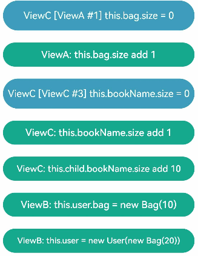
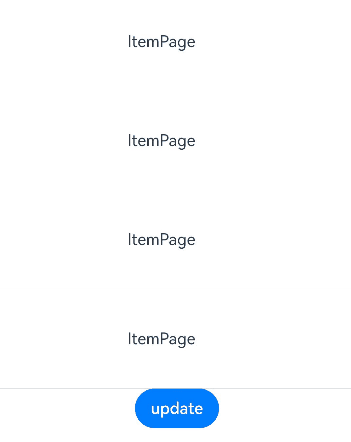
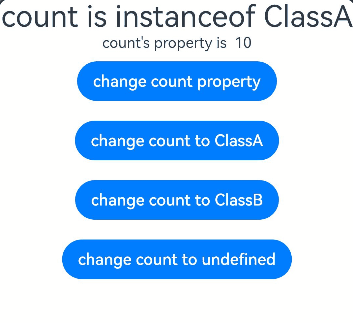
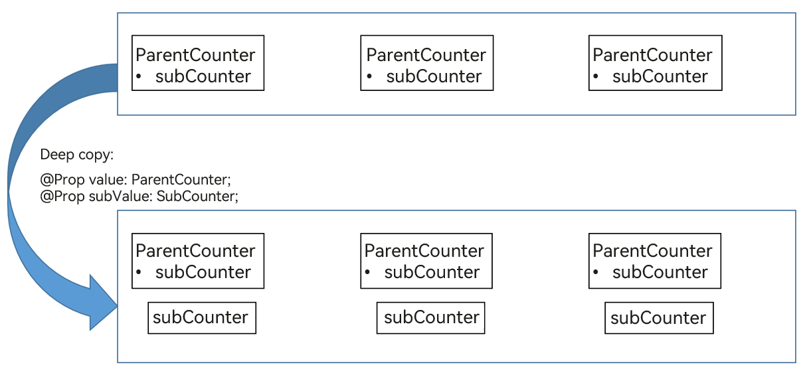

# \@Observed and \@ObjectLink Decorators: Observing Attribute Changes in Nested Class Objects


The aforementioned decorators can observe only the changes of the first layer. However, in real-world application development, an application may encapsulate its own data model. In this case, for multi-layer nesting, for example, a two-dimensional array, an array item class, or a class inside another class as an attribute, the attribute changes at the second layer cannot be observed. This is where the \@Observed and \@ObjectLink decorators come in handy.


> **NOTE**
>
> These two decorators can be used in ArkTS widgets since API version 9.
>
> These two decorators can be used in atomic services since API version 11.

## Overview

\@ObjectLink and \@Observed class decorators are used for two-way data synchronization in scenarios involving nested objects or arrays:

- Regarding classes decorated by \@Observed, the attribute changes can be observed.

- The \@ObjectLink decorated state variable in the child component is used to accept the instance of the \@Observed decorated class and establish two-way data binding with the corresponding state variable in the parent component. The instance can be an \@Observed decorated item in the array or an \@Observed decorated attribute in the class object.

- Using \@Observed alone has no effect in nested classes. To observe changes of class properties, it must be used with a custom component. (For examples, see [Nested Object](#nested-object)). To create a two-way or one-way synchronization, it must be used with \@ObjectLink or with \@Prop. (For examples, see [Differences Between \@Prop and \@ObjectLink](#differences-between-prop-and-objectlink).)


## Constraints

- Using \@Observed to decorate a class changes the original prototype chain of the class. Using \@Observed and other class decorators to decorate the same class may cause problems.

- The \@ObjectLink decorator cannot be used in custom components decorated by \@Entry.


## Decorator Description

| \@Observed Decorator| Description                               |
| -------------- | --------------------------------- |
| Decorator parameters         | None.                                |
| Class decorator          | Decorates a class. You must use **new** to create a class object before defining the class.|

| \@ObjectLink Decorator| Description                                      |
| ----------------- | ---------------------------------------- |
| Decorator parameters            | None.                                       |
| Allowed variable types        | Objects of \@Observed decorated classes. The type must be specified.<br>Simple type variables are not supported. Use [\@Prop](arkts-prop.md) instead.<br>Objects of classes that extend Date, [Array](#two-dimensional-array), [Map](#extended-map-class), and [Set](#extended-set-class) (the latter two are supported since API version 11). For an example, see [Observed Changes](#observed-changes).<br>(Applicable to API version 11 or later) Union type of @Observed decorated classes and **undefined** or **null**, for example, **ClassA \| ClassB**, **ClassA \| undefined** or **ClassA \| null**. For details, see [Union Type @ObjectLink](#union-type-objectlink).<br>An \@ObjectLink decorated variable accepts changes to its attributes, but assignment is not allowed. In other words, an \@ObjectLink decorated variable is read-only and cannot be changed. |
| Initial value for the decorated variable        | Not allowed.                                    |

Example of a read-only \@ObjectLink decorated variable:


```ts
// The \@ObjectLink decorated variable accepts changes to its attribute.
this.objLink.a= ...
// Value assignment is not allowed for the \@ObjectLink decorated variable.
this.objLink= ...
```

> **NOTE**
>
> Value assignment is not allowed for the \@ObjectLink decorated variable. To assign a value, use [@Prop](arkts-prop.md) instead.
>
> - \@Prop creates a one-way synchronization from the data source to the decorated variable. It takes a copy of its source to enable changes to remain local. When \@Prop observes a change to its source, the local value of the \@Prop decorated variable is overwritten.
>
> - \@ObjectLink creates a two-way synchronization between the data source and the decorated variable. An \@ObjectLink decorated variable can be considered as a pointer to the source object inside the parent component. Do not assign values to \@ObjectLink decorated variables, as doing so will interrupt the synchronization chain. \@ObjectLink decorated variables are initialized through data source (Object) references. Assigning a value to them is equivalent to updating the array items or class attributes in the parent component, which is not supported in TypeScript/JavaScript and will result in a runtime error.


## Variable Transfer/Access Rules

| \@ObjectLink Transfer/Access| Description                                      |
| ----------------- | ---------------------------------------- |
| Initialization from the parent component          | Mandatory.<br>To initialize an \@ObjectLink decorated variable, a variable in the parent component must meet all the following conditions:<br>- The variable type is an \@Observed decorated class.<br>- The initialized value must be an array item or a class attribute.<br>- The class or array of the synchronization source must be decorated by [\@State](./arkts-state.md), [\@Link](./arkts-link.md), [\@Provide](./arkts-provide-and-consume.md), [\@Consume](./arkts-provide-and-consume.md), or \@ObjectLink.<br>For an example where the synchronization source is an array item, see [Object Array](#object-array). For an example of the initialized class, see [Nested Object](#nested-object).|
| Synchronization with the source           | Two-way.                                     |
| Subnode initialization         | Supported; can be used to initialize a regular variable or \@State, \@Link, \@Prop, or \@Provide decorated variable in the child component.|


  **Figure 1** Initialization rule 


## Observed Changes and Behavior


### Observed Changes

If the attribute of an \@Observed decorated class is not of the simple type, such as class, object, or array, it must be decorated by \@Observed. Otherwise, the attribute changes cannot be observed.


```ts
class ClassA {
  public c: number;

  constructor(c: number) {
    this.c = c;
  }
}

@Observed
class ClassB {
  public a: ClassA;
  public b: number;

  constructor(a: ClassA, b: number) {
    this.a = a;
    this.b = b;
  }
}
```

In the preceding example, **ClassB** is decorated by \@Observed, and the value changes of its member variables can be observed. In contrast, **ClassA** is not decorated by \@Observed, and therefore its attribute changes cannot be observed.


```ts
@ObjectLink b: ClassB

// Value changes can be observed.
this.b.a = new ClassA(5)
this.b.b = 5

// ClassA is not decorated by @Observed, and its attribute changes cannot be observed.
this.b.a.c = 5
```

\@ObjectLink: \@ObjectLink can only accept instances of classes decorated by \@Observed. When possible, design a separate custom component to render each array or object. In this case, an object array or nested object (which is an object whose property is an object) requires two custom components: one for rendering an external array/object, and the other for rendering a class object nested within the array/object. The following can be observed:

- Value changes of the attributes that **Object.keys(observedObject)** returns. For details, see [Nested Object](#nested-object).

- Replacement of array items for the data source of an array and changes of class attributes for the data source of a class. For details, see [Object Array](#object-array).

For an instance of the class that extends **Date**, the value changes of **Date** attributes can be observed. In addition, you can call the following APIs to update **Date** attributes: **setFullYear**, **setMonth**, **setDate**, **setHours**, **setMinutes**, **setSeconds**, **setMilliseconds**, **setTime**, **setUTCFullYear**, **setUTCMonth**, **setUTCDate**, **setUTCHours**, **setUTCMinutes**, **setUTCSeconds**, and **setUTCMilliseconds**.

```ts
@Observed
class DateClass extends Date {
  constructor(args: number | string) {
    super(args)
  }
}

@Observed
class ClassB {
  public a: DateClass;

  constructor(a: DateClass) {
    this.a = a;
  }
}

@Component
struct ViewA {
  label: string = 'date';
  @ObjectLink a: DateClass;

  build() {
    Column() {
      Button(`child increase the day by 1`)
        .onClick(() => {
          this.a.setDate(this.a.getDate() + 1);
        })
      DatePicker({
        start: new Date('1970-1-1'),
        end: new Date('2100-1-1'),
        selected: this.a
      })
    }
  }
}

@Entry
@Component
struct ViewB {
  @State b: ClassB = new ClassB(new DateClass('2023-1-1'));

  build() {
    Column() {
      ViewA({ label: 'date', a: this.b.a })

      Button(`parent update the new date`)
        .onClick(() => {
          this.b.a = new DateClass('2023-07-07');
        })
      Button(`ViewB: this.b = new ClassB(new DateClass('2023-08-20'))`)
        .onClick(() => {
          this.b = new ClassB(new DateClass('2023-08-20'));
        })
    }
  }
}
```

For a class that extends **Map**, the value changes of the **Map** instance can be observed. In addition, you can call the following APIs to update the instance: **set**, **clear**, and **delete**. For details, see [Extended Map Class](#extended-map-class).

For a class that extends **Set**, the value changes of the **Set** instance can be observed. In addition, you can call the following APIs to update the instance: **add**, **clear**, and **delete**. For details, see [Extended Set Class](#extended-set-class).


### Framework Behavior

1. Initial rendering:
   1. \@Observed causes all instances of the decorated class to be wrapped with an opaque proxy object, which takes over the setter and getter methods of the attributes of the class.
   2. The \@ObjectLink decorated variable in the child component is initialized from the parent component and accepts the instance of the \@Observed decorated class. The \@ObjectLink decorated wrapped object registers itself with the \@Observed decorated class.

2. Attribute update: When the attribute of the \@Observed decorated class is updated, the system uses the setter and getter of the proxy, traverses the \@ObjectLink decorated wrapped objects that depend on it, and notifies the data update.


## Use Scenarios


### Nested Object

> **NOTE**
>
> **NextID** is used to generate a unique, persistent key for each array item during [ForEach rendering](./arkts-rendering-control-foreach.md), so as to identify the corresponding component.


```ts
// objectLinkNestedObjects.ets
let NextID: number = 1;

@Observed
class Bag {
  public id: number;
  public size: number;

  constructor(size: number) {
    this.id = NextID++;
    this.size = size;
  }
}

@Observed
class User {
  public bag: Bag;

  constructor(bag: Bag) {
    this.bag = bag;
  }
}

@Observed
class Book {
  public bookName: BookName;

  constructor(bookName: BookName) {
    this.bookName = bookName;
  }
}

@Observed
class BookName extends Bag {
  public nameSize: number;

  constructor(nameSize: number) {
    // Invoke the parent class method to process nameSize.
    super(nameSize);
    this.nameSize = nameSize;
  }
}

@Component
struct ViewA {
  label: string = 'ViewA';
  @ObjectLink bag: Bag;

  build() {
    Column() {
      Text(`ViewA [${this.label}] this.bag.size = ${this.bag.size}`)
        .fontColor('#ffffffff')
        .backgroundColor('#ff3d9dba')
        .width(320)
        .height(50)
        .borderRadius(25)
        .margin(10)
        .textAlign(TextAlign.Center)
      Button(`ViewA: this.bag.size add 1`)
        .width(320)
        .backgroundColor('#ff17a98d')
        .margin(10)
        .onClick(() => {
          this.bag.size += 1;
        })
    }
  }
}

@Component
struct ViewC {
  label: string = 'ViewC1';
  @ObjectLink bookName: BookName;

  build() {
    Row() {
      Column() {
        Text(`ViewC [${this.label}] this.bookName.size = ${this.bookName.size}`)
          .fontColor('#ffffffff')
          .backgroundColor('#ff3d9dba')
          .width(320)
          .height(50)
          .borderRadius(25)
          .margin(10)
          .textAlign(TextAlign.Center)
        Button(`ViewC: this.bookName.size add 1`)
          .width(320)
          .backgroundColor('#ff17a98d')
          .margin(10)
          .onClick(() => {
            this.bookName.size += 1;
            console.log('this.bookName.size:' + this.bookName.size)
          })
      }
      .width(320)
    }
  }
}

@Entry
@Component
struct ViewB {
  @State user: User = new User(new Bag(0));
  @State child: Book = new Book(new BookName(0));

  build() {
    Column() {
      ViewA({ label: 'ViewA #1', bag: this.user.bag })
        .width(320)
      ViewC({ label: 'ViewC #3', bookName: this.child.bookName })
        .width(320)
      Button(`ViewB: this.child.bookName.size add 10`)
        .width(320)
        .backgroundColor('#ff17a98d')
        .margin(10)
        .onClick(() => {
          this.child.bookName.size += 10
          console.log('this.child.bookName.size:' + this.child.bookName.size)
        })
      Button(`ViewB: this.user.bag = new Bag(10)`)
        .width(320)
        .backgroundColor('#ff17a98d')
        .margin(10)
        .onClick(() => {
          this.user.bag = new Bag(10);
        })
      Button(`ViewB: this.user = new User(new Bag(20))`)
        .width(320)
        .backgroundColor('#ff17a98d')
        .margin(10)
        .onClick(() => {
          this.user = new User(new Bag(20));
        })
    }
  }
}
```



The @Observed decorated **BookName** class can observe changes in the attributes inherited from the base class.


Event handles in **ViewB**:


- **this.user.bag = new Bag(10)** and **this.user = new User(new Bag(20))**: Change to the \@State decorated variable **size** and its attributes.

- this.child.bookName.size += ... : Change at the second layer. Though \@State cannot observe changes at the second layer, the change of an attribute of \@Observed decorated **Bag**, which is attribute **size** in this example, can be observed by \@ObjectLink.


Event handle in **ViewC**:


- **this.bookName.size += 1**: A change to the \@ObjectLink decorated variable **size** causes the button label to be updated. Unlike \@Prop, \@ObjectLink does not have a copy of its source. Instead, \@ObjectLink creates a reference to its source.

- The \@ObjectLink decorated variable is read-only. Assigning **this.bookName = new bookName(...)** is not allowed. Once value assignment occurs, the reference to the data source is reset and the synchronization is interrupted.


### Object Array

An object array is a frequently used data structure. The following example shows the usage of array objects.


```ts
let NextID: number = 1;

@Observed
class ClassA {
  public id: number;
  public c: number;

  constructor(c: number) {
    this.id = NextID++;
    this.c = c;
  }
}

@Component
struct ViewA {
  // The type of @ObjectLink of the child component ViewA is ClassA.
  @ObjectLink a: ClassA;
  label: string = 'ViewA1';

  build() {
    Row() {
      Button(`ViewA [${this.label}] this.a.c = ${this.a ? this.a.c : "undefined"}`)
        .width(320)
        .margin(10)
        .onClick(() => {
          this.a.c += 1;
        })
    }
  }
}

@Entry
@Component
struct ViewB {
  // ViewB has the @State decorated ClassA[].
  @State arrA: ClassA[] = [new ClassA(0), new ClassA(0)];

  build() {
    Column() {
      ForEach(this.arrA,
        (item: ClassA) => {
          ViewA({ label: `#${item.id}`, a: item })
        },
        (item: ClassA): string => item.id.toString()
      )
      // Initialize the @ObjectLink decorated variable using the array item in the @State decorated array, which is an instance of ClassA decorated by @Observed.
      ViewA({ label: `ViewA this.arrA[first]`, a: this.arrA[0] })
      ViewA({ label: `ViewA this.arrA[last]`, a: this.arrA[this.arrA.length-1] })

      Button(`ViewB: reset array`)
        .width(320)
        .margin(10)
        .onClick(() => {
          this.arrA = [new ClassA(0), new ClassA(0)];
        })
      Button(`ViewB: push`)
        .width(320)
        .margin(10)
        .onClick(() => {
          this.arrA.push(new ClassA(0))
        })
      Button(`ViewB: shift`)
        .width(320)
        .margin(10)
        .onClick(() => {
          if (this.arrA.length > 0) {
            this.arrA.shift()
          } else {
            console.log("length <= 0")
          }
        })
      Button(`ViewB: chg item property in middle`)
        .width(320)
        .margin(10)
        .onClick(() => {
          this.arrA[Math.floor(this.arrA.length / 2)].c = 10;
        })
      Button(`ViewB: chg item property in middle`)
        .width(320)
        .margin(10)
        .onClick(() => {
          this.arrA[Math.floor(this.arrA.length / 2)] = new ClassA(11);
        })
    }
  }
}
```


- this.arrA[Math.floor(this.arrA.length/2)] = new ClassA(..): The change of this state variable triggers two updates.
  1. ForEach: The value assignment of the array item causes the change of [itemGenerator](../reference/apis-arkui/arkui-ts/ts-rendering-control-foreach.md) of **ForEach**. Therefore, the array item is identified as changed, and the item builder of** ForEach** is executed to create a **ViewA** component instance.
  2. ViewA({ label: `ViewA this.arrA[last]`, a: this.arrA[this.arrA.length-1] }): The preceding update changes the second element in the array. Therefore, the **ViewA** component instance bound to **this.arrA[1]** is updated.

- this.arrA.push(new ClassA(0)): The change of this state variable triggers two updates with different effects.
  1. ForEach: The newly added **ClassA** object is unknown to the **ForEach** [itemGenerator](../reference/apis-arkui/arkui-ts/ts-rendering-control-foreach.md). The item builder of **ForEach** will be executed to create a **ViewA** component instance.
  2. ViewA({ label: ViewA this.arrA[last], a: this.arrA[this.arrA.length-1] }): The last item of the array is changed. As a result, the second **View A** component instance is changed. For **ViewA({ label: ViewA this.arrA[first], a: this.arrA[0] })**, a change to the array does not trigger a change to the array item, so the first **View A** component instance is not refreshed.

- this.arrA[Math.floor(this.arrA.length/2)].c: @State cannot observe changes at the second layer. However, as **ClassA** is decorated by \@Observed, the change of its attributes will be observed by \@ObjectLink.


### Two-Dimensional Array

@Observed class decoration is required for a two-dimensional array. You can declare an \@Observed decorated class that extends from **Array**.


```ts
@Observed
class StringArray extends Array<String> {
}
```

Use **new StringArray()** to create an instance of **StringArray**. The **new** operator makes \@Observed take effect, which can observe the attribute changes of **StringArray**.

Declare a class that extends from **Array**: **class StringArray extends Array\<String> {}** and create an instance of **StringArray**. The use of the **new** operator is required for the \@Observed class decorator to work properly.


```ts
@Observed
class StringArray extends Array<String> {
}

@Component
struct ItemPage {
  @ObjectLink itemArr: StringArray;

  build() {
    Row() {
      Text('ItemPage')
        .width(100).height(100)

      ForEach(this.itemArr,
        (item: string | Resource) => {
          Text(item)
            .width(100).height(100)
        },
        (item: string) => item
      )
    }
  }
}

@Entry
@Component
struct IndexPage {
  @State arr: Array<StringArray> = [new StringArray(), new StringArray(), new StringArray()];

  build() {
    Column() {
      ItemPage({ itemArr: this.arr[0] })
      ItemPage({ itemArr: this.arr[1] })
      ItemPage({ itemArr: this.arr[2] })
      Divider()


      ForEach(this.arr,
        (itemArr: StringArray) => {
          ItemPage({ itemArr: itemArr })
        },
        (itemArr: string) => itemArr[0]
      )

      Divider()

      Button('update')
        .onClick(() => {
          console.error('Update all items in arr');
          if ((this.arr[0] as Array<String>)[0] !== undefined) {
            // We should have a real ID to use with ForEach, but we do not.
            // Therefore, we need to make sure the pushed strings are unique.
            this.arr[0].push(`${this.arr[0].slice(-1).pop()}${this.arr[0].slice(-1).pop()}`);
            this.arr[1].push(`${this.arr[1].slice(-1).pop()}${this.arr[1].slice(-1).pop()}`);
            this.arr[2].push(`${this.arr[2].slice(-1).pop()}${this.arr[2].slice(-1).pop()}`);
          } else {
            this.arr[0].push('Hello');
            this.arr[1].push('World');
            this.arr[2].push('!');
          }
        })
    }
  }
}
```



### Extended Map Class

> **NOTE**
>
> Since API version 11, \@ObjectLink supports @Observed decorated classes extending from **Map** and the Map type.

In the following example, the **myMap** variable is of the MyMap\<number, string\> type. When the button is clicked, the value of **myMap** changes, and the UI is re-rendered.

```ts
@Observed
class ClassA {
  public a: MyMap<number, string>;

  constructor(a: MyMap<number, string>) {
    this.a = a;
  }
}


@Observed
export class MyMap<K, V> extends Map<K, V> {
  public name: string;

  constructor(name?: string, args?: [K, V][]) {
    super(args);
    this.name = name ? name : "My Map";
  }

  getName() {
    return this.name;
  }
}

@Entry
@Component
struct MapSampleNested {
  @State message: ClassA = new ClassA(new MyMap("myMap", [[0, "a"], [1, "b"], [3, "c"]]));

  build() {
    Row() {
      Column() {
        MapSampleNestedChild({ myMap: this.message.a })
      }
      .width('100%')
    }
    .height('100%')
  }
}

@Component
struct MapSampleNestedChild {
  @ObjectLink myMap: MyMap<number, string>

  build() {
    Row() {
      Column() {
        ForEach(Array.from(this.myMap.entries()), (item: [number, string]) => {
          Text(`${item[0]}`).fontSize(30)
          Text(`${item[1]}`).fontSize(30)
          Divider().strokeWidth(5)
        })

        Button('set new one')
          .width(200)
          .margin(10)
          .onClick(() => {
            this.myMap.set(4, "d")
          })
        Button('clear')
          .width(200)
          .margin(10)
          .onClick(() => {
            this.myMap.clear()
          })
        Button('replace the first one')
          .width(200)
          .margin(10)
          .onClick(() => {
            this.myMap.set(0, "aa")
          })
        Button('delete the first one')
          .width(200)
          .margin(10)
          .onClick(() => {
            this.myMap.delete(0)
          })
      }
      .width('100%')
    }
    .height('100%')
  }
}
```


### Extended Set Class

> **NOTE**
>
> Since API version 11, \@ObjectLink supports @Observed decorated classes extending from **Set** and the Set type.

In the following example, the **mySet** variable is of the MySet\<number\> type. When the button is clicked, the value of **mySet** changes, and the UI is re-rendered.

```ts
@Observed
class ClassA {
  public a: MySet<number>;

  constructor(a: MySet<number>) {
    this.a = a;
  }
}


@Observed
export class MySet<T> extends Set<T> {
  public name: string;

  constructor(name?: string, args?: T[]) {
    super(args);
    this.name = name ? name : "My Set";
  }

  getName() {
    return this.name;
  }
}

@Entry
@Component
struct SetSampleNested {
  @State message: ClassA = new ClassA(new MySet("Set", [0, 1, 2, 3, 4]));

  build() {
    Row() {
      Column() {
        SetSampleNestedChild({ mySet: this.message.a })
      }
      .width('100%')
    }
    .height('100%')
  }
}

@Component
struct SetSampleNestedChild {
  @ObjectLink mySet: MySet<number>

  build() {
    Row() {
      Column() {
        ForEach(Array.from(this.mySet.entries()), (item: [number, number]) => {
          Text(`${item}`).fontSize(30)
          Divider()
        })
        Button('set new one')
          .width(200)
          .margin(10)
          .onClick(() => {
            this.mySet.add(5)
          })
        Button('clear')
          .width(200)
          .margin(10)
          .onClick(() => {
            this.mySet.clear()
          })
        Button('delete the first one')
          .width(200)
          .margin(10)
          .onClick(() => {
            this.mySet.delete(0)
          })
      }
      .width('100%')
    }
    .height('100%')
  }
}
```


## Union Type @ObjectLink

@ObjectLink supports union types of @Observed decorated classes and **undefined** or **null**. In the following example, the type of **count** is ClassA | ClassB | undefined. If the attribute or type of **count** is changed when the button in the parent component **Page2** is clicked, the change will be synchronized to the child component.

```ts
@Observed
class ClassA {
  public a: number;

  constructor(a: number) {
    this.a = a;
  }
}

@Observed
class ClassB {
  public b: number;

  constructor(b: number) {
    this.b = b;
  }
}

@Entry
@Component
struct Page2 {
  @State count: ClassA | ClassB | undefined = new ClassA(10)

  build() {
    Column() {
      Child({ count: this.count })

      Button('change count property')
        .onClick(() => {
          // Determine the count type and update the attribute.
          if (this.count instanceof ClassA) {
            this.count.a += 1
          } else if (this.count instanceof ClassB) {
            this.count.b += 1
          } else {
            console.info('count is undefined, cannot change property')
          }
        })

      Button('change count to ClassA')
        .onClick(() => {
          // Assign the value to an instance of ClassA.
          this.count = new ClassA(100)
        })

      Button('change count to ClassB')
        .onClick(() => {
          // Assign the value to an instance of ClassA.
          this.count = new ClassB(100)
        })

      Button('change count to undefined')
        .onClick(() => {
          // Assign the value undefined.
          this.count = undefined
        })
    }.width('100%')
  }
}

@Component
struct Child {
  @ObjectLink count: ClassA | ClassB | undefined

  build() {
    Column() {
      Text(`count is instanceof ${this.count instanceof ClassA ? 'ClassA' : this.count instanceof ClassB ? 'ClassB' : 'undefined'}`)
        .fontSize(30)

      Text(`count's property is  ${this.count instanceof ClassA ? this.count.a : this.count?.b}`).fontSize(15)

    }.width('100%')
  }
}
```



## FAQs

### Assigning Value to @ObjectLink Decorated Variable in Child Component

It is not allowed to assign a value to an @ObjectLink decorated variable in the child component.

[Incorrect Usage]

```ts
@Observed
class ClassA {
  public c: number = 0;

  constructor(c: number) {
    this.c = c;
  }
}

@Component
struct ObjectLinkChild {
  @ObjectLink testNum: ClassA;

  build() {
    Text(`ObjectLinkChild testNum ${this.testNum.c}`)
      .onClick(() => {
        // The @ObjectLink decorated variable cannot be assigned a value here.
        this.testNum = new ClassA(47);
      })
  }
}

@Entry
@Component
struct Parent {
  @State testNum: ClassA[] = [new ClassA(1)];

  build() {
    Column() {
      Text(`Parent testNum ${this.testNum[0].c}`)
        .onClick(() => {
          this.testNum[0].c += 1;
        })
        
      ObjectLinkChild({ testNum: this.testNum[0] })
    }
  }
}
```

In this example, an attempt is made to assign a value to the @ObjectLink decorated variable by clicking **ObjectLinkChild**.

```
this.testNum = new ClassA(47); 
```

This is not allowed. For @ObjectLink that implements two-way data synchronization, assigning a value is equivalent to updating the array item or class attribute in the parent component, which is not supported in TypeScript/JavaScript and will result in a runtime error.

[Correct Usage]

```ts
@Observed
class ClassA {
  public c: number = 0;

  constructor(c: number) {
    this.c = c;
  }
}

@Component
struct ObjectLinkChild {
  @ObjectLink testNum: ClassA;

  build() {
    Text(`ObjectLinkChild testNum ${this.testNum.c}`)
      .onClick(() => {
        // You can assign values to the attributes of the ObjectLink decorated object.
        this.testNum.c = 47;
      })
  }
}

@Entry
@Component
struct Parent {
  @State testNum: ClassA[] = [new ClassA(1)];

  build() {
    Column() {
      Text(`Parent testNum ${this.testNum[0].c}`)
        .onClick(() => {
          this.testNum[0].c += 1;
        })
        
      ObjectLinkChild({ testNum: this.testNum[0] })
    }
  }
}
```

### UI Not Updated on Attribute Changes in Simple Nested Objects

If you find your application UI not updating after an attribute in a nested object is changed, you may want to check the decorators in use.

Each decorator has its scope of observable changes, and only those observed changes can cause the UI to update. The \@Observed decorator can observe the attribute changes of nested objects, while other decorators can observe only the changes at the first layer.

[Incorrect Usage]

In the following example, some UI components are not updated.


```ts
class ClassA {
  a: number;

  constructor(a: number) {
    this.a = a;
  }

  getA(): number {
    return this.a;
  }

  setA(a: number): void {
    this.a = a;
  }
}

class ClassC {
  c: number;

  constructor(c: number) {
    this.c = c;
  }

  getC(): number {
    return this.c;
  }

  setC(c: number): void {
    this.c = c;
  }
}

class ClassB extends ClassA {
  b: number = 47;
  c: ClassC;

  constructor(a: number, b: number, c: number) {
    super(a);
    this.b = b;
    this.c = new ClassC(c);
  }

  getB(): number {
    return this.b;
  }

  setB(b: number): void {
    this.b = b;
  }

  getC(): number {
    return this.c.getC();
  }

  setC(c: number): void {
    return this.c.setC(c);
  }
}


@Entry
@Component
struct MyView {
  @State b: ClassB = new ClassB(10, 20, 30);

  build() {
    Column({ space: 10 }) {
      Text(`a: ${this.b.a}`)
      Button("Change ClassA.a")
        .onClick(() => {
          this.b.a += 1;
        })

      Text(`b: ${this.b.b}`)
      Button("Change ClassB.b")
        .onClick(() => {
          this.b.b += 1;
        })

      Text(`c: ${this.b.c.c}`)
      Button("Change ClassB.ClassC.c")
        .onClick(() => {
          // The Text component is not updated when clicked.
          this.b.c.c += 1;
        })
    }
  }
}
```

- The UI is not updated when the last **Text** component Text('c: ${this.b.c.c}') is clicked. This is because, **\@State b: ClassB** can observe only the changes of the **this.b** attribute, such as **this.b.a**, **this.b.b**, and **this.b.c**, but cannot observe the attributes nested in the attribute, that is, **this.b.c.c** (attribute **c** is an attribute of the **ClassC** object nested in **b**).

- To observe the attributes of nested object **ClassC**, you need to make the following changes:
  - Construct a child component for separate rendering of the **ClassC** instance. Then, in this child component, you can use \@ObjectLink or \@Prop to decorate **c : ClassC**. In general cases, use \@ObjectLink, unless local changes to the **ClassC** object are required.
  - The nested **ClassC** object must be decorated by \@Observed. When a **ClassC** object is created in **ClassB** (**ClassB(10, 20, 30)** in this example), it is wrapped in the ES6 proxy. When the **ClassC** attribute changes (this.b.c.c += 1), the \@ObjectLink decorated variable is notified of the change.

[Correct Usage]

The following example uses \@Observed/\@ObjectLink to observe property changes for nested objects.


```ts
class ClassA {
  a: number;

  constructor(a: number) {
    this.a = a;
  }

  getA(): number {
    return this.a;
  }

  setA(a: number): void {
    this.a = a;
  }
}

@Observed
class ClassC {
  c: number;

  constructor(c: number) {
    this.c = c;
  }

  getC(): number {
    return this.c;
  }

  setC(c: number): void {
    this.c = c;
  }
}

class ClassB extends ClassA {
  b: number = 47;
  c: ClassC;

  constructor(a: number, b: number, c: number) {
    super(a);
    this.b = b;
    this.c = new ClassC(c);
  }

  getB(): number {
    return this.b;
  }

  setB(b: number): void {
    this.b = b;
  }

  getC(): number {
    return this.c.getC();
  }

  setC(c: number): void {
    return this.c.setC(c);
  }
}

@Component
struct ViewClassC {
  @ObjectLink c: ClassC;

  build() {
    Column({ space: 10 }) {
      Text(`c: ${this.c.getC()}`)
      Button("Change C")
        .onClick(() => {
          this.c.setC(this.c.getC() + 1);
        })
    }
  }
}

@Entry
@Component
struct MyView {
  @State b: ClassB = new ClassB(10, 20, 30);

  build() {
    Column({ space: 10 }) {
      Text(`a: ${this.b.a}`)
      Button("Change ClassA.a")
        .onClick(() => {
          this.b.a += 1;
        })

      Text(`b: ${this.b.b}`)
      Button("Change ClassB.b")
        .onClick(() => {
          this.b.b += 1;
        })

      ViewClassC({ c: this.b.c }) // Equivalent to Text(`c: ${this.b.c.c}`)
      Button("Change ClassB.ClassC.c")
        .onClick(() => {
          this.b.c.c += 1;
        })
    }
  }
}
```

### UI Not Updated on Attribute Changes in Complex Nested Objects

[Incorrect Usage]

The following example creates a child component with an \@ObjectLink decorated variable to render **ParentCounter** with nested attributes. Specifically, **SubCounter** nested in **ParentCounter** is decorated with \@Observed.


```ts
let nextId = 1;
@Observed
class SubCounter {
  counter: number;
  constructor(c: number) {
    this.counter = c;
  }
}
@Observed
class ParentCounter {
  id: number;
  counter: number;
  subCounter: SubCounter;
  incrCounter() {
    this.counter++;
  }
  incrSubCounter(c: number) {
    this.subCounter.counter += c;
  }
  setSubCounter(c: number): void {
    this.subCounter.counter = c;
  }
  constructor(c: number) {
    this.id = nextId++;
    this.counter = c;
    this.subCounter = new SubCounter(c);
  }
}
@Component
struct CounterComp {
  @ObjectLink value: ParentCounter;
  build() {
    Column({ space: 10 }) {
      Text(`${this.value.counter}`)
        .fontSize(25)
        .onClick(() => {
          this.value.incrCounter();
        })
      Text(`${this.value.subCounter.counter}`)
        .onClick(() => {
          this.value.incrSubCounter(1);
        })
      Divider().height(2)
    }
  }
}
@Entry
@Component
struct ParentComp {
  @State counter: ParentCounter[] = [new ParentCounter(1), new ParentCounter(2), new ParentCounter(3)];
  build() {
    Row() {
      Column() {
        CounterComp({ value: this.counter[0] })
        CounterComp({ value: this.counter[1] })
        CounterComp({ value: this.counter[2] })
        Divider().height(5)
        ForEach(this.counter,
          (item: ParentCounter) => {
            CounterComp({ value: item })
          },
          (item: ParentCounter) => item.id.toString()
        )
        Divider().height(5)
        // First click event
        Text('Parent: incr counter[0].counter')
          .fontSize(20).height(50)
          .onClick(() => {
            this.counter[0].incrCounter();
            // The value increases by 10 each time the event is triggered.
            this.counter[0].incrSubCounter(10);
          })
        // Second click event
        Text('Parent: set.counter to 10')
          .fontSize(20).height(50)
          .onClick(() => {
            // The value cannot be set to 10, and the UI is not updated.
            this.counter[0].setSubCounter(10);
          })
        Text('Parent: reset entire counter')
          .fontSize(20).height(50)
          .onClick(() => {
            this.counter = [new ParentCounter(1), new ParentCounter(2), new ParentCounter(3)];
          })
      }
    }
  }
}
```

For the **onClick** event of **Text('Parent: incr counter[0].counter')**, **this.counter[0].incrSubCounter(10)** calls the **incrSubCounter** method to increase the **counter** value of **SubCounter** by 10. The UI is updated to reflect the change.

However, when **this.counter[0].setSubCounter(10)** is called in **onClick** of **Text('Parent: set.counter to 10')**, the **counter** value of **SubCounter** cannot be reset to **10**.

**incrSubCounter** and **setSubCounter** are functions of the same **SubCounter**. The UI can be correctly updated when **incrSubCounter** is called for the first click event. However, the UI is not updated when **setSubCounter** is called for the second click event. Actually neither **incrSubCounter** nor **setSubCounter** can trigger an update of **Text('${this.value.subCounter.counter}')**. This is because **\@ObjectLink value: ParentCounter** can only observe the attributes of **ParentCounter**. **this.value.subCounter.counter** is an attribute of **SubCounter** and therefore cannot be observed.

However, when **this.counter[0].incrCounter()** is called for the first click event, it marks **\@ObjectLink value: ParentCounter** in the **CounterComp** component as changed. In this case, an update of **Text('${this.value.subCounter.counter}')** is triggered. If **this.counter[0].incrCounter()** is deleted from the first click event, the UI cannot be updated.

[Correct Usage]

To solve the preceding problem, you can use the following method to directly observe the attributes in **SubCounter** so that the **this.counter[0].setSubCounter(10)** API works:


```ts
@ObjectLink value: ParentCounter = new ParentCounter(0);
@ObjectLink subValue: SubCounter = new SubCounter(0);
```

This approach enables \@ObjectLink to serve as a proxy for the attributes of the **ParentCounter** and **SubCounter** classes. In this way, the attribute changes of the two classes can be observed and trigger UI update. Even if **this.counter[0].incrCounter()** is deleted, the UI can be updated correctly.

This approach can be used to implement "two-layer" observation, that is, observation of external objects and internal nested objects. However, it is only applicable to the \@ObjectLink decorator, but not to \@Prop (\@Prop passes objects through deep copy). For details, see [Differences Between \@Prop and \@ObjectLink](#differences-between-prop-and-objectlink).


```ts
let nextId = 1;

@Observed
class SubCounter {
  counter: number;

  constructor(c: number) {
    this.counter = c;
  }
}

@Observed
class ParentCounter {
  id: number;
  counter: number;
  subCounter: SubCounter;

  incrCounter() {
    this.counter++;
  }

  incrSubCounter(c: number) {
    this.subCounter.counter += c;
  }

  setSubCounter(c: number): void {
    this.subCounter.counter = c;
  }

  constructor(c: number) {
    this.id = nextId++;
    this.counter = c;
    this.subCounter = new SubCounter(c);
  }
}

@Component
struct CounterComp {
  @ObjectLink value: ParentCounter;

  build() {
    Column({ space: 10 }) {
      Text(`${this.value.counter}`)
        .fontSize(25)
        .onClick(() => {
          this.value.incrCounter();
        })
      CounterChild({ subValue: this.value.subCounter })
      Divider().height(2)
    }
  }
}

@Component
struct CounterChild {
  @ObjectLink subValue: SubCounter;

  build() {
    Text(`${this.subValue.counter}`)
      .onClick(() => {
        this.subValue.counter += 1;
      })
  }
}

@Entry
@Component
struct ParentComp {
  @State counter: ParentCounter[] = [new ParentCounter(1), new ParentCounter(2), new ParentCounter(3)];

  build() {
    Row() {
      Column() {
        CounterComp({ value: this.counter[0] })
        CounterComp({ value: this.counter[1] })
        CounterComp({ value: this.counter[2] })
        Divider().height(5)
        ForEach(this.counter,
          (item: ParentCounter) => {
            CounterComp({ value: item })
          },
          (item: ParentCounter) => item.id.toString()
        )
        Divider().height(5)
        Text('Parent: reset entire counter')
          .fontSize(20).height(50)
          .onClick(() => {
            this.counter = [new ParentCounter(1), new ParentCounter(2), new ParentCounter(3)];
          })
        Text('Parent: incr counter[0].counter')
          .fontSize(20).height(50)
          .onClick(() => {
            this.counter[0].incrCounter();
            this.counter[0].incrSubCounter(10);
          })
        Text('Parent: set.counter to 10')
          .fontSize(20).height(50)
          .onClick(() => {
            this.counter[0].setSubCounter(10);
          })
      }
    }
  }
}
```

### Differences Between \@Prop and \@ObjectLink

In the following example, the \@ObjectLink decorated variable is a reference to the data source. That is, **this.value.subValue** and **this.subValue** are different references to the same object. Therefore, when the click handler of **CounterComp** is clicked, both **this.value.subCounter.counter** and **this.subValue.counter** change, and the corresponding component **Text (this.subValue.counter: ${this.subValue.counter})** is re-rendered.


```ts
let nextId = 1;

@Observed
class SubCounter {
  counter: number;

  constructor(c: number) {
    this.counter = c;
  }
}

@Observed
class ParentCounter {
  id: number;
  counter: number;
  subCounter: SubCounter;

  incrCounter() {
    this.counter++;
  }

  incrSubCounter(c: number) {
    this.subCounter.counter += c;
  }

  setSubCounter(c: number): void {
    this.subCounter.counter = c;
  }

  constructor(c: number) {
    this.id = nextId++;
    this.counter = c;
    this.subCounter = new SubCounter(c);
  }
}

@Component
struct CounterComp {
  @ObjectLink value: ParentCounter;

  build() {
    Column({ space: 10 }) {
      CountChild({ subValue: this.value.subCounter })
      Text(`this.value.counter: increase 7 `)
        .fontSize(30)
        .onClick(() => {
          // click handler, Text(`this.subValue.counter: ${this.subValue.counter}`) will update
          this.value.incrSubCounter(7);
        })
      Divider().height(2)
    }
  }
}

@Component
struct CountChild {
  @ObjectLink subValue: SubCounter;

  build() {
    Text(`this.subValue.counter: ${this.subValue.counter}`)
      .fontSize(30)
  }
}

@Entry
@Component
struct ParentComp {
  @State counter: ParentCounter[] = [new ParentCounter(1), new ParentCounter(2), new ParentCounter(3)];

  build() {
    Row() {
      Column() {
        CounterComp({ value: this.counter[0] })
        CounterComp({ value: this.counter[1] })
        CounterComp({ value: this.counter[2] })
        Divider().height(5)
        ForEach(this.counter,
          (item: ParentCounter) => {
            CounterComp({ value: item })
          },
          (item: ParentCounter) => item.id.toString()
        )
        Divider().height(5)
        Text('Parent: reset entire counter')
          .fontSize(20).height(50)
          .onClick(() => {
            this.counter = [new ParentCounter(1), new ParentCounter(2), new ParentCounter(3)];
          })
        Text('Parent: incr counter[0].counter')
          .fontSize(20).height(50)
          .onClick(() => {
            this.counter[0].incrCounter();
            this.counter[0].incrSubCounter(10);
          })
        Text('Parent: set.counter to 10')
          .fontSize(20).height(50)
          .onClick(() => {
            this.counter[0].setSubCounter(10);
          })
      }
    }
  }
}
```

The following figure shows how \@ObjectLink works.


[Incorrect Usage]

If \@Prop is used instead of \@ObjectLink, then: When the first click handler is clicked, the UI is updated properly; However, when the second **onClick** event occurs, the first **Text** component of **CounterComp** is not re-rendered, because \@Prop makes a local copy of the variable.

  **this.value.subCounter** and **this.subValue** are not the same object. Therefore, the change of **this.value.subCounter** does not change the copy object of **this.subValue**, and **Text(this.subValue.counter: ${this.subValue.counter})** is not re-rendered.

```ts
@Component
struct CounterComp {
  @Prop value: ParentCounter = new ParentCounter(0);
  @Prop subValue: SubCounter = new SubCounter(0);
  build() {
    Column({ space: 10 }) {
      Text(`this.subValue.counter: ${this.subValue.counter}`)
        .fontSize(20)
        .onClick(() => {
          // 1st click handler
          this.subValue.counter += 7;
        })
      Text(`this.value.counter: increase 7 `)
        .fontSize(20)
        .onClick(() => {
          // 2nd click handler
          this.value.incrSubCounter(7);
        })
      Divider().height(2)
    }
  }
}
```

The following figure shows how \@Prop works.



[Correct Usage]

Make only one copy of \@Prop value: ParentCounter from **ParentComp** to **CounterComp**. Do not make another copy of **SubCounter**.

- Use only one **\@Prop counter: Counter** in the **CounterComp** component.

- Add another child component **SubCounterComp** that contains **\@ObjectLink subCounter: SubCounter**. This \@ObjectLink ensures that changes to the **SubCounter** object attributes are observed and the UI is updated properly.

- **\@ObjectLink subCounter: SubCounter** shares the same **SubCounter** object with **this.counter.subCounter** of **CounterComp**.

  

```ts
let nextId = 1;

@Observed
class SubCounter {
  counter: number;
  constructor(c: number) {
    this.counter = c;
  }
}

@Observed
class ParentCounter {
  id: number;
  counter: number;
  subCounter: SubCounter;
  incrCounter() {
    this.counter++;
  }
  incrSubCounter(c: number) {
    this.subCounter.counter += c;
  }
  setSubCounter(c: number): void {
    this.subCounter.counter = c;
  }
  constructor(c: number) {
    this.id = nextId++;
    this.counter = c;
    this.subCounter = new SubCounter(c);
  }
}

@Component
struct SubCounterComp {
  @ObjectLink subValue: SubCounter;
  build() {
    Text(`SubCounterComp: this.subValue.counter: ${this.subValue.counter}`)
      .onClick(() => {
        // 2nd click handler
        this.subValue.counter = 7;
      })
  }
}
@Component
struct CounterComp {
  @Prop value: ParentCounter;
  build() {
    Column({ space: 10 }) {
      Text(`this.value.incrCounter(): this.value.counter: ${this.value.counter}`)
        .fontSize(20)
        .onClick(() => {
          // 1st click handler
          this.value.incrCounter();
        })
      SubCounterComp({ subValue: this.value.subCounter })
      Text(`this.value.incrSubCounter()`)
        .onClick(() => {
          // 3rd click handler
          this.value.incrSubCounter(77);
        })
      Divider().height(2)
    }
  }
}
@Entry
@Component
struct ParentComp {
  @State counter: ParentCounter[] = [new ParentCounter(1), new ParentCounter(2), new ParentCounter(3)];
  build() {
    Row() {
      Column() {
        CounterComp({ value: this.counter[0] })
        CounterComp({ value: this.counter[1] })
        CounterComp({ value: this.counter[2] })
        Divider().height(5)
        ForEach(this.counter,
          (item: ParentCounter) => {
            CounterComp({ value: item })
          },
          (item: ParentCounter) => item.id.toString()
        )
        Divider().height(5)
        Text('Parent: reset entire counter')
          .fontSize(20).height(50)
          .onClick(() => {
            this.counter = [new ParentCounter(1), new ParentCounter(2), new ParentCounter(3)];
          })
        Text('Parent: incr counter[0].counter')
          .fontSize(20).height(50)
          .onClick(() => {
            this.counter[0].incrCounter();
            this.counter[0].incrSubCounter(10);
          })
        Text('Parent: set.counter to 10')
          .fontSize(20).height(50)
          .onClick(() => {
            this.counter[0].setSubCounter(10);
          })
      }
    }
  }
}
```


The following figure shows the copy relationship.


### Member Variable Changes in the @Observed Decorated Class Constructor Not Taking Effect

In state management, @Observed decorated classes are wrapped with a proxy. When a member variable of a class is changed in a component, the proxy intercepts the change. When the value in the data source is changed, the proxy notifies the bound component of the change. In this way, the change can be observed and trigger UI re-rendering.

If the value change of a member variable occurs in the class constructor, the change does not pass through the proxy (because the change occurs in the data source). Therefore, even if the change is successful with a timer in the class constructor, the UI cannot be re-rendered.

[Incorrect Usage]

```ts
@Observed
class RenderClass {
  waitToRender: boolean = false;

  constructor() {
    setTimeout(() => {
      this.waitToRender = true;
      console.log("Change waitToRender to" + this.waitToRender);
    }, 1000)
  }
}

@Entry
@Component
struct Index {
  @State @Watch('renderClassChange') renderClass: RenderClass = new RenderClass();
  @State textColor: Color = Color.Black;

  renderClassChange() {
    console.log("Render Class Change waitToRender is" + this.renderClass.waitToRender);
  }

  build() {
    Row() {
      Column() {
        Text("Render Class waitToRender is" + this.renderClass.waitToRender)
          .fontSize(20)
          .fontColor(this.textColor)
        Button("Show")
          .onClick(() => {
            // It is not recommended to use other state variables to forcibly re-render the UI. This example is used to check whether the value of waitToRender is updated.
            this.textColor = Color.Red;
          })
      }
      .width('100%')
    }
    .height('100%')
  }
}
```

In the preceding example, a timer is used in the constructor of **RenderClass**. Though the value of **waitToRender** changes 1 second later, the UI is not re-rendered. After the button is clicked to forcibly refresh the **Text** component, you can see that the value of **waitToRender** is changed to **true**.

[Correct Usage]

```ts
@Observed
class RenderClass {
  waitToRender: boolean = false;

  constructor() {
  }
}

@Entry
@Component
struct Index {
  @State @Watch('renderClassChange') renderClass: RenderClass = new RenderClass();

  renderClassChange() {
    console.log("Render Class Change waitToRender is" + this.renderClass.waitToRender);
  }

  onPageShow() {
    setTimeout(() => {
      this.renderClass.waitToRender = true;
      console.log("Change renderClass to: " + this.renderClass.waitToRender);
    }, 1000)
  }

  build() {
    Row() {
      Column() {
        Text ("Render Class Wait To Render is"+ this.renderClass.waitToRender)
          .fontSize(20)
      }
      .width('100%')
    }
    .height('100%')
  }
}
```

In the preceding example, the timer is moved to the component. In this case, the page displays "Render Class Wait To Render is false". When the timer is triggered, the value of renderClass is changed, triggering the [@Watch](./arkts-watch.md) callback. As a result, page content changes from "Render Class Change waitToRender is false" to "Render Class Change waitToRender is true".

In sum, it is recommended that you change the class members decorated by @Observed in components to implement UI re-rendering.

### ObjectLink Re-render Depends on the Custom Component

```ts
@Observed
class Person {
  name: string = '';
  age: number = 0;

  constructor(name: string, age: number) {
    this.name = name;
    this.age = age;
  }
}

@Observed
class Persons {
  person: Person;

  constructor(person: Person) {
    this.person = person;
  }
}

@Entry
@Component
struct Parent {
  @State pers01: Persons = new Persons(new Person('1', 1));

  build() {
    Column() {
      Child01({ pers: this.pers01 });
    }
  }
}

@Component
struct Child01 {
  @ObjectLink @Watch('onChange01') pers: Persons;

  onChange01() {
    console.log(':::onChange01:' + this.pers.person.name); // 2
  }

  build() {
    Column() {
      Text(this.pers.person.name).height(40)
      Child02({
        per: this.pers.person, selectItemBlock: () => {
          console.log(':::selectItemBlock before', this.pers.person.name); // 1
          this.pers.person = new Person('2', 2);
          console.log(':::selectItemBlock after', this.pers.person.name); // 3
        }
      })
    }
  }
}

@Component
struct Child02 {
  @ObjectLink @Watch('onChange02') per: Person;
  selectItemBlock?: () => void;

  onChange02() {
    console.log(':::onChange02:' + this.per.name); // 5
  }

  build() {
    Column() {
      Button(this.per.name)
        .height(40)
        .onClick(() => {
          this.onClickFType();
        })
    }
  }

  private onClickFType() {
    if (this.selectItemBlock) {
      this.selectItemBlock();
    }
    console.log(':::-------- this.per.name in Child02 is still:' + this.per.name); // 4
  }
}
```

The data source notifies that the @ObjectLink re-render depends on the re-render function of the custom component to which @ObjectLink belongs, which uses an asynchronous callback. In the preceding example, **Parent** contains **Child01**, and the latter contains **Child02**. When click the button, the **Child01** points to the **Child02**. In this case, the click event of **Child02** is called. The log printing order is **1** > **2** > **3** > **4** > **5**. When log 4 is printed, the click event ends, in this case, only the child component **Child02** is marked as dirty. The update of **Child02** needs to wait for the next VSYCN. And the @ObjectLink re-render depends on the re-render function of the custom component to which @ObjectLink belongs. Therefore, the value of **this.per.name** in log 4 is still **1**.

When the **@ObjectLink @Watch('onChange02') per: Person** is executed, the re-render function of **Child02** has been executed, and @ObjectLink has been notified to be re-rendered. Therefore, the value of log 5 is **2**.

The meaning of the log is as follows:
- Log 1: Before assigning a value to **Child01 @ObjectLink @Watch('onChange01') pers: Persons**.

- Log 2: Assign a value to **Child01 @ObjectLink @Watch('onChange01') pers: Persons** and execute its @Watch function synchronously.

- Log 3: After assigning a value to **Child01 @ObjectLink @Watch('onChange01') pers: Persons**.

- Log 4: After **selectItemBlock** in the **onClickFType** method is executed, the value is marked as dirty and the latest value of **Child02 @ObjectLink @Watch('onChange02') per: Person** is not re-rendered. Therefore, the value of **this.per.name** in log 4 is still **1**.

- Log 5: The next VSYNC triggers **Child02** re-rendering. **@ObjectLink @Watch('onChange02') per: Person** is re-rendered and its @Watch method is triggered. In this case, the new value of the **@ObjectLink @Watch('onChange02') per: Person** is **2**.

The parent-child synchronization principle of @Prop is the same as that of @ObjectLink.

When **this.pers.person.name** is changed in **selectItemBlock**, this change takes effect immediately. In this case, the value of log 4 is **2**.

```ts
Child02({
  per: this.pers.person, selectItemBlock: () => {
    console.log(':::selectItemBlock before', this.pers.person.name); // 1
    this.pers.person.name = 2;
    console.log(':::selectItemBlock after', this.pers.person.name); // 3
  }
})
```

The Text component in **Child01** is not re-rendered because **this.pers.person.name** is a value with two-layer nesting.

<!--no_check-->