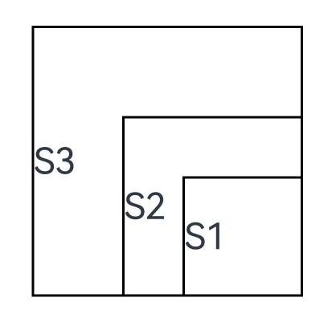

# Custom Component Layout

If you need to lay out child components in a custom component through calculation, you are advised to use the following APIs:

- [onMeasureSize](../reference/apis-arkui/arkui-ts/ts-custom-component-layout.md#onmeasuresize10): invoked upon layout to measure the size of the component's child components. It is executed before **onPlaceChildren**.

- [onPlaceChildren](../reference/apis-arkui/arkui-ts/ts-custom-component-layout.md#onplacechildren10): invoked upon layout to set the start position of the component's child components.

**Example**

```
// xxx.ets
@Entry
@Component
struct Index {
  build() {
    Column() {
      CustomLayout({ builder: ColumnChildren })
    }
  }
}

// Pass multiple components in a builder as level-1 child components of the custom component (that is, container components for example, <Column>, are not included).
@Builder
function ColumnChildren() {
  ForEach([1, 2, 3], (index: number) => { // LazyForEach is not supported.
    Text('S' + index)
      .fontSize(30)
      .width(100)
      .height(100)
      .borderWidth(2)
      .offset({ x: 10, y: 20 })
  })
}

@Component
struct CustomLayout {
  @Builder
  doNothingBuilder() {
  };

  @BuilderParam builder: () => void = this.doNothingBuilder;
  @State startSize: number = 100;
  result: SizeResult = {
    width: 0,
    height: 0
  };

  // Step 1: Calculate the size of each child component.
  onMeasureSize(selfLayoutInfo: GeometryInfo, children: Array<Measurable>, constraint: ConstraintSizeOptions) {
    let size = 100;
    children.forEach((child) => {
      let result: MeasureResult = child.measure({ minHeight: size, minWidth: size, maxWidth: size, maxHeight: size })
      size += result.width / 2;
    })
    this.result.width = 100;
    this.result.height = 400;
    return this.result;
  }
  // Step 2: Place the child components.
  onPlaceChildren(selfLayoutInfo: GeometryInfo, children: Array<Layoutable>, constraint: ConstraintSizeOptions) {
    let startPos = 300;
    children.forEach((child) => {
      let pos = startPos - child.measureResult.height;
      child.layout({ x: pos, y: pos })
    })
  }

  build() {
    this.builder()
  }
}
```



In the preceding example, the **Index** page contains a custom component that implements a custom layout and whose child components are passed in a builder on the **Index** page.

**onMeasureSize** and **onPlaceChildren** are called in the custom component to set the size and position of its child components. In **onMeasureSize**, the initial size is set at 100, and the size of each child component is increased by half of the size of the previous child component, leading to component size increment. In **onPlaceChildren**, **startPos** is **300**, the position of each child component is **startPos** minus its own height, and the lower right corner of all child components is at the corner point (300,300). In this way, child components are stacked, starting from the lower right corner.
