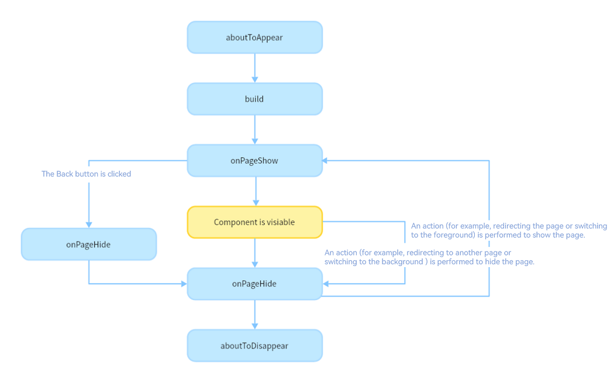

# Page and Custom Component Lifecycle


Before we dive into the page and custom component lifecycle, it would be helpful to learn the relationship between custom components and pages.


- Custom component: \@Component decorated UI unit, which can combine multiple built-in components for component reusability and invoke component lifecycle callbacks.

- Page: UI page of an application. A page can consist of one or more custom components. A custom component decorated with @Entry is used as the default entry component of the page. Exactly one component can be decorated with \@Entry in a single source file. Only components decorated by \@Entry can call the lifecycle callbacks of a page.


The following lifecycle callbacks are provided for a page, that is, a custom component decorated with \@Entry:


- [onPageShow](../reference/apis-arkui/arkui-ts/ts-custom-component-lifecycle.md#onpageshow): Invoked each time the page is displayed, for example, during page redirection or when the application is switched to the foreground.

- [onPageHide](../reference/apis-arkui/arkui-ts/ts-custom-component-lifecycle.md#onpagehide): Invoked each time the page is hidden, for example, during page redirection or when the application is switched to the background.

- [onBackPress](../reference/apis-arkui/arkui-ts/ts-custom-component-lifecycle.md#onbackpress): Invoked when the user clicks the **Back** button.


The following lifecycle callbacks are provided for a custom component decorated with \@Component:


- [aboutToAppear](../reference/apis-arkui/arkui-ts/ts-custom-component-lifecycle.md#abouttoappear): Invoked when the custom component is about to appear. Specifically, it is invoked after a new instance of the custom component is created and before its **build** function is executed.

- [onDidBuild](../reference/apis-arkui/arkui-ts/ts-custom-component-lifecycle.md#ondidbuild12): This API is called back after **build()** of the component is executed. In this phase, you can report tracking data without affecting the actual UI functions. Do not change state variables or use functions (such as **animateTo**) in **onDidBuild**. Otherwise, unstable UI performance may result.

- [aboutToDisappear](../reference/apis-arkui/arkui-ts/ts-custom-component-lifecycle.md#abouttodisappear): Invoked when the custom component is about to be destroyed. Do not change state variables in the **aboutToDisappear** function as doing this can cause unexpected errors. For example, the modification of the **@Link** decorated variable may cause unstable application running.


The following figure shows the lifecycle of a component (page) decorated with \@Entry.





Based on the preceding figure, let's look into the creation, re-rendering, and deletion of a custom component.


## Custom Component Creation and Rendering

1. Custom component creation: An instance of a custom component is created by the ArkUI framework.

2. Initialization of custom component member variables: The member variables are initialized with locally defined defaults or component constructor parameters. The initialization happens in the document order, which is the order in which the member variables are defined.

3. If defined, the component's **aboutToAppear** callback is invoked.

4. On initial render, the **build** function of the built-in component is executed for rendering. If the child component is a custom component, the rendering creates an instance of the child component. During initial render, the framework records the mapping between state variables and components. When a state variable changes, the framework drives the related components to update.

5. If defined, the component's **onDidBuild** callback is invoked.


## Custom Component Re-rendering

Re-rending of a custom component is triggered when its state variable is changed by an event handle (for example, when the click event is triggered) or by an update to the associated attribute in LocalStorage or AppStorage.


1. The framework observes the state variable change and marks the component for re-rendering.

2. Using the mapping tables – created in step 4 of the [custom component creation and rendering process](#custom-component-creation-and-rendering), the framework knows which UI components are managed by the state variable and which update functions are used for these UI components. With this knowledge, the framework executes only the update functions of these UI components.


## Custom Component Deletion

A custom component is deleted when the branch of the **if** statement or the number of arrays in **ForEach** changes.


1. Before the component is deleted, the **aboutToDisappear** callback is invoked to mark the component for deletion. The component deletion mechanism of ArkUI is as follows:<br>(1) The backend component is directly removed from the component tree and destroyed.<br>(2) The reference to the destroyed component is released from the frontend components.<br>(3) The JS Engine garbage collects the destroyed component.

2. The custom component and all its variables are deleted. Any variables linked to this component, such as [@Link](arkts-link.md), [@Prop](arkts-prop.md), or [@StorageLink](arkts-appstorage.md#storagelink) decorated variables, are unregistered from their [synchronization sources](arkts-state-management-overview.md#basic-concepts).


Use of **async await** is not recommended inside the **aboutToDisappear** callback. In case of an asynchronous operation (a promise or a callback) being started from the **aboutToDisappear** callback, the custom component will remain in the Promise closure until the function is executed, which prevents the component from being garbage collected.


The following example shows when the lifecycle callbacks are invoked:

```ts
// Index.ets
import { router } from '@kit.ArkUI';

@Entry
@Component
struct MyComponent {
  @State showChild: boolean = true;
  @State btnColor: string = "#FF007DFF";

  // Only components decorated by @Entry can call the lifecycle callbacks of a page.
  onPageShow() {
    console.info('Index onPageShow');
  }

  // Only components decorated by @Entry can call the lifecycle callbacks of a page.
  onPageHide() {
    console.info('Index onPageHide');
  }

  // Only components decorated by @Entry can call the lifecycle callbacks of a page.
  onBackPress() {
    console.info('Index onBackPress');
    this.btnColor = "#FFEE0606";
    return true // The value true means that the page executes its own return logic, and false means that the default return logic is used.
  }

  // Component lifecycle
  aboutToAppear() {
    console.info('MyComponent aboutToAppear');
  }

  // Component lifecycle
  onDidBuild() {
    console.info('MyComponent onDidBuild');
  }

  // Component lifecycle
  aboutToDisappear() {
    console.info('MyComponent aboutToDisappear');
  }

  build() {
    Column() {
      // When this.showChild is true, create the Child child component and invoke Child aboutToAppear.
      if (this.showChild) {
        Child()
      }
      Button('delete Child')
        .margin(20)
        .backgroundColor(this.btnColor)
        .onClick(() => {
        // When this.showChild is false, delete the Child child component and invoke Child aboutToDisappear.
        this.showChild = false;
      })
      // Push to Page and execute onPageHide.
      Button('push to next page')
        .onClick(() => {
          router.pushUrl({ url: 'pages/Page' });
        })
    }
  }
}

@Component
struct Child {
  @State title: string = 'Hello World';
  // Component lifecycle
  aboutToDisappear() {
    console.info('[lifeCycle] Child aboutToDisappear');
  }

  // Component lifecycle
  onDidBuild() {
    console.info('[lifeCycle] Child onDidBuild');
  }

  // Component lifecycle
  aboutToAppear() {
    console.info('[lifeCycle] Child aboutToAppear');
  }

  build() {
    Text(this.title)
      .fontSize(50)
      .margin(20)
      .onClick(() => {
        this.title = 'Hello ArkUI';
      })
  }
}
```
```ts
// Page.ets
@Entry
@Component
struct Page {
  @State textColor: Color = Color.Black;
  @State num: number = 0;

  // Only components decorated by @Entry can call the lifecycle callbacks of a page.
  onPageShow() {
    this.num = 5;
  }

  // Only components decorated by @Entry can call the lifecycle callbacks of a page.
  onPageHide() {
    console.log("Page onPageHide");
  }

  // Only components decorated by @Entry can call the lifecycle callbacks of a page.
  onBackPress() { // If the value is not set, false is used.
    this.textColor = Color.Grey;
    this.num = 0;
  }

  // Component lifecycle
  aboutToAppear() {
    this.textColor = Color.Blue;
  }

  build() {
    Column() {
      Text (`num: ${this.num}`)
        .fontSize(30)
        .fontWeight(FontWeight.Bold)
        .fontColor(this.textColor)
        .margin(20)
        .onClick(() => {
          this.num += 5;
        })
    }
    .width('100%')
  }
}
```

In the preceding example, the **Index** page contains two custom components. One is **MyComponent** decorated with \@Entry, which is also the entry component (root node) of the page. The other is **Child**, which is a child component of **MyComponent**. Only components decorated by \@Entry can call the page lifecycle callbacks. Therefore, the lifecycle callbacks of the **Index** page – **onPageShow**, **onPageHide**, and **onBackPress**, are declared in **MyComponent**. In **MyComponent** and its child components, component lifecycle callbacks – **aboutToAppear**, **onDidBuild**, and **aboutToDisappear** – are also declared.


- The initialization process of application cold start is as follows: **MyComponent aboutToAppear** -> **MyComponent build** -> **MyComponent onDidBuild** -> **Child aboutToAppear** -> **Child build** -> **Child onDidBuild** -> **Index onPageShow**

- When **delete Child** is clicked, the value of **this.showChild** linked to **if** changes to **false**. As a result, the **Child** component is deleted, and the **Child aboutToDisappear** callback is invoked.


- When **push to next page** is clicked, the **router.pushUrl** API is called to jump to the next page. As a result, the **Index** page is hidden, and the **Index onPageHide** callback is invoked. As the called API is **router.pushUrl**, which results in the Index page being hidden, but not destroyed, only the **onPageHide** callback is invoked. After a new page is displayed, the process of initializing the lifecycle of the new page is executed.

- If **router.replaceUrl** is called, the current index page is destroyed. As mentioned above, the component destruction is to detach the subtree from the component tree. Therefore, the executed lifecycle process is changed to the initialization lifecycle process of the new page and then execute **Index onPageHide** -> **MyComponent aboutToDisappear** -> **Child aboutToDisappear**.

- When the **Back** button is clicked, the **Index onBackPress** callback is invoked, and the current **Index** page is destroyed.

- When the application is minimized or switched to the background, the **Index onPageHide** callback is invoked. As the current **Index** page is not destroyed, **aboutToDisappear** of the component is not executed. When the application returns to the foreground, the **Index onPageShow** callback is invoked.


- When the application exits, the following callbacks are executed in order: **Index onPageHide** -> **MyComponent aboutToDisappear** -> **Child aboutToDisappear**.

## Custom Component's Listening for Page Changes

You can use the listener API in [Observer](../reference/apis-arkui/js-apis-arkui-observer.md#observeronrouterpageupdate11) to listen for page changes in custom components.

```ts
// Index.ets
import { uiObserver, router, UIObserver } from '@kit.ArkUI';

@Entry
@Component
struct Index {
  listener: (info: uiObserver.RouterPageInfo) => void = (info: uiObserver.RouterPageInfo) => {
    let routerInfo: uiObserver.RouterPageInfo | undefined = this.queryRouterPageInfo();
    if (info.pageId == routerInfo?.pageId) {
      if (info.state == uiObserver.RouterPageState.ON_PAGE_SHOW) {
        console.log(`Index onPageShow`);
      } else if (info.state == uiObserver.RouterPageState.ON_PAGE_HIDE) {
        console.log(`Index onPageHide`);
      }
    }
  }
  aboutToAppear(): void {
    let uiObserver: UIObserver = this.getUIContext().getUIObserver();
    uiObserver.on('routerPageUpdate', this.listener);
  }
  aboutToDisappear(): void {
    let uiObserver: UIObserver = this.getUIContext().getUIObserver();
    uiObserver.off('routerPageUpdate', this.listener);
  }
  build() {
    Column() {
      Text(`this page is ${this.queryRouterPageInfo()?.pageId}`)
        .fontSize(25)
      Button("push self")
        .onClick(() => {
          router.pushUrl({
            url: 'pages/Index'
          })
        })
      Column() {
        SubComponent()
      }
    }
  }
}
@Component
struct SubComponent {
  listener: (info: uiObserver.RouterPageInfo) => void = (info: uiObserver.RouterPageInfo) => {
    let routerInfo: uiObserver.RouterPageInfo | undefined = this.queryRouterPageInfo();
    if (info.pageId == routerInfo?.pageId) {
      if (info.state == uiObserver.RouterPageState.ON_PAGE_SHOW) {
        console.log(`SubComponent onPageShow`);
      } else if (info.state == uiObserver.RouterPageState.ON_PAGE_HIDE) {
        console.log(`SubComponent onPageHide`);
      }
    }
  }
  aboutToAppear(): void {
    let uiObserver: UIObserver = this.getUIContext().getUIObserver();
    uiObserver.on('routerPageUpdate', this.listener);
  }
  aboutToDisappear(): void {
    let uiObserver: UIObserver = this.getUIContext().getUIObserver();
    uiObserver.off('routerPageUpdate', this.listener);
  }
  build() {
    Column() {
      Text(`SubComponent`)
    }
  }
}
```
