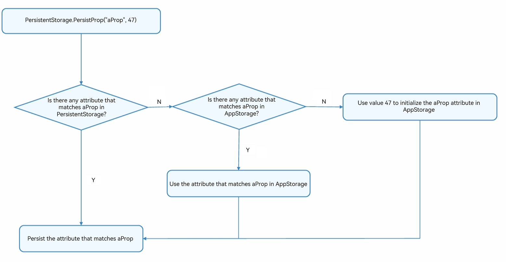

# PersistentStorage: Application State Persistence


During application development, you may want selected attributes to persist even when the application is closed. In this case, you'll need PersistentStorage.


PersistentStorage is an optional singleton object within an application. Its purpose is to persist selected AppStorage attributes so that their values are the same upon application re-start as they were when the application was closed.


## Overview

PersistentStorage retains the selected AppStorage attributes on the device disk. The application uses the API to determine which AppStorage attributes should be persisted with PersistentStorage. The UI and business logic do not directly access attributes in PersistentStorage. All attribute access is to AppStorage. Changes in AppStorage are automatically synchronized to PersistentStorage.

PersistentStorage creates a two-way synchronization with attributes in AppStorage. A frequently used API function is to access AppStorage through PersistentStorage. Additional API functions include managing persisted attributes. The business logic always obtains or sets attributes through AppStorage.


## Restrictions

Persistence of data is a relatively slow operation. Applications should avoid the following situations:

- Persistence of large data sets

- Persistence of variables that change frequently

The preceding situations may overload the change process of persisted data. As a result, the PersistentStorage implementation may limit the change frequency of persisted attributes.

PersistentStorage can be called to persist data only when used in UI pages.

## Application Scenarios


### Accessing PersistentStorage Initialized Attribute from AppStorage

1. Initialize the PersistentStorage instance.

   ```ts
   PersistentStorage.PersistProp('aProp', 47);
   ```

2. Obtain the corresponding attribute from AppStorage.

   ```ts
   AppStorage.Get('aProp'); // returns 47
   ```

   Alternatively, apply local definition within the component:


   ```ts
   @StorageLink('aProp') aProp: number = 48;
   ```

The complete code is as follows:


```ts
PersistentStorage.PersistProp('aProp', 47);

@Entry
@Component
struct Index {
  @State message: string = 'Hello World'
  @StorageLink('aProp') aProp: number = 48

  build() {
    Row() {
      Column() {
        Text(this.message)
        // The current result is saved when the application exits. After the restart, the last saved result is displayed.
        Text(`${this.aProp}`)
          .onClick(() => {
            this.aProp += 1;
          })
      }
    }
  }
}
```

- First running after fresh application installation:
  1. **PersistProp** is called to initialize PersistentStorage. A search for the **aProp** attribute on the PersistentStorage disk returns no result, because the application has just been installed.  
  2. A search for the attribute **aProp** in AppStorage still returns no result.
  3. Create the **aProp** attribute of the number type in AppStorge and initialize it with the value 47.
  4. PersistentStorage writes the **aProp** attribute and its value **47** to the disk. The value of **aProp** in AppStorage and its subsequent changes are persisted.
  5. Create the state variable **\@StorageLink('aProp') aProp** in the **\<Index>** component, which creates a two-way synchronization with the **aProp** attribute in AppStorage. During the creation, the search in AppStorage for the **aProp** attribute succeeds, and therefore, the state variable is initialized with the value **47** found in AppStorage.

  **Figure 1** PersistProp initialization process 



- After a click event is triggered:
  1. The state variable **\@StorageLink('aProp') aProp** is updated, triggering the **\<Text>** component to be re-rendered.
  2. The two-way synchronization between the \@StorageLink decorated variable and AppStorage results in the change of the **\@StorageLink('aProp') aProp** being synchronized back to AppStorage.
  3. The change of the **aProp** attribute in AppStorage triggers any other one-way or two-way bound variables to be updated. (In this example, there are no such other variables.)
  4. Because the attribute corresponding to **aProp** has been persisted, the change of the **aProp** attribute in AppStorage triggers PersistentStorage to write the attribute and its changed value to the device disk.

- Subsequent application running:
  1. **PersistentStorage.PersistProp('aProp', 47)** is called. A search for the **aProp** attribute on the PersistentStorage disk succeeds.
  2. The attribute is added to AppStorage with the value found on the PersistentStorage disk.
  3. In the **\<Index>** component, the value of the @StorageLink decorated **aProp** attribute is the value written by PersistentStorage to AppStorage, that is, the value stored when the application was closed last time.


### Accessing Attribute in AppStorage Before PersistentStorage

This example is an incorrect use. It is incorrect to use the API to access the attributes in AppStorage before calling **PersistentStorage.PersistProp** or **PersistProps**, because such a call sequence will result in loss of the attribute values used in the previous application run:


```ts
let aProp = AppStorage.SetOrCreate('aProp', 47);
PersistentStorage.PersistProp('aProp', 48);
```

**AppStorage.SetOrCreate('aProp', 47)**: The **aProp** attribute is created in AppStorage, its type is number, and its value is set to the specified default value **47**. **aProp** is a persisted attribute. Therefore, it is written back to the PersistentStorage disk, and the value stored in the PersistentStorage disk from the previous run is lost.

**PersistentStorage.PersistProp('aProp', 48)**: An attribute with same name **aProp** is available in PersistentStorage.
