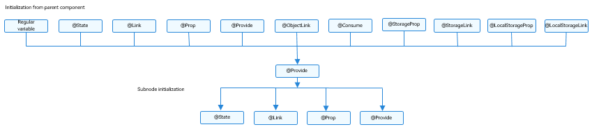

# \@Provide and \@Consume Decorators: Two-Way Synchronization with Descendant Components


\@Provide and \@Consume are used for two-way data synchronization with descendant components when state data needs to be transferred between multiple levels. They do not involve passing a variable from component to component multiple times.


An \@Provide decorated state variable exists in the ancestor component and is said to be "provided" to descendent components. An \@Consume decorated state variable is used in a descendent component. It is linked to ("consumes") the provided state variable in its ancestor component.


> **NOTE**
>
> These two decorators can be used in ArkTS widgets since API version 9.
>
> These two decorators can be used in atomic services since API version 11.

## Overview

\@Provide/\@Consume decorated state variables have the following features:

- An \@Provide decorated state variable becomes available to all descendent components of the providing component automatically. The variable is said to be "provided" to other components. This means that you do not need to pass a variable from component to component multiple times.

- A descendent component gains access to the provided state variable by decorating a variable with \@Consume. This establishes a two-way data synchronization between the provided and the consumed variable. This synchronization works in the same manner as a combination of \@State and \@Link does. The only difference is that the former allows transfer across multiple levels of the UI parent-child hierarchy.

- \@Provide and \@Consume can be bound using the same variable name or variable alias. Whenever possible, use the same variable types to prevent implicit type conversion and consequently application behavior exceptions.


```ts
// Binding through the same variable name
@Provide a: number = 0;
@Consume a: number;

// Binding through the same variable alias
@Provide('a') b: number = 0;
@Consume('a') c: number;
```


When \@Provide and \@Consume are bound through the same variable name or variable alias, the variables decorated by \@Provide and \@Consume are in a one-to-many relationship. A custom component, including its child components, should not contain multiple \@Provide decorated variables under the same name or alias. Otherwise, a runtime error will occur.


## Decorator Description

The rules of \@State also apply to \@Provide. The difference is that \@Provide also functions as a synchronization source for multi-layer descendants.

| \@Provide Decorator| Description                                      |
| -------------- | ---------------------------------------- |
| Decorator parameters         | Alias: constant string, optional.<br>If the alias is specified, the variable is provided under the alias name only. If the alias is not specified, the variable is provided under the variable name.|
| Synchronization type          | Two-way:<br>from the \@Provide decorated variable to all \@Consume decorated variables; and the other way around. The two-way synchronization behaviour is the same as that of the combination of \@State and \@Link.|
| Allowed variable types | Object, class, string, number, Boolean, enum, and array of these types.<br>Date type.<br>(Applicable to API version 11 or later) Map and Set types.<br>The union types defined by the ArkUI framework, including Length, ResourceStr, and ResourceColor.<br>The type must be specified.<br/>The type of the provided and the consumed variables must be the same.<br>For details about the scenarios of supported types, see [Observed Changes](#observed-changes).<br>**any** is not supported.<br>(Applicable to API version 11 and later versions) Union type of the preceding types, for example, **string \| number**, **string \| undefined** or **ClassA \| null**. For details, see [Support for Union Type](#support-for-union-type).<br>**NOTE**<br>When **undefined** or **null** is used, you are advised to explicitly specify the type to pass the TypeScript type check. For example, **@Provide a: string \| undefined = undefined** is recommended; **@Provide a: string = undefined** is not recommended. |
| Initial value for the decorated variable | Mandatory. |
| Support for the **allowOverride** parameter | Yes. After **allowOverride** is declared, both aliases and attribute names can be overridden. For details, see [Support for the allowOverride Parameter](#support-for-the-allowoverride-parameter). |


| \@Consume Decorator| Description                                      |
| -------------- | ---------------------------------------- |
| Decorator parameters         | Alias: constant string, optional.<br>If the alias is specified, the alias name is used for matching with the \@Provide decorated variable. Otherwise, the variable name is used.|
| Synchronization type          | Two-way: from the \@Provide decorated variable to all \@Consume decorated variables; and the other way around. The two-way synchronization behaviour is the same as that of the combination of \@State and \@Link.|
| Allowed variable types | Object, class, string, number, Boolean, enum, and array of these types.<br>Date type.<br>The union types defined by the ArkUI framework, including Length, ResourceStr, and ResourceColor.<br/>The type must be specified.<br/>The type of the provided and the consumed variables must be the same.<br>An \@Consume decorated variable must have a matching \@Provide decorated variable with the corresponding attribute and alias on its parent or ancestor component.<br>For details about the scenarios of supported types, see [Observed Changes](#observed-changes).<br>**any** is not supported.<br>(Applicable to API version 11 and later versions) Union type of the preceding types, for example, **string \| number**, **string \| undefined** or **ClassA \| null**. For details, see [Support for Union Type](#support-for-union-type).<br>**NOTE**<br>When **undefined** or **null** is used, you are advised to explicitly specify the type to pass the TypeScript type check. For example, **@Consume a: string \| undefined**. |
| Initial value for the decorated variable | Initialization of the decorated variables is forbidden. |

## Variable Transfer/Access Rules


| \@Provide Transfer/Access| Description                                      |
| -------------- | ---------------------------------------- |
| Initialization and update from the parent component    | Optional. An @Provide decorated variable can be initialized from a regular variable (whose change does not trigger UI refresh) or an [\@State](./arkts-state.md), [\@Link](./arkts-link.md), [\@Prop](./arkts-prop.md), \@Provide, \@Consume, [\@ObjectLink](./arkts-observed-and-objectlink.md), [\@StorageLink](./arkts-appstorage.md#storagelink), [\@StorageProp](./arkts-appstorage.md#storageprop), [\@LocalStorageLink](./arkts-localstorage.md#localstoragelink), or [\@LocalStorageProp](./arkts-localstorage.md#localstorageprop) decorated variable in its parent component.|
| Subnode initialization      | Supported; can be used to initialize an \@State, \@Link, \@Prop, or \@Provide decorated variable in the child component.|
| Synchronization with the parent component        | Not supported.                                      |
| Synchronization with descendant components       | Two-way with @Consume decorated variables in descendant components.                         |
| Access     | Private, accessible only within the component.                         |


  **Figure 1** \@Provide initialization rule 





| \@Consume Transfer/Access| Description                                      |
| -------------- | ---------------------------------------- |
| Initialization and update from the parent component    | Forbidden. Initialized from the \@Provide decorated variable with the same name or alias.     |
| Subnode initialization      | Supported; can be used to initialize an \@State, \@Link, \@Prop, or \@Provide decorated variable in the child component.|
| Synchronization with the ancestor component       | Two-way with the @Provide decorated variable in the ancestor component.                         |
| Access     | Private, accessible only within the component.                          |


  **Figure 2** \@Consume initialization rule 


## Observed Changes and Behavior


### Observed Changes

- When the decorated variable is of the Boolean, string, or number type, its value change can be observed.

- When the decorated variable is of the class or Object type, its value change and value changes of all its attributes, that is, the attributes that **Object.keys(observedObject)** returns, can be observed.

- When the decorated variable is of the array type, the addition, deletion, and updates of array items can be observed.

- When the decorated variable is of the Date type, the overall value assignment of the Date object can be observed, and the following APIs can be called to update Date attributes: **setFullYear**, **setMonth**, **setDate**, **setHours**, **setMinutes**, **setSeconds**, **setMilliseconds**, **setTime**, **setUTCFullYear**, **setUTCMonth**, **setUTCDate**, **setUTCHours**, **setUTCMinutes**, **setUTCSeconds**, and **setUTCMilliseconds**.

```ts
@Component
struct CompD {
  @Consume selectedDate: Date;

  build() {
    Column() {
      Button(`child increase the day by 1`)
        .onClick(() => {
          this.selectedDate.setDate(this.selectedDate.getDate() + 1)
        })
      Button('child update the new date')
        .margin(10)
        .onClick(() => {
          this.selectedDate = new Date('2023-09-09')
        })
      DatePicker({
        start: new Date('1970-1-1'),
        end: new Date('2100-1-1'),
        selected: this.selectedDate
      })
    }
  }
}

@Entry
@Component
struct CompA {
  @Provide selectedDate: Date = new Date('2021-08-08')

  build() {
    Column() {
      Button('parent increase the day by 1')
        .margin(10)
        .onClick(() => {
          this.selectedDate.setDate(this.selectedDate.getDate() + 1)
        })
      Button('parent update the new date')
        .margin(10)
        .onClick(() => {
          this.selectedDate = new Date('2023-07-07')
        })
      DatePicker({
        start: new Date('1970-1-1'),
        end: new Date('2100-1-1'),
        selected: this.selectedDate
      })
      CompD()
    }
  }
}
```

- When the decorated variable is **Map**, value changes of **Map** can be observed. In addition, you can call the **set**, **clear**, and **delete** APIs of **Map** to update its value. For details, see [Decorating Variables of the Map Type](#decorating-variables-of-the-map-type).

- When the decorated variable is **Set**, value changes of **Set** can be observed. In addition, you can call the **add**, **clear**, and **delete** APIs of **Set** to update its value. For details, see [Decorating Variables of the Set Type](#decorating-variables-of-the-set-type).

### Framework Behavior

1. Initial render:
   1. The \@Provide decorated variable is passed to all child components of the owning component in map mode.
   2. If an \@Consume decorated variable is used in a child component, the system checks the map for a matching \@Provide decorated variable based on the variable name or alias. If no matching variable is found, the framework throws a JS error.
   3. The process of initializing the @Consume decorated variable is similar to that of initializing the @State/@Link decorated variable. The @Consume decorated variable saves the matching @Provide decorated variable found in the map and registers itself with the @Provide decorated variable.

2. When the \@Provide decorated variable is updated:
   1. The system traverses and updates all system components (**elementid**) and state variable (\@Consume) that depend on the \@Provide decorated variable, with which the \@Consume decorated variable has registered itself on initial render.  
   2. After the \@Consume decorated variable is updated in all owning child components, all system components (**elementId**) that depend on the \@Consume decorated variable are updated. In this way, changes to the \@Provide decorated variable are synchronized to the \@Consume decorated variable.

3. When the \@Consume decorated variable is updated:

   As can be learned from the initial render procedure, the \@Consume decorated variable holds an instance of \@Provide. After the \@Consume decorated variable is updated, the update method of \@Provide is called to synchronize the changes to \@Provide.


## Application Scenarios

The following example shows the two-way synchronization between \@Provide and \@Consume decorated variables. When the buttons in the **CompA** and **CompD** components are clicked, the changes to **reviewVotes** are synchronized to the **CompA** and **CompD** components.

```ts
@Component
struct CompD {
  // The @Consume decorated variable is bound to the @Provide decorated variable in its ancestor component CompA under the same attribute name.
  @Consume reviewVotes: number;

  build() {
    Column() {
      Text(`reviewVotes(${this.reviewVotes})`)
      Button(`reviewVotes(${this.reviewVotes}), give +1`)
        .onClick(() => this.reviewVotes += 1)
    }
    .width('50%')
  }
}

@Component
struct CompC {
  build() {
    Row({ space: 5 }) {
      CompD()
      CompD()
    }
  }
}

@Component
struct CompB {
  build() {
    CompC()
  }
}

@Entry
@Component
struct CompA {
  // @Provide decorated variable reviewVotes is provided by the entry component CompA.
  @Provide reviewVotes: number = 0;

  build() {
    Column() {
      Button(`reviewVotes(${this.reviewVotes}), give +1`)
        .onClick(() => this.reviewVotes += 1)
      CompB()
    }
  }
}
```

### Decorating Variables of the Map Type

> **NOTE**
>
> \@Provide and \@Consume support the Map type since API version 11.

In this example, the **message** variable is of the Map<number, string> type. After the button is clicked, the value of **message** changes, and the UI is re-rendered.

```ts
@Component
struct Child {
  @Consume message: Map<number, string>

  build() {
    Column() {
      ForEach(Array.from(this.message.entries()), (item: [number, string]) => {
        Text(`${item[0]}`).fontSize(30)
        Text(`${item[1]}`).fontSize(30)
        Divider()
      })
      Button('Consume init map').onClick(() => {
        this.message = new Map([[0, "a"], [1, "b"], [3, "c"]])
      })
      Button('Consume set new one').onClick(() => {
        this.message.set(4, "d")
      })
      Button('Consume clear').onClick(() => {
        this.message.clear()
      })
      Button('Consume replace the first item').onClick(() => {
        this.message.set(0, "aa")
      })
      Button('Consume delete the first item').onClick(() => {
        this.message.delete(0)
      })
    }
  }
}


@Entry
@Component
struct MapSample {
  @Provide message: Map<number, string> = new Map([[0, "a"], [1, "b"], [3, "c"]])

  build() {
    Row() {
      Column() {
        Button('Provide init map').onClick(() => {
          this.message = new Map([[0, "a"], [1, "b"], [3, "c"], [4, "d"]])
        })
        Child()
      }
      .width('100%')
    }
    .height('100%')
  }
}
```

### Decorating Variables of the Set Type

> **NOTE**
>
> \@Provide and \@Consume support the Set type since API version 11.

In this example, the **message** variable is of the Set\<number\> type. After the button is clicked, the value of **message** changes, and the UI is re-rendered.

```ts
@Component
struct Child {
  @Consume message: Set<number>

  build() {
    Column() {
      ForEach(Array.from(this.message.entries()), (item: [number, string]) => {
        Text(`${item[0]}`).fontSize(30)
        Divider()
      })
      Button('Consume init set').onClick(() => {
        this.message = new Set([0, 1, 2, 3, 4])
      })
      Button('Consume set new one').onClick(() => {
        this.message.add(5)
      })
      Button('Consume clear').onClick(() => {
        this.message.clear()
      })
      Button('Consume delete the first one').onClick(() => {
        this.message.delete(0)
      })
    }
    .width('100%')
  }
}


@Entry
@Component
struct SetSample {
  @Provide message: Set<number> = new Set([0, 1, 2, 3, 4])

  build() {
    Row() {
      Column() {
        Button('Provide init set').onClick(() => {
          this.message = new Set([0, 1, 2, 3, 4, 5])
        })
        Child()
      }
      .width('100%')
    }
    .height('100%')
  }
}
```

### Support for Union Type

@Provide and @Consume support **undefined**, **null**, and union types. In the following example, the type of **count** is string | undefined. If the attribute or type of **count** is changed when the button in the **Parent** component is clicked, the change will be synced to the child component.

```ts
@Component
struct Child {
  // The @Consume decorated variable is bound to the @Provide decorated variable in its ancestor component Ancestors under the same attribute name.
  @Consume count: string | undefined;

  build() {
    Column() {
      Text(`count(${this.count})`)
      Button(`count(${this.count}), Child`)
        .onClick(() => this.count = 'Ancestors')
    }
    .width('50%')
  }
}

@Component
struct Parent {
  build() {
    Row({ space: 5 }) {
      Child()
    }
  }
}

@Entry
@Component
struct Ancestors {
  // The @Provide decorated variable count of the union type is provided by the entry component Ancestors for its descendant components.
  @Provide count: string | undefined = 'Child';

  build() {
    Column() {
      Button(`count(${this.count}), Child`)
        .onClick(() => this.count = undefined)
      Parent()
    }
  }
}
```

### Support for the allowOverride Parameter

**allowOverride** allows you to override an existing \@Provide decorated variable.

> **NOTE**
>
> This API is supported since API version 11.

| Name  | Type  | Mandatory| Description                                                        |
| ------ | ------ | ---- | ------------------------------------------------------------ |
| allowOverride | string | No| Enables overriding for \@Provide. When you define an \@Provide decorated variable, use this parameter to override the existing variable with the same name (if any) in the same component tree. If this parameter is not used, defining a variable whose name is already in use will return an error.|

```ts
@Component
struct MyComponent {
  @Provide({allowOverride : "reviewVotes"}) reviewVotes: number = 10;
}
```

```ts
@Component
struct GrandSon {
  // The @Consume decorated variable is bound to the @Provide decorated variable in its ancestor component under the same attribute name.
  @Consume("reviewVotes") reviewVotes: number;

  build() {
    Column() {
      Text(`reviewVotes(${this.reviewVotes})`) // The Text component displays 10.
      Button(`reviewVotes(${this.reviewVotes}), give +1`)
        .onClick(() => this.reviewVotes += 1)
    }
    .width('50%')
  }
}

@Component
struct Child {
  @Provide({ allowOverride: "reviewVotes" }) reviewVotes: number = 10;

  build() {
    Row({ space: 5 }) {
      GrandSon()
    }
  }
}

@Component
struct Parent {
  @Provide({ allowOverride: "reviewVotes" }) reviewVotes: number = 20;

  build() {
    Child()
  }
}

@Entry
@Component
struct GrandParent {
  @Provide("reviewVotes") reviewVotes: number = 40;

  build() {
    Column() {
      Button(`reviewVotes(${this.reviewVotes}), give +1`)
        .onClick(() => this.reviewVotes += 1)
      Parent()
    }
  }
}
```

In the preceding example:
- The **@Provide("reviewVotes") reviewVotes: number = 40** variable is declared in **GrandParent**.
- In **Parent**, a child component of **GrandParent**, **allowOverride** is declared for **@Provide** to override the **@Provide("reviewVotes") reviewVotes: number = 40** variable of **GrandParent**. If **allowOverride** is not declared, a runtime error is thrown to indicate that the @Provide decorated variable is already in use. The same case applies to **Child**.
- The @Consume decorated variable of **GrandSon** is initialized from the @Provide decorated variable of its nearest ancestor under the same attribute name.
- In this example, **GrandSon** finds in the ancestor **Child** the @Provide decorated variable with the same attribute name. Therefore, the initial value of **@Consume("reviewVotes") reviewVotes: number** is **10**. If an @Provide decorated variable with the same attribute name is not defined in **Child**, **GrandSon** continues its search until it finds the one with the same attribute name.
- If no such a variable is found when **GrandSon** has reached the root node, an error is thrown to indicate that @Provide could not be found for @Consume initialization.


## FAQs

### \@Provide Not Defined Error in the Case of a \@BuilderParam Trailing Closure

In the following example, when **CustomWidget** executes **this.builder()** to create the child component **CustomWidgetChild**, **this** points to **HomePage**. As such, the \@Provide decorated variable of **CustomWidget** cannot be found, and an error is thrown. In light of this, exercise caution with **this** when using \@BuilderParam.

Negative example:

```ts
class Tmp {
  a: string = ''
}

@Entry
@Component
struct HomePage {
  @Builder
  builder2($$: Tmp) {
    Text(`${$$.a}test`)
  }

  build() {
    Column() {
      CustomWidget() {
        CustomWidgetChild({ builder: this.builder2 })
      }
    }
  }
}

@Component
struct CustomWidget {
  @Provide('a') a: string = 'abc';
  @BuilderParam
  builder: () => void;

  build() {
    Column() {
      Button('Hello').onClick(() => {
        if (this.a == 'ddd') {
          this.a = 'abc';
        }
        else {
          this.a = 'ddd';
        }

      })
      this.builder()
    }
  }
}

@Component
struct CustomWidgetChild {
  @Consume('a') a: string;
  @BuilderParam
  builder: ($$: Tmp) => void;

  build() {
    Column() {
      this.builder({ a: this.a })
    }
  }
}
```

Positive example:

```ts
class Tmp {
  name: string = ''
}

@Entry
@Component
struct HomePage {
  @Provide('name') name: string = 'abc';

  @Builder
  builder2($$: Tmp) {
    Text (`${$$.name}test`)
  }

  build() {
    Column() {
      Button('Hello').onClick(() => {
        if (this.name == 'ddd') {
          this.name = 'abc';
        } else {
          this.name = 'ddd';
        }
      })
      CustomWidget() {
        CustomWidgetChild({ builder: this.builder2 })
      }
    }
  }
}

@Component
struct CustomWidget {
  @BuilderParam
  builder: () => void;

  build() {
    this.builder()
  }
}

@Component
struct CustomWidgetChild {
  @Consume('name') name: string;
  @BuilderParam
  builder: ($$: Tmp) => void;

  build() {
    Column() {
      this.builder({ name: this.name })
    }
  }
}
```
