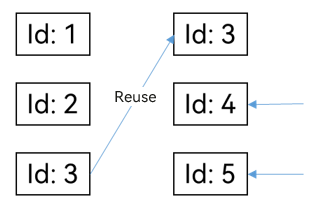

# Best Practices for Rendering Control


This guide outlines best practices for rendering control in ArkUI applications. Read on to discover the common pitfalls in state management and how to avoid them, with carefully selected examples of recommended and not-recommended practices.


## Adding Elements to the ForEach Data Source

Adding elements to the ForEach data source causes duplicate array item IDs.


### Not Recommended

  The following example uses ForEach to iterate through each element of the **this.arr** array, displays the elements in the **\<Text>** component, and adds a new array element when **Text('Add arr element')** is clicked.
  
```ts
@Entry
@Component
struct Index {
  @State arr: number[] = [1,2,3];

  build() {
      Column() {
       ForEach(this.arr,
         (item: void) => {
           Text(`Item ${item}`)
         },
         (item: string) => item.toString())
       Text('Add arr element')
         .fontSize(20)
         .onClick(()=>{
           this.arr.push(4); // New element in the array, whose key is '4' in ForEach.
           console.log("Arr elements: ", this.arr);
         })
      }
    }
}
```

When **Text('Add arr element')** is clicked twice, a new element with the key of **4** is added to the **this.arr** array each time. The third parameter **(item)=&gt; item.toString()** in ForEach is a key generator function. It needs to generate an ID for each item in the array. This ID must be unique and stable. Specifically:

- The ID of each array item generated by the key generator function must be unique.

- When an array item ID changes, the ArkUI framework regards the array item as having been replaced or changed.

- The ArkUI framework generates alarms for duplicate IDs. In this case, the framework behavior is unknown, and the UI update in particular may not work.

Therefore, in the preceding example, the framework does not display the text element added at the second and later attempts. This is because the element is not unique, with the same key (4) as the other elements. If **(item) =&gt; item.toString()** of ForEach is deleted, the framework will use the default array ID generator function, that is, **(item: any, index: number) =&gt; '${index}__${JSON.stringify(item)}'**. In this case, each newly added text element is updated after the **onClick** event is triggered. Though the default array ID generator function has better compatibility, it may cause unnecessary UI updates. Therefore, a custom key generator function is recommended.


## Updating the ForEach Data Source

When the ForEach data source is updated, the array item whose ID is the same as the original array item ID is not re-created.


### Not Recommended

The following example defines the **Index** and **Child** components. The parent component **Index** has member variables of the **arr** array. The initial values include numbers 1, 2, and 3. In the **Child** component, the \@Prop decorated variable **value** is defined to receive an element in the **arr** array in the parent component.

  
```ts
@Component
struct Child {
  @Prop value: number = 0;
  build() {
    Text(`${this.value}`)
      .fontSize(50)
      .onClick(() => {
        this.value++ // Click to change the value of @Prop.
      })
  }
}
@Entry
@Component
struct Index {
  @State arr: number[] = [1, 2, 3];
  build() {
    Row() {
      Column() {
        // Control group
        Child({ value: this.arr[0] })
        Child({ value: this.arr[1] })
        Child({ value: this.arr[2] })
        Divider().height(5)
        ForEach(this.arr,
          (item: number) => {
            Child({ value: item })
          },
          (item: string) => item.toString() // Key value and ID
        )
        Text('Parent: replace entire arr')
          .fontSize(50)
          .onClick(() => {
            // Both array items contain '3', and the ID in ForEach does not change.
            // This means that ForEach does not update the Child instance, and @Prop is not updated in the parent component.
            this.arr = (this.arr[0] == 1) ? [3, 4, 5] : [1, 2, 3];
          })
      }
    }
  }
}
```

When the **onClick** event of the **\<Text>** component **Parent: replace entire arr** is triggered, the state variable array **arr** is replaced with [3, 4, 5] or [1, 2, 3] based on the value of the first element. The **Child** component initially created in ForEach, whose \@Prop decorated variable's received value is 3, however, is not updated.

This is because both the original and new arrays contain an element with the same value (number 3), and the ID generated for the element does not change in the parent component. As a result, ForEach does not identify the need for value changes in the **Child** component, and \@Prop in the component is not updated.



You can replace the duplicate element with a unique element in **arr** and observe the behavior, which should be as expected.
