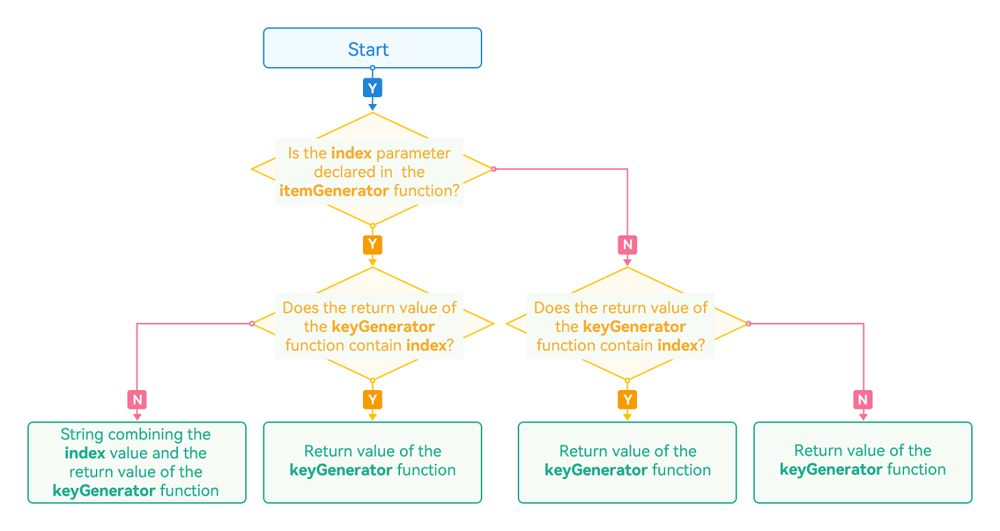
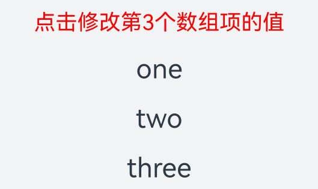

# ForEach: Rendering Repeated Content

**ForEach** enables rendering of repeated content based on array type data. It must be used in a container component, and the component it returns must be one allowed inside the container component. For example, for rendering of list items, **ForEach** must be used in the [List](../reference/apis-arkui/arkui-ts/ts-container-list.md) component.

For details about API parameters, see [ForEach](https://gitee.com/openharmony/docs/blob/master/en/application-dev/reference/apis-arkui/arkui-ts/ts-rendering-control-foreach.md) APIs.

> **NOTE**
>
> This API is supported in ArkTS widgets since API version 9.

## Key Generation Rules

During **ForEach** rendering, the system generates a unique, persistent key for each array item to identify the corresponding component. When the key changes, the ArkUI framework considers that the array element has been replaced or modified and creates a component based on the new key.

**ForEach** provides a parameter named **keyGenerator**, which is in effect a function through which you can customize key generation rules. If no **keyGenerator** function is defined, the ArkUI framework uses the default key generator, that is, **(item: Object, index: number) => { return index + '__' + JSON.stringify(item); }**.

The ArkUI framework has a set of specific judgment rules for **ForEach** key generation, which are mainly associated with the second parameter **index** of the **itemGenerator** function and the second parameter **index** of the **keyGenerator** function. The following figure shows the logic of the key generation rules.

**Figure 1** ForEach key generation rules 


> **NOTE**
>
> The ArkUI framework warns of duplicate keys. If duplicate keys exist during UI re-rendering, the framework may not work properly. For details, see [Rendering Result Not as Expected](#rendering-result-not-as-expected).

## Component Creation Rules

After the key generation rules are determined, the **itemGenerator** function – the second parameter in **ForEach** – creates a component for each array item of the data source based on the rules. There are two cases for creating a component: [initial rendering](#initial-rendering) and [non-initial rendering](#non-initial-rendering).

### Initial Rendering

When used for initial rendering, **ForEach** generates a unique key for each array item of the data source based on the key generation rules, and creates a component.

```ts
@Entry
@Component
struct Parent {
  @State simpleList: Array<string> = ['one', 'two', 'three'];

  build() {
    Row() {
      Column() {
        ForEach(this.simpleList, (item: string) => {
          ChildItem({ item: item })
        }, (item: string) => item)
      }
      .width('100%')
      .height('100%')
    }
    .height('100%')
    .backgroundColor(0xF1F3F5)
  }
}

@Component
struct ChildItem {
  @Prop item: string;

  build() {
    Text(this.item)
      .fontSize(50)
  }
}
```

The figure below shows the effect.

**Figure 2** Initial rendering when the ForEach data sources do not have the same key 


In the preceding code snippets, the key generation rule is the return value **item** of the **keyGenerator** function. During **ForEach** rendering, keys (**one**, **two**, and **three**) are generated in sequence for data source array items, and corresponding child items are created and rendered to the UI.

When the keys generated for different data items are the same, the behavior of the framework is unpredictable. For example, in the following code, when data items with the same key **two** are rendered by **ForEach**, only one **ChildItem** component, instead of multiple components with the same key, is created.

 ```ts
 @Entry
 @Component
 struct Parent {
   @State simpleList: Array<string> = ['one', 'two', 'two', 'three'];
 
   build() {
     Row() {
       Column() {
         ForEach(this.simpleList, (item: string) => {
           ChildItem({ item: item })
         }, (item: string) => item)
       }
       .width('100%')
       .height('100%')
     }
     .height('100%')
     .backgroundColor(0xF1F3F5)
   }
 }
 
 @Component
 struct ChildItem {
   @Prop item: string;
 
   build() {
     Text(this.item)
       .fontSize(50)
   }
 }
 ```

The figure below shows the effect.

**Figure 3** Initial rendering when the ForEach data sources have the same key 


In this example, the final key value generation rule is **item**. When **ForEach** traverses the data source **simpleList** and finds the key **two** whose index is **1**, **ForEach** creates a component whose key is **two** based on the final key value generation rule and marks the component. When **ForEach** finds the key **two** whose index is **2**, it does not create a component, because the key of the current item is also **two** according to the final key generation rule.

### Non-Initial Rendering

When **ForEach** is used for re-rendering (non-initial rendering), it checks whether the newly generated key already exists in the previous rendering. If the key does not exist, a new component is created. If the key exists, no new component is created; instead, the component corresponding to the key is re-rendered. For example, in the following code snippet, the value of the third item of the array is changed to **"new three"** through the click event, which triggers **ForEach** to perform re-rendering.

```ts
@Entry
@Component
struct Parent {
  @State simpleList: Array<string> = ['one', 'two', 'three'];

  build() {
    Row() {
      Column() {
        Text('Change Value of Third Array Item')
          .fontSize(24)
          .fontColor(Color.Red)
          .onClick(() => {
            this.simpleList[2] = 'new three';
          })

        ForEach(this.simpleList, (item: string) => {
          ChildItem({ item: item })
            .margin({ top: 20 })
        }, (item: string) => item)
      }
      .justifyContent(FlexAlign.Center)
      .width('100%')
      .height('100%')
    }
    .height('100%')
    .backgroundColor(0xF1F3F5)
  }
}

@Component
struct ChildItem {
  @Prop item: string;

  build() {
    Text(this.item)
      .fontSize(30)
  }
}
```

The figure below shows the effect.

**Figure 4** Re-rendering with ForEach 


From this example, you can see that @State can observe changes in the primitive array items of the **simpleList** data source.

1. When any array item in **simpleList** changes, **ForEach** is triggered for re-rendering.
2. **ForEach** traverses the new data source **['one', 'two', 'new three']** and generates the corresponding keys **one**, **two**, and **new three**.
3. Because keys **one** and **two** already exist in the previous rendering, **ForEach** reuses the corresponding components and re-renders them. For the third array item **"new three"**, because a new key **new three** is generated for it based on the key generation rule **item**, **ForEach** creates a component for it.

## Use Cases

**ForEach** is typically used in several cases: [data source unchanged](#data-source-unchanged), [data source changed](#data-source-changed) (for example, when array items are inserted or deleted), and [properties of data source array items changed](#properties-of-data-source-array-items-changed).

### Data Source Unchanged

If the data source remains unchanged, it can of a primitive data type. For example, when a page is loading, the skeleton screen may be used.

```ts
@Entry
@Component
struct ArticleList {
  @State simpleList: Array<number> = [1, 2, 3, 4, 5];

  build() {
    Column() {
      ForEach(this.simpleList, (item: number) => {
        ArticleSkeletonView()
          .margin({ top: 20 })
      }, (item: number) => item.toString())
    }
    .padding(20)
    .width('100%')
    .height('100%')
  }
}

@Builder
function textArea(width: number | Resource | string = '100%', height: number | Resource | string = '100%') {
  Row()
    .width(width)
    .height(height)
    .backgroundColor('#FFF2F3F4')
}

@Component
struct ArticleSkeletonView {
  build() {
    Row() {
      Column() {
        textArea(80, 80)
      }
      .margin({ right: 20 })

      Column() {
        textArea('60%', 20)
        textArea('50%', 20)
      }
      .alignItems(HorizontalAlign.Start)
      .justifyContent(FlexAlign.SpaceAround)
      .height('100%')
    }
    .padding(20)
    .borderRadius(12)
    .backgroundColor('#FFECECEC')
    .height(120)
    .width('100%')
    .justifyContent(FlexAlign.SpaceBetween)
  }
}
```

The figure below shows the effect.

**Figure 5** Skeleton screen 


In this example, the data item is used as the key generation rule. Because the array items of the data source **simpleList** are different, the uniqueness of the keys can be ensured.

### Data Source Changed

If data source array item changes, for example, when an array item is inserted or deleted, or has its index changed, the data source should be of the object array type, and a unique ID of the object is used as the final key. For example, after a pull-to-refresh gesture is performed, newly obtained data items are added to the tail of the data source array, resulting in an increase in the length of the data source array.

```ts
class Article {
  id: string;
  title: string;
  brief: string;

  constructor(id: string, title: string, brief: string) {
    this.id = id;
    this.title = title;
    this.brief = brief;
  }
}

@Entry
@Component
struct ArticleListView {
  @State isListReachEnd: boolean = false;
  @State articleList: Array<Article> = [
    new Article('001','Article 1','Abstract'),
    new Article('002','Article 2','Abstract'),
    new Article('003','Article 3','Abstract'),
    new Article('004','Article 4','Abstract'),
    new Article('005','Article 5','Abstract'),
    new Article ('006','Article 6','Abstract')
  ]

  loadMoreArticles() {
    this.articleList.push(new Article('007','New article','Abstract');
  }

  build() {
    Column({ space: 5 }) {
      List() {
        ForEach(this.articleList, (item: Article) => {
          ListItem() {
            ArticleCard({ article: item })
              .margin({ top: 20 })
          }
        }, (item: Article) => item.id)
      }
      .onReachEnd(() => {
        this.isListReachEnd = true;
      })
      .parallelGesture(
        PanGesture({ direction: PanDirection.Up, distance: 80 })
          .onActionStart(() => {
            if (this.isListReachEnd) {
              this.loadMoreArticles();
              this.isListReachEnd = false;
            }
          })
      )
      .padding(20)
      .scrollBar(BarState.Off)
    }
    .width('100%')
    .height('100%')
    .backgroundColor(0xF1F3F5)
  }
}

@Component
struct ArticleCard {
  @Prop article: Article;

  build() {
    Row() {
      // 'app.media.icon' is only an example. Replace it with the actual one in use. Otherwise, the imageSource instance fails to be created, and subsequent operations cannot be performed.
      Image($r('app.media.icon'))
        .width(80)
        .height(80)
        .margin({ right: 20 })

      Column() {
        Text(this.article.title)
          .fontSize(20)
          .margin({ bottom: 8 })
        Text(this.article.brief)
          .fontSize(16)
          .fontColor(Color.Gray)
          .margin({ bottom: 8 })
      }
      .alignItems(HorizontalAlign.Start)
      .width('80%')
      .height('100%')
    }
    .padding(20)
    .borderRadius(12)
    .backgroundColor('#FFECECEC')
    .height(120)
    .width('100%')
    .justifyContent(FlexAlign.SpaceBetween)
  }
}
```

The following figure shows the initial screen (on the left) and the screen after a pull-to-refresh gesture (on the right).

**Figure 6** When the data source is changed 


In this example, the **ArticleCard** component functions as a child component of the **ArticleListView** component and receives an **Article** object through the @Prop decorator to render article widgets.

1. When the list scrolls to the bottom, if the distance of finger movement exceeds the threshold 80, the **loadMoreArticle()** function is triggered. This function adds a new data item to the tail of the **articleList** data source, increasing the length of the data source.
2. Because the data source is decorated by @State, the ArkUI framework can detect the change of the data source length and trigger **ForEach** for re-rendering.

### Properties of Data Source Array Items Changed

If the data source array items are of the Object type, property changes of these array items cannot be detected by the ArkUI framework, because the framework cannot detect property changes of array items of complex types when the array is decorated by @State. As a result, re-rendering by **ForEach** is not performed. To trigger **ForEach** to perform re-rendering, use the @Observed and @ObjectLink decorators. In the following example, clicking the Like icon on the article list changes the number of likes for an article.

```ts
@Observed
class Article {
  id: string;
  title: string;
  brief: string;
  isLiked: boolean;
  likesCount: number;

  constructor(id: string, title: string, brief: string, isLiked: boolean, likesCount: number) {
    this.id = id;
    this.title = title;
    this.brief = brief;
    this.isLiked = isLiked;
    this.likesCount = likesCount;
  }
}

@Entry
@Component
struct ArticleListView {
  @State articleList: Array<Article> = [
    new Article('001','Article 0','Abstract', false, 100),
    new Article('002','Article 1','Abstract', false, 100),
    new Article('003','Article 2','Abstract', false, 100),
    new Article('004','Article 4','Abstract', false, 100),
    new Article('005','Article 5','Abstract', false, 100),
    new Article('006','Article 6','Abstract', false, 100),
  ];

  build() {
    List() {
      ForEach(this.articleList, (item: Article) => {
        ListItem() {
          ArticleCard({
            article: item
          })
            .margin({ top: 20 })
        }
      }, (item: Article) => item.id)
    }
    .padding(20)
    .scrollBar(BarState.Off)
    .backgroundColor(0xF1F3F5)
  }
}

@Component
struct ArticleCard {
  @ObjectLink article: Article;

  handleLiked() {
    this.article.isLiked = !this.article.isLiked;
    this.article.likesCount = this.article.isLiked ? this.article.likesCount + 1 : this.article.likesCount - 1;
  }

  build() {
    Row() {
      // 'app.media.icon' is only an example. Replace it with the actual one in use. Otherwise, the imageSource instance fails to be created, and subsequent operations cannot be performed.
      Image($r('app.media.icon'))
        .width(80)
        .height(80)
        .margin({ right: 20 })

      Column() {
        Text(this.article.title)
          .fontSize(20)
          .margin({ bottom: 8 })
        Text(this.article.brief)
          .fontSize(16)
          .fontColor(Color.Gray)
          .margin({ bottom: 8 })

        Row() {
          // 'app.media.iconLiked' and 'app.media.iconUnLiked' are only an example. Replace it with the actual one in use. Otherwise, the imageSource instance fails to be created, and subsequent operations cannot be performed.
          Image(this.article.isLiked ? $r('app.media.iconLiked') : $r('app.media.iconUnLiked'))
            .width(24)
            .height(24)
            .margin({ right: 8 })
          Text(this.article.likesCount.toString())
            .fontSize(16)
        }
        .onClick(() => this.handleLiked())
        .justifyContent(FlexAlign.Center)
      }
      .alignItems(HorizontalAlign.Start)
      .width('80%')
      .height('100%')
    }
    .padding(20)
    .borderRadius(12)
    .backgroundColor('#FFECECEC')
    .height(120)
    .width('100%')
    .justifyContent(FlexAlign.SpaceBetween)
  }
}
```

The following figure shows the initial screen (on the left) and the screen after the Like icon of Article 1 is clicked (on the right).

**Figure 7** When properties of data source array items are changed 


In this example, the **Article** class is decorated by the @Observed decorator. The parent component **ArticleListView** passes an **Article** object instance to the child component **ArticleCard**, and the child component uses the @ObjectLink decorator to receive the instance.

1. When the Like icon of Article 1 is clicked, the **handleLiked** function of the **ArticleCard** component is triggered. This function changes the values of the **isLiked** and **likesCount** properties of the **article** instance in the component pertaining to Article 1.
2. Because **article** in the child component **ArticleCard** uses the @ObjectLink decorator, the parent and child components share the same article data. As such, the values of **isLiked** and **likedCounts** of the first array item of **articleList** in the parent component are changed synchronously.
3. When the parent component detects property changes of the data source array items, **ForEach** is triggered for re-rendering.
4. Here, the **ForEach** key generation rule is the **id** property value of the array item. If **ForEach** traverses the new data source and finds no changes in the **id** values, no component is created.
5. When the **ArticleCard** component corresponding to the first array item is rendered, the obtained values of **isLiked** and **likesCount** are the new values.

### Enabling Drag and Sort
If **ForEach** is used in a list, and the **onMove** event is set, you can enable drag and sort for the list items. If an item changes the position after you drag and sort the data, the **onMove** event is triggered to report the original index and target index of the item. The data source needs to be modified in the **onMove** event based on the reported start index and target index. Before and after the data source is modified, the value of each item must remain unchanged to ensure that the drop animation can be executed properly.

```ts
@Entry
@Component
struct ForEachSort {
  @State arr: Array<string> = [];

  build() {
    Row() {
      List() {
        ForEach(this.arr, (item: string) => {
          ListItem() {
            Text(item.toString())
              .fontSize(16)
              .textAlign(TextAlign.Center)
              .size({height: 100, width: "100%"})
          }.margin(10)
          .borderRadius(10)
          .backgroundColor("#FFFFFFFF")
        }, (item: string) => item)
          .onMove((from:number, to:number) => {
            let tmp = this.arr.splice(from, 1);
            this.arr.splice(to, 0, tmp[0])
          })
      }
      .width('100%')
      .height('100%')
      .backgroundColor("#FFDCDCDC")
    }
  }
  aboutToAppear(): void {
    for (let i = 0; i < 100; i++) {
      this.arr.push(i.toString())
    }
  }
}
```

**Figure 8** Drag and sort in ForEach 

## Suggestions

- To ensure unique keys for array items of the Object type, you are advised to use the unique IDs of objects as keys.
- Avoid including the data item **index** in the final key generation rule to prevent [unexpected rendering results](#rendering-result-not-as-expected) and [deteriorated rendering performance](#deteriorated-rendering-performance). If including **index** is required, for example, when the list needs to be rendered based on the index, prepare for the performance loss resulting from component creation by **ForEach** to account for data source changes.
- Data items of primitive data types do not have a unique ID. If you use the primitive data type itself as the key, you must ensure that the array items are not duplicate. In scenarios where the data source changes, you are advised to convert the array of a primitive data type into an array of the Object type with the **id** property, and then use the **id** property as the key generation rule.
- For the preceding restriction rules, the **index** parameter is the final method for you to ensure the uniqueness of the keys. When modifying a data item, you need to use the index value to modify the data source because the **item** parameter in **itemGenerator** cannot be modified. In this way, the UI re-rendering is triggered.
- Do not use **ForEach** together with [LazyForEach](./arkts-rendering-control-lazyforeach.md) in [List](../reference/apis-arkui/arkui-ts/ts-container-list.md), [Grid](../reference/apis-arkui/arkui-ts/ts-container-grid.md), [Swiper](../reference/apis-arkui/arkui-ts/ts-container-swiper.md), and [WaterFlow](../reference/apis-arkui/arkui-ts/ts-container-waterflow.md).  

## Common Pitfalls

Correct use of **ForEach** requires a clear understanding of the key generation rules. Incorrect use may cause functional issues, for example, [unexpected rendering results](#rendering-result-not-as-expected), or performance issues, for example, [deteriorated rendering performance](#deteriorated-rendering-performance).

### Rendering Result Not as Expected

In this example, the **KeyGenerator** function – the third parameter of **ForEach** – is set to use the string-type **index** property of the data source as the key generation rule. When **Insert Item After First Item** in the parent component **Parent** is clicked, an unexpected result is displayed.

```ts
@Entry
@Component
struct Parent {
  @State simpleList: Array<string> = ['one', 'two', 'three'];

  build() {
    Column() {
      Button() {
        Text('Insert Item After First Item').fontSize(30)
      }
      .onClick(() => {
        this.simpleList.splice(1, 0, 'new item');
      })

      ForEach(this.simpleList, (item: string) => {
        ChildItem({ item: item })
      }, (item: string, index: number) => index.toString())
    }
    .justifyContent(FlexAlign.Center)
    .width('100%')
    .height('100%')
    .backgroundColor(0xF1F3F5)
  }
}

@Component
struct ChildItem {
  @Prop item: string;

  build() {
    Text(this.item)
      .fontSize(30)
  }
}
```

The following figure shows the initial screen and the screen after **Insert Item After First Item** is clicked.

**Figure 9** Rendering result not as expected  


When **ForEach** is used for initial rendering, the created keys are **0**, **1**, and **2** in sequence.

After a new item is inserted, the data source **simpleList** changes to ['one','new item', 'two', 'three']. The ArkUI framework detects changes in the length of the @State decorated data source and triggers **ForEach** for re-rendering.

**ForEach** traverses items in the new data source. When it reaches array item **one**, it generates key **0** for the item, and because the same key already exists, no new component is created. When **ForEach** reaches array item **new item**, it generates key **1** for the item, and because the same key already exists, no new component is created. When **ForEach** reaches array item **two**, it generates key **2** for the item, and because the same key already exists, no new component is created. When **ForEach** reaches array item **three**, it generates key **3** for the item, and because no same key exists, a new component **three** is created.

In the preceding example, the final key generation rule includes **index**. While the expected rendering result is ['one','new item', 'two', 'three'], the actual rendering result is ['one', 'two', 'three', 'three']. Therefore, whenever possible, avoid including **index** in final key generation rule when using **ForEach**.

### Deteriorated Rendering Performance

In this example, the **KeyGenerator** function – the third parameter of **ForEach** – is left empty. According to the description in [Key Generation Rules](#key-generation-rules), the default key generation rule of the ArkUI framework is used. That is, the final key is the string **index + '__' + JSON.stringify(item)**. After **Insert Item After First Item** is clicked, **ForEach** recreates components for the second array item and all items after it.

```ts
@Entry
@Component
struct Parent {
  @State simpleList: Array<string> = ['one', 'two', 'three'];

  build() {
    Column() {
      Button() {
        Text('Insert Item After First Item').fontSize(30)
      }
      .onClick(() => {
        this.simpleList.splice(1, 0, 'new item');
        console.log(`[onClick]: simpleList is ${JSON.stringify(this.simpleList)}`);
      })

      ForEach(this.simpleList, (item: string) => {
        ChildItem({ item: item })
      })
    }
    .justifyContent(FlexAlign.Center)
    .width('100%')
    .height('100%')
    .backgroundColor(0xF1F3F5)
  }
}

@Component
struct ChildItem {
  @Prop item: string;

  aboutToAppear() {
    console.log(`[aboutToAppear]: item is ${this.item}`);
  }

  build() {
    Text(this.item)
      .fontSize(50)
  }
}
```

The following figure shows the initial screen and the screen after **Insert Item After First Item** is clicked.

**Figure 10** Deteriorated rendering performance 


After **Insert Item After First Item** is clicked, DevEco Studio displays logs as shown in the figure below.

**Figure 11** Logs indicating deteriorated rendering performance 


After a new item is inserted, **ForEach** creates the corresponding child items for the **new item**, **two**, and **three** array items, and executes the [aboutToAppear()](../reference/apis-arkui/arkui-ts/ts-custom-component-lifecycle.md#abouttoappear) callback. Below are the reasons:

1. When **ForEach** is used for initial rendering, the created keys are **0__one**, **1__two** and **2__three** in sequence.
2. After a new item is inserted, the data source **simpleList** changes to ['one','new item', 'two', 'three']. The ArkUI framework detects changes in the length of the @State decorated data source and triggers **ForEach** for re-rendering.
3. **ForEach** traverses items in the new data source. When it reaches array item **one**, it generates key **0__one** for the item, and because the same key already exists, no new component is created. When **ForEach** reaches array item **new item**, it generates key **1__new item** for the item, and because no same key exists, a new component **new item** is created. When **ForEach** reaches array item **two**, it generates key **2__two** for the item, and because no same key exists, a new component **two** is created. When **ForEach** reaches array item **three**, it generates key **3__three** for the item, and because no same key exists, a new component **three** is created.

Although the rendering result in this example is as expected, each time a new array item is inserted, **ForEach** recreates components for all array items following that array item. Because components are not reused, the performance experience can be poor when the data source contains a large volume of data or the component structure is complex. To sum up, whenever possible, do not leave the third parameter (the **KeyGenerator** function) of **ForEach** empty, or include **index** in the key generation rule. 
The following format of **ForEach** is used to correctly render and ensure efficiency:
```ts
ForEach(this.simpleList, (item: string) => {
  ChildItem({ item: item })
}, (item: string) => item)  // Ensure that the key is unique.
```
The third parameter **KeyGenerator** is provided. In the preceding example, different keys are generated for different data items of the data source, and the same key is generated for the same data item each time.
