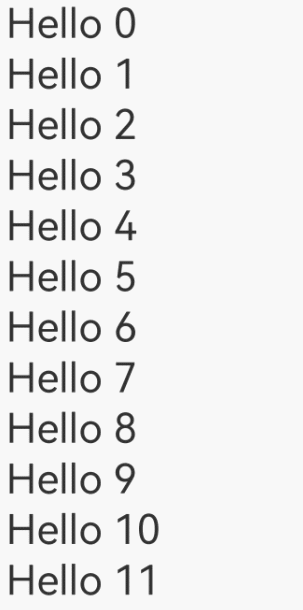

# LazyForEach: Lazy Data Loading

For details about API parameters, see [LazyForEach](https://gitee.com/openharmony/docs/blob/master/en/application-dev/reference/apis-arkui/arkui-ts/ts-rendering-control-lazyforeach.md) APIs.

**LazyForEach** iterates over provided data sources and creates corresponding components during each iteration. When **LazyForEach** is used in a scrolling container, the framework creates components as required within the visible area of the scrolling container. When a component is out of the visible area, the framework destroys and reclaims the component to reduce memory usage.

## Constraints

- **LazyForEach** must be used in a container component. Only the [List](../reference/apis-arkui/arkui-ts/ts-container-list.md), [Grid](../reference/apis-arkui/arkui-ts/ts-container-grid.md), [Swiper](../reference/apis-arkui/arkui-ts/ts-container-swiper.md), and [WaterFlow](../reference/apis-arkui/arkui-ts/ts-container-waterflow.md) components support lazy loading (the **cachedCount** property can be configured, that is, only the visible part and a small amount of data before and after the visible part are loaded for caching). For other components, all data is loaded at once.
- Only one **LazyForEach** can be used in a container component. Take **List** as an example. Containing **ListItem**, **ForEach**, and **LazyForEach** together in this component, or containing multiple **LazyForEach** at the same time is not recommended.
- In each iteration, only one child component must be created for **LazyForEach**. That is, the child component generation function of **LazyForEach** has only one root component.
- The generated child components must be allowed in the parent container component of **LazyForEach**.
- **LazyForEach** can be included in an **if/else** statement, and can also contain such a statement.
- The ID generation function must generate a unique value for each piece of data. Rendering issues will arise with components assigned duplicate IDs.
- **LazyForEach** must use the **DataChangeListener** object to re-render UI. If the first parameter **dataSource** is re-assigned a value, an exception occurs. When **dataSource** uses a state variable, the change of the state variable does not trigger the UI re-renders performed by **LazyForEach**.
- For better rendering performance, when the **onDataChange** API of the **DataChangeListener** object is used to update the UI, an ID different from the original one needs to be generated to trigger component re-rendering.
- **LazyForEach** must be used with the [@Reusable](https://developer.huawei.com/consumer/en/doc/best-practices-V5/bpta-component-reuse-V5#section5601835174020) decorator to trigger node reuse. Use @Reusable to decorate the components on the **LazyForEach** list. For details, see [Reuse Rules](https://developer.huawei.com/consumer/en/doc/best-practices-V5/bpta-component-reuse-V5#section5923195311402).

## Key Generation Rules

During **LazyForEach** rendering, the system generates a unique, persistent key for each item to identify the owing component. When the key changes, the ArkUI framework considers that the array element has been replaced or modified and creates a component based on the new key.

**LazyForEach** provides a parameter named **keyGenerator**, which is in effect a function through which you can customize key generation rules. If no **keyGenerator** function is defined, the ArkUI framework uses the default key generation function, that is, **(item: Object, index: number) => { return viewId + '-' + index.toString(); }**, wherein **viewId** is generated during compiler conversion. The **viewId** values in the same **LazyForEach** component are the same.

## Component Creation Rules

After the key generation rules are determined, the **itemGenerator** function – the second parameter in **LazyForEach** – creates a component for each array item of the data source based on the rules. There are two cases for creating a component: [initial render](#initial-render) and [non-initial render](#non-initial-render).

### Initial Render

#### Generating Different Key Values

When used for initial render, **LazyForEach** generates a unique key for each array item of the data source based on the key generation rules, and creates a component.

```ts
/** For details about the BasicDataSource code of the string array, see the attachment at the end of this topic. **/

class MyDataSource extends BasicDataSource {
  private dataArray: string[] = [];

  public totalCount(): number {
    return this.dataArray.length;
  }

  public getData(index: number): string {
    return this.dataArray[index];
  }

  public pushData(data: string): void {
    this.dataArray.push(data);
    this.notifyDataAdd(this.dataArray.length - 1);
  }
}

@Entry
@Component
struct MyComponent {
  private data: MyDataSource = new MyDataSource();
   
  aboutToAppear() {
    for (let i = 0; i <= 20; i++) {
      this.data.pushData(`Hello ${i}`)
    }
  }

  build() {
    List({ space: 3 }) {
      LazyForEach(this.data, (item: string) => {
        ListItem() {
          Row() {
            Text(item).fontSize(50)
              .onAppear(() => {
                console.info("appear:" + item)
              })
          }.margin({ left: 10, right: 10 })
        }
      }, (item: string) => item)
    }.cachedCount(5)
  }
}
```

In the preceding code snippets, the key generation rule is the return value **item** of the **keyGenerator** function. During loop rendering, **LazyForEach** generates keys in the sequence of **Hello 0**, **Hello 1**, ..., **Hello 20** for the array item of the data source, creates the corresponding **ListItem** child components and render them on the GUI.

The figure below shows the effect.

**Figure 1** Initial render of LazyForEach 


#### Incorrect Rendering When Keys Are the Same

When the keys generated for different data items are the same, the behavior of the framework is unpredictable. For example, in the following code, the keys of the data items rendered by **LazyForEach** are the same. During the swipe process, **LazyForEach** preloads child components for the current page. Because the new child component and the destroyed component have the same key, the framework may incorrectly obtain the cache. As a result, the child component rendering is abnormal.

```ts
/** For details about the BasicDataSource code of the string array, see the attachment at the end of this topic. **/

class MyDataSource extends BasicDataSource {
  private dataArray: string[] = [];

  public totalCount(): number {
    return this.dataArray.length;
  }

  public getData(index: number): string {
    return this.dataArray[index];
  }

  public pushData(data: string): void {
    this.dataArray.push(data);
    this.notifyDataAdd(this.dataArray.length - 1);
  }
}

@Entry
@Component
struct MyComponent {
  private data: MyDataSource = new MyDataSource();

  aboutToAppear() {
    for (let i = 0; i <= 20; i++) {
      this.data.pushData(`Hello ${i}`)
    }
  }

  build() {
    List({ space: 3 }) {
      LazyForEach(this.data, (item: string) => {
        ListItem() {
          Row() {
            Text(item).fontSize(50)
              .onAppear(() => {
                console.info("appear:" + item)
              })
          }.margin({ left: 10, right: 10 })
        }
      }, (item: string) => 'same key')
    }.cachedCount(5)
  }
}
```

The figure below shows the effect.

**Figure 2** LazyForEach rendering when keys are the same 


### Non-Initial Render

When the **LazyForEach** data source is changed and a re-render is required, call a listener API based on the data source change to notify **LazyForEach**. Below are some use cases.

#### Adding Data

```ts
/** For details about the BasicDataSource code of the string array, see the attachment at the end of this topic. **/

class MyDataSource extends BasicDataSource {
  private dataArray: string[] = [];

  public totalCount(): number {
    return this.dataArray.length;
  }

  public getData(index: number): string {
    return this.dataArray[index];
  }

  public pushData(data: string): void {
    this.dataArray.push(data);
    this.notifyDataAdd(this.dataArray.length - 1);
  }
}

@Entry
@Component
struct MyComponent {
  private data: MyDataSource = new MyDataSource();

  aboutToAppear() {
    for (let i = 0; i <= 20; i++) {
      this.data.pushData(`Hello ${i}`)
    }
  }

  build() {
    List({ space: 3 }) {
      LazyForEach(this.data, (item: string) => {
        ListItem() {
          Row() {
            Text(item).fontSize(50)
              .onAppear(() => {
                console.info("appear:" + item)
              })
          }.margin({ left: 10, right: 10 })
        }
        .onClick(() => {
          // Click to add a child component.
          this.data.pushData(`Hello ${this.data.totalCount()}`);
        })
      }, (item: string) => item)
    }.cachedCount(5)
  }
}
```

When the child component of **LazyForEach** is clicked, the **pushData** method of the data source is called first. This method adds data to the end of the data source and then calls the **notifyDataAdd** method. In the **notifyDataAdd** method, the **listener.onDataAdd** method is called to notify **LazyForEach** that data is added, and LazyForEach creates a child component at the position indicated by the specified index.

The figure below shows the effect.

**Figure 3** Adding data to LazyForEach 


#### Deleting Data

```ts
/** For details about the BasicDataSource code of the string array, see the attachment at the end of this topic. **/

class MyDataSource extends BasicDataSource {
  private dataArray: string[] = [];

  public totalCount(): number {
    return this.dataArray.length;
  }

  public getData(index: number): string {
    return this.dataArray[index];
  }

  public getAllData(): string[] {
    return this.dataArray;
  }

  public pushData(data: string): void {
    this.dataArray.push(data);
  }
  
  public deleteData(index: number): void {
    this.dataArray.splice(index, 1);
    this.notifyDataDelete(index);
  }
}

@Entry
@Component
struct MyComponent {
  private data: MyDataSource = new MyDataSource();

  aboutToAppear() {
    for (let i = 0; i <= 20; i++) {
      this.data.pushData(`Hello ${i}`)
    }
  }

  build() {
    List({ space: 3 }) {
      LazyForEach(this.data, (item: string, index: number) => {
        ListItem() {
          Row() {
            Text(item).fontSize(50)
              .onAppear(() => {
                console.info("appear:" + item)
              })
          }.margin({ left: 10, right: 10 })
        }
        .onClick(() => {
          // Click to delete a child component.
          this.data.deleteData(this.data.getAllData().indexOf(item));
        })
      }, (item: string) => item)
    }.cachedCount(5)
  }
}
```

When the child component of **LazyForEach** is clicked, the **deleteData** method of the data source is called first. This method deletes data that matches the specified index from the data source and then calls the **notifyDataDelete** method. In the **notifyDataDelete** method, the **listener.onDataDelete** method is called to notify **LazyForEach** that data is deleted, and **LazyForEach** deletes the child component at the position indicated by the specified index.

The figure below shows the effect.

**Figure 4** Deleting data from LazyForEach 


#### Swapping Data

```ts
/** For details about the BasicDataSource code of the string array, see the attachment at the end of this topic. **/

class MyDataSource extends BasicDataSource {
  private dataArray: string[] = [];

  public totalCount(): number {
    return this.dataArray.length;
  }

  public getData(index: number): string {
    return this.dataArray[index];
  }

  public getAllData(): string[] {
    return this.dataArray;
  }

  public pushData(data: string): void {
    this.dataArray.push(data);
  }
  
  public moveData(from: number, to: number): void {
    let temp: string = this.dataArray[from];
    this.dataArray[from] = this.dataArray[to];
    this.dataArray[to] = temp;
    this.notifyDataMove(from, to);
  }
}

@Entry
@Component
struct MyComponent {
  private moved: number[] = [];
  private data: MyDataSource = new MyDataSource();

  aboutToAppear() {
    for (let i = 0; i <= 20; i++) {
      this.data.pushData(`Hello ${i}`)
    }
  }

  build() {
    List({ space: 3 }) {
      LazyForEach(this.data, (item: string, index: number) => {
        ListItem() {
          Row() {
            Text(item).fontSize(50)
              .onAppear(() => {
                console.info("appear:" + item)
              })
          }.margin({ left: 10, right: 10 })
        }
        .onClick(() => {
          this.moved.push(this.data.getAllData().indexOf(item));
          if (this.moved.length === 2) {
          	// Click to exchange child components.
          	this.data.moveData(this.moved[0], this.moved[1]);
            this.moved = [];
          }
        })
      }, (item: string) => item)
    }.cachedCount(5)
  }
}
```

When a child component of **LazyForEach** is clicked, the index of the data to be moved is stored in the **moved** member variable. When another child component of **LazyForEach** is clicked, the first child component clicked is moved here. The **moveData** method of the data source is called to move the data from the original location to the expected location, after which the **notifyDataMove** method is called. In the **notifyDataMove** method, the **listener.onDataMove** method is called to notify **LazyForEach** that data needs to be moved. **LazyForEach** then swaps data between the **from** and **to** positions.

The figure below shows the effect.

**Figure 5** Swapping data in LazyForEach 


#### Changing a Data Item

```ts
/** For details about the BasicDataSource code of the string array, see the attachment at the end of this topic. **/

class MyDataSource extends BasicDataSource {
  private dataArray: string[] = [];

  public totalCount(): number {
    return this.dataArray.length;
  }

  public getData(index: number): string {
    return this.dataArray[index];
  }

  public pushData(data: string): void {
    this.dataArray.push(data);
  }
  
  public changeData(index: number, data: string): void {
    this.dataArray.splice(index, 1, data);
    this.notifyDataChange(index);
  }
}

@Entry
@Component
struct MyComponent {
  private moved: number[] = [];
  private data: MyDataSource = new MyDataSource();

  aboutToAppear() {
    for (let i = 0; i <= 20; i++) {
      this.data.pushData(`Hello ${i}`)
    }
  }


  build() {
    List({ space: 3 }) {
      LazyForEach(this.data, (item: string, index: number) => {
        ListItem() {
          Row() {
            Text(item).fontSize(50)
              .onAppear(() => {
                console.info("appear:" + item)
              })
          }.margin({ left: 10, right: 10 })
        }
        .onClick(() => {
          this.data.changeData(index, item + '00');
        })
      }, (item: string) => item)
    }.cachedCount(5)
  }
}
```

When the child component of **LazyForEach** is clicked, the data is changed first, and then the **changeData** method of the data source is called. In this method, the **notifyDataChange** method is called. In the **notifyDataChange** method, the **listener.onDataChange** method is called to notify **LazyForEach** of data changes. **LazyForEach** then rebuilds the child component that matches the specified index.

The figure below shows the effect.

**Figure 6** Changing a data item in LazyForEach 


#### Changing Multiple Data Items

```ts
/** For details about the BasicDataSource code of the string array, see the attachment at the end of this topic. **/

class MyDataSource extends BasicDataSource {
  private dataArray: string[] = [];

  public totalCount(): number {
    return this.dataArray.length;
  }

  public getData(index: number): string {
    return this.dataArray[index];
  }

  public pushData(data: string): void {
    this.dataArray.push(data);
  }
    
  public reloadData(): void {
    this.notifyDataReload();
  }
    
  public modifyAllData(): void {
    this.dataArray = this.dataArray.map((item: string) => {
        return item + '0';
    })
  }
}

@Entry
@Component
struct MyComponent {
  private moved: number[] = [];
  private data: MyDataSource = new MyDataSource();

  aboutToAppear() {
    for (let i = 0; i <= 20; i++) {
      this.data.pushData(`Hello ${i}`)
    }
  }

  build() {
    List({ space: 3 }) {
      LazyForEach(this.data, (item: string, index: number) => {
        ListItem() {
          Row() {
            Text(item).fontSize(50)
              .onAppear(() => {
                console.info("appear:" + item)
              })
          }.margin({ left: 10, right: 10 })
        }
        .onClick(() => {
          this.data.modifyAllData();
          this.data.reloadData();
        })
      }, (item: string) => item)
    }.cachedCount(5)
  }
}
```

When a child component of **LazyForEach** is clicked, the **modifyAllData** method of the data source is called to change all data items, and then the **reloadData** method of the data source is called. In this method, the **notifyDataReload** method is called. In the **notifyDataReload** method, the **listener.onDataReloaded** method is called to notify **LazyForEach** that all subnodes need to be rebuilt. **LazyForEach** compares the keys of all original data items with those of all new data items on a one-by-one basis. If the keys are the same, the cache is used. If the keys are different, the child component is rebuilt.

The figure below shows the effect.

**Figure 7** Changing multiple data items in LazyForEach 


#### Changing Data in Batches Precisely

```ts
/** For details about the BasicDataSource code of the string array, see the attachment at the end of this topic. **/

class MyDataSource extends BasicDataSource {
  private dataArray: string[] = [];

  public totalCount(): number {
    return this.dataArray.length;
  }

  public getData(index: number): string {
    return this.dataArray[index];
  }

  public operateData(): void {
    console.info(JSON.stringify(this.dataArray));
    this.dataArray.splice(4, 0, this.dataArray[1]);
    this.dataArray.splice(1, 1);
    let temp = this.dataArray[4];
    this.dataArray[4] = this.dataArray[6];
    this.dataArray[6] = temp
    this.dataArray.splice(8, 0, 'Hello 1', 'Hello 2');
    this.dataArray.splice(12, 2);
    console.info(JSON.stringify(this.dataArray));
    this.notifyDatasetChange([
      { type: DataOperationType.MOVE, index: { from: 1, to: 3 } },
      { type: DataOperationType.EXCHANGE, index: { start: 4, end: 6 } },
      { type: DataOperationType.ADD, index: 8, count: 2 },
      { type: DataOperationType.DELETE, index: 10, count: 2 }]);
  }

  public init(): void {
    this.dataArray.splice(0, 0, 'Hello a', 'Hello b', 'Hello c', 'Hello d', 'Hello e', 'Hello f', 'Hello g', 'Hello h',
      'Hello i', 'Hello j', 'Hello k', 'Hello l', 'Hello m', 'Hello n', 'Hello o', 'Hello p', 'Hello q', 'Hello r');
  }
}

@Entry
@Component
struct MyComponent {
  private data: MyDataSource = new MyDataSource();

  aboutToAppear() {
    this.data.init()
  }

  build() {
    Column() {
      Text('change data')
        .fontSize(10)
        .backgroundColor(Color.Blue)
        .fontColor(Color.White)
        .borderRadius(50)
        .padding(5)
        .onClick(() => {
          this.data.operateData();
        })
      List({ space: 3 }) {
        LazyForEach(this.data, (item: string, index: number) => {
          ListItem() {
            Row() {
              Text(item).fontSize(35)
                .onAppear(() => {
                  console.info("appear:" + item)
                })
            }.margin({ left: 10, right: 10 })
          }

        }, (item: string) => item + new Date().getTime())
      }.cachedCount(5)
    }
  }
}
```

The **onDatasetChange** API allows you to notify **LazyForEach** at a time to add, delete, move, and exchange data. In the preceding example, after the text **change data** is clicked, the second data item is moved to the fourth, the fifth data item exchanges locations with the seventh one, data **Hello 1** and **Hello 2** are added from the ninth, and two data items are deleted from the eleventh. 

**Figure 8** Changing multiple data items in LazyForEach 

  

In the second example, values are directly changed in the array without using **splice()**. Result of **operations** is directly obtained by comparing the original array with the new array.

```ts
/** For details about the BasicDataSource code of the string array, see the attachment at the end of this topic. **/

class MyDataSource extends BasicDataSource {
  private dataArray: string[] = [];

  public totalCount(): number {
    return this.dataArray.length;
  }

  public getData(index: number): string {
    return this.dataArray[index];
  }

  public operateData(): void {
    this.dataArray =
      ['Hello x', 'Hello 1', 'Hello 2', 'Hello b', 'Hello c', 'Hello e', 'Hello d', 'Hello f', 'Hello g', 'Hello h']
    this.notifyDatasetChange([
      { type: DataOperationType.CHANGE, index: 0 },
      { type: DataOperationType.ADD, index: 1, count: 2 },
      { type: DataOperationType.EXCHANGE, index: { start: 3, end: 4 } },
    ]);
  }

  public init(): void {
    this.dataArray = ['Hello a', 'Hello b', 'Hello c', 'Hello d', 'Hello e', 'Hello f', 'Hello g', 'Hello h'];
  }
}

@Entry
@Component
struct MyComponent {
  private data: MyDataSource = new MyDataSource();

  aboutToAppear() {
    this.data.init()
  }

  build() {
    Column() {
      Text('Multi-Data Change')
        .fontSize(10)
        .backgroundColor(Color.Blue)
        .fontColor(Color.White)
        .borderRadius(50)
        .padding(5)
        .onClick(() => {
          this.data.operateData();
        })
      List({ space: 3 }) {
        LazyForEach(this.data, (item: string, index: number) => {
          ListItem() {
            Row() {
              Text(item).fontSize(35)
                .onAppear(() => {
                  console.info("appear:" + item)
                })
            }.margin({ left: 10, right: 10 })
          }

        }, (item: string) => item + new Date().getTime())
      }.cachedCount(5)
    }
  }
}
```
**Figure 9** Changing multiple data items in LazyForEach

  

Pay attention to the following when using the **onDatasetChange** API:

1. The **onDatasetChange** API cannot be used together with other data operation APIs.
2. Index of the **operations** passed in the **onDatasetChange** API is searched from the original array before modification. Therefore, the index in **operations** does not always correspond to the index in **Datasource** and cannot be a negative number.

which is shown in the following example:

```ts
// Array before modification.
["Hello a","Hello b","Hello c","Hello d","Hello e","Hello f","Hello g","Hello h","Hello i","Hello j","Hello k","Hello l","Hello m","Hello n","Hello o","Hello p","Hello q","Hello r"]
//Array after modification.
["Hello a","Hello c","Hello d","Hello b","Hello g","Hello f","Hello e","Hello h","Hello 1","Hello 2","Hello i","Hello j","Hello m","Hello n","Hello o","Hello p","Hello q","Hello r"]
```
**Hello b** is changed from item 2 to item 4. Therefore, the first **operation** is written in **{ type: DataOperationType.MOVE, index: { from: 1, to: 3 } }**. 
**Hello e** whose index is 4 and **Hello g** whose index is 6 are exchanged in the original array. Therefore, the second **operation** is written in **{ type: DataOperationType.EXCHANGE, index: { start: 4, end: 6 } }**. 
**Hello 1** and **Hello 2** are inserted after **Hello h** whose index is 7 in the original array. Therefore, the third **operation** is written in **{ type: DataOperationType.ADD, index: 8, count: 2 }**. 
**Hello k** whose index is 10 and **Hello l** whose index is 11 are deleted in the original array. Therefore, the fourth **operation** is written in **{ type: DataOperationType.DELETE, index: 10, count: 2 }**. 

3. When **onDatasetChange** is called, the data can be operated only once for each index. If the data is operated multiple times, **LazyForEach** enables only the first operation to take effect.
4. In operations where you can specify keys on your own, **LazyForEach** does not call the key generator to obtain keys. As such, make sure the specified keys are correct.
5. If the API contains the **RELOAD** operation, other operations do not take effect.

### Changing Data Subproperties

When **LazyForEach** is used for UI re-renders, a child component needs to be destroyed and rebuilt when the data item changes. This may result in low re-render performance when the child component structure is complex. This is where @Observed and @ObjectLink come into picture. By providing in-depth observation, @Observed and @ObjectLink enable precise re-renders of only components that use the changed properties. You can select a re-render mode that better suits your needs.

```ts
/** For details about the BasicDataSource code of the StringData array, see the attachment at the end of this topic. **/

class MyDataSource extends BasicDataSource {
  private dataArray: StringData[] = [];

  public totalCount(): number {
    return this.dataArray.length;
  }

  public getData(index: number): StringData {
    return this.dataArray[index];
  }

  public pushData(data: StringData): void {
    this.dataArray.push(data);
    this.notifyDataAdd(this.dataArray.length - 1);
  }
}

@Observed
class StringData {
  message: string;
  constructor(message: string) {
    this.message = message;
  }  
}

@Entry
@Component
struct MyComponent {
  private moved: number[] = [];
  private data: MyDataSource = new MyDataSource();

  aboutToAppear() {
    for (let i = 0; i <= 20; i++) {
      this.data.pushData(new StringData(`Hello ${i}`));
    }
  }

  build() {
    List({ space: 3 }) {
      LazyForEach(this.data, (item: StringData, index: number) => {
        ListItem() {
          ChildComponent({data: item})
        }
        .onClick(() => {
          item.message += '0';
        })
      }, (item: StringData, index: number) => index.toString())
    }.cachedCount(5)
  }
}

@Component
struct ChildComponent {
  @ObjectLink data: StringData
  build() {
    Row() {
      Text(this.data.message).fontSize(50)
        .onAppear(() => {
          console.info("appear:" + this.data.message)
        })
    }.margin({ left: 10, right: 10 })
  }
}
```

When the child component of **LazyForEach** is clicked, **item.message** is changed. As re-rendering depends on the listening of the @ObjectLink decorated member variable of **ChildComponent** on its subproperties. In this case, the framework only re-renders **Text(this.data.message)** and does not rebuild the entire **ListItem** child component.

**Figure 10** Changing data subproperties in LazyForEach 


### Using State Management V2

State management V2 provides the @ObservedV2 and @Trace decorators to implement in-depth property observation and uses @Local and @Param decorators to re-render or manage child components. Only the components that use the corresponding properties are re-rendered.

#### Observing Nested Class Property Changes

```ts
/** For details about the BasicDataSource code of the StringData array, see the attachment at the end of this topic. **/

class MyDataSource extends BasicDataSource {
  private dataArray: StringData[] = [];

  public totalCount(): number {
    return this.dataArray.length;
  }

  public getData(index: number): StringData {
    return this.dataArray[index];
  }

  public pushData(data: StringData): void {
    this.dataArray.push(data);
    this.notifyDataAdd(this.dataArray.length - 1);
  }
}

class StringData {
  firstLayer: FirstLayer;

  constructor(firstLayer: FirstLayer) {
    this.firstLayer = firstLayer;
  }
}

class FirstLayer {
  secondLayer: SecondLayer;

  constructor(secondLayer: SecondLayer) {
    this.secondLayer = secondLayer;
  }
}

class SecondLayer {
  thirdLayer: ThirdLayer;

  constructor(thirdLayer: ThirdLayer) {
    this.thirdLayer = thirdLayer;
  }
}

@ObservedV2
class ThirdLayer {
  @Trace forthLayer: String;

  constructor(forthLayer: String) {
    this.forthLayer = forthLayer;
  }
}

@Entry
@ComponentV2
struct MyComponent {
  private data: MyDataSource = new MyDataSource();

  aboutToAppear() {
    for (let i = 0; i <= 20; i++) {
      this.data.pushData(new StringData(new FirstLayer(new SecondLayer(new ThirdLayer('Hello' + i)))));
    }
  }

  build() {
    List({ space: 3 }) {
      LazyForEach(this.data, (item: StringData, index: number) => {
        ListItem() {
          Text(item.firstLayer.secondLayer.thirdLayer.forthLayer.toString()).fontSize(50)
            .onClick(() => {
              item.firstLayer.secondLayer.thirdLayer.forthLayer += '!';
            })
        }
      }, (item: StringData, index: number) => index.toString())
    }.cachedCount(5)
  }
}
```

@ObservedV2 and @Trace are used to decorate classes and properties in the classes. They can be used together to deeply observe the decorated classes and properties. In the example, @ObservedV2 and @Trace are used to observe the changes of multi-layer nested properties and re-render child components in the in-depth nested class structure. When you click child component **Text** to change the innermost @Trace decorated class member property of the nested class, only the components that depend on the property are re-rendered.

#### Observing Component Internal State

```ts
/** For details about the BasicDataSource code of the StringData array, see the attachment at the end of this topic. **/

class MyDataSource extends BasicDataSource {
  private dataArray: StringData[] = [];

  public totalCount(): number {
    return this.dataArray.length;
  }

  public getData(index: number): StringData {
    return this.dataArray[index];
  }

  public pushData(data: StringData): void {
    this.dataArray.push(data);
    this.notifyDataAdd(this.dataArray.length - 1);
  }
}

@ObservedV2
class StringData {
  @Trace message: string;

  constructor(message: string) {
    this.message = message;
  }
}

@Entry
@ComponentV2
struct MyComponent {
  data: MyDataSource = new MyDataSource();

  aboutToAppear() {
    for (let i = 0; i <= 20; i++) {
      this.data.pushData(new StringData('Hello' + i));
    }
  }

  build() {
    List({ space: 3 }) {
      LazyForEach(this.data, (item: StringData, index: number) => {
        ListItem() {
          Row() {

            Text(item.message).fontSize(50)
              .onClick(() => {
                // Change the @Trace decorated variable in the @ObservedV2 decorated class to trigger the re-render of the Text component.
                item.message += '!';
              })
            ChildComponent()
          }
        }
      }, (item: StringData, index: number) => index.toString())
    }.cachedCount(5)
  }
}

@ComponentV2
struct ChildComponent {
  @Local message: string = '?';

  build() {
    Row() {
      Text(this.message).fontSize(50)
        .onClick(() => {
          // Change the @Local decorated variable to trigger the re-render of the Text component.
          this.message += '?';
        })
    }
  }
}
```

@Local enables the variable changes in the custom component are observable. The variable must be initialized in the component. In the example, when you click the **Text** component to change **item.message**, the variable is updated and the component that uses the variable is re-rendered. When the @Local decorated variable **message** in **ChildComponent** changes, the child component can also be re-rendered.

#### Receiving External Input

```ts
/** For details about the BasicDataSource code of the StringData array, see the attachment at the end of this topic. **/

class MyDataSource extends BasicDataSource {
  private dataArray: StringData[] = [];

  public totalCount(): number {
    return this.dataArray.length;
  }

  public getData(index: number): StringData {
    return this.dataArray[index];
  }

  public pushData(data: StringData): void {
    this.dataArray.push(data);
    this.notifyDataAdd(this.dataArray.length - 1);
  }
}

@ObservedV2
class StringData {
  @Trace message: string;

  constructor(message: string) {
    this.message = message;
  }
}

@Entry
@ComponentV2
struct MyComponent {
  data: MyDataSource = new MyDataSource();

  aboutToAppear() {
    for (let i = 0; i <= 20; i++) {
      this.data.pushData(new StringData('Hello' + i));
    }
  }

  build() {
    List({ space: 3 }) {
      LazyForEach(this.data, (item: StringData, index: number) => {
        ListItem() {
          ChildComponent({ data: item.message })
            .onClick(() => {
              item.message += '!';
            })
        }
      }, (item: StringData, index: number) => index.toString())
    }.cachedCount(5)
  }
}

@ComponentV2
struct ChildComponent {
  @Param @Require data: string = '';

  build() {
    Row() {
      Text(this.data).fontSize(50)
    }
  }
}
```

The @Param decorator enables the child component to receive external input parameters to implement data synchronization between the parent and child components. When a child component is created in **MyComponent**, the **item.message** variable is passed and associated with the **data** variable decorated by @Param. Click the component in **ListItem** to change **item.message**. The data change is passed from the parent component to the child component, and the child component is re-rendered.

## Enabling Drag and Sort
If **LazyForEach** is used in a list, and the **onMove** event is set, you can enable drag and sort for the list items. If an item changes the position after you drag and sort the data, the **onMove** event is triggered to report the original index and target index of the item. The data source needs to be modified in the **onMove** event based on the reported start index and target index. The **DataChangeListener** API does not need to be called to notify the data source change.

```ts
/** For details about the BasicDataSource code of the string array, see the attachment at the end of this topic. **/

class MyDataSource extends BasicDataSource {
  private dataArray: string[] = [];

  public totalCount(): number {
    return this.dataArray.length;
  }

  public getData(index: number): string {
    return this.dataArray[index];
  }

  public moveDataWithoutNotify(from: number, to: number): void {
    let tmp = this.dataArray.splice(from, 1);
    this.dataArray.splice(to, 0, tmp[0])
  }

  public pushData(data: string): void {
    this.dataArray.push(data);
    this.notifyDataAdd(this.dataArray.length - 1);
  }
}

@Entry
@Component
struct Parent {
  private data: MyDataSource = new MyDataSource();

  aboutToAppear(): void {
    for (let i = 0; i < 100; i++) {
      this.data.pushData(i.toString())
    }
  }

  build() {
    Row() {
      List() {
        LazyForEach(this.data, (item: string) => {
            ListItem() {
              Text(item.toString())
                .fontSize(16)
                .textAlign(TextAlign.Center)
                .size({height: 100, width: "100%"})
            }.margin(10)
            .borderRadius(10)
            .backgroundColor("#FFFFFFFF")
          }, (item: string) => item)
          .onMove((from:number, to:number)=>{
            this.data.moveDataWithoutNotify(from, to)
          })
      }
      .width('100%')
      .height('100%')
      .backgroundColor("#FFDCDCDC")
    }
  }
}
```

**Figure 11** Drag and sort in LazyForEach 


## FAQs

### Unexpected Rendering Result

```ts
/** For details about the BasicDataSource code of the string array, see the attachment at the end of this topic. **/

class MyDataSource extends BasicDataSource {
  private dataArray: string[] = [];

  public totalCount(): number {
    return this.dataArray.length;
  }

  public getData(index: number): string {
    return this.dataArray[index];
  }

  public pushData(data: string): void {
    this.dataArray.push(data);
    this.notifyDataAdd(this.dataArray.length - 1);
  }
  
  public deleteData(index: number): void {
    this.dataArray.splice(index, 1);
    this.notifyDataDelete(index);
  }
}

@Entry
@Component
struct MyComponent {
  private data: MyDataSource = new MyDataSource();

  aboutToAppear() {
    for (let i = 0; i <= 20; i++) {
      this.data.pushData(`Hello ${i}`)
    }
  }

  build() {
    List({ space: 3 }) {
      LazyForEach(this.data, (item: string, index: number) => {
        ListItem() {
          Row() {
            Text(item).fontSize(50)
              .onAppear(() => {
                console.info("appear:" + item)
              })
          }.margin({ left: 10, right: 10 })
        }
        .onClick(() => {
          // Click to delete a child component.
          this.data.deleteData(index);
        })
      }, (item: string) => item)
    }.cachedCount(5)
  }
}
```

**Figure 12** Unexpected data deletion by LazyForEach 


When child components are clicked to be deleted, there may be cases where the deleted child component is not the one clicked. If this is the case, the indexes of data items are not updated correctly. In normal cases, after a child component is deleted, all data items following the data item of the child component should have their index decreased by 1. If these data items still use the original indexes, the indexes in **itemGenerator** do not change, resulting in the unexpected rendering result.

The following shows the code snippet after optimization:

```ts
/** For details about the BasicDataSource code of the string array, see the attachment at the end of this topic. **/

class MyDataSource extends BasicDataSource {
  private dataArray: string[] = [];

  public totalCount(): number {
    return this.dataArray.length;
  }

  public getData(index: number): string {
    return this.dataArray[index];
  }

  public pushData(data: string): void {
    this.dataArray.push(data);
    this.notifyDataAdd(this.dataArray.length - 1);
  }
  
  public deleteData(index: number): void {
    this.dataArray.splice(index, 1);
    this.notifyDataDelete(index);
  }
    
  public reloadData(): void {
    this.notifyDataReload();
  }
}

@Entry
@Component
struct MyComponent {
  private data: MyDataSource = new MyDataSource();

  aboutToAppear() {
    for (let i = 0; i <= 20; i++) {
      this.data.pushData(`Hello ${i}`)
    }
  }

  build() {
    List({ space: 3 }) {
      LazyForEach(this.data, (item: string, index: number) => {
        ListItem() {
          Row() {
            Text(item).fontSize(50)
              .onAppear(() => {
                console.info("appear:" + item)
              })
          }.margin({ left: 10, right: 10 })
        }
        .onClick(() => {
          // Click to delete a child component.
          this.data.deleteData(index);
          // Reset the indexes of all child components.
          this.data.reloadData();
        })
      }, (item: string, index: number) => item + index.toString())
    }.cachedCount(5)
  }
}
```

After a data item is deleted, the **reloadData** method is called to rebuild the subsequent data items to update the indexes. Use the **reloadData** method to rebuild a data item, you should ensure that the data item can generate a new key. **item + index.toString()** is used to rebuild the data items following the deleted data item. If **item + Date.now().toString()** is used instead, all data items generate new keys. As a result, all data items are rebuilt. This method has the same effect, but the performance is slightly poor.

**Figure 13** Fixing unexpected data deletion 


### Image Flickering During Re-renders

```ts
/** For details about the BasicDataSource code of the StringData array, see the attachment at the end of this topic. **/

class MyDataSource extends BasicDataSource {
  private dataArray: StringData[] = [];

  public totalCount(): number {
    return this.dataArray.length;
  }

  public getData(index: number): StringData {
    return this.dataArray[index];
  }

  public pushData(data: StringData): void {
    this.dataArray.push(data);
    this.notifyDataAdd(this.dataArray.length - 1);
  }
    
  public reloadData(): void {
    this.notifyDataReload();
  }
}

class StringData {
  message: string;
  imgSrc: Resource;
  constructor(message: string, imgSrc: Resource) {
      this.message = message;
      this.imgSrc = imgSrc;
  }  
}

@Entry
@Component
struct MyComponent {
  private moved: number[] = [];
  private data: MyDataSource = new MyDataSource();

  aboutToAppear() {
    for (let i = 0; i <= 20; i++) {
      // 'app.media.img' is only an example. Replace it with the actual one in use. Otherwise, the imageSource instance fails to be created, and subsequent operations cannot be performed.
      this.data.pushData(new StringData(`Hello ${i}`, $r('app.media.img')));
    }
  }

  build() {
    List({ space: 3 }) {
      LazyForEach(this.data, (item: StringData, index: number) => {
        ListItem() {
          Column() {
            Text(item.message).fontSize(50)
              .onAppear(() => {
                console.info("appear:" + item.message)
              })
            Image(item.imgSrc)
              .width(500)
              .height(200)
          }.margin({ left: 10, right: 10 })
        }
        .onClick(() => {
          item.message += '00';
          this.data.reloadData();
        })
      }, (item: StringData, index: number) => JSON.stringify(item))
    }.cachedCount(5)
  }
}
```

**Figure 14** Unwanted image flickering with LazyForEach 


In the example, when a list item is clicked, only the **message** property of the item is changed. Yet, along with the text change comes the unwanted image flickering. This is because, with the **LazyForEach** update mechanism, the entire list item is rebuilt. As the **Image** component is updated asynchronously, flickering occurs. To address this issue, use @ObjectLink and @Observed so that only the **Text** component that uses the **item.message** property is re-rendered.

The following shows the code snippet after optimization:

```ts
/** For details about the BasicDataSource code of the StringData array, see the attachment at the end of this topic. **/

class MyDataSource extends BasicDataSource {
  private dataArray: StringData[] = [];

  public totalCount(): number {
    return this.dataArray.length;
  }

  public getData(index: number): StringData {
    return this.dataArray[index];
  }

  public pushData(data: StringData): void {
    this.dataArray.push(data);
    this.notifyDataAdd(this.dataArray.length - 1);
  }
}

// The @Observed class decorator and @ObjectLink are used for two-way data synchronization in scenarios involving nested objects or arrays.
@Observed
class StringData {
  message: string;
  imgSrc: Resource;
  constructor(message: string, imgSrc: Resource) {
      this.message = message;
      this.imgSrc = imgSrc;
  }  
}

@Entry
@Component
struct MyComponent {
  private data: MyDataSource = new MyDataSource();

  aboutToAppear() {
    for (let i = 0; i <= 20; i++) {
      this.data.pushData(new StringData(`Hello ${i}`, $r('app.media.img')));
    }
  }

  build() {
    List({ space: 3 }) {
      LazyForEach(this.data, (item: StringData, index: number) => {
        ListItem() {
          ChildComponent({data: item})
        }
        .onClick(() => {
          item.message += '0';
        })
      }, (item: StringData, index: number) => index.toString())
    }.cachedCount(5)
  }
}

@Component
struct ChildComponent {
  // Use state variables instead of LazyForEach APIs to drive UI re-render.
  @ObjectLink data: StringData
  build() {
    Column() {
      Text(this.data.message).fontSize(50)
        .onAppear(() => {
          console.info("appear:" + this.data.message)
        })
      Image(this.data.imgSrc)
        .width(500)
        .height(200)
    }.margin({ left: 10, right: 10 })
  }
}
```

**Figure 15** Fixing unwanted image flickering 


### UI Not Re-rendered When @ObjectLink Property Is Changed

```ts
/** For details about the BasicDataSource code of the StringData array, see the attachment at the end of this topic. **/

class MyDataSource extends BasicDataSource {
  private dataArray: StringData[] = [];

  public totalCount(): number {
    return this.dataArray.length;
  }

  public getData(index: number): StringData {
    return this.dataArray[index];
  }

  public pushData(data: StringData): void {
    this.dataArray.push(data);
    this.notifyDataAdd(this.dataArray.length - 1);
  }
}

@Observed
class StringData {
  message: NestedString;
  constructor(message: NestedString) {
    this.message = message;
  }  
}

@Observed
class NestedString {
  message: string;
  constructor(message: string) {
    this.message = message;
  }  
}

@Entry
@Component
struct MyComponent {
  private moved: number[] = [];
  private data: MyDataSource = new MyDataSource();

  aboutToAppear() {
    for (let i = 0; i <= 20; i++) {
      this.data.pushData(new StringData(new NestedString(`Hello ${i}`)));
    }
  }

  build() {
    List({ space: 3 }) {
      LazyForEach(this.data, (item: StringData, index: number) => {
        ListItem() {
          ChildComponent({data: item})
        }
        .onClick(() => {
          item.message.message += '0';
        })
      }, (item: StringData, index: number) => JSON.stringify(item) + index.toString())
    }.cachedCount(5)
  }
}

@Component
struct ChildComponent {
  @ObjectLink data: StringData
  build() {
    Row() {
      Text(this.data.message.message).fontSize(50)
        .onAppear(() => {
          console.info("appear:" + this.data.message.message)
        })
    }.margin({ left: 10, right: 10 })
  }
}
```

**Figure 16** UI not re-rendered when @ObjectLink property is changed 


The member variable decorated by @ObjectLink can observe only changes of its sub-properties, not changes of nested properties. Therefore, to instruct a component to re-render, we need to change the component sub-properties. For details, see [\@Observed and \@ObjectLink Decorators](./arkts-observed-and-objectlink.md).

The following shows the code snippet after optimization:

```ts
/** For details about the BasicDataSource code of the StringData array, see the attachment at the end of this topic. **/

class MyDataSource extends BasicDataSource {
  private dataArray: StringData[] = [];

  public totalCount(): number {
    return this.dataArray.length;
  }

  public getData(index: number): StringData {
    return this.dataArray[index];
  }

  public pushData(data: StringData): void {
    this.dataArray.push(data);
    this.notifyDataAdd(this.dataArray.length - 1);
  }
}

@Observed
class StringData {
  message: NestedString;
  constructor(message: NestedString) {
    this.message = message;
  }  
}

@Observed
class NestedString {
  message: string;
  constructor(message: string) {
    this.message = message;
  }  
}

@Entry
@Component
struct MyComponent {
  private moved: number[] = [];
  private data: MyDataSource = new MyDataSource();

  aboutToAppear() {
    for (let i = 0; i <= 20; i++) {
      this.data.pushData(new StringData(new NestedString(`Hello ${i}`)));
    }
  }

  build() {
    List({ space: 3 }) {
      LazyForEach(this.data, (item: StringData, index: number) => {
        ListItem() {
          ChildComponent({data: item})
        }
        .onClick(() => {
          // The member variables decorated by @ObjectLink can only listen for the changes of their sub-properties. The in-depth nested properties cannot be observed.
          item.message = new NestedString(item.message.message + '0');
        })
      }, (item: StringData, index: number) => JSON.stringify(item) + index.toString())
    }.cachedCount(5)
  }
}

@Component
struct ChildComponent {
  @ObjectLink data: StringData
  build() {
    Row() {
      Text(this.data.message.message).fontSize(50)
        .onAppear(() => {
          console.info("appear:" + this.data.message.message)
        })
    }.margin({ left: 10, right: 10 })
  }
}
```

**Figure 17** Fixing the UI-not-re-rendered issue 


### Screen Flickering
List has an **onScrollIndex** callback function. When **onDataReloaded** is called in **onScrollIndex**, there is a risk of screen flickering.

```ts
/** For details about the BasicDataSource code of the string array, see the attachment at the end of this topic. **/

class MyDataSource extends BasicDataSource {
  private dataArray: string[] = [];

  public totalCount(): number {
    return this.dataArray.length;
  }

  public getData(index: number): string {
    return this.dataArray[index];
  }

  public pushData(data: string): void {
    this.dataArray.push(data);
    this.notifyDataAdd(this.dataArray.length - 1);
  }

  operateData():void {
    const totalCount = this.dataArray.length;
    const batch=5;
    for (let i = totalCount; i < totalCount + batch; i++) {
      this.dataArray.push(`Hello ${i}`)
    }
    this.notifyDataReload();
  }
}

@Entry
@Component
struct MyComponent {
  private moved: number[] = [];
  private data: MyDataSource = new MyDataSource();

  aboutToAppear() {
    for (let i = 0; i <= 10; i++) {
      this.data.pushData(`Hello ${i}`)
    }
  }

  build() {
    List({ space: 3 }) {
      LazyForEach(this.data, (item: string, index: number) => {
        ListItem() {
          Row() {
            Text(item)
              .width('100%')
              .height(80)
              .backgroundColor(Color.Gray)
              .onAppear(() => {
                console.info("appear:" + item)
              })
          }.margin({ left: 10, right: 10 })
        }
      }, (item: string) => item)
    }.cachedCount(10)
    .onScrollIndex((start, end, center) => {
      if (end === this.data.totalCount() - 1) {
        console.log('scroll to end')
        this.data.operateData();
      }
    })
  }
}
```

When **List** is scrolled to the bottom, screen flicks like the following. 


Replacing **onDataReloaded** by **onDatasetChange** cannot only fix this issue but also improves load performance.

```ts
/** For details about the BasicDataSource code of the string array, see the attachment at the end of this topic. **/

class MyDataSource extends BasicDataSource {
  private dataArray: string[] = [];

  public totalCount(): number {
    return this.dataArray.length;
  }

  public getData(index: number): string {
    return this.dataArray[index];
  }

  public pushData(data: string): void {
    this.dataArray.push(data);
    this.notifyDataAdd(this.dataArray.length - 1);
  }

  operateData():void {
    const totalCount = this.dataArray.length;
    const batch=5;
    for (let i = totalCount; i < totalCount + batch; i++) {
      this.dataArray.push(`Hello ${i}`)
    }
    // Replace notifyDataReload.
    this.notifyDatasetChange([{type:DataOperationType.ADD, index: totalCount-1, count:batch}])
  }
}

@Entry
@Component
struct MyComponent {
  private moved: number[] = [];
  private data: MyDataSource = new MyDataSource();

  aboutToAppear() {
    for (let i = 0; i <= 10; i++) {
      this.data.pushData(`Hello ${i}`)
    }
  }

  build() {
    List({ space: 3 }) {
      LazyForEach(this.data, (item: string, index: number) => {
        ListItem() {
          Row() {
            Text(item)
              .width('100%')
              .height(80)
              .backgroundColor(Color.Gray)
              .onAppear(() => {
                console.info("appear:" + item)
              })
          }.margin({ left: 10, right: 10 })
        }
      }, (item: string) => item)
    }.cachedCount(10)
    .onScrollIndex((start, end, center) => {
      if (end === this.data.totalCount() - 1) {
        console.log('scroll to end')
        this.data.operateData();
      }
    })
  }
}
```

Fixed result 


### Component Reuse Rendering Exception

If @Reusable and @ComponentV2 are used together, the component rendering is abnormal.

```ts
/** For details about the BasicDataSource code of the StringData array, see the attachment at the end of this topic. **/

class MyDataSource extends BasicDataSource {
  private dataArray: StringData[] = [];

  public totalCount(): number {
    return this.dataArray.length;
  }

  public getData(index: number): StringData {
    return this.dataArray[index];
  }

  public pushData(data: StringData): void {
    this.dataArray.push(data);
    this.notifyDataAdd(this.dataArray.length - 1);
  }
}


class StringData {
  message: string;

  constructor(message: string) {
    this.message = message;
  }
}

@Entry
@ComponentV2
struct MyComponent {
  data: MyDataSource = new MyDataSource();

  aboutToAppear() {
    for (let i = 0; i <= 30; i++) {
      this.data.pushData(new StringData('Hello' + i));
    }
  }

  build() {
    List({ space: 3 }) {
      LazyForEach(this.data, (item: StringData, index: number) => {
        ListItem() {
          ChildComponent({ data: item })
            .onAppear(() => {
              console.log('onAppear: ' + item.message)
            })
        }
      }, (item: StringData, index: number) => index.toString())
    }.cachedCount(5)
  }
}

@Reusable
@Component
struct ChildComponent {
  @State data: StringData = new StringData('');

  aboutToAppear(): void {
    console.log('aboutToAppear: ' + this.data.message);
  }

  aboutToRecycle(): void {
    console.log('aboutToRecycle: ' + this.data.message);
  }

  // Update the data of the reused component.
  aboutToReuse(params: Record<string, ESObject>): void {
    this.data = params.data as StringData;
    console.log('aboutToReuse: ' + this.data.message);
  }

  build() {
    Row() {
      Text(this.data.message).fontSize(50)
    }
  }
}
```

The negative example shows that in @ComponentV2 decorated **MyComponent**, the **LazyForEach** list uses @Reusable decorated **ChildComponent**. As a result, the component fails to be rendered. The log shows that the component triggers **onAppear** but does not trigger **aboutToAppear**.

Change @ComponentV2 to @Component to rectify the rendering exception. After that, when the swipe event triggers the detach of a component node, the corresponding reusable component **ChildComponent** is added from the component tree to the reuse cache instead of being destroyed, the **aboutToRecycle** event is triggered, and log is recorded. When a new node needs to be displayed, the reusable component attaches to the node tree from the reuse cache, triggers **aboutToReuse** to update the component data, and output logs.

## Attachments

### BasicDataSource Code of the String Array

```ts
// BasicDataSource implements the IDataSource API to manage listeners and notify LazyForEach of data updates.
class BasicDataSource implements IDataSource {
  private listeners: DataChangeListener[] = [];
  private originDataArray: string[] = [];

  public totalCount(): number {
    return 0;
  }

  public getData(index: number): string {
    return this.originDataArray[index];
  }

  // This method is called by the framework to add a listener to the LazyForEach data source.
  registerDataChangeListener(listener: DataChangeListener): void {
    if (this.listeners.indexOf(listener) < 0) {
      console.info('add listener');
      this.listeners.push(listener);
    }
  }

  // This method is called by the framework to remove the listener from the LazyForEach data source.
  unregisterDataChangeListener(listener: DataChangeListener): void {
    const pos = this.listeners.indexOf(listener);
    if (pos >= 0) {
      console.info('remove listener');
      this.listeners.splice(pos, 1);
    }
  }

  // Notify LazyForEach that all child components need to be reloaded.
  notifyDataReload(): void {
    this.listeners.forEach(listener => {
      listener.onDataReloaded();
    })
  }

  // Notify LazyForEach that a child component needs to be added for the data item with the specified index.
  notifyDataAdd(index: number): void {
    this.listeners.forEach(listener => {
      listener.onDataAdd(index);
      // Method 2: listener.onDatasetChange([{type: DataOperationType.ADD, index: index}]);
    })
  }

  // Notify LazyForEach that the data item with the specified index has changed and the child component needs to be rebuilt.
  notifyDataChange(index: number): void {
    this.listeners.forEach(listener => {
      listener.onDataChange(index);
      // Method 2: listener.onDatasetChange([{type: DataOperationType.CHANGE, index: index}]);
    })
  }

  // Notify LazyForEach that the child component needs to be deleted from the data item with the specified index.
  notifyDataDelete(index: number): void {
    this.listeners.forEach(listener => {
      listener.onDataDelete(index);
      // Method 2: listener.onDatasetChange([{type: DataOperationType.DELETE, index: index}]);
    })
  }

  // Notify LazyForEach that data needs to be swapped between the from and to positions.
  notifyDataMove(from: number, to: number): void {
    this.listeners.forEach(listener => {
      listener.onDataMove(from, to);
      // Method 2: listener.onDatasetChange ()
      //         [{type: DataOperationType.EXCHANGE, index: {start: from, end: to}}]);
    })
  }

  notifyDatasetChange(operations: DataOperation[]): void {
    this.listeners.forEach(listener => {
      listener.onDatasetChange(operations);
    })
  }
}
```

### BasicDataSource Code of the StringData Array

```ts
class BasicDataSource implements IDataSource {
  private listeners: DataChangeListener[] = [];
  private originDataArray: StringData[] = [];

  public totalCount(): number {
    return 0;
  }

  public getData(index: number): StringData {
    return this.originDataArray[index];
  }

  registerDataChangeListener(listener: DataChangeListener): void {
    if (this.listeners.indexOf(listener) < 0) {
      console.info('add listener');
      this.listeners.push(listener);
    }
  }

  unregisterDataChangeListener(listener: DataChangeListener): void {
    const pos = this.listeners.indexOf(listener);
    if (pos >= 0) {
      console.info('remove listener');
      this.listeners.splice(pos, 1);
    }
  }

  notifyDataReload(): void {
    this.listeners.forEach(listener => {
      listener.onDataReloaded();
    })
  }

  notifyDataAdd(index: number): void {
    this.listeners.forEach(listener => {
      listener.onDataAdd(index);
    })
  }

  notifyDataChange(index: number): void {
    this.listeners.forEach(listener => {
      listener.onDataChange(index);
    })
  }

  notifyDataDelete(index: number): void {
    this.listeners.forEach(listener => {
      listener.onDataDelete(index);
    })
  }

  notifyDataMove(from: number, to: number): void {
    this.listeners.forEach(listener => {
      listener.onDataMove(from, to);
    })
  }

  notifyDatasetChange(operations: DataOperation[]): void {
    this.listeners.forEach(listener => {
      listener.onDatasetChange(operations);
    })
  }
}
```
