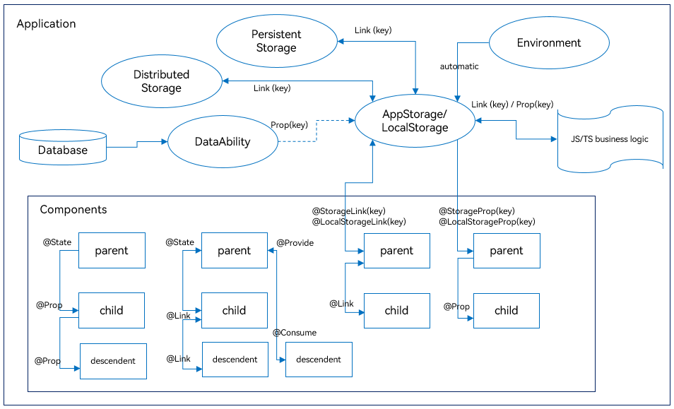

# State Management Overview


In previous examples, most of the pages built are static pages, which are delivered to the end user without having to be processed. If you are building dynamic, interactive pages, you need to master state management.


  **Figure 1** State managed UI 


In the preceding example, the interaction between the user and the application triggers an update in the text state, which in turn triggers re-rendering of the UI. As a result, the **Hello World** text changes to **Hello ArkUI**.


In the declarative UI framework, the UI is the execution result of the application state. You build a UI model in which the application runtime state is a parameter. When the parameter is changed, the UI as the return result is updated accordingly. This process of UI re-rendering caused by the application runtime state changes is called the state management mechanism in ArkUI.


Custom components have variables. A variable must be decorated by a decorator whenever the re-rendering of the UI depends on this variable. Otherwise, the UI is rendered only at initialization and will not be updated. The following figure shows the relationship between the state and view (UI).


- View (UI): UI rendering, which is visual representation of the UI description in the **build** method and \@Builder decorated method.

- State: data that drives the UI to re-render. State data is changed by invoking the event method of the component. The change of the state data triggers the re-rendering of the UI.


Before reading this topic, you are advised to read [Basic Syntax Overview](./arkts-basic-syntax-overview.md), [Declarative UI Description](./arkts-declarative-ui-description.md), and [Creating a Custom Component](./arkts-create-custom-components.md) to have an understanding of the basic syntax of UI paradigms.

## Basic Concepts

- State variable: a variable decorated by a state decorator. Its value change will trigger UI re-renders. Example: @State num: number = 1, where @State is a state decorator and **num** is a state variable.

- Regular variable: a variable that is not decorated by a state decorator and is usually used for auxiliary calculation. Its value change will not trigger UI re-renders. In the following example, the **increaseBy** variable is a regular variable.

- Data source/Synchronization source: original source of a state variable, which can be synchronized to different state data. Generally, it is the data passed from the parent component to the child component. In the following example, the data source is **count: 1**.

- Named parameter mechanism: a mechanism where the parent component passes state variables to the child component by specifying parameters. It is the primary means of passing synchronization parameters from the parent component to the child component. Example: **CompA({ aProp: this.aProp })**.

- Initialization from the parent component: a process where the parent component uses the named parameter mechanism to pass specified parameters to the child component. The default value used in local initialization will be overwritten by the value passed from the parent component. Example:

  ```ts
  @Component
  struct MyComponent {
    @State count: number = 0;
    private increaseBy: number = 1;

    build() {
    }
  }

  @Entry
  @Component
  struct Parent {
    build() {
      Column() {
        // Initialization from the parent component: The named parameter specified here will overwrite the default value defined locally.
        MyComponent({ count: 1, increaseBy: 2 })
      }
    }
  }
  ```

- Child component initialization: a capability to pass state variables to the child component to initialize the corresponding state variables therein. The example is the same as above.

- Local initialization: a process where a value is assigned to a variable as its default value in the variable declaration. Example: \@State count: number = 0.

>**NOTE**
>
>Currently, the state management can be used only in the UI main thread and cannot be used in subthreads, Worker, or TaskPool.


## State Management (V1)

You can develop applications in the state management of V1.

### Decorator Overview

ArkUI state management V1 provides a diverse array of decorators. You can use these decorators to observe state variables changes within a component or globally and pass the changes between different component levels (for example, between parent and child components or grandparent and grandchild components). According to the scope of the state variable, decorators can be roughly classified into the following types:


- Decorator for managing the component states: used to observe the variable changes in components on the same component tree (that is, on the same page) or at different component levels.

- Decorators for managing the application states: used to observe state changes on different pages or even different UIAbilities.


According to the data transfer mode and synchronization type, decorators can also be classified into the following types:


- Decorators that allow for one-way (read-only) transfer

- Decorators that allow for two-way (mutable) transfer


The following figure illustrates the decorators. For details, see [Component State Management](arkts-state.md) and [Application State Management](arkts-application-state-management-overview.md). You can use these decorators at your disposal to implement linkage between data and the UI.





In the preceding figure, the decorators in the Components area are used for state management at the component level, while others are used for state management at the application level. You can use [@StorageLink](arkts-appstorage.md#storagelink) or [@LocalStorageLink](arkts-localstorage.md#localstoragelink) to implement two-way synchronization of the application and component state, and [@StorageProp](arkts-appstorage.md#storageprop) or [@LocalStorageProp](arkts-localstorage.md#localstorageprop) to implement one-way synchronization.


Decorators for [component state management](arkts-state.md):


- [\@State](arkts-state.md): An \@State decorated variable holds the state of the owning component. It can be the source of one- or two-way synchronization with child components. When the variable changes, the dependent component will be updated. 

- [\@Prop](arkts-prop.md): An \@Prop decorated variable can create one-way synchronization with a variable of its parent component. \@Prop decorated variables are mutable, but changes are not synchronized to the parent component.

- [\@Link](arkts-link.md): An \@Link decorated variable creates two-way synchronization with a variable of its parent component. When the @Link decorated variable has its value changed, its source is updated as well; when the source updates, the @Link decorated variable will do as well.

- [\@Provide/\@Consume](arkts-provide-and-consume.md): Variables decorated by \@Provide/\@Consume are used for data synchronization across component levels. The components can be bound to the variables through aliases or attribute names. Data does not need to be passed through the named parameter mechanism.

- [\@Observed](arkts-observed-and-objectlink.md): \@Observed is a class decorator. You can use it to decorate the class that has multiple levels of nested objects or arrays to be observed. Note that \@Observed must be used with \@ObjectLink for two-way synchronization or with \@Prop for one-way synchronization.

- [\@ObjectLink](arkts-observed-and-objectlink.md): An \@ObjectLink decorated variable is used with an \@Observed decorated class of the parent component for two-way data synchronization. It is applicable in scenarios involving multiple levels of nested objects or arrays in the class.

> **NOTE**
>
> Only [\@Observed/\@ObjectLink](arkts-observed-and-objectlink.md) can be used to observe changes of nested attributes. Other decorators can be used to observe changes of attributes at the first layer only. For details, see the "Observed Changes and Behavior" part in each decorator section.


Decorators for [application state management](arkts-application-state-management-overview.md):


- [AppStorage](arkts-appstorage.md): a special [LocalStorage](arkts-localstorage.md) singleton instance. It is an application-wide database bound to the application process and can be linked to components through the [@StorageProp](arkts-appstorage.md#storageprop) and [@StorageLink](arkts-appstorage.md#storagelink) decorators.

- AppStorage is the hub for application state. Data that needs to interact with components (UI) is stored in AppStorage, including [PersistentStorage](arkts-persiststorage.md) and [environment](arkts-environment.md) variables. The UI accesses the data through the decorators or APIs provided by AppStorage.

- LocalStorage: an in-memory "database" for the application state declared by the application and typically used to share state across pages. It can be linked to the UI through the [@LocalStorageProp](arkts-localstorage.md#localstorageprop) and [@LocalStorageLink](arkts-localstorage.md#localstoragelink) decorators.


### Other Features in State Management V1

[\@Watch](arkts-watch.md): listens for the changes of state variables.


[$$operator](arkts-two-way-sync.md): provides a TS variable by-reference to a built-in component so that the variable value and the internal state of that component are kept in sync.

## State Management (V2)

State management V2 adds new features, such as in-depth observation and property-level update, to state management V1.

> **NOTE**
>
> Currently, the capabilities of state management V2 are still under optimization. You are advised to use them properly.

### How State Management V2 Stacks Against State Management V1

State management V1 uses a proxy to observe data. When a state variable is created, a data proxy observer is also created. The observer can sense the proxy change but cannot sense the actual data change. Therefore, the observer has the following restrictions:

- State variables cannot exist independently of the UI. When the same data is proxied by multiple views, the change in one view cannot be synchronized to other views.
- Only the changes at the first layer of object attributes can be sensed, and in-depth observation and listening are not available.
- Redundant re-renders exist in scenarios where attributes in an object are changed or elements in an array are changed.
- There are many restrictions on the use of decorators. The input and output of state variables are not specified in components, which is inconvenient for componentization.


State management V2 enhances the observation on the data itself. The data itself is observable. This means that changing the data triggers the update of the corresponding view. Compared with state management V1, state management V2 has the following advantages:

- State variables are independent of the UI. Changing data triggers the update of the corresponding view.

- In-depth observation and listening on objects is supported, and the in-depth observation mechanism does not affect the observation performance.

- Objects can be updated at the attribute level, and arrays at the element level.

- The decorators are easier to use and more scalable. The input and output are specified in components, which facilitates componentization.


### Decorator Overview

State management of V2 provides a new set of decorators.

- [\@ObservedV2](arkts-new-observedV2-and-trace.md): \@ObservedV2 allows for in-depth observation on the decorated classes. \@ObservedV2 and \@Trace are used in pairs to enable in-depth observation of properties in a class.

- [\@Trace](arkts-new-observedV2-and-trace.md): \@Trace is used to decorate a property in an \@ObservedV2 class, enabling the property to be observed.

- [\@ComponentV2](arkts-new-componentV2.md): In structs decorated by \@ComponentV2, the following decorators can be used: \@Local, \@Param, \@Event, \@Once, \@Monitor, \@Provider and \@Consumer.

- [\@Local](arkts-new-local.md): An \@Local decorated variable is internal state of the component and cannot be initialized externally.

- [\@Param](arkts-new-param.md): An \@Param decorated variable is used as the input of the component and can be initialized and synchronized externally.

- [\@Once](arkts-new-once.md): An \@Once decorated variable is synchronized only once during initialization and must be used together with \@Param.

- [\@Event](arkts-new-event.md): An \@Event decorated method, as component output, can be used to affect variables in the parent component.

- [\@Monitor](arkts-new-monitor.md): \@Monitor is used in custom components decorated by \@ComponentV2 or classes decorated by \@ObservedV2 to implement in-depth observation on state variables.

- [\@Provider and \@Consumer](arkts-new-Provider-and-Consumer.md): These decorators are used to implement two-way synchronization across component levels.

- [\@Computed](arkts-new-Computed.md): An \@Computed decorated method is a computed property, for which computation is performed only once when the value changes. It is mainly used to solve the performance problem caused by repeated computation when the UI reuses the property multiple times.

- [!! Syntax](arkts-new-binding.md): The **!!** syntax is syntax sugar used for two-way binding.

### Capability Comparison Between State Management V1 and V2

| V1 Capability  | V2 Capability                                            | Description                                                        |
| ------------ | ------------------------------------------------------ | ------------------------------------------------------------ |
| \@Observed   | \@ObservedV2                                           | Indicates that this object is an observable object. However, each of them have different capabilities.<br>\@Observed is used to observe the top-level properties and it takes effect only when it is used together with \@ObjectLink.<br>\@ObservedV2 does not have the observation capability. It only indicates that this class is observable. To observe the class properties, use together with \@Trace.|
| \@Track      | \@Trace                                                | \@Track is used for accurate observation. If it is not used, class properties cannot be accurately observed.<br>\@Trace decorated properties can be accurately traced and observed.|
| \@Component  | \@ComponentV2                                          | \@Component is the custom component decorator used with the state variables of V1.<br>@ComponentV2 is the custom component decorator used with the state variables of V2.|
| \@State      | No external initialization: @Local<br>External initialization once: \@Param and \@Once| \@State and \@Local decorated variables can work as the data source. The difference is that \@State can be initialized through external input, but \@Local cannot.|
| \@Prop       | \@Param                                                | Similar to \@Param, \@Prop is used to decorate custom component variables. When the input parameter is of the complex type, \@Prop is used to deep copy and \@Param is used to import the parameter.|
| \@Link       | \@Param\@Event                                         | \@Link implements a two-way synchronization encapsulated by the framework of V1. Developers using V2 can implement the two-way synchronization through @Param and @Event.|
| \@ObjectLink            | \@Param                   | Compatible. \@ObjectLink needs to be initialized by the instance of the @Observed decorated class, but \@Param does not have this constraint.|
| \@Provide    | \@Provider                                             | Compatible.                                                      |
| \@Consume    | \@Consumer                                             | Compatible.                                                      |
| \@Watch               | \@Monitor                | \@Watch is used to listen for the changes of state variables and their top-level properties in V1. Observable changes of state variables can trigger the \@Watch listening event.<br>\@Monitor is used to listen for the changes of state variables in V2. Used together with \@Trace, in-depth changes can be listened. When a state variable changes frequently in an event, only the final result is used to determine whether to trigger the \@Monitor listening event.|
| LocalStorage               | Global \@ObservedV2 and \@Trace  | Compatible.|
| AppStorage               | AppStorageV2   | Compatible.|
| Environment       | Calls the ability APIs to obtain system environment variables.  | This capability is coupled with the AppStorage. In V2, you can directly call the ability APIs to obtain system environment variables.|
| PersistentStorage     | PersistenceV2   | The persistence capability of PersistentStorage is coupled with the AppStorage, while that of PersistenceV2 can be used independently.|
| Custom component lifecycle    | Custom component lifecycle  | Both supported. Example: [aboutToAppear](../reference/apis-arkui/arkui-ts/ts-custom-component-lifecycle.md#abouttoappear), [onDidBuild](../reference/apis-arkui/arkui-ts/ts-custom-component-lifecycle.md#ondidbuild12), and [aboutToDisappear](../reference/apis-arkui/arkui-ts/ts-custom-component-lifecycle.md#abouttodisappear)|
| Page lifecycle    | Page lifecycle  | Both supported. Example: [onPageShow](../reference/apis-arkui/arkui-ts/ts-custom-component-lifecycle.md#onpageshow), [onPageHide](../reference/apis-arkui/arkui-ts/ts-custom-component-lifecycle.md#onpagehide), and [onBackPress](../reference/apis-arkui/arkui-ts/ts-custom-component-lifecycle.md#onbackpress) |
| \@Reusable   | \@ReusableV2                                                 | Component reuse. Example: [aboutToReuse](../reference/apis-arkui/arkui-ts/ts-custom-component-lifecycle.md#abouttoreuse10) and [aboutToRecycle](../reference/apis-arkui/arkui-ts/ts-custom-component-lifecycle.md#abouttorecycle10)|
| $$            | !!         | Two-way binding. For V2, you are advised to use **!!** to implement a two-way binding.|
| \@CustomDialog | The [openCustomDialog](../../application-dev/reference/apis-arkui/js-apis-arkui-UIContext.md#opencustomdialog12) API  | Custom dialog box. For V2, you are advised to use **openCustomDialog** to implement a custom dialog box.|
| withTheme     | withTheme   | Theme. Used to set a custom theme style for specific application pages. Example: [onWillApplyTheme](../reference/apis-arkui/arkui-ts/ts-custom-component-lifecycle.md#onwillapplytheme12)<br>Since API version 16, this API is supported in the components of V2.|
| Advanced components    | Not available yet  | Advanced components. Example: [DownloadFileButton](../../application-dev/reference/apis-arkui/arkui-ts/ohos-arkui-advanced-DownloadFileButton.md), [ProgressButton](../../application-dev/reference/apis-arkui/arkui-ts/ohos-arkui-advanced-ProgressButton.md), and [SegmentButton](../../application-dev/reference/apis-arkui/arkui-ts/ohos-arkui-advanced-SegmentButton.md)|
| animateTo | Partially supported| In some scenarios, exception occurs when **animateTo** is used in state management V2. For details, see [Using animationTo Failed in State Management V2](./arkts-new-local.md#using-animationto-failed-in-state-management-v2).|

For details about how to migrate applications from V1 to V2, see [Migrating Applications from V1 to V2](./arkts-v1-v2-migration.md).<br>For details about how to use decorators of V1 and V2 together, see [Mixing Use of Custom Components](./arkts-custom-component-mixed-scenarios.md).
