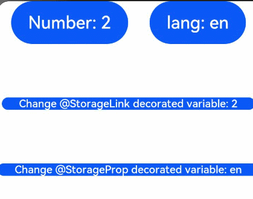

# State Management with Application-level Variables

This topic covers how to manage the application status with application-level variables. For details about the APIs, see [State Management with Application-level Variables](../reference/arkui-ts/ts-state-management.md).

## AppStorage

The [AppStorage](../reference/arkui-ts/ts-state-management.md#appstorage) is a singleton object in an application that provides central storage for changing state attributes of an application. It is created by the UI framework when the application is started and destroyed when the application exits.

The **AppStorage** contains all the state attributes that need to be accessed throughout the application. It retains all attributes and their values as long as the application remains running, and the attribute values can be accessed through unique key values.

Components can synchronize the application state data with the **AppStorage** through decorators. The application service logic can also be implemented by accessing the **AppStorage** through APIs.

The selection state attribute of the **AppStorage** can be synchronized with different data sources or data sinks. These data sources and data sinks can be local or remote devices and provide different functions, such as data persistence. Such data sources and data sinks can be implemented independently of the UI in the service logic.

By default, the attributes in the **AppStorage** are mutable. If needed, **AppStorage** can also use immutable (read-only) attributes.

> **NOTE**
>
> [Worker](../reference/apis/js-apis-worker.md) can interact with the main thread only through [postMessage](../reference/apis/js-apis-worker.md#postmessage).

### @StorageLink Decorator

Two-way data binding can be established between components and the **AppStorage** through state variables decorated by **@StorageLink(*key*)**. Wherein, **key** is the attribute key value in the **AppStorage**. When a component containing the **@StorageLink** decorated variable is created, the variable is initialized using the value in the **AppStorage**. Changes made to this variable in the component will be first synchronized to the **AppStorage**, and then to other bound instances, such as **PersistentStorage** or other bound UI components.

### @StorageProp Decorator

One-way data binding can be established between components and the **AppStorage** through state variables decorated by **@StorageProp(*key*)**. Wherein, **key** is the attribute key value in the **AppStorage**. When a component containing the **@StorageProp** decorated variable is created, the variable is initialized using the value in the **AppStorage**. Changes made to the value in the **AppStorage** will cause the bound UI component to update the state.

### Example

Each time the user clicks the **Count** button, the value of **this.varA** will increase by 1. This variable is synchronized with **varA** in the **AppStorage**. Each time the user clicks the language button, the value of **languageCode** in the **AppStorage** will be changed, and the change is synchronized to the **this.languageCode** variable.

```ts
// xxx.ets
@Entry
@Component
struct ComponentA {
  @StorageLink('varA') varA: number = 2
  @StorageProp('languageCode') languageCode: string = 'en'
  private label: string = 'count'

  aboutToAppear() {
    this.label = (this.languageCode === 'en') ? 'Number' : 'Count'
  }

  build() {
    Column() {
      Row({ space: 20 }) {
        Button(`${this.label}: ${this.varA}`)
          .onClick(() => {
            AppStorage.Set<number>('varA', AppStorage.Get<number>('varA') + 1)
          })
        Button(`language: ${this.languageCode}`)
          .onClick(() => {
            if (AppStorage.Get<string>('languageCode') === 'zh') {
              AppStorage.Set<string>('languageCode', 'en')
            } else {
              AppStorage.Set<string>('languageCode', 'zh')
            }
            this.label = (this.languageCode === 'en') ? 'Number' : 'Count'
          })
      }
      .margin({ bottom: 50 })

      Row() {
        Button (`Change @StorageLink decorated variable: ${this.varA}`).height(40).fontSize(14)
          .onClick(() => {
            this.varA++
          })
      }.margin({ bottom: 50 })

      Row() {
        Button (`Change @StorageProp decorated variable: ${this.languageCode}`).height(40).fontSize(14)
          .onClick(() => {
            if (this.languageCode === 'zh') {
              this.languageCode = 'en'
            } else {
              this.languageCode = 'zh'
            }
          })
      }
    }
  }
}
```



## LocalStorage

> **NOTE**
> 
> This API is supported since API version 9. Updates will be marked with a superscript to indicate their earliest API version.

The **LocalStorage** is a storage unit in an application. Its lifecycle follows its associated ability. In the stage model, the **LocalStorage** provides global data isolation between abilities and applies to where a data sharing scope smaller than that provided by the **AppStorage** is required. The **LocalStorage** also provides storage for application-wide mutable and immutable state attributes, which are used for building part of the application UI, such as an ability UI. The **LocalStorage** resolves the data interference between the application and the abilities and, in multi-instance scenarios, data interference between different **Ability** instances under the same **Ability** class. In distributed migration scenarios, **Ability**, as the minimum unit for the system to schedule applications, allows for easier component data migration when working with the **LocalStorage**.

At the application layer, multiple **LocalStorage** instances can be created for an application, each corresponding to an ability of the application.

An application can have multiple abilities. At most one **LocalStorage** instance can be allocated to the components in an ability. In addition, all components in the ability inherit access to the objects stored in the **LocalStorage** instance.

A component can access a maximum of one **LocalStorage** instance, and one **LocalStorage** instance can be assigned to multiple components.

### @LocalStorageLink Decorator

Two-way data binding can be established between a component and the **LocalStorage** through the component's state variable decorated by **@LocalStorageLink(*key*)**. Wherein, **key** is the attribute key value in the **LocalStorage**. When a component that contains a **@LocalStorageLink** decorated state variable is created, the state variable is initialized with the initial value in the **LocalStorage**. If no initial value is assigned in the **LocalStorage**, the state variable will use the value defined by **@LocalStorageLink**. Changes made to the **@LocalStorageLink** decorated variable in a component will be first synchronized to the **LocalStorage**, and then to other bound UI components under the same ability.

### @LocalStorageProp Decorator

One-way data binding can be established between a component and the **LocalStorage** through the component's state variable decorated by **@LocalStorageProp(*key*)**. Wherein, **key** is the attribute key value in the **LocalStorage**. When a component that contains a **@LocalStorageProp** decorated state variable is created, the state variable is initialized with the initial value in the **LocalStorage**. Changes made to the value in the **LocalStorage** will cause all UI components under the current ability to update the state.

> **NOTE**
>
> If a **LocalStorage** instance has initial values assigned when being created, these values will be used for the **@LocalStorageLink** and **@LocalStorageProp** decorated state variables in the component. Otherwise, the initial values assigned for **@LocalStorageLink** and **@LocalStorageProp** will be used instead.

### Example 1: Creating a LocalStorage Instance in an Ability

The **LocalStorage** is loaded through the **loadContent** API. For details, see [loadContent](../reference/apis/js-apis-window.md#loadcontent9-1).

```ts
// MainAbility.ts
import Ability from '@ohos.application.Ability'

export default class MainAbility extends Ability {
    storage: LocalStorage

    onCreate() {
        this.storage = new LocalStorage()
        this.storage.setOrCreate('storageSimpleProp', 121)
        console.info('[Demo MainAbility onCreate]')
    }

    onDestroy() {
        console.info('[Demo MainAbility onDestroy]')
    }

    onWindowStageCreate(windowStage) {
        // storage is passed to the loadContent API as a parameter.
        windowStage.loadContent('pages/index', this.storage)
    }

    onWindowStageDestroy() {
        console.info('[Demo] MainAbility onWindowStageDestroy')
    }

    onForeground() {
        console.info('[Demo] MainAbility onForeground')
    }

    onBackground() {
        console.info('[Demo] MainAbility onBackground')
    }
}
```

The **@Component** decorated component obtains data.

```ts
// index.ets
let storage = LocalStorage.GetShared()

@Entry(storage)
@Component
struct LocalStorageComponent {
  @LocalStorageLink('storageSimpleProp') simpleVarName: number = 0

  build() {
    Column() {
      Button(`LocalStorageLink: ${this.simpleVarName.toString()}`)
        .margin(20)
        .onClick(() => {
          this.simpleVarName += 1
        })
      Text(JSON.stringify(this.simpleVarName))
        .fontSize(50)
      LocalStorageComponentProp()
    }.width('100%')
  }
}

@Component
struct LocalStorageComponentProp {
  @LocalStorageProp('storageSimpleProp') simpleVarName: number = 0

  build() {
    Column() {
      Button(`LocalStorageProp: ${this.simpleVarName.toString()}`)
        .margin(20)
        .onClick(() => {
          this.simpleVarName += 1
        })
      Text(JSON.stringify(this.simpleVarName))
        .fontSize(50)
    }.width('100%')
  }
}
```


### Example 2: Defining LocalStorage on the Entry Page

```ts
// xxx.ets
let storage = new LocalStorage({ "PropA": 47 })

@Entry(storage)
@Component
struct ComA {
  @LocalStorageLink("PropA") storageLink: number = 1

  build() {
    Column() {
      Text(`Parent from LocalStorage ${this.storageLink}`)
        .fontSize(18)
        .margin(20)
        .onClick(() => this.storageLink += 1)
      Child()
    }
  }
}

@Component
struct Child {
  @LocalStorageLink("PropA") storageLink: number = 1

  build() {
    Text(`Child from LocalStorage ${this.storageLink}`)
      .fontSize(18)
      .margin(20)
      .onClick(() => this.storageLink += 1)
  }
}
```


## PersistentStorage

[PersistentStorage](../reference/arkui-ts/ts-state-management.md#persistentstorage) provides a set of static methods for managing persistent data of applications. Persistent data with specific tags can be linked to the **AppStorage**, and then the persistent data can be accessed through the **AppStorage** APIs. Alternatively, the **@StorageLink** decorator can be used to access the variable that matches the specific key.

> **NOTE**
>
> - When using the **PersistProp** API in **PersistentStorage**, ensure that the input key exists in the **AppStorage**.
> - The **DeleteProp** API in **PersistentStorage** takes effect only for the data that has been linked during the current application startup.

```ts
// xxx.ets
PersistentStorage.PersistProp('highScore', '0')

@Entry
@Component
struct PersistentComponent {
  @StorageLink('highScore') highScore: string = '0'
  @State currentScore: number = 0

  build() {
    Column() {
      if (this.currentScore === Number(this.highScore)) {
        Text(`new highScore : ${this.highScore}`).fontSize(18)
      }
      Button(`goal!, currentScore : ${this.currentScore}`)
        .margin(20)
        .onClick(() => {
          this.currentScore++
          if (this.currentScore > Number(this.highScore)) {
            this.highScore = this.currentScore.toString()
          }
        })
    }.width('100%')
  }
}
```


## Environment

[Environment](../reference/arkui-ts/ts-state-management.md#environment) is a singleton object created by the framework when the application is started. It provides the **AppStorage** with an array of environment state attributes required by the application. These attributes, such as the system language and color mode, describe the device environment where the application runs. **Environment** and its attributes are immutable, and all attribute values are of simple types. The following example shows how to obtain whether accessibility is enabled from **Environment**:

```ts
Environment.EnvProp('accessibilityEnabled', 'default')
var enable = AppStorage.Get('accessibilityEnabled')
```

**accessibilityEnabled** is the default system variable identifier provided by **Environment**. You need to bind the corresponding system attribute to the **AppStorage**. Then, you can use the methods or decorators in the **AppStorage** to access the corresponding system attribute data.
