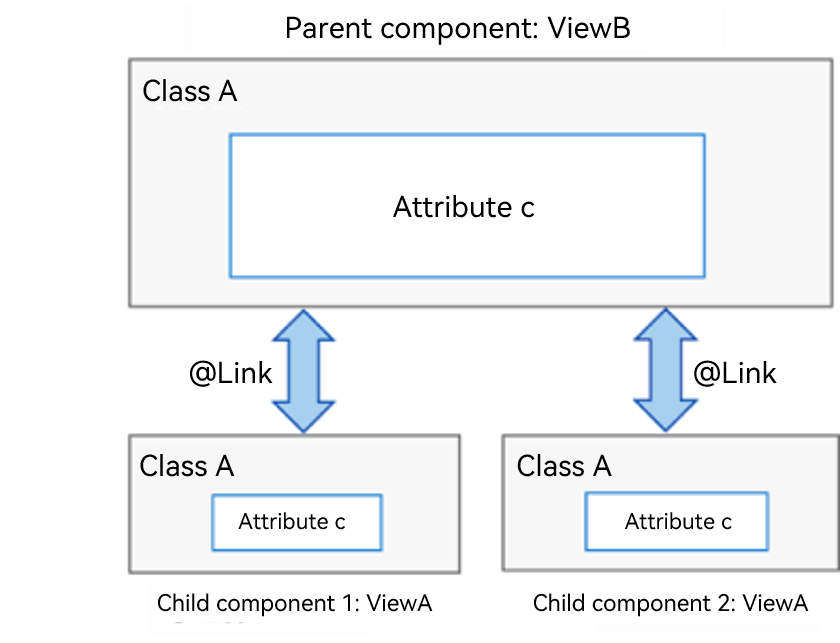
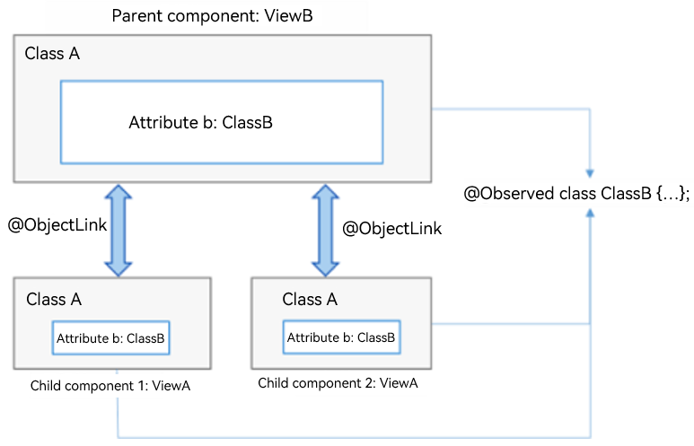

# State Management with Page-level Variables

This topic covers how to manage the states with page-level variables with the **@State**, **@Prop**, **@Link**, **@Provide**, **@Consume**, **@ObjectLink**, **@Observed**, and **@Watch** decorators.

For details about the constraints of the **@State**, **@Provide**, **@Link**, and **@Consume** decorated state variables, see [Restrictions on Data Type Declarations of State Variables](./arkts-restrictions-and-extensions.md).

## @State

The **@State** decorated variable is the internal state data of the component. When the state data is modified, the **build** method of the component is called to refresh the UI.

The **@State** data has the following features:

- Support for multiple types: The following types are supported: strong types by value and by reference, including **class**, **number**, **boolean**, **string**, as well as arrays of these types, that is, **Array\<class>**, **Array\<number>**, **Array\<boolean>**, and **Array\<string>**. **object** and **any** are not supported.
- Support for multiple instances: Multiple instances can coexist in a component. The internal state data of different instances is independent.
- **Private**: An attribute marked with **@State** can only be accessed within the component.
- Local initialization required: Initial values must be allocated to all **@State** decorated variables. Uninitialized variables may cause undefined framework exceptions.
- Support for setting of initial attribute values based on the state variable name: When creating a component instance, you can explicitly specify the initial value of the **@State** decorated attribute based on the variable name.

**Example**

In the following example:

- Two **@State** decorated variables, **count** and **title**, have been defined for **MyComponent**. If the value of **count** or **title** changes, the **build** method of **MyComponent** needs to be called to render the component again.

- The **EntryComponent** has multiple **MyComponent** instances. The internal status change of the first **MyComponent** instance does not affect the second **MyComponent** instance.

- When creating a **MyComponent** instance, initialize the variables in the component based on the variable name. For example:

  ```ts
  MyComponent({ title: { value: 'Hello World 2' }, count: 7 })
  ```

```ts
// xxx.ets
class Model {
  value: string

  constructor(value: string) {
    this.value = value
  }
}

@Entry
@Component
struct EntryComponent {
  build() {
    Column() {
      MyComponent ({ count: 1,increaseBy:2 }) // First MyComponent instance
      MyComponent({ title: { value:'Hello World 2' }, count: 7 }) // Second MyComponent instance
    }
  }
}

@Component
struct MyComponent {
  @State title: Model = { value: 'Hello World' }
  @State count: number = 0
  private toggle: string = 'Hello World'
  private increaseBy: number = 1

  build() {
    Column() {
      Text(`${this.title.value}`).fontSize(30)
      Button('Click to change title')
        .margin(20)
        .onClick(() => {
          // Change the value of the internal status variable title.
          this.title.value = (this.toggle == this.title.value) ? 'Hello World' : 'Hello ArkUI'
        })

      Button(`Click to increase count=${this.count}`)
        .margin(20)
        .onClick(() => {
          // Change the value of the internal status variable count.
          this.count += this.increaseBy
        })
    }
  }
}
```


## @Prop

**@Prop** and **@State** have the same semantics but different initialization modes. Variables decorated by **@Prop** must be initialized using the **@State** decorated variable provided by their parent components. The **@Prop** decorated variable can be modified in the component, but the modification is not updated to the parent component; that is, **@Prop** uses one-way data binding.

The **@Prop** decorated state variable has the following features:

- Support for simple types: The number, string, and boolean types are supported.
- Private: Data is accessed only within the component.
- Support for multiple instances: A component can have multiple attributes decorated by **@Prop**.
- Support for initialization with a value passed to the @Prop decorated variable: When a new instance of the component is created, all **@Prop** decorated variables must be initialized. Initialization inside the component is not supported.

**Example**

In the preceding example, when the user presses **+1** or **-1**, the status of the parent component changes and the **build** method is executed again. In this case, a new **CountDownComponent** instance is created. The **countDownStartValue** attribute of the parent component is used to initialize the **@Prop** decorated variable of the child component. When the **count - costOfOneAttempt** button of the child component is touched, the value of the **@Prop** decorated variable **count** is changed. As a result, the **CountDownComponent** is rendered again. However, the change of the **count** value does not affect the **countDownStartValue** value of the parent component.

```ts
// xxx.ets
@Entry
@Component
struct ParentComponent {
  @State countDownStartValue: number = 10 // Initialize countDownStartValue

  build() {
    Column() {
      Text(`Grant ${this.countDownStartValue} nuggets to play.`).fontSize(18)
      Button('+1 - Nuggets in New Game')
        .margin(15)
        .onClick(() => {
          this.countDownStartValue += 1
        })

      Button('-1  - Nuggets in New Game')
        .margin(15)
        .onClick(() => {
          this.countDownStartValue -= 1
        })
      // When creating a child component, you must provide the initial value of its @Prop decorated variable count in the constructor parameter and initialize the regular variable costOfOneAttempt (not @Prop decorated).
      CountDownComponent({ count: this.countDownStartValue, costOfOneAttempt: 2 })
    }
  }
}

@Component
struct CountDownComponent {
  @Prop count: number
  private costOfOneAttempt: number

  build() {
    Column() {
      if (this.count > 0) {
        Text(`You have ${this.count} Nuggets left`).fontSize(18)
      } else {
        Text('Game over!').fontSize(18)
      }

      Button('count - costOfOneAttempt')
        .margin(15)
        .onClick(() => {
          this.count -= this.costOfOneAttempt
        })
    }
  }
}
```


## @Link

Two-way binding can be established between the **@Link** decorated variable and the **@State** decorated variable of the parent component. The **@Link** data has the following features:

- Support for multiple types: The **@Link** decorated variables support the data types the same as the **@State** decorated variables; that is, the value can be of the following types: class, number, string, boolean, or arrays of these types.
- Private: Data is accessed only within the component.
- Single data source: The variable of the parent component used for initializing the **@Link** decorated variable must be a **@State** decorated variable.
- **Two-way binding**: When a child component changes the **@Link** decorated variable, the **@State** decorated variable of its parent component is also changed.
- Support for initialization with the variable reference passed to the @Link decorated variable: When creating an instance of the component, you must use the naming parameter to initialize all **@Link** decorated variables. **@Link** decorated variables can be initialized by using the reference of the **@State** or **@Link** decorated variable. Wherein, the **@State** decorated variables can be referenced using the **'$'** operator.

> **NOTE**
>
> **@Link** decorated variables cannot be initialized within the component.

**Simple Type Example**

The **@Link** semantics are derived from the '**$**' operator. In other words, **$isPlaying** is the two-way binding of the internal state **this.isPlaying**. When the button in the **PlayButton** child component is touched, the value of the **@Link** decorated variable is changed, and **PlayButton** together with the **\<Text>** and **\<Button>** components of the parent component is refreshed. Similarly, when the button in the parent component is touched, the value of **this.isPlaying** is changed, and **PlayButton** together with the **\<Text>** and **\<Button>** components of the parent component is refreshed.

```ts
// xxx.ets
@Entry
@Component
struct Player {
  @State isPlaying: boolean = false

  build() {
    Column() {
      PlayButton({ buttonPlaying: $isPlaying })
      Text(`Player is ${this.isPlaying ? '' : 'not'} playing`).fontSize(18)
      Button('Parent:' + this.isPlaying)
        .margin(15)
        .onClick(() => {
          this.isPlaying = !this.isPlaying
        })
    }
  }
}

@Component
struct PlayButton {
  @Link buttonPlaying: boolean

  build() {
    Column() {
      Button(this.buttonPlaying ? 'pause' : 'play')
        .margin(20)
        .onClick(() => {
          this.buttonPlaying = !this.buttonPlaying
        })
    }
  }
}
```

**Complex Type Example**

```ts
// xxx.ets
@Entry
@Component
struct Parent {
  @State arr: number[] = [1, 2, 3]

  build() {
    Column() {
      Child({ items: $arr })
      Button('Parent Button: splice')
        .margin(10)
        .onClick(() => {
          this.arr.splice(0, 1, 60)
        })
      ForEach(this.arr, item => {
        Text(item.toString()).fontSize(18).margin(10)
      }, item => item.toString())
    }
  }
}


@Component
struct Child {
  @Link items: number[]

  build() {
    Column() {
      Button('Child Button1: push')
        .margin(15)
        .onClick(() => {
          this.items.push(100)
        })
      Button('Child Button2: replace whole item')
        .margin(15)
        .onClick(() => {
          this.items = [100, 200, 300]
        })
    }
  }
}
```

**Example of Using @Link, @State, and @Prop Together**

In the following example, **ParentView** contains two child components: **ChildA** and **ChildB**. The **counter** state variable of **ParentView** is used to initialize the **@Prop** decorated variable of **ChildA** and the **@Link** decorated variable of **ChildB**.

- **@Link** establishes two-way binding between **ChildB** and **ParentView**.Value changes of the **counterRef** state variable in **ChildB** will be synchronized to **ParentView** and **ChildA**.
- **@Prop** establishes one-way binding between **ChildA** and **ParentView**. Value changes of the **counterVal** state variable in **ChildA** will trigger a re-render of **ChildA**, but will not be synchronized to **ParentView** or **ChildB**.

```ts
// xxx.ets
@Entry
@Component
struct ParentView {
  @State counter: number = 0

  build() {
    Column() {
      ChildA({ counterVal: this.counter })
      ChildB({ counterRef: $counter })
    }
  }
}

@Component
struct ChildA {
  @Prop counterVal: number

  build() {
    Button(`ChildA: (${this.counterVal}) + 1`)
      .margin(15)
      .onClick(() => {
        this.counterVal += 1
      })
  }
}

@Component
struct ChildB {
  @Link counterRef: number

  build() {
    Button(`ChildB: (${this.counterRef}) + 1`)
      .margin(15)
      .onClick(() => {
        this.counterRef += 1
      })
  }
}
```

## @Observed and @ObjectLink

When you need to set up bidirectional synchronization for a parent variable (**parent_a**) between the parent and child components, you can use **@State** to decorate the variable (**parent_a**) in the parent component and use **@Link** to decorate the corresponding variable (**child_a**) in the child component. In this way, data can be synchronized between the parent component and the specific child component, and between the parent component and its other child components. As shown below, bidirectional synchronization is configured for variables of **ClassA** in the parent and child components. If attribute **c** of the variable in child component 1 has its value changed, the parent component will be notified to synchronize the change. If attribute **c** in the parent component has its value changed, all child components will be notified to synchronize the change.



In the preceding example, full synchronization is performed for a data object. If you want to synchronize partial information of a data object in a parent component, and if the information is a class object, use **@ObjectLink** and **@Observed** instead, as shown below.



### Configuration Requirements

- **@Observed** applies to classes, and **@ObjectLink** applies to variables.

- The variables decorated by **@ObjectLink** must be of the class type.
  - The classes must be decorated by **@Observed**.
  - Parameters of the simple types are not supported. You can use **@Prop** to perform unidirectional synchronization.

- **@ObjectLink** decorated variables are immutable.
  - Attribute changes are allowed. If an object is referenced by multiple **@ObjectLink** decorated variables, all custom components that have these variables will be notified for re-rendering.

- Default values cannot be set for **@ObjectLink** decorated variables.
  - The parent component must be initialized with a TypeScript expression that involves variables decorated by **@State**, **@Link**, **@StorageLink**, **@Provide**, or **@Consume**.

- **@ObjectLink** decorated variables are private variables and can be accessed only within the component.


### Example

```ts
// xxx.ets
// Use @ObjectLink and @Observed to set up bidirectional synchronization for the class object ClassA between the parent component ViewB and the child component ViewA. In this way, changes made to ClassA in ViewA will be synchronized to ViewB and other child components bound to ClassA.
var nextID: number = 0

@Observed
class ClassA {
  public name: string
  public c: number
  public id: number

  constructor(c: number, name: string = 'OK') {
    this.name = name
    this.c = c
    this.id = nextID++
  }
}

@Component
struct ViewA {
  label: string = 'ViewA1'
  @ObjectLink a: ClassA

  build() {
    Row() {
      Button(`ViewA [${this.label}] this.a.c= ${this.a.c} +1`)
        .onClick(() => {
          this.a.c += 1
        })
    }.margin({ top: 10 })
  }
}

@Entry
@Component
struct ViewB {
  @State arrA: ClassA[] = [new ClassA(0), new ClassA(0)]

  build() {
    Column() {
      ForEach(this.arrA, (item) => {
        ViewA({ label: `#${item.id}`, a: item })
      }, (item) => item.id.toString())
      ViewA({ label: `this.arrA[first]`, a: this.arrA[0] })
      ViewA({ label: `this.arrA[last]`, a: this.arrA[this.arrA.length - 1] })

      Button(`ViewB: reset array`)
        .margin({ top: 10 })
        .onClick(() => {
          this.arrA = [new ClassA(0), new ClassA(0)]
        })
      Button(`ViewB: push`)
        .margin({ top: 10 })
        .onClick(() => {
          this.arrA.push(new ClassA(0))
        })
      Button(`ViewB: shift`)
        .margin({ top: 10 })
        .onClick(() => {
          this.arrA.shift()
        })
    }.width('100%')
  }
}
```


## @Consume and @Provide

As the data provider, **@Provide** can update the data of child nodes and trigger page rendering. After **@Consume** detects that the **@Provide** decorated variable is updated, it will initiate re-rendering of the current custom component.

> **NOTE**
>
> To avoid infinite loops caused by circular reference, exercise caution when using **@Provide** and **@Consume**.

### @Provide

| Name          | Description                                                        |
| -------------- | ------------------------------------------------------------ |
| Decorator parameter    | A constant of the string type, which is used to set an alias for a decorated variable. If an alias is specified, implement the data update for this alias. If there is no alias, use the variable name as the alias. **@Provide(*'alias'*)** is recommended.|
| Synchronization mechanism      | The **@Provide** decorated variable is similar to the **@State** decorated variable. You can change the value of the variable to trigger a re-render. You can also modify the **@Consume** decorated variable to modify the **@State** decorated variable reversely.|
| Initial value        | The initial value must be set.                                            |
| Page re-rendering scenarios| Page re-rendering is triggered in the following scenarios:<br>- Changes of variables of simple types (boolean, string, and number)<br>- Changes of the **@Observed** decorated classes or their attributes<br>- Addition, deletion, or updating of elements in an array|

### @Consume

| Type  | Description            |
| ------ | ---------------- |
| Initial value| The default initial value cannot be set.|

### Example

```ts
// xxx.ets
@Entry
@Component
struct CompA {
  @Provide("reviewVote") reviewVotes: number = 0;

  build() {
    Column() {
      CompB()
      Button(`CompA: ${this.reviewVotes}`)
        .margin(10)
        .onClick(() => {
          this.reviewVotes += 1;
        })
    }
  }
}

@Component
struct CompB {
  build() {
    Column() {
      CompC()
    }
  }
}

@Component
struct CompC {
  @Consume("reviewVote") reviewVotes: number

  build() {
    Column() {
      Button(`CompC: ${this.reviewVotes}`)
        .margin(10)
        .onClick(() => {
          this.reviewVotes += 1
        })
    }.width('100%')
  }
}
```

## @Watch

**@Watch** is used to listen for changes of state variables. The syntax structure is as follows:

```ts
@State @Watch("onChanged") count : number = 0
```

As shown above, add an **@Watch** decorator to the target state variable to register an **onChanged** callback. When the state variable **count** is changed, the **onChanged** callback will be triggered.

**@Watch** can be used to listen for value changes of variables decorated by **@State**, **@Prop**, **@Link**, **@ObjectLink**, **@Provide**, **@Consume**, **@StorageProp**, and **@StorageLink**.


>  **NOTE**
>
>  **@Watch** cannot be used to listen for in-depth data modification, such as changes of object values in an array.

```ts
// xxx.ets
@Entry
@Component
struct CompA {
  @State @Watch('onBasketUpdated') shopBasket: Array<number> = [7, 12, 47, 3]
  @State totalPurchase: number = 0
  @State addPurchase: number = 0

  aboutToAppear() {
    this.updateTotal()
  }

  updateTotal(): number {
    let sum = 0;
    this.shopBasket.forEach((i) => {
      sum += i
    })
    // Calculate the total amount of items in the shopping basket. If the amount exceeds 100, the specified discount will be applied.
    this.totalPurchase = (sum < 100) ? sum : 0.9 * sum
    return this.totalPurchase
  }

  // This method is triggered when the value of shopBasket is changed.
  onBasketUpdated(propName: string): void {
    this.updateTotal()
  }

  build() {
    Column() {
      Button('add to basket ' + this.addPurchase)
        .margin(15)
        .onClick(() => {
          this.addPurchase = Math.round(100 * Math.random())
          this.shopBasket.push(this.addPurchase)
        })
      Text(`${this.totalPurchase}`)
        .fontSize(30)
    }
  }
}
```
