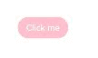

# stateStyles: Polymorphic Style


Unlike \@Styles and \@Extend, which are used to reuse styles only on static pages, stateStyles enables you to set state-specific styles.  


## Overview

stateStyles is an attribute method that sets the style based on the internal state of a component. It is similar to a CSS pseudo-class, with different syntax. ArkUI provides the following states:

- focused

- normal

- pressed

- disabled

- selected<sup>10+</sup>


## Application Scenarios


### Common Scenarios

This example shows the most basic application scenario of stateStyles. **Button1** is the first component and **Button2** the second component. When either of these components is pressed, the black style specified for **pressed** takes effect. When the Tab key is pressed for sequential navigation, **Button1** obtains focus first and is displayed in the pink style specified for **focus**. When **Button 2** is focused, it is displayed in the pink style specified for **focus**, and **Button1** changes to the red style specified for **normal**.


```ts
@Entry
@Component
struct StateStylesSample {
  build() {
    Column() {
      Button('Button1')
        .stateStyles({
          focused: {
            .backgroundColor(Color.Pink)
          },
          pressed: {
            .backgroundColor(Color.Black)
          },
          normal: {
            .backgroundColor(Color.Red)
          }
        })
        .margin(20)
      Button('Button2')
        .stateStyles({
          focused: {
            .backgroundColor(Color.Pink)
          },
          pressed: {
            .backgroundColor(Color.Black)
          },
          normal: {
            .backgroundColor(Color.Red)
          }
        })
    }.margin('30%')
  }
}
```


  **Figure 1** Focused and pressed states 




### Combined Use of \@Styles and stateStyles

The following example uses \@Styles to specify different states of stateStyles.


```ts
@Entry
@Component
struct MyComponent {
  @Styles normalStyle() {
    .backgroundColor(Color.Gray)
  }

  @Styles pressedStyle() {
    .backgroundColor(Color.Red)
  }

  build() {
    Column() {
      Text('Text1')
        .fontSize(50)
        .fontColor(Color.White)
        .stateStyles({
          normal: this.normalStyle,
          pressed: this.pressedStyle,
        })
    }
  }
}
```

  **Figure 2** Normal and pressed states 


### Using Regular Variables and State Variables in stateStyles

stateStyles can use **this** to bind regular variables and state variables in a component.


```ts
@Entry
@Component
struct CompWithInlineStateStyles {
  @State focusedColor: Color = Color.Red;
  normalColor: Color = Color.Green

  build() {
    Column() {
      Button('clickMe').height(100).width(100)
        .stateStyles({
          normal: {
            .backgroundColor(this.normalColor)
          },
          focused: {
            .backgroundColor(this.focusedColor)
          }
        })
        .onClick(() => {
          this.focusedColor = Color.Pink
        })
        .margin('30%')
    }
  }
}
```

By default, the button is displayed in green in the normal state. When you press the Tab key for the first time, the button is focused and displayed in the red style specified for **focus**. After a click event occurs and you press the Tab key again, the button is focused and changes to the pink style.

  **Figure 3** Change of the styles in focused state by a click 


