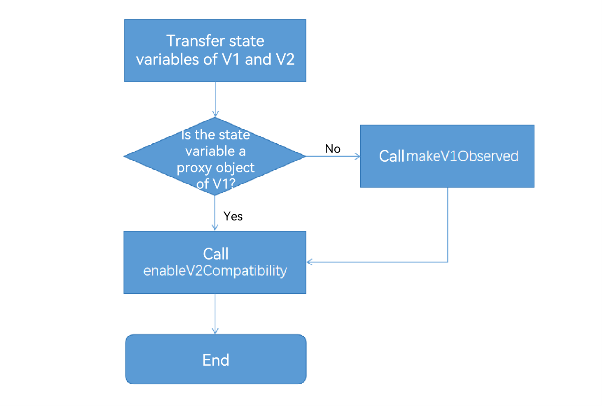

# Mixing Use of State Management V1 and V2

## Overview

During the evolution of the state management framework, state managements V1 and V2 are launched based on API version 7 and API version 12, respectively. For applications that have used state management V1 and need to be migrated to state management V2, see [Migrating Applications from V1 to V2](./arkts-v1-v2-migration.md).

For large-scale applications, V1 and V2 may be used together during the migration. In versions earlier than API version 18, strict verification is performed in the mixed use scenario, mainly in the transfer of complex objects. For details, see [Mixing Use of Custom Components](./arkts-custom-component-mixed-scenarios.md). To facilitate smooth migration to V2, API version 18 and later versions reduce the restrictions on the mixed use of V1 and V2. In addition, new methods [enableV2Compatibility](../reference/apis-arkui/js-apis-StateManagement.md#enablev2compatibility18) and [makeV1Observed](../reference/apis-arkui/js-apis-StateManagement.md#makev1observed18) are provided to help you solve related problems.

> **NOTE**
>
> In this topic, the symbol "->" is used to indicate the transfer of variables. For example, "V1 -> V2" indicates that the state variable of V1 is transferred to the V2.


## Verification Rules
In versions earlier than API version 18, the mixed use rules of state managements V1 and V2 can be summarized as follows:
1. Decorators of V1 cannot be used together with @ObservedV2.
2. Decorators of V2 cannot be used together with @Observed.
3. Only simple types can be transferred from V1 to V2. Complex types (built-in types), including Array, Map, Set, and Date, are not allowed.
4. Simple types or a common class can be transferred from V2 to V1, but built-in types such as Array, Map, Set, or Date are not allowed.

Since API version 18, only the first rule is still enabled, and the rest rules are open for verification. The following table lists the verification during compilation.

| Scenario | Earlier than API Version 18| API Version 18 and Later |
|------|----|------|
| Decorators of V1 and \@ObservedV2 are used together.  | An error is reported.| An error is reported.|
| Decorators of V2 and \@Observed are used together.| An error is reported.| No error is reported.|
| A common class is transferred from V1 to V2. | An error is reported.| No error is reported.|
| Built-in types such as Array, Map, Set, Date are transferred from V1 to V2. | An error is reported.| No error is reported.|
| A \@Observed decorated class is transferred from V1 to V2. | An error is reported.| No error is reported.|
| A \@ObservedV2 decorated class is transferred from V2 to V1. | An error is reported.| An error is reported.|
| Built-in types such as Array, Map, Set, Date are transferred from V2 to V1. | An error is reported.| No error is reported.|
| \@ObjectLink is initialized by a class that is not decorated by \@Observed. | An error is reported.| No error is reported.|

@ObservedV2 or @Trace has its own independent observation capability, which can be used in both \@ComponentV2 and \@Component. However, the state management framework does not allow the mixed use of observation capability of V1 and V2. Therefore, the first rule is still enabled.

## Available APIs
### makeV1Observed

static makeV1Observed\<T extends object\>(source: T): T

The [makeV1Observed](../reference/apis-arkui/js-apis-StateManagement.md#makev1observed18) API encapsulates an unobservable object into an observable object of state management V1. **makeV1Observed** has the same capability as that of @Observed and its return value can be used to initialize @ObjectLink.

>**NOTE**
>
>This API is supported since API version 18.

**Description**
- **makeV1Observed** is used together with **enableV2Compatibility** for V2 -> V1 transfer.
- **makeV1Observed** converts a common class, Array, Map, Set, or Date type to a state variable of V1. Its capability is equivalent to \@Observed. Therefore, the return value can be used to initialize \@ObjectLink.
- If the data received by **makeV1Observed** is already the state variable of V1, **makeV1Observed** returns itself without any change.
- **makeV1Observed** does not execute recursively. It only wraps the first layer into the state variable of V1.

**Constraints**
- The [collections](../reference/apis-arkts/js-apis-arkts-collections.md) type and [\@Sendable](../arkts-utils/arkts-sendable.md) decorated classes are not supported.
- Non-object types are not supported.
- **undefined** and **null** are not supported.
- The return values of \@ObservedV2 and [makeObserved](../reference/apis-arkui/js-apis-StateManagement.md#makeobserved), and variables of built-in types (such as Array, Map, Set, and Date) decorated by the decorators of V2 are not supported.


### enableV2Compatibility

static enableV2Compatibility\<T extends object\>(source: T): T

[enableV2Compatibility](../reference/apis-arkui/js-apis-StateManagement.md#enablev2compatibility18) enables the observation capability of V2 for the state variable of V1, that is, the state variable of V1 can be observed in \@ComponentV2.

>**NOTE**
>
>This API is supported since API version 18.

**Description**
- This API is mainly used in the V1 -> V2 transfer. After the state variable of V1 calls this API and is transferred to \@ComponentV2, the change can be observed in V2 to implement associated data update.
- **enableV2Compatibility** applies only to state variables of V1. The state variable of V1 is a variable decorated by the decorator of V1, such as \@Observed, \@State, \@Prop, \@Link, \@Provide, \@Consume, and \@ObjectLink (\@ObjectLink must be an instance decorated by \@Observed or the return value of **makeV1Observed**). Otherwise, the input parameter itself is returned.
- **enableV2Compatibility** recursively traverses all properties of the class and all subitems of Array, Set, or Map until non-V1 state variable data is found.

**Constraints**
- Non-object types are not supported.
- **undefined** and **null** are not supported.
- Non-V1 state variable data is not supported.
- The return values of \@ObservedV2 and [makeObserved](../reference/apis-arkui/js-apis-StateManagement.md#makeobserved), and variables of built-in types (such as Array, Map, Set, and Date) decorated by the decorators of V2 are not supported.

## Mixed Use Paradigm

Based on the [enableV2Compatibility](../reference/apis-arkui/js-apis-StateManagement.md#enablev2compatibility18) and [makeV1Observed](../reference/apis-arkui/js-apis-StateManagement.md#makev1observed18) APIs, the mixed use paradigm of V1 and V2 is as follows:

### V1->V2
- The state variable of V1 is transferred to \@Param of V2. Call **UIUtils.enableV2Compatibility** to enable the state variable of V1 to be observed in \@ComponentV2. For details, see [Common Scenarios](#v1-v2-1).
```ts
import { UIUtils } from '@kit.ArkUI';

@Observed
class ObservedClass {
}

@Entry
@Component
struct CompV1 {
  @State observedClass: ObservedClass = new ObservedClass();

  build() {
    Column() {
      CompV2({ observedClass: UIUtils.enableV2Compatibility(this.observedClass) })
    }
  }
}

@ComponentV2
struct CompV2 {
  @Param observedClass: ObservedClass = new ObservedClass();

  build() {
  }
}
```
- The state variables of V1 can be used to observe the first-layer properties. After **UIUtils.enableV2Compatibility** is called to transfer the variables to \@Param, \@Param is able to observe the changes of the first-layer properties.

The following table lists the observation capability in specific scenarios after **enableV2Compatibility** is called.

| \@Component (Parent) - > \@ComponentV2 (Child) | Observation Capability|
|------|----|
| Normal variable| No. **enableV2Compatibility** supports only state variables of V1.|
| \@Observed decorated class  | The first-layer properties can be observed.|
| Variable decorated by the decorator of V1, whose type is Array, Map, Set, or Date. | API calls can be observed.|
| Variable decorated by the decorator of V1, whose type is class decorated by non-\@Observed. | The first-layer properties can be observed. Note that if the data source is \@ObjectLink, it must be the instance of the \@Observed decorated class or the return value of **makeV1Observed**.|
| Normal array. The array item is the class decorated by \@Observed. | No. The outer array is a non-V1 state variable, so this API does not take effect and the data source itself is returned.|
| Variable decorated by the decorator of V1, whose type is a normal array. The array item is the class decorated by \@Observed. | In \@Component, only the first layer can be observed. To observe the deeper layers, use \@ObjectLink together. You can observe the deeper layers in \@ComponentV2.|
| \@ObservedV2 decorated class | Observable in V1 and V2. The observation capability is derived from the \@ObservedV2 and \@Trace capabilities. **enableV2Compatibility** does not take effect.|
| Variable decorated by the decorator of V1, whose type is a normal array. The array item is the class decorated by \@ObservedV2.| Observable because **enableV2Compatibility** makes the outer array observable in V2. The property observation capability of the class decorated by \@ObservedV2 is derived from \@ObservedV2 and \@Trace, and is irrelevant to **enableV2Compatibility**.|

### V2->V1

For V2 -> V1 transfer, you are advised to use **UIUtils.enableV2Compatibility(UIUtils.makeV1Observed())**. If this object is observable in V1, only **UIUtils.enableV2Compatibility** needs to be called. For details, see [Common Scenarios](#v2-v1-1).

```ts
import { UIUtils } from '@kit.ArkUI';

@Observed
class ObservedClass {}

@Entry
@ComponentV2
struct CompV2 {
  @Local observedClass: ObservedClass = UIUtils.enableV2Compatibility(new ObservedClass());
  build() {
    Column() {
      CompV1({ observedClass: this.observedClass })
    }
  }
}

@Component
struct CompV1 {
  @ObjectLink observedClass: ObservedClass;
  build() {}
}
```

The following table lists the specific scenarios.

| \@ComponentV2 (Parent) -> \@Component (Child) | Observation Capability|
|------|----|
| \@Observed decorated nested class| In \@ComponentV2, you can observe the changes of nested properties.|
| Normal class | Observable. Call **makeV1Observed** to execute **enableV2Compatibility** properly.|
| Array\<number\> or other simple arrays | Observable. **makeV1Observed** needs to be called.<br>Example: **@Local local : Array\<number> = UIUtils.enableV2Compatibility(UIUtils.makeV1Observed([1, 2, 3]))**|
| Array\<ObservedClass\> (The array item is a class decorated by \@Observed.) | Observable. **makeV1Observed** needs to be called.<br>Example: **@Local local : Array\<ObservedClass> = UIUtils.enableV2Compatibility(UIUtils.makeV1Observed([new ObservedClass()]))**|
|  Array\<Array\<number\>\>: two-dimensional array, array item, or other simple types| Observable. **makeV1Observed** needs to be called.<br>Example: **@Local local : Array<Array\<number>>> = UIUtils.enableV2Compatibility(UIUtils.makeV1Observed([UIUtils.makeV1Observed([1, 2, 3])]))**|


## Mixed Use Rules
- When complex data is transferred from V1 to V2, call **enableV2Compatibility**; otherwise, data association between V1 and V2 cannot be implemented. It is recommended that **enableV2Compatibility** be called at the construction position of the V2 component. Otherwise, **enableV2Compatibility** needs to be manually called again when a value is assigned to the entire variable.

```ts
// Recommended. When this.state = new ObservedClass() is called, UIUtils.enableV2Compatibility is not required, simplifying the code.
SubComponentV2({param: UIUtils.enableV2Compatibility(this.state)})

// Not recommended. When a value is assigned to the state as a whole, UIUtils.enableV2Compatibility needs to be called again.
// Otherwise, the variable of V1 transferred to SubComponentV2 cannot be observed in V2.
// @State state: ObservedClass = UIUtils.enableV2Compatibility(new ObservedClass());
// this.state = UIUtils.enableV2Compatibility(new ObservedClass())
SubComponentV2({param: this.state})
```

- When complex data is transferred from V2 to V1, preferentially declare the state variable data of V1 in V2 and call **UIUtils.enableV2Compatibility**. This is because in state management V1, state variables have the capability of observing the first layer by default, while state management V2 has only the capability of observing itself. If you want to associate data between V1 and V2, you need to call **UIUtils.enableV2Compatibility(UIUtils.makeV1Observed())** to align the observation capabilities of both state managements.

```ts
// Recommended.
@Local unObservedClass: UnObservedClass = UIUtils.enableV2Compatibility(UIUtils.makeV1Observed(new UnObservedClass()));

// Recommended. ObservedClass is a class decorated by @Observed.
@Local observedClass: ObservedClass = UIUtils.enableV2Compatibility(new ObservedClass());
```
- **UIUtils.enableV2Compatibility(UIUtils.makeV1Observed())** does not change the observation capabilities of V1 and V2.
    - In V1, **UIUtils.enableV2Compatibility(UIUtils.makeV1Observed())** is equal to the observation capability of V1, which can observe the value assignment of the data and the first-layer property. If in-depth observation is required, \@ObjectLink should be used together.
    - In V2, **UIUtils.enableV2Compatibility(UIUtils.makeV1Observed())** can be used to observe deeper layers, but each layer must be a class decorated by \@Observed or a return value of **makeV1Observed**.
- After **UIUtils.enableV2Compatibility** is called, the observation capability of V2 is enabled for new data by default. However, you need to ensure that the new data is also the class decorated by \@Observed or the return value of **makeV1Observed**. For details about the complete example, see [Common Scenarios](#nested-type).
```ts
let arr: Array<ArrayItem> = UIUtils.enableV2Compatibility(UIUtils.makeV1Observed(new ArrayItem()));

arr.push(new ArrayItem()); // The new data is not a state variable of V1. Therefore, the observation capability of V2 is unavailable.
arr.push(UIUtils.makeV1Observed(new ArrayItem())); // The new data is the state variable of V1, which can be observed in V2 by default.
```
- For built-in types, such as Array, Map, Set, and Date, both V1 and V2 can observe the changes caused by their own value assignment and API calls. Although data refreshes can be implemented in some simple scenarios without calling **UIUtils.enableV2Compatibility**, dual proxies may cause poor performance. Therefore, **UIUtils.enableV2Compatibility(UIUtils.makeV1Observed())** is recommended. For details, see [Common Scenarios](#built-in-type).
- For classes with \@Track decorated properties, the system does not crash when non-\@Track decorated properties are used in \@ComponentV2 but still crashes when they are used in \@Component. For details, see [Common Scenarios](#observed-decorated-class).

When calling the two APIs to use V1 and V2 together, you can comply with the logic shown in the following figure.




## Common Scenarios
### Normal JS Object
#### V1->V2
**Recommended**

```ts
import { UIUtils } from '@kit.ArkUI';

@Observed
class ObservedClass {
  name: string = 'Tom';
}

@Entry
@Component
struct CompV1 {
  @State observedClass: ObservedClass = new ObservedClass();

  build() {
    Column() {
      Text(`@State observedClass: ${this.observedClass.name}`)
        .onClick(() => {
          this.observedClass.name += '!'; // Refresh
        })
      // Call UIUtils.enableV2Compatibility to enable the state variable of V1 to be observed in @ComponentV2.
      CompV2({ observedClass: UIUtils.enableV2Compatibility(this.observedClass) })
    }
  }
}

@ComponentV2
struct CompV2 {
  @Param observedClass: ObservedClass = new ObservedClass();

  build() {
    // After the observation capability of V2 is enabled for the state variable of V1, the first-layer changes can be observed in V2.
    Text(`@Param observedClass: ${this.observedClass.name}`)
      .onClick(() => {
        this.observedClass.name += '!'; // Refresh
      })
  }
}
```
**Not recommended**

In the following example, when the state variable of V1 is transferred to V2, the **enableV2Compatibility** API is not called, and the observation capability of V2 is not enabled. Therefore, **observedClass** cannot observe the change of the **name** property in **CompV2**. The observation capabilities of the same state variable in **CompV1** and **CompV2** are different.

```ts
@Observed
class ObservedClass {
  name: string = 'Tom';
}

@Entry
@Component
struct CompV1 {
  @State observedClass: ObservedClass = new ObservedClass();

  build() {
    Column() {
      Text(`@State observedClass: ${this.observedClass.name}`)
        .onClick(() => {
          this.observedClass.name += '!'; // Refresh
        })
      // The enableV2Compatibility API is not called. The state variable of V1 cannot be observed in CompV2.
      // The change of name cannot be observed in CompV2.
      CompV2({ observedClass: this.observedClass })
    }
  }
}

@ComponentV2
struct CompV2 {
  @Param observedClass: ObservedClass = new ObservedClass();

  build() {
    Text(`@Param observedClass: ${this.observedClass.name}`)
      .onClick(() => {
        this.observedClass.name += '!'; // Do not refresh.
      })
  }
}
```
#### V2->V1

**Recommended**

During V2->V1 transfer, to align the observation capabilities of V2 and V1, the **makeV1Observed** API needs to be called in V2. In addition, the observation capability of V2 needs to be enabled by calling the **enableV2Compatibility** API. Therefore, the recommended sample code is as follows:

```ts
import { UIUtils } from '@kit.ArkUI';

class ObservedClass {
  name: string = 'Tom';
}

@Entry
@ComponentV2
struct CompV2 {
  @Local observedClass: ObservedClass = UIUtils.enableV2Compatibility(UIUtils.makeV1Observed(new ObservedClass()));

  build() {
    Column() {
      // @Local can only observe itself.
      // However, UIUtils.makeV1Observed is called to change @Local to the state variable of V1, whose first-layer changes are observable.
      // Call UIUtils.enableV2Compatibility to make it observable in V2.
      // Currently, you can observe the changes of the first-layer properties.
      Text(`@Local observedClass: ${this.observedClass.name}`)
        .onClick(() => {
          this.observedClass.name += '!'; // Refresh
        })
      // @ObjectLink can receive the instance of the @Observed decorated class or the return value of makeV1Observed.
      CompV1({ observedClass: this.observedClass })
    }
  }
}

@Component
struct CompV1 {
  @ObjectLink observedClass: ObservedClass;

  build() {
    // The change of the first layer can be observed in CompV1.
    Text(`@ObjectLink observedClass: ${this.observedClass.name}`)
      .onClick(() => {
        this.observedClass.name += '!'; // Refresh
      })
  }
}
```
**Not recommended**

The observation capabilities of V1 and V2 are different. If **UIUtils.enableV2Compatibility(UIUtils.makeV1Observed())** is not called to directly transfer data, the data is not updated or the update behavior is inconsistent.

```ts
class ObservedClass {
  name: string = 'Tom';
}

@Entry
@ComponentV2
struct CompV2 {
  @Local observedClass: ObservedClass = new ObservedClass();

  build() {
    Column() {
      // @Local can only observe itself. Property changes cannot be observed here.
      Text(`@Local observedClass: ${this.observedClass.name}`)
        .onClick(() => {
          this.observedClass.name += '!'; // Do not refresh.
        })
      // @ObjectLink cannot receive instances of non-@Observed decorated classes or return values of makeV1Observed.
      // The log indicates that the current ObjectLink is assigned an invalid value.
      CompV1({ observedClass1: this.observedClass, observedClass2: this.observedClass })
    }
  }
}

@Component
struct CompV1 {
  @ObjectLink observedClass1: ObservedClass;
  @State observedClass2: ObservedClass = new ObservedClass();

  build() {
    Column() {
      // The value of @ObjectLink is invalid and does not respond to the UI re-render.
      Text(`@ObjectLink observedClass: ${this.observedClass1.name}`)
        .onClick(() => {
          this.observedClass1.name += '!'; // Do not refresh.
        })

      // Different from @ObjectLink, @State wraps unobservable objects into observable objects of V1 by default. The changes of itself and attributes can be observed.
      Text(`@State observedClass: ${this.observedClass2.name}`)
        .onClick(() => {
          this.observedClass2.name += '!'; // Refresh
        })
    }
  }
}
```
### \@Observed Decorated Class
#### V1->V2
In the following example:
- **ObservedClass** is the class decorated by \@Observed and enables the observation capability in V2.
- **name** is a @Track decorated property and is observable in both V1 and V2.
- **count** is a non-@Track decorated property and is invalid in both V1 and V2.
    - In V1, if a non-@Track decorated property is used on the UI, an error is reported during runtime.
    - In V2, no error is reported during runtime when non-@Track decorated properties are used on the UI, but the refresh is not responded.

```ts
import { UIUtils } from '@kit.ArkUI';

@Observed
class ObservedClass {
  @Track name: string = 'a';
  count: number = 0;
}

@Entry
@Component
struct CompV1 {
  @State observedClass: ObservedClass = new ObservedClass();
  build() {
    Column() {
      Text(`name: ${this.observedClass.name}`).onClick(() => {
        // Trigger the refresh.
        this.observedClass.name += 'a';
      })
      // If a non-@Track decorated variable is used in V1, the system crashes.
      // Text(`count: ${this.observedClass.count}`)

      CompV2({ observedClass: UIUtils.enableV2Compatibility(this.observedClass) })
    }
  }
}

@ComponentV2
struct CompV2 {
  @Param observedClass: ObservedClass = new ObservedClass();
  build() {
    // The system does not crash when a non-@Track variable is used in V2, but the refresh is not responded as well.
    Text(`count: ${this.observedClass.count}`).onClick(() => {
      // No refresh is triggered.
      this.observedClass.count++;
    })
  }
}
```
#### V2->V1
- **ObservedClass** is a class decorated by \@Observed. Therefore, when **UIUtils.enableV2Compatibility** is transferred to V1, **UIUtils.makeV1Observed** does not need to be called.
- Only the \@Track decorated variables can be observed in V1 and V2. If a non-\@Track variable is used in V1, an error is reported on the UI. In V2, no error is reported but the variable does not respond to the refresh.
```ts
import { UIUtils } from '@kit.ArkUI';

@Observed
class ObservedClass {
  @Track name: string = 'a';
  count: number = 0;
}

@Entry
@ComponentV2
struct CompV1 {
  @Local observedClass: ObservedClass = UIUtils.enableV2Compatibility(new ObservedClass());

  build() {
    Column() {
      Text(`name: ${this.observedClass.name}`).onClick(() => {
        // Trigger the refresh.
        this.observedClass.name += 'a';
      })
      // The system does not crash when a non-@Track variable is used in V2, but the refresh is not triggered as well.
      Text(`count: ${this.observedClass.count}`).onClick(() => {
        this.observedClass.count++;
      })

      CompV2({ observedClass: this.observedClass })
    }
  }
}

@Component
struct CompV2 {
  @ObjectLink observedClass: ObservedClass;

  build() {
    Column() {
      Text(`count: ${this.observedClass.name}`).onClick(() => {
        // Trigger the refresh.
        this.observedClass.name += 'a';
      })
      // If a non-@Track decorated variable is used in V1, the system crashes.
      // Text(`count: ${this.observedClass.count}`)
    }
  }
}
```

### Built-in Type
The following uses Array as an example.
#### V1->V2
**Recommended**

```ts
import { UIUtils } from '@kit.ArkUI';

@Entry
@Component
struct ArrayCompV1 {
  @State arr: Array<number> = UIUtils.makeV1Observed([1, 2, 3]);

  build() {
    Column() {
      Text(`V1 ${this.arr[0]}`).onClick(() => {
        // Click to trigger the changes of ArrayCompV1 and ArrayCompV2.
        this.arr[0]++;
      })
      // When the variable is transferred to V2, it is found that the current proxy is wrapped by makeV1Observed and the observation capability of V2 is enabled.
      // In ArrayCompV2, Param does not wrap the proxy again to avoid the dual proxy problem.
      ArrayCompV2({ arr: UIUtils.enableV2Compatibility(this.arr) })
    }
    .height('100%')
    .width('100%')
  }
}

@ComponentV2
struct ArrayCompV2 {
  @Param arr: Array<number> = [1, 2, 3];

  build() {
    Column() {
      Text(`V2 ${this.arr[0]}`).onClick(() => {
        // Click to trigger the changes of ArrayCompV1 and ArrayCompV2.
        this.arr[0]++;
      })
    }
  }
}
```
**Not recommended**

In the following example, enableV2Compatibility and makeV1Observed are not called. Therefore, the proxy and refresh in V1 and V2 are inconsistent.
```ts
@Entry
@Component
struct ArrayCompV1 {
  @State arr: Array<number> = [1, 2, 3];

  build() {
    Column() {
      Text(`V1 ${this.arr[0]}`).onClick(() => {
        // V1 proxy, which can trigger the refresh of ArrayCompV1 but cannot trigger the refresh of ArrayCompV2.
        this.arr[0]++;
      })
      // After being transferred to ArrayCompV2, the variable will be wrapped with a proxy of V2.
      ArrayCompV2({ arr: this.arr })
    }
    .height('100%')
    .width('100%')
  }
}

@ComponentV2
struct ArrayCompV2 {
  @Param arr: Array<number> = [1, 2, 3];

  build() {
    Column() {
      Text(`V2 ${this.arr[0]}`).onClick(() => {
        // V1 and V2 proxy, which can trigger refresh of ArrayCompV1 or ArrayCompV2.
        this.arr[0]++;
      })
    }
  }
}
```
#### V2->V1
**Recommended**

```ts
import { UIUtils } from '@kit.ArkUI';

@Entry
@ComponentV2
struct ArrayCompV2 {
  @Local arr: Array<number> = UIUtils.enableV2Compatibility(UIUtils.makeV1Observed([1, 2, 3]));

  build() {
    Column() {
      Text(`V2 ${this.arr[0]}`).fontSize(20).onClick(() => {
        // Click to trigger changes in V2 and synchronize the change to the @ObjectLink of V1.
        this.arr[0]++;
      })
      ArrayCompV1({ arr: this.arr })
    }
    .height('100%')
    .width('100%')
  }
}

@Component
struct ArrayCompV1 {
  @ObjectLink arr: Array<number>;

  build() {
    Column() {
      Text(`V1 ${this.arr[0]}`).fontSize(20).onClick(() => {
        // Click to trigger the change of V1 and synchronize the change to V2 in a two-way manner.
        this.arr[0]++;
      })
    }
  }
}

```
**Not recommended**

In the following example, **enableV2Compatibility** and **makeV1Observed** are not called, and \@ObjectLink is initialized illegally so that it cannot observe the property changes.
However, because the state variables of V2 are transferred to \@ObjectLink, the refresh in V2 can be triggered.
```ts
@Entry
@ComponentV2
struct ArrayCompV2 {
  @Local arr: Array<number> = [1, 2, 3];

  build() {
    Column() {
      Text(`V2 ${this.arr[0]}`).fontSize(20).onClick(() => {
        // Click to trigger changes in V2.
        this.arr[0]++;
      })
      // The data passed to @ObjectLink is not @Observed or makeV1Observed data
      // Invalid operation. @ObjectLink cannot observe property changes.
      ArrayCompV1({ arr: this.arr })
    }
    .height('100%')
    .width('100%')
  }
}

@Component
struct ArrayCompV1 {
  @ObjectLink arr: Array<number>;

  build() {
    Column() {
      Text(`V1 ${this.arr[0]}`).fontSize(20).onClick(() => {
        // V2 is refreshed while V1 is not.
        this.arr[0]++;
      })
    }
  }
}
```
### Two-Dimensional Array
#### V1->V2

In the following example:
- **makeV1Observed** is used to change the inner array of the two-dimensional array to the state variables of V1.
- When the state variables of V1 are passed to the child component of V2, **enableV2Compatibility** is called to make them observable in V2 and avoid the dual proxy of V1 and V2.

```ts
import { UIUtils } from '@kit.ArkUI';

@ComponentV2
struct Item {
  @Require @Param itemArr: Array<string>;

  build() {
    Row() {
      ForEach(this.itemArr, (item: string, index: number) => {
        Text(`${index}: ${item}`)
      }, (item: string) => item + Math.random())

      Button('@Param push')
        .onClick(() => {
          this.itemArr.push('Param');
        })
    }
  }
}

@Entry
@Component
struct IndexPage {
  @State arr: Array<Array<string>> =
    [UIUtils.makeV1Observed(['apple']), UIUtils.makeV1Observed(['banana']), UIUtils.makeV1Observed(['orange'])];

  build() {
    Column() {
      ForEach(this.arr, (itemArr: Array<string>) => {
        Item({ itemArr: UIUtils.enableV2Compatibility(itemArr) })
      }, (itemArr: Array<string>) => JSON.stringify(itemArr) + Math.random())
      Divider()
      Button('@State push two-dimensional array item')
        .onClick(() => {
          this.arr[0].push('strawberry');
        })

      Button('@State push array item')
        .onClick(() => {
          this.arr.push(UIUtils.makeV1Observed(['pear']));
        })

      Button('@State change two-dimensional array first item')
        .onClick(() => {
          this.arr[0][0] = 'APPLE';
        })

      Button('@State change array first item')
        .onClick(() => {
          this.arr[0] = UIUtils.makeV1Observed(['watermelon']);
        })
    }
  }
}
```

#### V2->V1

In the following example:
- **makeV1Observed** is used to change the inner array of the two-dimensional array to the state variables of V1. **enableV2Compatibility** is called to make them observable in V2 and avoid the dual proxy of V1 and V2.
- In V1, \@ObjectLink is used to receive the inner array of the two-dimensional array. Because the inner array is the return value of **makeV1Observed**, the refresh response is normal when **Button('@ObjectLink push')** is clicked.

```ts
import { UIUtils } from '@kit.ArkUI';

@Component
struct Item {
  @ObjectLink itemArr: Array<string>;

  build() {
    Row() {
      ForEach(this.itemArr, (item: string, index: number) => {
        Text(`${index}: ${item}`)
      }, (item: string) => item + Math.random())

      Button('@ObjectLink push')
        .onClick(() => {
          this.itemArr.push('ObjectLink');
        })
    }
  }
}

@Entry
@ComponentV2
struct IndexPage {
  @Local arr: Array<Array<string>> =
    UIUtils.enableV2Compatibility(UIUtils.makeV1Observed([UIUtils.makeV1Observed(['apple']),
      UIUtils.makeV1Observed(['banana']), UIUtils.makeV1Observed(['orange'])]));

  build() {
    Column() {
      ForEach(this.arr, (itemArr: Array<string>) => {
        Item({ itemArr: itemArr })
      }, (itemArr: Array<string>) => JSON.stringify(itemArr) + Math.random())
      Divider()
      Button('@Local push two-dimensional array item')
        .onClick(() => {
          this.arr[0].push('strawberry');
        })

      Button('@Local push array item')
        .onClick(() => {
          this.arr.push(UIUtils.makeV1Observed(['pear']));
        })

      Button('@Local change two-dimensional array first item')
        .onClick(() => {
          this.arr[0][0] = 'APPLE';
        })

      Button('@Local change array first item')
        .onClick(() => {
          this.arr[0] = UIUtils.makeV1Observed(['watermelon']);
        })
    }
  }
}
```

### Nested Type
#### V1->V2
The following shows an example of the nested scenario,
which can be summarized as follows:
- \@State can observe only the first-layer changes. To perform in-depth observation, variables should be transferred to \@ObjectLink.
- The change of the second layer of \@State cannot cause the refresh of the current layer. However, the change can be observed by \@ObjectLink and \@Param and triggers the re-render of the associated components.
- \@ObjectLink and \@Param are referenced by the same object. If their properties are changed, other references are refreshed.
- After **enableV2Compatibility** is enabled, V2 has the in-depth observation capability.
- If **enableV2Compatibility** is not called when transferring the object to V2, **Param** cannot observe the object properties.
```ts
// Not recommended.
NestedClassV2({ outer: this.outer })
```
A complete example is as follows:
```ts
import { UIUtils } from '@kit.ArkUI';

class ArrayItem {
  value: number = 0;

  constructor(value: number) {
    this.value = value;
  }
}

class Inner {
  innerValue: string = 'inner';
  arr: Array<ArrayItem>;

  constructor(arr: Array<ArrayItem>) {
    this.arr = arr;
  }
}

class Outer {
  @Track outerValue: string = 'out';
  @Track inner: Inner;

  constructor(inner: Inner) {
    this.inner = inner;
  }
}

@Entry
@Component
struct NestedClassV1 {
  // Ensure that each layer uses the state variable of V1.
  @State outer: Outer =
    UIUtils.makeV1Observed(new Outer(
      UIUtils.makeV1Observed(new Inner(UIUtils.makeV1Observed([
        UIUtils.makeV1Observed(new ArrayItem(1)),
        UIUtils.makeV1Observed(new ArrayItem(2))
      ])))
    ));

  build() {
    Column() {
      Text(`@State outer.outerValue can update ${this.outer.outerValue}`)
        .fontSize(20)
        .onClick(() => {
          // @State can observe the first-layer changes.
          // Notify @ObjectLink and @Param of the change.
          this.outer.outerValue += '!';
        })

      Text(`@State outer.inner.innerValue cannot update ${this.outer.inner.innerValue}`)
        .fontSize(20)
        .onClick(() => {
          // @State cannot observe the changes at the second layer.
          // However, the change will be observed by @ObjectLink and @Param.
          this.outer.inner.innerValue += '!';
        })
      // Transfer inner to @ObjectLink to observe the property change of inner.
      NestedClassV1ObjectLink({ inner: this.outer.inner })
      // Pass the data for enabling enableV2Compatibility to V2.
      NestedClassV2({ outer: UIUtils.enableV2Compatibility(this.outer) })
    }
    .height('100%')
    .width('100%')
  }
}

@Component
struct NestedClassV1ObjectLink {
  @ObjectLink inner: Inner;

  build() {
    Text(`@ObjectLink inner.innerValue can update ${this.inner.innerValue}`)
      .fontSize(20)
      .onClick(() => {
        // Trigger refresh. @ObjectLink and @Param are referenced by the same object and @Param is also refreshed.
        this.inner.innerValue += '!';
      })
  }
}

@ComponentV2
struct NestedClassV2 {
  @Require @Param outer: Outer;

  build() {
    Column() {
      Text(`@Param outer.outerValue can update ${this.outer.outerValue}`)
        .fontSize(20)
        .onClick(() => {
          // The value changes at the first layer can be observed.
          this.outer.outerValue += '!';
        })
      Text(`@Param outer.inner.innerValue can update ${this.outer.inner.innerValue}`)
        .fontSize(20)
        .onClick(() => {
          // Changes on the second layer can be obtained. @Param and @ObjectLink are referenced by the same object, which also triggers a refresh.
          this.outer.inner.innerValue += '!';
        })

      Repeat(this.outer.inner.arr)
        .each((item: RepeatItem<ArrayItem>) => {
          Text(`@Param outer.inner.arr index: ${item.index} item: ${item.item.value}`)
        })

      Button('@Param push').onClick(() => {
        // The observation capability of V2 has been enabled for outer. For new data, the observation capability of V2 is enabled by default.
        this.outer.inner.arr.push(UIUtils.makeV1Observed(new ArrayItem(20)));
      })

      Button('@Param change the last Item').onClick(() => {
        // The property change of the last array item can be observed.
        this.outer.inner.arr[this.outer.inner.arr.length - 1].value++;
      })
    }
  }
}
```

#### V2->V1
- In the following example, **outer** in **NestedClassV2** calls **UIUtils.enableV2Compatibility**, and **UIUtils.makeV1Observed** is used in each layer. Therefore, **outer** has the in-depth observation capability in V2.
- In V1, only the changes at the first layer can be observed. Therefore, multiple layers of custom components are required, and each layer uses \@ObjectLink to receive data to implement in-depth observation.

```ts
import { UIUtils } from '@kit.ArkUI';

class ArrayItem {
  value: number = 0;

  constructor(value: number) {
    this.value = value;
  }
}

class Inner {
  innerValue: string = 'inner';
  arr: Array<ArrayItem>;

  constructor(arr: Array<ArrayItem>) {
    this.arr = arr;
  }
}

class Outer {
  @Track outerValue: string = 'out';
  @Track inner: Inner;

  constructor(inner: Inner) {
    this.inner = inner;
  }
}

@Entry
@ComponentV2
struct NestedClassV2 {
  // Ensure that each layer uses the state variable of V1.
  @Local outer: Outer = UIUtils.enableV2Compatibility(
    UIUtils.makeV1Observed(new Outer(
      UIUtils.makeV1Observed(new Inner(UIUtils.makeV1Observed([
        UIUtils.makeV1Observed(new ArrayItem(1)),
        UIUtils.makeV1Observed(new ArrayItem(2))
      ])))
    )));

  build() {
    Column() {
      Text(`@Local outer.outerValue can update ${this.outer.outerValue}`)
        .fontSize(20)
        .onClick(() => {
          // The changes at the first layer can be observed.
          this.outer.outerValue += '!';
        })

      Text(`@Local outer.inner.innerValue can update ${this.outer.inner.innerValue}`)
        .fontSize(20)
        .onClick(() => {
          // The changes at the second layer can be observed.
          this.outer.inner.innerValue += '!';
        })
      // Transfer inner to @ObjectLink to observe the property change of inner.
      NestedClassV1ObjectLink({ inner: this.outer.inner })
    }
    .height('100%')
    .width('100%')
  }
}

@Component
struct NestedClassV1ObjectLink {
  @ObjectLink inner: Inner;

  build() {
    Column() {
      Text(`@ObjectLink inner.innerValue can update ${this.inner.innerValue}`)
        .fontSize(20)
        .onClick(() => {
          // Trigger the refresh.
          this.inner.innerValue += '!';
        })
      NestedClassV1ObjectLinkArray({ arr: this.inner.arr })
    }
  }
}

@Component
struct NestedClassV1ObjectLinkArray {
  @ObjectLink arr: Array<ArrayItem>;

  build() {
    Column() {
      ForEach(this.arr, (item: ArrayItem) => {
        NestedClassV1ObjectLinkArrayItem({ item: item })
      }, (item: ArrayItem, index: number) => {
        return item.value.toString() + index.toString();
      })

      Button('@ObjectLink push').onClick(() => {
        this.arr.push(UIUtils.makeV1Observed(new ArrayItem(20)));
      })

      Button('@ObjectLink change the last Item').onClick(() => {
        // Observe the property change of the last array item in NestedClassV1ObjectLinkArrayItem.
        this.arr[this.arr.length - 1].value++;
      })
    }
  }
}

@Component
struct NestedClassV1ObjectLinkArrayItem {
  @ObjectLink item: ArrayItem;

  build() {
    Text(`@ObjectLink outer.inner.arr item: ${this.item.value}`)
  }
}

```

<!--no_check-->