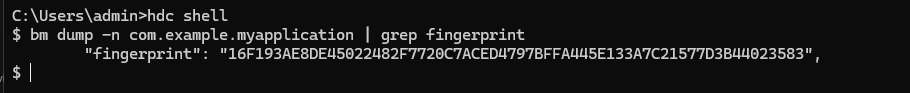

# FAQs About Application Packages
<!--Kit: Ability Kit-->
<!--Subsystem: BundleManager-->
<!--Owner: @wanghang904-->
<!--Designer: @hanfeng6-->
<!--Tester: @kongjing2-->
<!--Adviser: @Brilliantry_Rui-->

## How do i obtain the fingerprint in the signature information?

* Call an API.

You can call [bundleManager.getBundleInfoForSelf](../reference/apis-ability-kit/js-apis-bundleManager.md#bundlemanagergetbundleinfoforself) to obtain the bundle information, which contains the signature information, and signature information in turn contains fingerprint information.

```ts
import { bundleManager } from '@kit.AbilityKit';
import { BusinessError } from '@kit.BasicServicesKit';
import { hilog } from '@kit.PerformanceAnalysisKit';

let bundleFlags = bundleManager.BundleFlag.GET_BUNDLE_INFO_WITH_APPLICATION | bundleManager.BundleFlag.GET_BUNDLE_INFO_WITH_SIGNATURE_INFO;
try {
  bundleManager.getBundleInfoForSelf(bundleFlags).then((bundleInfo:bundleManager.BundleInfo) => {
    console.info('testTag', 'getBundleInfoForSelf successfully. fingerprint: %{public}s', bundleInfo.signatureInfo.fingerprint);
  }).catch((err: BusinessError) => {
    console.error('testTag', 'getBundleInfoForSelf failed. Cause: %{public}s', err.message);
  });
} catch (err) {
  let message = (err as BusinessError).message;
  console.error('testTag', 'getBundleInfoForSelf failed: %{public}s', message);
}
```

* Use [Bundle Manager](../tools/bm-tool.md) (bm).

```shell
hdc shell
# Replace **com.example.myapplication** with the actual bundle name.
bm dump -n com.example.myapplication | grep fingerprint 
```



* Use the **keytool**. For details, see [Generating a Signing Certificate Fingerprint](https://developer.huawei.com/consumer/en/doc/AppGallery-connect-Guides/appgallerykit-preparation-game-0000001055356911#section147011294331).

## What is appIdentifier?

**appIdentifier**, generated during application signing, is a field in the [profile](https://developer.huawei.com/consumer/en/doc/app/agc-help-add-releaseprofile-0000001914714796) and is the unique identifier of an application. There are two ways to generate an application identifier:
1. The **appIdentifier** field is randomly generated through [automatic signing](https://developer.huawei.com/consumer/en/doc/harmonyos-guides/ide-signing#section18815157237) on DevEco Studio. Signing on different devices or re-signing will result in different values of **appIdentifier**.
2. The **appIdentifier** field in the [debug profile](https://developer.huawei.com/consumer/en/doc/app/agc-help-debug-profile-0000002248181278) or [release profile](https://developer.huawei.com/consumer/en/doc/app/agc-help-release-profile-0000002248341090) is fixed if you manually sign and request a profile in AppGallery Connect. This field comes from the [App ID](https://developer.huawei.com/consumer/en/doc/app/agc-help-createharmonyapp-0000001945392297) generated when the application is created in AppGallery Connect and is distributed by the cloud. In this case, the **appIdentifier** field does not change along the application lifecycle, including version updates, certificate changes, public and private key changes, and application transfers.

Therefore, manual signing is recommended in scenarios where **appIdentifier** must remain unchanged, such as cross-device debugging, cross-application interaction debugging, or multi-user development with a shared key. For details, see [Use Cases for Automatic and Manual Signing](https://developer.huawei.com/consumer/en/doc/harmonyos-guides/ide-signing#section54361623194519).

## How do I obtain appidentifier from application information?

* You can call [bundleManager.getBundleInfoForSelf](../reference/apis-ability-kit/js-apis-bundleManager.md#bundlemanagergetbundleinfoforself) to obtain the bundle information, which contains the signature information, and signature information in turn contains the **appIdentifier**.

```ts
import { bundleManager } from '@kit.AbilityKit';
import { BusinessError } from '@kit.BasicServicesKit';
import { hilog } from '@kit.PerformanceAnalysisKit';

let bundleFlags = bundleManager.BundleFlag.GET_BUNDLE_INFO_WITH_APPLICATION | bundleManager.BundleFlag.GET_BUNDLE_INFO_WITH_SIGNATURE_INFO;
try {
  bundleManager.getBundleInfoForSelf(bundleFlags).then((bundleInfo:bundleManager.BundleInfo) => {
    console.info('testTag', 'getBundleInfoForSelf successfully. appIdentifier: %{public}s', bundleInfo.signatureInfo.appIdentifier);
  }).catch((err: BusinessError) => {
    console.error('testTag', 'getBundleInfoForSelf failed. Cause: %{public}s', err.message);
  });
} catch (err) {
  let message = (err as BusinessError).message;
  console.error('testTag', 'getBundleInfoForSelf failed: %{public}s', message);
}
```

* Use the [bm](../tools/bm-tool.md) tool.

```shell
hdc shell
# Replace **com.example.myapplication** with the actual bundle name.
bm dump -n com.example.myapplication | grep appIdentifier
```


