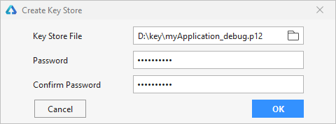
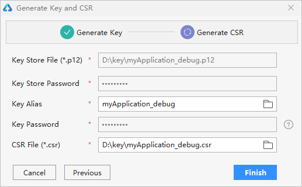
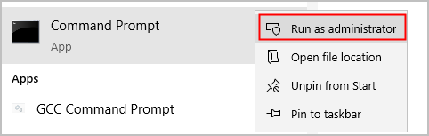
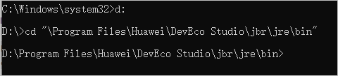
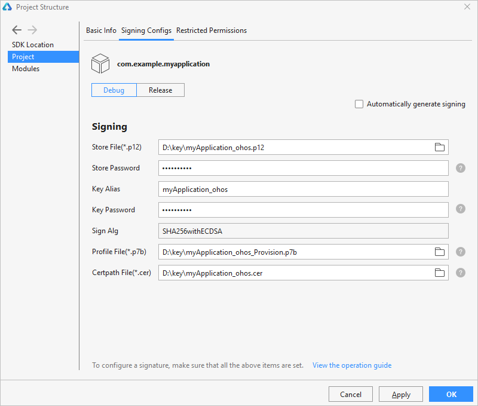

# Configuring the OpenHarmony App Signature

- [Generating a Key Store and CSR](#Generating-a-Key-Store-and-CSR)
 - [In DevEco Studio](#In-DevEco-Studio)
 - [In a Command-Line Tool](#In-a-Command-Line-Tool)
- [Generating an App Certificate](#Generating-an-App-Certificate)
- [Generating the App Profile](#Generating-the-App-Profile)
- [Configuring App Signature Information](#Configuring-App-Signature-Information)

Before running and debugging the OpenHarmony app on a real device, you need to sign the app. This section describes how to configure the signature of an OpenHarmony app. Operation instructions are the same in _HUAWEI DevEco Studio User Guide_ except this section. For details, see [HUAWEI DevEco Studio User Guide](https://developer.harmonyos.com/en/docs/documentation/doc-guides/tools_overview-0000001053582387). See the following figure for the process of configuring app signature information.


## Generating a Key Store and CSR

OpenHarmony uses digital certificates (.cer) and **Profile** files (.p7b) to ensure app integrity. Before applying for these files, you need to generate a key store (.p12) and a certificate signing request (.csr). You can do so in DevEco Studio or a command-line tool.


### In DevEco Studio

1. On the menu bar, choose **Build** &gt; **Generate Key and CSR**.
   >  **说明：**
   > If you have a local key, click **Skip** in the **Generate Key** window and use the key to generate a CSR file.

2. In **Key Store File**, click **Choose Existing** to select an existing key store (.p12 file that contains a key) or **New** to create one. The following describes how to create a key store.
   

3. In the **Create Key Store** dialog box, set the following parameters and click **OK**.
   - **Key Store File**: Select the path for storing the key store.
   - **Password**: Set the key store password, which must contain at least 8 characters that include two types of the following: uppercase letters, lowercase letters, digits, and special characters. Do not lose the password as it will be used later in configuring the signature.
   - **Confirm Password**: Enter the key store password again.

   

4. In the **Generate Key** window, set the following parameters and click **Next**.
   - **Alias**: Enter the alias of the key, which is used to identify the key name. Do not lose the alias as it will be used later in configuring the signature.
   - **Password**: password of the key, which is automatically filled in and the same as the keystore password.
   - **Validity**: Specify the certificate validity period. A validity period of 25 years or longer is recommended to cover the entire lifecycle of your app/service.
   - **Certificate**: Enter basic certificate information.

   

5. In the **Generate CSR** window, select the key and set the storage path of the CSR file.
   

6. Click **OK**. You can then obtain the generated keystore file (.p12) and CSR file (.csr) from the storage path.
   


### In a Command-Line Tool

Use the Keytool in the Open JDK to generate a CSR.

1. Run the Keytool as an administrator.
   

2. Switch to the directory where the Keytool is located.
   

3. Run the following command to generate a key store. This example creates a key store named **ide_demo_app.p12** and saves it to the root directory of the D drive.
   ```
   keytool -genkeypair -alias "ide_demo_app" -keyalg EC -sigalg SHA256withECDSA -dname "C=CN,O=HUAWEI,OU=HUAWEI IDE,CN=ide_demo_app"  -keystore d:\\idedemokey.p12 -storetype pkcs12 -validity 9125 -storepass 123456Abc -keypass 123456Abc
   ```

   Parameters in the key store:

   >  **说明：**
   > Record the values of **alias**, **storepass**, and **keypass**, which will be used in [Configuring App Signature Information](#configuring-app-signature-information).

   - **alias**: alias of the key, which is used to identify the key name.
   - **sigalg**: signature algorithm, which is automatically set to **SHA256withECDSA** and cannot be changed.
   - **dname**:
      - **C**: country/region code, such as **CN**.
      - **O**: organization name, such as **HUAWEI**.
      - **OU**: organization unit name, such as **HUAWEI IDE**.
      - **CN**: your first name and last name. Set this parameter to be the same as **alias**.
   - **validity**: certificate validity period. It is recommended that you set this parameter to **9125** (25 years).
   - **storepass**: key store password, which must contain at least 8 characters that include two types of the following: uppercase letters, lowercase letters, digits, and special characters. Do not lose the password as it will be used later in configuring the signature.
   - **keypass**: password of the key. The value must be the same as that of **storepass**.

4. Run the following command. After the command is executed, enter the **storepass** to generate a CSR in .csr format.
   ```
   keytool -certreq -alias "ide_demo_app" -keystore d:\\idedemokey.p12 -storetype pkcs12 -file d:\\idedemokey.csr
   ```

   Parameters in the CSR:

   - **alias**: The value must be the same as the alias set in 3.
   - **file**: name of the generated CSR. The file name extension is .csr.


## Generating an App Certificate

Use the CSR generated in [Generating a Key Store and CSR](#generating-a-key-store-and-csr) to generate the digital certificate required for app signing. The method is as follows:

Go to the **Sdk\toolchains\lib** directory where the OpenHarmony SDK is saved (see [Configuring the OpenHarmony SDK](../quick-start/configuring-openharmony-sdk.md) for details) in the DevEco Studio installation directory, and run the following command in the CLI. If the **keytool** command cannot be executed, add the JDK environment variables to the system environment variables. You only need to modify the input and output to quickly generate a certificate. That is, modify **-infile** to specify the path of the CSR and **-outfile** to specify the name and path of the output certificate.

```
keytool -gencert -alias "OpenHarmony Application CA" -infile myApplication_ohos.csr -outfile myApplication_ohos.cer -keystore OpenHarmony.p12 -sigalg SHA384withECDSA -storepass 123456 -ext KeyUsage:"critical=digitalSignature" -validity  3650 -rfc
```

Refer to the following descriptions about the parameters in the command:

- **alias**: alias of the CA private key used for issuing certificates. The CA private key of the OpenHarmony community is stored in the **OpenHarmony.p12** key store file. This parameter cannot be modified.

- **infile**: path of the CSR file.

- **outfile**: name and path of the certificate chain file.

- **keystore**: path of the CA key store for issuing certificates. The name of the OpenHarmony key store file is **OpenHarmony.p12**. The file is stored in **Sdk\toolchains\lib** of the OpenHarmony SDK. This parameter cannot be modified. Note that the **OpenHarmony.p12** file is not the .p12 file generated in [Generating a Key Store and CSR](#generating-a-key-store-and-csr).

- **sigalg**: certificate signature algorithm. This parameter cannot be modified.

- **storepass**: key store password. The password is **123456** and cannot be changed.

- **ext**: certificate extension. This parameter cannot be modified.

- **validity**: certificate validity period, which is user-defined.

- **rfc**: specifies the output file format. This parameter cannot be modified.


## Generating the App Profile

The profile contains the following inforamtion about the OpenHarmony app: bundle name, digital certificate information, certificate permissions that can be applied for by the app, and devices where the app can be debugged (the device list will be empty if the app type is Release). Each app package must contain a profile file.

Go to the **Sdk\toolchains\lib** directory, open the command-line tool, and run the following command.

```
java -jar provisionsigtool.jar sign --in UnsgnedReleasedProfileTemplate.json --out myApplication_ohos_Provision.p7b --keystore OpenHarmony.p12 --storepass 123456 --alias "OpenHarmony Application Profile Release" --sigAlg SHA256withECDSA --cert OpenHarmonyProfileRelease.pem --validity 365 --developer-id ohosdeveloper --bundle-name app bundle name --permission restricted permission name (optional) --permission restricted permission name (optional) --distribution-certificate myApplication_ohos.cer
```

Refer to the following descriptions about the parameters in the command:

- **provisionsigtool**: tool for generating the profile which is stored in **Sdk\toolchains\lib** of the OpenHarmony SDK.

- **in**: path of the profile template which is stored in **Sdk\toolchains\lib** of the OpenHarmony SDK. This parameter cannot be modified.

- **out**: name and path of the profile.

- **keystore**: path of the key store for issuing certificates. The name of the OpenHarmony key store file is **OpenHarmony.p12**. The file is stored in **Sdk\toolchains\lib** of the OpenHarmony SDK. This parameter cannot be modified.

- **storepass**: key store password. The password is **123456** and cannot be changed.

- **alias**: alias of the private key used for app signing. The CA private key of the OpenHarmony community is stored in the **OpenHarmony.p12** key store file. This parameter cannot be modified.

- **sigalg**: certificate signature algorithm. This parameter cannot be modified.

- **cert**: path of the certificate of the signature profile. The file is stored in **Sdk\toolchains\lib** of the OpenHarmony SDK. This parameter cannot be modified.

- **validity**: certificate validity period, which is user-defined.

- **developer-id**: developer ID, which is a user-defined character string.

- **bundle-name**: app bundle name.

- **permission** (optional): If permissions are not required, this field can be left empty. You can add multiple restricted permissions in the following way: ohos.permission.READ_CONTACTS, ohos.permission.WRITE_CONTACTS.

- **distribution-certificate**: certificate generated in [Generating an App Certificate](#generating-an-app-certificate).


## Configuring App Signature Information

Before debugging on a real device, use the private key file (.p12), certificate file (.cer), and profile file (.p7b) to sign the target module.

Go to **File** &gt; **Project Structure** &gt; **Project** &gt; **Signing Configs** &gt; **debug**, deselect **Automatically generate signing**, and configure the signature information of the specified module.
- **Store File**: Select the key store file with the file name extension .p12, which is generated in [Generating a Key Store and CSR](#generating-a-key-store-and-csr).

- **Store Password**: Enter the key store password, which is the same as the key store password entered in [Generating a Key Store and CSR](#generating-a-key-store-and-csr).

- **Key Alias**: Enter the alias of the key, which is the same as the alias entered in [Generating a Key Store and CSR](#generating-a-key-store-and-csr).

- **Key Password**: Enter the key password, which is the same as the value of **Store Password**.

- **Sign Alg**: Specify the signature algorithm, which has a fixed value of **SHA256withECDSA**.

- **Profile File**: Select the .p7b profile file generated in [Generating the App Profile](#generating-the-app-profile).

- **Certpath File**: Select the .cer debug certificate generated in [Generating an App Certificate](#generating-an-app-certificate).



Click **OK** to save your configurations. Then you can view the signature configuration information in **build.gradle** of the project.


By default, the type of a HAP package compiled using DevEco Studio is set to **debug**. For a release type, click the **OhosBuild Variants** tab in the lower left corner of the project and set the type to **release**. For details about how to compile and build the HAP, see [HUAWEI DevEco Studio User Guide](https://developer.harmonyos.com/en/docs/documentation/doc-guides/build_hap-0000001053342418).


After the compilation is complete, you can obtain the HAP package of your OpenHarmony app from the **build** directory of the project.


