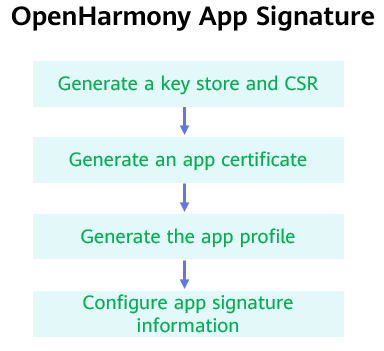
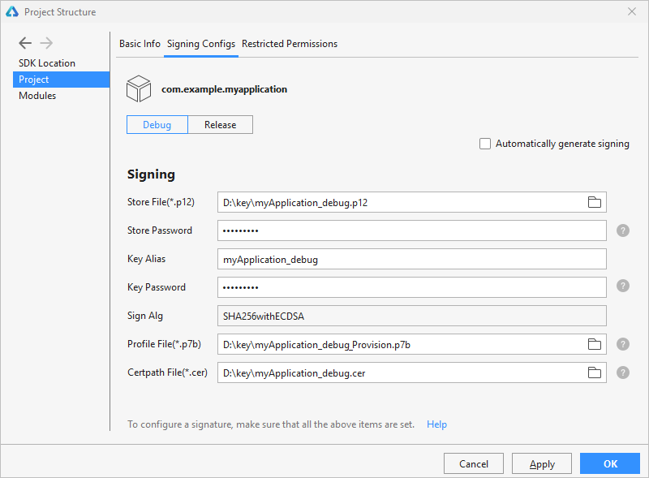
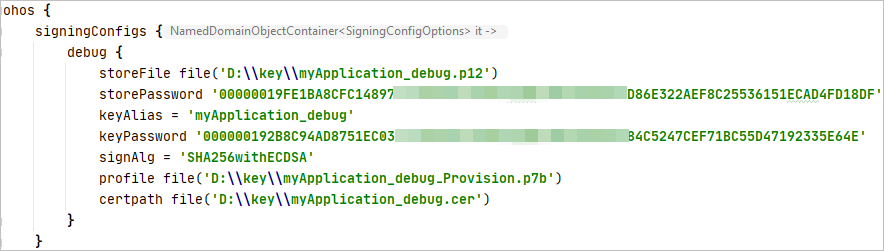
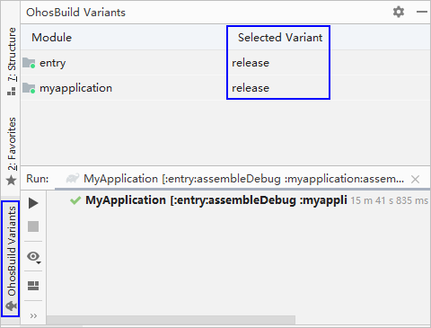
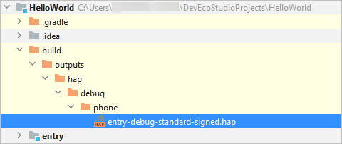

# Configuring the OpenHarmony App Signature<a name="EN-US_TOPIC_0000001159890371"></a>

-   [Generating a Key Store and CSR](#section153146467405)
-   [Generating an App Certificate](#section136609429562)
-   [Generating the App Profile](#section2048641015325)
-   [Configuring App Signature Information](#section10152423193310)

Before running and debugging the OpenHarmony app on a real device, you need to sign the app. This section describes how to configure the signature of an OpenHarmony app. Operation instructions are the same in  _HUAWEI DevEco Studio User Guide_  except this section. For details, see  [HUAWEI DevEco Studio User Guide](https://developer.harmonyos.com/en/docs/documentation/doc-guides/tools_overview-0000001053582387). See the following figure for the process of configuring app signature information.



## Generating a Key Store and CSR<a name="section153146467405"></a>

OpenHarmony uses digital certificates \(.cer\) and  **Profile**  files \(.p7b\) to ensure app integrity. Before applying for these files, you need to generate a key store \(.p12\) and a certificate signing request \(.csr\). You can do so in DevEco Studio or a command-line tool. For details, see  [Generating a Key Store and CSR](https://developer.harmonyos.com/en/docs/documentation/doc-guides/publish_app-0000001053223745#section9752152162813).

## Generating an App Certificate<a name="section136609429562"></a>

Use the CSR generated in  [Generating a Key Store and CSR](#section153146467405)  to generate the digital certificate required for app signing. The method is as follows:

Go to the  **Sdk\\toolchains\\lib**  directory where the OpenHarmony SDK is saved \(see  [Configuring the OpenHarmony SDK](configuring-the-openharmony-sdk.md)  for details\) in the DevEco Studio installation directory, and run the following command in the CLI. If the  **keytool**  command cannot be executed, add the JDK environment variables to the system environment variables. You only need to modify the input and output to quickly generate a certificate. That is, modify  **-infile**  to specify the path of the CSR and  **-outfile**  to specify the name and path of the output certificate.

```
keytool -gencert -alias "OpenHarmony Application CA" -infile myApplication_ohos.csr -outfile myApplication_ohos.cer -keystore OpenHarmony.p12 -sigalg SHA384withECDSA -storepass 123456 -ext KeyUsage:"critical=digitalSignature" -validity  3650 -rfc
```

Refer to the following descriptions about the parameters in the command:

-   **alias**: alias of the CA private key used for issuing certificates. The CA private key of the OpenHarmony community is stored in the  **OpenHarmony.p12**  key store file. This parameter cannot be modified.
-   **infile**: path of the CSR file.
-   **outfile**: name and path of the certificate chain file.
-   **keystore**: path of the CA key store for issuing certificates. The name of the OpenHarmony key store file is  **OpenHarmony.p12**. The file is stored in  **Sdk\\toolchains\\lib**  of the OpenHarmony SDK. This parameter cannot be modified. Note that the  **OpenHarmony.p12**  file is not the .p12 file generated in  [Generating a Key Store and CSR](#section153146467405).
-   **sigalg**: certificate signature algorithm. This parameter cannot be modified.
-   **storepass**: key store password. The password is  **123456**  and cannot be changed.
-   **ext**: certificate extension. This parameter cannot be modified.
-   **validity**: certificate validity period, which is user-defined.
-   **rfc**: specifies the output file format. This parameter cannot be modified.

## Generating the App Profile<a name="section2048641015325"></a>

The profile contains the package name of the OpenHarmony app, digital certificate information, certificate permissions that can be applied for by the app, and devices that support app debugging \(the device list will be empty if the app type is Release\). Each app package must contain a profile file.

Go to the  **Sdk\\toolchains\\lib**  directory, open the command-line tool, and run the following command.

```
java -jar provisionsigtool.jar sign --in UnsgnedReleasedProfileTemplate.json --out myApplication_ohos_Provision.p7b --keystore OpenHarmony.p12 --storepass 123456 --alias "OpenHarmony Application Profile Release" --sigAlg SHA256withECDSA --cert OpenHarmonyProfileRelease.pem --validity 365 --developer-id ohosdeveloper --bundle-name package name --permission restricted permission name (optional) --permission restricted permission name (optional) --distribution-certificate myApplication_ohos.cer
```

Refer to the following descriptions about the parameters in the command:

-   **provisionsigtool**: tool for generating the profile which is stored in  **Sdk\\toolchains\\lib**  of the OpenHarmony SDK.
-   **in**: path of the profile template which is stored in  **Sdk\\toolchains\\lib**  of the OpenHarmony SDK. This parameter cannot be modified.
-   **out**: name and path of the profile.
-   **keystore**: path of the key store for issuing certificates. The name of the OpenHarmony key store file is  **OpenHarmony.p12**. The file is stored in  **Sdk\\toolchains\\lib**  of the OpenHarmony SDK. This parameter cannot be modified.
-   **storepass**: key store password. The password is  **123456**  and cannot be changed.
-   **alias**: alias of the private key used for app signing. The CA private key of the OpenHarmony community is stored in the  **OpenHarmony.p12**  key store file. This parameter cannot be modified.
-   **sigalg**: certificate signature algorithm. This parameter cannot be modified.
-   **cert**: path of the certificate of the signature profile. The file is stored in  **Sdk\\toolchains\\lib**  of the OpenHarmony SDK. This parameter cannot be modified.
-   **validity**: certificate validity period, which is user-defined.
-   **developer-id**: developer ID, which is a user-defined character string.
-   **bundle-name**: app package name.
-   **permission**  \(optional\): If permissions are not required, this field can be left empty. You can add multiple restricted permissions in the following way: ohos.permission.READ\_CONTACTS, ohos.permission.WRITE\_CONTACTS.
-   **distribution-certificate**: certificate generated in  [Generating an App Certificate](#section136609429562).

## Configuring App Signature Information<a name="section10152423193310"></a>

Before debugging on a real device, use the private key file \(.p12\), certificate file \(.cer\), and profile file \(.p7b\) to sign the target module.

Go to  **File**  \>  **Project Structure**  \>  **Project**  \>  **Signing Configs**  \>  **debug**, deselect  **Automatically generate signing**, and configure the signature information of the specified module.

-   **Store File**: Select the key store file with the file name extension .p12, which is generated in  [Generating a Key Store and CSR](#section153146467405).
-   **Store Password**: Enter the key store password, which is the same as the key store password entered in  [Generating a Key Store and CSR](#section153146467405).
-   **Key Alias**: Enter the alias of the key, which is the same as the alias entered in  [Generating a Key Store and CSR](#section153146467405).
-   **Key Password**: Enter the key password, which is the same as the value of  **Store Password**.
-   **Sign Alg**: Specify the signature algorithm, which has a fixed value of  **SHA256withECDSA**.
-   **Profile File**: Select the .p7b profile file generated in  [Generating the App Profile](#section2048641015325).
-   **Certpath File**: Select the .cer debug certificate generated in  [Generating an App Certificate](#section136609429562).



Click  **OK**  to save your configurations. Then you can view the signature configuration information in  **build.gradle**  of the project.



By default, the type of a HAP package compiled using DevEco Studio is set to  **debug**. For a release type, click the  **OhosBuild Variants**  tab in the lower left corner of the project and set the type to  **release**. For details about how to compile and build the HAP, see  [HUAWEI DevEco Studio User Guide](https://developer.harmonyos.com/en/docs/documentation/doc-guides/build_hap-0000001053342418).



After the compilation is complete, you can obtain the HAP package of your OpenHarmony app from the  **build**  directory of the project.



