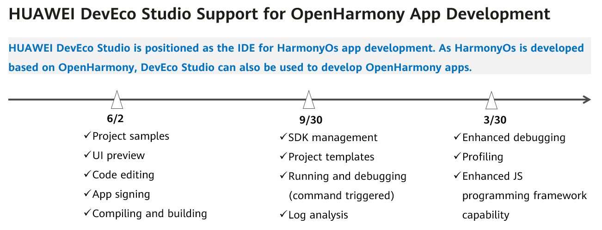

# Overview

- [About the Document](#About-the-Document)
- [Restrictions](#Restrictions)
- [DevEco Studio Evolution Roadmap](#DevEco-Studio-Evolution-Roadmap)

## About the Document

DevEco Studio is an integrated development environment (IDE) of HarmonyOS apps. As HarmonyOS is developed based on OpenHarmony, DevEco Studio can also be used to develop OpenHarmony apps.

The process of developing an OpenHarmony app using DevEco Studio is the same as that of developing a HarmonyOS app. This document describes the differences between OpenHarmony and HarmonyOS app development.

- **Environment setup**: You need to manually install the OpenHarmony SDK for the OpenHarmony app development. For details, see [Configuring the OpenHarmony SDK](../quick-start/configuring-openharmony-sdk.md).

- **Creating an OpenHarmony project**: Create a project by using the project wizard or by importing a sample project. For details, see [Using the Project Wizard to Create a Project](../quick-start/use-wizard-to-create-project.md).

- **Signature configuration for debugging**: To run an OpenHarmony app on a real device, you need to sign the app first. For instructions, see [Configuring the OpenHarmony App Signature](../quick-start/configuring-openharmony-app-signature.md).

- **App running on a real device**: Push the OpenHarmony HAP package to the real device for installation. For details, see [Installing and Running Your OpenHarmony App](../quick-start/installing-openharmony-app.md).

For details about how to use DevEco Studio, see [HUAWEI DevEco Studio User Guide](https://developer.harmonyos.com/en/docs/documentation/doc-guides/tools_overview-0000001053582387).

## Restrictions

- OpenHarmony supports only app development in eTS and JS.

- Developing OpenHarmony apps in DevEco Studio is supported on Windows.

DevEco Studio serves as a development tool for both OpenHarmony and HarmonyOS apps. Refer to the following table for descriptions about the functions not supported for OpenHarmony.

| Feature | HarmonyOS | OpenHarmony | 
| -------- | -------- | -------- |
| Service&nbsp;widgets | **√** | **X** | 
| Automatic&nbsp;signing | **√** | **X** | 
| Remote&nbsp;emulator | **√** | **X** | 
| Local&nbsp;emulator | **√** | **X** | 
| Using&nbsp;DevEco&nbsp;Studio&nbsp;for&nbsp;log&nbsp;viewing&nbsp;and&nbsp;optimization | **√** | **X** | 
| Cloud&nbsp;testing | **√** | **X** | 
| Security&nbsp;testing | **√** | **X** | 

## DevEco Studio Evolution Roadmap

Refer to the following figure for when the HUAWEI DevEco Studio support for OpenHarmony app development is available in different phases.

