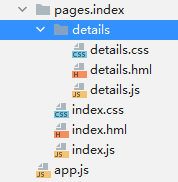

# Getting Started with JavaScript<a name="EN-US_TOPIC_0000001064805858"></a>

-   [Building the First Page](#section17436202895811)
-   [Creating the Second Page](#section944219415598)
-   [Implementing Page Redirection](#section126857614017)

## Building the First Page<a name="section17436202895811"></a>

1.  Add a  **Text**  and a  **Button**  component to the first page.

    In the  **Project**  window, choose  **entry**  \>  **src**  \>  **main**  \>  **js**  \>  **default**  \>  **pages.index**, open the  **index.hml**  file, and add the components.

    ```
    <!-- index.hml -->
    <div class="container">
        <!-- Add text. -->
        <text class="text">
            Hello World
        </text>
        <!-- Add a button, set its type to capsule, set button text to Next, and bind it to the launch event. -->
        <button class="button" type="capsule" value="Next" onclick="launch"></button>
    </div>
    ```

2.  Open the  **index.css**  file and set text and button styles.

    ```
    /* index.css */
    .container {
        flex-direction: column; /* Arrange container items vertically. */
        justify-content: center; /* Center the items along the main axis of the container. */
        align-items: center; /* Center the items along the cross axis of the container. */
    }
    /* Set the style for the component of the text class. */
    .text{
        font-size: 42px;
    }
    /* Set the style for the component of the button class. */
    .button {
        width: 240px;
        height: 60px;
        background-color: #007dff;
        font-size: 30px;
        text-color: white;
        margin-top: 20px;
    }
    ```

3.  [Preview](https://developer.harmonyos.com/en/docs/documentation/doc-guides/previewer-0000001054328973#EN-US_TOPIC_0000001056725592__section16523172216252)  or  [run your app on the emulator](https://developer.harmonyos.com/en/docs/documentation/doc-guides/run_simulator-0000001053303709). The following figure shows the running effect.

    


## Creating the Second Page<a name="section944219415598"></a>

1.  In the  **Project**  window, choose  **entry**  \>  **src**  \>  **main**  \>  **js**  \>  **default**, right-click the  **pages.index**  folder, and choose  **New**  \>  **JS Page**. Name the new page  **details**  and press  **Enter**.

    Below is the structure of the  **pages.index**  folder:

    

2.  Open the  **details.hml**  file, add the  **<text\>**  component, and set its layout.

    ```
    <!-- details.hml -->
    <div class="container">
      <text class="text">
        Hi there
      </text>
    </div>
    ```

3.  Open the  **details.css**  file and set the text style.

    ```
    /* details.css */
    .container {
        flex-direction: column;
        justify-content: center;
        align-items: center;
    }
    .text {
        font-size: 42px;
        text-align: center;
    }
    ```


## Implementing Page Redirection<a name="section126857614017"></a>

1.  Open the  **index.js**  file and import the router module. The page router redirects to the target page based on its URI.

    ```
    // index.js
    import router from '@system.router';
    
    export default {
      launch() {
        router.push ({
          uri:'pages/index/details/details', // Specify the page to be redirected to.
        })
      }
    }
    ```

2.  [Preview](https://developer.harmonyos.com/en/docs/documentation/doc-guides/previewer-0000001054328973#EN-US_TOPIC_0000001056725592__section16523172216252)  or  [run your app on the emulator](https://developer.harmonyos.com/en/docs/documentation/doc-guides/run_simulator-0000001053303709)  again. The following figure shows the running effect.

    


Congratulations! You have finished developing your HarmonyOS app in JavaScript.

