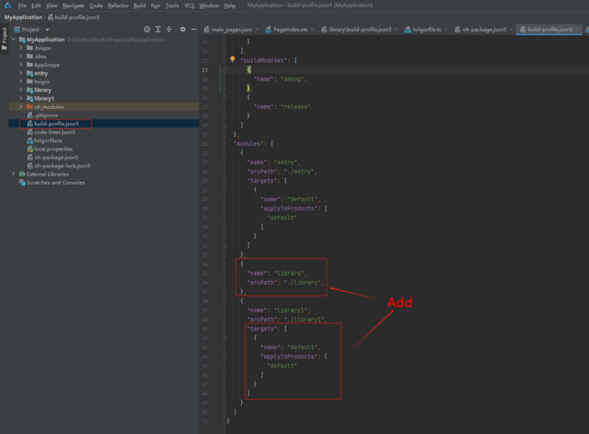

# Converting HAR to HSP
Currently, the HAR has a problem with duplicate packaging, leading an oversize application package. To fix this problem, you can convert the HAR to the HSP through by the configuration items.
## How to Convert

1. Change the value of **type** to **shared** and add the **deliveryWithInstall** field in the **module.json5** file of the HAR module.
    ```json
    // MyApplication\library\src\main\module.json5
    {
      "module": {
        "name": "library",
        "type": "shared",
        "description": "$string:shared_desc",
        "deliveryWithInstall": true,
        "pages": "$profile:main_pages"
      }
    }
    ```

2. Add a string field **shared_desc** in **element** of the **base**, **en\_US**, and **zh\_CN** qualifiers directories under the **resources** directory.
    ```json
    // MyApplication\library\src\main\resources\base\element\string.json
    {
      "string": [
        {
          "name": "shared_desc",
          "value": "description"
        }
      ]
    }
    ```

3. Add a **profile** folder in **resources** > **base**. Then add a **main_pages.json** file to the added folder and configure it as follows:
    ```json
    // MyApplication\library\src\main\resources\base\profile\main_pages.json
    {
      "src": [
        "pages/PageIndex"
      ]
    }
    ```

4. Add a **pages** directory in the **ets** directory. Then add a **PageIndex.ets** file in the added directory and configure it as follows:
    ```ts
    // MyApplication\library\src\main\ets\pages\PageIndex.ets
    @Entry
    @Component
    struct PageIndex {
      @State message: string = 'hello world';

      build() {
        Row() {
          Column() {
            Text(this.message)
              .fontSize(50)
              .fontWeight(FontWeight.Bold)
          }
          .width('100%')
        }
        .height('100%')
      }
    }
    ```

5. Delete the **consumerFiles** field from the **build-profile.json5** file of the HAR module.

6. Replace the content in the **hvigorfile.ts** file of the HAR module with the following content:
    ```ts
    // MyApplication\library\hvigorfile.ts
    import { hspTasks } from '@ohos/hvigor-ohos-plugin';

    export default {
      system: hspTasks,  /* Built-in plugin of Hvigor. It cannot be modified. */
      plugins:[]         /* Custom plugin to extend the functionality of Hvigor. */
    }
    ```

7. Add the **packageType** field in the **oh-package.json5** file.
    ```json
    // MyApplication\library\oh-package.json5
    {
      "packageType": "InterfaceHar"
    }
    ```

8. Modify the **build-profile.json5** configuration file in the project root directory.

After modification

