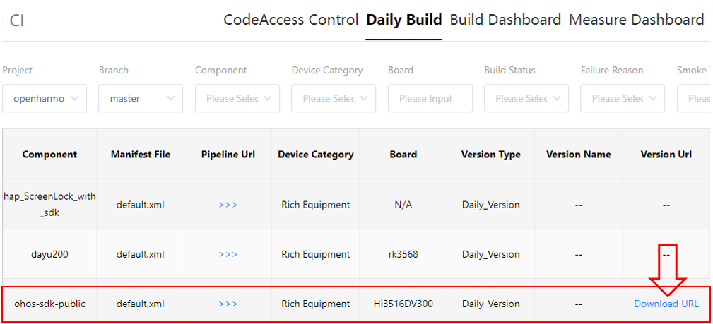
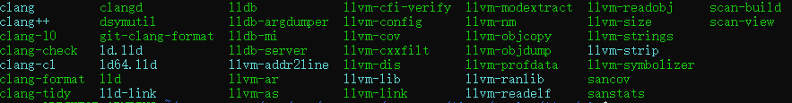

# Using Native APIs (NDK) of the OHOS SDK in a CMake Project

## What Is Native API
For details, see [Native APIs](https://gitee.com/openharmony/docs/blob/master/en/application-dev/napi/Readme-EN.md).

## Downloading the NDK

You download the Native API Development Kit (NDK) by downloading the OHOS SDK, where the NDK is included. To download the OHOS SDK, use any of the following modes:

- (Recommended) Acquire source code from mirrors for an officially released version. For details, see [release notes](https://gitee.com/openharmony/docs/tree/master/en/release-notes#/openharmony/docs/blob/master/en/release-notes/OpenHarmony-v3.2-release.md).
- Download the SDK from the SDK Manager in DevEco Studio.
- Download the SDK from the [daily build](http://ci.openharmony.cn/dailys/dailybuilds), by clicking the download link to the ohos-sdk component.
  

## Decompressing the NDK

Place the downloaded NDK in a folder you prefer and decompress it. Below shows the directory structure after decompression.


Configure the Linux environment as follows: (Skip this step if the NDK is downloaded from DevEco Studio.)

1. Add the CMake tool that comes with the NDK to the environment variables.

```
    # Open the .bashrc file.
    vim ~/.bashrc
    # Append the custom CMake path to the file. Save the file and exit.
    export PATH=~/ohos-sdk/ohos-sdk/linux/native/build-tools/cmake/bin:$PATH
    # Run the source ~/.bashrc command to make the environment variables take effect.
    source ~/.bashrc
```

2. Check the default CMake path.

```
    # Run the which cmake command.
    which cmake
    # The result should be the same as the custom path previously appended to the file.
    ~/ohos-sdk/ohos-sdk/linux/native/build-tools/cmake/bin/cmake
```


## Using the NDK to Compile a Native Program

You can use the NDK to quickly develop a native program, including native dynamic libraries, static libraries, and executable files. The ArkUI application framework can call the native dynamic libraries through the NAPI framework. The following exemplifies how to use the NDK to compile a C/C++ dynamic library in a C/C++ demo project.


### Folders in the NDK
#### build Folder: ohos.toolchain.cmake file
The **ohos.toolchain.cmake** file contains the attributes of the CMake compilation target. Its path must be specified in the **CMAKE_TOOLCHAIN_FILE** parameter so that it can be located during CMake compilation. For details about the mandatory parameters in the **ohos.toolchain.cmake** file, see [Key Parameters in ohos.toolchain.cmake](#key-parameters-in-ohostoolchaincmake).


#### build-tools folder: Build Tool Provided by the NDK
```
    # Run the following command to view the CMake version:
    cmake -version
    # Result
    cmake version 3.16.5

    CMake suite maintained and supported by Kitware (kitware.com/cmake).
```
#### llvm Folder: Compiler Provided by the NDK


### Demo Project for the NDK
#### Demo Project Directory
    demo
      ├── CMakeLists.txt
      ├── include
           └── sum.h
      └── src
           ├── CMakeLists.txt
           ├── sum.cpp
           └── hello.cpp

#### CMakeLists.txt in the demo Directory
```
    # Specify the minimum CMake version.
    CMAKE_MINIMUM_REQUIRED(VERSION 3.16)

    # Set the project name, which is HELLO in this example.
    PROJECT(HELLO)

    # Add a subdirectory and build the subdirectory.
    ADD_SUBDIRECTORY(src bin)
```

#### CMakeLists.txt in the src Directory      
```
    SET(LIBHELLO_SRC hello.cpp)

    # Set compilation flags.
    SET(CMAKE_CXX_FLAGS "${CMAKE_CXX_FLAGS} -O0")   
 
    # Set the link parameter. The value below is only for exemplary purposes.
    SET(CMAKE_EXE_LINKER_FLAGS "${CMAKE_EXE_LINKER_FLAGS} -Wl,--emit-relocs --verbose")    

    # Add a libsum dynamic library target. If the compilation is successful, a libsum.so file is generated.
    ADD_LIBRARY(sum SHARED sum.cpp)

    # Add the executable target called Hello. If the compilation is successful, a Hello executable is generated.
    ADD_EXECUTABLE(Hello ${LIBHELLO_SRC})

    # Specify the path to the include directory of the Hello target.
    TARGET_INCLUDE_DIRECTORIES(Hello PUBLIC ../include)

    # Specify the name of the library to be linked to the Hello target.
    TARGET_LINK_LIBRARIES(Hello PUBLIC sum)
```

For details about CMake, see [CMake Tutorial](https://cmake.org/cmake/help/v3.16/guide/tutorial/).

#### Source Code
**hello.cpp** source code:

```
    #include <iostream>
    #include "sum.h"

    int main(int argc,const char **argv)
    {
        std::cout<< "hello world!" <<std::endl;
        int total = sum(1, 100);
        std::cout<< "Sum 1 + 100=" << total << std::endl;
        return 0;
    }
```
**sum.h** source code:

```
    int sum(int a, int b);

```
sum.cpp source code:
```
    #include <iostream>
    
    int sum(int a, int b)
    {
        return a + b;
    }
```


### Key Parameters in ohos.toolchain.cmake
| Parameter  | Type|Description|
|--------|------|------|
|OHOS_STL|c++\_shared/c++\_static|STL to use. The value must be consistent across the native libraries in the same application.<br>**c++\_shared** (default): The shared library of libc++, libc++\_shared.so, is used.<br>**c++\static**: The static library of libc++, libc++\_static.a, is used.|
|OHOS_ARCH|armeabi-v7a/arm64-v8a/x86_64|ABI to support. Currently, three types of ABI are supported.|
|OHOS_PLATFORM|OHOS|Target platform. Currently, only OHOS is supported.|
|CMAKE_TOOLCHAIN_FILE|Toolchain file|CMake toolchain file, that is, the aforementioned **ohos.toolchain.cmake** file.|

### Building from Command Line
In the project directory, create the **build** directory to store the intermediate files generated during CMake building.

> **NOTE**
>
> In the following commands, **ohos-sdk** is the root directory of the downloaded SDK. Replace it with the actual directory.

1. Use **OHOS_STL=c++_shared** for dynamic compilation.
```
    >mkdir build && cd build
    >cmake -DOHOS_STL=c++_shared -DOHOS_ARCH=armeabi-v7a -DOHOS_PLATFORM=OHOS -DCMAKE_TOOLCHAIN_FILE={ohos-sdk}/linux/native/build/cmake/ohos.toolchain.cmake ..
    >cmake --build .
```

2. Use **OHOS_STL=c++_static** for static compilation.
```
    >mkdir build && cd build
    >cmake -DOHOS_STL=c++_static -DOHOS_ARCH=armeabi-v7a -DOHOS_PLATFORM=OHOS -DCMAKE_TOOLCHAIN_FILE={ohos-sdk}/linux/native/build/cmake/ohos.toolchain.cmake ..
    >cmake --build .
```
<!--no_check-->