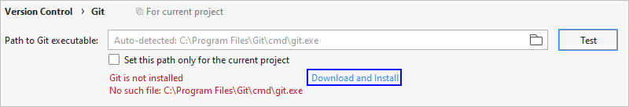

# Importing a Sample to Create a Project

> **NOTE:** 
>This feature applies to OpenHarmony projects created using DevEco Studio 2.1 Release or later.

After the OpenHarmony SDK is configured, you can get started to develop your app by  **importing a sample project**.

1.  On the DevEco Studio welcome page, select  **Configure**  or click the    icon, and choose  **Settings**  \>  **Version Control**  \>  **Git**. Then click  **Test**  to check whether the Git tool has been installed.
    -   If the tool has been installed, import a sample by following the instructions in Step 2.

        

    -   If the tool hasn't been installed, click  **Download and Install**. DevEco Studio will automatically download and install it. Then import a sample by following the instructions in Step 2.

        

2.  On the DevEco Studio welcome page, click  **Import Sample**  to import a sample project.

    

3.  Choose  **OpenHarmony Samples**  \>  **common**  \>  **JsHelloWorld**  \>  **Next**.

    

4.  Configure  **App Name**  and  **Project Location**  and click  **Finish**. Wait until the sample project is imported.

    

5.  When the project is successfully synced, start developing your OpenHarmony app.

    

