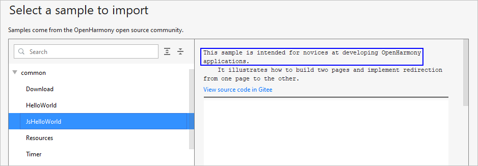
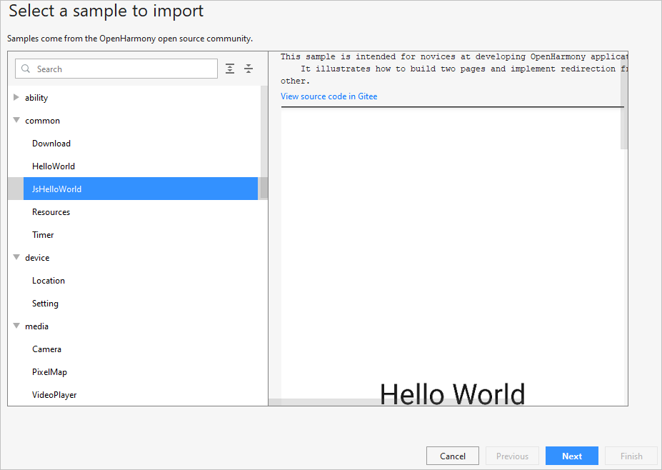

# Importing an OpenHarmony Project

After the OpenHarmony SDK is configured, you can start developing your app only by  **importing a sample project**  to begin with.

Sample projects for OpenHarmony app development are supported. Import a sample project with the following description:  **This sample is intended for novices at developing OpenHarmony applications.**. For example, the  **JsHelloWorld**  sample in the  **common**  category.

1.  On the DevEco Studio welcome page, go to  **Configure**  \(or    icon\) \>  **Settings**  \>  **Version Control**  \>  **Git**  and click  **Test**  to check whether the Git tool is installed.
    -   If the tool has been installed, import a sample by referring to  [2](#li5947194711181).

        

    -   If the tool hasn't been installed, click  **Download and Install**. DevEco Studio will automatically download and install it. Then import a sample by referring to  [2](#li5947194711181).

        

2.  On the DevEco Studio welcome page, click  **Import HarmonyOS Sample**  to import a sample project.

    

3.  Go to  **common**  \>  **JsHelloWorld**  \>  **Next**.

    

4.  Configure  **App Name**  and  **Project Location**  and click  **Finish**. Wait until the sample project is imported.

    

5.  Open the  **build.gradle**  file in the project and change the version number of the HAP plugin to  **2.4.4.3-RC**.

    

6.  Click    under  **Gradle**  in the upper right corner to sync the project again.

    

7.  When the project is successfully synced, you can develop your OpenHarmony app.

    

