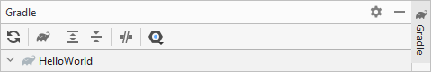
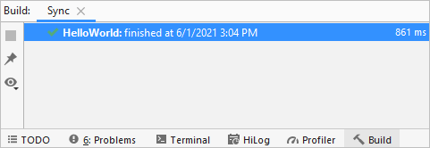

# Importing an OpenHarmony Project

After the OpenHarmony SDK is configured, you can start developing your app only by  **importing a sample project**  to begin with.

1.  On the DevEco Studio welcome page, click  **Import HarmonyOS Sample**  to import a sample project.

    

2.  Go to  **ability**  \>  **HelloWorld**  and click  **Next**.

    

3.  Configure  **App Name**  and  **Project Location**  and click  **Finish**. Wait until the sample project is imported.

    

4.  Wait until the project sync is indicated to be failed. Open the  **build.gradle**  file in the project and change the version number of the HAP plugin to  **2.4.4.3-RC**.

    

5.  Click    under  **Gradle**  in the upper right corner to sync the project again.

    

6.  When the project is successfully synced, you can develop your OpenHarmony app.

    

