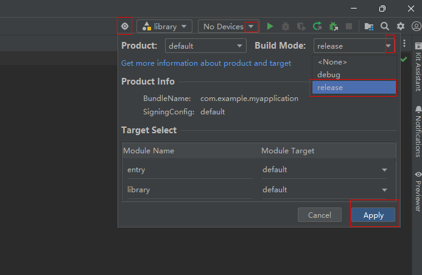

# Integrated HSP

The integrated HSP is an intermediate build product of the intra-application HSP. It aims to solve the strong coupling between the bundle name and signature of the user.
> **NOTE**
> The HSP can be used only by projects with the same bundle name, but the integrated HSP can be used by projects with different bundle names.

## Use Scenario
Multiple applications in a group can use the same dynamic shared package. To reduce development costs and share code and resources, multiple applications can share one infrastructure HSP (integrated HSP).

## Constraints
- The integrated HSP is only available for the [stage model](application-package-structure-stage.md).
- Only integrated HSP of API version 12 or later is supported. You should set the **useNormalizedOHMUrl** field to **true** in the project-level [build-profile.json5](https://developer.huawei.com/consumer/en/doc/harmonyos-guides-V13/ide-hvigor-build-profile-V13#section511142752919) file.

## Development Instructions
1. Project configuration for creators: Set the **useNormalizedOHMUrl** field to **true** in the project-level **build-profile.json5** file to configure the integrated HSP.

    ```json
    // created_party_project/build-profile.json5
    {
      "app": {
        "products": [
          {
            "name": "default",
            "signingConfig": "default",
            "compatibleSdkVersion": "5.0.0(12)",
            "runtimeOS": "HarmonyOS",
            "buildOption": {
              "strictMode": {
                "useNormalizedOHMUrl": true
              }
            }
            // ...
          }
        ]
        // ...
      }
    }
    ```
2. Module configuration for creators: Modify the module-level build configuration file **build-profile.json5** and set **integratedHsp** to **true** to specify the HSP module to be built as the integrated HSP module.

    ```json
    // created_party_project/library/build-profile.json5
    {
      "apiType": "stageMode",
      "buildOption": {
        "arkOptions": {
          "integratedHsp": true
        }
      }
    }
    ```

3. Packaging configuration for creators (.tgz Package)

    (1) Configure project signature information. For details, see [Signing Your App/Atomic Service](https://developer.huawei.com/consumer/en/doc/harmonyos-guides-V5/ide-signing-V5).

    (2) Configure the release mode.

    

    (3) Select the **library** directory in **Build** -> **Make Module 'library'**.

4. Directory creation for users: Create a **libs** directory in the **entry** directory and copy the .tgz file to the created directory.

5. Project dependency configuration for users: Add dependencies to the **oh-package.json5** configuration file in the main module.

    ```json
    // user_project/entry/oh-package.json5
      "dependencies": {
        "hsp": "./libs/library-default.tgz"
      }
    ```

6. Project configuration for users: Set the **useNormalizedOHMUrl** field to **true** in the project-level **build-profile.json5** file to configure the integrated HSP.
    ```json
    // user_project/build-profile.json5
    {
      "app": {
        "products": [
          {
            "name": "default",
            "signingConfig": "default",
            "compatibleSdkVersion": "5.0.0(12)",
            "runtimeOS": "HarmonyOS",
            "buildOption": {
              "strictMode": {
                "useNormalizedOHMUrl": true
              }
            }
          }
        ]
      }
    }
    ```
    > **NOTE**
    > Before installing and running an application, the user must configure the project signature information. For details, see [App/Service Signature](https://developer.huawei.com/consumer/en/doc/harmonyos-guides-V5/ide-signing-V5).
