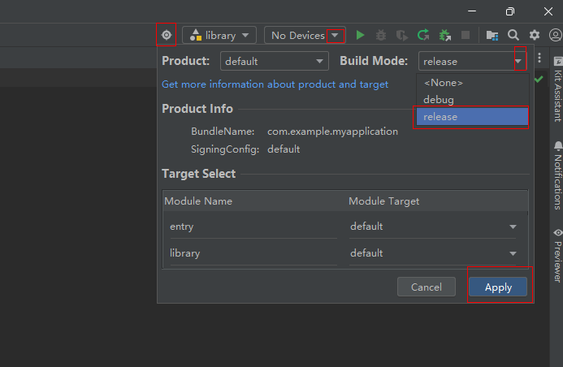

# Integrated HSP

<!--Kit: Ability Kit-->
<!--Subsystem: BundleManager-->
<!--Owner: @wanghang904-->
<!--Designer: @hanfeng6-->
<!--Tester: @memghaiyang-->
<!--Adviser: @HelloCrease-->
<!-- md-trans-meta sourceCommit=e614db0ed9ef9e65ff9f340640f4a0fd5317e78d translatedAt=2026-08-13T09:07:06.981Z pushedAt=2026-08-13T13:54:36.570Z -->

The integrated HSP is an intermediate build product of the intra-application HSP. It aims to solve the strong coupling between the bundle name and signature of the user.
> **NOTE**
>
> The HSP can be used only by projects with the same bundle name, but the integrated HSP can be used by projects with different bundle names.
>
> When using the integrated HSP, the user needs to re-sign the integrated HSP with the signature file and install the re-signed integrated HSP first.

## Use Scenario

If multiple apps contain the same basic capabilities, for example, a log printing module, they can share one log module to reduce development costs and implement code and resource sharing. In this case, the capabilities can be provided through an in-app HSP. Due to the limitations of in-app HSPs, each app must adjust its bundleName before use and re-sign it with the current app's signature to build a new HSP for the current app. This means that each additional app requires an adjustment of the bundleName and a re-signing operation, making the signing and packaging process cumbersome. With an integrated HSP, however, the bundleName adjustment and re-signing are automatically completed during compilation in DevEco Studio, so you do not need to worry about repeated signing and can focus on feature development.

## Constraints

- The integrated HSP is only available for the [stage model](application-package-structure-stage.md).

- The integrated HSP is supported since API version 12.

- The integrated HSP must use the standardized OHMUrl format. You need to set the **useNormalizedOHMUrl** field under [strictMode](https://developer.huawei.com/consumer/en/doc/harmonyos-guides/ide-hvigor-build-profile-app#section13181758123312) to **true** in the project-level [build-profile.json5 file](https://developer.huawei.com/consumer/en/doc/harmonyos-guides/ide-hvigor-build-profile-app).

## Development Instructions

### Configuring the Integrated HSP

1. Project configuration: Set **useNormalizedOHMUrl** to **true** in the project-level **build-profile.json5** file.

    <!-- @[integrated_hsp_002](https://gitcode.com/openharmony/applications_app_samples/blob/master/code/DocsSample/bmsSample/IntegratedHsp/build-profile.json5)  -->

    ``` JSON5
    {
      "app": {
        "signingConfigs": [
        ],
        "products": [
          {
            "name": "default",
            "signingConfig": "default",
            "targetSdkVersion": 19,
            "compatibleSdkVersion": 19,
            "compileSdkVersion": 19,
            "runtimeOS": "OpenHarmony",
            "buildOption": {
              "strictMode": {
                // ...
                "useNormalizedOHMUrl": true,
              }
            }
          }
        ],
        // ...
      },
      // ...
    }
    ```

2. Module configuration: Set **integratedHsp** to **true** in the module-level [build-profile.json5 file](https://developer.huawei.com/consumer/en/doc/harmonyos-guides/ide-hvigor-build-profile) to specify the built HSP module as the integrated HSP.

    <!-- @[integrated_hsp_001](https://gitcode.com/openharmony/applications_app_samples/blob/master/code/DocsSample/bmsSample/IntegratedHsp/library/build-profile.json5) -->

    ``` JSON5
    // library/build-profile.json5
    {
      "apiType": "stageMode",
      // ...
      "buildOptionSet": [
        {
          // ...
          "arkOptions": {
            "integratedHsp": true,
            // ...
          },
        },
      ],
      // ...
    }
    ```

3. Package the configuration (.tgz package).

    (1) Configure the project signing information. For details, see [Configuring a Debug Signature](https://developer.huawei.com/consumer/en/doc/harmonyos-guides/ide-signing).

    (2) Configure the release mode.

    

    (3) Select the **library** directory and choose **Build** > **Make Module 'library'**.

### Integrating the HSP

1. Directory creation and file copying: Create a **libs** directory under the **entry** directory and copy the .tgz package to the created directory.

2. Project dependency configuration: Add dependencies to the **oh-package.json5** configuration file of the main module of the user.

    <!-- @[integrated_hsp_003](https://gitcode.com/openharmony/applications_app_samples/blob/master/code/DocsSample/bmsSample/IntegratedHsp/entry/oh-package.json5) -->

    ``` JSON5
    "dependencies": {
      "library": "file:./libs/library-default.tgz"
    },
    ```

3. Project configuration: Set **useNormalizedOHMUrl** to **true** in the project-level **build-profile.json5** file.

    <!-- @[integrated_hsp_002](https://gitcode.com/openharmony/applications_app_samples/blob/master/code/DocsSample/bmsSample/IntegratedHsp/build-profile.json5) -->

    ``` JSON5
    {
      "app": {
        "signingConfigs": [
        ],
        "products": [
          {
            "name": "default",
            "signingConfig": "default",
            "targetSdkVersion": 19,
            "compatibleSdkVersion": 19,
            "compileSdkVersion": 19,
            "runtimeOS": "OpenHarmony",
            "buildOption": {
              "strictMode": {
                // ...
                "useNormalizedOHMUrl": true,
              }
            }
          }
        ],
        // ...
      },
      // ...
    }
    ```

4. Configure the signature.

    Before installing and running the app, you must configure the project signing information. For details, see [Configuring a Debug Signature](https://developer.huawei.com/consumer/en/doc/harmonyos-guides/ide-signing).

5. [Install and run](https://developer.huawei.com/consumer/en/doc/harmonyos-guides/ide-run-device).