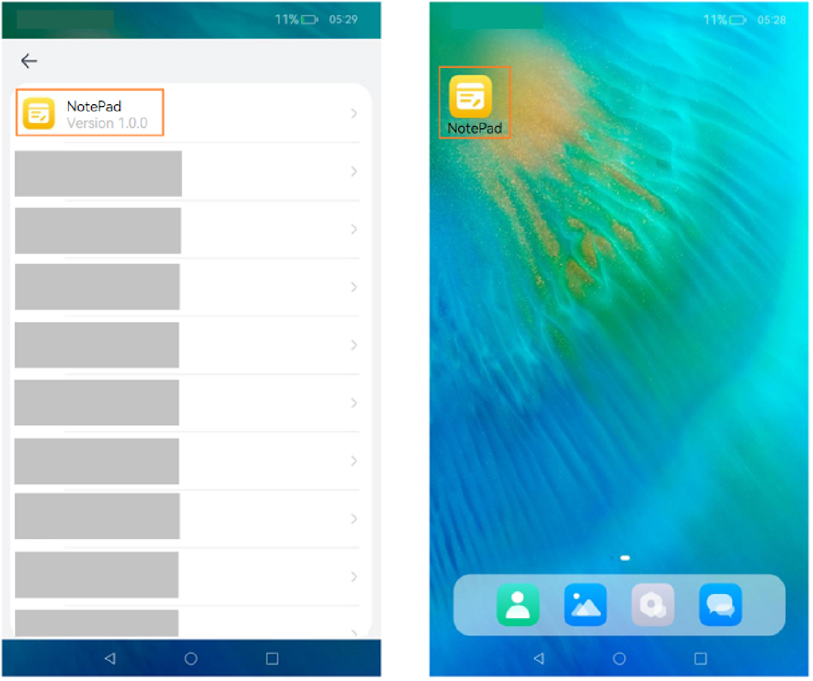

# Configuring an Application Icon and Label
<!--Kit: Ability Kit-->
<!--Subsystem: BundleManager-->
<!--Owner: @wanghang904-->
<!--Designer: @hanfeng6-->
<!--Tester: @kongjing2-->
<!--Adviser: @Brilliantry_Rui-->

This topic describes how to configure the application icon and label. Application icons are classified into single-layer icons and layered icons. A single-layer icon contains only one image, and a layered icon contains a foreground image and a background image. For details about the icon specifications and icon configuration rules, see <!--RP1-->[Icon Deliverables](https://gitcode.com/openharmony/docs/blob/master/en/design/ux-design/visual-app-icons.md#icon-deliverables)<!--RP1End--> and [Configuring Icons and Labels](../application-models/application-component-configuration-stage.md#configuring-icons-and-labels), respectively.

## Use Scenarios

<!--RP2-->
- Display an application on an application screen, for example, application list in the Settings app.
- Display an application on the home screen, for example, applications displayed on the home screen or in the recent task list.
<!--RP2End-->

The display effects are as follows.
<!--RP3-->

<!--RP3End-->

## Configuration Priority and Build Policy

* For the HAP file containing UIAbility configuration, the following scenarios are possible:

  * If the **icon** and **label** fields under **abilities** of the [module.json5](module-configuration-file.md) file are configured, and under **skills** of the corresponding ability, **entities** contains **entity.system.home** and **actions** contains **ohos.want.action.home**, the system returns the **icon** and **label** configured in **module.json5**. If there are multiple abilities that meet the requirements, the system returns the icon and label specified for the ability corresponding to **mainElement** in **module.json5**.

  * If the **icon** and **label** fields under **abilities** of the **module.json5** file are not configured, the system returns the **icon** and **label** configured in [app.json5](app-configuration-file.md).

* For the HAP file that does not contain UIAbility configuration, the system returns the **icon** and **label** configured in **app.json5**.

>
> **NOTE**
> 
> During compilation and build, resource files in the **AppScope** directory where the **app.json5** file is located are incorporated into the resource directory of the module. If resource files with the same name exist in these two directories, only the ones in the **AppScope** directory are retained after compilation and packaging.
>
> For example, if the labels of the layered icon files configured in **app.json5** and **module.json5** are the same but the icons are different, the resource files in the **AppScope** directory overwrite those in the module. Finally, the icon configured in **app.json5** is used.
> 
> If no entry UIAbility is set in the application configuration, the application details page is displayed after you tap the application icon on the home screen. Alternatively, go to **Settings** > **Apps & services**, and tap any application to access the application details page. In other cases, the application main page is displayed after you tap the application icon on the home screen. An application does not have an entry UIAbility in either of the following scenarios:
>
>   1. The application does not have any UIAbility.
>   2. The **entities** under the **skills** tag in all UIAbility configurations are not set or do not contain **entity.system.home**, and the **actions** tag is not set or does not contain **ohos.want.action.home**.
>

## Configuring a Single-Layer Icon and Label

- **Method 1: Configuring app.json5**

  This configuration takes effect only when the **module.json5** configuration file does not contain any UIAbility or **icon** and **label** under the **abilities** tag of the UIAbility are not set. (You can manually delete the icon and label configurations).

  ```json
  {
    "app": {
      "icon": "$media:app_icon",
      "label": "$string:app_name" // Configure the resource whose name is app_name in AppScope/resources/base/element/string.json. If the resource already exists, skip this step.
      // ...
    }
  }
  ```

- **Method 2: Configuring module.json5**

  In addition to configuring the **icon** and **label** fields, you need to add **entity.system.home** under **entities** and **ohos.want.action.home** under **actions**.

  ```json
  {
    "module": {
      // ...
      "abilities": [
        {
          "icon": "$media:icon",
          "label": "$string:EntryAbility_label", // Configure the resource whose name is EntryAbility_label in entry/src/main/resources/base/element/string.json. If the resource already exists, skip this step.
          "skills": [
            {
              "entities": [
                "entity.system.home"
              ],
              "actions": [
                "ohos.want.action.home"
              ]
            }
          ],
        }
      ]
    }
  }
  ```

## Configuring the Layered Icon and Label

- **Method 1: Configuring app.json5**

  This configuration takes effect only when the **module.json5** configuration file does not contain any UIAbility or **icon** and **label** under the **abilities** tag of the UIAbility are not set. (You can manually delete the icon and label configurations).

  1. Place the foreground and background resource files in **AppScope\resources\base\media**.

      In this example, the file names of the foreground and background resource files are **foreground.png** and **background.png**, respectively.

  2. In the **app_layered_image.json** file under the **AppScope\resources\base\media** directory, configure the foreground and background resources of the layered icon.

      ```json
      {
        "layered-image":
        {
          "background" : "$media:background",
          "foreground" : "$media:foreground"
        }
      }
      ```
  3. Reference the layered icon resource file in the [app.json5](app-configuration-file.md) file. Example:
      ```json
          {
            "app": {
              "icon": "$media:app_layered_image",
              "label": "$string:app_name" // Configure the resource whose name is app_name in AppScope/resources/base/element/string.json. If the resource already exists, skip this step.
              // ...
            }
          }
      ```

- **Method 2: Configuring module.json5**

  1. Place the foreground and background resource files in **entry\src\main\resources\base\media**.

      In this example, the file names of the foreground and background resource files are **foreground.png** and **background.png**, respectively.

  2. In the **layered_image.json** file under the **entry\src\main\resources\base\media** directory, configure the foreground and background resources of the layered icon.

      ```json
      {
        "layered-image":
        {
          "background" : "$media:background",
          "foreground" : "$media:foreground"
        }
      }
      ```

  3. To display a UIAbility icon on the home screen, you must configure the **icon** and **label** fields, and under the **skills** tag, add **entity.system.home** to **entities** and **ohos.want.action.home** to **actions**.

      ```json
      {
        "module": {
          "abilities": [
            {
              "name": "EntryAbility",
              // ...
              "icon": "$media:layered_image", // Set icon to the index of the layered icon resource file.
              "label": "$string:EntryAbility_label", // Configure the resource whose name is EntryAbility_label in entry/src/main/resources/base/element/string.json. If the resource already exists, skip this step.
              "skills": [
                {
                  "entities": [
                    "entity.system.home"
                  ],
                  "actions": [
                    "ohos.want.action.home"
                  ]
                }
              ],
              // ...
            }
          ]
          // ...
        }
      }
      ```

>
> **NOTE**
>
> Since DevEco Studio 5.0.3.814, the default template contains the layered icon resource file when an application is created. The name of the resource file generated in different versions may be different. The file name can be manually modified. If the layered icon resource file does not exist, you have to manually create it. The file name must comply with the resource naming rules and can contain only digits, letters, periods (.), and underscores (_).
>

<!--Del-->
## Management Rules

The system strictly controls applications without icons to prevent malicious applications from deliberately displaying no icon on the home screen to block uninstall attempts. Therefore, home screen icons cannot be hidden for applications except pre-installed ones.

If the pre-installed application indeed needs to hide the home screen icon, the **AllowAppDesktopIconHide** [application privilege](../../device-dev/subsystems/subsys-app-privilege-config-guide.md#general-application-privileges) must be configured. For details about the configuration, see "Application Privilege Configuration." After this privilege is granted, the application icon will not be displayed on the home screen.<!--DelEnd-->
