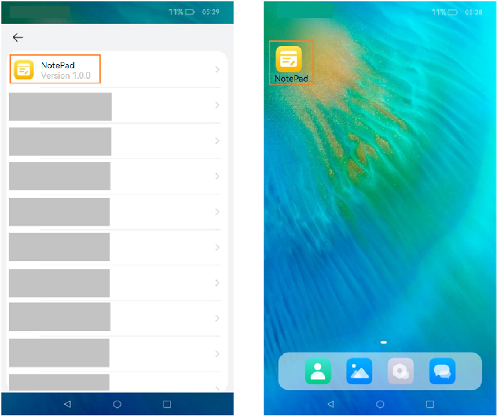

# Configuring an Application Icon and Label

<!--Kit: Ability Kit-->
<!--Subsystem: BundleManager-->
<!--Owner: @wanghang904-->
<!--Designer: @hanfeng6-->
<!--Tester: @memghaiyang-->
<!--Adviser: @HelloCrease-->
<!-- md-trans-meta sourceCommit=e614db0ed9ef9e65ff9f340640f4a0fd5317e78d translatedAt=2026-08-13T09:06:30.961Z pushedAt=2026-08-13T13:57:45.383Z -->

This page provides guidance on configuring the app icon and name. App icons are classified into single-layer icons and layered icons. A single-layer icon contains one image, while a layered icon contains a foreground image and a background image. For details about icon specifications, see <!--RP1-->[Design Principles](../../design/ux-design/visual-app-icons.md#design-principles)<!--RP1End-->. For details about icon and name configuration constraints, see [Configuring the Application Icon and Label](../application-models/application-component-configuration-stage.md#configuring-the-application-icon-and-label).

## Use Scenarios

<!--RP2-->

- Display an application on an application screen, for example, application list in the Settings app.

- Display an application on the home screen, for example, applications displayed on the home screen or in the recent task list.

<!--RP2End-->

The display effects are as follows.

<!--RP3-->



<!--RP3End-->

## Configuration Priority and Build Policy

* For the HAP file containing UIAbility configuration, the following scenarios are possible:

  1. An entry **UIAbility** is a **UIAbility** whose **entities** in the **skills** tag contain **"entity.system.home"** and whose **actions** contain **"ohos.want.action.home"**.

  2. If multiple entry **UIAbilities** are configured in **module.json5**:

      * If **mainElement** in **module.json5** is configured as an entry **UIAbility**, the system returns the **icon** and **label** configured for the entry **UIAbility** specified by **mainElement**.

      * If **mainElement** is not configured in **module.json5**, or is not configured as an entry **UIAbility**, the system returns the **icon** and **label** configured for the first entry **UIAbility** in **module.json5**.

  3. In **module.json5**, the system returns the **icon** or **label** in **app.json5** in either of the following cases:

      * **mainElement** is configured as an entry **UIAbility**, but the entry **UIAbility** does not configure an **icon** or **label**.

      * **mainElement** is not configured, or is not configured as an entry **UIAbility**, and the first entry **UIAbility** in **module.json5** does not configure an **icon** or **label**.

  In a multi-HAP project, if an **entry**-type HAP exists, the **module.json5** file of the **entry**-type HAP is used. If no **entry**-type HAP exists, the system sorts the **moduleName** values of all HAPs in ASCII lexicographical order and uses the **module.json5** file of the **feature** HAP that appears last in the sorted result.

* For the HAP file that does not contain **UIAbility** configuration, the system returns the **icon** and **label** configured in **app.json5**.

>
> **NOTE**
>
> During compilation and building, the resource files under the AppScope directory are merged into the resource directory with the same path in the module. If files with the same name exist in both directories, the resource files under the AppScope directory overwrite the resources in the module after compilation and packaging.
>
> For example, if the layered icon resource files configured in app.json5 and module.json5 have the same name but different icons, the resource files under the AppScope directory overwrite the files in the module, and the icon configured in app.json5 takes effect.
>
> If no entry UIAbility is configured in the application, tapping the home screen icon directly opens the app details page (under **Settings** > **Apps & services**, tap any app to open its app details page). In other cases, tapping the home screen icon directly opens the app page. The scenario where no entry UIAbility is configured includes two cases:
>
>   1. The application does not configure any UIAbility.
>   2. In all UIAbilities, the entities under the skills tag are not configured or do not contain "entity.system.home", and the actions are not configured or do not contain "ohos.want.action.home".
>

## Configuring a Single-Layer Icon and Label

- **Method 1: Configuring app.json5**

  This configuration takes effect only when the **module.json5** configuration file does not contain any UIAbility or **icon** and **label** under the **abilities** tag of the UIAbility are not set. (You can manually delete the icon and label configurations).

  <!-- @[layered_image_001](https://gitcode.com/openharmony/applications_app_samples/blob/master/code/DocsSample/bmsSample/LayeredImage1/AppScope/app.json5) -->

  ``` JSON5
  {
    "app": {
      // ...
      "icon": "$media:app_icon",
      "label": "$string:app_name" // Configure the resource whose name is app_name in AppScope/resources/base/element/string.json. If the resource already exists, skip this step.
    }
  }
  ```

- **Method 2: Configuring module.json5**

  In addition to configuring the **icon** and **label** fields, you also need to add **entity.system.home** to **entities** and **ohos.want.action.home** to **actions** under the **skills** tag.

  <!-- @[layered_image_002](https://gitcode.com/openharmony/applications_app_samples/blob/master/code/DocsSample/bmsSample/LayeredImage1/entry/src/main/module.json5) -->

  ``` JSON5
  {
    "module": {
      // ...
      "abilities": [
        {
          // ...
          "icon": "$media:icon",
          // Configure the resource whose name is EntryAbility_label in entry/src/main/resources/base/element/string.json. If the resource already exists, skip this step.
          "label": "$string:EntryAbility_label",
          "skills": [
            {
              "entities": [
                "entity.system.home"
              ],
              "actions": [
                "ohos.want.action.home"
              ]
            }
          ]
        }
      ],
      // ...
    }
  }
  ```

## Configuring a Layered Icon and Label

- **Method 1: Configuring app.json5**

  This configuration takes effect only when the **module.json5** configuration file does not contain any UIAbility or **icon** and **label** under the **abilities** tag of the UIAbility are not set. (You can manually delete the icon and label configurations).

  1. Place the foreground and background resource files in **AppScope\resources\base\media**.

      In this example, the file names of the foreground and background resource files are **foreground.png** and **background.png**, respectively.

  2. In the **app_layered_image.json** file under the **AppScope\resources\base\media** directory, configure the foreground and background resources of the layered icon.

      ```json
      {
        "layered-image":
        {
          "background" : "$media:background",
          "foreground" : "$media:foreground"
        }
      }
      ```

  3. Reference the layered icon resource file in the [app.json5](app-configuration-file.md) file. Example:

      <!-- @[layered_image_003](https://gitcode.com/openharmony/applications_app_samples/blob/master/code/DocsSample/bmsSample/LayeredImage2/AppScope/app.json5) -->

      ``` JSON5
      {
        "app": {
          // ...
          "icon": "$media:layered_image",
          "label": "$string:app_name" // Configure the resource whose name is app_name in AppScope/resources/base/element/string.json. If the resource already exists, skip this step.
        }
      }
      ```

- **Method 2: Configuring module.json5**

  1. Place the foreground and background resource files in **entry\src\main\resources\base\media**.

      In this example, the file names of the foreground and background resource files are **foreground.png** and **background.png**, respectively.

  2. In the **layered_image.json** file under the **entry\src\main\resources\base\media** directory, configure the foreground and background resources of the layered icon.

      ```json
      {
        "layered-image":
        {
          "background" : "$media:background",
          "foreground" : "$media:foreground"
        }
      }
      ```

  3. If you need to display a **UIAbility** icon on the home screen, in addition to configuring the **icon** and **label** fields, you also need to add **entity.system.home** to **entities** and **ohos.want.action.home** to **actions** under the **skills** tag.

      <!-- @[layered_image_004](https://gitcode.com/openharmony/applications_app_samples/blob/master/code/DocsSample/bmsSample/LayeredImage2/entry/src/main/module.json5)  -->

      ``` JSON5
      {
        "module": {
          // ...
          "abilities": [
            {
              // ...
              // Set icon to the index of the layered icon resource file.
              "icon": "$media:layered_image",
              // Configure the resource whose name is EntryAbility_label in entry/src/main/resources/base/element/string.json. If the resource already exists, skip this step.
              "label": "$string:EntryAbility_label",
              "skills": [
                {
                  "entities": [
                    "entity.system.home"
                  ],
                  "actions": [
                    "ohos.want.action.home"
                  ]
                }
              ]
            }
          ],
          // ...
        }
      }
      ```

>
> **NOTE**
>
> Since DevEco Studio 5.0.3.814, the default template contains the layered icon resource file when an application is created. The name of the resource file generated in different versions may be different. The file name can be manually modified. If the layered icon resource file does not exist, you have to manually create it. The file name must comply with the resource naming rules and can contain only digits, letters, periods (.), and underscores (_).
>

## Configuring Alternate Icons

Starting from API version 26.0.0, you can configure alternate icons to dynamically switch them at application runtime, which applies to scenarios such as user preferences, festival themes, and brand campaigns. You can preconfigure multiple alternate icons in the alternateIcons tag of the [app.json5 configuration file](app-configuration-file.md#alternateicons), up to 1024, and dynamically switch them by following the steps below.

Alternate icons support both single-layer icons and layered icons. For details about how to prepare and configure resource files, see [Configuring a Single-Layer Icon and Label](#configuring-a-single-layer-icon-and-label) and [Configuring a Layered Icon and Label](#configuring-a-layered-icon-and-label), respectively.

>
> **NOTE**
>
> - The alternateIcons tag takes effect only when bundleType is app.
>
> - An application can enable only one alternate icon at a time.
>
> - Clone apps do not support setting and querying alternate icons.
>

1. Add the [alternateIcons tag](app-configuration-file.md#alternateicons) to the [app.json5 configuration file](app-configuration-file.md) to declare the alternate icon list.

    <!-- @[layered_image_005](https://gitcode.com/openharmony/applications_app_samples/blob/master/code/DocsSample/bmsSample/LayeredImage3/AppScope/app.json5) -->

    ``` JSON5
    {
      "app": {
        // ...
        "alternateIcons": [
          {
            "name": "summer_theme",
            "icon": "$media:layered_image"
          },
          {
            "name": "winter_theme",
            "icon": "$media:winter_icon"
          }
        ]
      }
    }
    ```

2. Use the [bundleManager.setAlternateIcon](../reference/apis-ability-kit/js-apis-bundleManager.md#bundlemanagersetalternateicon) API to set an alternate icon. Pass the value of the name field configured in the alternateIcons tag to enable the corresponding alternate icon.

    <!-- @[layered_image_006](https://gitcode.com/openharmony/applications_app_samples/blob/master/code/DocsSample/bmsSample/LayeredImage3/entry/src/main/ets/pages/Index.ets)  -->

    ``` TypeScript
    import { bundleManager } from '@kit.AbilityKit';
    import { BusinessError } from '@kit.BasicServicesKit';
    import { hilog } from '@kit.PerformanceAnalysisKit';
    
    @Entry
    @Component
    struct Index {
    
      build() {
        Scroll() {
          Column() {
            Text("SetAlternateIcon")
              .fontSize($r('app.float.page_text_font_size'))
              .fontWeight(FontWeight.Bold)
              .alignRules({
                center: { anchor: '__container__', align: VerticalAlign.Center },
                middle: { anchor: '__container__', align: HorizontalAlign.Center }
              })
              .onClick(() => {
                // Replace alternateIconName with the name field value configured under the alternateIcons tag in app.json5.
                let alternateIconName: string = 'summer_theme';
                try {
                  bundleManager.setAlternateIcon(alternateIconName).then(() => {
                    hilog.info(0x0000, 'testTag', 'setAlternateIcon successfully');
                  }).catch((err: BusinessError) => {
                    hilog.error(0x0000, 'testTag', 'setAlternateIcon failed. Cause: %{public}s', err.message);
                  });
                } catch (err) {
                  let message = (err as BusinessError).message;
                  hilog.error(0x0000, 'testTag', 'setAlternateIcon failed. Cause: %{public}s', message);
                }
              })
            // ...
            // ...
          }
          .width('100%')
        }
        .height('100%')
      }
    }
    ```

3. Call the [bundleManager.setAlternateIcon](../reference/apis-ability-kit/js-apis-bundleManager.md#bundlemanagersetalternateicon) API and pass an empty string to restore the default icon.

    <!-- @[layered_image_007](https://gitcode.com/openharmony/applications_app_samples/blob/master/code/DocsSample/bmsSample/LayeredImage3/entry/src/main/ets/pages/Index.ets)  -->

    ``` TypeScript
    import { bundleManager } from '@kit.AbilityKit';
    import { BusinessError } from '@kit.BasicServicesKit';
    import { hilog } from '@kit.PerformanceAnalysisKit';
    
    @Entry
    @Component
    struct Index {
    
      build() {
        Scroll() {
          Column() {
            // ...
            Text("RestoreDefaultIcon")
              .fontSize($r('app.float.page_text_font_size'))
              .fontWeight(FontWeight.Bold)
              .alignRules({
                center: { anchor: '__container__', align: VerticalAlign.Center },
                middle: { anchor: '__container__', align: HorizontalAlign.Center }
              })
              .onClick(() => {
                try {
                  bundleManager.setAlternateIcon('').then(() => {
                    hilog.info(0x0000, 'testTag', 'restore default icon successfully');
                  }).catch((err: BusinessError) => {
                    hilog.error(0x0000, 'testTag', 'restore default icon failed. Cause: %{public}s', err.message);
                  });
                } catch (err) {
                  let message = (err as BusinessError).message;
                  hilog.error(0x0000, 'testTag', 'restore default icon failed. Cause: %{public}s', message);
                }
              })
            // ...
          }
          .width('100%')
        }
        .height('100%')
      }
    }
    ```

4. Use the [bundleManager.getAlternateIcons](../reference/apis-ability-kit/js-apis-bundleManager.md#bundlemanagergetalternateicons) API to query alternate icon information. The returned [AlternateIconInfo](../reference/apis-ability-kit/js-apis-bundleManager-bundleInfo.md#alternateiconinfo) array contains the name (iconName), resource ID (iconId), and enabled status (enabled) of each alternate icon.

    <!-- @[layered_image_008](https://gitcode.com/openharmony/applications_app_samples/blob/master/code/DocsSample/bmsSample/LayeredImage3/entry/src/main/ets/pages/Index.ets)  -->

    ``` TypeScript
    import { bundleManager } from '@kit.AbilityKit';
    import { BusinessError } from '@kit.BasicServicesKit';
    import { hilog } from '@kit.PerformanceAnalysisKit';
    
    @Entry
    @Component
    struct Index {
    
      build() {
        Scroll() {
          Column() {
            // ...
            Text("GetAlternateIcons")
              .fontSize($r('app.float.page_text_font_size'))
              .fontWeight(FontWeight.Bold)
              .alignRules({
                center: { anchor: '__container__', align: VerticalAlign.Center },
                middle: { anchor: '__container__', align: HorizontalAlign.Center }
              })
              .onClick(() => {
                try {
                  bundleManager.getAlternateIcons().then((data) => {
                    hilog.info(0x0000, 'testTag', 'getAlternateIcons successfully. Data: %{public}s', JSON.stringify(data));
                  }).catch((err: BusinessError) => {
                    hilog.error(0x0000, 'testTag', 'getAlternateIcons failed. Cause: %{public}s', err.message);
                  });
                } catch (err) {
                  let message = (err as BusinessError).message;
                  hilog.error(0x0000, 'testTag', 'getAlternateIcons failed. Cause: %{public}s', message);
                }
              })
          }
          .width('100%')
        }
        .height('100%')
      }
    }
    ```

<!--Del-->

## Management Rules

The system strictly controls applications without icons to prevent malicious applications from deliberately displaying no icon on the home screen to block uninstall attempts. Therefore, home screen icons cannot be hidden for applications except pre-installed ones.

If the pre-installed application indeed needs to hide the home screen icon, the application privilege **AllowAppDesktopIconHide** must be configured. For details about how to configure, see [Application Privilege Configuration](../../device-dev/subsystems/subsys-app-privilege-config-guide.md#general-application-privileges). After this privilege is granted, the application icon will not be displayed on the home screen.<!--DelEnd-->