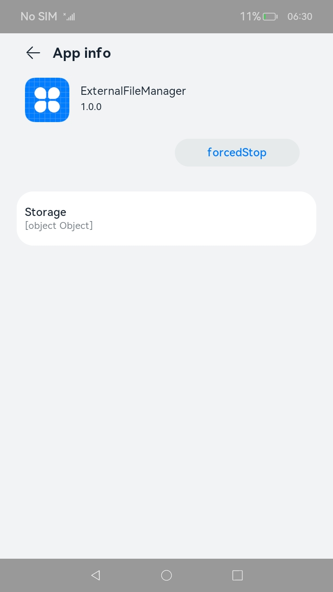

# Structure of the module Tag
<!--Kit: Ability Kit-->
<!--Subsystem: BundleManager-->
<!--Owner: @wanghang904-->
<!--Designer: @hanfeng6-->
<!--Tester: @kongjing2-->
<!--Adviser: @Brilliantry_Rui-->

The **module** tag contains the HAP configuration.

 **Table 1** Internal structure of the module tag

| Name| Description| Data Type| Initial Value Allowed|
| -------- | -------- | -------- | -------- |
| mainAbility | Ability whose icon is displayed in the Service Center. When the resident process is started, the **mainAbility** is started.| String| Yes (initial value: left empty)|
| package | Package name of the HAP file, which must be unique in the application. The value is a string with a maximum of 127 bytes, in the reverse domain name notation. It is recommended that the value be the same as the project directory of the HAP file.  | String| No|
| name | Class name of the HAP file. The value is a string with a maximum of 255 bytes, in the reverse domain name notation. The prefix must be the same as the **package** value specified for this module. Alternatively, the value can start with a period (.) followed by the class name.| String| Yes (initial value: left empty)|
| description | Description of the HAP file. The value is a string with a maximum of 255 bytes. If the value exceeds the limit or needs to support multiple languages, you can use a resource index to the description.| String| Yes (initial value: left empty)|
| supportedModes | Modes supported by the application. Currently, only the **drive** mode is defined. This attribute applies only to telematics devices.| String array| Yes (initial value: left empty)|
|deviceType | <!--RP1-->Type of device on which the ability can run. The device types predefined in the system include **tablet**, **tv**, **car**, and **wearable**.<!--RP1End--> | String array| No|
|distro | Distribution description of the HAP file.| Object| No|
|metaData | Metadata of the HAP file.| Object| Yes (initial value: left empty)|
| abilities | All abilities in the current module. The value is an array of objects, each of which represents an ability.| Object array| Yes (initial value: left empty)|
| js | A set of JS modules developed using ArkUI. The value is an array of objects, each of which represents a JS module.| Object array| Yes (initial value: left empty)|
| shortcuts | Shortcuts of the application. The value is an array of objects, each of which represents a shortcut object.| Object array| Yes (initial value: left empty)|
| reqPermissions | Permissions that the application requests from the system when it is running.| Object array| Yes (initial value: left empty)|
| colorMode | Color mode of the application. The options are as follows:<br>- **dark**: Resources applicable for the dark mode are used.<br>- **light**: Resources applicable for the light mode are used.<br>- **auto**: Resources are used based on the color mode of the system.| String| Yes (initial value: **auto**)|
| distroFilter | Rules for distributing HAP files based on different device specifications, so that precise matching can be performed when the application market distributes applications. All sub-attributes under this attribute are optional. This attribute must be configured in the **/resource/profile** directory. During distribution, a unique HAP is determined based on the mapping between **deviceType** and attributes listed in the table below.| Object| Yes (initial value: left empty)<br> Set this attribute when an application has multiple entry modules.|
|commonEvents | Information about the common event static subscriber, which must contain the subscriber name, required permissions, and list of the common events subscribed to. When a subscribed event is sent, the static subscriber is started. Unlike the dynamic subscriber, the static subscriber does not need to proactively call the common event subscription API in the service code, and may not be running when the common event is published.| Object array| Yes (initial value: left empty)|
| entryTheme | Keyword of an internal theme. Set it to the resource index of the name.| String| Yes (initial value: left empty)|
|testRunner | Test runner configuration.| Object| Yes (initial value: left empty)|
|generateBuildHash |Whether the hash value of the HAP or HSP file is generated by the packaging tool.<br>If this parameter is set to **true**, the packaging tool generates a hash value for the current HAP or HSP file. During OTA update, if [code of the version attribute](./app-structure.md#internal-structure-of-the-version-attribute) remains unchanged, you can determine whether the application needs to be updated based on the hash value.<br>- **true**: the hash value of the current HAP/HSP is generated by the packaging tool.<br>- **false**: the hash value of the current HAP/HSP is not generated by the packaging tool.<br>**NOTE**<br>This field takes effect only for preset applications.|Boolean|Yes (initial value: **false**)|
|libIsolation |Whether to save the .so files of the current HAP to a separate folder (named after the module) in the **libs** directory. This is intended to avoid .so file conflicts between HAPs.<br>- **true**: The .so files of the current HAP are stored in a separate folder (named after the module) in the **libs** directory.<br>- **false**: The .so files of the current HAP are directly stored in the **libs** directory.|Boolean|Yes (initial value: **false**)|

Example of the **module** tag structure:

```json
{
  "module": {
    "mainAbility": ".EntryAbility",
    "deviceType": [
      "default",
      "tablet"
    ],
    "abilities": [
      {
        "skills": [
          {
            "entities": [
              "entity.system.home"
            ],
            "actions": [
              "action.system.home"
            ]
          }
        ],
        "orientation": "unspecified",
        "visible": true,
        "srcPath": "EntryAbility",
        "name": ".EntryAbility",
        "srcLanguage": "ets",
        "icon": "$media:icon",
        "description": "$string:MainAbility_desc",
        "formsEnabled": false,
        "label": "$string:MainAbility_label",
        "type": "page",
        "launchType": "multiton"
      }
    ],
    "distro": {
      "moduleType": "entry",
      "installationFree": false,
      "deliveryWithInstall": true,
      "moduleName": "entry"
    },
    "package": "com.example.entry",
    "srcPath": "",
    "name": ".entry",
    "js": [
      {
        "mode": {
          "syntax": "ets",
          "type": "pageAbility"
        },
        "pages": [
          "pages/Index"
        ],
        "name": ".EntryAbility",
        "window": {
          "designWidth": 720,
          "autoDesignWidth": false
        }
      }
    ]
  }
}
```

## Internal Structure of the distro Attribute

**Table 2** Internal structure of the distro attribute

| Name| Description| Data Type| Initial Value Allowed|
| -------- | -------- | -------- | -------- |
| moduleName | Name of the HAP file. The maximum length is 31 bytes. This name can be changed during application update. However, if it is changed, you need to adapt the application to the migration of module-related directories. You can use the [file operation API](../reference/apis-core-file-kit/js-apis-file-fs.md) for this purpose.| String| No|
| moduleType | Type of the HAP file, which can **entry**, **feature**, or **har**.| String| No|
| installationFree | Whether the HAP file supports the installation-free feature. **true**: The HAP file supports the installation-free feature and meets installation-free constraints. **false**: The HAP file does not support the installation-free feature. If this tag is set to **true** for an entry-type HAP file (**entry.hap**), it must also be set to **true** for feature-type HAP files (**feature.hap**) of the same application. If this tag is set to **false** for an entry-type HAP file, it can be set to **true** or **false** for feature-type modules of the same application based on service requirements.| Boolean| No|
| deliveryWithInstall | Whether the HAP file will be installed when the user installs the application. **true**: The HAP file will be installed when the user installs the application. **false**: The HAP file will not be installed when the user installs the application.| Boolean| No|


Example of the **distro** attribute structure:

```json
"distro": {
  "moduleName": "ohos_entry",
  "moduleType": "entry",
  "installationFree": true,
  "deliveryWithInstall": true
}
```

## Internal Structure of the metadata Attribute

**Table 3** Internal structure of the metadata attribute

| Name| Description| Data Type| Initial Value Allowed|
| -------- | -------- | -------- | -------- |
| parameters | Metadata of the parameters to be passed for calling the ability. The metadata of each parameter consists of the **description**, **name**, and **type** sub-attributes.| Object array| Yes (initial value: left empty)|
| results | Metadata of the ability return value. The metadata of each return value consists of the **description**, **name**, and **type** sub-attributes.| Object array| Yes (initial value: left empty)|
| customizeData | Custom metadata of the parent component. The attributes **parameters** and **results** cannot be configured in **application**.| Object array| Yes (initial value: left empty)|

## Internal Structure of the parameters Attribute

**Table 4** Internal structure of the parameters attribute

| Name| Description| Data Type| Initial Value Allowed|
| -------- | -------- | -------- | -------- |
| description | Description of the parameter. The value can be a string or a resource index to descriptions in multiple languages. The value can contain a maximum of 255 bytes.| String| Yes (initial value: left empty)|
| name | Name of the parameter passed for calling the ability. The value can contain a maximum of 255 bytes.| String| No|
| type | Type of the parameter passed for calling the ability, for example, **Integer**.| String| No|

## Internal Structure of the results Attribute

**Table 5** Internal structure of the results attribute

| Name| Description| Data Type| Initial Value Allowed|
| -------- | -------- | -------- | -------- |
| description | Description of the return value. The value can be a string or a resource index to descriptions in multiple languages. The value can contain a maximum of 255 bytes.| String| Yes (initial value: left empty)|
| name | Name of the return value. The value can contain a maximum of 255 bytes.| String| Yes (initial value: left empty)|
| type | Type of the return value, for example, **Integer**.| String| No|

## Internal Structure of the customizeData Attribute

**Table 6** Internal structure of the customizeData attribute

| Name| Description| Data Type| Initial Value Allowed|
| -------- | -------- | -------- | -------- |
| name | Key of the data element. The value is a string with a maximum of 255 bytes.| String| Yes (initial value: left empty)|
| value | Value of the data element. The value is a string with a maximum of 255 bytes.| String| Yes (initial value: left empty)|
| extra | Custom format of the data element. The value is a resource index that identifies the data.| String| Yes (initial value: left empty)|


Example of the metadata attribute:

```json
"metaData": {
  "parameters" : [{
    "name" : "a test for metadata parameter",
    "type" : "Float",
    // "$string:parameters_description" is a file resource index.
    "description" : "$string:parameters_description"
  }],
  "results" : [{
    "name" : "a test for metadata result",
    "type" : "Float",
    "description" : "$string:results_description"
  }],
  "customizeData" : [{
    "name" : "a customizeData",
    "value" : "string",
    "extra" : "$string:customizeData_description"
  }]
}
```

## deviceType Attribute

**Table 7** Values of the deviceType attribute

<!--RP2-->
| Device Type| Value| Description|
| -------- | -------- | -------- |
| Tablet| tablet | - |
| Smart TV| tv | - |
| Smart watch| wearable | Watch that provides call features.|
| Sports watch| litewearable | - |
| Head unit| car | - |
| Default device| default | Device that provides full access to system capabilities.|
<!--RP2End-->

## Internal Structure of the abilities Attribute

**Table 8** Internal structure of the abilities attribute

| Name| Description| Data Type| Initial Value Allowed|
| -------- | -------- | -------- | -------- |
| process | Name of the process running the application or ability. If the **process** attribute is configured in the **deviceConfig** tag, all abilities of the application run in this process. You can set the **process** attribute for a specific ability in the **abilities** attribute, so that the ability can run in the particular process. If this attribute is set to the name of the process running other applications, all these applications can run in the same process, provided they have the same unified user ID and the same signature. The value can contain a maximum of 31 bytes.| String| Yes (initial value: left empty)|
| name | Ability name. The value can be a reverse domain name, in the format of "*bundleName*.*className*", for example, **"com.example.myapplication.EntryAbility"**. Alternatively, the value can start with a period (.) followed by the class name, for example, **".EntryAbility"**.<br>The ability name must be unique in an application. Note: If you use DevEco Studio to create the project, an ability named **EntryAbility** will be created by default, and its configuration will be saved to the **config.json** file. If you use other tools in DevEco Studio, the value of this attribute can be customized. The value can contain a maximum of 127 bytes.| String| No|
| description | Description of the ability. The value can be a string or a resource index to descriptions in multiple languages. The value can contain a maximum of 255 bytes.| String| Yes (initial value: left empty)|
| icon | Index to the ability icon file. Example value: **$media:ability_icon**. In the **skills** attribute of the ability, if the **actions** value contains **action.system.home** and the **entities** value contains **entity.system.home**, the icon of the ability is also used as the icon of the application. If multiple abilities address this condition, the icon of the first candidate ability is used as the application icon.<br>Note: The **icon** and **label** values of an application are visible to users. Ensure that at least one of them is different from any existing icons or labels.| String| Yes (initial value: left empty)|
| label | Ability name displayed to users. The value can be a name string or a resource index to names in multiple languages, for example, **$string:ability_label**. In the **skills** attribute of the ability, if the **actions** value contains **action.system.home** and the **entities** value contains **entity.system.home**, the label of the ability is also used as the label of the application. If multiple abilities address this condition, the label of the first candidate ability is used as the application label.<br>Note: The **icon** and **label** values of an application are visible to users. Ensure that at least one of them is different from any existing icons or labels. The value can be a reference to a string defined in a resource file or a string enclosed in brackets ({}). The value can contain a maximum of 255 bytes.| String| Yes (initial value: left empty)|
| uri | Uniform Resource Identifier (URI) of the ability. The value can contain a maximum of 255 bytes.| String| Yes (No for abilities using the Data template)|
| launchType | Launch type of the ability. The value can be **multiton** or **singleton**.<br>**standard**: Multiple **Ability** instances can be created during startup. Most abilities can use this type.<br>**singleton**: Only a single **Ability** instance can be created across all task stacks during startup. For example, a globally unique incoming call screen uses the singleton launch type. This attribute applies only to the default, tablet, smart TV, a telematics device, and wearable device types.| String| Yes (initial value: **"singleton"**)|
| visible | Whether the ability can be called by other applications.<br>**true**: The ability can be called by other applications.<br>**false**: The ability cannot be called by other applications, not even by aa commands.| Boolean| Yes (initial value: **false**)|
| permissions | Permissions required for abilities of another application to call the current ability. The value is an array of permission names predefined by the system, generally in the reverse domain name notation. It contains a maximum of 255 bytes.| String array| Yes (initial value: left empty)|
|skills | Types of the **want** that can be accepted by the ability.| Object array| Yes (initial value: left empty)|
| deviceCapability | Device capabilities required to run the ability. The value is an array of up to 512 elements, each of which contains a maximum of 64 bytes.| String array| Yes (initial value: left empty)|
| metaData | Metadata.| Object| Yes (initial value: left empty)|
| type | Ability type. The options are as follows:<br>**page**: FA developed using the Page template to provide the capability of interacting with users.<br>**service**: PA developed using the Service template to provide the capability of running tasks in the background.<br>**data**: PA developed using the Data template to provide unified data access for external systems.<br>**CA**: ability that can be started by other applications as a window.| String| No|
| orientation | Display orientations of the ability. This attribute applies only to the ability using the Page template. The options are as follows:<br>**unspecified**: indicates that the system automatically determines the display orientation of the ability.<br>**landscape**: indicates the landscape orientation.<br>**portrait**: indicates the portrait orientation.<br>**followRecent**: indicates that the orientation follows the most recent application in the stack.| String| Yes (initial value: **"unspecified"**)|
| backgroundModes | Background service type of the ability. You can assign multiple background service types to a specific ability. This field applies only to the ability using the Service template. The options are as follows:<br>**dataTransfer**: data transfer through the network or peer device, such as download, backup, and share<br>**audioPlayback**: audio playback<br>**audioRecording**: audio recording<br>**pictureInPicture**: video playback in picture-in-picture (PiP) mode or in a small window<br>**voip**: voice and video calls over VoIP<br>**location**: location and navigation<br>**bluetoothInteraction**: Bluetooth scanning, connection, and transmission<br>**wifiInteraction**: Wi-Fi scanning, connection, and transmission<br>**screenFetch**: screen recording and screenshot<br>**multiDeviceConnection**: multi-device connection| String array| Yes (initial value: left empty)|
| grantPermission | Whether permissions can be granted for any data in the ability.<br>- **true**: The permission can be granted for any data in the ability.<br>- **false**: The permission cannot be granted for any data in the ability.| Boolean| Yes (initial value: left empty)|
| readPermission | Permission required for reading data in the ability. This attribute applies only to the ability using the Data template. The value is a string with a maximum of 255 bytes. This attribute applies only to the default, tablet, smart TV, a telematics device, and wearable device types.| String| Yes (initial value: left empty)|
| writePermission | Permission required for writing data to the ability. This attribute applies only to the ability using the Data template. The value is a string with a maximum of 255 bytes.| String| Yes (initial value: left empty)|
| configChanges | A set of environment variables concerned by the ability. Upon any changes on the concerned environment variables, the **onConfigurationUpdated** callback will be invoked to notify the ability. The options are as follows:<br>**mcc**: indicates that the mobile country code (MCC) of the IMSI is changed. Typical scenario: A SIM card is detected, and the MCC is updated.<br>**mnc**: indicates that the mobile network code (MNC) of the IMSI is changed. Typical scenario: A SIM card is detected, and the MNC is updated.<br>**locale**: indicates that the locale is changed. Typical scenario: The user selects a new language for the text display of the device.<br>**layout**: indicates that the screen layout is changed. Typical scenario: Currently, different display forms are all in the active state.<br>**fontSize**: indicates that font size is changed. Typical scenario: A new global font size is set.<br>**orientation**: indicates that the screen orientation is changed. Typical scenario: The user rotates the device.<br>**density**: indicates that the display density is changed. Typical scenario: The user may specify different display ratios, or different display forms are active at the same time.<br>**size**: indicates that the size of the display window is changed.<br>**smallestSize**: indicates that the length of the shorter side of the display window is changed.<br>**colorMode**: indicates that the color mode is changed.| String array| Yes (initial value: left empty)|
| mission | Task stack of the ability. This attribute applies only to the ability using the Page template. By default, all abilities in an application belong to the same task stack.| String| Yes (initial value: bundle name of the application)|
| targetAbility | Target ability that this ability alias points to. This attribute applies only to the ability using the Page template. If the **targetAbility** attribute is set, only **name**, **icon**, **label**, **visible**, **permissions**, and **skills** take effect in the current ability (ability alias). Other attributes use the values of the **targetAbility** attribute. The target ability must belong to the same application as the alias and must be declared in **config.json** ahead of the alias.| String| Yes (initial value: left empty, indicating that the current ability is not an alias)|
| formsEnabled | Whether the ability can provide widgets. This attribute applies only to the ability using the Page template.<br>**true**: This ability can provide widgets.<br>**false**: This ability cannot provide widgets.| Boolean| Yes (initial value: **false**)|
| forms | Information about the widgets used by the ability. This attribute is valid only when **formsEnabled** is set to **true**.| Object array| Yes (initial value: left empty)|
| srcLanguage | Programming language of the ability, which you can specify when creating the project. The options are **"js"**, **"ets"**, and **"java"**.| String| Yes (initial value: **"js"**)|
| srcPath | JS code path corresponding to the ability. The value can contain a maximum of 127 bytes.| String| No|
| uriPermission | Application data that the ability can access. This attribute consists of the **mode** and **path** sub-attributes. This attribute is valid only for the capability of the type provider.| Object| Yes (initial value: left empty)|
| startWindowIcon | Index to the icon file of the ability startup page. This attribute applies only to the ability using the Page template. Example: **$media:icon**.| String| Yes (initial value: left empty)|
| startWindowBackground | Index to the background color resource file of the ability startup page. This attribute applies only to the ability using the Page template. Example: **$color:red**.| String| Yes (initial value: left empty)|
| removeMissionAfterTerminate | Whether to remove the relevant task from the task list after the ability is destroyed. This attribute applies only to the ability using the Page template. The value **true** means to remove the relevant task from the task list after the ability is destroyed, and **false** means the opposite.| Boolean| Yes (initial value: **false**)|


Application icons cannot be hidden from the home screen:

The system strictly controls applications without icons to prevent malicious applications from deliberately configuring no icon to block uninstall attempts.

Setting the application icon to be displayed on the home screen:<br>Set **icon**, **label**, and **skills** under **abilities** in the **config.json** file. Make sure the **skills** configuration contains **action.system.home** and **entity.system.home**.
```
{
  "module":{

    // ...

    "abilities": [{
      "icon": "$media:icon",
      "label": "Login",
      "skills": [{
        "actions": ["action.system.home"],
        "entities": ["entity.system.home"],
        "uris": []
      }]
    }],

    // ...

  }
}
```

To hide an entry icon on the home screen, you must configure the **AllowAppDesktopIconHide** privilege.<!--Del--> For details, see [Application Privilege Configuration Guide](../../device-dev/subsystems/subsys-app-privilege-config-guide.md).<!--DelEnd--> The rules for displaying the entry icon and entry label are as follows:
* The HAP file contains Page ability configuration.
  * The application icon on the home screen is set under **abilities** in the **config.json** file.
    * The application does not have the privilege to hide its icon from the home screen.
      * The system uses the icon configured for the Page ability as the entry icon and displays it on the home screen. Touching this icon will direct the user to the home page of the Page ability.
      * The system uses the label configured for the PageAbility as the entry label and displays it on the home screen. If no label is configured, the bundle name is returned.
    * The application has the privilege to hide its icon from the home screen.
      * The application information is not returned when the home screen queries the information, and the entry icon and label of the application are not displayed on the home screen.
  * The application icon on the home screen is not set under **abilities** in the **config.json** file.
    * The application does not have the privilege to hide its icon from the home screen.
      * The system uses the default icon as the entry icon and displays it on the home screen. Touching this icon will direct the user to the application details screen under application management, as shown in Figure 1.
      * The system uses the bundle name of the application as the entry label and displays it on the home screen.
    * The application has the privilege to hide its icon from the home screen.
      * The application information is not returned when the home screen queries the information, and the entry icon and label of the application are not displayed on the home screen.
* The HAP file does not contain Page ability configuration.
  * The application does not have the privilege to hide its icon from the home screen.
    * The system uses the default icon as the entry icon and displays it on the home screen. Touching this icon will direct the user to the application details screen under application management, as shown in Figure 1.
    * The system uses the bundle name of the application as the entry label and displays it on the home screen.
  * The application has the privilege to hide its icon from the home screen.
    * The application information is not returned when the home screen queries the information, and the entry icon and label of the application are not displayed on the home screen.

**Figure 1** Application details screen



**NOTE**<br>The label displayed on the application details screen may be different from the one displayed on the home screen. These two are the same if the entry icon and label are configured for the non-Page ability.<br>
## Internal Structure of the uriPermission Attribute

**Table 9** Internal structure of the uriPermission attribute

| Name| Description| Data Type| Initial Value Allowed|
| -------- | -------- | -------- | -------- |
| path | Path. The value can contain maximum of 255 bytes.| String| No|
| mode | Matching mode.| String| Yes (initial value: **default**)|


Example of the **abilities** attribute structure:

```json
"abilities": [
  {
    "name": ".EntryAbility",
    "description": "test main ability",
    // $media:ic_launcher is a media resource.
    "icon": "$media:ic_launcher",
    // $string:example is a string resource.
    "label": "$string:example",
    "launchType": "multiton",
    "orientation": "unspecified",
    "permissions": [],
    "visible": true,
    "skills": [
      {
        "actions": [
          "action.system.home"
        ],
        "entities": [
          "entity.system.home"
        ]
      }
    ],
    "configChanges": [
      "locale",
      "layout",
      "fontSize",
      "orientation"
    ],
    "type": "page",
    "startWindowIcon": "$media:icon",
    "startWindowBackground": "$color:red",
    "removeMissionAfterTerminate": true
  },
  {
    "name": ".PlayService",
    "description": "example play ability",
    "icon": "$media:ic_launcher",
    "label": "$string:example",
    "launchType": "multiton",
    "orientation": "unspecified",
    "visible": false,
    "skills": [
      {
        "actions": [
          "action.play.music",
          "action.stop.music"
        ],
        "entities": [
          "entity.audio"
        ]
      }
    ],
    "type": "service",
    "backgroundModes": [
      "audioPlayback"
    ]
  },
  {
    "name": ".UserADataAbility",
    "type": "data",
    "uri": "dataability://com.example.world.test.UserADataAbility",
    "visible": true
  }
]
```
## Internal Structure of the skills Attribute

**Table 10** Internal structure of the skills attribute

| Name| Description| Data Type| Initial Value Allowed|
| -------- | -------- | -------- | -------- |
| actions | Actions of the **want** that can be accepted by the ability. Generally, the value is an **action** value predefined in the system.| String array| Yes (initial value: left empty)|
| entities | Entities of the **want** that can be accepted by the ability, such as video and home applications.| String array| Yes (initial value: left empty)|
| uris | Data specifications to be added to the want filter. The specification is a data type (using the **mimeType** attribute), a URI, or both a data type and a URI.<br>The URI is specified by separate attributes of each part: &lt;scheme&gt;://&lt;host&gt;:&lt;port&gt;[&lt;path&gt;\|&lt;pathStartWith&gt;\|&lt;pathRegex&gt;].  <br>The field **scheme** is mandatory when the specification is of the URI type and is optional when the specification is a data type.| Object array| Yes (initial value: left empty)|

## Internal Structure of the uris Attribute

**Table 11** Internal structure of the uris attribute

| Name| Description| Data Type| Initial Value Allowed|
| -------- | -------- | -------- | -------- |
| scheme | Scheme of the URI.| String| No|
| host | Host value of the URI.| String| Yes (initial value: left empty)|
| port | Port number of the URI.| String| Yes (initial value: left empty)|
| pathStartWith | **pathStartWith** value of the URI.| String| Yes (initial value: left empty)|
| path | **path** value of the URI.| String| Yes (initial value: left empty)|
| pathRegx | **pathRegx** value of the URI.| String| Yes (initial value: left empty)|
| type | **type** value of the URI. The value is a MIME type. Typical values include **"audio/aac"** and **"text/css"**.<br>The wildcard formats of ***/*** or **mainType/*** is supported but **mainType/subType.*** is not. The **mainType** is a standard media type.| String| Yes (initial value: left empty)|


Example of the **skills** attribute structure:

```json
"skills": [
  {
    "actions": [
      "action.system.home"
    ],
    "entities": [
      "entity.system.home"
    ],
    "uris": [
      {
        "scheme": "http",
        "host": "www.example.com",
        "port": "8080",
        "path": "query/student/name",
        "type": "text/*"
      }
    ]
  }
]
```

## Internal Structure of the reqPermissions Attribute

**Table 12** Internal structure of the reqPermissions attribute

| Name| Description| Data Type| Initial Value Allowed|
| -------- | -------- | -------- | -------- |
| name | Name of the permission to request.| String| No|
| reason | Reason for requesting the permission. Multi-language adaptation is required.| String| No if the permission to request is user_grant, yes in other cases (initial value: left empty)<br>If the permission to request is user_grant, this attribute is required for the application to be released to the AppGallery.|
| usedScene | Scene under which the permission is used. It consists of the **ability** and **when** sub-attributes.<br>- **ability**: ability name. Multiple ability names can be configured.<br>- **when**: time for using the permission. The options are **inuse** and **always**.| Object| Yes (initial value: left empty)<br>**when**: initial value (**inuse**) allowed|

## Internal Structure of the usedScene Attribute

**Table 13** Internal structure of the usedScene attribute

| Name| Description| Data Type| Initial Value Allowed|
| -------- | -------- | -------- | -------- |
| ability | Names of abilities that require the permission.| String array| Yes (initial value: all ability names)|
| when | Time when the permission is used.<br>**inuse**: The permission is required when the ability is in use.<br>**always**: The permission is required at all times.| Value| Yes (initial value: left empty)|

## Internal Structure of the js Attribute

**Table 14** Internal structure of the js attribute

| Name| Description| Data Type| Initial Value Allowed|
| -------- | -------- | -------- | -------- |
| name | Name of the JavaScript component.| String| No|
| pages | Route information of pages in the JavaScript component, in the format of "Page path + Page name". The page path is based on the value of **srcPath** of the current ability. For example, if the value of **srcPath** is **EntryAbility**, the page path starts from the lower level of **EntryAbility**. The value is an array, the first element of which represents the home page of the JavaScript FA.| String array| No|
| window | Window-related configurations.| Object| Yes (initial value: see Table 15)|
| type | Type of the JS component. The options are as follows:<br>**normal**: indicates an application instance.<br>**form**: indicates a widget instance.| String| Yes (initial value: **"normal"**)|
|mode | Development mode of the JS component.| Object| Yes (initial value: left empty)|

## Internal Structure of the window Attribute

**Table 15** Internal structure of the window attribute

| Name| Description| Data Type| Initial Value Allowed|
| -------- | -------- | -------- | -------- |
| designWidth | Baseline width for page design. The size of an element is scaled by the actual device width.| Number| Yes (initial value: 720px)|
| autoDesignWidth | Whether to automatically calculate the baseline width for page design. If it is set to **true**, the **designWidth** attribute becomes invalid. The baseline width is calculated based on the device width and screen density. If it is set to **false**, the design reference width is **designWidth**.| Boolean| Yes (initial value: **false**)|

## Internal Structure of the mode Attribute

**Table 16** Internal structure of the mode attribute

| Name| Description| Data Type| Initial Value Allowed|
| -------- | -------- | -------- | -------- |
| type | Type of the JS component.| String. The value can be **pageAbility** or **form**.| Yes (initial value: **pageAbility**)|
| syntax | Syntax type of the JS component.| String.The value can be **hml** or **ets**.| Yes (initial value: **hml**)|


Example of the **js** attribute structure:

```json
"js": [
  {
    "name": ".EntryAbility",
    "pages": [
      "pages/index",
      "pages/detail/detail"
    ],
    "window": {
      "designWidth": 720,
      "autoDesignWidth": false
    },
    "type": "form",
    "mode": {
      "syntax": "ets",
      "type": "pageAbility"
    }
  }
]
```

## Internal Structure of the shortcuts Attribute

**Table 17** Internal structure of the shortcuts attribute

| Name| Description| Data Type| Initial Value Allowed|
| -------- | -------- | -------- | -------- |
| shortcutId | ID of the shortcut. The value is a string with a maximum of 63 bytes.| String| No|
| label | Label of the shortcut, that is, the text description displayed for the shortcut. The value can be a string or a resource index to the label. The value is a string with a maximum of 63 bytes.| String| Yes (initial value: left empty)|
| icon | Icon of the shortcut. The value is a resource index to the description.| String| Yes (initial value: left empty)|
| intents | Wants to which the shortcut points. The attribute consists of the **targetClass** and **targetBundle** sub-attributes.| Object array| Yes (initial value: left empty)|

## Internal Structure of the intents Attribute

**Table 18** Internal structure of the intents attribute

| Name| Description| Data Type| Initial Value Allowed|
| -------- | -------- | -------- | -------- |
| targetClass | Target class of the shortcut.| String| Yes (initial value: left empty)|
| targetBundle | Application bundle name for the target ability of the shortcut.| String| Yes (initial value: left empty)|


Example of the **shortcuts** attribute structure:

```json
"shortcuts": [
  {
    "shortcutId": "id",
    // $string:shortcut is a string resource index.
    "label": "$string:shortcut",
    "intents": [
      {
        "targetBundle": "com.example.world.test",
        "targetClass": "com.example.world.test.entry.EntryAbility"
      }
    ]
  }
]
```

## Internal Structure of the forms Attribute

**Table 19** Internal structure of the forms attribute

| Name| Description| Data Type| Initial Value Allowed|
| -------- | -------- | -------- | -------- |
| name | Class name of the widget. The value is a string with a maximum of 127 bytes.| String| No|
| description | Description of the widget. The value can be a string or a resource index to descriptions in multiple languages. The value is a string with a maximum of 255 bytes.| String| Yes (initial value: left empty)|
| isDefault | Whether the widget is a default one. Each ability has only one default widget.<br>**true**: The widget is the default one.<br>**false**: The widget is not the default one.| Boolean| No|
| type | Type of the widget. The options are as follows:<br>**JS**: JavaScript widget.<br>**Java**: Java widget.| String| No|
| colorMode | Color mode of the widget. The options are as follows:<br>**auto**: The widget adopts the auto-adaptive color mode.<br>**dark**: The widget adopts the dark color mode.<br>**light**: The widget adopts the light color mode.| String| Yes (initial value: **auto**)|
| supportDimensions | Grid styles supported by the widget. Available values are as follows:<br>**1 * 2**: indicates a grid with one row and two columns.<br>**2 * 1**: indicates a grid with two rows and one column.<br>**2 * 2**: indicates a grid with two rows and two columns.<br>**2 * 4**: indicates a grid with two rows and four columns.<br>**4 * 4**: indicates a grid with four rows and four columns.| String array| No|
| defaultDimension | Default grid style of the widget. The value must be from the **supportDimensions** array of the widget.| String| No|
| updateEnabled | Whether the widget can be updated periodically. Available values are as follows:<br>**true**: The widget can be updated at a specified interval (**updateDuration**) or at the scheduled time (**scheduledUpdateTime**). **updateDuration** takes precedence over **scheduledUpdateTime**.<br>**false**: The widget cannot be updated periodically.| Boolean| No|
| scheduledUpdateTime | Scheduled time to update the widget. The value is in 24-hour format and accurate to minute.| String| Yes (initial value: **"0:0"**)|
| updateDuration | Interval to update the widget. The value is a natural number, in the unit of 30 minutes.<br>If the value is **0**, this attribute does not take effect.<br>If the value is a positive integer *N*, the interval is calculated by multiplying *N* and 30 minutes.| Number| Yes (initial value: **0**)|
| formConfigAbility | Name of the ability used to adjust the widget.| String| Yes (initial value: left empty)|
| jsComponentName | Component name of the widget. The value is a string with a maximum of 127 bytes. This attribute is required only by JavaScript-programmed widgets.| String| Yes (initial value: left empty)|
| metaData | Metadata of the widget. This attribute contains the array of the **customizeData** attribute.| Object| Yes (initial value: left empty)|
| formVisibleNotify | Whether the widget is allowed to use the widget visibility notification.<br>**true**: allowed<br>**false**: not allowed| Boolean| Yes (initial value: **false**)|

## Internal Structure of the customizeData Attribute

**Table 20** Internal structure of the customizeData attribute

| Name| Description| Data Type| Initial Value Allowed|
| -------- | -------- | -------- | -------- |
| name | Key name that identifies a data item. The value is a string with a maximum of 255 bytes.| String| Yes (initial value: left empty)|
| value | Value of the data item. The value is a string with a maximum of 255 bytes.| String| Yes (initial value: left empty)|
| extra | Format of the current custom data. The value is the resource value of **extra**.| String| Yes (initial value: left empty)|


Example of the **forms** attribute structure:

```json
"forms": [
  {
    "name": "Form_Js",
    "description": "It's Js Form",
    "type": "JS",
    "jsComponentName": "card",
    "colorMode": "auto",
    "isDefault": true,
    "updateEnabled": true,
    "scheduledUpdateTime": "11:00",
    "updateDuration": 1,
    "defaultDimension": "2*2",
    "supportDimensions": [
      "2*2",
      "2*4",
      "4*4"
    ]
  },
  {
    "name": "Form_Js",
    "description": "It's JS Form",
    "type": "Js",
    "colorMode": "auto",
    "isDefault": false,
    "updateEnabled": true,
    "scheduledUpdateTime": "21:05",
    "updateDuration": 1,
    "defaultDimension": "1*2",
    "supportDimensions": [
      "1*2"
    ],
    "landscapeLayouts": [
      "$layout:ability_form"
    ],
    "portraitLayouts": [
      "$layout:ability_form"
    ],
    "formConfigAbility": "ability://com.example.myapplication.fa/.EntryAbility",
    "metaData": {
      "customizeData": [
        {
          "name": "originWidgetName",
          "value": "com.example.weather.testWidget"
        }
      ]
    }
  }
]
```

## Internal Structure of the distroFilter Attribute

**Table 21** Internal structure of the distroFilter attribute

| Name| Description| Data Type| Initial Value Allowed|
| -------- | -------- | -------- | -------- |
| apiVersion | Supported API versions.| Object array| Yes (initial value: left empty)|
|screenShape | Supported screen shapes.| Object array| Yes (initial value: left empty)|
| screenWindow | Supported window resolutions for when the application is running. This attribute applies only to the lite wearables.| Object array| Yes (initial value: left empty)|
|screenDensity | Pixel density of the screen, in dots per inch (DPI).| Object array| Yes (initial value: left empty)|
| countryCode | Country code used for distributing the application. For details, see the ISO-3166-1 standard. Multiple enumerated values of countries and regions are supported.| Object array| Yes (initial value: left empty)|

## Internal Structure of the apiVersion Attribute

**Table 22** Internal structure of the apiVersion attribute

| Name| Description| Data Type| Initial Value Allowed|
| -------- | -------- | -------- | -------- |
| policy | Rule for the sub-attribute value. Set this attribute to **exclude** or **include**.<br>- **exclude**: Exclude the matches of the sub-attribute value.<br>- **include**: Include the matches of the sub-attribute value.| String| No|
| value | API versions, for example, 4, 5, or 6. Example: If an application comes with two versions developed using API version 5 and API version 6 for the same device model, two installation packages of the entry type can be released for the application.| Array| No|

## Internal Structure of the screenShape Attribute

**Table 23** Internal structure of the screenShape attribute

| Name| Description| Data Type| Initial Value Allowed|
| -------- | -------- | -------- | -------- |
| policy | Rule for the sub-attribute value. Set this attribute to **exclude** or **include**.<br>- **exclude**: Exclude the matches of the sub-attribute value.<br>- **include**: Include the matches of the sub-attribute value.| String| No|
| value | API versions, for example, 4, 5, or 6. Example: If an application comes with two versions developed using API version 5 and API version 6 for the same device model, two installation packages of the entry type can be released for the application.| Array| No|

## Internal Structure of the screenWindow Attribute

**Table 24** Internal structure of the screenWindow attribute

| Name| Description| Data Type| Initial Value Allowed|
| -------- | -------- | -------- | -------- |
| policy | Rule for the sub-attribute value. Set this attribute to **exclude** or **include**.<br>- **exclude**: Exclude the matches of the sub-attribute value.<br>- **include**: Include the matches of the sub-attribute value.| String| No|
| value | API versions, for example, 4, 5, or 6. Example: If an application comes with two versions developed using API version 5 and API version 6 for the same device model, two installation packages of the entry type can be released for the application.| Array| No|

## Internal Structure of the screenDensity Attribute

**Table 25** Internal structure of the screenDensity attribute

| Name| Description| Data Type| Initial Value Allowed|
| -------- | -------- | -------- | -------- |
| policy | Rule for the sub-attribute value. Set this attribute to **exclude** or **include**.<br>- **exclude**: Exclude the matches of the sub-attribute value.<br>- **include**: Include the matches of the sub-attribute value.| String| No|
| value | The options are as follows:<br>**sdpi**: small-scale DPI. This value is applicable to devices with a DPI range of (0, 120].<br>**mdpi**: medium-scale DPI. This value is applicable to devices with a DPI range of (120, 160].<br>**ldpi**: large-scale DPI. This value is applicable to devices with a DPI range of (160, 240].<br>**xldpi**: extra-large-scale DPI. This value is applicable to devices with a DPI range of (240, 320].<br>**xxldpi**: extra-extra-large-scale DPI. This value is applicable to devices with a DPI range of (320, 480].<br>**xxxldpi**: extra-extra-extra-large-scale DPI. This value is applicable to devices with a DPI range of (480, 640].| Array| No|

## Internal Structure of the countryCode attribute

**Table 26** Internal structure of the countryCode attribute

| Name| Description| Data Type| Initial Value Allowed|
| -------- | -------- | -------- | -------- |
| policy | Rule for the sub-attribute value. Set this attribute to **exclude** or **include**.<br>- **exclude**: Exclude the matches of the sub-attribute value.<br>- **include**: Include the matches of the sub-attribute value.| String| No|
| value | Country code of the area to which the application is to be distributed. The value is a string array, of which each substring indicates a country or region. The substring consists of two uppercase letters.| String array| No|


Example of the **distroFilter** attribute structure:

```json
"distroFilter":  {
  "apiVersion": {
    "policy": "include",
    "value": [4,5]
  },
  "screenShape": {
    "policy": "include",
    "value": ["circle","rect"]
  },
  "screenWindow": {
    "policy": "include",
    "value": ["454*454","466*466"]
  },
  "screenDensity":{
    "policy": "exclude",
    "value": ["ldpi","xldpi"]
  },
  "countryCode": {
    "policy":"include",
    "value":["CN","HK"]
  }
}
```

## Internal Structure of the commonEvents Attribute

**Table 27** Internal structure of the commonEvents attribute

| Name| Description| Data Type| Initial Value Allowed|
| -------- | -------- | -------- | -------- |
| name | Name of the static common event. The value can contain a maximum of 127 bytes.| String| No|
| permission | Permission required to implement static common events. The value can contain a maximum of 255 bytes.| String| Yes (initial value: left empty)|
| data | Additional data array to be carried by the current static common event.| String array| Yes (initial value: left empty)|
| type | Type array of the current static common event.| String array| Yes (initial value: left empty)|
| events | A set of events for the wants that can be received. The value can be system predefined or custom.| String array| No|


Example of the **commonEvents** attribute structure:

```json
"commonEvents": [
  {
    "name": ".EntryAbility",
    "permission": "ohos.permission.GET_BUNDLE_INFO",
    "data": [
      "com.example.demo",
      "100"
    ],
    "events": [
      "install",
      "update"
    ]
  }
]
```

## Internal Structure of the testRunner Attribute

**Table 28** Internal structure of the testRunner attribute

| Name| Description| Data Type| Initial Value Allowed|
| -------- | -------- | -------- | -------- |
| name | Name of the test runner object. The value can contain a maximum of 255 bytes.| String| No|
| srcPath | Code path of the test runner. The maximum length of this tag is 255 bytes.| String| No|

```json
"testRunner": {
  "name": "myTestRunnerName",
  "srcPath": "etc/test/TestRunner.ts"
}
```

<!--Del-->
## Internal Structure of the definePermissions Attribute

**definePermissions** applies only to system applications and does not take effect for third-party applications.

**Table 29** Internal structure of the definePermissions attribute

| Name| Description| Data Type| Initial Value Allowed|
| -------- | -------- | -------- | -------- |
| name | Name of a permission. The value can contain a maximum of 255 bytes.| String| No|
| grantMode | Permission grant mode. The options are as follows:<br>- **system_grant**: The permission is automatically granted by the system after the application is installed.<br>- **user_grant**: The permission is dynamically requested when needed and must be granted by the user.| String| Yes (initial value: **system_grant**)|
| availableLevel | Permission type. The options are as follows:<br>- **system_core**: system core permission.<br>- **system_basic**: basic system permission.<br>- **normal**: normal permission, which can be requested by all applications.| String| Yes (initial value: **normal**)|
| provisionEnable | Whether the permission (including high-level permissions) can be requested through a profile. For details, see "Request permissions" in [Requesting a Debug Profile](https://developer.huawei.com/consumer/en/doc/app/agc-help-add-debugprofile-0000001914423102).<br>- **true**: The permission can be requested using a certificate.<br>- **false**: The permission cannot be requested using a certificate.| Boolean| Yes (initial value: **true**)|
| distributedSceneEnabled | Whether the permission can be used in distributed scenarios.<br>- **true**: This permission can be used in distributed scenarios.<br>- **false**: This permission cannot be used in distributed scenarios.| Boolean| Yes (initial value: **false**)|
| label | Brief description of the permission. The value is a resource index to the description.| String| Yes (initial value: left empty)|
| description | Detailed description of the permission. The value is a string with a maximum of 255 bytes or a string resource index.| String| Yes (initial value: left empty)|
<!--DelEnd-->
