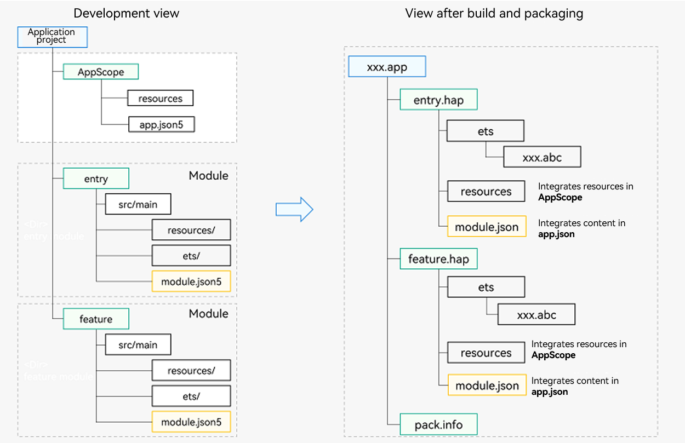

# Multi-HAP Build View

DevEco Studio allows you to develop and build multiple HAP files in one application project, as shown below.

  **Figure 1** Multi-HAP build view 

1. Development view in DevEco Studio
   - AppScope folder
      - [app.json5](app-configuration-file.md): application-wide configuration, such as the application bundle name, version number, application icon, application name, and dependent SDK version number.
      - **resources** folder: stores application icon resources and application name string resources.

         **NOTE**
         - The folder is automatically generated by DevEco Studio and its name cannot be changed.
         - The file names in the **AppScope** folder cannot be the same as those in the entry- or feature-type module directories. Otherwise, DevEco Studio reports an error.
   - Entry- or feature-type module directories (the names are customizable)
      - You implement service logic of your application in these module directories. In this example, the module folders are **entry.hap** and **feature.hap**.
      - **resources** directory: stores the resources used by the module.
      - **ets** folder: stores the service logic.
      - [module.json5](module-configuration-file.md): module configuration, such as the module name, entry code path of the module, and component information.

2. View after build and packaging
   - After a module is built, a HAP file for deployment is generated. Each module corresponds to a HAP file.
   - The **module.json** file in the HAP file is composed of the **app.json5** and **module.json5** files in the development view.
   - All HAP files are finally built into an Application Package (App Pack) in .app format for release to the application market.
