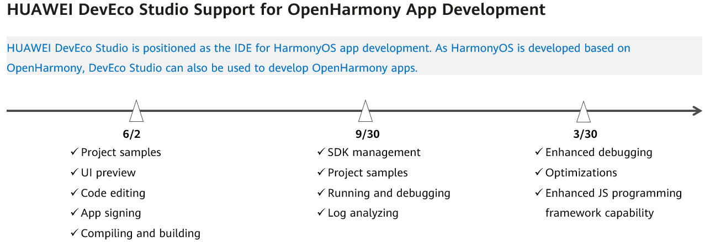

# Overview

-   [About the Document](#section189422248491)
-   [Restrictions](#section65191625782)
-   [DevEco Studio Evolution Roadmap](#section187875207166)

## About the Document

DevEco Studio is an integrated development environment \(IDE\) of HarmonyOS apps. As HarmonyOS is developed based on OpenHarmony, DevEco Studio can also be used to develop OpenHarmony apps.

The process of developing an OpenHarmony app using DevEco Studio is the same as that of developing a HarmonyOS app. This document describes the differences between OpenHarmony and HarmonyOS app development.

-   **Environment setup**: You need to manually configure the SDK for the OpenHarmony app development. For details, see  [Configuring the OpenHarmony SDK](configuring-the-openharmony-sdk.md).
-   **Signature configuration for debugging**: To run an OpenHarmony app on a real device, you need to sign the app first. For instructions, see  [Configuring the OpenHarmony App Signature](configuring-the-openharmony-app-signature.md).
-   **App running on a real device**: To run your app on a real device, you need to use the hdc tool to push the HAP package of the OpenHarmony to the real device for installation. For details, see  [Installing and Running Your OpenHarmony App](installing-and-running-your-openharmony-app.md).

For details about how to use DevEco Studio, see  [HUAWEI DevEco Studio User Guide](https://developer.harmonyos.com/en/docs/documentation/doc-guides/tools_overview-0000001053582387).

## Restrictions

-   OpenHarmony supports only app development in JS.
-   Developing OpenHarmony apps in DevEco Studio is supported on Windows.

DevEco Studio serves as a development tool for both OpenHarmony and HarmonyOS apps. Refer to the following table for descriptions about the IDE function differences between OpenHarmony and HarmonyOS.

<table><thead align="left"><tr id="row1952618913415"><th class="cellrowborder" valign="top" width="29.882988298829883%" id="mcps1.1.4.1.1">
Feature

</th>
<th class="cellrowborder" valign="top" width="36.783678367836785%" id="mcps1.1.4.1.2">
HarmonyOS

</th>
<th class="cellrowborder" valign="top" width="33.33333333333333%" id="mcps1.1.4.1.3">
OpenHarmony

</th>
</tr>
</thead>
<tbody><tr id="row3627192183319"><td class="cellrowborder" valign="top" width="29.882988298829883%" headers="mcps1.1.4.1.1 ">
Creating modules

</td>
<td class="cellrowborder" valign="top" width="36.783678367836785%" headers="mcps1.1.4.1.2 ">
<strong id="b17226139143511">√</strong>

</td>
<td class="cellrowborder" valign="top" width="33.33333333333333%" headers="mcps1.1.4.1.3 ">
<strong id="b122614963510">X</strong>

</td>
</tr>
<tr id="row955132319355"><td class="cellrowborder" valign="top" width="29.882988298829883%" headers="mcps1.1.4.1.1 ">
Service widgets

</td>
<td class="cellrowborder" valign="top" width="36.783678367836785%" headers="mcps1.1.4.1.2 ">
<strong id="b11551102403511">√</strong>

</td>
<td class="cellrowborder" valign="top" width="33.33333333333333%" headers="mcps1.1.4.1.3 ">
<strong id="b255116244356">X</strong>

</td>
</tr>
<tr id="row1552619933411"><td class="cellrowborder" valign="top" width="29.882988298829883%" headers="mcps1.1.4.1.1 ">
Automatic signing

</td>
<td class="cellrowborder" valign="top" width="36.783678367836785%" headers="mcps1.1.4.1.2 ">
<strong id="b14431122873617">√</strong>

</td>
<td class="cellrowborder" valign="top" width="33.33333333333333%" headers="mcps1.1.4.1.3 ">
<strong id="b4431328163619">X</strong>

</td>
</tr>
<tr id="row115263913344"><td class="cellrowborder" valign="top" width="29.882988298829883%" headers="mcps1.1.4.1.1 ">
Remote emulator

</td>
<td class="cellrowborder" valign="top" width="36.783678367836785%" headers="mcps1.1.4.1.2 ">
<strong id="b8231173533613">√</strong>

</td>
<td class="cellrowborder" valign="top" width="33.33333333333333%" headers="mcps1.1.4.1.3 ">
<strong id="b1523111352363">X</strong>

</td>
</tr>
<tr id="row183441037105115"><td class="cellrowborder" valign="top" width="29.882988298829883%" headers="mcps1.1.4.1.1 ">
Local emulator

</td>
<td class="cellrowborder" valign="top" width="36.783678367836785%" headers="mcps1.1.4.1.2 ">
<strong id="b1693264315118">√</strong>

</td>
<td class="cellrowborder" valign="top" width="33.33333333333333%" headers="mcps1.1.4.1.3 ">
<strong id="b169321543175116">X</strong>

</td>
</tr>
<tr id="row15269933419"><td class="cellrowborder" valign="top" width="29.882988298829883%" headers="mcps1.1.4.1.1 ">
Using DevEco Studio for debugging, log viewing, and optimization

</td>
<td class="cellrowborder" valign="top" width="36.783678367836785%" headers="mcps1.1.4.1.2 ">
<strong id="b10231535143615">√</strong>

</td>
<td class="cellrowborder" valign="top" width="33.33333333333333%" headers="mcps1.1.4.1.3 ">
<strong id="b1423123514368">X</strong>

</td>
</tr>
<tr id="row7357734143617"><td class="cellrowborder" valign="top" width="29.882988298829883%" headers="mcps1.1.4.1.1 ">
Cloud testing

</td>
<td class="cellrowborder" valign="top" width="36.783678367836785%" headers="mcps1.1.4.1.2 ">
<strong id="b3669546133610">√</strong>

</td>
<td class="cellrowborder" valign="top" width="33.33333333333333%" headers="mcps1.1.4.1.3 ">
<strong id="b11669144693616">X</strong>

</td>
</tr>
<tr id="row124331939191517"><td class="cellrowborder" valign="top" width="29.882988298829883%" headers="mcps1.1.4.1.1 ">
Security testing

</td>
<td class="cellrowborder" valign="top" width="36.783678367836785%" headers="mcps1.1.4.1.2 ">
<strong id="b101485149375">√</strong>

</td>
<td class="cellrowborder" valign="top" width="33.33333333333333%" headers="mcps1.1.4.1.3 ">
<strong id="b01481614133717">X</strong>

</td>
</tr>
</tbody>
</table>

## DevEco Studio Evolution Roadmap

Refer to the following figure for when the HUAWEI DevEco Studio support for OpenHarmony app development is available in different phases.

