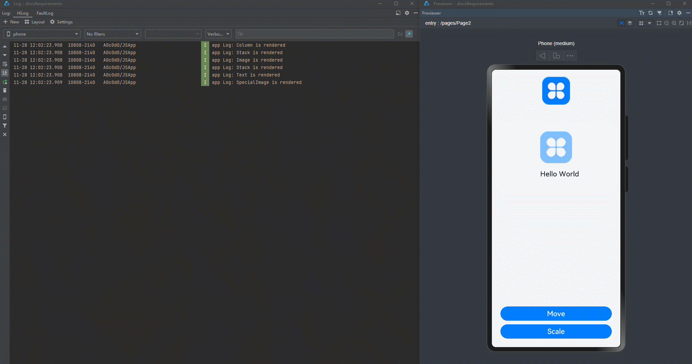

# Proper Use of State Management

Managing state in applications can be a tricky task. You may find the UI not refreshed as expected, or the re-renders slowing down your application. This topic explores some best practices for managing state, through typical correct and incorrect usage examples.

## Properly Using Attributes

### Combining Simple Attributes into Object Arrays

It is commonplace in development to set the same attribute for multiple components, for example, the text content, width, or height attributes. To make these attributes easier to manage, you can store them in an array and use them with **ForEach**.

```typescript
@Entry
@Component
struct Index {
  @State items: string[] = [];
  @State ids: string[] = [];
  @State age: number[] = [];
  @State gender: string[] = [];

  aboutToAppear() {
    this.items.push("Head");
    this.items.push("List");
    for (let i = 0; i < 20; i++) {
      this.ids.push("id: " + Math.floor(Math.random() * 1000));
      this.age.push(Math.floor(Math.random() * 100 % 40));
      this.gender.push(Math.floor(Math.random() * 100) % 2 == 0 ? "Male" : "Female");
    }
  }

  isRenderText(index: number) : number {
    console.log(`index ${index} is rendered`);
    return 1;
  }

  build() {
    Row() {
      Column() {
        ForEach(this.items, (item: string) => {
          if (item == "Head") {
            Text("Personal Info")
              .fontSize(40)
          } else if (item == "List") {
            List() {
              ForEach(this.ids, (id: string, index) => {
                ListItem() {
                  Row() {
                    Text(id)
                      .fontSize(20)
                      .margin({
                        left: 30,
                        right: 5
                      })
                    Text("age: " + this.age[index as number])
                      .fontSize(20)
                      .margin({
                        left: 5,
                        right: 5
                      })
                      .position({x: 100})
                      .opacity(this.isRenderText(index))
                      .onClick(() => {
                        this.age[index]++;
                      })
                    Text("gender: " + this.gender[index as number])
                      .margin({
                        left: 5,
                        right: 5
                      })
                      .position({x: 180})
                      .fontSize(20)
                  }
                }
                .margin({
                  top: 5,
                  bottom: 5
                })
              })
            }
          }
        })
      }
    }
  }
}
```

Below you can see how the preceding code snippet works.


In this example, a total of 20 records are displayed on the page through **ForEach**. When you click the **Text** component of **age** in one of the records, the **Text** components of **age** in other 19 records are also re-rendered - reflected by the logs generated for the components of **age**. However, because the **age** values of the other 19 records do not change, the re-rendering of these records is actually redundant.

This redundant re-rendering is due to a characteristic of state management. Assume that there is an @State decorated number array **Num[]**. This array contains 20 elements whose values are 0 to 19, respectively. Each of the 20 elements is bound to a **Text** component. When one of the elements is changed, all components bound to the elements are re-rendered, regardless of whether the other elements are changed or not.

This seemly bug, commonly known as "redundant re-render", is widely observed in simple array, and can adversely affect the UI re-rendering performance when the arrays are large. To make your rendering process run smoothly, it is crucial to reduce redundant re-renders and update components only when necessary.

In the case of an array of simple attributes, you can avoid redundant re-rendering by converting the array into an object array. The code snippet after optimization is as follows:

```typescript
@Observed
class InfoList extends Array<Info> {
};
@Observed
class Info {
  ids: number;
  age: number;
  gender: string;

  constructor() {
    this.ids = Math.floor(Math.random() * 1000);
    this.age = Math.floor(Math.random() * 100 % 40);
    this.gender = Math.floor(Math.random() * 100) % 2 == 0 ? "Male" : "Female";
  }
}
@Component
struct Information {
  @ObjectLink info: Info;
  @State index: number = 0;
  isRenderText(index: number) : number {
    console.log(`index ${index} is rendered`);
    return 1;
  }

  build() {
    Row() {
      Text("id: " + this.info.ids)
        .fontSize(20)
        .margin({
          left: 30,
          right: 5
        })
      Text("age: " + this.info.age)
        .fontSize(20)
        .margin({
          left: 5,
          right: 5
        })
        .position({x: 100})
        .opacity(this.isRenderText(this.index))
        .onClick(() => {
          this.info.age++;
        })
      Text("gender: " + this.info.gender)
        .margin({
          left: 5,
          right: 5
        })
        .position({x: 180})
        .fontSize(20)
    }
  }
}
@Entry
@Component
struct Page {
  @State infoList: InfoList = new InfoList();
  @State items: string[] = [];
  aboutToAppear() {
    this.items.push("Head");
    this.items.push("List");
    for (let i = 0; i < 20; i++) {
      this.infoList.push(new Info());
    }
  }

  build() {
    Row() {
      Column() {
        ForEach(this.items, (item: string) => {
          if (item == "Head") {
            Text("Personal Info")
              .fontSize(40)
          } else if (item == "List") {
            List() {
              ForEach(this.infoList, (info: Info, index) => {
                ListItem() {
                  Information({
                    info: info,
                    index: index
                  })
                }
                .margin({
                  top: 5,
                  bottom: 5
                })
              })
            }
          }
        })
      }
    }
  }
}
```

Below you can see how the preceding code snippet works.


After optimization, an object array is used in place of the original attribute arrays. For an array, changes in an object cannot be observed and therefore do not cause re-renders. Specifically, only changes at the top level of array items can be observed, for example, adding, modifying, or deleting an item. For a common array, modifying a data item means to change the item's value. For an object array, it means to assign a new value to the entire object, which means that changes to a property in an object are not observable to the array and consequently do not cause a re-render. In addition to property changes in object arrays, changes in nested objects cannot be observed either, which is further detailed in [Splitting a Complex Large Object into Multiple Small Objects](#splitting-a-complex-large-object-into-multiple-small-objects). In the code after optimization, you may notice a combination of custom components and **ForEach**. For details, see [Using Custom Components to Match Object Arrays in ForEach](#using-custom-components-to-match-object-arrays-in-foreach).

### Splitting a Complex Large Object into Multiple Small Objects

> **NOTE**
>
> You are advised to use the [@Track](arkts-track.md) decorator in this scenario since API version 11.

During development, we sometimes define a large object that contains many style-related properties, and pass the object between parent and child components to bind the properties to the components.

```typescript
@Observed
class UIStyle {
  translateX: number = 0;
  translateY: number = 0;
  scaleX: number = 0.3;
  scaleY: number = 0.3;
  width: number = 336;
  height: number = 178;
  posX: number = 10;
  posY: number = 50;
  alpha: number = 0.5;
  borderRadius: number = 24;
  imageWidth: number = 78;
  imageHeight: number = 78;
  translateImageX: number = 0;
  translateImageY: number = 0;
  fontSize: number = 20;
}
@Component
struct SpecialImage {
  @ObjectLink uiStyle: UIStyle;
  private isRenderSpecialImage() : number { // A function indicating whether the component is rendered.
    console.log("SpecialImage is rendered");
    return 1;
  }
  build() {
    Image($r('app.media.icon')) // 'app.media.icon' is only an example. Replace it with the actual one in use. Otherwise, the imageSource instance fails to be created, and subsequent operations cannot be performed.
      .width(this.uiStyle.imageWidth)
      .height(this.uiStyle.imageHeight)
      .margin({ top: 20 })
      .translate({
        x: this.uiStyle.translateImageX,
        y: this.uiStyle.translateImageY
      })
      .opacity(this.isRenderSpecialImage()) // If the image is re-rendered, this function will be called.
  }
}
@Component
struct PageChild {
  @ObjectLink uiStyle: UIStyle
  // The following function is used to display whether the component is rendered.
  private isRenderColumn() : number {
    console.log("Column is rendered");
    return 1;
  }
  private isRenderStack() : number {
    console.log("Stack is rendered");
    return 1;
  }
  private isRenderImage() : number {
    console.log("Image is rendered");
    return 1;
  }
  private isRenderText() : number {
    console.log("Text is rendered");
    return 1;
  }
  build() {
    Column() {
      SpecialImage({
        uiStyle: this.uiStyle
      })
      Stack() {
        Column() {
            Image($r('app.media.icon')) // 'app.media.icon' is only an example. Replace it with the actual one in use. Otherwise, the imageSource instance fails to be created, and subsequent operations cannot be performed.
              .opacity(this.uiStyle.alpha)
              .scale({
                x: this.uiStyle.scaleX,
                y: this.uiStyle.scaleY
              })
              .padding(this.isRenderImage())
              .width(300)
              .height(300)
        }
        .width('100%')
        .position({ y: -80 })
        Stack() {
          Text("Hello World")
            .fontColor("#182431")
            .fontWeight(FontWeight.Medium)
            .fontSize(this.uiStyle.fontSize)
            .opacity(this.isRenderText())
            .margin({ top: 12 })
        }
        .opacity(this.isRenderStack())
        .position({
          x: this.uiStyle.posX,
          y: this.uiStyle.posY
        })
        .width('100%')
        .height('100%')
      }
      .margin({ top: 50 })
      .borderRadius(this.uiStyle.borderRadius)
      .opacity(this.isRenderStack())
      .backgroundColor("#FFFFFF")
      .width(this.uiStyle.width)
      .height(this.uiStyle.height)
      .translate({
        x: this.uiStyle.translateX,
        y: this.uiStyle.translateY
      })
      Column() {
        Button("Move")
          .width(312)
          .fontSize(20)
          .backgroundColor("#FF007DFF")
          .margin({ bottom: 10 })
          .onClick(() => {
            animateTo({
              duration: 500
            },() => {
              this.uiStyle.translateY = (this.uiStyle.translateY + 180) % 250;
            })
          })
        Button("Scale")
          .borderRadius(20)
          .backgroundColor("#FF007DFF")
          .fontSize(20)
          .width(312)
          .onClick(() => {
            this.uiStyle.scaleX = (this.uiStyle.scaleX + 0.6) % 0.8;
          })
      }
      .position({
        y:666
      })
      .height('100%')
      .width('100%')

    }
    .opacity(this.isRenderColumn())
    .width('100%')
    .height('100%')

  }
}
@Entry
@Component
struct Page {
  @State uiStyle: UIStyle = new UIStyle();
  build() {
    Stack() {
      PageChild({
        uiStyle: this.uiStyle
      })
    }
    .backgroundColor("#F1F3F5")
  }
}
```

Below you can see how the preceding code snippet works.



Click the **Move** button before optimization. The duration for updating dirty nodes is as follows.


In the above example, **uiStyle** defines multiple properties, which are each associated with multiple components. When some of these properties are changed at the click of a button, all the components associated with **uiStyle** are re-rendered, even though they do not need to (because the properties of these components are not changed). The re-renders of these components can be observed through a series of defined **isRender** functions. When **Move** is clicked to perform the translation animation, the value of **translateY** changes multiple times. As a result, redundant re-renders occur at each frame, which greatly worsen the application performance.

Such redundant re-renders result from an update mechanism of the state management: If multiple properties of a class are bound to different components through an object of the class, then, if any of the properties is changed, the component associated with the property is re-rendered, together with components associated with the other properties, even though the other properties do not change.

Naturally, this update mechanism brings down the re-rendering performance, especially in the case of a large, complex object associated with a considerable number of components. To fix this issue, split a large, complex object into a set of multiple small objects. In this way, redundant re-renders are reduced and the render scope precisely controlled, while the original code structure is retained.

```typescript
@Observed
class NeedRenderImage { // Properties used in the same component can be classified into the same class.
  public translateImageX: number = 0;
  public translateImageY: number = 0;
  public imageWidth:number = 78;
  public imageHeight:number = 78;
}
@Observed
class NeedRenderScale { // Properties used together can be classified into the same class.
  public scaleX: number = 0.3;
  public scaleY: number = 0.3;
}
@Observed
class NeedRenderAlpha { // Properties used separately can be classified into the same class.
  public alpha: number = 0.5;
}
@Observed
class NeedRenderSize { // Properties used together can be classified into the same class.
  public width: number = 336;
  public height: number = 178;
}
@Observed
class NeedRenderPos { // Properties used together can be classified into the same class.
  public posX: number = 10;
  public posY: number = 50;
}
@Observed
class NeedRenderBorderRadius { // Properties used separately can be classified into the same class.
  public borderRadius: number = 24;
}
@Observed
class NeedRenderFontSize { // Properties used separately can be classified into the same class.
  public fontSize: number = 20;
}
@Observed
class NeedRenderTranslate { // Properties used together can be classified into the same class.
  public translateX: number = 0;
  public translateY: number = 0;
}
@Observed
class UIStyle {
  // Use the NeedRenderxxx class.
  needRenderTranslate: NeedRenderTranslate = new NeedRenderTranslate();
  needRenderFontSize: NeedRenderFontSize = new NeedRenderFontSize();
  needRenderBorderRadius: NeedRenderBorderRadius = new NeedRenderBorderRadius();
  needRenderPos: NeedRenderPos = new NeedRenderPos();
  needRenderSize: NeedRenderSize = new NeedRenderSize();
  needRenderAlpha: NeedRenderAlpha = new NeedRenderAlpha();
  needRenderScale: NeedRenderScale = new NeedRenderScale();
  needRenderImage: NeedRenderImage = new NeedRenderImage();
}
@Component
struct SpecialImage {
  @ObjectLink uiStyle : UIStyle;
  @ObjectLink needRenderImage: NeedRenderImage // Receive a new class from its parent component.
  private isRenderSpecialImage() : number { // A function indicating whether the component is rendered.
    console.log("SpecialImage is rendered");
    return 1;
  }
  build() {
    Image($r('app.media.icon')) // 'app.media.icon' is only an example. Replace it with the actual one in use. Otherwise, the imageSource instance fails to be created, and subsequent operations cannot be performed.
      .width(this.needRenderImage.imageWidth) // Use this.needRenderImage.xxx.
      .height(this.needRenderImage.imageHeight)
      .margin({top:20})
      .translate({
        x: this.needRenderImage.translateImageX,
        y: this.needRenderImage.translateImageY
      })
      .opacity(this.isRenderSpecialImage()) // If the image is re-rendered, this function will be called.
  }
}
@Component
struct PageChild {
  @ObjectLink uiStyle: UIStyle;
  @ObjectLink needRenderTranslate: NeedRenderTranslate; // Receive the newly defined instance of the NeedRenderxxx class from its parent component.
  @ObjectLink needRenderFontSize: NeedRenderFontSize;
  @ObjectLink needRenderBorderRadius: NeedRenderBorderRadius;
  @ObjectLink needRenderPos: NeedRenderPos;
  @ObjectLink needRenderSize: NeedRenderSize;
  @ObjectLink needRenderAlpha: NeedRenderAlpha;
  @ObjectLink needRenderScale: NeedRenderScale;
  // The following function is used to display whether the component is rendered.
  private isRenderColumn() : number {
    console.log("Column is rendered");
    return 1;
  }
  private isRenderStack() : number {
    console.log("Stack is rendered");
    return 1;
  }
  private isRenderImage() : number {
    console.log("Image is rendered");
    return 1;
  }
  private isRenderText() : number {
    console.log("Text is rendered");
    return 1;
  }
  build() {
    Column() {
      SpecialImage({
        uiStyle: this.uiStyle,
        needRenderImage: this.uiStyle.needRenderImage // Pass the needRenderxxx class to the child component.
      })
      Stack() {
        Column() {
          Image($r('app.media.icon')) // 'app.media.icon' is only an example. Replace it with the actual one in use. Otherwise, the imageSource instance fails to be created, and subsequent operations cannot be performed.
            .opacity(this.needRenderAlpha.alpha)
            .scale({
              x: this.needRenderScale.scaleX, // Use this.needRenderXxx.xxx.
              y: this.needRenderScale.scaleY
            })
            .padding(this.isRenderImage())
            .width(300)
            .height(300)
        }
        .width('100%')
        .position({ y: -80 })

        Stack() {
          Text("Hello World")
            .fontColor("#182431")
            .fontWeight(FontWeight.Medium)
            .fontSize(this.needRenderFontSize.fontSize)
            .opacity(this.isRenderText())
            .margin({ top: 12 })
        }
        .opacity(this.isRenderStack())
        .position({
          x: this.needRenderPos.posX,
          y: this.needRenderPos.posY
        })
        .width('100%')
        .height('100%')
      }
      .margin({ top: 50 })
      .borderRadius(this.needRenderBorderRadius.borderRadius)
      .opacity(this.isRenderStack())
      .backgroundColor("#FFFFFF")
      .width(this.needRenderSize.width)
      .height(this.needRenderSize.height)
      .translate({
        x: this.needRenderTranslate.translateX,
        y: this.needRenderTranslate.translateY
      })

      Column() {
        Button("Move")
          .width(312)
          .fontSize(20)
          .backgroundColor("#FF007DFF")
          .margin({ bottom: 10 })
          .onClick(() => {
            animateTo({
              duration: 500
            }, () => {
              this.needRenderTranslate.translateY = (this.needRenderTranslate.translateY + 180) % 250;
            })
          })
        Button("Scale")
          .borderRadius(20)
          .backgroundColor("#FF007DFF")
          .fontSize(20)
          .width(312)
          .margin({ bottom: 10 })
          .onClick(() => {
            this.needRenderScale.scaleX = (this.needRenderScale.scaleX + 0.6) % 0.8;
          })
        Button("Change Image")
          .borderRadius(20)
          .backgroundColor("#FF007DFF")
          .fontSize(20)
          .width(312)
          .onClick(() => { // Use this.uiStyle.endRenderXxx.xxx to change the property in the parent component.
            this.uiStyle.needRenderImage.imageWidth = (this.uiStyle.needRenderImage.imageWidth + 30) % 160;
            this.uiStyle.needRenderImage.imageHeight = (this.uiStyle.needRenderImage.imageHeight + 30) % 160;
          })
      }
      .position({
        y: 616
      })
      .height('100%')
      .width('100%')
    }
    .opacity(this.isRenderColumn())
    .width('100%')
    .height('100%')
  }
}
@Entry
@Component
struct Page {
  @State uiStyle: UIStyle = new UIStyle();
  build() {
    Stack() {
      PageChild({
        uiStyle: this.uiStyle,
        needRenderTranslate: this.uiStyle.needRenderTranslate, // Pass the needRenderxxx class to the child component.
        needRenderFontSize: this.uiStyle.needRenderFontSize,
        needRenderBorderRadius: this.uiStyle.needRenderBorderRadius,
        needRenderPos: this.uiStyle.needRenderPos,
        needRenderSize: this.uiStyle.needRenderSize,
        needRenderAlpha: this.uiStyle.needRenderAlpha,
        needRenderScale: this.uiStyle.needRenderScale
      })
    }
    .backgroundColor("#F1F3F5")
  }
}
```

Below you can see how the preceding code snippet works.

Click the **Move** button after optimization. The duration for updating dirty nodes is as follows.


After the optimization, the 15 attributes previously in one class are divided into eight classes, and the bound components are adapted accordingly. The division of properties complies with the following principles:

- Properties that are only used in the same component can be divided into the same new child class, that is, **NeedRenderImage** in the example. This mode of division is applicable to the scenario where components are frequently re-rendered due to changes of unassociated properties.
- Properties that are frequently used together can be divided into the same new child class, that is, **NeedRenderScale**, **NeedRenderTranslate**, **NeedRenderPos**, and **NeedRenderSize** in the example. This mode of division is applicable to the scenario where properties often appear in pairs or are applied to the same style, for example, **.translate**, **.position**, and **.scale** (which usually receive an object as a parameter).
- Properties that may be used in different places should be divided into a new child class, that is, **NeedRenderAlpha**, **NeedRenderBorderRadius**, and **NeedRenderFontSize** in the example. This mode of division is applicable to the scenario where a property works on multiple components or works on their own, for example, **.opacity** and **.borderRadius** (which usually work on their own).

As in combination of properties, the principle behind division of properties is that changes to properties of objects nested more than two levels deep cannot be observed. Yet, you can use @Observed and @ObjectLink to transfer level-2 objects between parent and child nodes to observe property changes at level 2 and precisely control the render scope. <!--Del-->For details about the division of properties, see [Precisely Controlling Render Scope](https://gitee.com/openharmony/docs/blob/master/en/application-dev/performance/precisely-control-render-scope.md).<!--DelEnd-->

@Track decorator can also precisely control the render scope, which does not involve division of properties.

```ts
@Observed
class UIStyle {
  @Track translateX: number = 0;
  @Track translateY: number = 0;
  @Track scaleX: number = 0.3;
  @Track scaleY: number = 0.3;
  @Track width: number = 336;
  @Track height: number = 178;
  @Track posX: number = 10;
  @Track posY: number = 50;
  @Track alpha: number = 0.5;
  @Track borderRadius: number = 24;
  @Track imageWidth: number = 78;
  @Track imageHeight: number = 78;
  @Track translateImageX: number = 0;
  @Track translateImageY: number = 0;
  @Track fontSize: number = 20;
}
@Component
struct SpecialImage {
  @ObjectLink uiStyle: UIStyle;
  private isRenderSpecialImage() : number { // A function indicating whether the component is rendered.
    console.log("SpecialImage is rendered");
    return 1;
  }
  build() {
    Image($r('app.media.icon')) // 'app.media.icon' is only an example. Replace it with the actual one in use. Otherwise, the imageSource instance fails to be created, and subsequent operations cannot be performed.
      .width(this.uiStyle.imageWidth)
      .height(this.uiStyle.imageHeight)
      .margin({ top: 20 })
      .translate({
        x: this.uiStyle.translateImageX,
        y: this.uiStyle.translateImageY
      })
      .opacity(this.isRenderSpecialImage()) // If the image is re-rendered, this function will be called.
  }
}
@Component
struct PageChild {
  @ObjectLink uiStyle: UIStyle
  // The following function is used to display whether the component is rendered.
  private isRenderColumn() : number {
    console.log("Column is rendered");
    return 1;
  }
  private isRenderStack() : number {
    console.log("Stack is rendered");
    return 1;
  }
  private isRenderImage() : number {
    console.log("Image is rendered");
    return 1;
  }
  private isRenderText() : number {
    console.log("Text is rendered");
    return 1;
  }
  build() {
    Column() {
      SpecialImage({
        uiStyle: this.uiStyle
      })
      Stack() {
        Column() {
            Image($r('app.media.icon')) // 'app.media.icon' is only an example. Replace it with the actual one in use. Otherwise, the imageSource instance fails to be created, and subsequent operations cannot be performed.
              .opacity(this.uiStyle.alpha)
              .scale({
                x: this.uiStyle.scaleX,
                y: this.uiStyle.scaleY
              })
              .padding(this.isRenderImage())
              .width(300)
              .height(300)
        }
        .width('100%')
        .position({ y: -80 })
        Stack() {
          Text("Hello World")
            .fontColor("#182431")
            .fontWeight(FontWeight.Medium)
            .fontSize(this.uiStyle.fontSize)
            .opacity(this.isRenderText())
            .margin({ top: 12 })
        }
        .opacity(this.isRenderStack())
        .position({
          x: this.uiStyle.posX,
          y: this.uiStyle.posY
        })
        .width('100%')
        .height('100%')
      }
      .margin({ top: 50 })
      .borderRadius(this.uiStyle.borderRadius)
      .opacity(this.isRenderStack())
      .backgroundColor("#FFFFFF")
      .width(this.uiStyle.width)
      .height(this.uiStyle.height)
      .translate({
        x: this.uiStyle.translateX,
        y: this.uiStyle.translateY
      })
      Column() {
        Button("Move")
          .width(312)
          .fontSize(20)
          .backgroundColor("#FF007DFF")
          .margin({ bottom: 10 })
          .onClick(() => {
            animateTo({
              duration: 500
            },() => {
              this.uiStyle.translateY = (this.uiStyle.translateY + 180) % 250;
            })
          })
        Button("Scale")
          .borderRadius(20)
          .backgroundColor("#FF007DFF")
          .fontSize(20)
          .width(312)
          .onClick(() => {
            this.uiStyle.scaleX = (this.uiStyle.scaleX + 0.6) % 0.8;
          })
      }
      .position({
        y:666
      })
      .height('100%')
      .width('100%')

    }
    .opacity(this.isRenderColumn())
    .width('100%')
    .height('100%')

  }
}
@Entry
@Component
struct Page {
  @State uiStyle: UIStyle = new UIStyle();
  build() {
    Stack() {
      PageChild({
        uiStyle: this.uiStyle
      })
    }
    .backgroundColor("#F1F3F5")
  }
}
```


### Binding Components to Class Objects Decorated with @Observed or Declared as State Variables

Your application may sometimes allow users to reset data - by assigning a new object to the target state variable. The type of the new object is the trick here: If not handled carefully, it may result in the UI not being re-rendered as expected.

```typescript
@Observed
class Child {
  count: number;
  constructor(count: number) {
    this.count = count
  }
}
@Observed
class ChildList extends Array<Child> {
};
@Observed
class Ancestor {
  childList: ChildList;
  constructor(childList: ChildList) {
    this.childList = childList;
  }
  public loadData() {
    let tempList = [new Child(1), new Child(2), new Child(3), new Child(4), new Child(5)];
    this.childList = tempList;
  }

  public clearData() {
    this.childList = []
  }
}
@Component
struct CompChild {
  @Link childList: ChildList;
  @ObjectLink child: Child;

  build() {
    Row() {
      Text(this.child.count+'')
        .height(70)
        .fontSize(20)
        .borderRadius({
          topLeft: 6,
          topRight: 6
        })
        .margin({left: 50})
      Button('X')
        .backgroundColor(Color.Red)
        .onClick(()=>{
          let index = this.childList.findIndex((item) => {
            return item.count === this.child.count
          })
          if (index !== -1) {
            this.childList.splice(index, 1);
          }
        })
        .margin({
          left: 200,
          right:30
        })
    }
    .margin({
      top:15,
      left: 15,
      right:10,
      bottom:15
    })
    .borderRadius(6)
    .backgroundColor(Color.Grey)
  }
}
@Component
struct CompList {
  @ObjectLink@Watch('changeChildList') childList: ChildList;

  changeChildList() {
    console.log('CompList ChildList change');
  }

  isRenderCompChild(index: number) : number {
    console.log("Comp Child is render" + index);
    return 1;
  }

  build() {
    Column() {
      List() {
        ForEach(this.childList, (item: Child, index) => {
          ListItem() {
            CompChild({
              childList: this.childList,
              child: item
            })
              .opacity(this.isRenderCompChild(index))
          }

        })
      }
      .height('70%')
    }
  }
}
@Component
struct CompAncestor {
  @ObjectLink ancestor: Ancestor;

  build() {
    Column() {
      CompList({ childList: this.ancestor.childList })
      Row() {
        Button("Clear")
          .onClick(() => {
            this.ancestor.clearData()
          })
          .width(100)
          .margin({right: 50})
        Button("Recover")
          .onClick(() => {
            this.ancestor.loadData()
          })
          .width(100)
      }
    }
  }
}
@Entry
@Component
struct Page {
  @State childList: ChildList = [new Child(1), new Child(2), new Child(3), new Child(4),new Child(5)];
  @State ancestor: Ancestor = new Ancestor(this.childList)

  build() {
    Column() {
      CompAncestor({ ancestor: this.ancestor})
    }
  }
}
```

Below you can see how the preceding code snippet works.


In the code there is a data source of the ChildList type. If you click **X** to delete some data and then click **Recover** to restore **ChildList**, the UI is not re-rendered after you click **X** again, and no "CompList ChildList change" log is printed.

An examination of the code finds out that when a value is re-assigned to the data source **ChildList** through the **loadData** method of the **Ancestor** object.

```typescript
  public loadData() {
    let tempList = [new Child(1), new Child(2), new Child(3), new Child(4), new Child(5)];
    this.childList = tempList;
  }
```

In the **loadData** method, **tempList**, a temporary array of the Child type, is created, to which the member variable **ChildList** of the **Ancestor** object is pointed. However, value changes of the **tempList** array cannot be observed. In other words, its value changes do not cause UI re-renders. After the array is assigned to **childList**, the **ForEach** view is updated and the UI is re-rendered. When you click **X** again, however, the UI is not re-rendered to reflect the decrease in **childList**, because **childList** points to a new, unobservable **tempList**.

You may notice that **childList** is initialized in the same way when it is defined in **Page**.

```typescript
@State childList: ChildList = [new Child(1), new Child(2), new Child(3), new Child(4),new Child(5)];
@State ancestor: Ancestor = new Ancestor(this.childList)
```

Yet, **childList** there is observable, being decorated by @State. As such, while it is assigned an array of the Child[] type not decorated by @Observed, its value changes can cause UI re-renders. If the @State decorator is removed from **childList**, the data source is not reset and UI re-renders cannot be triggered by clicking the **X** button.

In summary, for the UI to be re-rendered properly upon value changes of class objects, these class objects must be observable.

```typescript
@Observed
class Child {
  count: number;
  constructor(count: number) {
    this.count = count
  }
}
@Observed
class ChildList extends Array<Child> {
};
@Observed
class Ancestor {
  childList: ChildList;
  constructor(childList: ChildList) {
    this.childList = childList;
  }
  public loadData() {
    let tempList = new ChildList();
    for (let i = 1; i < 6; i ++) {
      tempList.push(new Child(i));
    }
    this.childList = tempList;
  }

  public clearData() {
    this.childList = []
  }
}
@Component
struct CompChild {
  @Link childList: ChildList;
  @ObjectLink child: Child;

  build() {
    Row() {
      Text(this.child.count+'')
        .height(70)
        .fontSize(20)
        .borderRadius({
          topLeft: 6,
          topRight: 6
        })
        .margin({left: 50})
      Button('X')
        .backgroundColor(Color.Red)
        .onClick(()=>{
          let index = this.childList.findIndex((item) => {
            return item.count === this.child.count
          })
          if (index !== -1) {
            this.childList.splice(index, 1);
          }
        })
        .margin({
          left: 200,
          right:30
        })
    }
    .margin({
      top:15,
      left: 15,
      right:10,
      bottom:15
    })
    .borderRadius(6)
    .backgroundColor(Color.Grey)
  }
}
@Component
struct CompList {
  @ObjectLink@Watch('changeChildList') childList: ChildList;

  changeChildList() {
    console.log('CompList ChildList change');
  }

  isRenderCompChild(index: number) : number {
    console.log("Comp Child is render" + index);
    return 1;
  }

  build() {
    Column() {
      List() {
        ForEach(this.childList, (item: Child, index) => {
          ListItem() {
            CompChild({
              childList: this.childList,
              child: item
            })
              .opacity(this.isRenderCompChild(index))
          }

        })
      }
      .height('70%')
    }
  }
}
@Component
struct CompAncestor {
  @ObjectLink ancestor: Ancestor;

  build() {
    Column() {
      CompList({ childList: this.ancestor.childList })
      Row() {
        Button("Clear")
          .onClick(() => {
            this.ancestor.clearData()
          })
          .width(100)
          .margin({right: 50})
        Button("Recover")
          .onClick(() => {
            this.ancestor.loadData()
          })
          .width(100)
      }
    }
  }
}
@Entry
@Component
struct Page {
  @State childList: ChildList = [new Child(1), new Child(2), new Child(3), new Child(4),new Child(5)];
  @State ancestor: Ancestor = new Ancestor(this.childList)

  build() {
    Column() {
      CompAncestor({ ancestor: this.ancestor})
    }
  }
}
```

Below you can see how the preceding code snippet works.


The core of optimization is to change **tempList** of the Child[] type to an observable **ChildList** class.

```typescript
public loadData() {
    let tempList = new ChildList();
    for (let i = 1; i < 6; i ++) {
      tempList.push(new Child(i));
    }
    this.childList = tempList;
  }
```

In the preceding code, the ChildList type is decorated by @Observed when defined, allowing the **tempList** object created using **new** to be observed. As such, when you click **X** to delete an item, this change to **childList** is observed, the **ForEach** view updated, and the UI re-rendered.

## Properly Using ForEach and LazyForEach

### Minimizing the Use of LazyForEach in UI Updating

[LazyForEach](arkts-rendering-control-lazyforeach.md) often works hand in hand with state variables.

```typescript
class BasicDataSource implements IDataSource {
  private listeners: DataChangeListener[] = [];
  private originDataArray: StringData[] = [];

  public totalCount(): number {
    return 0;
  }

  public getData(index: number): StringData {
    return this.originDataArray[index];
  }

  registerDataChangeListener(listener: DataChangeListener): void {
    if (this.listeners.indexOf(listener) < 0) {
      console.info('add listener');
      this.listeners.push(listener);
    }
  }

  unregisterDataChangeListener(listener: DataChangeListener): void {
    const pos = this.listeners.indexOf(listener);
    if (pos >= 0) {
      console.info('remove listener');
      this.listeners.splice(pos, 1);
    }
  }

  notifyDataReload(): void {
    this.listeners.forEach(listener => {
      listener.onDataReloaded();
    })
  }

  notifyDataAdd(index: number): void {
    this.listeners.forEach(listener => {
      listener.onDataAdd(index);
    })
  }

  notifyDataChange(index: number): void {
    this.listeners.forEach(listener => {
      listener.onDataChange(index);
    })
  }

  notifyDataDelete(index: number): void {
    this.listeners.forEach(listener => {
      listener.onDataDelete(index);
    })
  }

  notifyDataMove(from: number, to: number): void {
    this.listeners.forEach(listener => {
      listener.onDataMove(from, to);
    })
  }
}

class MyDataSource extends BasicDataSource {
  private dataArray: StringData[] = [];

  public totalCount(): number {
    return this.dataArray.length;
  }

  public getData(index: number): StringData {
    return this.dataArray[index];
  }

  public addData(index: number, data: StringData): void {
    this.dataArray.splice(index, 0, data);
    this.notifyDataAdd(index);
  }

  public pushData(data: StringData): void {
    this.dataArray.push(data);
    this.notifyDataAdd(this.dataArray.length - 1);
  }

  public reloadData(): void {
    this.notifyDataReload();
  }
}

class StringData {
  message: string;
  imgSrc: Resource;
  constructor(message: string, imgSrc: Resource) {
    this.message = message;
    this.imgSrc = imgSrc;
  }
}

@Entry
@Component
struct MyComponent {
  private data: MyDataSource = new MyDataSource();

  aboutToAppear() {
    for (let i = 0; i <= 9; i++) {
      // 'app.media.icon' is only an example. Replace it with the actual one in use. Otherwise, the imageSource instance fails to be created, and subsequent operations cannot be performed.
      this.data.pushData(new StringData(`Click to add ${i}`, $r('app.media.icon')));
    }
  }

  build() {
    List({ space: 3 }) {
      LazyForEach(this.data, (item: StringData, index: number) => {
        ListItem() {
          Column() {
            Text(item.message).fontSize(20)
              .onAppear(() => {
                console.info("text appear:" + item.message);
              })
            Image(item.imgSrc)
              .width(100)
              .height(100)
              .onAppear(() => {
                console.info("image appear");
              })
          }.margin({ left: 10, right: 10 })
        }
        .onClick(() => {
          item.message += '0';
          this.data.reloadData();
        })
      }, (item: StringData, index: number) => JSON.stringify(item))
    }.cachedCount(5)
  }
}
```

Below you can see how the preceding code snippet works.


In this example, after you click to change **message**, the image flickers, and the onAppear log is generated for the image, indicating that the component is rebuilt. After **message** is changed, the key of the corresponding list item in **LazyForEach** changes. As a result, **LazyForEach** rebuilds the list item when executing **reloadData**. Though the **Text** component only has its content changed, it is rebuilt, not updated. The **Image** component under the list item is also rebuilt along with the list item, even though its content remains unchanged.

While both **LazyForEach** and state variables can trigger UI re-renders, their performance overheads are different. **LazyForEach** leads to component rebuilds and higher performance overheads, especially when there is a considerable number of components. By contrast, the use of state variables allows you to keep the update scope within the closely related components. In light of this, it is recommended that you use state variables to trigger component updates in **LazyForEach**, which requires custom components.

```typescript
class BasicDataSource implements IDataSource {
  private listeners: DataChangeListener[] = [];
  private originDataArray: StringData[] = [];

  public totalCount(): number {
    return 0;
  }

  public getData(index: number): StringData {
    return this.originDataArray[index];
  }

  registerDataChangeListener(listener: DataChangeListener): void {
    if (this.listeners.indexOf(listener) < 0) {
      console.info('add listener');
      this.listeners.push(listener);
    }
  }

  unregisterDataChangeListener(listener: DataChangeListener): void {
    const pos = this.listeners.indexOf(listener);
    if (pos >= 0) {
      console.info('remove listener');
      this.listeners.splice(pos, 1);
    }
  }

  notifyDataReload(): void {
    this.listeners.forEach(listener => {
      listener.onDataReloaded();
    })
  }

  notifyDataAdd(index: number): void {
    this.listeners.forEach(listener => {
      listener.onDataAdd(index);
    })
  }

  notifyDataChange(index: number): void {
    this.listeners.forEach(listener => {
      listener.onDataChange(index);
    })
  }

  notifyDataDelete(index: number): void {
    this.listeners.forEach(listener => {
      listener.onDataDelete(index);
    })
  }

  notifyDataMove(from: number, to: number): void {
    this.listeners.forEach(listener => {
      listener.onDataMove(from, to);
    })
  }
}

class MyDataSource extends BasicDataSource {
  private dataArray: StringData[] = [];

  public totalCount(): number {
    return this.dataArray.length;
  }

  public getData(index: number): StringData {
    return this.dataArray[index];
  }

  public addData(index: number, data: StringData): void {
    this.dataArray.splice(index, 0, data);
    this.notifyDataAdd(index);
  }

  public pushData(data: StringData): void {
    this.dataArray.push(data);
    this.notifyDataAdd(this.dataArray.length - 1);
  }
}

@Observed
class StringData {
  @Track message: string;
  @Track imgSrc: Resource;
  constructor(message: string, imgSrc: Resource) {
    this.message = message;
    this.imgSrc = imgSrc;
  }
}

@Entry
@Component
struct MyComponent {
  @State data: MyDataSource = new MyDataSource();

  aboutToAppear() {
    for (let i = 0; i <= 9; i++) {
      // 'app.media.icon' is only an example. Replace it with the actual one in use. Otherwise, the imageSource instance fails to be created, and subsequent operations cannot be performed.
      this.data.pushData(new StringData(`Click to add ${i}`, $r('app.media.icon')));
    }
  }

  build() {
    List({ space: 3 }) {
      LazyForEach(this.data, (item: StringData, index: number) => {
        ListItem() {
          ChildComponent({data: item})
        }
        .onClick(() => {
          item.message += '0';
        })
      }, (item: StringData, index: number) => index.toString())
    }.cachedCount(5)
  }
}

@Component
struct ChildComponent {
  @ObjectLink data: StringData
  build() {
    Column() {
      Text(this.data.message).fontSize(20)
        .onAppear(() => {
          console.info("text appear:" + this.data.message)
        })
      Image(this.data.imgSrc)
        .width(100)
        .height(100)
    }.margin({ left: 10, right: 10 })
  }
}
```

Below you can see how the preceding code snippet works.


In this example, the UI is re-rendered properly: The image does not flicker, and no log is generated, which indicates that the **Text** and **Image** components are not rebuilt.

This is thanks to introduction of custom components, where state variables are directly changed through @Observed and @ObjectLink, instead of through **LazyForEach**. Decorate the **message** and **imgSrc** properties of the **StringData** type with [@Track](arkts-track.md) to further narrow down the render scope to the specified **Text** component.

### Using Custom Components to Match Object Arrays in ForEach

Frequently seen in applications, the combination of object arrays and [ForEach](arkts-rendering-control-foreach.md) requires special attentions. Inappropriate use may cause UI re-render issues.

```typescript
@Observed
class StyleList extends Array<TextStyles> {
};
@Observed
class TextStyles {
  fontSize: number;

  constructor(fontSize: number) {
    this.fontSize = fontSize;
  }
}
@Entry
@Component
struct Page {
  @State styleList: StyleList = new StyleList();
  aboutToAppear() {
    for (let i = 15; i < 50; i++)
    this.styleList.push(new TextStyles(i));
  }
  build() {
    Column() {
      Text("Font Size List")
        .fontSize(50)
        .onClick(() => {
          for (let i = 0; i < this.styleList.length; i++) {
            this.styleList[i].fontSize++;
          }
          console.log("change font size");
        })
      List() {
        ForEach(this.styleList, (item: TextStyles) => {
          ListItem() {
            Text("Hello World")
              .fontSize(item.fontSize)
          }
        })
      }
    }
  }
}
```

Below you can see how the preceding code snippet works.


The items generated in **ForEach** are constants. This means that their value changes do not trigger UI re-renders. In this example, though an item is changed upon a click, as indicated by the "change font size" log, the UI is not updated as expected. To fix this issue, you need to use custom components with @ObjectLink.

```typescript
@Observed
class StyleList extends Array<TextStyles> {
};
@Observed
class TextStyles {
  fontSize: number;

  constructor(fontSize: number) {
    this.fontSize = fontSize;
  }
}
@Component
struct TextComponent {
  @ObjectLink textStyle: TextStyles;
  build() {
    Text("Hello World")
      .fontSize(this.textStyle.fontSize)
  }
}
@Entry
@Component
struct Page {
  @State styleList: StyleList = new StyleList();
  aboutToAppear() {
    for (let i = 15; i < 50; i++)
      this.styleList.push(new TextStyles(i));
  }
  build() {
    Column() {
      Text("Font Size List")
        .fontSize(50)
        .onClick(() => {
          for (let i = 0; i < this.styleList.length; i++) {
            this.styleList[i].fontSize++;
          }
          console.log("change font size");
        })
      List() {
        ForEach(this.styleList, (item: TextStyles) => {
          ListItem() {
            TextComponent({ textStyle: item})
          }
        })
      }
    }
  }
}
```

Below you can see how the preceding code snippet works.


When @ObjectLink is used to accept the input item, the **textStyle** variable in the **TextComponent** component can be observed. For @ObjectLink, parameters are passed by reference. Therefore, when the value of **fontSize** in **styleList** is changed in the parent component, this update is properly observed and synced to the corresponding list item in **ForEach**, leading to UI re-rendering.

This is a practical mode of using state management for UI re-rendering.
