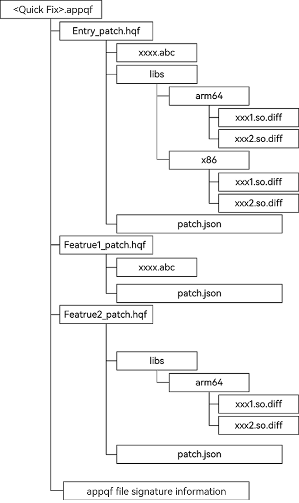
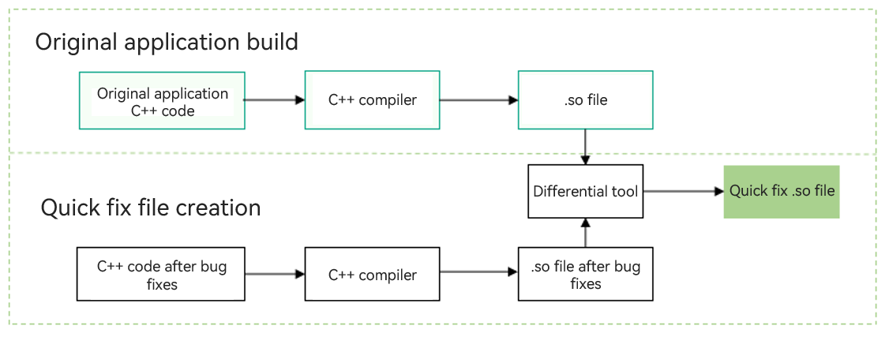
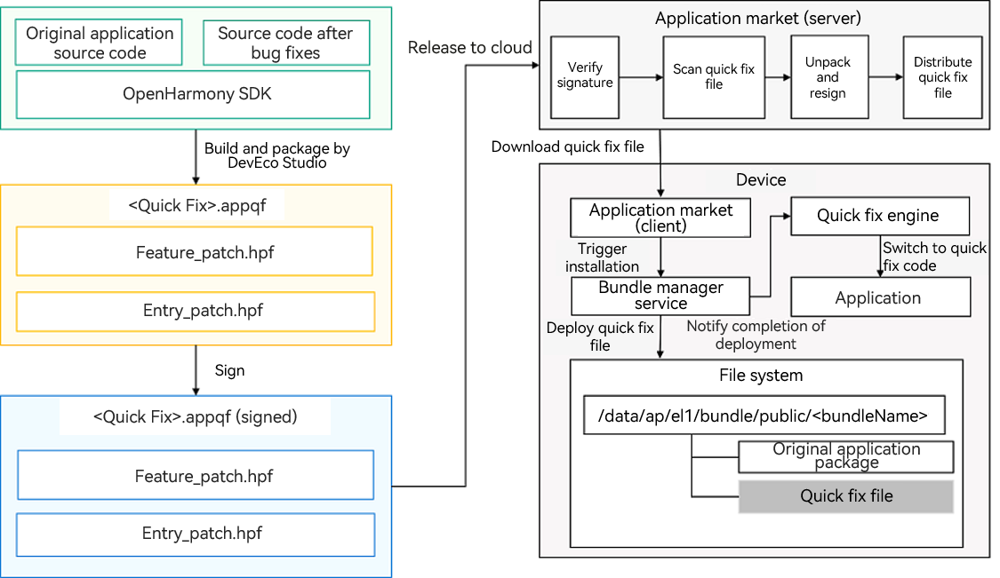
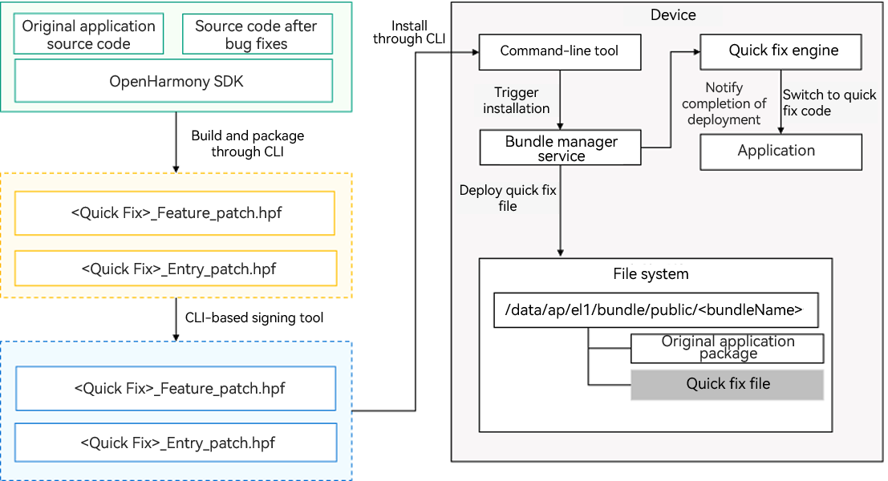

# Quick Fix Overview

Quick fix is a technical means provided by the OpenHarmony system for developers to fix application bugs in a manner that is far faster than application upgrades. Compared with the full application upgrade, the quick fix provides a better user experience by being smaller and faster. It allows users to fix application bugs quickly, without restarting their application.

## Rules for Using Quick Fix

* The quick fix only works for TypeScript (TS) and C++ code of applications, that is, .abc files (created after TS code compilation) and .so files (created after C++ code compilation). It does not work for resource files.
* No new .abc and .so files are allowed.
* Before deploying a quick fix package, make sure the corresponding application has been installed. Otherwise, the deployment will fail.
* The bundle name and application version number configured in the quick fix package must be the same as those of the installed application. Otherwise, the deployment will fail.
* Make sure the version of the quick fix package to deploy is later than that of the one previously deployed. Otherwise, the deployment will fail.
* The signature information of the quick fix package must be the same as that of the application to be fixed. Otherwise, the deployment will fail.
* Installing an application update will delete the quick fix package.

## Structure of the Quick Fix Package


<br>The preceding figure shows the structure of the quick fix package released by an OpenHarmony application.
* As shown in the figure, the quick fix package comes in two formats:
    * .appqf (Application Quick Fix)
    <br> There is a one-to-one mapping between the .appqf file and App Pack of an application. For details, see [Application Package Structure in Stage Model](application-package-structure-stage.md).
        * The .appqf file is used to release OpenHarmony applications to the application market and cannot be directly installed on devices.
        * An .appqf file consists of one or more .hqf (Harmony Ability Package Quick Fix) files, which are extracted from the .appqf file by the application market and then distributed to specific devices.
        * The .appqf file must contain the developer's signature information before being released to the application market. For details about how to sign the file, see [hapsigner Overview](../security/hapsigntool-overview.md).
    * .hqf (Harmony Ability Package Quick Fix)
    <br> The .hqf file is a quick fix to bugs in a HAP file. It can be installed on devices. An .hqf file contains .abc and .so files. The .abc files provide the quick fix, and the .so files provide package configuration information as well as the quick fix.
        * .abc file: modified TS code in the application, which is a bytecode file created after the build.
        * **libs** directory: a collection of .so.diff files, which are differential files of the .so library files, organized by system CPU architecture, such as arm and x86.
        * **patch.json**:
          <br> This file is used to describe the version information of the .hqf file and is filled in by developers. The details are as follows:
            ```json
            {
                "app" : {
                    "bundleName" : "com.ohos.quickfix",
                    "versionCode" : 1000000,
                    "versionName" : "1.0.0",
                    "patchVersionCode" : 1000000,
                    "patchVersionName" : "1.0.0"
                },
                "module" : {
                    "name" : "entry",
                    "type" : "patch",
                    "deviceTypes" : [
                    "default",
                    "tablet"
                    ],
                    "originalModuleHash" : "11223344556677889900"
                }
            }
            ```
            The following describes the parameters:
            | Parameter|Type |Description |Initial Value Allowed|
            | --- | --- | --- | --- |
            |bundleName | string | Bundle name of the application.   | No|
            |versionCode | int |Version of the application.         | No |
            |versionName |string |Version name of the application.| No for the patch|
            |patchVersionCode |int |Version of the patch.  | No|
            |patchVersionName |string |Version name of the patch.| No for the patch|
            |name |string |Module name of the application, which is used to restore the module.| No|
            |type | string|Type of the patch. The value can only be **patch**.| No|
            |deviceTypes |array<string> |Device types supported by the patch.| No|
            |originalModuleHash| string |Hash value of the bundle corresponding to the original module name.| No|

## Quick Fix to .abc Files Created After TS Code Compilation


The preceding figure shows the process of creating an .abc file quick fix using the TS compiler.
* An application build creates .abc and .map files. The .abc file is a bytecode file created after TS code compilation. It is used when the application is running. The .map file is an intermediate file created when the TS code is compiled using the TS compiler. It stores information such as functions and classes in the code.
* After bugs in the application are fixed, the application code is compiled again. During the compilation, the difference between the source and the target is obtained based on the preceding .map file and the current TS code, and an .abc file for quick fix is generated based on the difference. This .abc file will be placed in the .hqf file.

## Quick Fix to .so Files Created After C++ Code Compilation



The preceding figure shows the process of creating a .so file quick fix using the differential tool.
* The C++ source code of the original application is built into a .so file by using a compiler. The .so file is used when the application is running.
* After bugs in the application are fixed, the C++ code is compiled again into a .so file. With the two .so files before and after bug fixes, the differential tool generates a .so file for quick fix. This .so file will also be placed in the .hqf file.

## Quick Fix Release and Deployment Process



As shown above, the modules involved in the release process are as follows:
* DevEco Studio: an integrated development environment for developing code projects. It can be used to create a quick fix file based on the original application code and the code after bug fixes, and sign the created quick repair file for release to the application market.
* Application market server: place where you release the quick fix file. It verifies the signature, scans for risks, unpacks and resigns the file, and then distributes the file to the client.
* Application market client: tool that receives the quick fix file from the application market server and triggers installation.
* Bundle manager service: system service used to manage the installation and uninstallation of application packages and quick fix files on the device.
* Quick fix engine: system service used to manage switching to quick fix code on the device. If the target application is running, the quick fix engine instructs it to switch to the quick fix file upon completion of the quick fix file deployment.
* File system: location where the application package and quick repair file are deployed on the device.

In the end-to-end release and deployment process of the quick repair file:
1. DevEco Studio is used to create a quick fix file through building and packaging based on the original application source code and the source code after bug fixes, and sign the created quick fix file.
2. The signed quick repair file is released to the application market, which then distributes the file after verifying the signature, scanning for risks, and unpacking and resigning the file.
3. When the on-device application market client detects that a new quick fix file is available on the application market server, it downloads the file, and then installs and deploys the file through the bundle manager service in the system.
4. After the quick fix file is deployed, the quick fix engine triggers the application to switch to the quick fix file, ensuring that the user can instantly use the functions where bugs are fixed.

## Quick Fix File Debugging Process



* As the quick fix capability is not yet available in DevEco Studio, for the time being, you can use the provided command-line tool to develop a quick fix file. The procedure is as follows:
1. With the original application source code and the source code after bug fixes, use the command-line tool to build and create quick fix files in .hpf format. Sign the .hpf files before installing them on the device. As aforementioned, the .appqf file cannot be installed on the device.
2. Install and deploy the .hqf files on the device using the command-line tool.
3. After the .hqf files are deployed, a callback is called to instruct the quick fix engine to trigger the application to switch to the quick fix file, ensuring that the user can instantly use the functions where bugs are fixed.
