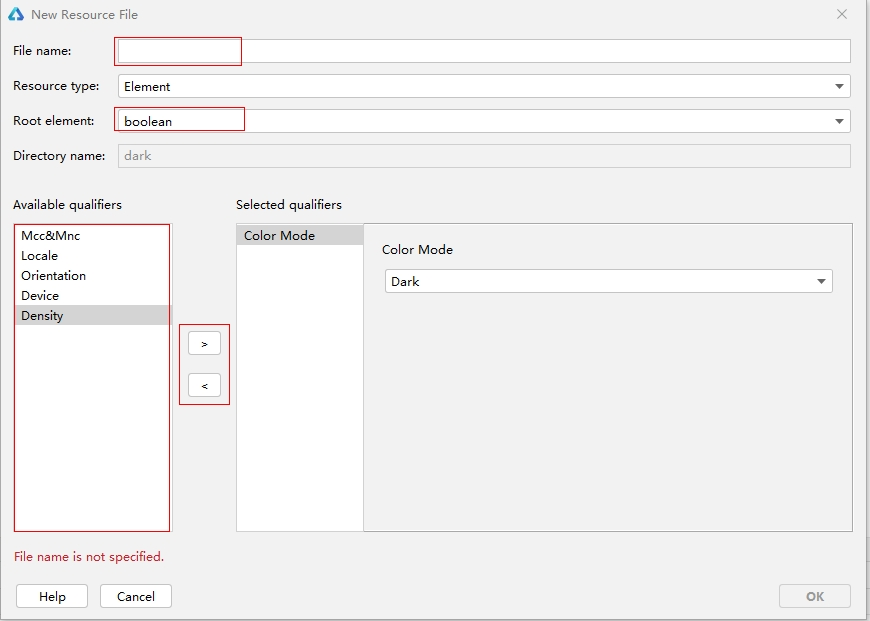
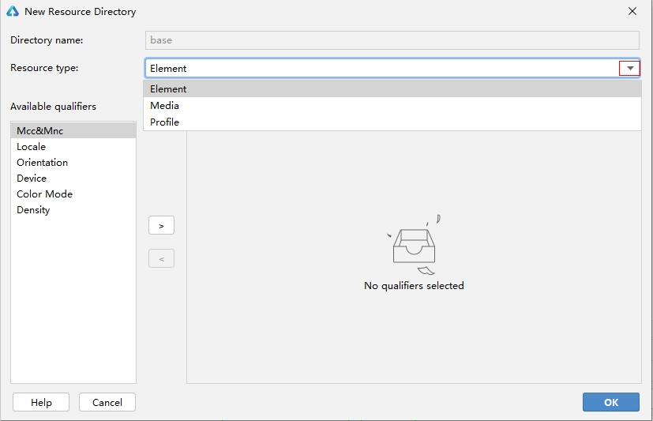
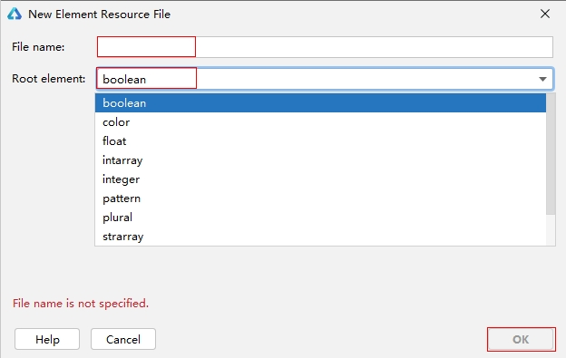

# Resource Categories and Access

<!--Kit: Localization Kit-->
<!--Subsystem: Global-->
<!--Owner: @liule_123-->
<!--Designer: @buda_wy-->
<!--Tester: @lpw_work-->
<!--Adviser: @Brilliantry_Rui-->

During application development, you may need to use different resources, such as strings, colors, fonts, spacing, and icons. The values of these resources vary with devices or configurations. This topic describes resource types and provides guidance for resource development.
Resources are classified into the following types based on their sources:

- Application resources: resources customized by developers in applications. You can use resource files to manage resources on different devices or configurations.
- System resources: resources provided by the system. You can obtain system icon resources from [HarmonyOS Symbol](https://developer.huawei.com/consumer/en/design/harmonyos-symbol/) and system color, spacing, and rounded corner resources from the [system resource layer design table](https://gitcode.com/openharmony/docs/blob/master/en/design/ux-design/design-resources.md). In addition, you can obtain system color resources from [full table of basic and semantic tokens](https://developer.huawei.com/consumer/en/doc/design-guides/color-0000001776857164#section17672143841113). The resources in this table do not overlap with those in the system resource layer design table. Both are recommended system color resources.<br>Other system resources that are not listed in the tables are system component and underlying capability parameters. You are advised to use the system resources provided in the preceding tables.

## Resource Categories

Resource files used during application development must be stored in specified directories for management. There are two types of resource directories, namely, resource directories and resource group directories. The resource directories are the **base**, qualifiers, **rawfile**, and **resfile** directories. The resource group directories are the **element**, **media**, and **profile** directories.

```
resources
|---base  // Default directory.
|   |---element
|   |   |---string.json // String resource file.
|   |---media
|   |   |---icon.png // Media resource file, which can be an image or a video.
|   |---profile
|   |   |---test_profile.json // User-defined profile.
|---en_GB-vertical-car-mdpi // Example of a qualifiers subdirectory, which needs to be created on your own.
|   |---element
|   |   |---string.json
|   |---media
|   |   |---icon.png
|   |---profile
|   |   |---test_profile.json
|---rawfile // Other types of files are saved as raw files and will not be integrated into the resources.index file. You can customize the file name as needed.
|---resfile // Other types of files are saved as raw files and will not be integrated into the resources.index file. You can customize the file name as needed.
```
> **NOTE**
>
> - Files in resource directories and resource group directories are considered as resource files and will not be obfuscated during application packaging.
>
> - The common resource files used across projects in the stage model are stored in the **resources** directory under **AppScope**.
>
> - The resource files in the **AppScope** directory are merged into the **resources** directory. If files with the same name exist in these two directories, the ones in the **AppScope** directory are retained after build and packaging.

### Resource Directories

Table 1 Description of resource directories

| Directory| Description|
|--- | --- |
| base directory| The **base** directory is provided by default. Under this directory, the **element** subdirectory stores basic elements such as strings, colors, and Boolean values, and the **media** and **profile** subdirectories store resource files such as media, animations, and layouts.<br>Resource files in the directories are compiled into binary files, and each resource file is assigned an ID. Access resource files in the directories based on the resource type and resource name.|
| Qualifiers directory| The qualifiers directory needs to be created as required. Under this directory, the **element** subdirectory stores basic elements such as strings, colors, and Boolean values, and the **media** and **profile** subdirectories store resource files such as media, animations, and layouts.<br>Similarly, resource files in the directories are compiled into binary files, and each resource file is assigned an ID. Access resource files in the directories based on the resource type and resource name. For details about the meaning and value range of qualifiers and the naming rules of this directory, see [Qualifiers Directory](#qualifiers-directory).|
| rawfile directory| You can create multiple levels of subdirectories with custom names to store various resource files.<br>Resource files in the sub-directory are directly packed into the application without being compiled, and no IDs will be assigned to the resource files. Access the directories based on the specified file path and file name.|
| resfile Directory| You can create multiple levels of subdirectories with custom names to store various resource files.<br>Resource files in the sub-directory are directly packed into the application without being compiled, and no IDs will be assigned to the resource files. After the application is installed, resources in the **resfile** repository are decompressed to the application sandbox path. After the **resfile** directory is obtained through the **Context** attribute [resourceDir](../reference/apis-ability-kit/js-apis-inner-application-context.md#properties), the resources can be accessed through the file path in read-only mode.|

### Resource Group Directories

Table 2 Resource group directories

| Directory   | Description                                    | Resource File                                    |
| --------- | ---------------------------------------- | ---------------------------------------- |
| element | Element resources. Each type of data is represented by a JSON file. (Only files are supported in this directory.) The options are as follows:<br>- **boolean**: boolean data<br>- **color**: color data<br>- **float**: floating point number, ranging from -2^128 to 2^128<br>- **intarray**: array of integers<br>- **integer**: integer, ranging from -2^31 to 2^31-1<br>- **plural**: plural form data<br>- **strarray**: array of strings<br>- **string**: string. For details about how to format strings, see [API Reference](../reference/apis-localization-kit/js-apis-resource-manager.md#getstringsync10).<!--Del--><br>- **pattern**: style (for system applications only)<!--DelEnd--><!--Del--><br>- **theme**: theme (for system applications only)<!--DelEnd-->| It is recommended that files in the **element** subdirectory be named the same as the following files, each of which can contain only data of the same type:<br>-&nbsp;boolean.json<br>-&nbsp;color.json<br>-&nbsp;float.json<br>-&nbsp;intarray.json<br>-&nbsp;integer.json<br>-&nbsp;plural.json<br>-&nbsp;strarray.json<br>-&nbsp;string.json<!--Del--><br>-&nbsp;pattern.json<!--DelEnd--><!--Del--><br>-&nbsp;theme.json<!--DelEnd--> |
| media   | Indicates media resources, including non-text files such as images, audios, and videos. (Only files are supported in this directory.)<br>Table 3 and Table 4 describe the types of images, audios, and videos.             | The file name can be customized, for example, **icon.png**.                    |
| profile  | Indicates a custom configuration file. You can obtain the file content by using the [getProfileByAbility](../reference/apis-ability-kit/js-apis-bundleManager.md#bundlemanagergetprofilebyability) API. (Only JSON files are supported in this directory.)      | The file name can be customized, for example, **test_profile.json**.          |

**Media Resource Types**

Table 3 Image resource types

| Format  | File Name Extension|
| ---- | ----- |
| JPEG | .jpg  |
| PNG  | .png  |
| GIF  | .gif  |
| SVG  | .svg  |
| WEBP | .webp |
| BMP  | .bmp  |

Table 4 Audio and video resource types

| Format                                  | File Name Extension        |
| ------------------------------------ | --------------- |
| H.264 AVC |.3gp |
| Baseline Profile (BP) | .mp4   |


### Qualifiers Directory

The name of a qualifiers directory consists of one or more qualifiers that represent the application scenarios or device characteristics. Qualifiers include the mobile country code (MCC), mobile network code (MNC), language, script, country or region, screen orientation, device type, night mode, and screen density. Underscores (\_) or hyphens (\-) are used to separate qualifiers. Before creating a qualifiers directory, familiarize yourself with the following directory naming conventions:

- Qualifiers are ordered in the following sequence: MCC_MNC-language_script_country/region-screen orientation-device type-night mode-screen density. You can select one or multiple qualifiers to name your subdirectory based on your application scenarios and device characteristics.

- Separation between qualifiers: the MCC and MNC qualifiers are separated by underscores (\_); the language, script, and country/region qualifiers are separated by underscores (\_); other qualifiers are separated by hyphens (-). For example, **mcc460_mnc00-zh_Hant_CN** and **zh_CN-car-ldpi**.

- Value range of qualifiers: The value of each qualifier must meet the requirements specified in the following table. Otherwise, the resource files in the resources directory cannot be matched.

Table 5 Requirements for qualifier values

| Qualifier Type      | Description and Value Range                                 |
| ----------- | ---------------------------------------- |
| MCC&MNC| Indicates the MCC and MNC, which are obtained from the network where the device is registered.<br>The MCC can be either followed by the MNC with an underscore (_) in between or be used independently. For example, **mcc460** represents China, and **mcc460_mnc00** represents China Mobile.<br>For details about the value range, see [ITU-T E.212](https://www.itu.int/rec/T-REC-E.212) (the international identification plan for public networks and subscriptions).|
| Language         | Indicates the language used by the device. The value consists of two or three lowercase letters. For example, **zh** indicates Chinese, **en** indicates English, and **mai** indicates Maithili.<br>For details about the value range, see [ISO 639](https://www.iso.org/iso-639-language-code) (codes for the representation of names of languages).|
| Text         | Indicates the script type used by the device. The value starts with one uppercase letter followed by three lowercase letters. For example, **Hans** indicates simplified Chinese, and **Hant** indicates traditional Chinese.<br>For details about the value range, see [ISO 15924](https://www.iso.org/standard/81905.html) (codes for the representation of names of scripts).|
| Country/Region      | Indicates the country or region where the user is located. The value consists of two or three uppercase letters or three digits. For example, **CN** indicates China, and **GB** indicates the United Kingdom.<br>For details about the value range, see [ISO 3166-1](https://www.iso.org/iso-3166-country-codes.html) (codes for the representation of names of countries and their subdivisions).|
| Screen orientation        | Indicates the screen orientation of the device. The value can be:<br>- **vertical**: portrait orientation<br>- **horizontal**: landscape orientation|
| Device type       | <!--RP1-->Indicates the device type. The value can be:<br>- **car**: a telematics device<br>- **tablet**: tablet<br>- **tv**: smart TV<br>- **wearable**: smart wearable<!--RP1End--> |
| Color mode       | Indicates the color mode of the device. The value can be:<br>- **dark**: dark mode<br>- **light**: light mode|
| Screen density       | Indicates the screen density of the device, in dpi. The value can be:<br>- **sdpi**: small-scale DPI. This value is applicable to devices with a DPI range of (0, 120].<br>- **mdpi**: medium-scale DPI. This value is applicable to devices with a DPI range of (120, 160].<br>- **ldpi**: large-scale DPI. This value is applicable to devices with a DPI range of (160, 240].<br>- **xldpi**: extra-large-scale DPI. This value is applicable to devices with a DPI range of (240, 320].<br>- **xxldpi**: extra-extra-large-scale DPI. This value is applicable to devices with a DPI range of (320, 480].<br>- **xxxldpi**: extra-extra-extra-large-scale DPI. This value is applicable to devices with a DPI range of (480, 640].|

### Resource File Examples

The content of the **color.json** file is as follows:

The standard hexadecimal color value consists of eight hexadecimal digits. The first two digits indicate the opacity and the last six digits indicate the color value.
```json
{
    "color": [
        {
            "name": "color_hello",
            "value": "#ffff0000"
        },
        {
            "name": "color_world",
            "value": "#ff0000ff"
        }
    ]
}
```

The content of the **float.json** file is as follows:

```json
{
    "float": [
        {
            "name": "font_hello",
            "value": "28.0fp"
        },
	    {
            "name": "font_world",
            "value": "20.0fp"
        }
    ]
}
```

The content of the **string.json** file is as follows:

```json
{
    "string": [
        {
            "name": "string_hello",
            "value": "Hello"
        },
	    {
            "name": "string_world",
            "value": "World"
        },
	    {
            "name": "message_arrive",
            "value": "We will arrive at %1$s."
        },
        {
            "name": "message_notification",
            "value": "Hello, %1$s!,You have %2$d new messages."
        }
    ]
}
```

The content of the **plural.json** file is as follows:

```json
{
    "plural": [
        {
            "name": "eat_apple",
            "value": [
                {
                    "quantity": "one",
                    "value": "%d apple"
                },
                {
                    "quantity": "other",
                    "value": "%d apples"
                }
            ]
        }
    ]
}
```

## Creating a Resource Directory and Resource File

You can create a directory and its files under the **resources** directory based on the naming rules of the qualifiers directory and file types supported by resource group directories. DevEco Studio provides a wizard for you to create resource directories and resource files.

### Creating a Resource Directory and Resource File

Right-click the **resources** directory and choose **New** > **Resource File**. By default, the file is created in a resource group directory under **base**. If one or more qualifiers are selected, the system automatically generates a subdirectory and creates the file in this subdirectory.

Qualifiers of different types can be combined. For example, if **Locale** is set to **zh_CN** and **ColorMode** is set to **Dark**, the qualifiers directory name will be **zh_CN-dark**. For details about the combination rules, see [Qualifiers Directory](#qualifiers-directory).

In **File name**, enter the name of the resource file to create. In **Resource type**, select the type of the resource group, which is **element** by default. In **Root Element**, select a resource type. To select a qualifier, highlight it under **Available qualifiers** and click the right arrow. To deselect a qualifier, highlight it under **Selected qualifiers** and click the left arrow.<br>The created directory is automatically named in the format of *Qualifiers.Resource group type*. For example, if you create a directory by setting **Color Mode** to **Dark** and **Resource type** to **Element**, the system automatically generates a directory named **dark/element**.

  

### Creating a Resource Directory

Right-click the **resources** directory and choose **New** > **Resource Directory** to create a directory only. By default, the **base** directory is created. If one or more qualifiers are selected, the system automatically generates the qualifiers directories and resource group directories. After specifying the qualifier, select a resource group type. Currently, the supported resource group types are **Element**, **Media**, and **Profile**. A resource directory will be generated upon creation.

  

### Creating a Resource File

Right-click a resource group directory (**element**, **media**, or **profile**) and choose **New** > **XXX Resource File**. A resource file under this directory is then created. For example, you can create an element resource file in the **element** subdirectory.

  

### Example

The following takes the Chinese and English string resource files as examples to describe how to create resources with different qualifiers.

1. Right-click the **resources** directory and choose **New** > **Resource File** from the shortcut menu. Set **File name** to **string_sample**, **Resource type** to **Element**, **Root Element** to **string**, and **Available qualifiers** to **Locale**. Select **zh** from the language list and **CN** from the country/region list. After all is set, the **zh_CN/element/string_sample.json** file is created in the **resources** directory.
    

2. Similarly, select **en** for language and **US** for country/region to create the **en_US/element/string_sample.json** file.

The following figure shows the created resource files. For details about how to access the created resource files, see [Accessing Resources](#accessing-resources).


## Using the attr Attribute for Resource Translation

### Function Description

If the string resource referenced by an application needs to support multi-language adaptation, the **attr** attribute can be used to mark the translation scope and status of the string. The **attr** attribute is not involved in resource compilation.

If the **attr** attribute is not configured, a string is translated by default.

**Parameters of attr**

| Name       | Type                   |  Description  |
| --------- | ----------------------- |  ---- |
| translatable |  boolean | Whether the string needs to be translated.<br>**true**: The string needs to be translated.<br>**false**: The string does not need to be translated. |
| priority    | string   |  Translation status of the string.<br>**code**: untranslated<br>**translate**: translated but not verified<br>**LT**: translated and verified<br>**customer**: custom  |

### Constraints
The **attr** attribute applies to the string, strarray, and plural resources in the **base** directory.
```
resources
|---base
|   |---element
|   |   |---string.json
|   |   |---strarray.json
|   |   |---plural.json
```
### Example
The following shows the **attr** attribute configured in **string**. The **string1** string is marked as not to be translated, and the **string2** string is marked as to be translated and the translation has been verified.

```json
{
  "string": [
    {
      "name": "string1",
      "value": "1",
      "attr": {
        "translatable": false
      }
    },
    {
      "name": "string2",
      "value": "Hello world!",
      "attr": {
        "translatable": true,
        "priority": "LT"
      }
    }
  ]
}
```

## Accessing Resources

### HAP Resources

 - Access resources through **$r()** or **$rawfile()**.<br>Resources of the color, float, string, plural, media and profile types are accessed through **$r('app.type.name')**, in which **app** indicates the resource defined in the **resources** directory, **type** indicates the resource type, and **name** indicates the resource name.<br>To access strings with multiple placeholders in the **string.json** file, for example, **$s** and **$d** in a value, use the **$r('app.string.label', 'aaa', 444)** format, where **label** indicates the resource name, and **'aaa'** and **444** are used to replace placeholders.<br>To access resources in the **rawfile** subdirectory, use the **$rawfile('filename')** format. Wherein **filename** indicates the relative path of a file in the **rawfile** subdirectory, which must contain the file name extension and cannot start with a slash (/).

   > **NOTE**
   >
   > For details about how to use native APIs to access raw files, see [Raw File Development](../napi/rawfile-guidelines.md).

[Resource file examples](#resource-file-examples) show different .json files, including **color.json**, **string.json**, and **plural.json**. Before accessing application resources, you need to learn the usage specifications of the .json files.<br>The usage is as follows:

  ```ts
    // Access through $r('app.type.name').
    Text($r('app.string.string_hello'))
    .fontColor($r('app.color.color_emphasize'))
    .fontSize($r('app.float.text_size_headline1'))
    .fontFamily($r('app.string.font_family_medium'))
    .backgroundColor($r('app.color.color_palette_aux1'))

    Image($r('app.media.app_icon'))
    .border({
      color: $r('app.color.color_palette_aux1'),
      radius: $r('app.float.corner_radius_button'), width: 2
    })
    .margin({
      top: $r('app.float.elements_margin_horizontal_m'),
      bottom: $r('app.float.elements_margin_horizontal_l')
    })
    .height(200)
    .width(300)

    // For a string in **string.json** whose name is "message_notification" and value is "Hello, %1$s!,You have %2$d new messages.",
    // replace the placeholders $s and $d with 'LiHua' and 2, respectively. The sample code is as follows:
    Text($r('app.string.message_notification', 'LiHua', 2))
  ```

- After obtaining a **ResourceManager** object through the application context, call APIs of [resource management](../reference/apis-localization-kit/js-apis-resource-manager.md) to access different resources. Example:<br>Call **getContext().resourceManager.getStringByNameSync('test')** to obtain string resources.<br>Call **getContext().resourceManager.getRawFd('rawfilepath')** to obtain the descriptor information of the HAP where the raw file is located, and then use **{fd, offset, length}** to access the raw file.

### Cross-HAP/HSP Resources

<!--Del-->
**Cross-Bundle Access (for System Applications Only)**

- Create the context of the corresponding HAP or HSP file through the [createBundleContext(context, bundleName)](../reference/apis-ability-kit/js-apis-app-ability-application-sys.md#applicationcreatebundlecontext12) API. After obtaining the **resourceManager** object, call different APIs of [resource management](../reference/apis-localization-kit/js-apis-resource-manager.md) to access various resources by resource ID or resource name.
<!--DelEnd-->

**Inter-Bundle, Cross-Module Access**

- Create the context of the corresponding module through the [createModuleContext(context, moduleName)](../reference/apis-ability-kit/js-apis-app-ability-application.md#applicationcreatemodulecontext12) API. After obtaining the **resourceManager** object, call different APIs of [resource management](../reference/apis-localization-kit/js-apis-resource-manager.md) to access various resources by resource ID or resource name.

- Access resources through **$r()** or **$rawfile()**. Specifically, perform either of the following:

  1. Add dependencies to the **oh-package.json5** file in the **entry** directory. For example, **"dependencies": {"library": "file:../library"}**.

  

  2. Obtain resources by using the literal **[hsp].*type*.*name***, where **hsp** indicates the HSP module name, **type** indicates the resource type, and **name** indicates the resource name. The following is an example:
  
    ```ts
      Text($r('[hsp].string.test_string'))
        .fontSize($r('[hsp].float.font_size'))
        .fontColor($r('[hsp].color.font_color'))  
      Image($rawfile('[hsp].icon.png'))
    ```
  3. Use variables. The following is an example:

   ```ts
    @Entry
    @Component
    struct Index {
      text: string = '[hsp].string.test_string';
      fontSize: string = '[hsp].float.font_size';
      fontColor: string = '[hsp].color.font_color';
      image: string = '[hsp].media.string';
      rawfile: string = '[hsp].icon.png';
  
      build() {
        Row() {
          Text($r(this.text))
            .fontSize($r(this.fontSize))
            .fontColor($r(this.fontColor))
  
          Image($r(this.image))
  
          Image($rawfile(this.rawfile))
        }
      }
    }
   ```
  > **NOTE**
  >
  > The HSP module name must be placed in the brackets ([]). If the **rawfile** directory contains multiple levels of folders, the path must start from the first level, for example, **$rawfile('[hsp].oneFile/twoFile/icon.png')**. When **$r** or **$rawfile** is used for cross-HSP resource access, resource verification is not available at compile time, and you need to manually check that the target resources exist in the corresponding location.


### System Resources

You can obtain system icon resources from [HarmonyOS Symbol](https://developer.huawei.com/consumer/en/design/harmonyos-symbol/) and system color, spacing, and rounded corner resources from the [system resource layer design table](https://gitcode.com/openharmony/docs/blob/master/en/design/ux-design/design-resources.md). In addition, you can obtain system color resources from [full table of basic and semantic tokens](https://developer.huawei.com/consumer/en/doc/design-guides/color-0000001776857164#section17672143841113). The resources in this table do not overlap with those in the system resource layer design table. Both are recommended system color resources.
You can further set the icon colors through [SymbolGlyph](../reference/apis-arkui/arkui-ts/ts-basic-components-symbolGlyph.md).

To access system resources, use the **$r('sys.type.name')** format, where **sys** indicates the system resource, **type** indicates the resource type, such as color, float, string, media, or symbol, and **name** indicates the resource name.

> **NOTE**
> - Other system resources that are not listed in the mentioned tables are system component and underlying capability parameters. You are advised to use the system resources provided in the preceding tables.
>
> - For preset applications, you are advised to use system resources. For third-party applications, you can choose to use system resources or custom application resources as required.
>
> - The use of system resources is only supported in the declarative development paradigm.
>
> - Currently, the default system font used on the UI is HarmonyOS Sans, and the supported character range follows the standards in [Information technology—Chinese coded character set GB18030-2022](https://openstd.samr.gov.cn/bzgk/gb/newGbInfo?hcno=A1931A578FE14957104988029B0833D3). If the characters cannot be displayed in HarmonyOS Sans, the system uses another font with the highest priority to display the characters. For details about the priority of the system fonts, see the `system/etc/fontconfig.json` configuration file on the device.

```ts
Text('Hello')
  .fontColor($r('sys.color.ohos_id_color_emphasize'))
  .fontSize($r('sys.float.ohos_id_text_size_headline1'))
  .fontFamily($r('sys.string.ohos_id_text_font_family_medium'))
  .backgroundColor($r('sys.color.ohos_id_color_palette_aux1'))

Image($r('sys.media.ohos_app_icon'))
  .border({
    color: $r('sys.color.ohos_id_color_palette_aux1'),
    radius: $r('sys.float.ohos_id_corner_radius_button'), width: 2
  })
  .margin({
    top: $r('sys.float.ohos_id_elements_margin_horizontal_m'),
    bottom: $r('sys.float.ohos_id_elements_margin_horizontal_l')
  })
  .height(200)
  .width(300)
```

## Matching Resources

When your application needs to use a resource, the system preferentially searches the qualifiers subdirectories that match the current device state. The system searches the **base** subdirectory for the target resource only when the **resources** directory does not contain any qualifiers subdirectories that match the current device state or the target resource is not found in the qualifiers subdirectories. **rawfile** and **resfile** are raw file directories, which will not match resources based on the device status.

> **NOTE**
>
> - The resource files in the **AppScope** directory are merged into the **resources** directory. If files with the same name exist in these two directories, the ones in the **AppScope** directory are retained after build and packaging.

### Rules for Matching Qualifiers Subdirectories and Device Resources

- Qualifiers are matched with the device resources in the following priorities: MCC&MNC > locale (options: language, language_script, language_country/region, and language_script_country/region) > screen orientation > device type > color mode > screen density

- If the qualifiers subdirectories contain the MCC, MNC, language, script, screen orientation, device type, and color mode qualifiers, their values must be consistent with the current device status so that the subdirectories can be used for matching the device resources. For example, the qualifiers directory **zh_CN-car-ldpi** cannot be used for matching the resource files labeled **en_US**.

- If there are multiple qualifiers subdirectories for the screen density, the closest qualifiers are matched upwards; otherwise, downwards. For example, if qualifiers directories **xldpi** and **xxldpi** exist and the device screen density is **xxldpi**, the qualifier directory **xxldpi** will be matched.

For details about the rules for loading resources on the application UI, see [Overview of Internationalization and Localization](../internationalization/i18n-l10n.md).

### Obtaining Resources for a Specific Configuration

**Basic Concepts**

You can add qualifiers to the project-level **resources** directory to meet different system settings such as multi-language support and dark and light color modes. However, some directory resources fail to be obtained due to matching rules of the qualifiers directories.

If this is the case, you can use the following APIs to obtain resources for a specific configuration.

**Available APIs**

| API                                                      | Description                                                        |
| ------------------------------------------------------------ | ------------------------------------------------------------ |
| [getOverrideResourceManager](../reference/apis-localization-kit/js-apis-resource-manager.md#getoverrideresourcemanager12)(configuration?: [Configuration](../reference/apis-localization-kit/js-apis-resource-manager.md#configuration)) : [ResourceManager](../reference/apis-localization-kit/js-apis-resource-manager.md#resourcemanager) | Obtains a **ResourceManager** object for loading resources for a specific configuration. This API returns the result synchronously.|
| [getOverrideConfiguration](../reference/apis-localization-kit/js-apis-resource-manager.md#getoverrideconfiguration12)() : [Configuration](../reference/apis-localization-kit/js-apis-resource-manager.md#configuration) | Obtains the specified configuration. This API returns the result synchronously.                            |
| [updateOverrideConfiguration](../reference/apis-localization-kit/js-apis-resource-manager.md#updateoverrideconfiguration12)(configuration: [Configuration](../reference/apis-localization-kit/js-apis-resource-manager.md#configuration)) : void | Updates the specified configuration.                                              |

**Example**

The following example demonstrates how to obtain the specified resources for languages other than the one in use. Assume that the following resource files with the same name are defined in the **resources** directories for Chinese, English, and German:

- entry/src/main/resources/zh_CN/element/string.json

```json
{
  "string": [
    {
      "name": "greetings",
      "value": "你好，世界"
    }
  ]
}
```

- entry/src/main/resources/en_US/element/string.json

```json
{
  "string": [
    {
      "name": "greetings",
      "value": "Hello, world"
    }
  ]
}
```

- entry/src/main/resources/de_DE/element/string.json

```json
{
  "string": [
    {
      "name": "greetings",
      "value": "Hallo, Welt"
    }
  ]
}
```

In **Index.ets**, add code to obtain the resources of the three languages and display them in the text box. The current system language is Chinese. The following is sample code in **entry/src/main/ets/pages/Index.ets**:

```ts
import { common } from '@kit.AbilityKit';

@Entry
@Component
struct Index {
  @State englishString: string = "";
  @State germanString: string = "";

  getString(): string {
    let resMgr = this.getUIContext().getHostContext()?.resourceManager;
    if (!resMgr) {
      return "";
    }
    let currentLanguageString: string = "";
    try {
      let resId = $r('app.string.greetings').id;

      // Obtain resources that match the current system configuration, including the color mode and resolution, for the current system language.
      currentLanguageString = resMgr.getStringSync(resId);

      // Obtain resources that match the current system configuration, including the color mode and resolution, for the English language.
      let overrideConfig = resMgr.getOverrideConfiguration();
      overrideConfig.locale = "en_US"; // Set the language to English and locale to en_US.
      let overrideResMgr = resMgr.getOverrideResourceManager(overrideConfig);
      this.englishString = overrideResMgr.getStringSync(resId);

      // Obtain resources that match the current system configuration, including the color mode and resolution, for the German language.
      overrideConfig.locale = "de_DE"; // Set the language to German and locale to de_DE.
      overrideResMgr.updateOverrideConfiguration(overrideConfig); // Equivalent to resMgr.updateOverrideConfiguration(overrideConfig).
      this.germanString = overrideResMgr.getStringSync(resId);
    } catch (err) {
      const code = (err as BusinessError).code;
      const message = (err as BusinessError).message;
      console.error(`get override resource failed, error code: ${code}, error msg: ${message}`);
    }
    return currentLanguageString;
  }

  build() {
    Row() {
      Column() {
        Text(this.getString())
          .fontSize(50)
          .fontWeight(FontWeight.Bold)
        Text(this.englishString)
          .fontSize(50)
          .fontWeight(FontWeight.Bold)
        Text(this.germanString)
          .fontSize(50)
          .fontWeight(FontWeight.Bold)
      }
      .width('100%')
    }
    .height('100%')
  }
}
```

## Overlay Mechanism

Overlay is a resource replacement mechanism. With overlay resource packages, you can enable your application UI to adapt to different styles of various brands and products, without having to repack your application HAPs. The overlay mechanism works in dynamic and static modes. Overlay resource packages contain only resource files, resource index files, and configuration files.

The overlay feature is enabled by default. For details about how to enable and disable this feature, see [@ohos.bundle.overlay (overlay)](../reference/apis-ability-kit/js-apis-overlay.md).

### Using overlay in dynamic mode

1. Place the overlay resource package in the target application installation path and install the package using **hdc install**. For example, for the com.example.overlay application, place the overlay resource package in **data/app/el1/bundle/public/com.example.overlay/**.

2. The application uses [addResource(path)](../reference/apis-localization-kit/js-apis-resource-manager.md#addresource10) to load overlay resources and uses [removeResource(path)](../reference/apis-localization-kit/js-apis-resource-manager.md#removeresource10) to remove overlay resources. The path to an overlay resource consists of the application's sandbox root directory (obtained through **getContext().bundleCodeDir**) and the overlay resource bundle name. For example, **let path = getContext().bundleCodeDir + "overlay *resource bundle name*"**, such as **/data/storage/el1/bundle/overlayResourcePackageName**.

### Using overlay in static mode

The **app.json5** file in the inter-application overlay resource package supports the following fields:
```json
{
  "app":{
    "bundleName": "com.example.myapplication.overlay",
    "vendor" : "example",
    "versionCode": "1000000",
    "versionName": "1.0.0.1",
    "icon": "$media:app_icon",
    "label": "$string:app_name"
  }
}
```
The **module.json5** file in the inter-application overlay resource package supports the following fields:
```json
{
  "module":{
    "name": "entry_overlay_module_name",
    "type": "shared",
    "description": "$string:entry_overlay_desc",
    "deviceTypes": [
      "default",
      "tablet"
    ],
    "deliverywithInstall": true,
    "targetModuleName": "entry_module_name",
    "targetPriority": 1
  }
}
```
<!--Del-->
The **app.json5** file in the cross-application overlay resource package supports the following fields, which are available for system applications only:
```json
{
  "app":{
    "bundleName": "com.example.myapplication.overlay",
    "vendor" : "example",
    "versionCode": "1000000",
    "versionName": "1.0.0.1",
    "icon": "$media:app_icon",
    "label": "$string:app_name",
    "targetBundleName": "com.example.myapplication",
    "targetPriority": 1
  }
}
```
The **module.json5** file in the cross-application overlay resource package supports the following fields, which are available for system applications only:
```json
{
  "module":{
    "name": "entry_overlay_module_name",
    "type": "shared",
    "description": "$string:entry_overlay_desc",
    "deviceTypes": [
      "default",
      "tablet"
    ],
    "deliverywithInstall": true,
    "targetModuleName": "entry_module_name",
    "targetPriority": 1
  }
}
```
<!--DelEnd-->
> **NOTE**
><!--Del-->
> - **targetBundleName**: name of the target application to apply the overlay feature. The value is a string.
><!--DelEnd-->
> - **targetModuleName**: name of the target module to apply the overlay feature. The value is a string.
>
> - **targetPriority**: overlay priority. The value is an integer.
>
> - Other fields such as **Ability**, **ExtensionAbility**, and **Permission** are not supported.
>
> - The overlay feature does not support JSON images.

If the **module.json5** file of a module contains the **targetModuleName** and **targetPriority fields** during project creation on DevEco Studio, the module is identified as a module with the overlay feature in the installation phase. Modules with the overlay feature generally provide an overlay resource file for other modules on the device, so that the module specified by **targetModuleName** can display different colors, labels, themes, and the like by using the overlay resource file in a running phase.

 <!--no_check--> 