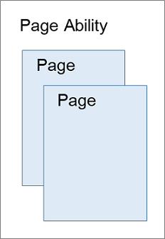

# Preparations

This document is intended for novices at developing OpenHarmony applications. It will introduce you to the OpenHarmony project directory structure and application development process, by walking you through a stripped-down, real-world example – building two pages and implementing redirection between pages. The following figure shows how the pages look on the DevEco Studio Previewer.

Before you begin, there are some basic concepts that will help you better understand OpenHarmony: UI framework and ability.

## Basic Concepts

### UI Framework

OpenHarmony provides a UI development framework, known as ArkUI. ArkUI provides capabilities you may need for application UI development, including a wide array of components, layout calculation, animation, UI interaction, and drawing capabilities.

ArkUI comes with two development paradigms: eTS-based declarative development paradigm (declarative development paradigm for short) and JavaScript-compatible web-like development paradigm (web-like development paradigm for short). You can choose whichever development paradigm that aligns with your practice.

| **Development Paradigm** | **Language** | **UI Update Mode** | **Applicable To** | **Intended Audience** |
| -------- | -------- | -------- | -------- | -------- |
| Declarative development paradigm | Extended TypeScript (eTS) | Data-driven        | Applications involving technological sophistication and teamwork | Mobile application and system application developers |
| Web-like development paradigm | JavaScript | Data-driven | Applications and service widgets with simple UIs | Frontend web developers |

For DevEco Studio V2.2 Beta1 and later versions, both the traditional coding mode and the low-code mode are supported when the JS language is used for development.

For eTS language development, DevEco Studio V3.0 Beta3 and later versions support low-code development in addition to the traditional code development mode.

On the OpenHarmony low-code development pages, you can design your application UI in an efficient, intuitive manner, with a wide array of UI editing features.

### Ability

An ability is an abstraction of a capability that an application can provide. The **Ability** class is an essential component to OpenHarmony applications. An application may provide various capabilities, and so it can have multiple abilities. These abilities can be deployed together or independently from each other.

Abilities are classified into two types: [Feature Ability (FA)](../../glossary.md#f) and [Particle Ability (PA)](../../glossary.md#p). Each type has their respective templates for different capabilities. FAs support only the Page template (also called the [Page ability](../ability/fa-pageability.md)), which is used to provide the capability of interacting with users. A Page ability consists of one or more pages. The figure below shows the relationship between a Page ability and pages.

This document provides a Page ability instance with two pages. For more information about ability development, see [Ability Development](../ability/fa-brief.md).

## Tool Preparation

1. Install the latest version of [DevEco Studio](https://developer.harmonyos.com/cn/develop/deveco-studio#download_beta_openharmony).

2. Install DevEco Studio and configure the development environment. For details, see [Configuring the OpenHarmony SDK](https://developer.harmonyos.com/en/docs/documentation/doc-guides/ohos-setting-up-environment-0000001263160443).

When you are done, follow the instructions in [Getting Started with eTS in the Traditional Coding Approach](start-with-ets.md),[Getting Started with eTS in the Low-Code Approach](start-with-ets-low-code.md), [Getting Started with JavaScript in the Traditional Coding Approach](start-with-js.md), and [Getting Started with JavaScript in the Low-Code Approach](start-with-js-low-code.md).
