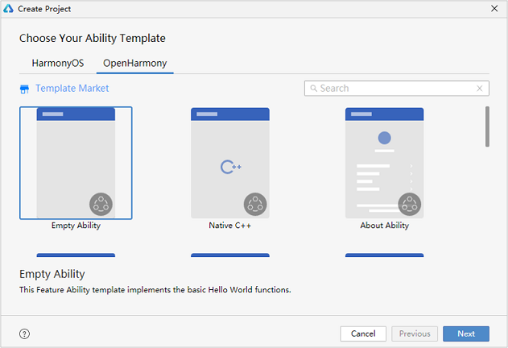
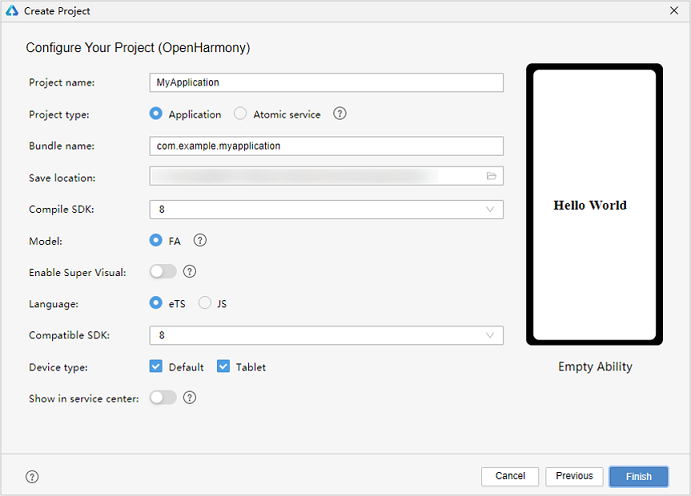
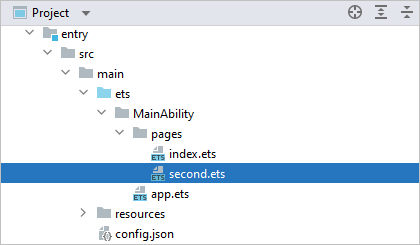
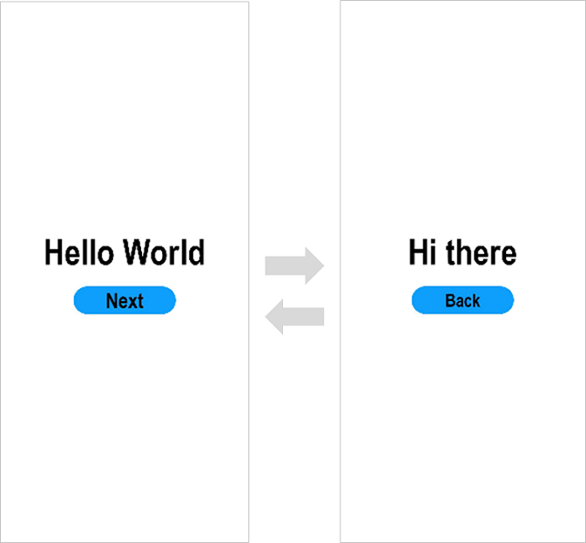

# Getting Started with ArkTS in FA Model


>  **NOTE**
>
>  To use ArkTS, your DevEco Studio must be V3.0.0.601 Beta1 or later.
>
>  For best possible results, use [DevEco Studio V3.0.0.993](https://developer.harmonyos.com/cn/develop/deveco-studio#download) for your development.


## Creating an eTS Project

1. If you are opening DevEco Studio for the first time, click **Create Project**. If a project is already open, choose **File** > **New** > **Create Project** from the menu bar. On the **OpenHarmony** tab of the **Choose Your Ability Template** page, select **Empty Ability** and click **Next**.

   

2. In the project configuration page, set **Compile SDK** to **8** or **9** (in the latter case, you also need to set **Model** to **FA**) and **Language** to **eTS** and retain the default values for other parameters.

   

   > **NOTE**
   >
   > If you are using DevEco Studio V3.0 Beta3 or later, you can use the [low-code development](https://developer.harmonyos.com/en/docs/documentation/doc-guides/ohos-low-code-development-0000001218440652) mode apart from the traditional coding approach.
   >
   > On the low-code development pages, you can design your application UI in an efficient, intuitive manner, with a wide array of UI editing features.
   >
   > To use the low-code development mode, turn on **Enable Super Visual** on the page shown above.

3. Click **Finish**. DevEco Studio will automatically generate the sample code and resources that match your project type. Wait until the project is created.


## eTS Project Directory Structure

- **entry**: OpenHarmony project module, which can be built into an OpenHarmony Ability Package ([HAP](../../glossary.md#hap)).
  - **src > main > ets**: a collection of eTS source code.
  - **src > main > ets > MainAbility**: entry to your application/service.
  - **src > main > ets > MainAbility > pages**: pages contained in **MainAbility**.
  - **src > main > ets > MainAbility > pages > index.ets**: the first page in the **pages** list, also referred to as the entry to the application.
  - **src > main > ets > MainAbility > app.ets**: ability lifecycle file.
  - **src > main > resources**: a collection of resource files used by your application/service, such as graphics, multimedia, character strings, and layout files. For details about resource files, see [Resource Categories and Access](resource-categories-and-access.md#resource-categories).
  - **src > main > config.json**: module configuration file. This file describes the global configuration information of the application/service, the device-specific configuration information, and the configuration information of the HAP file. For details about the configuration file, see [Application Package Structure Configuration File (FA Model)](package-structure.md).
  - **build-profile.json5**: current module information and build configuration options, including **buildOption** and **targets**.
  - **hvigorfile.js**: module-level compilation and build task script. You can customize related tasks and code implementation.

- **build-profile.json5**: application-level configuration information, including the signature and product configuration.

- **hvigorfile.js**: application-level compilation and build task script.


## Building the First Page

1. Use the **\<Text>** component.

   After the project synchronization is complete, choose **entry** > **src** > **main** > **ets** > **MainAbility** > **pages** in the **Project** window and open the **index.ets** file. You can see that the file contains a **\<Text>** component. The sample code in the **index.ets** file is shown below:
   
   ```ts
   // index.ets
   @Entry
   @Component
   struct Index {
     @State message: string = 'Hello World'
   
     build() {
       Row() {
         Column() {
           Text(this.message)
             .fontSize(50)
             .fontWeight(FontWeight.Bold)
         }
         .width('100%')
       }
       .height('100%')
     }
   }
   ```

2. Add a **\<Button>** component.

   On the default page, add a **\<Button>** component to respond to user clicks and implement redirection to another page. The sample code in the **index.ets** file is shown below:
   
   ```ts
   // index.ets
   @Entry
   @Component
   struct Index {
     @State message: string = 'Hello World'
   
     build() {
       Row() {
         Column() {
           Text(this.message)
             .fontSize(50)
             .fontWeight(FontWeight.Bold)
           // Add a button to respond to user clicks.
           Button() {
             Text('Next')
               .fontSize(30)
               .fontWeight(FontWeight.Bold)
           }
           .type(ButtonType.Capsule)
           .margin({
             top: 20
           })
           .backgroundColor('#0D9FFB')
           .width('40%')
           .height('5%')
         }
         .width('100%')
       }
       .height('100%')
     }
   }
   ```

3. On the toolbar in the upper right corner of the editing window, click **Previewer**. Below is how the first page looks in the Previewer.

   


## Building the Second Page

1. Create the second page.

   - Create the second page file: In the **Project** window, choose **entry** > **src** > **main** > **ets** > **MainAbility**. Right-click the **pages** folder, choose **New** > **eTS File**, name the page **second**, and click **Finish**. Below is the structure of the **second** folder.

      

      > **NOTE**
      > You can also right-click the **pages** folder and choose **New** > **Page** from the shortcut menu. In this scenario, you do not need to manually configure page routes.
   - Configure the route for the second page, by setting **pages/second** under **module - js - pages** in the **config.json** The sample code is as follows: The sample code is as follows:
     
      ```json
      {
        "module": {
          "js": [
            {
              "pages": [
                "pages/index",
                "pages/second"
              ]
              }
          ]
        }
      }
      ```

2. Add **\<Text>** and **\<Button>** components.

   Add **\<Text>** and **\<Button>** components and set their styles, as you do for the first page. The sample code in the **second.ets** file is shown below:
   
   ```ts
   // second.ets
   @Entry
   @Component
   struct Second {
     @State message: string = 'Hi there'
   
     build() {
       Row() {
         Column() {
           Text(this.message)
             .fontSize(50)
             .fontWeight(FontWeight.Bold)
           Button() {
             Text('Back')
               .fontSize(25)
               .fontWeight(FontWeight.Bold)
           }
           .type(ButtonType.Capsule)
           .margin({
             top: 20
           })
           .backgroundColor('#0D9FFB')
           .width('40%')
           .height('5%')
         }
         .width('100%')
       }
       .height('100%')
     }
   }
   ```


## Implementing Page Redirection

You can implement page redirection through the [page router](../reference/apis/js-apis-router.md#routerpush), which finds the target page based on the page URL. Import the **router** module and then perform the steps below:

1. Implement redirection from the first page to the second page.

   In the **index.ets** file of the first page, bind the **onClick** event to the **Next** button so that clicking the button redirects the user to the second page. The sample code in the **index.ets** file is shown below:
   
   ```ts
   // index.ets
   import router from '@ohos.router';
   
   @Entry
   @Component
   struct Index {
     @State message: string = 'Hello World'
   
     build() {
       Row() {
         Column() {
           Text(this.message)
             .fontSize(50)
             .fontWeight(FontWeight.Bold)
           // Add a button to respond to user clicks.
           Button() {
             Text('Next')
               .fontSize(30)
               .fontWeight(FontWeight.Bold)
           }
           .type(ButtonType.Capsule)
           .margin({
             top: 20
           })
           .backgroundColor('#0D9FFB')
           .width('40%')
           .height('5%')
           // Bind the onClick event to the Next button so that clicking the button redirects the user to the second page.
           .onClick(() => {
             router.push({ url: 'pages/second' })
           })
         }
         .width('100%')
       }
       .height('100%')
     }
   }
   ```

2. Implement redirection from the second page to the first page.

   In the **second.ets** file of the second page, bind the **onClick** event to the **Back** button so that clicking the button redirects the user back to the first page. The sample code in the **second.ets** file is shown below:
   
   ```ts
   // second.ets
   import router from '@ohos.router';
   
   @Entry
   @Component
   struct Second {
     @State message: string = 'Hi there'
   
     build() {
       Row() {
         Column() {
           Text(this.message)
             .fontSize(50)
             .fontWeight(FontWeight.Bold)
           Button() {
             Text('Back')
               .fontSize(25)
               .fontWeight(FontWeight.Bold)
           }
           .type(ButtonType.Capsule)
           .margin({
             top: 20
           })
           .backgroundColor('#0D9FFB')
           .width('40%')
           .height('5%')
           // Bind the onClick event to the Back button so that clicking the button redirects the user back to the first page.
           .onClick(() => {
             router.back()
           })
         }
         .width('100%')
       }
       .height('100%')
     }
   }
   ```

3. Open the **index.ets** file and click  in the Previewer to refresh the file. The display effect is shown in the figure below.

   


## Running the Application on a Real Device

1. Connect the development board running the OpenHarmony standard system to the computer.

2. Choose **File** > **Project Structure...** > **Project** > **SigningConfigs**, and select **Automatically generate signature**. Wait until the automatic signing is complete, and click **OK**. See the following figure.

   

3. On the toolbar in the upper right corner of the editing window, click . The display effect is shown in the figure below.

   

Congratulations! You have finished developing your OpenHarmony application in ArkTS in the FA model. To learn more about OpenHarmony application development, see [Application Development Overview](../application-dev-guide.md).
