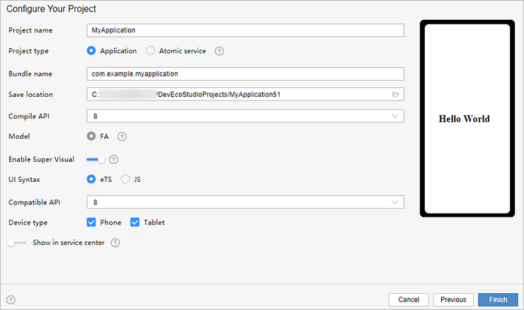
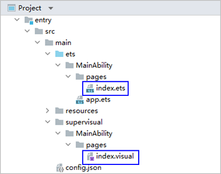
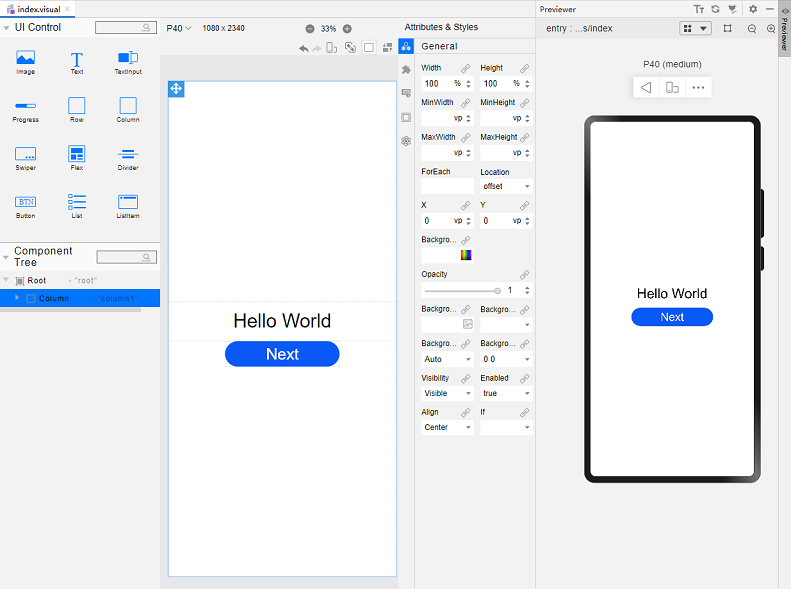
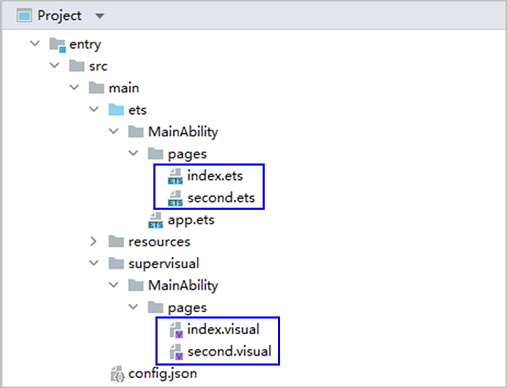
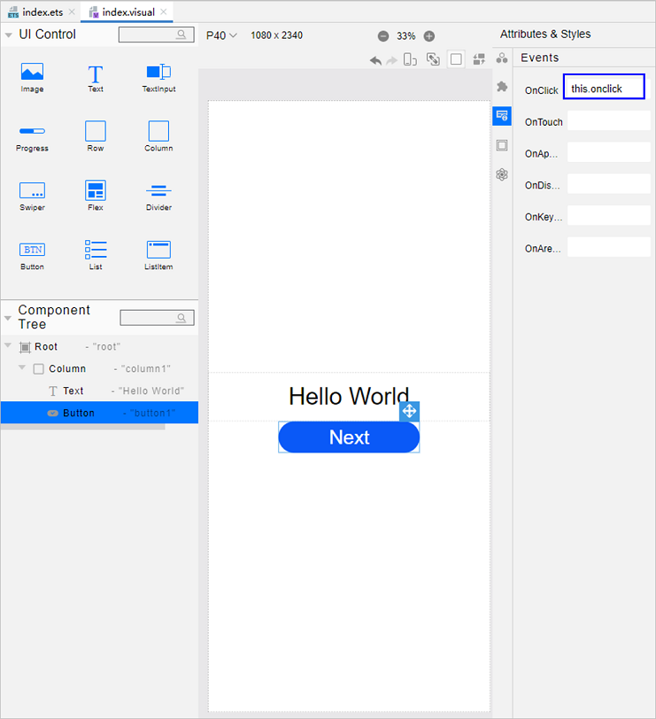
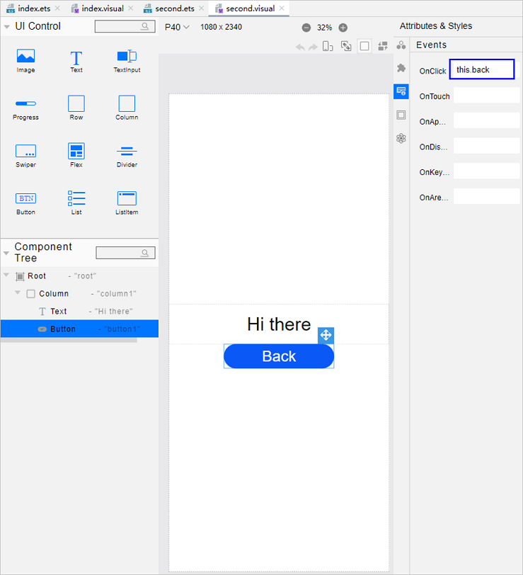
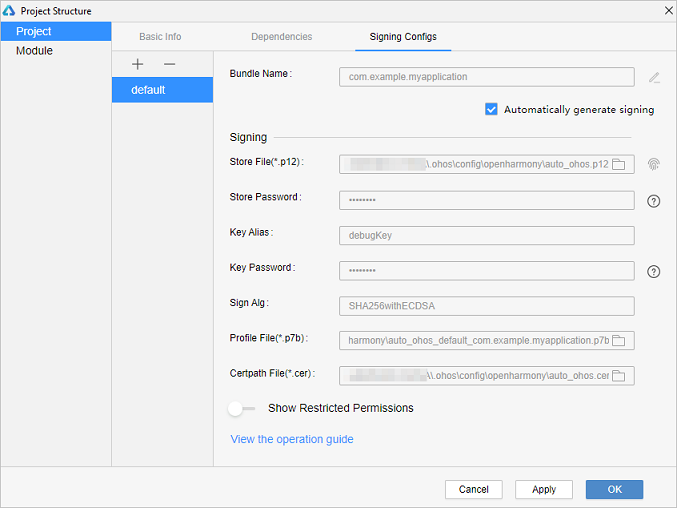
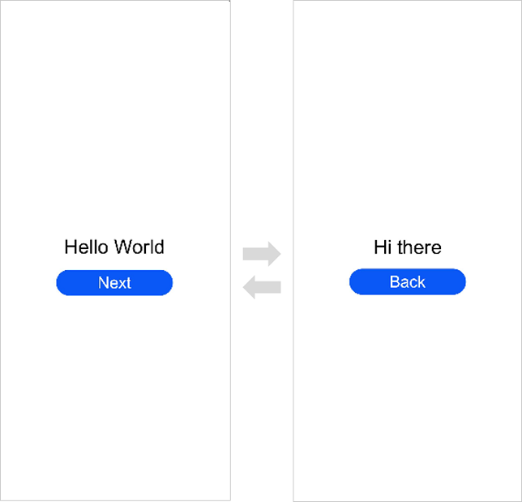

# Getting Started with eTS in the Low-Code Approach

>  **NOTE**<br/>This feature is supported in DevEco Studio V3.0 Beta3 and later versions.
>
> The component lineup that supports low-code development in eTS is now at its preliminary stage and will be expanding in coming versions.
>
> For best possible results, use [DevEco Studio V3.0.0.900 Beta3](https://developer.harmonyos.com/cn/develop/deveco-studio#download_beta_openharmony) for your development.


On the OpenHarmony low-code development pages, you can design your application UI in an efficient, intuitive manner, with a wide array of UI editing features.


You can develop applications or services in the low-code approach using either of the following methods:


- Create a project that supports low-code development. This method is used as an example in this topic.

- In an existing project, create a .visual file for development.


## Creating a Project That Supports Low-Code Development

1. In DevEco Studio, if no project is open, click **Create Project**; if a project is already open, choose **File** &gt; **New** &gt; **Create Project**. Then, select **Empty Ability** and click **Next**.

   

2. Go to the project configuration page, select **Enable Super Visual**, set **UI Syntax** to **eTS**, and retain the default values for other parameters.

   

3. Click **Finish**. DevEco Studio will automatically generate the sample code and resources that match your project type. Wait until the project is created.


## Low-code Project Files

After the project synchronization is complete, a low-code directory structure is automatically generated in the project, as shown below.



- **entry &gt; src &gt; main &gt; ets &gt; MainAbility &gt; pages &gt; index.ets**: defines logical relationships, such as data and events, used on low-code pages. For details, see [About Syntactic Sugar](../ui/ts-syntactic-sugar.md). If multiple low-code development pages are created, a page folder and the corresponding **.ets** file will be created for each of these pages.

- **entry &gt; src &gt; main &gt; supervisual &gt; MainAbility &gt; pages &gt; index.visual**: stores the data model of the low-code development page. You can double-click the file to open the low-code development page. If multiple low-code development pages are created, a page folder and the corresponding **.visual** file will be created for each of these pages.


## Building the First Page

After the project synchronization is complete, the default first page contains the **Column** and **Text** (**Hello World**) components. To better understand low-code development, we'll delete these template components from the canvas and set the page from scratch.

Add **Column**, **Text**, and **Button** components to the first page. A column is a container component whose child components are vertically arranged. For details, see [Column](../reference/arkui-ts/ts-container-column.md).

1. Delete the existing template components from the canvas.<a name="delete_origin_content"></a>
   
   Open the **index.visual** file, right-click the existing template components on the canvas, and choose **Delete** from the shortcut menu to delete them. Below is an illustration of the operations.


2. Add a **Column** component and set its styles and attributes.<a name="add_container"></a>

   Drag the **Column** component from the **UI Control** area to the canvas. In the **Attributes &amp; Styles** area on the right, click **General** and set **Height** to **100%** so that the component fills the entire screen. Click **Feature** and set **AlignItems** to **center** so that the child components of the **Column** component are centered along the horizontal axis. Below is an illustration of the operations.

   

3. Add a **Text** component.

   Drag the **Text** component from the **UI Control** area to the canvas and then to the center area of the **Column** component. In the **Attributes &amp; Styles** area, click **Feature**, set **Content** of the **Text** component to **this.message** (that is, **Hello World**), set **FontSize** to **30fp**, and set **TextAlign** to **center**. Then, select the **Text** component on the canvas and drag its corners to fully display the text. Below is an illustration of the operations.

   

4. Add a **Button** component.

   Drag the **Button** component from the **UI Control** area to the canvas and then to a position under the **Text** component. In the **Attributes &amp; Styles** area on the right, click **General** and set **Height** of the **Button** component to **40vp**. Click **Feature** and set **Label** to **Next** and **FontSize** to **25fp**. Below is an illustration of the operations.


5. On the toolbar in the upper right corner of the editing window, click **Previewer** to open the Previewer. 

   Below is how the first page looks in the Previewer.

   


## Building the Second Page

1. Create the second page.
   
   In the **Project** window, choose **entry** &gt; **src** &gt; **main** &gt; **ets** &gt; **MainAbility**, right-click the **pages** folder, choose **New** &gt; **Visual**, name the page **second**, and click **Finish**. Below, you can see the structure of the **pages** folder.



2. [Delete the existing template components from the canvas.](#delete_origin_content)

3. [Add a **Column** component and set its styles and attributes.](#add_container)

4. Add a **Text** component.
   - In the **second.ets** file, set the message text content to **Hi there**. The sample code is as follows:
     
      ```ts
      // second.ets
      @Entry
      @Component
      struct Second {
        @State message: string = 'Hi there'
      
        /**
        * In low-code mode, do not add anything to the build function, as it will be
        * overwritten by the content generated by the .visual file in the build phase.
        */
        build() {
      
        }
      }
      ```
   - Drag the **Text** component to the canvas and then to the center area of the **Column** component. In the **Attributes &amp; Styles** area, click **Feature**, set **Content** of the **Text** component to **this.message** (that is, **Hi there**), set **FontSize** to **30fp**, and set **TextAlign** to **center**. Then, select the **Text** component on the canvas and drag its corners to fully display the text. Below is an illustration of the operations.

      

5. Add a **Button** component.

   Drag the **Button** component from the **UI Control** area to the canvas and then to a position under the **Text** component. In the **Attributes &amp; Styles** area on the right, click **General** and set **Height** of the **Button** component to **40vp**. Click **Feature** and set **Value** to **Back** and **FontSize** to **25fp**. Below is an illustration of the operations.

   


## Implementing Page Redirection

You can implement page redirection through the page router, which finds the target page based on the page URL. Import the **router** module and then perform the steps below:

1. Implement redirection from the first page to the second page.
   
   In the files of the first page, bind the **onclick** method to the button so that clicking the button redirects the user to the second page. This operation needs to be completed in both .ets and .visual files.
   
   - In the **index.ets** file:
     
     ```ts
     // index.ets
     import router from '@ohos.router';
     
     @Entry
     @Component
     struct Index {
       @State message: string = 'Hello World'
     
       /**
        * In low-code mode, do not add anything to the build function, as it will be
        * overwritten by the content generated by the .visual file in the build phase.
        */
       onclick() {
         router.push({
           url: 'pages/second', // Specify the page to be redirected to.
         })
       }
     
       build() {
       }
     }
     ```

   - In the **index.visual** file, select the **Button** component on the canvas. In the **Attributes &amp; Styles** area, click **Events** and set **OnClick** to **this.onclick**.

       
   
2. Implement redirection from the second page to the first page.

   In the files of the second page, bind the **back** method to the **Back** button so that clicking the button redirects the user back to the first page. This operation needs to be completed in both .ets and .visual files.

   - In the **second.ets** file:
     
      ```ts
      // second.ets
      import router from '@ohos.router';
      
      @Entry
      @Component
      struct Second {
        @State message: string = 'Hi there'
      
        /**
        * In low-code mode, do not add anything to the build function, as it will be
        * overwritten by the content generated by the .visual file in the build phase.
        */
        back() {
          router.back()
        }
      
        build() {
      
        }
      }
      ```
   - In the **second.visual** file, select the **Button** component on the canvas. In the **Attributes &amp; Styles** area, click **Events** and set **OnClick** to **this.back**.

      

3. Open the **index.visual** or **index.ets** file and click  in the Previewer to refresh the file. The figure below shows the effect.

   


## Running the Application on a Real Device

1. Connect the development board running the OpenHarmony standard system to the computer.

2. Choose **File** &gt; **Project Structure** &gt; **Project** &gt; **Signing Configs**, select **Automatically generate signing**, wait until the automatic signing is complete, and click **OK**, as shown below.

   

3. On the toolbar in the upper right corner of the editing window, click . The display effect is shown in the figure below.

   

Congratulations! You have finished developing your OpenHarmony application in eTS in the low-code approach. To learn more about OpenHarmony, see [OpenHarmony Overview](../application-dev-guide.md).
